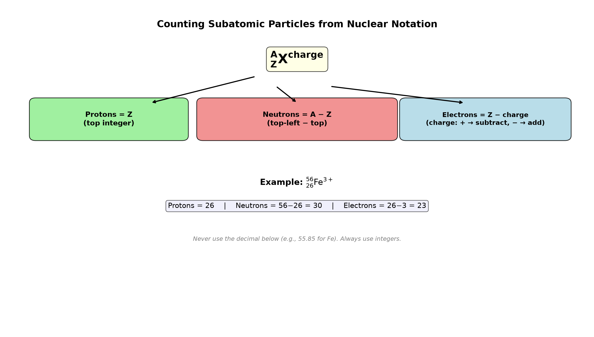

# Session 01: Counting Particles Inside an Atom

**Phase 1 — Stoichiometry | 20 min**
**Method:** Top integer = protons. Top left − top integer = neutrons. Top integer − top-right charge = electrons.

---

## Getting Started

Open your periodic table. Each box shows three numbers.

```
Top left: mass number (integer)
Center top: atomic number (integer)   ← the top integer in the periodic table box
Center bottom: average atomic mass (decimal)
```

Ions have a charge written at the top right of the symbol. Example: $\text{Fe}^{3+}$, $\text{O}^{2-}$.

Using these numbers on the paper, count the particles inside a single atom. All you need is addition and subtraction.

---

## ① Number of Protons — Copy the Top Integer As Is

The **top integer** in the periodic table box is the number of protons. No calculation. Just copy it down.

| Element | Top Integer | Protons |
|:---:|:------:|:-----:|
| H | 1 | 1 |
| C | 6 | 6 |
| Na | 11 | 11 |
| Fe | 26 | 26 |

---

## ② Number of Neutrons — Subtract the Top Integer from the Top Left

**Top-left number − top integer = number of neutrons.**

Caution: do not use the decimal below (like 35.45). Always use the top-left integer.

| Notation | Top Left | Top Integer | Subtract | Neutrons |
|:---:|:----:|:---:|:---:|:---:|
| $^{12}_{\ 6}\text{C}$ | 12 | 6 | 12−6 | 6 |
| $^{14}_{\ 6}\text{C}$ | 14 | 6 | 14−6 | 8 |
| $^{23}_{11}\text{Na}$ | 23 | 11 | 23−11 | 12 |
| $^{238}_{\ 92}\text{U}$ | 238 | 92 | 238−92 | 146 |

---

## ③ Number of Electrons — Subtract the Top-Right Charge from the Top Integer

No charge (neutral): electrons = top integer, as is.
Charge is $+$: subtract that number from the top integer.
Charge is $-$: add that number to the top integer.

- $\text{Fe}^{3+}$: top integer 26, top-right +3 → $26 - 3 = 23$ electrons
- $\text{O}^{2-}$: top integer 8, top-right −2 → $8 + 2 = 10$ electrons

---

## Common Mistakes

Mistaking the **decimal below** (35.45) on the periodic table for the top-left number when calculating neutrons. The neutron count always comes out as an integer. Ignore the decimal below.

---

## Exercise 1

$^{31}_{15}\text{P}$ (neutral). Protons, neutrons, electrons?

> Solutions: [Solution Set](solutions/01-solutions.md#exercise-1)

---

## Exercise 2

$^{56}_{26}\text{Fe}$ (neutral). Protons, neutrons, electrons?

> Solutions: [Solution Set](solutions/01-solutions.md#exercise-2)

---

## Exercise 3

Find the number of protons, neutrons, and electrons for each.
(a) $^{24}_{12}\text{Mg}^{2+}$
(b) $^{32}_{16}\text{S}^{2-}$
(c) $^{40}_{20}\text{Ca}^{2+}$

> Solutions: [Solution Set](solutions/01-solutions.md#exercise-3)

---

## Exercise 4

A neutral atom has 19 protons and 20 neutrons. Top-left number? Top integer? Element name?

> Solutions: [Solution Set](solutions/01-solutions.md#exercise-4)

---

## Exercise 5

$^{79}_{35}\text{Br}^-$ and $^{80}_{35}\text{Br}^-$. Find protons, neutrons, and electrons for each. Write what's the same and what's different.

> Solutions: [Solution Set](solutions/01-solutions.md#exercise-5)

---

## Exercise 6: Challenge

Top integer is 29. Two versions exist with top-left 63 and 65, in a 3:1 ratio.
(a) Element name?
(b) Neutron count for each?
(c) When the top-left-63 version has a $2+$ charge, how many electrons?
(d) Why is the decimal below on the periodic table 63.5?

> Solutions: [Solution Set](solutions/01-solutions.md#exercise-6)

---

## What We Just Did

```
(1) Protons = top integer (atomic number). Just copy it — no math.
(2) Neutrons = top-left integer − top integer. Use integers only, ignore decimals.
(3) Electrons = top integer − charge. Neutral: same as protons. +ion: subtract. −ion: add.
```

---

## Basic Drill — Subatomic Particles (10 Problems)

> Use the three rules: protons = top integer, neutrons = top-left − top integer, electrons = top integer − charge.

**D1.** $^{23}_{11}\text{Na}$ (neutral). Protons, neutrons, electrons?

**D2.** $^{35}_{17}\text{Cl}$ (neutral). Protons, neutrons, electrons?

**D3.** $^{40}_{20}\text{Ca}^{2+}$. Protons, neutrons, electrons?

**D4.** $^{16}_{\ 8}\text{O}^{2-}$. Protons, neutrons, electrons?

**D5.** $^{27}_{13}\text{Al}^{3+}$. Protons, neutrons, electrons?

**D6.** $^{56}_{26}\text{Fe}^{3+}$. Protons, neutrons, electrons?

**D7.** $^{31}_{15}\text{P}^{3-}$. Protons, neutrons, electrons?

**D8.** A neutral atom has 17 protons and 18 neutrons. Write its notation $^{A}_{Z}\text{X}$.

**D9.** $^{39}_{19}\text{K}^+$ and $^{40}_{19}\text{K}^+$. Which has more neutrons? By how many?

**D10.** $^{63}_{29}\text{Cu}^{2+}$ and $^{65}_{29}\text{Cu}^{2+}$. Same protons? Same neutrons? Same electrons?

> Solutions: [Solution Set](solutions/01-solutions.md#basic-drill)

---

## Advanced Drill — Subatomic Particles (10 Problems)

> Think backward. Given particle counts, reconstruct the notation or explain patterns.

**A1.** An ion has 26 protons, 30 neutrons, and 23 electrons. Write its notation $^{A}_{Z}\text{X}^{\text{charge}}$.

**A2.** Two isotopes of chlorine: $^{35}\text{Cl}$ and $^{37}\text{Cl}$. Protons, neutrons, and electrons for each (neutral). What's the same? What's different?

**A3.** A neutral atom has a mass number of 80 and 45 neutrons. Element? Top integer?

**A4.** $^{55}\text{Mn}$ forms $\text{Mn}^{7+}$. How many electrons remain?

**A5.** An ion has 18 electrons and a $3+$ charge. What element is it?

**A6.** $^{48}\text{Ti}^{4+}$ and $^{40}\text{Ca}^{2+}$ — which has more electrons? By how many?

**A7.** Calculate the number of neutrons in $^{238}\text{U}^{6+}$. Does the charge affect the neutron count? Explain.

**A8.** The decimal on the periodic table for chlorine is 35.45. Why is it not a whole number? (Hint: think about isotopes.)

**A9.** An element has two isotopes: 63 amu (69.2%) and 65 amu (30.8%). Calculate the average atomic mass. Which element is this?

**A10.** $^{32}\text{S}^{2-}$ — how many protons, neutrons, and electrons? Compare with $^{40}\text{Ar}$ (neutral). Why do they have the same number of electrons?

> Solutions: [Solution Set](solutions/01-solutions.md#advanced-drill)

---

## Terminology

You already know all the methods. Now just the names.

| What we've been calling it | Term |
|:------:|:---:|
| top integer | atomic number ($Z$) |
| top-left integer | mass number ($A$) |
| decimal below | average atomic mass |
| electrically charged atom | ion / cation / anion |
| same top integer, different top-left | isotope |

---



*Graph: Three rules for counting particles — protons = Z, neutrons = A−Z, electrons = Z−charge.*

---

## Today's Procedure

```
① Copy the top integer as is = protons
② Top left − top integer = neutrons
③ Top integer − top-right charge = electrons
   (no charge → as is, + → subtract, − → add)
```
