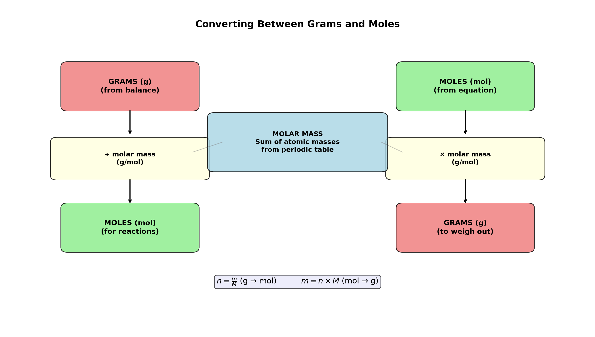

# Session 02: Converting Between Grams and Moles

**Phase 1 — Stoichiometry | 20 min**
**Method:** Divide g by the box number → mol. Multiply mol by the box number → g.

---

## Getting Started

In the lab, you weigh things in grams on a balance. Reaction calculations use moles. There are only two ways to convert between them.

- Divide the balance reading (g) by the periodic table number → you get mol.
- Multiply mol by the periodic table number → you get g.

---

## ① Reading the Box Number — Add by Element

Each box on the periodic table has one number. For a compound, multiply by the atom count for each element, then add.

| Element | Box Number | Compound | Adding Box Numbers |
|:---:|:---:|:---:|:---:|
| H | 1.008 | $\text{H}_2\text{O}$ | 1.008×2 + 16.00 = 18.016 |
| C | 12.01 | $\text{CO}_2$ | 12.01 + 16.00×2 = 44.01 |
| O | 16.00 | $\text{NaCl}$ | 22.99 + 35.45 = 58.44 |
| Fe | 55.85 | $\text{H}_2\text{SO}_4$ | 1.008×2 + 32.07 + 16.00×4 |

---

## ② g → mol: Divide g by the Box Number

**g ÷ box number = mol**

- Carbon 24.02 g, box number 12.01 → $24.02 \div 12.01 = 2.00$ mol
- Water 36.03 g, box number 18.016 → $36.03 \div 18.016 = 2.00$ mol
- NaCl 117 g, box number 58.5 → $117 \div 58.5 = 2.00$ mol

---

## ③ mol → g: Multiply mol by the Box Number

**mol × box number = g**

- Iron 3.50 mol, box number 55.85 → $3.50 \times 55.85 = 195.48$ g
- $\text{CO}_2$ 0.250 mol, box number 44.01 → $0.250 \times 44.01 = 11.00$ g

---

## Common Mistakes

Forgetting subscripts and parentheses when adding box numbers for a compound.

- $\text{Ca(OH)}_2$: Ca ×1, O ×2, H ×2
- $\text{Al}_2(\text{SO}_4)_3$: Al ×2, S ×3, O ×12

---

## Exercise 1

Find the box number. (Na=23.0, Cl=35.5, H=1.0, S=32.1, O=16.0, Ca=40.1, C=12.0)
(a) NaCl (b) $\text{H}_2\text{SO}_4$ (c) $\text{Ca(OH)}_2$ (d) $\text{C}_6\text{H}_{12}\text{O}_6$

> Solutions: [Solution Set](solutions/02-solutions.md#exercise-1)

---

## Exercise 2

Divide g by the box number to find mol. (Na=23.0, O=16.0, H=1.0)
(a) NaCl 117 g (b) $\text{H}_2\text{SO}_4$ 196 g (c) NaOH 80 g

> Solutions: [Solution Set](solutions/02-solutions.md#exercise-2)

---

## Exercise 3

Multiply mol by the box number to find g. (C=12.0, O=16.0)
(a) NaCl 0.500 mol (b) $\text{H}_2\text{O}$ 5.00 mol (c) $\text{CO}_2$ 0.250 mol

> Solutions: [Solution Set](solutions/02-solutions.md#exercise-3)

---

## Exercise 4

$\text{C}_6\text{H}_{12}\text{O}_6$ 45.0 g is how many mol? (C=12.0, H=1.0, O=16.0)

> Solutions: [Solution Set](solutions/02-solutions.md#exercise-4)

---

## Exercise 5

$\text{Al}_2(\text{SO}_4)_3$ 0.200 mol is how many g? (Al=27.0, S=32.1, O=16.0)

> Solutions: [Solution Set](solutions/02-solutions.md#exercise-5)

---

## Exercise 6: Challenge

You need 0.250 mol of NaOH. (Na=23.0, O=16.0, H=1.0, K=39.1)
(a) How many g of NaOH?
(b) If you use KOH instead, how many g?
(c) Same mol, different g — why?

> Solutions: [Solution Set](solutions/02-solutions.md#exercise-6)

---

## What We Just Did

```
(1) Box number = molar mass (g/mol). For compounds, multiply by atom count, then add.
(2) g → mol: Divide grams by the box number. n = m/M.
(3) mol → g: Multiply mol by the box number. m = n × M.
```

---

## Basic Drill — Grams ↔ Moles (10 Problems)

> Use the periodic table values provided.

**D1.** Find the box number of $\text{H}_2\text{O}$. (H=1.0, O=16.0)

**D2.** Find the box number of $\text{Na}_2\text{CO}_3$. (Na=23.0, C=12.0, O=16.0)

**D3.** Convert 36.0 g of $\text{H}_2\text{O}$ to mol. (H=1.0, O=16.0)

**D4.** Convert 88.0 g of $\text{CO}_2$ to mol. (C=12.0, O=16.0)

**D5.** Convert 0.500 mol of NaCl to g. (Na=23.0, Cl=35.5)

**D6.** Convert 2.00 mol of $\text{H}_2\text{SO}_4$ to g. (H=1.0, S=32.1, O=16.0)

**D7.** How many mol in 100.0 g of $\text{CaCO}_3$? (Ca=40.1, C=12.0, O=16.0)

**D8.** What is the mass of 0.750 mol of $\text{C}_6\text{H}_{12}\text{O}_6$? (C=12.0, H=1.0, O=16.0)

**D9.** Which has more mol: 50.0 g of NaCl or 50.0 g of KCl? (Na=23.0, Cl=35.5, K=39.1)

**D10.** Find the box number of $\text{Al}_2(\text{SO}_4)_3$. (Al=27.0, S=32.1, O=16.0)

> Solutions: [Solution Set](solutions/02-solutions.md#basic-drill)

---

## Advanced Drill — Grams ↔ Moles (10 Problems)

> Multi-step, compare, and think in reverse.

**A1.** Convert 5.85 g of NaCl to mol, then to number of formula units (use Avogadro's number: $6.022 \times 10^{23}$). (Na=23.0, Cl=35.5)

**A2.** A sample of $\text{H}_2\text{O}$ contains 0.250 mol. What is its mass? How many molecules is that?

**A3.** You need 0.100 mol of NaOH for a reaction. (a) How many g? (b) If you only have KOH (K=39.1), how many g for the same 0.100 mol? (Na=23.0, O=16.0, H=1.0)

**A4.** Equal masses (10.0 g) of $\text{H}_2$ and $\text{O}_2$ — which contains more molecules? (H=1.0, O=16.0)

**A5.** A hydrate $\text{CuSO}_4 \cdot 5\text{H}_2\text{O}$ has what box number? (Cu=63.5, S=32.1, O=16.0, H=1.0)

**A6.** Convert 0.400 mol of $\text{Fe}_2\text{O}_3$ to g, then find the mass of Fe contained in it. (Fe=55.8, O=16.0)

**A7.** A compound has box number 180.0. A 90.0 g sample contains how many mol? How many moles of carbon if the formula is $\text{C}_6\text{H}_{12}\text{O}_6$?

**A8.** You weigh 15.0 g of an unknown compound with box number 60.0. How many mol? If each molecule contains 2 atoms of element X (box number 16.0), what is the mass of X in the sample?

**A9.** A student needs 0.200 mol of a compound and calculates 11.7 g. What is the compound's box number? If the compound is NaCl, are they correct? (Na=23.0, Cl=35.5)

**A10.** Compare 1.00 mol of $\text{CH}_4$ (C=12.0, H=1.0) with 1.00 mol of $\text{O}_2$ (O=16.0). Which has more mass? Which has more atoms total? Explain the difference.

> Solutions: [Solution Set](solutions/02-solutions.md#advanced-drill)

---

## Terminology

| What we've been calling it | Term |
|:------:|:---:|
| number written in the periodic table box | molar mass ($M$, g/mol) |
| dividing g by the box number | $n = m/M$ |
| multiplying mol by the box number | $m = n \times M$ |

---



*Graph: The two-way conversion — divide by molar mass to go g→mol, multiply to go mol→g. The molar mass is the bridge.*

---

## Today's Procedure

```
① Read the box number. For compounds, add by element.
② g → mol: g ÷ box number.
③ mol → g: mol × box number.
```
