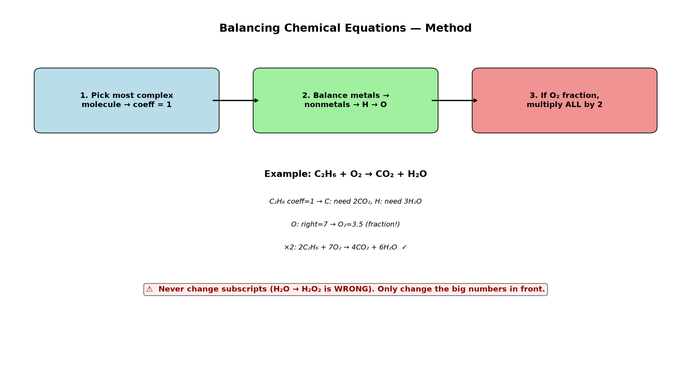

# Session 03: Balancing Reaction Coefficients

**Phase 1 — Stoichiometry | 50 min**
**Method:** Write a 1 in front of the most complex molecule → balance metals → nonmetals → H → O, in that order.

---

## Getting Started

In a reaction equation, the number of atoms on the left of the arrow (reactants) must equal the number on the right (products). Change only the **coefficients in front** of the formulas written on the paper. Never touch the subscripts.

---

## ① Find the Most Complex Molecule and Write a Coefficient of 1

Start with the molecule that has the most types of atoms. Set its coefficient to 1, then determine the other coefficients based on that.

---

## ② Balance in This Order: Metals → Nonmetals → H → O

O comes last because changing the coefficient of $\text{O}_2$ doesn't affect any other element's count.

---

## ③ If the O Count Is Odd, Use a Fraction, Then Multiply Everything by 2 at the End

If a fraction like 3.5 appears in front of $\text{O}_2$, leave it. Once all coefficients are set, multiply everything by 2 to clear the fraction.

---

## Example 1: $\text{N}_2 + \text{H}_2 \rightarrow \text{NH}_3$

Most complex molecule: $\text{NH}_3$ → coefficient 1.

Left N=2, right N=1 → right $\text{NH}_3$ coefficient 2.
$\text{N}_2 + \text{H}_2 \rightarrow 2\text{NH}_3$

Left H=2, right H=6 → left $\text{H}_2$ coefficient 3.
$\text{N}_2 + 3\text{H}_2 \rightarrow 2\text{NH}_3$

Check: N 2=2, H 6=6 ✓

---

## Example 2: $\text{C}_2\text{H}_6 + \text{O}_2 \rightarrow \text{CO}_2 + \text{H}_2\text{O}$

Most complex molecule: $\text{C}_2\text{H}_6$ → coefficient 1.

C: left 2, right 1 → $\text{CO}_2$ coefficient 2.
H: left 6, right 2 → $\text{H}_2\text{O}$ coefficient 3.
$\text{C}_2\text{H}_6 + \text{O}_2 \rightarrow 2\text{CO}_2 + 3\text{H}_2\text{O}$

O: right O=4+3=7. Left $\text{O}_2$ has 2 O each → $7 \div 2 = 3.5$.
$\text{C}_2\text{H}_6 + 3.5\text{O}_2 \rightarrow 2\text{CO}_2 + 3\text{H}_2\text{O}$

Multiply everything by 2: $2\text{C}_2\text{H}_6 + 7\text{O}_2 \rightarrow 4\text{CO}_2 + 6\text{H}_2\text{O}$ ✓

---

## Common Mistakes

Changing the **subscripts** in a formula. Changing $\text{H}_2\text{O}$ to $\text{H}_2\text{O}_2$ makes it hydrogen peroxide — a completely different substance. Only change the **coefficients in front**.

---

## Exercise 1

Balance: $\text{CH}_4 + \text{O}_2 \rightarrow \text{CO}_2 + \text{H}_2\text{O}$

> Solutions: [Solution Set](solutions/03-solutions.md#exercise-1)

---

## Exercise 2

Balance: $\text{H}_2 + \text{O}_2 \rightarrow \text{H}_2\text{O}$

> Solutions: [Solution Set](solutions/03-solutions.md#exercise-2)

---

## Exercise 3

Balance: $\text{Fe} + \text{Cl}_2 \rightarrow \text{FeCl}_3$

> Solutions: [Solution Set](solutions/03-solutions.md#exercise-3)

---

## Exercise 4

Balance: $\text{NaOH} + \text{HCl} \rightarrow \text{NaCl} + \text{H}_2\text{O}$

> Solutions: [Solution Set](solutions/03-solutions.md#exercise-4)

---

## Exercise 5

Balance: $\text{Ca(OH)}_2 + \text{H}_3\text{PO}_4 \rightarrow \text{Ca}_3(\text{PO}_4)_2 + \text{H}_2\text{O}$

> Solutions: [Solution Set](solutions/03-solutions.md#exercise-5)

---

## Exercise 6: Challenge

Balance these combustion reactions. If a fraction appears, multiply everything by 2 at the end.
(a) $\text{C}_3\text{H}_8 + \text{O}_2 \rightarrow \text{CO}_2 + \text{H}_2\text{O}$
(b) $\text{C}_2\text{H}_5\text{OH} + \text{O}_2 \rightarrow \text{CO}_2 + \text{H}_2\text{O}$
(c) $\text{C}_4\text{H}_{10} + \text{O}_2 \rightarrow \text{CO}_2 + \text{H}_2\text{O}$

> Solutions: [Solution Set](solutions/03-solutions.md#exercise-6)

---

## What We Just Did

```
(1) Find the most complex molecule → set coefficient = 1.
(2) Balance in order: metals → nonmetals → H → O (oxygen last).
(3) If O₂ has a fractional coefficient, multiply ALL coefficients by 2 at the end.
(4) Never change subscripts — only change the big numbers in front.
```

---

## Basic Drill — Balancing Equations (10 Problems)

> Balance each equation. Show the final integer coefficients.

**D1.** $\text{H}_2 + \text{Cl}_2 \rightarrow \text{HCl}$

**D2.** $\text{N}_2 + \text{H}_2 \rightarrow \text{NH}_3$

**D3.** $\text{Na} + \text{Cl}_2 \rightarrow \text{NaCl}$

**D4.** $\text{Mg} + \text{O}_2 \rightarrow \text{MgO}$

**D5.** $\text{Fe} + \text{O}_2 \rightarrow \text{Fe}_2\text{O}_3$

**D6.** $\text{Al} + \text{O}_2 \rightarrow \text{Al}_2\text{O}_3$

**D7.** $\text{K} + \text{H}_2\text{O} \rightarrow \text{KOH} + \text{H}_2$

**D8.** $\text{Zn} + \text{HCl} \rightarrow \text{ZnCl}_2 + \text{H}_2$

**D9.** $\text{Li}_2\text{O} + \text{H}_2\text{O} \rightarrow \text{LiOH}$

**D10.** $\text{SO}_2 + \text{O}_2 \rightarrow \text{SO}_3$

> Solutions: [Solution Set](solutions/03-solutions.md#basic-drill)

---

## Advanced Drill — Balancing Equations (10 Problems)

> Combustion, acid-base, and tricky ones. Handle fractions.

**A1.** $\text{CH}_4 + \text{O}_2 \rightarrow \text{CO}_2 + \text{H}_2\text{O}$

**A2.** $\text{C}_2\text{H}_6 + \text{O}_2 \rightarrow \text{CO}_2 + \text{H}_2\text{O}$

**A3.** $\text{C}_3\text{H}_8 + \text{O}_2 \rightarrow \text{CO}_2 + \text{H}_2\text{O}$

**A4.** $\text{C}_4\text{H}_{10} + \text{O}_2 \rightarrow \text{CO}_2 + \text{H}_2\text{O}$

**A5.** $\text{C}_2\text{H}_5\text{OH} + \text{O}_2 \rightarrow \text{CO}_2 + \text{H}_2\text{O}$

**A6.** $\text{H}_3\text{PO}_4 + \text{NaOH} \rightarrow \text{Na}_3\text{PO}_4 + \text{H}_2\text{O}$

**A7.** $\text{Ca(OH)}_2 + \text{HCl} \rightarrow \text{CaCl}_2 + \text{H}_2\text{O}$

**A8.** $\text{Al} + \text{H}_2\text{SO}_4 \rightarrow \text{Al}_2(\text{SO}_4)_3 + \text{H}_2$

**A9.** $\text{NH}_3 + \text{O}_2 \rightarrow \text{NO} + \text{H}_2\text{O}$

**A10.** $\text{Fe}_2\text{O}_3 + \text{CO} \rightarrow \text{Fe} + \text{CO}_2$

> Solutions: [Solution Set](solutions/03-solutions.md#advanced-drill)

---

## Terminology

| What we've been calling it | Term |
|:------:|:---:|
| big number written in front of a molecule | coefficient (stoichiometric coefficient) |
| substances left of the arrow | reactants |
| substances right of the arrow | products |

---



*Graph: Three-step balancing method — pick the complex molecule, balance in order, clear fractions at the end. Never touch subscripts.*

---

## Today's Procedure

```
① Find the most complex molecule → coefficient 1
② Balance left and right counts in order: metals → nonmetals → H → O
③ If a fraction appears for O₂, leave it, then multiply everything by 2 at the end
```
