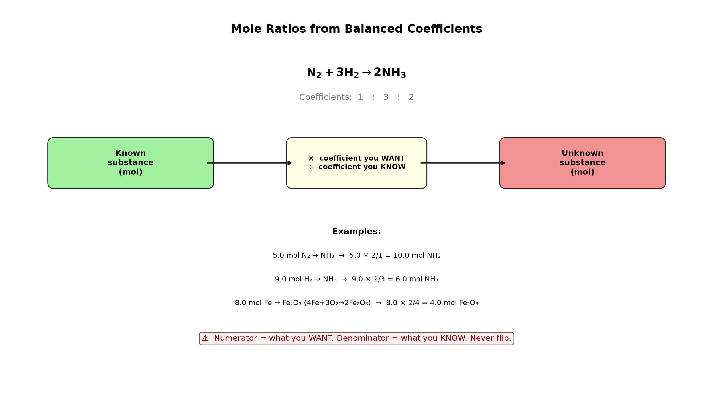

# Session 04: Finding Mole Ratios from Coefficients

**Phase 1 — Stoichiometry | 30 min**
**Method:** Multiply known mol by (coefficient you want ÷ coefficient you know). That gives the mol you're looking for.

---

## Getting Started

In a balanced equation, the coefficients in front of the molecules are the mole ratios.

Look at $2\text{H}_2 + \text{O}_2 \rightarrow 2\text{H}_2\text{O}$.
Coefficients 2 : 1 : 2 → "2 mol of $\text{H}_2$ and 1 mol of $\text{O}_2$ meet to make 2 mol of $\text{H}_2\text{O}$."

If you know the mol of one substance, the mol of any other substance comes from just **multiplying by the coefficient ratio**.

---

## ① Check the Coefficients on Both Sides of the Arrow

$4\text{Fe} + 3\text{O}_2 \rightarrow 2\text{Fe}_2\text{O}_3$

Left Fe coefficient: 4 &nbsp; Left $\text{O}_2$ coefficient: 3 &nbsp; Right $\text{Fe}_2\text{O}_3$ coefficient: 2

---

## ② Multiply Known Mol by (Coefficient You Want ÷ Coefficient You Know)

**mol you want = known mol × (coefficient you want ÷ coefficient you know)**

- Fe 8.0 mol → $\text{Fe}_2\text{O}_3$: $8.0 \times \dfrac{2}{4} = 4.0$ mol
- $\text{O}_2$ 6.0 mol → $\text{Fe}_2\text{O}_3$: $6.0 \times \dfrac{2}{3} = 4.0$ mol
- Fe 8.0 mol → $\text{O}_2$ needed: $8.0 \times \dfrac{3}{4} = 6.0$ mol

---

## Common Mistakes

Flipping the fraction. **Numerator = coefficient of the substance you want**, **denominator = coefficient of the substance you know**.

---

## Exercise 1

In $\text{N}_2 + 3\text{H}_2 \rightarrow 2\text{NH}_3$:
(a) $\text{N}_2$ 5.0 mol → $\text{NH}_3$ how many mol?
(b) $\text{H}_2$ 9.0 mol → $\text{NH}_3$ how many mol?

> Solutions: [Solution Set](solutions/04-solutions.md#exercise-1)

---

## Exercise 2

In $\text{C}_3\text{H}_8 + 5\text{O}_2 \rightarrow 3\text{CO}_2 + 4\text{H}_2\text{O}$:
(a) $\text{C}_3\text{H}_8$ 2.5 mol → $\text{CO}_2$?
(b) $\text{CO}_2$ 15 mol → $\text{O}_2$ needed?
(c) $\text{C}_3\text{H}_8$ 1.0 mol → $\text{H}_2\text{O}$?

> Solutions: [Solution Set](solutions/04-solutions.md#exercise-2)

---

## Exercise 3

$4\text{Al} + 3\text{O}_2 \rightarrow 2\text{Al}_2\text{O}_3$:
(a) Al 10.0 mol → $\text{Al}_2\text{O}_3$?
(b) $\text{O}_2$ 1.50 mol → $\text{Al}_2\text{O}_3$?
(c) Al 10.0 mol → $\text{O}_2$ needed?

> Solutions: [Solution Set](solutions/04-solutions.md#exercise-3)

---

## Exercise 4

$2\text{KClO}_3 \rightarrow 2\text{KCl} + 3\text{O}_2$
$\text{KClO}_3$ 4.50 mol → KCl? $\text{O}_2$?

> Solutions: [Solution Set](solutions/04-solutions.md#exercise-4)

---

## Exercise 5

$\text{Ca(OH)}_2 + 2\text{HCl} \rightarrow \text{CaCl}_2 + 2\text{H}_2\text{O}$
To make 2.0 mol of $\text{CaCl}_2$, how many mol of HCl?

> Solutions: [Solution Set](solutions/04-solutions.md#exercise-5)

---

## Exercise 6: Challenge

Glucose fermentation: $\text{C}_6\text{H}_{12}\text{O}_6 \rightarrow 2\text{C}_2\text{H}_5\text{OH} + 2\text{CO}_2$
(a) 5.00 mol glucose → $\text{CO}_2$ how many mol?
(b) 20.0 mol $\text{CO}_2$ → glucose how many mol?
(c) 8.00 mol ethanol produced → $\text{CO}_2$ how many mol?

> Solutions: [Solution Set](solutions/04-solutions.md#exercise-6)

---

## What We Just Did

```
(1) Read coefficients from the balanced equation.
(2) mol you want = known mol × (coefficient you want ÷ coefficient you know).
(3) Numerator = what you want. Denominator = what you know. Never flip the fraction.
```

---

## Basic Drill — Mole Ratios (10 Problems)

> Use the balanced equation given. Apply: mol = known × (want ÷ know).

**D1.** $\text{N}_2 + 3\text{H}_2 \rightarrow 2\text{NH}_3$. 4.0 mol $\text{N}_2$ → mol $\text{NH}_3$?

**D2.** $\text{N}_2 + 3\text{H}_2 \rightarrow 2\text{NH}_3$. 9.0 mol $\text{H}_2$ → mol $\text{NH}_3$?

**D3.** $2\text{H}_2 + \text{O}_2 \rightarrow 2\text{H}_2\text{O}$. 5.0 mol $\text{H}_2$ → mol $\text{H}_2\text{O}$?

**D4.** $2\text{H}_2 + \text{O}_2 \rightarrow 2\text{H}_2\text{O}$. 3.0 mol $\text{O}_2$ → mol $\text{H}_2\text{O}$?

**D5.** $\text{CH}_4 + 2\text{O}_2 \rightarrow \text{CO}_2 + 2\text{H}_2\text{O}$. 2.0 mol $\text{CH}_4$ → mol $\text{CO}_2$?

**D6.** $4\text{Fe} + 3\text{O}_2 \rightarrow 2\text{Fe}_2\text{O}_3$. 8.0 mol Fe → mol $\text{Fe}_2\text{O}_3$?

**D7.** $\text{C}_3\text{H}_8 + 5\text{O}_2 \rightarrow 3\text{CO}_2 + 4\text{H}_2\text{O}$. 1.5 mol $\text{C}_3\text{H}_8$ → mol $\text{CO}_2$?

**D8.** $2\text{KClO}_3 \rightarrow 2\text{KCl} + 3\text{O}_2$. 4.0 mol $\text{KClO}_3$ → mol $\text{O}_2$?

**D9.** $\text{Ca(OH)}_2 + 2\text{HCl} \rightarrow \text{CaCl}_2 + 2\text{H}_2\text{O}$. 0.50 mol $\text{Ca(OH)}_2$ → mol HCl needed?

**D10.** $2\text{Al} + 3\text{Cl}_2 \rightarrow 2\text{AlCl}_3$. 6.0 mol Al → mol $\text{Cl}_2$ needed?

> Solutions: [Solution Set](solutions/04-solutions.md#basic-drill)

---

## Advanced Drill — Mole Ratios (10 Problems)

> Work backward, compare ratios, and handle multi-step reasoning.

**A1.** $\text{N}_2 + 3\text{H}_2 \rightarrow 2\text{NH}_3$. How many mol of $\text{N}_2$ are needed to make 10.0 mol $\text{NH}_3$?

**A2.** $2\text{H}_2 + \text{O}_2 \rightarrow 2\text{H}_2\text{O}$. 10.0 mol of $\text{H}_2\text{O}$ was produced. How many mol of $\text{H}_2$ and $\text{O}_2$ were consumed?

**A3.** $4\text{Fe} + 3\text{O}_2 \rightarrow 2\text{Fe}_2\text{O}_3$. You have 8.0 mol Fe and 9.0 mol $\text{O}_2$. Which will produce more $\text{Fe}_2\text{O}_3$? (Compare potential product amounts.)

**A4.** $\text{C}_3\text{H}_8 + 5\text{O}_2 \rightarrow 3\text{CO}_2 + 4\text{H}_2\text{O}$. 2.0 mol $\text{C}_3\text{H}_8$ produces how many TOTAL mol of products ($\text{CO}_2$ + $\text{H}_2\text{O}$)?

**A5.** $\text{Ca(OH)}_2 + 2\text{HCl} \rightarrow \text{CaCl}_2 + 2\text{H}_2\text{O}$. To make 0.75 mol $\text{CaCl}_2$, how many mol of each reactant?

**A6.** $2\text{Al} + 3\text{Cl}_2 \rightarrow 2\text{AlCl}_3$. If 10.0 mol $\text{AlCl}_3$ is produced, how many mol of Al and $\text{Cl}_2$ were consumed?

**A7.** $\text{C}_6\text{H}_{12}\text{O}_6 \rightarrow 2\text{C}_2\text{H}_5\text{OH} + 2\text{CO}_2$. 3.00 mol glucose → mol ethanol? mol $\text{CO}_2$? Which ratio is 1:2 and which is 1:2?

**A8.** $\text{Fe}_2\text{O}_3 + 3\text{CO} \rightarrow 2\text{Fe} + 3\text{CO}_2$. If 1.50 mol $\text{Fe}_2\text{O}_3$ reacts, how many mol of CO are consumed AND how many mol of Fe + $\text{CO}_2$ are produced total?

**A9.** $2\text{NaN}_3 \rightarrow 2\text{Na} + 3\text{N}_2$ (airbag reaction). How many mol of $\text{N}_2$ gas from 6.5 mol $\text{NaN}_3$?

**A10.** In $2\text{NH}_3 \rightarrow \text{N}_2 + 3\text{H}_2$, the coefficient of $\text{NH}_3$ is 2. If you decompose 1.0 mol $\text{NH}_3$, how many TOTAL mol of gas ($\text{N}_2 + \text{H}_2$) are produced? Explain why the total mol increases.

> Solutions: [Solution Set](solutions/04-solutions.md#advanced-drill)

---

## Terminology

| What we've been calling it | Term |
|:------:|:---:|
| ratio between coefficients | stoichiometric ratio |
| mol you want = known mol × (coefficient you want ÷ coefficient you know) | $\text{mol}_B = \text{mol}_A \times (b/a)$ |

---



*Graph: The mole ratio bridge — known mol × (want ÷ know) = unknown mol. Numerator = target substance's coefficient. Denominator = known substance's coefficient.*

---

## Today's Procedure

```
① Check all coefficients in the equation.
② Known mol × (coefficient you want ÷ coefficient you know) = mol you want.
③ Numerator = what you want, denominator = what you know — don't flip it.
```
