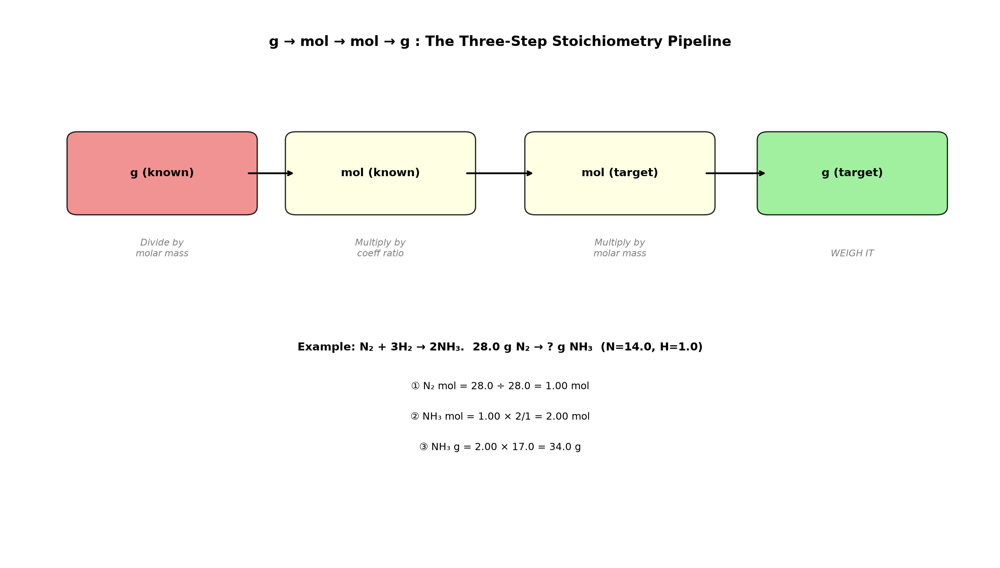

# Session 05: g → mol → mol → g

**Phase 1 — Stoichiometry | 60 min**
**Method:** Divide g by the box number → multiply by the coefficient ratio → multiply by the box number. Three steps, one direction.

---

## Getting Started

Connect Session 02 (g↔mol) with Session 04 (coefficient ratios). Start from grams measured on a balance, convert to moles, use the coefficient ratio to find moles of another substance, then convert back to grams. Three operations in one direction — that's it.

---

## The Full Flow

```
g (known substance) → ÷ box number → mol → × coefficient ratio → mol → × box number → g (target substance)
```

---

## ① Divide g by the Box Number (g → mol)

Same as Session 02. Divide the grams of the known substance by its box number.

---

## ② Multiply by the Coefficient Ratio (mol → mol)

Same as Session 04. Multiply the known substance's mol by (coefficient you want ÷ coefficient you know).

---

## ③ Multiply by the Box Number (mol → g)

Multiply the mol you found by the target substance's box number.

---

## Example

$\text{N}_2 + 3\text{H}_2 \rightarrow 2\text{NH}_3$. 28.0 g of $\text{N}_2$ reacts with excess $\text{H}_2$. How many g of $\text{NH}_3$?

Box numbers: $\text{N}_2$ = 28.02, $\text{NH}_3$ = 17.034

① $\text{N}_2$ mol = $28.0 \div 28.02 = 1.00$ mol
② $\text{NH}_3$ mol = $1.00 \times \dfrac{2}{1} = 2.00$ mol
③ $\text{NH}_3$ g = $2.00 \times 17.034 = 34.1$ g

---

## Common Mistakes

Applying the coefficient ratio in the wrong direction. When going "reactant g → product g", the product coefficient goes in the numerator and the reactant coefficient in the denominator.

---

## Exercise 1

$2\text{Mg} + \text{O}_2 \rightarrow 2\text{MgO}$. Mg 48.6 g → MgO g? (Mg=24.3, O=16.0)

> Solutions: [Solution Set](solutions/05-solutions.md#exercise-1)

---

## Exercise 2

$\text{C} + \text{O}_2 \rightarrow \text{CO}_2$. C 6.0 g → $\text{CO}_2$ g? (C=12.0, O=16.0)

> Solutions: [Solution Set](solutions/05-solutions.md#exercise-2)

---

## Exercise 3

$\text{CaCO}_3 \rightarrow \text{CaO} + \text{CO}_2$. $\text{CaCO}_3$ 50.0 g → CaO g? (Ca=40.1, C=12.0, O=16.0)

> Solutions: [Solution Set](solutions/05-solutions.md#exercise-3)

---

## Exercise 4

$2\text{H}_2 + \text{O}_2 \rightarrow 2\text{H}_2\text{O}$. $\text{O}_2$ 16.0 g → $\text{H}_2\text{O}$ g? (H=1.0, O=16.0)

> Solutions: [Solution Set](solutions/05-solutions.md#exercise-4)

---

## Exercise 5

$\text{Fe}_2\text{O}_3 + 3\text{CO} \rightarrow 2\text{Fe} + 3\text{CO}_2$. $\text{Fe}_2\text{O}_3$ 80.0 g → Fe g? (Fe=55.8, O=16.0)

> Solutions: [Solution Set](solutions/05-solutions.md#exercise-5)

---

## Exercise 6: Challenge

$\text{C}_3\text{H}_8 + 5\text{O}_2 \rightarrow 3\text{CO}_2 + 4\text{H}_2\text{O}$. $\text{C}_3\text{H}_8$ 22.0 g → $\text{CO}_2$ g? $\text{H}_2\text{O}$ g? (C=12.0, H=1.0, O=16.0)

> Solutions: [Solution Set](solutions/05-solutions.md#exercise-6)

---

## What We Just Did

```
(1) g → mol: Divide known grams by its box number.
(2) mol → mol: Multiply by (coefficient you want ÷ coefficient you know).
(3) mol → g: Multiply by the target substance's box number.
    Three steps, one direction. Never skip a step.
```

---

## Basic Drill — g→mol→mol→g (10 Problems)

> Run the three-step procedure. Show intermediate mol values.

**D1.** $2\text{Mg} + \text{O}_2 \rightarrow 2\text{MgO}$. Mg 12.15 g → MgO g? (Mg=24.3, O=16.0)

**D2.** $\text{C} + \text{O}_2 \rightarrow \text{CO}_2$. C 3.0 g → $\text{CO}_2$ g? (C=12.0, O=16.0)

**D3.** $2\text{Na} + \text{Cl}_2 \rightarrow 2\text{NaCl}$. Na 11.5 g → NaCl g? (Na=23.0, Cl=35.5)

**D4.** $\text{N}_2 + 3\text{H}_2 \rightarrow 2\text{NH}_3$. $\text{N}_2$ 14.0 g → $\text{NH}_3$ g? (N=14.0, H=1.0)

**D5.** $2\text{H}_2 + \text{O}_2 \rightarrow 2\text{H}_2\text{O}$. $\text{H}_2$ 4.0 g → $\text{H}_2\text{O}$ g? (H=1.0, O=16.0)

**D6.** $\text{S} + \text{O}_2 \rightarrow \text{SO}_2$. S 16.0 g → $\text{SO}_2$ g? (S=32.1, O=16.0)

**D7.** $\text{CaCO}_3 \rightarrow \text{CaO} + \text{CO}_2$. $\text{CaCO}_3$ 25.0 g → CaO g? (Ca=40.1, C=12.0, O=16.0)

**D8.** $4\text{Fe} + 3\text{O}_2 \rightarrow 2\text{Fe}_2\text{O}_3$. Fe 27.9 g → $\text{Fe}_2\text{O}_3$ g? (Fe=55.8, O=16.0)

**D9.** $\text{CH}_4 + 2\text{O}_2 \rightarrow \text{CO}_2 + 2\text{H}_2\text{O}$. $\text{CH}_4$ 8.0 g → $\text{CO}_2$ g? (C=12.0, H=1.0, O=16.0)

**D10.** $2\text{Al} + 3\text{Cl}_2 \rightarrow 2\text{AlCl}_3$. Al 13.5 g → $\text{AlCl}_3$ g? (Al=27.0, Cl=35.5)

> Solutions: [Solution Set](solutions/05-solutions.md#basic-drill)

---

## Advanced Drill — g→mol→mol→g (10 Problems)

> Multi-step, backward, and comparison problems.

**A1.** $2\text{H}_2 + \text{O}_2 \rightarrow 2\text{H}_2\text{O}$. How many g of $\text{H}_2$ are needed to make 36.0 g of $\text{H}_2\text{O}$? (H=1.0, O=16.0)

**A2.** $\text{Fe}_2\text{O}_3 + 3\text{CO} \rightarrow 2\text{Fe} + 3\text{CO}_2$. $\text{Fe}_2\text{O}_3$ 80.0 g → Fe g? (Fe=55.8, O=16.0, C=12.0)

**A3.** $\text{C}_3\text{H}_8 + 5\text{O}_2 \rightarrow 3\text{CO}_2 + 4\text{H}_2\text{O}$. $\text{C}_3\text{H}_8$ 22.0 g → total g of $\text{CO}_2$ + $\text{H}_2\text{O}$? (C=12.0, H=1.0, O=16.0)

**A4.** $2\text{NaCl} \rightarrow 2\text{Na} + \text{Cl}_2$. How many g of NaCl produce 35.5 g of $\text{Cl}_2$? (Na=23.0, Cl=35.5)

**A5.** $\text{N}_2 + 3\text{H}_2 \rightarrow 2\text{NH}_3$. You need 51.0 g $\text{NH}_3$. How many g of $\text{N}_2$ and $\text{H}_2$ are needed? (N=14.0, H=1.0)

**A6.** $2\text{HgO} \rightarrow 2\text{Hg} + \text{O}_2$. 43.4 g HgO → Hg g? $\text{O}_2$ g? (Hg=200.6, O=16.0)

**A7.** $\text{CH}_4 + 2\text{O}_2 \rightarrow \text{CO}_2 + 2\text{H}_2\text{O}$. The same mass (16.0 g) of $\text{CH}_4$ and $\text{O}_2$ — why is this question meaningless? (Hint: check the mole ratio.)

**A8.** $\text{C}_6\text{H}_{12}\text{O}_6 + 6\text{O}_2 \rightarrow 6\text{CO}_2 + 6\text{H}_2\text{O}$. 90.0 g glucose → $\text{CO}_2$ g? $\text{H}_2\text{O}$ g? (C=12.0, H=1.0, O=16.0)

**A9.** $2\text{Al} + \text{Fe}_2\text{O}_3 \rightarrow \text{Al}_2\text{O}_3 + 2\text{Fe}$ (thermite reaction). Al 27.0 g → Fe g? (Al=27.0, Fe=55.8, O=16.0)

**A10.** Ammonia is produced via $\text{N}_2 + 3\text{H}_2 \rightarrow 2\text{NH}_3$. A factory needs 1.00 kg (1000 g) of $\text{NH}_3$. How many kg of $\text{N}_2$ and $\text{H}_2$? (N=14.0, H=1.0)

> Solutions: [Solution Set](solutions/05-solutions.md#advanced-drill)

---

## Terminology

| What we've been calling it | Term |
|:------:|:---:|
| three-step calculation from g to g | mass-mass stoichiometry |

---



*Graph: The g→mol→mol→g pipeline. Three operations in one direction: divide, multiply by ratio, multiply. Never skip a step.*

---

## Today's Procedure

```
① g ÷ box number → mol (known substance)
② mol × (coefficient you want ÷ coefficient you know) → mol (target substance)
③ mol × box number → g (target substance)
```
