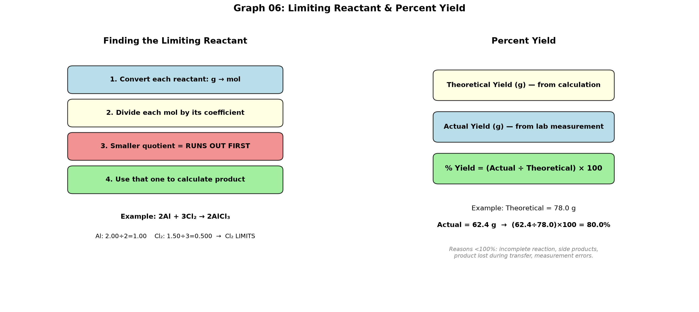

# Session 06: Finding What Runs Out First + Calculating What You Actually Got

**Phase 1 — Stoichiometry | 100 min**

**Method 1:** Divide each reactant's mol by its coefficient. The smaller quotient is the one that runs out first.
**Method 2:** (actual g ÷ calculated g) × 100.

---

## Getting Started

When there are two or more reactants, one of them gets used up first. You need to find which one it is to know where the reaction stops. Use that one to calculate how much product forms, then compare with what you actually obtained in the lab.

---

## Part A: Finding What Runs Out First

### ① Divide each reactant's g by its box number to find mol

### ② Divide each mol by its coefficient

mol ÷ coefficient. The smaller value is the one that runs out first.

### ③ Use that one's mol to calculate the product mol

---

### Example

$2\text{Al} + 3\text{Cl}_2 \rightarrow 2\text{AlCl}_3$. Al 54.0 g, $\text{Cl}_2$ 106.5 g.

Al: box number 27.0, mol = $54.0 \div 27.0 = 2.00$. mol÷coefficient = $2.00 \div 2 = 1.00$
$\text{Cl}_2$: box number 71.0, mol = $106.5 \div 71.0 = 1.50$. mol÷coefficient = $1.50 \div 3 = 0.500$

0.500 is smaller than 1.00 → $\text{Cl}_2$ runs out first.
$\text{AlCl}_3$ mol = $1.50 \times \dfrac{2}{3} = 1.00$ mol

---

## Part B: Actual Got ÷ Calculated

### (actual g ÷ calculated g) × 100 = percent

Calculated = the product g you found in Part A.
Actual = the g you measured on the balance in the lab.

Example: calculated 78.0 g, actual 62.4 g → $(62.4 \div 78.0) \times 100 = 80.0\%$.

---

## Common Mistakes

Looking only at grams and thinking "this one has fewer grams, so it must run out first." You can't know until you convert to mol and divide by the coefficient.

---

## Exercise 1

$\text{N}_2 + 3\text{H}_2 \rightarrow 2\text{NH}_3$. $\text{N}_2$ 28.0 g, $\text{H}_2$ 6.0 g. Which runs out first? Calculated g of $\text{NH}_3$? (N=14.0, H=1.0)

> Solutions: [Solution Set](solutions/06-solutions.md#exercise-1)

---

## Exercise 2

$2\text{H}_2 + \text{O}_2 \rightarrow 2\text{H}_2\text{O}$. $\text{H}_2$ 10.0 g, $\text{O}_2$ 64.0 g. Which runs out first? Calculated g of $\text{H}_2\text{O}$? (H=1.0, O=16.0)

> Solutions: [Solution Set](solutions/06-solutions.md#exercise-2)

---

## Exercise 3

$\text{CH}_4 + 2\text{O}_2 \rightarrow \text{CO}_2 + 2\text{H}_2\text{O}$. $\text{CH}_4$ 16.0 g, $\text{O}_2$ 48.0 g. Which runs out first? Calculated g of $\text{CO}_2$? (C=12.0, H=1.0, O=16.0)

> Solutions: [Solution Set](solutions/06-solutions.md#exercise-3)

---

## Exercise 4

$\text{Fe}_2\text{O}_3 + 3\text{CO} \rightarrow 2\text{Fe} + 3\text{CO}_2$. $\text{Fe}_2\text{O}_3$ 80.0 g, CO 42.0 g. Which runs out first? Calculated g of Fe? (Fe=55.8, O=16.0, C=12.0)

> Solutions: [Solution Set](solutions/06-solutions.md#exercise-4)

---

## Exercise 5

In Exercise 4, the actual Fe obtained is 39.1 g. What is the percent?

> Solutions: [Solution Set](solutions/06-solutions.md#exercise-5)

---

## Exercise 6: Challenge

$\text{C}_3\text{H}_8 + 5\text{O}_2 \rightarrow 3\text{CO}_2 + 4\text{H}_2\text{O}$. $\text{C}_3\text{H}_8$ 44.0 g, $\text{O}_2$ 128.0 g. (C=12.0, H=1.0, O=16.0)
(a) Which runs out first?
(b) Calculated g of $\text{CO}_2$?
(c) If 99.0 g of $\text{CO}_2$ was obtained, what is the percent?

> Solutions: [Solution Set](solutions/06-solutions.md#exercise-6)

---

## What We Just Did

```
(1) Limiting reactant: g→mol for each reactant → mol÷coefficient → smallest quotient runs out.
(2) Use the limiting reactant's mol to calculate theoretical product mass (g→mol→mol→g).
(3) Percent yield = (actual g ÷ theoretical g) × 100.
```

---

## Basic Drill — Limiting Reactant & Percent Yield (10 Problems)

> Find the limiting reactant. Calculate theoretical yield. Then percent yield if actual is given.

**D1.** $\text{N}_2 + 3\text{H}_2 \rightarrow 2\text{NH}_3$. $\text{N}_2$ 14.0 g, $\text{H}_2$ 4.0 g. Limiting reactant? g $\text{NH}_3$? (N=14.0, H=1.0)

**D2.** $2\text{H}_2 + \text{O}_2 \rightarrow 2\text{H}_2\text{O}$. $\text{H}_2$ 4.0 g, $\text{O}_2$ 16.0 g. Limiting reactant? g $\text{H}_2\text{O}$? (H=1.0, O=16.0)

**D3.** $\text{CH}_4 + 2\text{O}_2 \rightarrow \text{CO}_2 + 2\text{H}_2\text{O}$. $\text{CH}_4$ 8.0 g, $\text{O}_2$ 48.0 g. Limiting reactant? g $\text{CO}_2$? (C=12.0, H=1.0, O=16.0)

**D4.** $2\text{Mg} + \text{O}_2 \rightarrow 2\text{MgO}$. Mg 12.15 g, $\text{O}_2$ 16.0 g. Limiting reactant? g MgO? (Mg=24.3, O=16.0)

**D5.** $4\text{Fe} + 3\text{O}_2 \rightarrow 2\text{Fe}_2\text{O}_3$. Fe 55.8 g, $\text{O}_2$ 24.0 g. Limiting reactant? (Fe=55.8, O=16.0)

**D6.** In D1, actual $\text{NH}_3$ obtained = 12.0 g. Percent yield?

**D7.** In D2, actual $\text{H}_2\text{O}$ obtained = 15.0 g. Percent yield?

**D8.** $2\text{Al} + 3\text{Cl}_2 \rightarrow 2\text{AlCl}_3$. Al 27.0 g, $\text{Cl}_2$ 53.25 g. Limiting reactant? g $\text{AlCl}_3$? (Al=27.0, Cl=35.5)

**D9.** $\text{CaCO}_3 \rightarrow \text{CaO} + \text{CO}_2$. $\text{CaCO}_3$ 50.0 g. Theoretical g CaO? If actual CaO = 22.4 g, percent yield? (Ca=40.1, C=12.0, O=16.0)

**D10.** $2\text{Na} + \text{Cl}_2 \rightarrow 2\text{NaCl}$. Na 23.0 g, $\text{Cl}_2$ 17.75 g. Limiting reactant? g NaCl? (Na=23.0, Cl=35.5)

> Solutions: [Solution Set](solutions/06-solutions.md#basic-drill)

---

## Advanced Drill — Limiting Reactant & Percent Yield (10 Problems)

> Compare, work backward, and analyze real scenarios.

**A1.** $\text{Fe}_2\text{O}_3 + 3\text{CO} \rightarrow 2\text{Fe} + 3\text{CO}_2$. $\text{Fe}_2\text{O}_3$ 80.0 g, CO 42.0 g. (a) Limiting reactant? (b) g Fe? (c) g of excess reactant left over? (Fe=55.8, O=16.0, C=12.0)

**A2.** $\text{C}_3\text{H}_8 + 5\text{O}_2 \rightarrow 3\text{CO}_2 + 4\text{H}_2\text{O}$. $\text{C}_3\text{H}_8$ 22.0 g, $\text{O}_2$ 80.0 g. (a) Limiting reactant? (b) g $\text{CO}_2$? (c) g $\text{H}_2\text{O}$? (C=12.0, H=1.0, O=16.0)

**A3.** In A2, actual $\text{CO}_2$ = 55.0 g. Percent yield? If percent yield is less than 100%, give two real-world reasons why.

**A4.** A student runs $\text{Mg} + 2\text{HCl} \rightarrow \text{MgCl}_2 + \text{H}_2$. Mg 2.43 g, excess HCl. Theoretical g $\text{MgCl}_2$? Actual = 8.55 g. Percent yield? (Mg=24.3, Cl=35.5)

**A5.** $2\text{H}_2 + \text{O}_2 \rightarrow 2\text{H}_2\text{O}$. The reaction uses exactly the stoichiometric amounts (2:1 mol ratio of $\text{H}_2$:$\text{O}_2$). Is there a limiting reactant? Explain.

**A6.** 100.0 g of $\text{CaCO}_3$ is heated: $\text{CaCO}_3 \rightarrow \text{CaO} + \text{CO}_2$. Only 44.0 g of $\text{CO}_2$ could theoretically be produced, but 35.2 g was collected. (a) Percent yield? (b) If the loss is due to incomplete decomposition, what mass of $\text{CaCO}_3$ remains unreacted? (Ca=40.1, C=12.0, O=16.0)

**A7.** A reaction has 85.0% yield. Theoretical product = 60.0 g. Actual product? If you need 50.0 g of product, what theoretical mass should you aim for?

**A8.** $2\text{Al} + 3\text{Br}_2 \rightarrow 2\text{AlBr}_3$. Al 10.8 g, $\text{Br}_2$ 96.0 g. (a) Limiting? (b) g $\text{AlBr}_3$? (c) If yield = 78%, actual g? (Al=27.0, Br=79.9)

**A9.** $\text{N}_2 + 3\text{H}_2 \rightarrow 2\text{NH}_3$. $\text{N}_2$ 56.0 g, $\text{H}_2$ 15.0 g. (a) Limiting? (b) g $\text{NH}_3$? (c) Which reactant is in excess, and by how many grams? (N=14.0, H=1.0)

**A10.** A student mixes 5.0 g each of two reactants (1:1 stoichiometry, box numbers 50.0 and 100.0). (a) Without calculating — which one runs out first? (b) Verify by calculation. (c) How much product (box number 150.0) is produced? (d) What mass of the excess reactant remains?

> Solutions: [Solution Set](solutions/06-solutions.md#advanced-drill)

---

## Terminology

| What we've been calling it | Term |
|:------:|:---:|
| the one that runs out first | limiting reactant |
| the one that's left over | excess reactant |
| amount from calculation | theoretical yield |
| amount actually obtained | actual yield |
| (actual ÷ calculated) × 100 | percent yield |

---



*Graph 06: Left — Finding the limiting reactant in 4 steps. Right — Percent yield formula and interpretation. The smaller mol÷coefficient quotient identifies what runs out first.*

---

## Today's Procedure

```
[Finding what runs out first]
① Each reactant g ÷ box number = mol
② Each mol ÷ its coefficient → compare quotients. Smaller one runs out first.
③ That one's mol × (product coefficient ÷ its coefficient) = product mol → × box number → g

[Percent]
① (actual g ÷ calculated g) × 100
```
