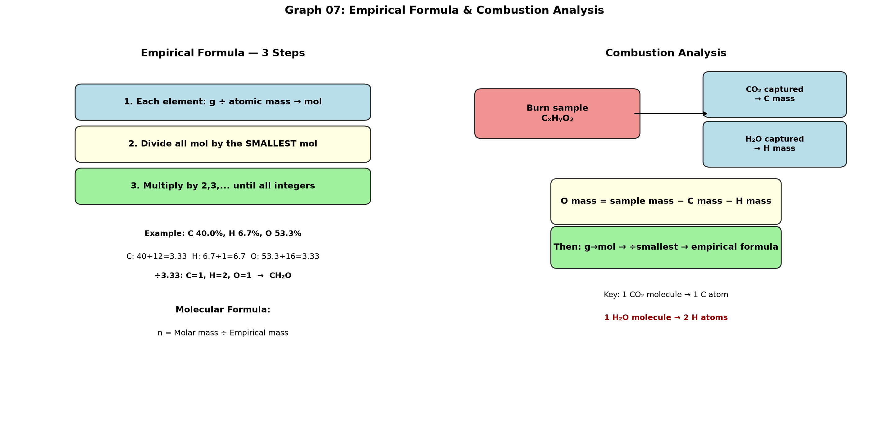

# Session 07: Empirical and Molecular Formulas

**Phase 1 — Stoichiometry | 70 min**

**Method 1 (empirical):** Divide g by box number → divide all by the smallest → multiply until you get integer ratios.
**Method 2 (molecular):** Molar mass ÷ empirical formula mass = $n$ → multiply the empirical formula by $n$.
**Method 3 (combustion analysis):** Use g of $\text{CO}_2$ and $\text{H}_2\text{O}$ to back-calculate g of C, H, and O.

---

## Getting Started

From elemental analysis data (mass percentages or grams), find the simplest whole-number ratio of atoms (empirical formula). If you also know the molar mass, you can find the actual molecular formula. For organic compounds, burn them and measure the $\text{CO}_2$ and $\text{H}_2\text{O}$ produced to determine C, H, and O content.

---

## Part A: Finding the Empirical Formula

### ① Divide each element's g by that element's box number (g → mol)

### ② Divide all mol values by the smallest mol

### ③ Multiply by 2, 3, ... until you get integer ratios

Example: 1 : 1.5 → ×2 → 2 : 3. &nbsp; 1 : 1.33 → ×3 → 3 : 4.

---

### Example 1

Mass percent: C 40.0%, H 6.7%, O 53.3%. (C=12.0, H=1.0, O=16.0)

Assume 100 g: C 40.0 g, H 6.7 g, O 53.3 g.
Divide by box numbers: C = $40.0 \div 12.0 = 3.33$, &nbsp; H = $6.7 \div 1.0 = 6.7$, &nbsp; O = $53.3 \div 16.0 = 3.33$.
Divide by the smallest (3.33): C = 1.00, H = 2.01, O = 1.00.
→ Empirical formula: $\text{CH}_2\text{O}$

---

### Example 2

Fe 69.9%, O 30.1%. (Fe=55.8, O=16.0)

Assume 100 g: Fe mol = $69.9 \div 55.8 = 1.25$, &nbsp; O mol = $30.1 \div 16.0 = 1.88$.
Divide by the smallest (1.25): Fe = 1.00, O = 1.50.
×2: Fe = 2, O = 3 → Empirical formula: $\text{Fe}_2\text{O}_3$

---

## Part B: Finding the Molecular Formula

### Molar mass ÷ empirical formula mass = $n$ → multiply the empirical formula by $n$

Example: Empirical formula $\text{CH}_2\text{O}$ (empirical formula mass = 12.0 + 2.0 + 16.0 = 30.0), molar mass = 180.0.
$n = 180.0 \div 30.0 = 6$ → Molecular formula: $\text{C}_6\text{H}_{12}\text{O}_6$

---

## Part C: Combustion Analysis

Burn an organic compound and measure the g of $\text{CO}_2$ and $\text{H}_2\text{O}$ produced.

### C: $\text{CO}_2$ g → $\text{CO}_2$ mol → C mol (same) → C g
### H: $\text{H}_2\text{O}$ g → $\text{H}_2\text{O}$ mol → H mol (×2) → H g
### O: (sample g − C g − H g) → O g → O mol

Then continue as in Part A. → divide mol by box numbers, divide by the smallest, get integer ratios.

---

## Common Mistakes

Forgetting that one $\text{H}_2\text{O}$ molecule contains **2** H atoms. $\text{H}_2\text{O}$ mol × 2 = H mol.

---

## Exercise 1

Mass percent: Na 32.4%, S 22.5%, O 45.1%. Empirical formula? (Na=23.0, S=32.1, O=16.0)

> Solutions: [Solution Set](solutions/07-solutions.md#exercise-1)

---

## Exercise 2

Empirical formula $\text{CH}$, molar mass 78.0. Molecular formula?

> Solutions: [Solution Set](solutions/07-solutions.md#exercise-2)

---

## Exercise 3

Mass percent: C 85.6%, H 14.4%. Molar mass 56.0. Empirical and molecular formulas? (C=12.0, H=1.0)

> Solutions: [Solution Set](solutions/07-solutions.md#exercise-3)

---

## Exercise 4

A 0.250 mol sample of a compound has a mass of 22.0 g. Mass percent: C 54.5%, H 9.1%, O 36.4%. Molecular formula? (C=12.0, H=1.0, O=16.0)

> Solutions: [Solution Set](solutions/07-solutions.md#exercise-4)

---

## Exercise 5: Combustion Analysis

$\text{C}_x\text{H}_y\text{O}_z$ 3.00 g burned → $\text{CO}_2$ 4.40 g, $\text{H}_2\text{O}$ 1.80 g. Empirical formula? (C=12.0, H=1.0, O=16.0)

> Solutions: [Solution Set](solutions/07-solutions.md#exercise-5)

---

## Exercise 6: Challenge

$\text{C}_x\text{H}_y\text{O}_z$ 2.20 g burned → $\text{CO}_2$ 4.40 g, $\text{H}_2\text{O}$ 1.80 g. Molar mass 88.0.
(a) Empirical formula? (b) Molecular formula? (C=12.0, H=1.0, O=16.0)

> Solutions: [Solution Set](solutions/07-solutions.md#exercise-6)

---

## What We Just Did

```
(1) Empirical formula: g→mol for each element → divide all by smallest → multiply to integers.
(2) Molecular formula: n = molar mass ÷ empirical formula mass → multiply empirical formula by n.
(3) Combustion analysis: CO₂ g→C g, H₂O g→H g, O g = sample g − C g − H g. Then proceed as (1).
```

---

## Basic Drill — Empirical & Molecular Formulas (10 Problems)

> Find empirical formula from mass percent or mass data. Find molecular formula when molar mass is given.

**D1.** Mass percent: C 75.0%, H 25.0%. Empirical formula? (C=12.0, H=1.0)

**D2.** Mass percent: Na 32.4%, S 22.5%, O 45.1%. Empirical formula? (Na=23.0, S=32.1, O=16.0)

**D3.** Mass percent: Fe 69.9%, O 30.1%. Empirical formula? (Fe=55.8, O=16.0)

**D4.** Mass percent: C 40.0%, H 6.7%, O 53.3%. Empirical formula? (C=12.0, H=1.0, O=16.0)

**D5.** Empirical formula $\text{CH}$, molar mass 78.0. Molecular formula? (C=12.0, H=1.0)

**D6.** Empirical formula $\text{NO}_2$, molar mass 92.0. Molecular formula? (N=14.0, O=16.0)

**D7.** Mass percent: C 85.6%, H 14.4%. Molar mass 56.0. Empirical AND molecular formulas? (C=12.0, H=1.0)

**D8.** A compound is 52.2% C, 13.0% H, 34.8% O. Empirical formula? (C=12.0, H=1.0, O=16.0)

**D9.** Empirical formula $\text{C}_3\text{H}_4\text{O}$, molar mass 168.0. Molecular formula? (C=12.0, H=1.0, O=16.0)

**D10.** Mass percent: P 43.7%, O 56.3%. Empirical formula? (P=31.0, O=16.0)

> Solutions: [Solution Set](solutions/07-solutions.md#basic-drill)

---

## Advanced Drill — Empirical & Molecular Formulas (10 Problems)

> Combustion analysis, hydrates, and multi-step determination.

**A1.** $\text{C}_x\text{H}_y$ 1.50 g burned → $\text{CO}_2$ 4.40 g, $\text{H}_2\text{O}$ 2.70 g. Empirical formula? (C=12.0, H=1.0, O=16.0)

**A2.** $\text{C}_x\text{H}_y\text{O}_z$ 3.00 g burned → $\text{CO}_2$ 4.40 g, $\text{H}_2\text{O}$ 1.80 g. Empirical formula? (C=12.0, H=1.0, O=16.0)

**A3.** $\text{C}_x\text{H}_y\text{O}_z$ 2.20 g burned → $\text{CO}_2$ 4.40 g, $\text{H}_2\text{O}$ 1.80 g. Molar mass 88.0. Empirical AND molecular formulas? (C=12.0, H=1.0, O=16.0)

**A4.** A compound is 40.0% C, 6.7% H, 53.3% O with molar mass 180.0. Molecular formula? (C=12.0, H=1.0, O=16.0)

**A5.** A hydrate $\text{MgSO}_4 \cdot x\text{H}_2\text{O}$ has mass 6.00 g. After heating, anhydrous $\text{MgSO}_4$ = 2.93 g. Find $x$. (Mg=24.3, S=32.1, O=16.0, H=1.0)

**A6.** Nicotine contains C, H, and N. 2.50 g sample burned → $\text{CO}_2$ 6.78 g, $\text{H}_2\text{O}$ 1.94 g. Molar mass 162.0. Molecular formula? (C=12.0, H=1.0, N=14.0, O=16.0)

**A7.** Mass percent: C 62.0%, H 10.4%, O 27.6%. Molar mass 116.0. (a) Empirical? (b) Molecular? (C=12.0, H=1.0, O=16.0)

**A8.** A compound contains only C, H, and O. 0.500 g sample → $\text{CO}_2$ 1.10 g, $\text{H}_2\text{O}$ 0.450 g. (a) Mass of C? H? O? (b) Empirical formula? (C=12.0, H=1.0, O=16.0)

**A9.** An unknown hydrocarbon ($\text{C}_x\text{H}_y$) has molar mass 128.0. Combustion of 1.28 g gives 4.40 g $\text{CO}_2$ and 0.90 g $\text{H}_2\text{O}$. Molecular formula? (C=12.0, H=1.0)

**A10.** A 2.00 g sample of an organic acid (C, H, O only) is burned, producing 3.91 g $\text{CO}_2$ and 1.60 g $\text{H}_2\text{O}$. The molar mass is 90.0. (a) Empirical formula? (b) Molecular formula? (c) If the acid has one carboxyl group (−COOH), suggest a possible structural formula. (C=12.0, H=1.0, O=16.0)

> Solutions: [Solution Set](solutions/07-solutions.md#advanced-drill)

---

## Terminology

| What we've been calling it | Term |
|:------:|:---:|
| simplest whole-number ratio formula | empirical formula |
| actual atom count formula | molecular formula |
| sum of box numbers for the empirical formula | empirical formula mass |
| molar mass ÷ empirical formula mass | $n$ (multiplier) |
| burn-and-analyze | combustion analysis |

---



*Graph 07: Left — Empirical formula determination in 3 steps. Right — Combustion analysis flow: burn → trap CO₂/H₂O → back-calculate C, H, O → empirical formula.*

---

## Today's Procedure

```
[Empirical Formula]
① Each element g ÷ box number = mol
② All mol ÷ smallest mol
③ Multiply by 2, 3, ... until integer ratios appear

[Molecular Formula]
① Molar mass ÷ empirical formula mass = n
② Empirical formula × n

[Combustion Analysis]
① CO₂ g → CO₂ mol → C mol = C g
② H₂O g → H₂O mol → H mol (×2) = H g
③ O g = sample g − C g − H g → O mol
④ Find the empirical formula
```
