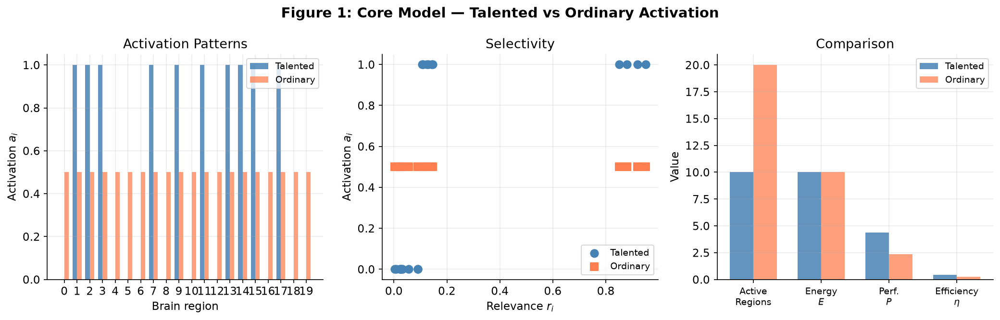
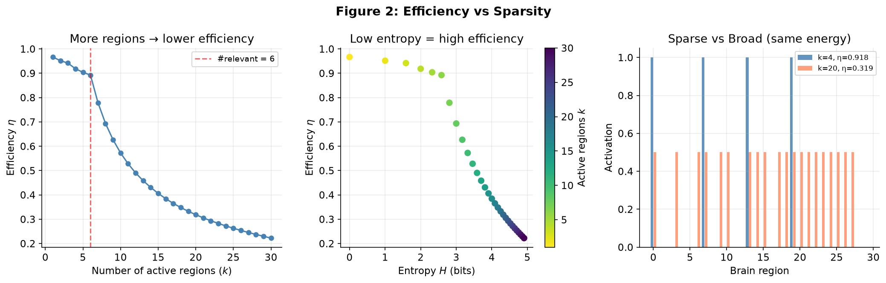
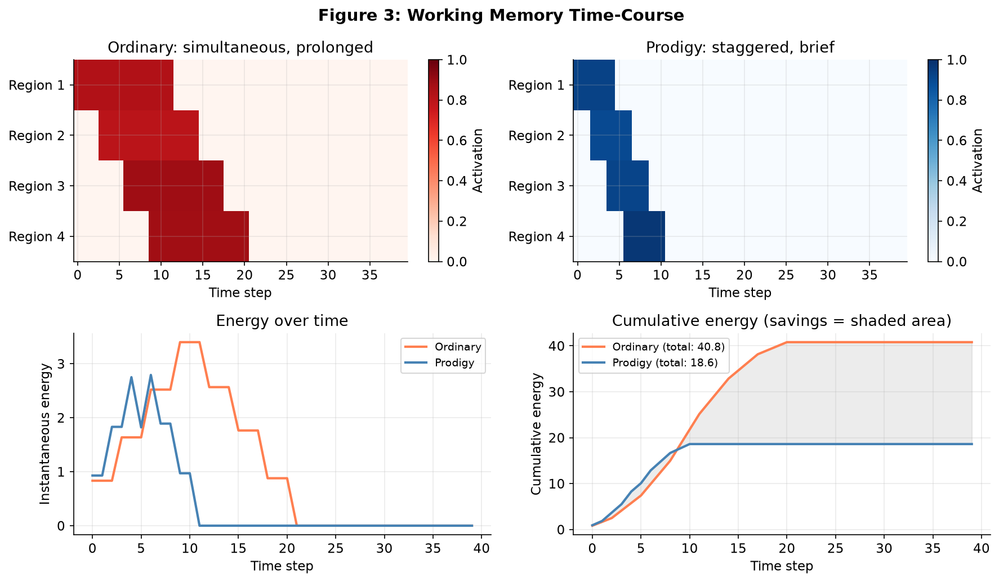
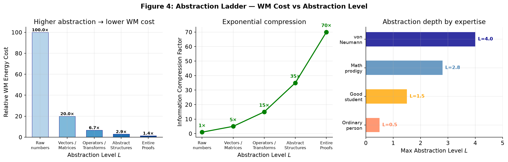
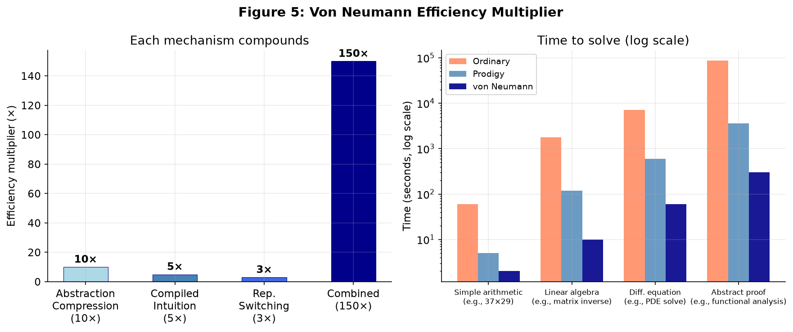
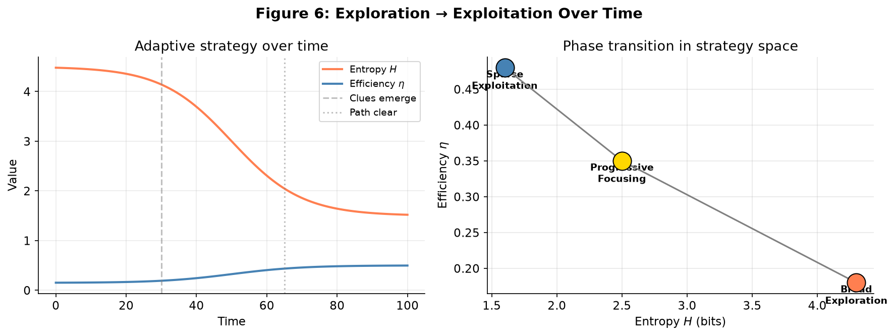

# Brain Efficiency: A Simple Mathematical Model

## The Core Idea

- **Talented people** solve problems using **few, highly relevant brain regions** with focused activation.
- **Ordinary people** activate **many brain regions broadly**, wasting energy on irrelevant areas.
- Since the brain has a **fixed energy budget**, focused activation yields higher **efficiency**.

---

## The Model

### Setup

- $n$ brain regions: $\{1, 2, \dots, n\}$
- Each region $i$ has **relevance** $r_i \in [0, 1]$ for the given problem
- Each region $i$ is activated at level $a_i \in [0, 1]$
- Activation vector: $\mathbf{a} = (a_1, a_2, \dots, a_n)$

### Energy

Each unit of activation costs 1 unit of energy.

$$
E(\mathbf{a}) = \sum_{i=1}^{n} a_i
$$

The brain has a **maximum energy budget** $E_{\text{max}}$.

### Performance

Performance is the sum of relevance-weighted activations.

$$
P(\mathbf{a}) = \sum_{i=1}^{n} r_i \, a_i
$$

### Efficiency

Efficiency = performance per unit of energy.

$$
\eta(\mathbf{a}) = \frac{P(\mathbf{a})}{E(\mathbf{a})}
$$

---

## The Optimal Strategy

We want to **maximize efficiency** $\eta$ under the energy constraint $E \le E_{\text{max}}$.

### Solution

Sort regions by relevance: $r_{(1)} \ge r_{(2)} \ge \cdots \ge r_{(n)}$.

The optimal strategy is to **allocate energy to the most relevant regions first**:

- Activate region $(1)$ fully ($a_{(1)} = 1$), then $(2)$, then $(3)$, etc.
- Stop when the energy budget $E_{\text{max}}$ is exhausted.
- Skip regions with very low relevance — they are not worth the energy.

This creates a **sparse activation pattern**: only $k$ out of $n$ regions are active, where $k \ll n$.

### Why This Maximizes Efficiency

For two regions $i$ and $j$ with $r_i > r_j$:

- Activating $i$ gives $r_i$ performance for 1 energy → efficiency contribution = $r_i$
- Activating $j$ gives $r_j$ performance for 1 energy → efficiency contribution = $r_j$
- Since $r_i > r_j$, it's always better to activate $i$ first.

**Key insight**: Each unit of energy should go to the region with the highest remaining relevance.

---

## Talented vs Ordinary


*Figure 1: Activation patterns (left), selectivity (center), and efficiency metrics (right). Talented person activates only the most relevant regions; ordinary person spreads energy evenly.*

### Talented Person (Sparse Activation)

- Activates only $k$ highly relevant regions ($k \ll n$)
- Pattern: $\mathbf{a}^*$ with $a_i^* > 0$ only when $r_i$ is among the top $k$

$$
\eta_{\text{talent}} = \frac{\sum_{i=1}^{k} r_{(i)}}{k} \quad \text{(if $k \le E_{\text{max}}$)}
$$

### Ordinary Person (Broad Activation)

- Activates many regions, including irrelevant ones
- Pattern: $\mathbf{a}'$ with many non-zero entries, even where $r_i \approx 0$

$$
\eta_{\text{general}} = \frac{\sum_{i=1}^{n} r_i a_i'}{\sum_{i=1}^{n} a_i'}
$$

### Comparison

| Metric | Talented | Ordinary |
|--------|----------|----------|
| Active regions | Few ($k \ll n$) | Many ($\approx n$) |
| Energy used | Low (focused) | High (spread) |
| Performance per energy | High | Low |
| Efficiency $\eta$ | **High** | **Low** |

> **Try it yourself →** [Problems 1 & 2](#problem-1-basic-efficiency-calculation)

---

## Entropy View

The **spread** of activation can be measured by entropy.

$$
H(\mathbf{a}) = -\sum_{i=1}^{n} p_i \log_2 p_i, \quad p_i = \frac{a_i}{\sum_j a_j}
$$

- **Low entropy** → focused, efficient (talented)
- **High entropy** → diffuse, inefficient (ordinary)

Efficiency decreases as entropy increases:

$$
\eta \propto \frac{1}{H(\mathbf{a})}
$$


*Figure 2: As more regions are activated (left), entropy rises and efficiency falls (center). Sparse activation (k=4, blue) dramatically outperforms broad activation (k=20, orange) at the same energy budget (right).*

> **Try it yourself →** [Problem 3](#problem-3-entropy-and-efficiency)

---

## Working Memory and Mental Calculation

Working memory (WM) is **extremely energy-intensive** — maintaining neural firing patterns over time costs far more than one-time activation. Mental calculation prodigies seem to defy this: they perform complex computations with seemingly effortless speed. How does the model explain them?

### Time-Aware Energy Model

The original model assumed instantaneous activation. Realistically, activation must be **sustained over time**. The total energy cost is:

$$
E_{\text{total}} = \sum_{t=1}^{T} \sum_{i=1}^{n} a_i(t) \;+\; \beta \cdot \sum_{t=1}^{T} \sum_{i \in \text{WM}} a_i(t)
$$

- First term: standard activation energy over $T$ time steps
- Second term: **WM premium** — holding information active in working memory costs extra ($\beta > 0$)
- $\text{WM}$: the set of regions involved in maintaining intermediate results

### What Makes WM So Costly

For a calculation with $m$ intermediate steps, the ordinary brain must:

1. **Hold** intermediate result $x_1$ in WM while computing $x_2$ (sustained firing)
2. **Retrieve** $x_1$ and $x_2$ to combine them (re-activation cost)
3. **Repeat** for each subsequent step

Energy grows **quadratically** with the number of intermediate results held simultaneously:

$$
E_{\text{WM}} \approx \beta \cdot \sum_{t} |\text{WM}_t|, \quad \text{where } |\text{WM}_t| \text{ is the WM load at time } t
$$

If you hold $h$ items simultaneously for $T$ steps: $E_{\text{WM}} \approx \beta \cdot h \cdot T$.

### How Mental Calculation Prodigies Beat This

Prodigies use **three key strategies** that reduce the WM energy cost dramatically:

#### Strategy 1: Chunking (Compression)

Instead of holding individual digits, they compress information into larger chunks.

$$
\text{Ordinary: } 3 \times 7 = ?, \; 2 \times 9 = ?, \; 21 + 18 = ? \quad\text{(3 WM slots)}
$$
$$
\text{Prodigy: } 37 \times 29 = 37 \times (30 - 1) \quad\text{(1 WM slot, clever factorization)}
$$

If a chunk compresses $c$ items into 1, the WM energy drops by a factor of $c$.

#### Strategy 2: Algorithmic Efficiency

Prodigies use algorithms that minimize intermediate steps. Let $m_{\text{ordinary}}$ and $m_{\text{prodigy}}$ be the number of steps:

$$
\frac{E_{\text{WM, prodigy}}}{E_{\text{WM, ordinary}}} \approx \frac{m_{\text{prodigy}} \cdot h_{\text{prodigy}}}{m_{\text{ordinary}} \cdot h_{\text{ordinary}}}
$$

A simpler algorithm means fewer steps ($m_{\text{prodigy}} \ll m_{\text{ordinary}}$) and lower WM load ($h_{\text{prodigy}} \ll h_{\text{ordinary}}$).

| Example: $37 \times 29$ | Strategy | Steps | WM load | Relative Energy |
|---|---|---|---|---|
| Ordinary | Direct multiplication | 6 | 3 | 18 |
| Prodigy | $37 \times 30 - 37$ | 2 | 1 | 2 |
| | | | | **9× less energy** |

#### Strategy 3: Pipeline Optimization (Overlap)

Prodigies overlap computation and WM maintenance. While one region computes, another holds — in parallel — rather than sequentially.

$$
\text{Ordinary (serial):} \quad \underbrace{\text{Hold}}_{E_1} \to \underbrace{\text{Compute}}_{E_2} \to \underbrace{\text{Hold + Retrieve}}_{E_3} \to \cdots
$$

$$
\text{Prodigy (pipelined):} \quad \underbrace{\text{Hold} \parallel \text{Compute}}_{\max(E_1, E_2)} \to \cdots
$$

Pipelining reduces total time $T$ without increasing peak load.

### The Efficiency Gap in Mental Calculation

Combining all three effects:

$$
\eta_{\text{prodigy}} = \frac{P}{\; \underbrace{E_{\text{base}} + \beta \cdot \frac{m_p \cdot h_p}{m_o \cdot h_o} \cdot E_{\text{WM, ordinary}}}_{\text{total energy}} \;}
$$

Since $\frac{m_p \cdot h_p}{m_o \cdot h_o} \ll 1$, the prodigy achieves far higher efficiency — not because their brain uses less energy per neuron, but because their strategy **minimizes the number of items that must coexist in working memory**.

### Connection to the Core Model

In the original model, $r_i$ (relevance) was about **which** regions to activate. For working memory, the critical variable is **when and for how long** each region stays active.

- **Ordinary person**: Many regions active simultaneously for long durations → high $E_{\text{WM}}$
- **Mental prodigy**: Same regions, but active briefly and sequentially → low $E_{\text{WM}}$


*Figure 3: Heat maps of activation over time. Ordinary person (left) keeps all regions active long and simultaneously. Prodigy (center) staggers brief activations. Cumulative energy (right) shows the prodigy uses far less total energy.*

> **Try it yourself →** [Problems 4 & 5](#problem-4-working-memory-cost)

---

## Von Neumann-Level Genius: Abstract Mathematical Manipulation

John von Neumann could solve complex calculus, differential equations, and linear algebra problems **entirely in his head** — no pencil, no paper, no external memory. How does the model explain this extreme case?

### The Limits of the Previous Model

The mental calculation model above assumes the **same fundamental units** (digits, numbers) processed more cleverly. But von Neumann manipulated **abstract mathematical structures** — operators, transforms, eigen-spaces, entire proofs — as if they were single objects.

This requires a deeper extension: **hierarchical abstraction**.

### Hierarchical Abstraction Model

Define an **abstraction ladder** with levels $L = 0, 1, 2, \dots$:

| Level | Example | WM cost per unit |
|:-----:|---------|:----------------:|
| $L=0$ | Raw numbers: $3.14159$, $\sqrt{2}$ | 1 |
| $L=1$ | Vectors, matrices as units | $\frac{1}{c_1}$ (compressed $c_1$ numbers) |
| $L=2$ | Linear operators, transformations | $\frac{1}{c_1 c_2}$ |
| $L=3$ | Abstract algebraic structures (groups, eigenspaces) | $\frac{1}{c_1 c_2 c_3}$ |
| $L=4$ | Entire proof structures, systems of reasoning | $\frac{1}{c_1 c_2 c_3 c_4}$ |

Where $c_k > 1$ is the **compression factor** at each level. A person who operates at level $L$ compresses information by factor $\prod_{k=1}^{L} c_k$.

**The WM energy for manipulating an object at abstraction level $L$:**

$$
E_{\text{WM}}(L) = \beta \cdot \frac{h \cdot T}{\prod_{k=1}^{L} c_k}
$$

where $h$ is the number of chunks held, $T$ is the duration, and $c_k$ are compression factors.


*Figure 4: WM cost drops dramatically with abstraction level (left). Compression is exponential (center). Von Neumann operates at L≈4, while ordinary people rarely leave L≈0.5 (right).*

### What Makes von Neumann Different

#### 1. Extreme Abstraction Depth

An ordinary mathematician might solve a differential equation step by step:

```
Step 1: Write out the ODE  (L=0, holds 10+ symbols)
Step 2: Identify type        (L=1, recognizes pattern)
Step 3: Apply method        (L=2, knows solution form)
Step 4: Compute solution    (L=0, expands back to symbols)
```

von Neumann could **stay at level L=4 throughout**, manipulating the entire solution structure as a single mental object:

```
"Ah, this is a Sturm-Liouville problem with boundary conditions of the second kind.
The eigenfunctions will be orthogonal under weight w(x).
The solution takes this form..."
                                 (L=4, 1 chunk → 1 WM slot)
```

The compression is staggering: an entire page of equations becomes **one mental chunk**.

#### 2. Compiled Mathematical Intuition

Through years of deep practice, von Neumann had **compiled** vast domains of mathematics into automatic, effortless patterns. This is analogous to how a chess grandmaster sees the board — not as 32 pieces, but as a small number of strategic patterns.

**Formally:** The effective WM load for a domain after $N$ hours of practice:

$$
h_{\text{effective}}(N) = h_0 \cdot e^{-\lambda N} + h_{\infty}
$$

- $h_0$: initial WM load (everything feels fragmented)
- $\lambda$: consolidation rate (how fast patterns become automatic)
- $h_{\infty}$: irreducible minimum (even experts need some WM)

A typical person who has studied calculus for 100 hours might need 7 WM slots for a complex integral. Von Neumann, with thousands of hours of deep engagement, might need **1–2 slots** for the same problem.

#### 3. Symmetric Representation Switching

Perhaps the most striking ability: von Neumann could **mentally translate** between representations (algebraic, geometric, analytic, computational) at will, choosing whichever minimizes WM load at each step.

Define $R$ representations of the same problem. The cost of switching from representation $p$ to $q$ is $S_{pq}$.

$$
E_{\text{total}} = \underbrace{\sum_{\text{each step}} E_{\text{WM}}(L_{\text{step}})}_{\text{abstraction cost}} + \underbrace{\sum_{\text{switches}} S_{pq}}_{\text{translation cost}}
$$

von Neumann's key advantage: he had **exceptionally low translation costs** $S_{pq} \approx 0$ between representations, meaning he could fluidly switch to the most efficient representation at each step.

| Person | Representations | Translation cost $S_{pq}$ |
|--------|----------------|:--------------------------:|
| Ordinary | 1–2 (symbolic only) | Low within, can't switch |
| Good mathematician | 2–3 (symbolic, geometric) | Moderate |
| von Neumann | **5+** (symbolic, geometric, analytic, computational, physical) | **Near zero** |

### The Efficiency Multiplier

Combining abstraction depth, compiled intuition, and representation switching:

$$
\eta_{\text{von Neumann}} = \eta_{\text{ordinary}} \times \underbrace{\left(\prod_{k=1}^{L} c_k\right)}_{\text{abstraction compression}} \times \underbrace{\left(\frac{h_0}{h_{\text{eff}}}\right)}_{\text{compiled intuition}} \times \underbrace{\left(\frac{T_{\text{ordinary}}}{T_{\text{vN}}}\right)}_{\text{time reduction}}
$$

Each factor alone might be 2–10×. Together, they explain how von Neumann could solve in minutes what takes others hours or days.


*Figure 5: Left — the three efficiency factors compound to a 150× total multiplier. Right — time to solve (log scale): von Neumann solves PDEs in minutes vs hours for ordinary mathematicians.*

### Connection to the Core Model

| Concept | Original Model | Extended for von Neumann |
|---------|---------------|--------------------------|
| Energy | $E = \sum a_i$ | $E = \sum a_i(t) + \beta \cdot E_{\text{WM}}$ |
| Relevance | $r_i$ (which region) | $r_i$ + abstraction level $L$ |
| Efficiency | $\eta = P/E$ | $\eta = P / (E_{\text{base}} + E_{\text{WM}}(L))$ |
| Key variable | Spatial focus | **Abstraction depth** |

The model's deepest insight: **efficiency is not just about focusing on the right regions, but about manipulating information at the right level of abstraction.** von Neumann's genius was his ability to climb the abstraction ladder effortlessly — compressing vast mathematical structures into single mental chunks that cost almost nothing to hold in working memory.

> 📘 **Practical guides**: [`patterns.md`](patterns.md) — 6 methods for pattern recognition. [`training-L4.md`](training-L4.md) — specific drills to reach L4 abstraction. [`ladder-example.md`](ladder-example.md) — L0→L4 with eigenvalues. [`ladder-examples.md`](ladder-examples.md) — L0→L4 across math, physics, chemistry, biology.

> **Try it yourself →** [Problems 6 & 8](#problem-6-abstraction-ladder)

---

## When the Problem Has No Visible Clues

The model above assumes you **already know** which regions are relevant ($r_i$ is known). But what about a truly difficult problem where no starting point is visible?

### The Dilemma

If $\mathbf{r}$ is unknown, you cannot apply the sparse strategy — you don't know which regions to focus on. Activating only a few regions risks **missing the right ones entirely** ($P \approx 0$).

### The Solution: Adaptive Exploration-Exploitation

The optimal strategy is **not static** — it evolves over time.

#### Phase 1: Broad Exploration ($t = 0$ to $t_1$)

When you have no clue, **deliberately activate many regions at low intensity** to discover which ones are relevant.

$$
a_i(t) = a_{\text{base}} \quad \text{for all } i, \quad E(t) = n \cdot a_{\text{base}} \le E_{\text{max}}
$$

This is intentionally **inefficient** in the short term (high entropy, low $\eta$), but it serves to **estimate relevance** $\hat{r}_i$ from initial results.

#### Phase 2: Progressive Focusing ($t_1$ to $t_2$)

As clues emerge, gradually shift energy toward promising regions.

$$
a_i(t+1) = a_i(t) + \delta \cdot (\hat{r}_i - a_i(t))
$$

where $\delta$ controls how aggressively you focus. Entropy $H(\mathbf{a})$ steadily decreases.

#### Phase 3: Sparse Exploitation ($t > t_2$)

Once the path is clear, switch to the optimal sparse strategy.

$$
a_i \approx \begin{cases}
1 & \text{if } \hat{r}_i \text{ is among top } k \\
0 & \text{otherwise}
\end{cases}
$$


*Figure 6: Left — entropy falls and efficiency rises as the strategy transitions from exploration to exploitation. Right — the phase transition visualized in strategy space.*

### The Efficiency Curve Over Time

- **Early phase**: Low efficiency but **necessary** — you are gathering information.
- **Middle phase**: Efficiency rises as you narrow down.
- **Late phase**: Peak efficiency — you solve the problem with minimal energy.

### Total Cost Analysis

The total cost includes both energy and **information gain**:

$$
E_{\text{total}} = \underbrace{E_{\text{exploration}}}_{\text{broad, low }\eta} \;+\; \underbrace{E_{\text{exploitation}}}_{\text{sparse, high }\eta}
$$

A purely sparse strategy from the start fails when $\mathbf{r}$ is unknown (performance = 0). A purely broad strategy never achieves high efficiency. The **adaptive approach** balances both.

### Practical Implication

> **For truly hard problems, efficient broad exploration is the smart first move.**
>
> The key skill is knowing **when to explore** (cast a wide net) and **when to exploit** (focus deeply). Talented people do this transition faster — not because they skip exploration, but because they recognize patterns earlier and focus sooner.

This is mathematically equivalent to the **exploration-exploitation tradeoff** in reinforcement learning: an agent must sometimes sacrifice immediate reward to discover higher-reward strategies later.

> **Try it yourself →** [Problem 7](#problem-7-exploration-vs-exploitation)

---

## Practice Problems

---

### Problem 1: Basic Efficiency Calculation

You have $n = 5$ brain regions with the following relevance values:

| Region | $r_i$ |
|--------|:-----:|
| 1 | 0.9 |
| 2 | 0.7 |
| 3 | 0.1 |
| 4 | 0.05 |
| 5 | 0.0 |

Your energy budget is $E_{\text{max}} = 3$.

**(a)** If you activate all regions equally ($a_i = 0.6$ for all $i$), what are $E$, $P$, and $\eta$?

**(b)** If you activate only the top-3 most relevant regions fully ($a_i = 1$) and ignore the rest, what are $E$, $P$, and $\eta$?

**(c)** Which strategy is more efficient? Why?

> 📖 [See solution](solution/01-basic-efficiency.md)

---

### Problem 2: Optimal Allocation

Using the same regions as Problem 1, with $E_{\text{max}} = 3$.

**(a)** What is the optimal activation pattern $\mathbf{a}^*$ that maximizes $\eta$?

**(b)** What is the maximum possible efficiency $\eta_{\text{max}}$?

**(c)** How does the answer change if region 1 has relevance $r_1 = 0.99$ instead of 0.9?

> 📖 [See solution](solution/02-optimal-allocation.md)

---

### Problem 3: Entropy and Efficiency

You have $n = 4$ regions with activation vectors:

- Person A: $\mathbf{a} = (1, 1, 0, 0)$
- Person B: $\mathbf{a} = (0.5, 0.5, 0.5, 0.5)$

Relevance: $\mathbf{r} = (0.9, 0.8, 0.1, 0.0)$

**(a)** Compute the entropy $H$ for each person.

**(b)** Compute the efficiency $\eta$ for each person.

**(c)** Plot (qualitatively) these two points on an entropy-efficiency graph. Which region would a "talented" person be closer to?

**(d)** Can you construct a Person C with intermediate entropy $2.0 < H < 2.5$ and efficiency higher than both A and B? Explain why or why not.

> 📖 [See solution](solution/03-entropy-efficiency.md)

---

### Problem 4: Working Memory Cost

A calculation requires holding 3 intermediate results for 10 time steps each.
The WM premium is $\beta = 2$.

**(a)** What is the total WM energy cost $E_{\text{WM}}$?

**(b)** A prodigy compresses the 3 intermediate results into 1 chunk (compression factor $c = 3$). What is the new $E_{\text{WM}}$?

**(c)** The prodigy also pipelines the computation, reducing time from 10 to 4 steps. What is the combined savings factor?

**(d)** Generalize: if chunking compresses $h$ items to $h/c$ and pipelining reduces time from $T$ to $T/p$, express the total WM energy ratio $\frac{E_{\text{prodigy}}}{E_{\text{ordinary}}}$.

> 📖 [See solution](solution/04-wm-cost.md)

---

### Problem 5: Algorithmic Efficiency

Compare two strategies for computing $47 \times 53$:

**Strategy A (Direct):** 
- Steps: $47 \times 50 = 2350$, $47 \times 3 = 141$, $2350 + 141 = 2491$ (3 steps)
- WM load: holds 2 intermediate results simultaneously

**Strategy B (Clever):**
- Recognize $47 \times 53 = (50-3)(50+3) = 50^2 - 3^2 = 2500 - 9 = 2491$ (2 steps)
- WM load: 1 intermediate result

**(a)** Compute $m \cdot h$ (steps × WM load) for each strategy.

**(b)** If $\beta = 2$ and base energy per step is 1, compute total energy for each.

**(c)** How much more efficient is Strategy B?

**(d)** Invent your own clever strategy for $38 \times 42$ using the identity $(a-b)(a+b) = a^2 - b^2$ and compute the energy savings.

> 📖 [See solution](solution/05-algorithmic-efficiency.md)

---

### Problem 6: Abstraction Ladder

You are solving a linear algebra problem: find the eigenvalues of $\begin{pmatrix}4 & 1 \\ 1 & 4\end{pmatrix}$.

**Level 0 approach:** Write the characteristic equation, expand the determinant, apply the quadratic formula:

$$
\det\begin{pmatrix}4-\lambda & 1 \\ 1 & 4-\lambda\end{pmatrix} = (4-\lambda)^2 - 1 = \lambda^2 - 8\lambda + 15 = 0
$$

$$
\lambda = \frac{8 \pm \sqrt{64 - 60}}{2} = 5, 3
$$

This requires holding ~10 symbols in WM over ~15 steps.

**Level 2 approach:** Recognize the matrix is of the form $3I + J$ where $J$ is the all-ones matrix. The eigenvalues of $J$ are $2$ and $0$. So eigenvalues are $3 + 2 = 5$ and $3 + 0 = 3$.

**(a)** How many WM slots does the Level 0 approach need at peak?

**(b)** How many WM slots does the Level 2 approach need?

**(c)** Estimate the compression factor $c$ between the two approaches.

**(d)** Find the eigenvalues of $\begin{pmatrix}5 & 2 \\ 2 & 5\end{pmatrix}$ using both Level 0 and Level 2 approaches. Which is faster?

**(e) (Challenge)** The matrix $\begin{pmatrix}a & b & b & b \\ b & a & b & b \\ b & b & a & b \\ b & b & b & a\end{pmatrix}$ has a special structure. What is it? What are its eigenvalues?

> 📖 [See solution](solution/06-abstraction-ladder.md)

---

### Problem 7: Exploration vs Exploitation

You face a completely unfamiliar problem with $n=50$ brain regions and $E_{\text{max}} = 10$. You have no idea which regions are relevant.

**(a)** If you guess and activate only 5 random regions, what's the risk in terms of performance $P$?

**(b)** If you activate all 50 regions at $a_i = 0.2$, what is the entropy $H$? Is this efficient?

**(c)** Propose a time-dependent strategy that starts broad and narrows down. Define the switching rule mathematically.

**(d)** After 10 time steps, you notice regions {7, 23, 41} give the strongest signals. How should you reallocate energy?

> 📖 [See solution](solution/07-exploration-exploitation.md)

---

### Problem 8: Combined von Neumann Scenario (Challenge)

von Neumann is solving a PDE eigenvalue problem. He uses:

- Abstraction level $L=3$ (compression factor $c = 20$)
- Compiled intuition reduces WM load by factor 5
- Representation switching between algebraic and geometric views ($S_{pq} \approx 0$)
- Pipelining halves the time

An ordinary mathematician needs $E_{\text{total}} = 1000$ energy units for the same problem.

**(a)** Estimate von Neumann's total energy.

**(b)** What is his efficiency multiplier over the ordinary mathematician?

**(c)** If the ordinary mathematician takes 8 hours, estimate von Neumann's time.

**(d) (Reflection)** What fraction of von Neumann's advantage is innate vs developed through practice? Defend your answer using the model's terms.

> 📖 [See solution](solution/08-von-neumann-scenario.md)

---

## Summary

> **Efficiency = using the right regions, not all regions.**
>
> With a fixed energy budget, the brain that learns to activate **only what matters** achieves more with less.

All figures generated by [`graph/generate_graphs.py`](graph/generate_graphs.py). Re-run with `python3 graph/generate_graphs.py` to regenerate.
