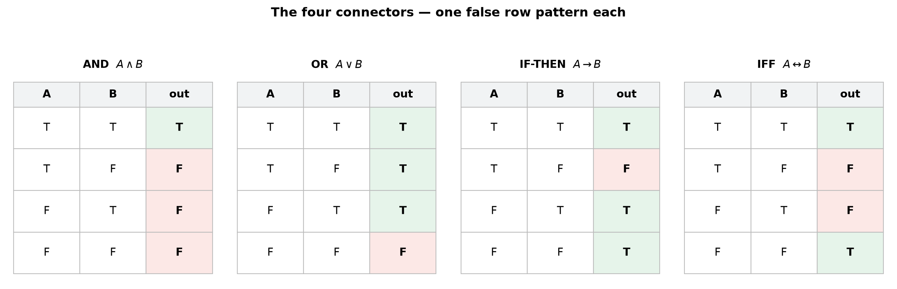
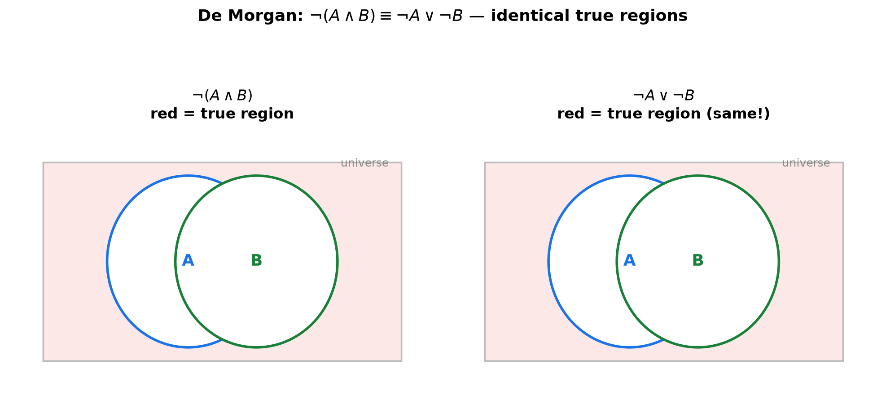
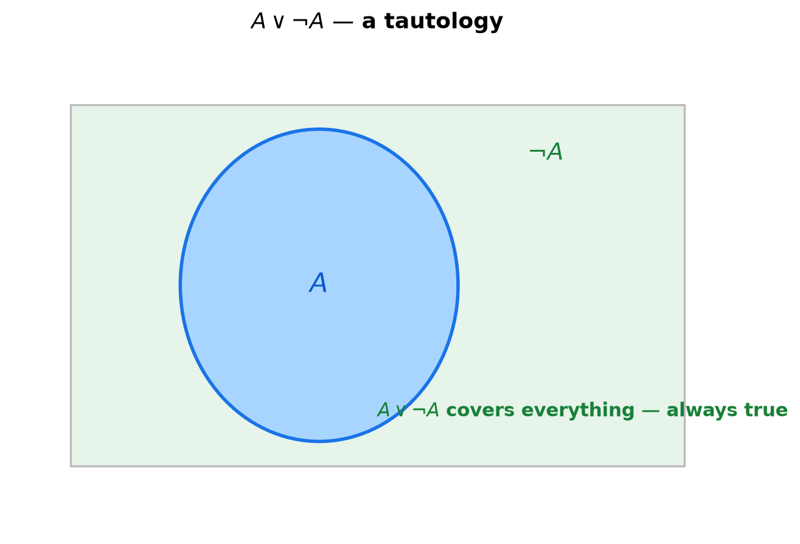

# Session 01: Judging the Truth of Sentences — Truth Tables

**Phase 1 — The Grammar of the Tools | 30 min**

*Prerequisites: none — the very first session*
*Prerequisite for: [02 — Handling "All" and "Some"](02-handling-all-and-some.md), [03 — Three Proof Templates](03-three-proof-templates.md)*

---

## Part A: The Five Connectors — What Each Word Does

---

## Example 1: "And" — True Only When Both Are True

> "It rains. AND the wind blows."

Strip the sentence down to two smaller claims:
- $A$ = "It rains."
- $B$ = "The wind blows."

The truth of the whole sentence depends only on the truths of $A$ and $B$. There are exactly **four combinations** — put them in the left columns, then fill the last column by rule.

| $A$ | $B$ | "$A$ and $B$" |
|:---:|:---:|:---:|
| T | T | T |
| T | F | F |
| F | T | F |
| F | F | F |

"and" is true **only when both parts are true**. One false part poisons the whole sentence.

> **Insight**: A table with 2 input claims has $2^2 = 4$ rows — every possible combination of T and F. There are no other cases. This is the entire grammar of logic: list the cases, fill each column by one fixed rule.

---

## Example 2: "Or" — True When At Least One Is True

> "It rains. OR the wind blows."

Same two claims, same four rows — but a different rule.

| $A$ | $B$ | "$A$ or $B$" |
|:---:|:---:|:---:|
| T | T | T |
| T | F | T |
| F | T | T |
| F | F | F |

"or" is true **whenever at least one part is true**. It is false only when both parts are false.

> **Insight**: The "or" of everyday life is often exclusive ("soup or salad"), but the mathematical "or" is *inclusive* — both can be true. The T-T row stays true.

---

## Example 3: "If…then" — One Single Way to Break a Promise

> "IF it rains, I carry an umbrella."

The rule that decides this sentence is about **breaking a promise**:
- It rains and I carry the umbrella → promise kept. True.
- It rains and I do NOT carry the umbrella → **promise broken. False.**
- It does not rain (umbrella or not) → promise was never tested. True.

| $A$ | $B$ | "if $A$ then $B$" |
|:---:|:---:|:---:|
| T | T | T |
| T | F | **F** |
| F | T | T |
| F | F | T |

"if…then" is false in exactly one case: **$A$ true and $B$ false.** When the premise $A$ is false, the sentence is automatically true — no promise is being tested.

> **Insight**: This is the least intuitive row of logic. "If it rains, I carry an umbrella" says nothing about what happens when it doesn't rain. A false premise cannot break the promise, so the sentence stays true.

---

## Example 4: "Only if" / "if and only if" — Both Must Match

> "I carry an umbrella ONLY IF it rains."

Compare with Example 3. This sentence promises: umbrella → rain. Now the third row flips:

| $A$ | $B$ | "if $A$ then $B$" | "only if" |
|:---:|:---:|:---:|:---:|
| T | T | T | T |
| T | F | F | F |
| F | T | T | **F** |
| F | F | T | T |

"I carry an umbrella **if and only if** it rains" demands both directions: rain → umbrella AND umbrella → rain. It is true only when $A$ and $B$ **have the same truth value**.

| $A$ | $B$ | "$A$ iff $B$" |
|:---:|:---:|:---:|
| T | T | T |
| T | F | F |
| F | T | F |
| F | F | T |

> **Insight**: "if" is one direction; "iff" (if and only if) is both directions. The table for "iff" is true exactly when the two columns match — like an equality test.

---

## Example 5: "Not" — Flip the Value

> "It does NOT rain."

The negation simply flips the truth value.

| $A$ | "not $A$" |
|:---:|:---:|
| T | F |
| F | T |

> **Up to here**: Five connectors, five rules. "and" (both true), "or" (at least one true), "if…then" (false only on T→F), "iff" (both match), "not" (flip). Each rule fills one column. Combined sentences = build the table column by column.



---

## Part B: Building Larger Tables — One Column at a Time

---

## Example 6: A Mixed Sentence — Three Claims, Eight Rows

> "IF it rains or the wind blows, I carry an umbrella."

This sentence has three claims ($A$ = rain, $B$ = wind, $C$ = umbrella), so the table has $2^3 = 8$ rows. Write all 8 combinations in the left three columns, then fill columns right to left.

| $A$ | $B$ | $C$ | $A \lor B$ | $(A \lor B) \to C$ |
|:---:|:---:|:---:|:---:|:---:|
| T | T | T | T | T |
| T | T | F | T | F |
| T | F | T | T | T |
| T | F | F | T | F |
| F | T | T | T | T |
| F | T | F | T | F |
| F | F | T | F | T |
| F | F | F | F | T |

Column 4 uses the "or" rule (Example 2). Column 5 uses the "if…then" rule (Example 3) with column 4 as the premise.

The last column is **not all T** — the sentence is not always true. In fact it is false whenever it rains or the wind blows but no umbrella appears.

> **Insight**: Never jump to the last column. Build one column per connector, left to right. Each new column is produced by a rule you already know.

**Method — Building any truth table in 3 steps:**

(1) **Count the claims.** $n$ claims → $2^n$ rows. List every T/F combination in the left columns (flip the rightmost column fastest).

(2) **Find the connectors from the inside out.** Locate the smallest pieces first: parentheses, then the connectors they feed into.

(3) **Fill one column per connector, left to right.** Each column is a rule you know. The last column answers the question.

---

## Example 7: De Morgan — "Not (A and B)" Means the Same as "Not A or Not B"

Two different sentences, two tables. Compare their last columns.

**Sentence 1 — "NOT (it rains and the wind blows)":**

| $A$ | $B$ | $A \land B$ | $\neg(A \land B)$ |
|:---:|:---:|:---:|:---:|
| T | T | T | F |
| T | F | F | T |
| F | T | F | T |
| F | F | F | T |

**Sentence 2 — "(NOT it rains) OR (NOT the wind blows)":**

| $A$ | $B$ | $\neg A$ | $\neg B$ | $\neg A \lor \neg B$ |
|:---:|:---:|:---:|:---:|:---:|
| T | T | F | F | F |
| T | F | F | T | T |
| F | T | T | F | T |
| F | F | T | T | T |

The last columns are **identical**. The two sentences are *logically equivalent* — different words, same meaning.

$$\neg(A \land B) \;\equiv\; \neg A \lor \neg B$$



> **Insight**: Negation distributes over "and"/"or" by flipping the connector. "It is not true that it rains and blows" ⟺ "it doesn't rain or it doesn't blow." The same rule swaps $\land \leftrightarrow \lor$ under a negation.

---

## Example 8: Double Negation — Two "Not"s Cancel

> "It is NOT true that it does NOT rain."

| $A$ | $\neg A$ | $\neg(\neg A)$ |
|:---:|:---:|:---:|
| T | F | T |
| F | T | F |

Applying "not" twice brings you back to the start: $\neg(\neg A) \equiv A$.

> **Up to here**: Big tables are built one column at a time. Two tables with identical last columns are the same sentence in disguise (logical equivalence). Double negation cancels. De Morgan is the swap rule for negation.

---

## Part C: Judging a Whole Sentence — Tautologies and Equivalences

---

## Example 9: A Tautology — Always True, No Matter What

> "It rains, OR it does not rain."

| $A$ | $\neg A$ | $A \lor \neg A$ |
|:---:|:---:|:---:|
| T | F | T |
| F | T | T |

The last column is all T. This sentence is true in **every possible situation** — it carries no information. Such a sentence is a **tautology**. The mirror case, all F, is a **contradiction**.



> **Insight**: A tautology is a sentence you never need to check again — no matter what the world does, it is true. The law of excluded middle ($A \lor \neg A$) is the simplest one.

---

## Example 10: Equivalence via Tables — Same Last Column

Two sentences are **logically equivalent** ($\equiv$) when their truth tables have identical last columns. Compare "if $A$ then $B$" with "not $A$ or $B$":

| $A$ | $B$ | $A \to B$ | $\neg A \lor B$ |
|:---:|:---:|:---:|:---:|
| T | T | T | T |
| T | F | F | F |
| F | T | T | T |
| F | F | T | T |

Same last column → **$A \to B \equiv \neg A \lor B$.** "If it rains, I carry an umbrella" means the same as "Either it doesn't rain, or I carry an umbrella."

> **Insight**: This equivalence is the engine behind proof by contrapositive (Session 03). Because $A \to B$ means $\neg A \lor B$, swapping the negated conclusion and premise gives an equivalent promise.

> **Up to here**: A table's last column tells you everything — all T (tautology), all F (contradiction), or matching another table (equivalence).

---

## Common Mistakes

### Mistake 1: "If…then" equals "only if"

**Wrong**: "If it rains, I carry an umbrella" and "I carry an umbrella only if it rains" sound the same.

**Right**: They are different promises. "If $A$ then $B$" is false only on $A$=T, $B$=F. "Only if" is also false on $A$=F, $B$=T. Check the third row of Example 4 — the two tables differ.

### Mistake 2: Confusing "or" with "either…or"

**Wrong**: "It rains or the wind blows" excludes the case where both happen.

**Right**: Mathematical "or" is inclusive. The T-T row is true. Only both-false makes it false.

### Mistake 3: A false premise makes "if…then" false

**Wrong**: "If $2=1$, then pigs fly" feels false because the premise is absurd.

**Right**: A false premise makes the implication *vacuously true* (the F-T and F-F rows are both true; only T→F is false). Tables don't care about feelings.

---

## What We Just Did

```
(1) Strip a sentence down to its atomic claims. n claims → 2^n rows.

(2) The five connectors, five rules:
    and:  true only when both true.
    or:   true when at least one true.
    if→:  false only when true premise, false conclusion.
    iff:  true when both sides match.
    not:  flips the value.

(3) Build big tables one column at a time, left to right.

(4) Judge the last column:
    all T       → tautology (always true).
    all F       → contradiction (always false).
    matches another table → logically equivalent.
```

---

## Decision Tree — Judging Any Sentence

```
You have a sentence made of claims:
├── (1) Identify the atomic claims (A, B, C, ...).
├── (2) How many? 1 → 2 rows. 2 → 4 rows. 3 → 8 rows.
│       Write all T/F combinations in the left columns.
├── (3) Read the connectors from the inside out (parentheses first).
├── (4) Fill one column per connector with its rule.
└── (5) Read the last column:
    ├── all T → tautology. all F → contradiction.
    └── compare with another table → equivalence?
```

---

## Practice 1

**"If I lie, I get punished" AND "if I do not lie, I do not get punished."** Decide with a truth table whether this whole sentence is always true.

→ Reference: **Examples 3, 6**

> Solutions: [Solutions](solutions/01-solutions.md#practice-1)

---

## Practice 2

**When "$A$ implies $B$" is true, is it necessarily true that if $B$ is true then $A$ is true?** Test the claim with a table.

→ Reference: **Example 3**

> Solutions: [Solutions](solutions/01-solutions.md#practice-2)

---

## Practice 3

**"(A implies B) and (B implies A)"** — find the single connector that produces the same last column.

→ Reference: **Examples 4, 7**

> Solutions: [Solutions](solutions/01-solutions.md#practice-3)

---

## Practice 4: Trap

**"(A or B) and (not A)"** — find exactly the row(s) where this sentence is true.

→ Reference: **Examples 2, 7**

> Solutions: [Solutions](solutions/01-solutions.md#practice-4)

---

## Practice 5

**"(A and B) implies C" vs "(A implies C) or (B implies C)".** Compare the two last columns. Are they equivalent?

→ Reference: **Examples 6, 7**

> Solutions: [Solutions](solutions/01-solutions.md#practice-5)

---

## Practice 6: Real Battle

**"If $A$ is true then $B$ is true" and "if $B$ is true then $C$ is true"** are both true. Prove with a table that "if $A$ is true then $C$ is true" is always true.

→ Reference: **Examples 3, 6**

> Solutions: [Solutions](solutions/01-solutions.md#practice-6)

---

## Basic Drills

> Pure computation — build the table, read the last column.

**D1.** Build the table for $A \land B$.

**D2.** Build the table for $A \lor B$.

**D3.** Build the table for $A \to B$.

**D4.** Build the table for $A \leftrightarrow B$.

**D5.** Build the table for $\neg A$.

**D6.** Build the table for $\neg(A \lor B)$ — then state its simpler equivalent.

**D7.** Build the table for $\neg(A \land B)$ — then state its simpler equivalent.

**D8.** Build the table for $A \lor \neg A$. What kind of sentence is it?

**D9.** Build the table for $A \land \neg A$. What kind of sentence is it?

**D10.** Build the table for $\neg(\neg A)$. What does it equal?

> Solutions: [Solutions](solutions/01-solutions.md#basic-drill)

---

## Advanced Drills

> Multi-step — several connectors, several columns.

**A1.** Build the table for $(A \lor B) \land \neg(A \land B)$ — this is the "exclusive or." In which rows is it true?

**A2.** Prove by table that $A \to B \equiv \neg B \to \neg A$ (the contrapositive).

**A3.** Prove by table that $\neg(A \to B) \equiv A \land \neg B$.

**A4.** Is $A \to (B \to C)$ equivalent to $(A \land B) \to C$? Decide with one table.

**A5.** With three claims $A, B, C$, is $(A \lor B) \land C$ equivalent to $A \lor (B \land C)$?

**A6.** Build the table for $(A \to B) \land (B \to A)$ and name the single-connector sentence it equals.

**A7.** Build the table for $A \to (B \land C)$ and compare with $(A \to B) \land (A \to C)$.

**A8.** A sentence built from $A$ and $B$ is true exactly in rows (T,F) and (F,T). Write it using only $\land$, $\lor$, $\neg$.

**A9.** Prove by table that $A \leftrightarrow B \equiv (A \land B) \lor (\neg A \land \neg B)$.

**A10.** Prove by table that $A \to B \equiv \neg A \lor B$, then show $A \to B \equiv A \to (A \land B)$.

> Solutions: [Solutions](solutions/01-solutions.md#advanced-drill)

---

## Today's Procedure

```
Step 1: Count the claims → 2^n rows. Write every combination.
Step 2: Fill columns one connector at a time, inside out.
Step 3: Read the last column:
        all T = tautology, all F = contradiction,
        same as another table = equivalence.
```

---

## How to Read These Symbols

| Symbol | Reads as | Meaning |
|:---:|:---:|------|
| $\neg A$ | "not A" | flips A's truth value |
| $A \land B$ | "A and B" | true only when both true |
| $A \lor B$ | "A or B" | true when at least one true |
| $A \to B$ | "A implies B" / "if A then B" | false only on T→F |
| $A \leftrightarrow B$ | "A iff B" | true when A and B match |
| T / F | "true" / "false" | the two truth values |
| $\equiv$ | "is equivalent to" | identical last columns |
| tautology | "always true" | all-T last column |
| contradiction | "always false" | all-F last column |

---

## Terminology

| What we call it | Math term | Notation |
|:---------------:|:---------:|:--------:|
| "not" | negation | $\neg$ |
| "and" | conjunction | $\land$ |
| "or" | disjunction | $\lor$ |
| "if…then" | implication | $\to$ |
| "if and only if" | biconditional | $\leftrightarrow$ |
| always true | tautology | — |
| always false | contradiction | $\bot$ |
| same meaning | logical equivalence | $\equiv$ |
