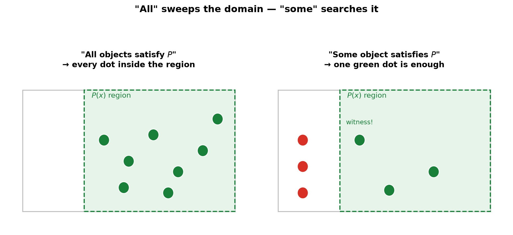
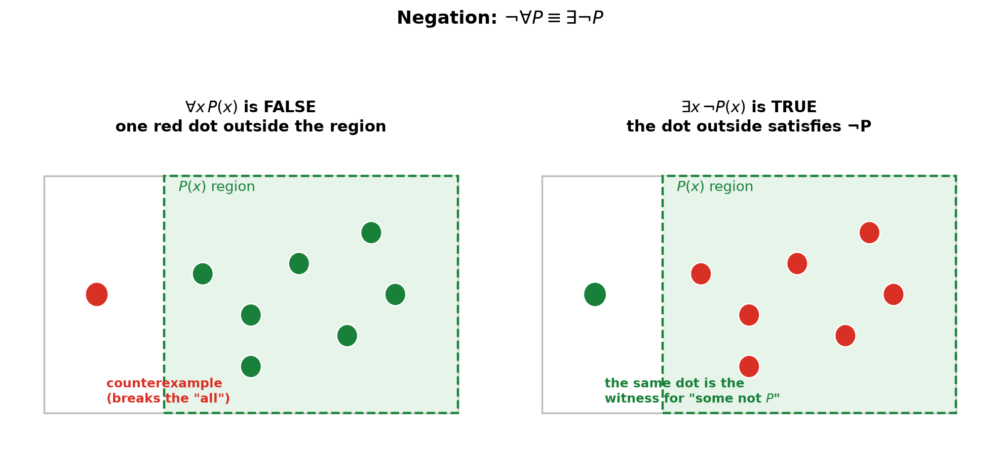
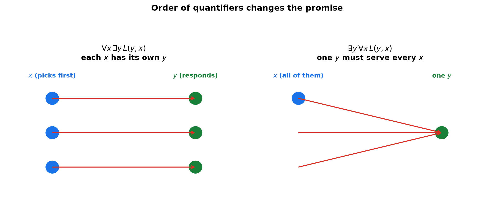

# Session 02: Handling "All" and "Some" — Quantifiers

**Phase 1 — The Grammar of the Tools | 45 min**

*Prerequisites: [01 — Judging the Truth of Sentences](01-judging-truth-of-sentences.md) (truth tables, negation)*
*Prerequisite for: [03 — Three Proof Templates](03-three-proof-templates.md), [06 — Gödel's Incompleteness Theorem](06-godels-incompleteness-theorem.md)*

---

## Part A: "All" and "Some" — Two Different Jobs

A sentence like "it rains" gets a truth value from the world. A sentence like "all swans are white" needs something more: it ranges over **many objects at once**. The words "all" and "some" are the *quantifiers* that do this ranging. This session's job: decide such sentences mechanically.

---

## Example 1: "All" — Test Every Single Object

> "All natural numbers are greater than 0."

The range (domain) is the natural numbers: $1, 2, 3, 4, 5, \dots$

Test them one by one:
$1 > 0$ → true. $2 > 0$ → true. $3 > 0$ → true. Keep going — every natural number passes.

→ **True.**

"All" demands a complete sweep. Every object in the domain must satisfy the property.



---

## Example 2: "All" — One Failure Ends the Sweep

> "All natural numbers are even."

Test: $1$ is not even. **One counterexample is enough.**

→ **False.**

> **Insight**: "All" is a very strict boss: one single bad object kills the whole claim. To *disprove* a "for all" claim, you only need to find **one** object that fails.

---

## Example 3: "Some" — One Success Ends the Search

> "Some natural number is greater than 7."

Test: $8 > 7$ → true. Found one. Stop searching.

→ **True.**

> **Insight**: "Some" is the lazy boss: one good object settles it. To *disprove* a "there exists" claim, you must check every object and find none.

---

## Example 4: "Some" — Nothing Matches

> "Some natural number has square equal to 2."

Test: $1^2=1$, $2^2=4$, $3^2=9$, … no natural number squares to 2.

→ **False.**

---

## Example 5: The Famous Counterexample Trap

> "For all real numbers $x$, $x^2 > 0$."

Sweep the reals: $x=1$ → $1>0$ ✓, $x=-2$ → $4>0$ ✓ … but **$x=0$** → $0^2 = 0$, and $0$ is not greater than $0$.

→ **False.**

> **Insight**: The counterexample can hide in plain sight. $0$ is a real number, so it is inside the domain, and it kills the claim. Watch for edge cases: $0$, $\pm 1$, negatives, empty ranges.

**Method — Deciding a quantified sentence in 3 steps:**

(1) **Fix the domain first.** Which set are we sweeping? (natural numbers, reals, people in the class, …)

(2) **Read the quantifier.** "All" → test every object; one failure → false. "Some" → find one success; none → false.

(3) **Test, and say which objects you checked.** Write the witness (for "some") or the counterexample (for "all").

> **Up to here**: "All" = complete sweep, killed by one counterexample. "Some" = single search, settled by one witness. Always fix the domain before testing.

---

## Part B: Negating Quantifiers — Flip the Word AND the Statement

---

## Example 6: "Not all" Does NOT Mean "None"

> Original: "All birds can fly."

A tempting negation: "All birds cannot fly." **Wrong** — that claims penguins AND sparrows AND … all fail, which is much stronger than needed.

The correct negation: **"Some bird cannot fly."**

One flightless bird (a penguin) destroys "all birds can fly." That is exactly what "some bird cannot fly" says.

> Original: "Some person is a genius."

The correct negation: **"Every person is not a genius"** (no person is a genius). One genius would make the original true, so to negate it you must rule out every genius.

**The swap rule:**

- "All $x$ satisfy $P(x)$" is negated by "Some $x$ does not satisfy $P(x)$."
- "Some $x$ satisfies $P(x)$" is negated by "All $x$ fail $P(x)$."

In symbols:

$$\neg\big(\forall x\, P(x)\big) \;\equiv\; \exists x\, \neg P(x)$$
$$\neg\big(\exists x\, P(x)\big) \;\equiv\; \forall x\, \neg P(x)$$



> **Insight**: Negation pushes through the quantifier: $\forall$ flips to $\exists$, $\exists$ flips to $\forall$, and the negation lands inside on the property. This is the quantifier version of De Morgan (Session 01).

**Method — Negating a quantified sentence in 3 steps:**

(1) **Write the sentence in "quantifier + property" form.** "All birds can fly" → $\forall x\,(\text{canFly}(x))$.

(2) **Flip the quantifier.** $\forall \leftrightarrow \exists$.

(3) **Negate the property, not the quantifier words.** "can fly" → "cannot fly"; "is even" → "is not even".

---

## Part C: Order Matters — Two Quantifiers

---

## Example 7: $\forall\exists$ vs $\exists\forall$ — Different Promises

> (A) "For every person, there is someone who loves them."
> (B) "There is a person who loves everyone."

Two quantifiers, two orders — completely different meanings.

**Sentence (A)** — $\forall x\, \exists y\, L(y, x)$: pick any person $x$; you can find a (possibly different) $y$ who loves $x$. Each person has their own admirer.

**Sentence (B)** — $\exists y\, \forall x\, L(y, x)$: there is ONE person $y$ who loves every $x$ — a super-lover.

In a class of 30, (A) is easy to satisfy: everyone has at least one friend. (B) demands one person who loves all 30 — a much taller order.



> **Insight**: Read quantifiers **left to right**. The leftmost quantifier picks first; the next one responds. Swapping the order changes who is allowed to depend on whom. (A) lets $y$ depend on $x$; (B) forces one $y$ to work for all $x$ at once.

> **Up to here**: Two quantifiers = two promises. "All" is a sweep, "some" is a search. Negation flips the quantifier and negates the property. Order matters: read left to right.

---

## Common Mistakes

### Mistake 1: Negating "all" as "all"

**Wrong**: "All students passed" → "All students failed."

**Right**: One failing student already breaks the original, so the negation is "**Some** student failed." Don't keep "all" when you negate.

### Mistake 2: Forgetting the domain

**Wrong**: "All numbers are positive" is judged without saying *which* numbers.

**Right**: Fix the domain first. "All natural numbers" is false ($0$ isn't positive if $0\in\mathbb{N}$); "all positive reals" is trivially true. The same sentence can flip truth value with a different domain.

### Mistake 3: Reading quantifiers right to left

**Wrong**: $\forall x\,\exists y\,(x \cdot y = 1)$ read as "there is a $y$ that works for every $x$."

**Right**: Read left to right. First pick $x$, *then* choose $y$ (which may depend on $x$). For reals: for each $x\neq 0$ pick $y=1/x$ — true. The swapped $\exists y\,\forall x\,(xy=1)$ — false (no single $y$ works for every $x$).

---

## What We Just Did

```
(1) Fix the domain. Everything is tested inside it.

(2) "All" (∀) — sweep the whole domain. One failure → false.
    "Some" (∃) — find one success. None → false.

(3) Negation swaps quantifiers and negates the property:
    ¬∀P ≡ ∃¬P.   ¬∃P ≡ ∀¬P.

(4) Two quantifiers — read left to right. The first quantifier
    picks, the second responds. Order changes the meaning.
```

---

## Decision Tree — A Quantified Sentence

```
You must decide a quantified sentence:
├── (1) What is the domain? Write it down.
├── (2) How many quantifiers?
│   ├── One:
│   │   ├── "All" → sweep. Found a counterexample? → False.
│   │   │           Sweep clean? → True.
│   │   └── "Some" → search. Found a witness? → True.
│   │               None found → False.
│   └── Two (or more): read left to right. Outer picks, inner responds.
├── (3) Negating? Flip each quantifier (∀↔∃) and negate the property.
└── (4) State your answer with the evidence:
        the counterexample (for ∀) or the witness (for ∃).
```

---

## Practice 1

**Domain = natural numbers.** Decide:
(a) "For all $n$, $n+1 > n$"
(b) "For some $n$, $n^2 = n$"

→ Reference: **Examples 1, 3**

> Solutions: [Solutions](solutions/02-solutions.md#practice-1)

---

## Practice 2

**"'For all real $x$, $x^2 \geq 0$' is false" — negate this claim correctly, then say which of the original and the negation is true.**

→ Reference: **Example 6**

> Solutions: [Solutions](solutions/02-solutions.md#practice-2)

---

## Practice 3

**Domain = real numbers.** Write each sentence in words and decide it:
(a) $\forall x\,\exists y\,(x \cdot y = 1)$
(b) $\exists y\,\forall x\,(x \cdot y = 1)$

→ Reference: **Example 7**

> Solutions: [Solutions](solutions/02-solutions.md#practice-3)

---

## Practice 4: Trap

**"If 'for all $x$, $P(x)$' is false, then 'for all $x$, (not $P(x)$)' is true."** Is this claim correct? Answer with an example.

→ Reference: **Example 6**

> Solutions: [Solutions](solutions/02-solutions.md#practice-4)

---

## Practice 5

**Domain = natural numbers.** Negate "some $n$ satisfies $n^2 - 4 = 0$" and decide both the original and the negation.

→ Reference: **Example 6**

> Solutions: [Solutions](solutions/02-solutions.md#practice-5)

---

## Practice 6: Real Battle

**Domain = {A, B, C}, three people. $R(x,y)$ = "$x$ respects $y$".** Write "every person has some person who does not respect them" in symbols, and show (with a small table) the situations where it is true.

→ Reference: **Example 7**

> Solutions: [Solutions](solutions/02-solutions.md#practice-6)

---

## Basic Drills

> Identify the quantifier, fix the domain, decide.

**D1.** Domain = natural numbers. "All $n$ satisfy $n \geq 0$."

**D2.** Domain = natural numbers. "All $n$ are multiples of 3."

**D3.** Domain = natural numbers. "Some $n$ is greater than 1000."

**D4.** Domain = natural numbers. "Some $n$ has $n < 0$."

**D5.** Domain = real numbers. "All $x$ satisfy $x^2 \geq 0$."

**D6.** Domain = real numbers. "Some $x$ satisfies $x^2 = -1$."

**D7.** Negate: "all students passed." Write it in English and in symbols.

**D8.** Negate: "some planet is habitable."

**D9.** Negate: $\forall x\,(x > 0)$ (domain = integers).

**D10.** Negate: $\exists n\,(n \text{ is prime})$ (domain = natural numbers).

> Solutions: [Solutions](solutions/02-solutions.md#basic-drill)

---

## Advanced Drills

> Multi-step — nesting, negation, and order.

**A1.** Domain = integers. Decide: $\forall x\,\exists y\,(x + y = 0)$.

**A2.** Domain = integers. Decide: $\exists y\,\forall x\,(x + y = 0)$.

**A3.** Domain = real numbers. Decide: $\forall x\,\exists y\,(x < y)$.

**A4.** Domain = real numbers. Decide: $\exists y\,\forall x\,(x < y)$.

**A5.** Negate the sentence "there exists a real $x$ such that for all real $y$, $x + y = 0$" — and decide the original.

**A6.** Negate: "for every $\epsilon > 0$ there exists a $\delta > 0$ such that …" — just do the quantifier part: $\neg\big(\forall\epsilon\,\exists\delta\, P(\epsilon,\delta)\big)$.

**A7.** Domain = natural numbers. Decide: $\forall n\,(n \text{ even} \lor n \text{ odd})$.

**A8.** Domain = {1, 2, 3}. $P(x)$ = "$x$ is a factor of 6". Decide $\forall x\,P(x)$ and $\exists x\,P(x)$.

**A9.** Write in symbols: "there is a largest natural number" and negate it. (Domain = natural numbers.)

**A10.** Domain = all people. $L(x,y)$ = "$x$ likes $y$". Write $\forall x\,\exists y\,L(x,y)$ and $\exists y\,\forall x\,L(x,y)$ in English, and give a 3-person example where the first is true and the second is false.

> Solutions: [Solutions](solutions/02-solutions.md#advanced-drill)

---

## Today's Procedure

```
Step 1: Fix the domain.
Step 2: ∀ → sweep; one failure → false.
        ∃ → search; one witness → true.
Step 3: Negating? Swap ∀↔∃ and negate the property.
        Multiple quantifiers? Read left to right.
```

---

## How to Read These Symbols

| Symbol | Reads as | Meaning |
|:---:|:---:|------|
| $\forall x$ | "for all x" / "for every x" | the claim must hold for every object in the domain |
| $\exists x$ | "there exists an x" | at least one object in the domain works |
| $P(x)$ | "P of x" | a property that $x$ may or may not have |
| $\forall x\,P(x)$ | "for all x, P of x" | sweep the domain, all must pass |
| $\exists x\,P(x)$ | "there exists x with P of x" | one witness is enough |
| domain | "domain" | the set of objects being quantified over |
| counterexample | "counterexample" | one object that kills a "for all" claim |
| witness | "witness" | one object that proves a "there exists" claim |

---

## Terminology

| What we call it | Math term | Notation |
|:---------------:|:---------:|:--------:|
| "for all" | universal quantifier | $\forall$ |
| "there exists" / "some" | existential quantifier | $\exists$ |
| the set we sweep | domain | — |
| one object that breaks "all" | counterexample | — |
| one object that proves "some" | witness | — |
| negation rule | quantifier negation | $\neg\forall \equiv \exists\neg$ |
| "for every…there is…" | alternating quantifiers | $\forall\exists$ |
