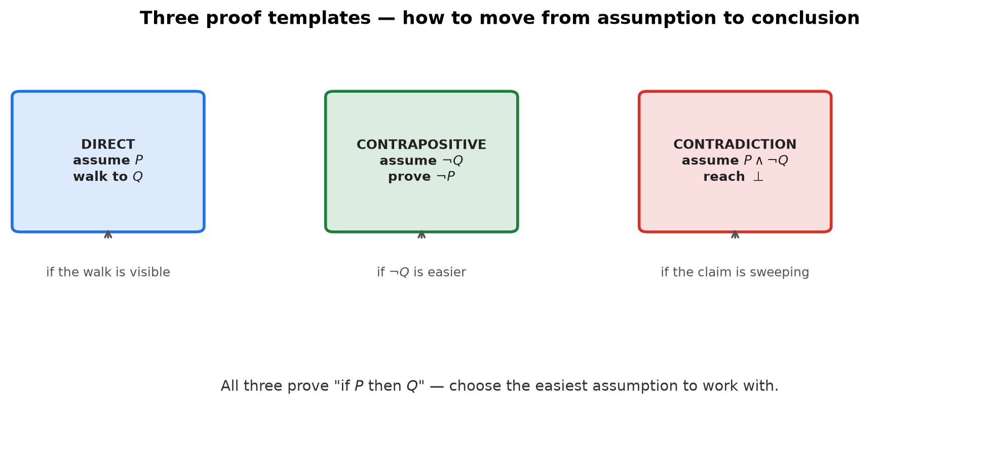
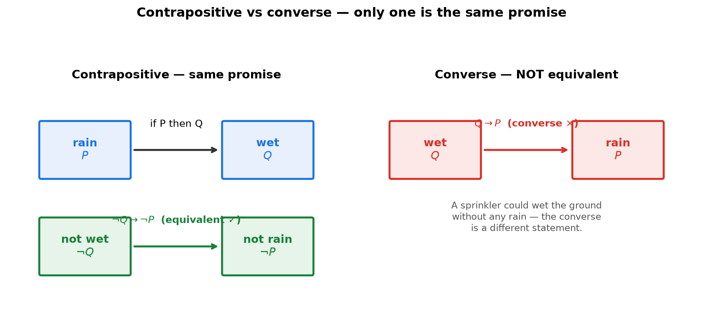
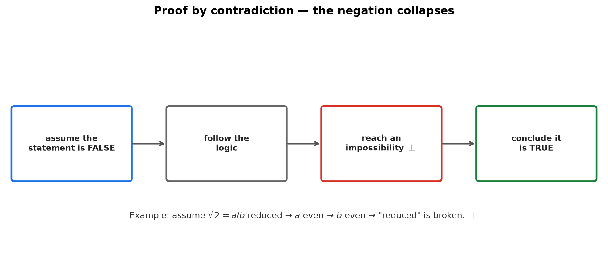

# Session 03: Three Proof Templates — Direct, Contrapositive, Contradiction

**Phase 1 — The Grammar of the Tools | 60 min**

*Prerequisites: [01 — Judging the Truth of Sentences](01-judging-truth-of-sentences.md) (implication, contrapositive), [02 — Handling "All" and "Some"](02-handling-all-and-some.md)*
*Prerequisite for: [04 — The Domino Proof](04-domino-proof-for-all-natural-numbers.md)*

---

## Part A: Direct Proof — Walk From Assumption to Conclusion

A mathematical statement is usually an implication: "if $P$, then $Q$." The first and most natural proof template: **assume $P$ is true, and walk step by step to $Q$.**

---

## Example 1: Direct Proof — Even Squared Is Even

**Prove: "If $n$ is even, then $n^2$ is even."**

Every even number has the form $2 \times (\text{an integer})$. So:

(1) Assume $n$ is even. Write $n = 2k$ for some integer $k$.

(2) Square both sides: $n^2 = (2k)^2 = 4k^2 = 2(2k^2)$.

(3) $2k^2$ is an integer, so $n^2 = 2 \times (\text{an integer})$ — by definition, even.

**Done.** We started from "even" and reached "even squared" in three clean steps.

> **Insight**: Direct proof is a walk: assumption at the door, conclusion at the far wall, each step a legal move. The hardest part is choosing how to *write* the assumption. Here "even" became the concrete form $n = 2k$.



---

## Example 2: Direct Proof — The Product Trick

**Prove: "For all integers $n$, $n^2 + n$ is even."** (No induction yet!)

(1) Factor: $n^2 + n = n(n+1)$.

(2) $n$ and $n+1$ are **consecutive integers** — one of them is even.

(3) The product of anything with an even number is even. → $n(n+1)$ is even.

**Done.** No cases, no induction — one clever factorization.

> **Insight**: Sometimes the "walk" is a single rephrasing. "Two consecutive integers contain an even one" is a mini-lemma you can use without proof.

---

## Part B: Proof by Contrapositive — Prove the Flip Instead

When the direct path from $P$ to $Q$ is blocked, swap the roles. From Session 01, $P \to Q \equiv \neg Q \to \neg P$. So **proving "if not $Q$ then not $P$" proves the original statement.**

---

## Example 3: Contrapositive — Even Square Means Even

**Prove: "If $n^2$ is even, then $n$ is even."**

Directly: $n^2$ even → $n = \sqrt{\text{even}}$ — stuck immediately. Try the contrapositive instead.

The contrapositive is: **"If $n$ is NOT even, then $n^2$ is NOT even"** — i.e., if $n$ is odd, then $n^2$ is odd.

(1) Assume $n$ is odd. Write $n = 2k+1$ for some integer $k$.

(2) Square: $n^2 = (2k+1)^2 = 4k^2 + 4k + 1 = 2(2k^2 + 2k) + 1$.

(3) $2k^2+2k$ is an integer, so $n^2 = 2(\text{int}) + 1$ — by definition, odd.

We proved the contrapositive, so the original is true.

> **Insight**: Odd numbers are easier to write down ($2k+1$) than "the square root of an even number." When the conclusion $Q$ is hard to work with, negate everything and work with $\neg Q$ instead.



**Method — Deciding between direct and contrapositive in 3 steps:**

(1) **Try the direct path.** Assume $P$, take steps toward $Q$. If you reach it — done.

(2) **Blocked? Check the contrapositive.** Is $\neg Q$ easier to assume than $P$? Odd/even and "not divisible" claims usually are.

(3) **Prove $\neg Q \to \neg P$ instead.** It proves the same statement. Never confuse this with the *converse* $Q \to P$, which is a different claim.

---

## Part C: Proof by Contradiction — Assume the Opposite, Explode

Sometimes neither direction is walkable. The third template: **assume the statement is false, and derive something impossible.**

---

## Example 4: Contradiction — $\sqrt{2}$ Is Not a Fraction

**Prove: "$\sqrt{2}$ cannot be written as a fraction."**

(1) **Assume the opposite**: $\sqrt{2} = \frac{a}{b}$ with integers $a, b$, $b \neq 0$, and the fraction fully reduced ($a, b$ have no common factor).

(2) Square both sides: $2 = \frac{a^2}{b^2}$ → $a^2 = 2b^2$. So $a^2$ is even.

(3) By Example 3 (even square → even), $a$ is even. Write $a = 2k$.

(4) Substitute: $(2k)^2 = 2b^2$ → $4k^2 = 2b^2$ → $b^2 = 2k^2$. So $b^2$ is even → $b$ is even.

(5) **Contradiction**: $a$ and $b$ are both even, so the fraction $\frac{a}{b}$ is *not* fully reduced — but we assumed it was.

The assumption must be false. **$\sqrt{2}$ is irrational.**

> **Insight**: Contradiction is a demolition job. You assume the target is false, follow the logic, and watch it collapse into an impossibility — here, "both $a$ and $b$ are even" vs. "the fraction is reduced." The contradiction marks the end.

---

## Example 5: Contradiction — There Are Infinitely Many Primes

**Prove: "There are infinitely many primes."**

(1) **Assume the opposite**: there are finitely many — say $p_1, p_2, \dots, p_k$ are ALL of them.

(2) Build $N = p_1 \cdot p_2 \cdots p_k + 1$.

(3) Divide $N$ by $p_1$: the product part divides evenly, the $+1$ leaves remainder 1. Same for $p_2, \dots, p_k$. So **no listed prime divides $N$.**

(4) But every integer $>1$ has a prime factor (Session 04 proves this cleanly). $N$ must have a prime factor — which cannot be any of $p_1, \dots, p_k$. So there is a prime outside the list.

(5) **Contradiction** with "$p_1, \dots, p_k$ are all the primes."

The assumption is false. **There are infinitely many primes.**

> **Insight**: Contradiction is the weapon of choice when the statement is a sweeping claim ("infinitely many", "cannot be written", "does not exist"). Negating a sweeping claim gives you a finite, concrete object to attack — here, the finite list of primes.



**Method — Proof by contradiction in 3 steps:**

(1) **Assume the statement is false.** Write the negation concretely (a finite list, a fraction, an object that should not exist).

(2) **Follow the logic** until you reach an impossibility: something contradicts itself, a known fact, or the assumption itself.

(3) **Conclude the original statement is true**, because its negation collapsed.

> **Up to here**: Three templates. Direct: $P \Rightarrow Q$. Contrapositive: $\neg Q \Rightarrow \neg P$. Contradiction: $P \land \neg Q \Rightarrow \bot$. Choose by what's easiest to assume.

---

## Common Mistakes

### Mistake 1: Confusing contrapositive with converse

**Wrong**: "If it rains ($P$), the ground is wet ($Q$)" — the reversal is "if the ground is wet, it rained."

**Right**: That is the *converse* ($Q \to P$) and it is a different statement — a sprinkler could have done it. The *contrapositive* is "if the ground is NOT wet, it did NOT rain" ($\neg Q \to \neg P$), which is equivalent to the original. Swap AND negate both.

### Mistake 2: "Proving" by assuming the conclusion

**Wrong**: To prove "if $n^2$ even then $n$ even," start by assuming $n$ is even and deduce $n^2$ is even.

**Right**: That proves the converse, which is not the same claim. Match your assumption to the statement's premise.

### Mistake 3: Forgetting to state the contradiction

**Wrong**: In the $\sqrt{2}$ proof, stopping after showing "$a$ and $b$ are both even."

**Right**: Name the contradiction explicitly: "both even" vs. "fully reduced." The contradiction IS the proof's closing line.

---

## What We Just Did

```
(1) Direct proof: assume P, walk to Q.
    Write the assumption concretely (even → n = 2k).

(2) Contrapositive: P→Q is the same as ¬Q→¬P.
    If ¬Q is easier to assume, prove that instead.
    Never confuse with the converse Q→P.

(3) Contradiction: assume the statement is false,
    follow the logic to an impossibility, conclude it's true.

(4) Decision rule:
    P→Q walkable  → direct.
    ¬Q easier than P → contrapositive.
    sweeping claim / "cannot" / "does not exist" → contradiction.
```

---

## Decision Tree — Choosing a Proof Template

```
You must prove "if P then Q" (or a claim that can be written as one):
├── (1) Can I write P concretely and walk to Q?
│       └── Yes → DIRECT PROOF. (Ex 1, 2)
├── (2) Is ¬Q easier to assume than P?
│       └── Yes → CONTRAPOSITIVE. Prove ¬Q → ¬P. (Ex 3)
├── (3) Is the claim sweeping ("infinitely many",
│       "cannot be written", "does not exist")?
│       └── Yes → CONTRADICTION. Assume false, explode. (Ex 4, 5)
└── (4) None obvious? Try contradiction — it always has
         a concrete negation to start from.
```

---

## Practice 1

**Prove "if $n$ is odd, then $n^3$ is odd"** the same way as Example 1.

→ Reference: **Example 1**

> Solutions: [Solutions](solutions/03-solutions.md#practice-1)

---

## Practice 2

**Prove "if $3n+2$ is even, then $n$ is even"** the way Example 3 does.

→ Reference: **Example 3**

> Solutions: [Solutions](solutions/03-solutions.md#practice-2)

---

## Practice 3

**Prove "if $n^2$ is a multiple of 3, then $n$ is a multiple of 3."** Choose the template and justify the choice in one line.

→ Reference: **Example 3**

> Solutions: [Solutions](solutions/03-solutions.md#practice-3)

---

## Practice 4: Trap

**Prove "$n^2+n$ is even for all integers $n$"** without induction, Example 2 style.
(Hint: split $n^2+n = n(n+1)$.)

→ Reference: **Example 2**

> Solutions: [Solutions](solutions/03-solutions.md#practice-4)

---

## Practice 5

**Prove "$\sqrt{3}$ cannot be written as a fraction"** the way Example 4 does.

→ Reference: **Example 4**

> Solutions: [Solutions](solutions/03-solutions.md#practice-5)

---

## Practice 6: Real Battle

**Prove "the sum of a rational and an irrational number is irrational."** Choose the template and justify.
(Hint: if $a$ is rational and $b$ is irrational and $a+b$ were rational, then $b = (a+b)-a$ would be rational.)

→ Reference: **Examples 4, 5**

> Solutions: [Solutions](solutions/03-solutions.md#practice-6)

---

## Basic Drills

> Choose a template and execute.

**D1.** Prove: if $n$ is even, then $3n$ is even. (Direct)

**D2.** Prove: if $n$ is odd, then $n^2$ is odd. (Direct)

**D3.** Prove: if $n^2$ is even, then $n$ is even. (Contrapositive)

**D4.** Prove: if $5n+1$ is even, then $n$ is odd. (Contrapositive)

**D5.** Prove: if $n$ is even, then $n^2$ is divisible by 4. (Direct)

**D6.** Prove: the product of two even numbers is even. (Direct)

**D7.** Prove: the sum of two odd numbers is even. (Direct)

**D8.** Prove: $\sqrt{5}$ is irrational. (Contradiction)

**D9.** Prove: there is no largest integer. (Contradiction)

**D10.** Prove: if $a < b$, then $a < \frac{a+b}{2} < b$ — there's always a number strictly between. (Direct)

> Solutions: [Solutions](solutions/03-solutions.md#basic-drill)

---

## Advanced Drills

> Multi-step or template-judgment required.

**A1.** Prove: if $n$ is odd, then $n^3$ is odd. Which template did you use and why?

**A2.** Prove: if $n^2$ is a multiple of 5, then $n$ is a multiple of 5. (Mimic the multiple-of-3 argument.)

**A3.** Prove: there are infinitely many primes congruent to … — no. Prove instead: for every integer $n \geq 1$, the number $n! + 1$ has a prime factor greater than $n$.

**A4.** Prove: $\sqrt{6}$ is irrational. (Mimic $\sqrt{2}$/$\sqrt{3}$; you need the multiple-of-2-and-3 step.)

**A5.** Prove: if $a$ and $b$ are odd, then $a^2 + b^2$ is even but not divisible by 4.

**A6.** Prove: the difference of a rational and an irrational is irrational. (Adapt Practice 6.)

**A7.** Prove: if $x$ is irrational, then $\frac{1}{x}$ is irrational (for $x \neq 0$).

**A8.** Prove: $\sqrt{2} + \sqrt{3}$ is irrational. (Hint: suppose it's rational $r$; square; use A4.)

**A9.** Prove: if $a$ divides $b$ and $b$ divides $c$, then $a$ divides $c$ ($a,b,c$ integers, $a \neq 0$). Direct proof with $b = ak$, $c = bl$.

**A10.** Prove: among any 3 consecutive integers, exactly one is a multiple of 3. Then use it to prove $n^3 - n$ is divisible by 3 for all integers $n$.

> Solutions: [Solutions](solutions/03-solutions.md#advanced-drill)

---

## Today's Procedure

```
Step 1: Write the claim as "if P then Q" (if possible).
Step 2: Choose a template:
        - P → Q walkable → direct.
        - ¬Q easier to assume → contrapositive.
        - sweeping / "cannot" → contradiction.
Step 3: Write the assumption, take steps, reach
        Q (direct), ¬P (contrapositive), or ⊥ (contradiction).
```

---

## How to Read These Symbols

| Symbol | Reads as | Meaning |
|:---:|:---:|------|
| $P \to Q$ | "P implies Q" | if P is true, Q must be true |
| $\neg Q \to \neg P$ | "not Q implies not P" | the contrapositive — equivalent to P→Q |
| $Q \to P$ | "Q implies P" | the converse — NOT equivalent |
| $\bot$ | "contradiction" | an impossible statement |
| even / odd | "even" / "odd" | $2k$ / $2k+1$ form |
| irrational | "irrational" | not expressible as a fraction |

---

## Terminology

| What we call it | Math term | Notation |
|:---------------:|:---------:|:--------:|
| assume P, reach Q | direct proof | — |
| prove ¬Q → ¬P | proof by contrapositive | $\neg Q \to \neg P$ |
| assume false, reach ⊥ | proof by contradiction | $\to \bot$ |
| impossible result | contradiction | $\bot$ |
| reversing the arrow | converse | $Q \to P$ |
