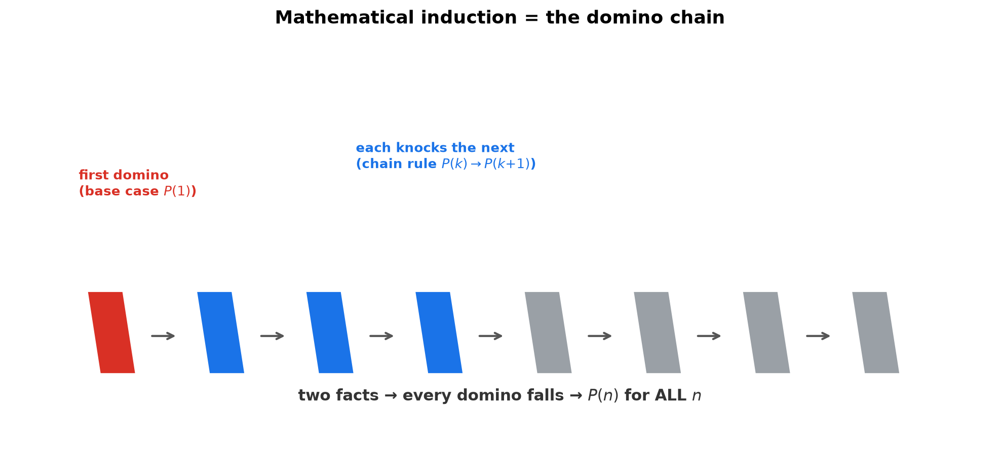
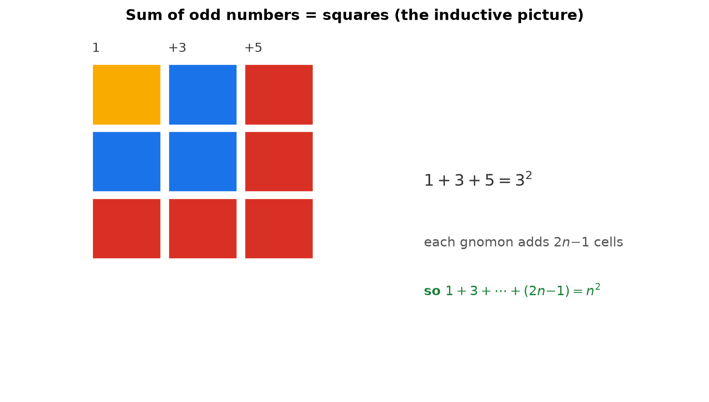
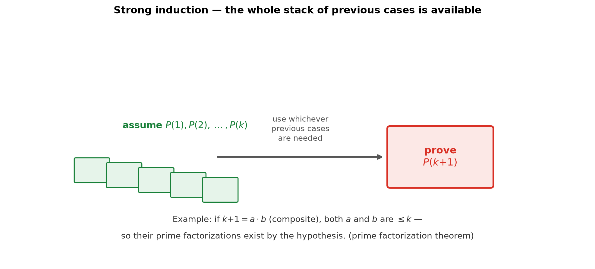

# Session 04: The Domino Proof — Mathematical Induction

**Phase 1 — The Grammar of the Tools | 45 min**

*Prerequisites: [03 — Three Proof Templates](03-three-proof-templates.md) (direct proof), [01 — Judging the Truth of Sentences](01-judging-truth-of-sentences.md) ("for all" quantifier)*
*Prerequisite for: [06 — Gödel's Incompleteness Theorem](06-godels-incompleteness-theorem.md), real analysis (Phase 3)*

---

## Part A: The Problem — Infinitely Many Cases

---

## Example 1: A Formula That Keeps Working

$1 + 2 + \cdots + 100 = 5050$. There is a formula:

$$1 + 2 + \cdots + n = \frac{n(n+1)}{2}$$

Plug in $n=100$: $\frac{100 \cdot 101}{2} = 5050$. It works.

But the formula claims to hold for **every** natural number $n$ — infinitely many cases. Checking $n=1$, $n=2$, … one by one is impossible. How do we know it works for $n = 10^{100}$?

---

## Example 2: The Base Case — Check the First Domino

First, check the smallest case.

**$n=1$**: left side $= 1$. Right side $= \frac{1 \cdot 2}{2} = 1$. They match. ✓

One case verified — one domino standing at the start.

---

## Example 3: The Domino Picture

One case isn't enough. The trick: prove a **chain rule** instead of infinitely many facts.

Imagine a line of dominoes.
- The **first domino falls** (that's the base case, Example 2).
- **If any domino falls, the next one falls too** (that's the chain rule we must prove).

Then every domino falls — first, second, third, … forever.



> **Insight**: We cannot push $10^{100}$ dominoes, but we can prove "falling is contagious." The base case provides the first push; the chain rule spreads it to infinity. Two facts, infinitely many consequences.

---

## Part B: The Chain Rule — From $k$ to $k+1$

---

## Example 4: The Inductive Step for the Sum Formula

**Prove the chain rule: if the formula works for $n=k$, it works for $n=k+1$.**

(1) **Assume** (induction hypothesis): $1 + 2 + \cdots + k = \frac{k(k+1)}{2}$.

(2) **Add the next term** on both sides:

$1 + 2 + \cdots + k + (k+1) = \frac{k(k+1)}{2} + (k+1)$

(3) **Combine the fractions**:

$= \frac{k(k+1) + 2(k+1)}{2} = \frac{(k+1)(k+2)}{2}$

(4) This is exactly $\frac{n(n+1)}{2}$ with $n = k+1$. ✓

**The chain rule is proved**: formula at $k$ ⇒ formula at $k+1$.

---

## Example 5: Assembling the Proof

Now connect everything:

- $n=1$: true (base case, Example 2).
- $n=1$ true ⇒ $n=2$ true (chain rule with $k=1$).
- $n=2$ true ⇒ $n=3$ true (chain rule with $k=2$).
- $n=3$ true ⇒ $n=4$ true …
- … and so on, forever.

**Conclusion: $1 + 2 + \cdots + n = \frac{n(n+1)}{2}$ for every natural number $n$.**

> **Insight**: Induction is the infinite version of a chain of direct proofs. It packages "case 1 ⇒ case 2 ⇒ case 3 ⇒ …" into two checkable facts. This is the backbone of all of mathematics' infinite claims.

**Method — Mathematical induction in 3 steps:**

(1) **Base case.** Verify the claim for $n=1$ (or the smallest allowed $n$).

(2) **Inductive step.** Assume the claim for $n=k$ (the induction hypothesis). Using it, prove the claim for $n=k+1$. *Use the hypothesis — it's there to be used.*

(3) **Conclude.** Base + chain ⇒ true for all $n$.

---

## Example 6: Another Pattern — Multiples of 3

**Prove: for all $n$, $n^3 - n$ is a multiple of 3.**

**Base case** ($n=1$): $1^3 - 1 = 0 = 3 \times 0$. ✓

**Inductive step** ($k \to k+1$):
Assume $k^3 - k = 3m$ for some integer $m$ (induction hypothesis).

$(k+1)^3 - (k+1) = k^3 + 3k^2 + 3k + 1 - k - 1$
$= (k^3 - k) + 3k^2 + 3k$
$= 3m + 3(k^2 + k)$ (using the hypothesis!)
$= 3(m + k^2 + k)$. ✓ A multiple of 3.

**Conclusion**: by induction, $n^3 - n$ is a multiple of 3 for all $n$.

> **Insight**: The whole inductive step is: *carve out the $k$-case from the $(k+1)$-case, replace it with the hypothesis, and factor the leftover.* If you don't see "$k^3-k$" appear in $(k+1)^3-(k+1)$, look again — it's almost always hiding inside.



---

## Part C: Strong Induction — Assume All Previous Cases

---

## Example 7: When One Case Isn't Enough

Sometimes $k+1$ depends not on case $k$ alone, but on earlier cases (like $k-1$, or all of them). Then assume **all** cases up to $k$.

**Prove: every integer $n \geq 2$ is a product of primes.**

**Base case** ($n=2$): 2 is prime — a "product" of one prime. ✓

**Inductive step**: assume every integer from $2$ up to $k$ is a product of primes. Look at $n = k+1$.

- If $k+1$ is prime → it's already a product of one prime. ✓
- If $k+1$ is composite → $k+1 = a \times b$ with $2 \leq a, b \leq k$. By the (strong) hypothesis, $a$ and $b$ are each products of primes. Multiply those products → $k+1$ is a product of primes. ✓

**Conclusion**: every integer $\geq 2$ is a product of primes.

> **Insight**: For a composite $k+1 = a \times b$, we needed the factorization of both $a$ *and* $b$ — not just of $k$. Strong induction hands you the whole stack of previous cases, which is exactly what such "splitting" proofs need.



**Method — Strong induction in 3 steps:**

(1) **Base case(s).** Verify the smallest case(s) — sometimes you need two (e.g., Fibonacci needs $F_1$ and $F_2$).

(2) **Strong inductive step.** Assume the claim for ALL cases $2, 3, \dots, k$. Prove it for $k+1$, using whichever previous cases you need.

(3) **Conclude.** Holds for all $n \geq$ base.

> **Up to here**: Induction = base case + chain rule. Strong induction = base case + "all previous cases" rule. Use strong induction when case $k+1$ splits into smaller pieces.

---

## Common Mistakes

### Mistake 1: Skipping the base case

**Wrong**: Prove only the inductive step and declare victory.

**Right**: Without the base case, the dominoes never start. Example: the false claim "$n = n+1$" survives the inductive step — assuming $k = k+1$ gives $k+1 = k+2$ — but fails at $n=1$ ($1 \neq 2$). The chain is intact, the first domino never falls.

### Mistake 2: Not using the induction hypothesis

**Wrong**: In the $(k+1)$-case, plowing ahead with algebra and never substituting $1 + \cdots + k = \frac{k(k+1)}{2}$.

**Right**: The hypothesis is the point. If your $(k+1)$-step doesn't invoke it, you're doing the same work for every case — not induction.

### Mistake 3: Concluding "$n < 100$ for all $n$" by induction

**Wrong**: "If $k < 100$, then $k+1 < 101$" — looks like a chain rule, so induction works?

**Right**: The chain rule must prove $P(k) \Rightarrow P(k+1)$ where $P(n)$ is "$n<100$". At $k=99$, $P(99)$ is true but $P(100)$ is false — the link is broken. A broken link means the chain stops.

---

## What We Just Did

```
(1) Induction proves "for all n" with two facts:
    Base case: P(1) true.   (first domino)
    Chain rule: P(k) → P(k+1).   (domino link)

(2) To run the chain rule:
    - Write down P(k) (the hypothesis).
    - Build the (k+1)-case and carve out the k-case inside it.
    - Replace the k-case with the hypothesis.
    - Factor / simplify to close the proof.

(3) Strong induction: assume P(2), P(3), ..., P(k) all together.
    Use it when case k+1 splits into smaller parts
    (primes, Fibonacci, tiling).
```

---

## Decision Tree — Induction or Not?

```
You must prove "for all natural numbers n, P(n)":
├── (1) Can you check the smallest case?
│       └── No → induction can't start. Rethink.
├── (2) Does P(k+1) follow from P(k) alone?
│       ├── Yes → ORDINARY INDUCTION. (Ex 4, 6)
│       └── No — it needs P(k−1) or earlier →
│           STRONG INDUCTION. (Ex 7)
├── (3) Does the claim split into pieces?
│       └── Yes → strong induction, use all previous cases.
└── (4) Is the claim actually false at some n?
        └── Check small cases BEFORE proving. (Mistake 3)
```

---

## Practice 1

**Prove $1 + 3 + 5 + \cdots + (2n-1) = n^2$** (the sum of the first $n$ odd numbers) by induction.

→ Reference: **Example 4**

> Solutions: [Solutions](solutions/04-solutions.md#practice-1)

---

## Practice 2

**Prove $2^n > n$ for all natural numbers $n$** by induction.

→ Reference: **Examples 4, 5**

> Solutions: [Solutions](solutions/04-solutions.md#practice-2)

---

## Practice 3

**Prove $1^2 + 2^2 + \cdots + n^2 = \frac{n(n+1)(2n+1)}{6}$** by induction.

→ Reference: **Example 4**

> Solutions: [Solutions](solutions/04-solutions.md#practice-3)

---

## Practice 4: Trap

**Someone tries to prove "$n < 100$ for all $n$" by induction.** They argue: if $k < 100$ then $k+1 < 101$ (true), so the chain rule "holds." Where does the induction fail?

→ Reference: **Examples 3, 4**

> Solutions: [Solutions](solutions/04-solutions.md#practice-4)

---

## Practice 5

**Fibonacci: $F_1=1$, $F_2=1$, $F_n = F_{n-1}+F_{n-2}$.** Prove $F_n < 2^n$ for all $n \geq 1$ by strong induction.

→ Reference: **Example 7**

> Solutions: [Solutions](solutions/04-solutions.md#practice-5)

---

## Practice 6: Real Battle

**A $2^k \times 2^k$ checkerboard with one square removed can be tiled by L-shaped trominoes.** Prove it by induction. (How do you tile a $2\times2$ board? How do you grow a $2^k$ tiling to a $2^{k+1}$ tiling?)

→ Reference: **Example 6**

> Solutions: [Solutions](solutions/04-solutions.md#practice-6)

---

## Basic Drills

> Apply the 3-step induction template.

**D1.** Prove $1 + 2 + \cdots + n = \frac{n(n+1)}{2}$ (base case + one chain step written out).

**D2.** Prove $3 + 6 + 9 + \cdots + 3n = \frac{3n(n+1)}{2}$.

**D3.** Prove $2 + 4 + 6 + \cdots + 2n = n(n+1)$.

**D4.** Prove $1 + 2 + 4 + \cdots + 2^{n-1} = 2^n - 1$.

**D5.** Prove $n < 2^n$ for all $n \geq 1$.

**D6.** Prove $3^n \geq 2n + 1$ for all $n \geq 1$.

**D7.** Prove $n^2 \geq n$ for all natural numbers $n$.

**D8.** Prove $2n + 1 < 2^n$ for all $n \geq 3$ (start the base case at $n=3$!).

**D9.** Prove that $n^3 - n$ is divisible by 6 for all $n \geq 1$. (Two divisibility claims, one induction.)

**D10.** Prove $1 + 2 + \cdots + n = \frac{n(n+1)}{2}$ again, but this time note where the induction hypothesis is used.

> Solutions: [Solutions](solutions/04-solutions.md#basic-drill)

---

## Advanced Drills

> Strong induction, structural thinking, real problems.

**A1.** Prove $F_n \geq 2^{n/2}$ for all $n \geq 6$ (Fibonacci). Hint: $F_{n+1} = F_n + F_{n-1} \geq 2^{n/2} + 2^{(n-1)/2} = 2^{(n-1)/2}(1+\sqrt{2}) > 2^{(n+1)/2}$.

**A2.** Prove that every integer $n \geq 2$ has a prime factor (strong induction — the key lemma used in Example 5 of Session 03!).

**A3.** Prove that a $2^n \times 2^n$ board minus one square is tiled by L-trominoes (the full version of Practice 6).

**A4.** Prove that every amount of postage $\geq 8$ cents can be made with 3-cent and 5-cent stamps.

**A5.** Prove $1^3 + 2^3 + \cdots + n^3 = \left(\frac{n(n+1)}{2}\right)^2$.

**A6.** Prove $1 \cdot 2 + 2 \cdot 3 + \cdots + n(n+1) = \frac{n(n+1)(n+2)}{3}$.

**A7.** Prove that a sequence defined by $a_1 = 2$, $a_{n+1} = a_n + 2n + 1$ satisfies $a_n = n^2 + 1$ for all $n$.

**A8.** Prove that every natural number $n$ can be written as a sum of distinct powers of 2 (binary representation!) by strong induction.

**A9.** Prove $\sum_{i=1}^{n} \frac{1}{i(i+1)} = \frac{n}{n+1}$ (telescoping — the inductive step is one line).

**A10.** Prove that the Tower of Hanoi puzzle with $n$ disks needs exactly $2^n - 1$ moves (strong induction: moving $n$ disks = move $n-1$, move 1, move $n-1$ again).

> Solutions: [Solutions](solutions/04-solutions.md#advanced-drill)

---

## Today's Procedure

```
Step 1: Base case — verify P(1) (or the smallest n).
Step 2: Inductive step — assume P(k), prove P(k+1).
        Carve the k-case out of the (k+1)-case, use the hypothesis.
Step 3: Both done → P(n) holds for every natural number n.
        (Strong version: assume P(2)...P(k) when the claim splits.)
```

---

## How to Read These Symbols

| Symbol | Reads as | Meaning |
|:---:|:---:|------|
| $P(n)$ | "P of n" | the claim being proved for the number n |
| base case | "base case" | verifying P at the smallest n — the first domino |
| induction hypothesis | "induction hypothesis" | assuming P(k) to build the chain |
| inductive step | "inductive step" | proving P(k) ⇒ P(k+1) |
| strong induction | "strong induction" | assuming P(2)…P(k) all at once |
| $F_n$ | "F sub n" | the nth Fibonacci number |

---

## Terminology

| What we call it | Math term | Notation |
|:---------------:|:---------:|:--------:|
| first domino | base case | $P(n_0)$ |
| "suppose true for k" | induction hypothesis | $P(k)$ |
| "then true for k+1" | inductive step | $P(k) \to P(k+1)$ |
| all previous cases | strong induction | $P(2) \land \dots \land P(k)$ |
| two-fact proof for all n | mathematical induction | — |
