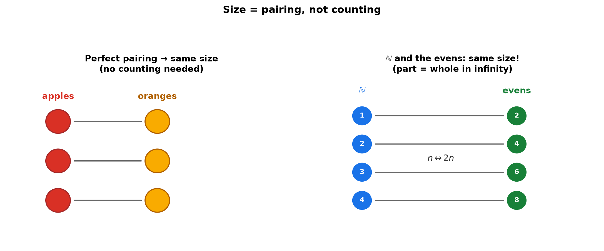
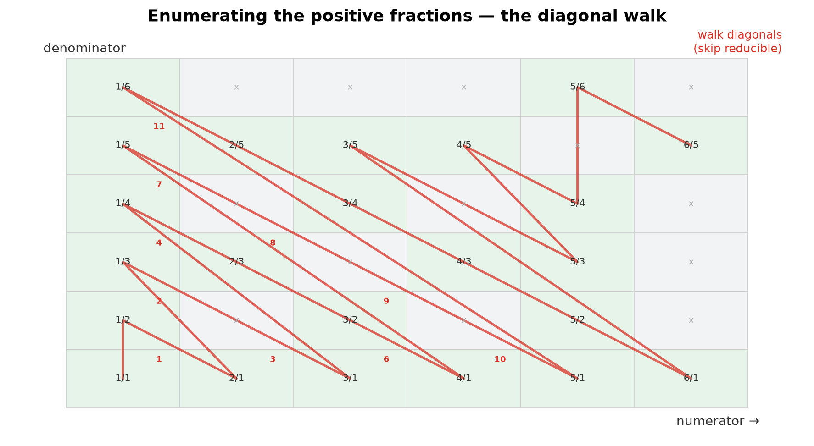
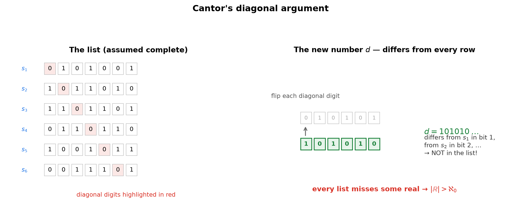
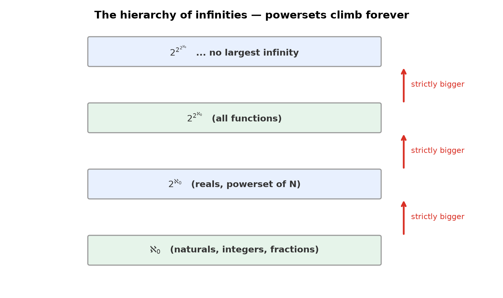

# Session 05: Counting Infinite Sets — Sizes of Infinity

**Phase 1 — The Grammar of the Tools | 90 min**

*Prerequisites: [01 — Judging the Truth of Sentences](01-judging-truth-of-sentences.md), [02 — Handling "All" and "Some"](02-handling-all-and-some.md) (quantifiers), [03 — Three Proof Templates](03-three-proof-templates.md) (contradiction)*
*Prerequisite for: [06 — Gödel's Incompleteness Theorem](06-godels-incompleteness-theorem.md), Phase 3 (real analysis)*

---

## Part A: Comparing Sizes Without Counting — Pairing

---

## Example 1: The Pairing Test

A basket holds 3 apples and 3 oranges. Which is more?

Pair them one-to-one: 🍎–🍊, 🍎–🍊, 🍎–🍊. Perfect match — no leftovers on either side. **They have the same size.**

We never counted "3." We just checked that a perfect pairing exists. That idea extends to infinite sets, where counting is impossible.

> **Insight**: "Same size" = there exists a pairing that matches every element of one set to a different element of the other, with nothing left over on either side. This is the definition of a **bijection**.



---

## Example 2: Natural Numbers vs Even Numbers — Same Size!

Both are infinite: $\mathbb{N} = \{1, 2, 3, 4, 5, \dots\}$ and the evens $\{2, 4, 6, 8, 10, \dots\}$.

Pair them:

| natural | 1 | 2 | 3 | 4 | 5 | … |
|:---:|:---:|:---:|:---:|:---:|:---:|:---:|
| even | 2 | 4 | 6 | 8 | 10 | … |

Rule: $n \leftrightarrow 2n$. Every natural number gets a partner, every even number is used exactly once.

**$\mathbb{N}$ and the evens have the same size** — even though the evens are only "half" of $\mathbb{N}$.

> **Insight**: This is the moment infinity breaks finite intuition. A proper subset (evens ⊂ naturals) can be the same size as the whole set. "The part is smaller than the whole" is a finite-world rule only.


---

## Example 3: Natural Numbers vs Integers — Same Size!

Integers: $\dots, -3, -2, -1, 0, 1, 2, 3, \dots$ — they stretch in both directions, so "first integer" is unclear. The fix: **reorder them into a list.**

| natural | 1 | 2 | 3 | 4 | 5 | 6 | 7 | … |
|:---:|:---:|:---:|:---:|:---:|:---:|:---:|:---:|
| integer | 0 | 1 | −1 | 2 | −2 | 3 | −3 | … |

Rule: odd $n \mapsto \frac{n-1}{2}$ (the nonnegatives), even $n \mapsto -\frac{n}{2}$ (the negatives). Every integer appears exactly once.

**$\mathbb{N}$ and $\mathbb{Z}$ have the same size.**

> **Insight**: An infinite set that can be laid out as a list — first element, second element, … — is *countable* in the technical sense. The ability to *list* is the real test of size.

---

## Example 4: Natural Numbers vs Fractions — Same Size!

Positive fractions: $\frac{1}{1}, \frac{1}{2}, \frac{2}{1}, \frac{1}{3}, \frac{3}{1}, \frac{1}{4}, \frac{2}{3}, \dots$

Arrange all fractions in a grid by numerator and denominator, then **walk the diagonals**, skipping fractions that reduce (e.g., skip $\frac{2}{2}$ since $\frac{1}{1}$ is already listed).

| order | 1 | 2 | 3 | 4 | 5 | 6 | 7 | … |
|:---:|:---:|:---:|:---:|:---:|:---:|:---:|:---:|
| fraction | $\frac{1}{1}$ | $\frac{1}{2}$ | $\frac{2}{1}$ | $\frac{1}{3}$ | $\frac{3}{1}$ | $\frac{1}{4}$ | $\frac{2}{3}$ | … |

Every positive fraction appears somewhere in the list.

**$\mathbb{N}$ and $\mathbb{Q}^+$ have the same size** — hence so do $\mathbb{N}$ and all of $\mathbb{Q}$.



> **Insight**: Fractions look "dense" — between any two there's another — yet they can be listed. Listing doesn't need closeness or order; it needs a systematic sweep that never misses anything. The diagonal walk is that sweep.

> **Up to here**: Pairing is the size test. Evens, integers, and fractions all pair perfectly with $\mathbb{N}$. They all have the same size, called $\aleph_0$. So far, every infinite set we've met has been $\aleph_0$ — is everything?

---

## Part B: The Diagonal Argument — A Bigger Infinity

---

## Example 5: Real Numbers Are Bigger — Cantor's Diagonal

**Claim: the real numbers in $(0,1)$ cannot be listed. Every list misses some real.**

Assume a complete list exists:

1st: 0.$\mathbf{3}$20145…
2nd: 0.1$\mathbf{7}$8932…
3rd: 0.94$\mathbf{1}$667…
4th: 0.702$\mathbf{0}$81…
…

(1) **Walk the diagonal**: take the 1st digit of the 1st number (3), the 2nd digit of the 2nd (7), the 3rd digit of the 3rd (1), the 4th digit of the 4th (0), …

(2) **Change every diagonal digit** (3→4, 7→8, 1→2, 0→1, …). Call the result $d = 0.4821\dots$

(3) **$d$ is not in the list.** It differs from the 1st number in digit 1, from the 2nd in digit 2, from the $n$th in digit $n$ — by construction.

Every list fails; some real is always left out.



> **Insight**: This is a proof by contradiction (Session 03) at its most famous. Assume the list, build a number that *differs from every listed number*, and watch the assumption die. The diagonal is the machine that guarantees the new number is new.

> **Up to here**: $\mathbb{N}, \mathbb{Z}, \mathbb{Q}$ are all the same size ($\aleph_0$). The reals are strictly larger. Two sizes of infinity so far — and the reals' size is $2^{\aleph_0}$, which is bigger than $\aleph_0$.

---

## Part C: The Hierarchy — Powerset and Beyond

---

## Example 6: Powersets Are Always Bigger

For any set $S$, its **powerset** $\mathcal{P}(S)$ (all subsets of $S$) is strictly bigger than $S$. For finite $S$ with $|S| = m$: $|\mathcal{P}(S)| = 2^m$.

- $S = \{1, 2, 3\}$: $|\mathcal{P}(S)| = 8 > 3$. ✓
- $S = \mathbb{N}$: $|\mathcal{P}(\mathbb{N})| = 2^{\aleph_0}$, and $2^{\aleph_0} > \aleph_0$.

The diagonal argument generalizes: no matter how you try to pair subsets of $\mathbb{N}$ with natural numbers, the set "$n$ such that $n \notin f(n)$" is left out.

> **Insight**: There is no largest infinity. $\aleph_0 < 2^{\aleph_0} < 2^{2^{\aleph_0}} < \cdots$ — an endless ladder. The diagonal argument is the tool that climbs each rung.



---

## Common Mistakes

### Mistake 1: "All infinities are the same size"

**Wrong**: "Infinite is infinite; $\mathbb{N}$ and $\mathbb{R}$ must be the same."

**Right**: $\mathbb{R}$ is strictly bigger than $\mathbb{N}$ — Cantor's diagonal argument proves any listing of the reals misses some number. There is a genuine hierarchy of infinities.

### Mistake 2: Thinking "$\mathbb{Z}$ contains $\mathbb{N}$, so $\mathbb{Z}$ is bigger"

**Wrong**: "$\mathbb{Z}$ has all of $\mathbb{N}$ inside plus negatives, so more elements."

**Right**: Size is decided by the existence of a pairing, not by inclusion. $\mathbb{N} \leftrightarrow \mathbb{Z}$ pairs perfectly (Example 3). Infinite sets can equal their proper subsets — the defining difference between finite and infinite.

### Mistake 3: "$\mathbb{Q}$ is dense, so it can't be listed"

**Wrong**: "Between any two fractions there's another fraction, so listing is impossible."

**Right**: Density is about order, not size. The diagonal-walk listing (Example 4) sweeps every fraction — density doesn't stop listing.

---

## What We Just Did

```
(1) Size = pairing. A perfect one-to-one matching (bijection)
    means two sets have the same size — no counting needed.

(2) N ↔ evens, N ↔ Z, N ↔ Q — all pair perfectly.
    All have size ℵ₀ ("countably infinite").

(3) Diagonal argument: any list of reals misses a real.
    Proof by contradiction + the diagonal construction.
    → |ℝ| > ℵ₀.

(4) Powersets: |P(S)| > |S| always.
    ℵ₀ < 2^ℵ₀ < 2^(2^ℵ₀) < ... — no largest infinity.
```

---

## Decision Tree — Comparing Two Sets

```
Are sets A and B the same size?
├── (1) Can I write a one-to-one pairing rule?
│       └── Yes → same size. (n ↔ 2n, diagonal walk, ...)
├── (2) Can I LIST one of them?
│       ├── Yes → it's countable (size ℵ₀ if infinite).
│       └── No — any listing misses something →
│           it's uncountable, strictly bigger.
├── (3) To prove "B is bigger than A":
│       assume a pairing/list exists,
│       build the element that must be left out (diagonal),
│       contradict the assumption.
└── (4) Powerset shortcut: |P(S)| > |S| for any S.
```

---

## Practice 1

**Do the even numbers and the odd numbers have the same size?** Show the pairing.

→ Reference: **Example 2**

> Solutions: [Solutions](solutions/05-solutions.md#practice-1)

---

## Practice 2

**Do the natural numbers and the multiples of 3 $\{3, 6, 9, 12, \dots\}$ have the same size?** Show the pairing.

→ Reference: **Example 2**

> Solutions: [Solutions](solutions/05-solutions.md#practice-2)

---

## Practice 3

**Which is bigger: all integers or all fractions?** Explain with a pairing or the diagonal argument.

→ Reference: **Examples 3, 4**

> Solutions: [Solutions](solutions/05-solutions.md#practice-3)

---

## Practice 4: Trap

**"$\mathbb{N}$ and $\mathbb{Z}$ have the same size, but $\mathbb{Z}$ contains $\mathbb{N}$. Isn't that a contradiction?"** Answer this objection.

→ Reference: **Example 3**

> Solutions: [Solutions](solutions/05-solutions.md#practice-4)

---

## Practice 5

**Prove $|\mathcal{P}(\mathbb{N})| > |\mathbb{N}|$** in the style of the diagonal argument. (Hint: suppose $f: \mathbb{N} \to \mathcal{P}(\mathbb{N})$ is a bijection and consider the set of $n$ such that $n \notin f(n)$.)

→ Reference: **Example 5**

> Solutions: [Solutions](solutions/05-solutions.md#practice-5)

---

## Practice 6: Real Battle

**Is $|\mathbb{N} \times \mathbb{N}|$ equal to $\aleph_0$?** Give an explicit pairing. (Hint: draw the pairs $(a,b)$ as a 2D grid and sweep the diagonals.)

→ Reference: **Example 4**

> Solutions: [Solutions](solutions/05-solutions.md#practice-6)

---

## Basic Drills

> Decide the size, give the pairing.

**D1.** Are the perfect squares $\{1, 4, 9, 16, \dots\}$ the same size as $\mathbb{N}$?

**D2.** Are the powers of 2 $\{1, 2, 4, 8, \dots\}$ the same size as $\mathbb{N}$?

**D3.** Are the integers $\geq 100$ the same size as $\mathbb{N}$?

**D4.** Is the set $\{0, 1\}$-strings of finite length countable?

**D5.** Is the set of all finite strings over $\{0,1\}$ countable?

**D6.** Is $\mathbb{Z}$ countable? Give the pairing rule.

**D7.** Is the set of all finite subsets of $\mathbb{N}$ countable? (One sentence of reasoning.)

**D8.** Is $\mathbb{R}$ countable? Why not?

**D9.** Are the numbers in $[0,1]$ and the numbers in $[0,2]$ the same size? (Pairing: $x \leftrightarrow 2x$.)

**D10.** Is the empty set's powerset $\mathcal{P}(\emptyset)$ bigger than $\emptyset$? How many elements does it have?

> Solutions: [Solutions](solutions/05-solutions.md#basic-drill)

---

## Advanced Drills

> Multi-step — diagonal constructions and hierarchy.

**A1.** Prove $|\mathbb{N} \times \mathbb{N}| = \aleph_0$ with an explicit formula (pairing $(a,b)$ with a natural number).

**A2.** Prove that the set of all *finite* subsets of $\mathbb{N}$ is countable (map each subset to a natural number via binary encoding).

**A3.** Prove that the set of all *infinite* binary strings is uncountable (diagonal argument on strings).

**A4.** Show that $|(0,1)| = |\mathbb{R}|$ via the pairing $x \mapsto \tan(\pi x - \pi/2)$ (or another explicit bijection).

**A5.** Show that $|(0,1)| = |(0,1) \times (0,1)|$ is hard to write down explicitly — but explain why $\mathbb{R}$ and $\mathbb{R}^2$ have the same cardinality using the diagonal-digit interleaving idea.

**A6.** Prove that the set of all *sequences* of natural numbers is uncountable. (Hint: diagonal argument on sequences.)

**A7.** Prove that there is no bijection between $S$ and $\mathcal{P}(S)$ — generalize the diagonal argument to any set $S$.

**A8.** Is the set of all *polynomials with integer coefficients* countable? (Hint: finite degree + countable coefficients.)

**A9.** The set of all *real* polynomials — countable or uncountable? Explain the difference from A8.

**A10.** Prove $|\mathbb{R}| = |\mathcal{P}(\mathbb{N})|$ in idea form: each real's binary expansion is an infinite 0/1 string, i.e., a subset of $\mathbb{N}$ (positions of 1s). Handle the two-expansion ambiguity in one sentence.

> Solutions: [Solutions](solutions/05-solutions.md#advanced-drill)

---

## Today's Procedure

```
Step 1: Same size? Build a perfect pairing (bijection).
        One-to-one, nothing left over on either side.
Step 2: Countable? Can you list it (first, second, ...)?
        Yes → size ℵ₀. No → uncountable, bigger.
Step 3: Prove "bigger"? Assume the pairing, construct the
        left-out element with the diagonal, reach a contradiction.
Step 4: Powersets always win: |P(S)| > |S|.
```

---

## How to Read These Symbols

| Symbol | Reads as | Meaning |
|:---:|:---:|------|
| $\lvert A\rvert = \lvert B\rvert$ | "the size of A equals the size of B" | a perfect pairing exists |
| bijection | "bijection" | one-to-one pairing, nothing left over |
| $\aleph_0$ | "aleph null" | the size of $\mathbb{N}$ — countably infinite |
| $2^{\aleph_0}$ | "two to the aleph null" | the size of $\mathbb{R}$ and $\mathcal{P}(\mathbb{N})$ |
| $\mathcal{P}(S)$ | "the powerset of S" | the set of all subsets of S |
| diagonal argument | "diagonal argument" | build an element that differs from every listed one |
| countable | "countable" | can be listed / paired with $\mathbb{N}$ |
| uncountable | "uncountable" | too many to list (e.g., $\mathbb{R}$) |

---

## Terminology

| What we call it | Math term | Notation |
|:---------------:|:---------:|:--------:|
| perfect pairing | bijection | $A \cong B$ |
| same size | equal cardinality | $\lvert A\rvert = \lvert B\rvert$ |
| listable size | countably infinite | $\aleph_0$ |
| unlistable size | uncountable | $2^{\aleph_0}$ |
| the left-out number | Cantor's diagonal argument | — |
| all subsets | powerset | $\mathcal{P}(S)$ |
| size of a set | cardinality | $\lvert S\rvert$ |
