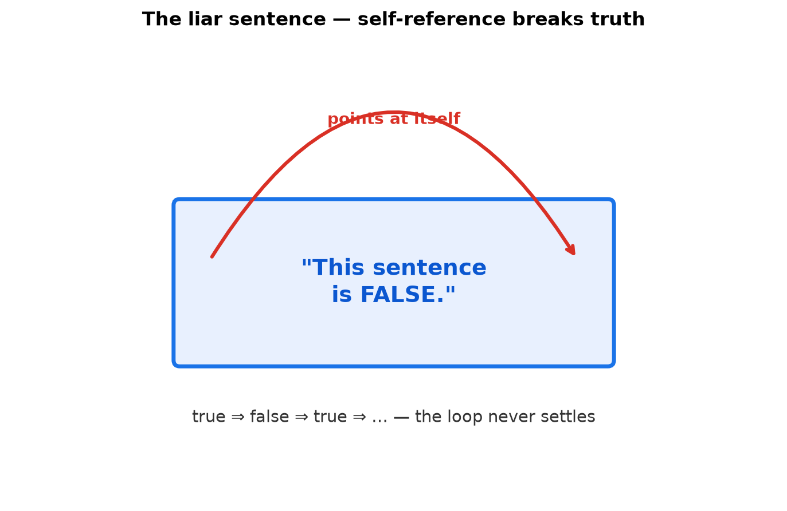
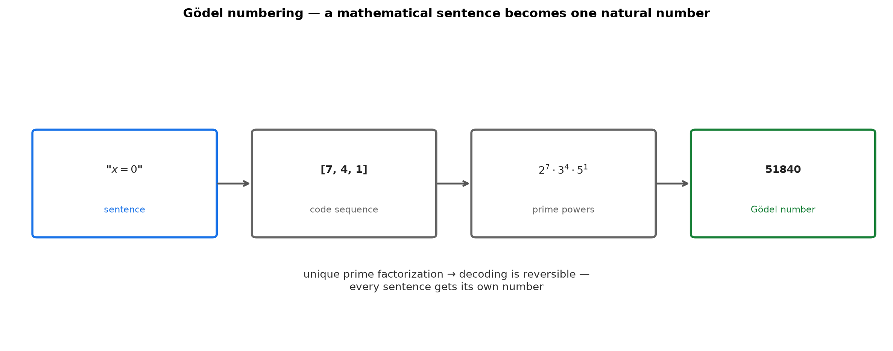
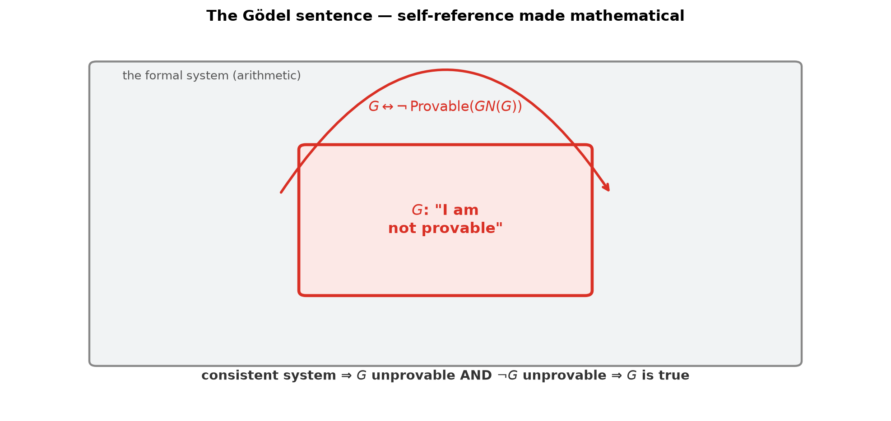

# Session 06: Gödel's Incompleteness Theorem — Mathematics That Cannot Decide

**Phase 1 — The Grammar of the Tools | 120 min**

*Prerequisites: [01 — Judging the Truth of Sentences](01-judging-truth-of-sentences.md) (negation, truth tables), [02 — Handling "All" and "Some"](02-handling-all-and-some.md), [03 — Three Proof Templates](03-three-proof-templates.md) (contradiction), [04 — The Domino Proof](04-domino-proof-for-all-natural-numbers.md), [05 — Counting Infinite Sets](05-counting-infinite-sets.md) (encoding ideas)*

*Prerequisite for: Phase 3 (rigorous foundations), computability and complexity (later)*

---

## Part A: Self-Reference — The Engine of Paradox

---

## Example 1: The Liar Sentence

> "This sentence is false."

- If it is true, then what it says is true — so it is false. Contradiction.
- If it is false, then what it says is false — so it is true. Contradiction.

A sentence that points at itself can be **neither true nor false** under the ordinary rules. This is the *liar paradox*.

> **Insight**: The paradox lives entirely in **self-reference** — a sentence about its own truth value. Gödel's masterstroke was to import this self-reference into mathematics, where it stops being a fun puzzle and becomes a limit theorem.



---

## Example 2: The Barber Paradox — Self-Reference in Action

> "In this village, there is a barber who shaves exactly those people who do not shave themselves."

Does the barber shave himself?

- If he shaves himself → he is a self-shaver → he is **not** in the barber's clientele → he should **not** shave himself. Contradiction.
- If he doesn't shave himself → he is a non-self-shaver → the barber **must** shave him → he shaves himself. Contradiction.

Either way, contradiction. **Such a barber cannot exist.**

> **Insight**: The barber paradox is the same machine as the liar — a claim that must apply to itself. The conclusion is *existence fails*: no such object can satisfy the description. Gödel will use this exact shape on mathematics itself.

---

## Part B: Turning Math into Numbers — Gödel Numbering

---

## Example 3: Everything Is Already a Number

The barber paradox is about a village; mathematics is about numbers. Can we build a "barber" inside mathematics?

Yes — if we can make mathematics **talk about its own sentences**. And every sentence can be turned into a single number.

Think of a computer: every program is a string of 0s and 1s; the letter 'A' is stored as the number 65. Long texts are big numbers. The same trick works for mathematical sentences.

---

## Example 4: Gödel Numbering — One Sentence, One Number

Give every symbol a number:

| symbol | 0 | $+$ | $\times$ | $=$ | $\neg$ | $\forall$ | $x$ | $y$ |
|:---:|:---:|:---:|:---:|:---:|:---:|:---:|:---:|:---:|
| code | 1 | 2 | 3 | 4 | 5 | 6 | 7 | 8 |

The sentence "$x = 0$" becomes the sequence of codes $[7, 4, 1]$.

Compress the sequence into one big number with **prime powers**:

$$2^7 \times 3^4 \times 5^1 = 128 \times 81 \times 5 = 51840$$

This is the **Gödel number** of the sentence. Because prime factorization is unique, the sentence can always be recovered from its number — the encoding is reversible.



> **Insight**: Prime powers are the lockbox: the sequence of codes is sealed into one number, and unique factorization is the key that opens it. Every mathematical sentence becomes a natural number, so mathematics can count, sort, and *talk about* its own sentences.

**Method — Gödel-encoding a sentence in 3 steps:**

(1) **Translate each symbol to its code number** — the sentence becomes a sequence of codes.

(2) **Raise successive primes to those codes** and multiply: $2^{c_1} \cdot 3^{c_2} \cdot 5^{c_3} \cdots$

(3) **The product is the sentence's Gödel number** $\ulcorner\phi\urcorner$. Decoding = prime-factorize and read the exponents.

---

## Part C: The Provability Predicate — Math Talking About Proofs

---

## Example 5: "This sentence is provable" Can Be Written

Now that sentences are numbers, build a predicate:

$$\text{Provable}(x) = \text{"the sentence with Gödel number } x \text{ can be proved in this system"}$$

Is this expressible in arithmetic? Yes — because **checking a proof is mechanical**:

- A proof is a finite sequence of sentences, each either an axiom or obtained from earlier ones by an inference rule (e.g., modus ponens: from $P$ and $P \to Q$, derive $Q$).
- "Is this line a valid application of modus ponens?" is a purely syntactic check — compare shapes, no meaning involved.
- Arithmetic can simulate such digit-level checks (this is the content of Gödel's coding: the check becomes a computation on numbers).

So $\text{Provable}(x)$ is a genuine arithmetical statement.

> **Insight**: Provability is not mysterious — it's a checkable, mechanical process. "Is there a proof of this sentence?" becomes a question about numbers, exactly the kind of question arithmetic can express. This is the bridge that lets mathematics discuss itself.

---

## Part D: The Gödel Sentence — "I Am Not Provable"

---

## Example 6: Building the Self-Referential Sentence

We need a mathematical version of "this sentence is false." The trick: construct a sentence $G$ that says **"I am not provable."**

Using self-reference (the same machinery as the liar sentence, made rigorous via the diagonal construction):

> $G$: "The sentence with Gödel number $\ulcorner G\urcorner$ is not provable."

That is, $G \leftrightarrow \neg\,\text{Provable}(\ulcorner G\urcorner)$.

$G$ is a *mathematical* sentence about a *number* — yet that number encodes $G$ itself. The sentence loops back on itself, exactly like the liar — but "false" has been replaced by "not provable," which is much safer.



---

## Example 7: Why $G$ Is True but Unprovable

Assume the system is **consistent** (it never proves false statements).

**Case 1 — suppose $G$ is provable.** Then the system proves $G$ is true. But $G$ says "I am not provable" — so provability of $G$ makes $G$'s claim false. The system proves a false statement → inconsistent. Contradiction. **So $G$ is not provable.**

**Case 2 — suppose $\neg G$ is provable.** Then the system proves "$G$ is provable." But we just showed $G$ is not provable — so the system proves a false statement → inconsistent. Contradiction. **So $\neg G$ is not provable either.**

**Conclusion**: neither $G$ nor $\neg G$ is provable. But $G$ says "I am not provable," and that's exactly the truth. **$G$ is true and unprovable.**


> **Insight**: The liar sentence got stuck because "true" and "false" are properties of the world. Gödel swapped in "provable," which the system itself can discuss. The result: any consistent system strong enough to do arithmetic contains a true sentence it cannot prove. This is **Gödel's First Incompleteness Theorem**.

---

## Example 8: The Second Theorem — No Self-Certification

The consistency of a system ("no contradiction can be proved") is itself a sentence the system can express.

Gödel's Second Incompleteness Theorem: **a consistent system cannot prove its own consistency.** Intuitively: if the system proved "I am consistent," then — since it cannot prove $G$ (which says "I am unprovable") — it would be forced to conclude "I cannot prove $G$, and $\neg G$ is also unprovable, so $G$ is true." But that is a proof of $G$, which we showed is impossible. The only escape is that consistency itself is unprovable.

> **Insight**: You cannot lift yourself by your own bootstraps. A system strong enough to do arithmetic can never certify its own consistency from the inside — you always need a stronger system outside it.

> **Up to here**: Liar paradox (self-reference) → Gödel numbering (sentences as numbers) → Provable(x) (mechanical check as arithmetic) → G ("I am unprovable") → G true but unprovable. First theorem: incompleteness. Second theorem: no self-proof of consistency.

---

## Common Mistakes

### Mistake 1: "So mathematics is useless / broken"

**Wrong**: "Gödel proved math can't be trusted."

**Right**: Gödel proved a *limit*: no single formal system can prove every true statement of arithmetic. The vast majority of mathematics remains provable and useful. Incompleteness is a boundary theorem, not a demolition.

### Mistake 2: Confusing "true but unprovable" with "false"

**Wrong**: "If it can't be proved, it must be false."

**Right**: Truth and provability are different notions. $G$ is *true* — it correctly describes that no proof of it exists — yet unprovable. Provability is about the system; truth is about the world.

### Mistake 3: "Just add $G$ as an axiom and it's fixed"

**Wrong**: "Extend the system with $G$ as a new axiom — now $G$ is provable."

**Right**: The extended system gets a *new* Gödel sentence $G'$ ("I am not provable in the extended system") which is again true and unprovable. The process repeats forever — no finite extension closes the gap.

---

## What We Just Did

```
(1) Self-reference: "this sentence is false" and the barber
    show that self-referential claims can collapse.

(2) Gödel numbering: sentences → code sequences → one big
    number via prime powers. Math can talk about its own sentences.

(3) Provable(x): "the sentence with number x is provable"
    is expressible in arithmetic, because proof-checking is
    a mechanical, symbol-level computation.

(4) The Gödel sentence G: "I am not provable."
    G ↔ ¬Provable(⌜G⌝).

(5) If the system is consistent:
    G is not provable, ¬G is not provable — yet G is true.
    First Incompleteness Theorem.

(6) Second theorem: the system can't prove its own consistency.
```

---

## Decision Tree — Understanding Incompleteness

```
Why is G true but unprovable?
├── (1) Is G provable?
│       └── Then the system proves "G is not provable"
│           while proving G — inconsistent. → G is NOT provable.
├── (2) Is ¬G provable?
│       └── Then the system proves "G is provable" —
│           false, since (1). Inconsistent. → ¬G is NOT provable.
├── (3) So G is unprovable. But G says "I am unprovable" —
│       G tells the truth. → G is TRUE.
└── (4) Any fix (add G as axiom)? The new system has its own G'.
        The gap never closes.
```

---

## Practice 1

**With the symbol table of Example 4 ($0$=1, $+$=2, $\times$=3, $=$=4, $\neg$=5, $\forall$=6, $x$=7, $y$=8), compute the Gödel number of the sentence "$0 = 0$".**

→ Reference: **Example 4**

> Solutions: [Solutions](solutions/06-solutions.md#practice-1)

---

## Practice 2

**Gödel's Second Incompleteness Theorem says a system cannot prove its own consistency.** Use Example 7's result to explain, in your own words, why that follows intuitively.

→ Reference: **Example 7**

> Solutions: [Solutions](solutions/06-solutions.md#practice-2)

---

## Practice 3

**The barber paradox ends with "no such barber exists." The Gödel sentence ends with "this system cannot decide $G$."** Explain why both conclusions come from the same self-referential structure.

→ Reference: **Examples 2, 3**

> Solutions: [Solutions](solutions/06-solutions.md#practice-3)

---

## Practice 4: Trap

**"Can't I just write a bigger Gödel number, extend the system, and prove $G$?"** Answer this objection.

→ Reference: **Examples 6, 7**

> Solutions: [Solutions](solutions/06-solutions.md#practice-4)

---

## Practice 5

**Why is proof-checking "mechanical"?** Explain with a concrete example (e.g., modus ponens) why checking a proof is a syntactic task a computer could do — and therefore expressible in arithmetic.

→ Reference: **Examples 4, 5**

> Solutions: [Solutions](solutions/06-solutions.md#practice-5)

---

## Practice 6: Real Battle

**The Halting Problem: "no program can decide whether an arbitrary program eventually halts."** Explain why this is structurally the same as Gödel's theorem. Where is the self-reference?

→ Reference: **Examples 2, 3, 6**

> Solutions: [Solutions](solutions/06-solutions.md#practice-6)

---

## Basic Drills

> Mechanical checks on the encoding and the argument.

**D1.** With Example 4's table, what code sequence is "$x = x$"? What is its Gödel number?

**D2.** With Example 4's table, encode "$0 + 0 = 0$".

**D3.** Decode the number $2^1 \cdot 3^4 \cdot 5^1$ — which sentence is it?

**D4.** Decode the number $2^6 \cdot 3^7 \cdot 5^4 \cdot 7^1$ — which sentence is it?

**D5.** True or false: unique prime factorization is why decoding works.

**D6.** In one sentence: what does $\text{Provable}(\ulcorner\phi\urcorner)$ claim?

**D7.** State the Gödel sentence $G$ in one line.

**D8.** Which is true: "$G$ is false" or "$G$ is true but unprovable"?

**D9.** What happens if you add $G$ as a new axiom? (One sentence.)

**D10.** Name the two incompleteness theorems in one sentence each.

> Solutions: [Solutions](solutions/06-solutions.md#basic-drill)

---

## Advanced Drills

> Conceptual — build the full picture.

**A1.** Prove that the encoding via prime powers is reversible — why can no two different sentences share a Gödel number?

**A2.** Explain why $\text{Provable}(x)$ must be *arithmetically definable*: what part of "checking a proof" is a calculation?

**A3.** The liar sentence uses "false"; the Gödel sentence uses "not provable." Why does the swap avoid a paradox and produce a theorem instead?

**A4.** Reconstruct Example 7's argument from scratch: assume $G$ provable → contradiction; assume $\neg G$ provable → contradiction. Write both halves cleanly.

**A5.** Why does consistency matter in Example 7? What breaks if the system proves false statements?

**A6.** Compare the barber paradox and the diagonal argument of Session 05. Where is the same "left-out element" idea?

**A7.** The Halting Problem (Practice 6): write the self-referential program $H$ that halts iff it doesn't halt. Make the contradiction explicit.

**A8.** Show that "$\mathbb{R}$ is uncountable" and "no system can prove all truths" both have the shape: assume a complete list/system, construct the left-out item.

**A9.** True or false with justification: "Every true sentence about natural numbers is provable." (It's false — $G$ is the counterexample.)

**A10.** Philosophical check: does Gödel's theorem apply to human reasoning? Give one argument for and one against, then your conclusion.

> Solutions: [Solutions](solutions/06-solutions.md#advanced-drill)

---

## Today's Procedure

```
Step 1: Encode — every symbol gets a code; sentences become
        numbers via prime powers (Gödel numbering).
Step 2: Express — build Provable(x): "sentence number x
        is provable" as an arithmetical statement
        (proof-checking is mechanical).
Step 3: Self-reference — construct G with
        G ↔ ¬Provable(⌜G⌝): "I am not provable."
Step 4: Consistency → G provable is impossible,
        ¬G provable is impossible, yet G is true.
        → Incompleteness.
```

---

## How to Read These Symbols

| Symbol | Reads as | Meaning |
|:---:|:---:|------|
| $\ulcorner\phi\urcorner$ | "the Gödel number of phi" | the single natural number encoding sentence $\phi$ |
| $\text{Provable}(x)$ | "Provable of x" | sentence number x is provable in the system |
| $G$ | "G" | the Gödel sentence: "I am not provable" |
| $G \leftrightarrow \neg\text{Provable}(\ulcorner G\urcorner)$ | "G iff not provable of the Gödel number of G" | G's self-referential content |
| consistent | "consistent" | never proves a statement and its negation |
| undecidable | "undecidable" | neither provable nor refutable in the system |
| First Incompleteness | "First Incompleteness Theorem" | some true sentence is unprovable |
| Second Incompleteness | "Second Incompleteness Theorem" | the system can't prove its own consistency |

---

## Terminology

| What we call it | Math term | Notation |
|:---------------:|:---------:|:--------:|
| sentence → number | Gödel numbering | $\ulcorner\phi\urcorner$ |
| "is provable" | provability predicate | $\text{Provable}(x)$ |
| "I am not provable" | Gödel sentence | $G$ |
| neither provable nor refutable | undecidability | — |
| can't prove own consistency | Second Incompleteness | — |
| the loop that breaks | self-reference | — |
