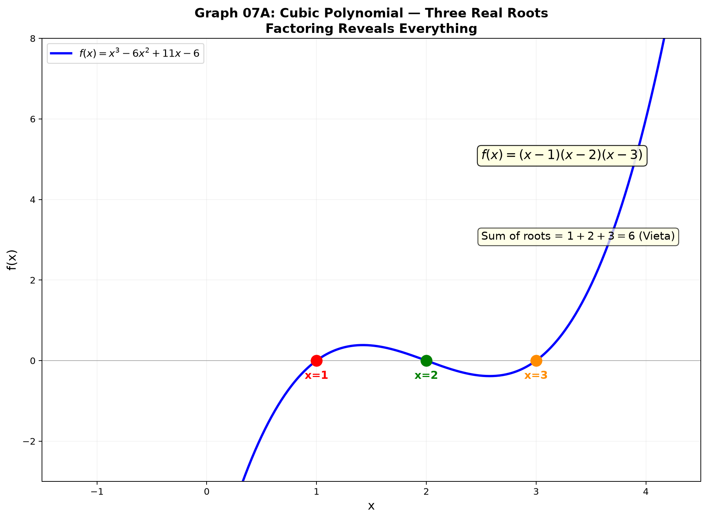

# Session 07A: Factoring and Polynomial Equations

**Phase 2 — Classical Techniques | 60 min**

---

## Part A: Factoring — Tearing into Multiplication Form

---

## Example 1: Find Two Numbers ($x^2+bx+c$)

Find two numbers that **add to $b$** and **multiply to $c$**.

$x^2+7x+12$. Sum 7, product 12 → $3,4$ → $(x+3)(x+4)$.

$x^2-5x+6$. Sum −5, product 6 → $-2,-3$ → $(x-2)(x-3)$.

$x^2+x-6$. Sum 1, product −6 → $-2,3$ → $(x-2)(x+3)$.

---

## Example 2: The $ac$ Method ($ax^2+bx+c$, $a\neq1$)

$2x^2+7x+3$. $ac = 6$. Need two numbers: sum 7, product 6 → $1,6$.
$2x^2+x+6x+3 = x(2x+1)+3(2x+1) = (x+3)(2x+1)$.

$6x^2-x-2$. $ac=-12$. Sum −1, product −12 → $3,-4$.
$6x^2+3x-4x-2 = 3x(2x+1)-2(2x+1) = (3x-2)(2x+1)$.

---

## Example 3: Perfect Square — $(a\pm b)^2$

$x^2+6x+9 = (x+3)^2$. Check: $2\cdot x\cdot 3 = 6x$ ✓.
$4x^2-12x+9 = (2x-3)^2$.
$x^2-10x+25 = (x-5)^2$.

---

## Example 4: Difference of Squares — $a^2-b^2=(a-b)(a+b)$

$x^2-16 = (x-4)(x+4)$.
$9x^2-25 = (3x-5)(3x+5)$.
$x^4-1 = (x^2-1)(x^2+1) = (x-1)(x+1)(x^2+1)$.

---

## Example 5: Sum/Difference of Cubes

$a^3+b^3 = (a+b)(a^2-ab+b^2)$.
$a^3-b^3 = (a-b)(a^2+ab+b^2)$.

$x^3-8 = (x-2)(x^2+2x+4)$.
$8x^3+27 = (2x+3)(4x^2-6x+9)$.

---

## Example 6: Common Factor — Always Pull Out First!

$3x^3-12x = 3x(x^2-4) = 3x(x-2)(x+2)$. Pull out GCF, then factor what remains.

---

## Part B: Higher-Degree Equations

---

## Example 7: Synthetic Division

For $x^3-6x^2+11x-6=0$, test $x=1$: $1-6+11-6=0$. ✓
Synthetic divide by $(x-1)$: quotient $x^2-5x+6 = (x-2)(x-3)$.
Roots: $1,2,3$.

---

## Example 8: Rational Root Theorem

For $2x^3-3x^2-3x+2=0$, possible rational roots: $\pm1,\pm2,\pm\frac{1}{2}$.
Test $x=2$: $16-12-6+2=0$. ✓ Synthetic divide → $2x^2+x-1=(2x-1)(x+1)$.
Roots: $2, \frac{1}{2}, -1$.

---

## Example 9: Substitution $t=x^k$

$x^4-5x^2+4=0$. Let $t=x^2$: $t^2-5t+4=0$ → $t=1,4$. $x=\pm1,\pm2$.

---

## Example 10: Symmetric Coefficients — Divide by $x^2$

$2x^4+3x^3-4x^2+3x+2=0$. Divide by $x^2$: $2(x^2+x^{-2})+3(x+x^{-1})-4=0$.
Let $u=x+x^{-1}$, $x^2+x^{-2}=u^2-2$. Solve for $u$, then $x$.

---

## Example 11: Vieta's Formulas

For $x^3+px^2+qx+r=0$ with roots $a,b,c$:
$a+b+c = -p$, $ab+bc+ca = q$, $abc = -r$.

$x^3-6x^2+11x-6=0$. Sum of roots = 6, pairwise sum = 11, product = 6.



> **Up to here**: Factor: GCF first → two-numbers/ac/perfect-square/diff-of-squares/sum-diff-cubes.
> Higher-degree: rational root test → synthetic divide → reduce degree → substitution $t=x^k$ → Vieta.

---

## What We Just Did

```
(1) Factoring: GCF always first. Then ac-method for a≠1, difference of squares,
    sum/difference of cubes, perfect square recognition.

(2) Higher-degree equations: rational root candidates → synthetic division.
    Each success reduces the degree by 1. Repeat until quadratic.

(3) Substitution t=x² or t=x³ for patterns. Vieta connects roots to coefficients.
    Symmetric equations: divide by x², substitute u=x+1/x.
```

---

## Common Mistakes

### Mistake 1: Wrong sign in synthetic division
The factor is $(x-r)$, so divide by $+r$ (not $-r$).

### Mistake 2: Forgetting to pull out GCF first
$3x^2-12$ → pull 3: $3(x^2-4)=3(x-2)(x+2)$, don't factor $3x^2-12$ directly.

### Mistake 3: Counting a double root only once
$(x-2)^2(x+1)=0$ has roots $2,2,-1$ — three roots (counting multiplicity).

---

## Practice 1

Factor completely: $x^3-4x^2+x+6$. Use rational root test + synthetic division.

→ Solutions: [Solutions](solutions/07A-solutions.md#practice-1)

---

## Practice 2

Solve $x^4-13x^2+36=0$. Substitution $t=x^2$.

→ Solutions: [Solutions](solutions/07A-solutions.md#practice-2)

---

## Practice 3

If roots of $x^3-3x^2+kx+4=0$ are $a,b,c$, find $k$ given $a+b+c=3$ (trivial) and $abc=-4$, $ab+bc+ca=k$.

→ Solutions: [Solutions](solutions/07A-solutions.md#practice-3)

---

## Practice 4: Real Battle

Solve $2x^4-5x^3+5x-2=0$. Hint: check $x=1$, synthetic divide, then look for a pattern in the cubic.

→ Solutions: [Solutions](solutions/07A-solutions.md#practice-4)

---

## Practice 5: Composition

Create a cubic equation whose roots are 2, −3, and 5. Write it in expanded form $x^3+px^2+qx+r=0$ and verify with Vieta.

→ Solutions: [Solutions](solutions/07A-solutions.md#practice-5)

---

## Basic Drills

**D1.** Factor $x^2+8x+15$.

**D2.** Factor $2x^2+5x-3$ (ac method).

**D3.** Factor $x^2-36$ (difference of squares).

**D4.** Factor $x^3-27$ (difference of cubes).

**D5.** Factor completely: $4x^3-16x$.

**D6.** Solve $x^2-7x+10=0$ by factoring.

**D7.** Solve $x^3-3x^2-4x+12=0$. Use $x=3$ as a first root.

**D8.** Factor $x^4-16$ as far as possible.

**D9.** Solve $2x^3-x^2-7x+6=0$. Test $x=1$.

**D10.** If $x=2$ and $x=-3$ are roots of $x^3+ax^2+bx-6=0$, find $a$ and $b$.

> Solutions: [Solutions](solutions/07A-solutions.md#basic-drill)

---

## Advanced Drills

**A1.** Factor $x^4+x^2+1$ as $(x^2+x+1)(x^2-x+1)$ by adding/subtracting $x^2$.

**A2.** Solve $x^4-4x^3+2x^2+4x+1=0$. Symmetric — divide by $x^2$.

**A3.** Find all roots of $x^3-3x^2-6x+8=0$ using rational root theorem.

**A4.** Prove $x^n-y^n$ is divisible by $x-y$ for all $n$.

**A5.** Solve $x^3-3x+1=0$ has a root in $(0,1)$. Use IVT, then approximate.

**A6.** Factor $x^4+4$ as $(x^2+2x+2)(x^2-2x+2)$. (Sophie Germain identity.)

**A7.** Find $a$ such that $x^3+ax^2-4x-4=0$ has $x=2$ as a double root.

**A8.** Solve $(x^2-x)^2-8(x^2-x)+12=0$. Substitute $t=x^2-x$.

**A9.** If $x+\frac{1}{x}=3$, find $x^3+\frac{1}{x^3}$ without solving for $x$.

**A10.** Find all complex roots of $x^4+x^3+x^2+x+1=0$. Multiply by $(x-1)$.

> Solutions: [Solutions](solutions/07A-solutions.md#advanced-drill)

---

## Today's Procedure

```
Step 1: Factor — GCF always first. Then ac-method or two-numbers.
         Recognize special patterns: a²−b², a²±2ab+b², a³±b³.
Step 2: For cubic+ equations — rational root candidates.
         Synthetic divide each root. Reduce degree until quadratic.
Step 3: Substitution t=x^k for hidden quadratics.
         Vieta's formulas check your answers.
```

---

## How to Read These Symbols

| Symbol | Reads as | Meaning |
|:---:|:---:|------|
| $x^n$ | "x to the n" / "x raised to the n-th power" | power / exponent form |
| $a x^2 + b x + c = 0$ | "a x squared plus b x plus c equals zero" | quadratic equation (standard form) |
| $x = \frac{-b \pm \sqrt{b^2-4ac}}{2a}$ | "x equals negative b plus or minus the square root of b squared minus 4 a c, all over 2 a" | quadratic formula |
| $b^2-4ac$ | "b squared minus 4 a c" / "discriminant" | determines nature of roots (>0: two real, =0: one real, <0: complex) |
| $(x-r)(x-s)=0$ | "x minus r times x minus s equals zero" | factored form — roots are r and s |
| $a^2-b^2$ | "a squared minus b squared" | difference of squares — factors as (a-b)(a+b) |
| $a^3 \pm b^3$ | "a cubed plus or minus b cubed" | sum/difference of cubes |
| $(x+a)^n$ | "x plus a, all to the n" | binomial expansion — use Pascal's triangle |
| $\pm$ | "plus or minus" | two possibilities: plus AND minus |
| synthetic division | "synthetic division" | fast polynomial division by (x-r) |
| $\sum r_i$ | "sum of r sub i" / "sum of roots" | Vieta: sum = -b/a |
| $\prod r_i$ | "product of r sub i" / "product of roots" | Vieta: product = (-1)^n a_0/a_n |

---

## Terminology

| What we called it | Math term | Notation |
|:---------------:|:---------:|:--------:|
| tear apart | factor | $ax^2+bx+c=(px+q)(rx+s)$ |
| pull out first | greatest common factor (GCF) | $3x(x-2)$ |
| two-numbers method | sum-and-product factoring | $(x+p)(x+q)$ |
| ac method | ac method for $a\neq1$ | split middle term |
| difference of squares | difference of squares | $a^2-b^2=(a-b)(a+b)$ |
| perfect square | perfect square trinomial | $a^2\pm2ab+b^2=(a\pm b)^2$ |
| sum/difference of cubes | sum/difference of cubes | $a^3\pm b^3$ |
| synthetic division | synthetic division | divide polynomial by $(x-r)$ |
| rational root candidates | Rational Root Theorem | $\pm p/q$ where $p\mid a_0$, $q\mid a_n$ |
| substitution | substitution | $t=x^k$ to lower degree |
| symmetric equation | palindromic/self-reciprocal | divide by $x^2$, use $u=x+1/x$ |
| root-coefficient link | Vieta's formulas | $\sum r_i=-a_{n-1}/a_n$, $\prod r_i=(-1)^n a_0/a_n$ |
