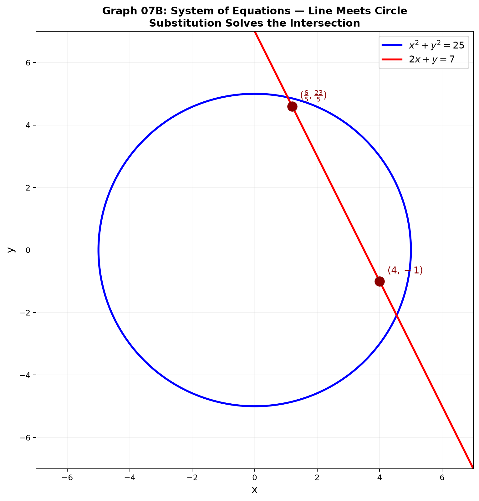

# Session 07B: Partial Fractions, Systems, and Advanced Equation Solving

**Phase 2 — Classical Techniques | 50 min**

*Prerequisites: 07A (factoring), 10A (exponents)*

---

## Part A: Partial Fractions — Tearing Rational Expressions Apart

---

## Example 1: Distinct Linear Factors

$\frac{3x+5}{(x-1)(x+2)} = \frac{A}{x-1} + \frac{B}{x+2}$.

Multiply by $(x-1)(x+2)$: $3x+5 = A(x+2) + B(x-1)$.
$x=1$: $8=3A$ → $A=8/3$. $x=-2$: $-1=-3B$ → $B=1/3$.

$\frac{3x+5}{(x-1)(x+2)} = \frac{8/3}{x-1} + \frac{1/3}{x+2}$.

---

## Example 2: Repeated Linear Factor

$\frac{2x+1}{(x-1)^2} = \frac{A}{x-1} + \frac{B}{(x-1)^2}$.

$2x+1 = A(x-1) + B$. Compare coefficients: $A=2$, $-A+B=1$ → $B=3$.

$\frac{2x+1}{(x-1)^2} = \frac{2}{x-1} + \frac{3}{(x-1)^2}$.

---

## Example 3: Improper — Divide First

$\frac{x^3+2x}{x^2-1}$. Degree(num)=3 > degree(den)=2. Divide:
$x^3+2x = x(x^2-1) + 3x$. So $\frac{x^3+2x}{x^2-1} = x + \frac{3x}{x^2-1}$.

Now decompose $\frac{3x}{(x-1)(x+1)} = \frac{3/2}{x-1} + \frac{3/2}{x+1}$.

---

## Part B: Systems of Equations

---

## Example 4: Substitution

$\begin{cases} 2x+y=7 \\ x^2+y^2=25 \end{cases}$. From first: $y=7-2x$. Plug:
$x^2+(7-2x)^2=25$ → $5x^2-28x+24=0$ → $(5x-6)(x-4)=0$. Solutions: $(6/5, 23/5), (4,-1)$.

---

## Example 5: Elimination

$\begin{cases} 3x+2y=8 \\ 2x-y=3 \end{cases}$. Multiply second by 2: $4x-2y=6$. Add: $7x=14$ → $x=2,y=1$.

---

## Example 6: Three Variables

$\begin{cases} x+y+z=6 \\ 2x-y+z=3 \\ x+2y-z=3 \end{cases}$. Eliminate $z$ from first two → $x-2y=-3$. Eliminate $z$ from first and third → $2x+3y=9$. Solve 2×2: $x=1,y=2,z=3$.

---

## Example 7: Symmetric Systems

$\begin{cases} x+y=5 \\ xy=6 \end{cases}$. $x,y$ are roots of $t^2-5t+6=0$ → $t=2,3$. Solutions: $(2,3),(3,2)$.



> **Up to here**: Partial fractions = decompose rational functions. Distinct linear → A/(x−a). Repeated → A/(x−a) + B/(x−a)². Improper → divide first.
> Systems: substitution or elimination. Symmetric → sum-and-product → quadratic.

---

## What We Just Did

```
(1) Partial fractions: factor denominator fully. Set up with undetermined A,B,C…
    Multiply through by denominator. Plug convenient x-values or compare coefficients.
    If degree(num) ≥ degree(den), divide first.

(2) Systems of equations: substitution isolates one variable.
    Elimination aligns coefficients and subtracts. Three variables → eliminate to 2×2.
    Symmetric systems: use sum S and product P → roots of t²−St+P=0.
```

---

## Common Mistakes

### Mistake 1: Not dividing first in partial fractions when degree(num) ≥ degree(den)
### Mistake 2: Forgetting to check all solutions satisfy ALL equations in a system
### Mistake 3: Missing the $x \neq$ restrictions from the original denominator

---

## Practice 1

Decompose: $\frac{5x-1}{(x+1)(x-2)}$.

→ Solutions: [Solutions](solutions/07B-solutions.md#practice-1)

---

## Practice 2

Decompose: $\frac{x^2+3x}{(x-1)^2(x+2)}$.

→ Solutions: [Solutions](solutions/07B-solutions.md#practice-2)

---

## Practice 3

Solve: $\begin{cases} x^2+y^2=13 \\ xy=6 \end{cases}$.

→ Solutions: [Solutions](solutions/07B-solutions.md#practice-3)

---

## Practice 4: Real Battle

Decompose $\frac{x^3+2x^2+1}{x(x^2+1)}$ and solve $\begin{cases} xy+x+y=11 \\ x^2y+xy^2=30 \end{cases}$.

→ Solutions: [Solutions](solutions/07B-solutions.md#practice-4)

---

## Practice 5: Composition

Create a system of two equations whose only solutions are $(1,2)$ and $(3,-1)$. Hint: each point must satisfy both equations.

→ Solutions: [Solutions](solutions/07B-solutions.md#practice-5)

---

## Basic Algebra Drill — Partial Fractions & Systems (10 Problems)

**D1.** Decompose $\frac{4}{(x-1)(x+3)}$.

**D2.** Decompose $\frac{x+2}{x(x-1)}$.

**D3.** Decompose $\frac{2x}{(x+1)^2}$.

**D4.** Solve $\begin{cases} x+y=4 \\ x-y=2 \end{cases}$.

**D5.** Solve $\begin{cases} 2x+3y=7 \\ 5x-2y=8 \end{cases}$.

**D6.** Decompose $\frac{x^2}{x^2-1}$ (improper — divide first).

**D7.** Solve $\begin{cases} x+y+z=4 \\ x-y+z=2 \\ x+y-z=0 \end{cases}$.

**D8.** Decompose $\frac{3}{x^2+x-2}$ (factor denominator first).

**D9.** Solve $\begin{cases} x+y=7 \\ x^2-y^2=21 \end{cases}$. Use $x^2-y^2=(x-y)(x+y)$.

**D10.** Find partial fractions for $\frac{1}{x(x+1)}$ and use it to compute $\sum_{n=1}^{10}\frac{1}{n(n+1)}$.

> Solutions: [Solutions](solutions/07B-solutions.md#basic-drill)

---

## Advanced Algebra Drill — Partial Fractions & Systems (10 Problems)

**A1.** Decompose $\frac{x^3+1}{x(x-1)^2}$.

**A2.** Decompose $\frac{2x^2+3x+4}{(x+1)(x^2+1)}$ (quadratic factor).

**A3.** Solve $\begin{cases} x^2+y^2=25 \\ x+y=1 \end{cases}$.

**A4.** Solve $\begin{cases} \frac{1}{x}+\frac{1}{y}=5 \\ \frac{1}{x^2}+\frac{1}{y^2}=13 \end{cases}$. Let $u=1/x$, $v=1/y$.

**A5.** Decompose $\frac{1}{x^3-1}$ using difference of cubes.

**A6.** Solve $\begin{cases} xy=12 \\ yz=20 \\ zx=15 \end{cases}$. Multiply all three equations.

**A7.** Find $A,B,C$ such that $\frac{1}{x(x+1)(x+2)} = \frac{A}{x}+\frac{B}{x+1}+\frac{C}{x+2}$.

**A8.** Solve $\begin{cases} x^3+y^3=35 \\ x+y=5 \end{cases}$. Use $x^3+y^3=(x+y)(x^2-xy+y^2)$.

**A9.** Decompose $\frac{x^4}{(x^2+1)^2}$. Division first, then partial fractions.

**A10.** A system has exactly 4 solutions: $(\pm2,\pm3)$ and $(\pm3,\pm2)$. Find the system of equations.

> Solutions: [Solutions](solutions/07B-solutions.md#advanced-drill)

---

## Today's Procedure

```
Step 1: Partial fractions — factor the denominator completely.
         Set up the form based on factor types. Solve for A,B,C…
         Improper rational function: divide polynomials first.
Step 2: Systems — substitution: isolate one variable, plug into the other.
         Elimination: align coefficients, subtract to cancel one variable.
Step 3: Symmetric systems — rewrite in terms of S=x+y, P=xy.
         Then x,y are roots of t²−St+P=0.
```

---

## Terminology

| What we called it | Math term | Notation |
|:---------------:|:---------:|:--------:|
| tear a fraction apart | partial fraction decomposition | $\frac{P(x)}{Q(x)}=\sum\frac{A}{x-a}+\cdots$ |
| undetermined constants | unknown coefficients | $A,B,C,\ldots$ |
| distinct linear factors | distinct linear denominator factors | $\frac{A}{x-a}+\frac{B}{x-b}$ |
| repeated factor | repeated linear factor | $\frac{A}{x-a}+\frac{B}{(x-a)^2}$ |
| improper fraction | improper rational function | deg(num) ≥ deg(den) |
| substitute and solve | substitution method | isolate one variable |
| align and subtract | elimination method | cancel one variable |
| symmetric system | symmetric system | sum $S$, product $P$ |
