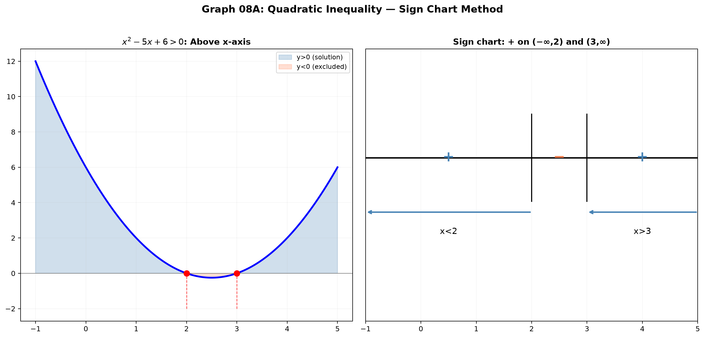
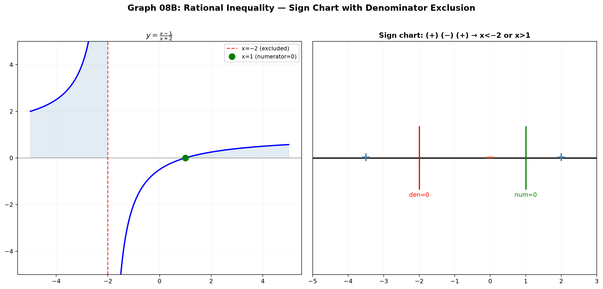

# Session 08A: Inequalities — Sign Charts and Rational Expressions

**Phase 2 — Classical Techniques | 55 min**

*Prerequisites: 07A (factoring), 09A (domain rules)*

---

## Part A: The Sign Chart Method

---

## Example 1: Linear Inequalities — Watch the Negative Division

$3x-5 > 7$. $3x > 12$ → $x > 4$. **No flip** (divided by positive 3).

$-2x+3 < 9$. $-2x < 6$ → $x > -3$. **Flip sign** (divided by negative −2)!

---

## Example 2: Quadratic Inequalities — Factor, Find Roots, Test Intervals

$x^2 - 5x + 6 > 0$. Factor: $(x-2)(x-3) > 0$.

Roots: $x=2,3$. Intervals: $(-\infty,2)$, $(2,3)$, $(3,\infty)$.

Test $x=0$: $( - )( - )>0$ ✓. Test $x=2.5$: $(+)( - )<0$ ✗. Test $x=4$: $(+)(+)>0$ ✓.

**Solution**: $x < 2$ or $x > 3$.

---

## Example 3: Negative Leading Coefficient — Flip to Positive First

$-x^2+4x-3 \geq 0$. Multiply by −1: $x^2-4x+3 \leq 0$ (flipped inequality). $(x-1)(x-3) \leq 0$. **Solution**: $1 \leq x \leq 3$.

---

## Example 4: Just Look at the Discriminant

$x^2+2x+5 > 0$. Discriminant $=4-20=-16<0$. Parabola opens up, never crosses $x$-axis. **Always positive** → all real $x$.

$-x^2+4x-5 > 0$. Multiply by −1: $x^2-4x+5 < 0$. Discriminant $=16-20=-4<0$. Parabola opens up, always positive. So original is **never positive** → no solution.



---

## Part B: Rational and Higher-Degree Inequalities

---

## Example 5: Rational Inequalities — Never Multiply by Denominator!

$\frac{x-1}{x+2} > 0$. **Do NOT** multiply by $x+2$ (you don't know its sign!).

Critical points: numerator $x=1$, denominator $x=-2$ (excluded!).
Intervals: $(-\infty,-2)$, $(-2,1)$, $(1,\infty)$.

Test: $x=-3$: $(-)/(-)>0$ ✓. $x=0$: $(-)/(+)<0$ ✗. $x=2$: $(+)/(+)>0$ ✓.

**Solution**: $x < -2$ or $x > 1$.



---

## Example 6: Move Everything to One Side First

$\frac{x}{x-1} \leq 2$. Not yet ready! Move all terms: $\frac{x}{x-1}-2 \leq 0$ → $\frac{x-2(x-1)}{x-1} \leq 0$ → $\frac{-x+2}{x-1} \leq 0$ → $\frac{x-2}{x-1} \geq 0$.

Critical: $x=1$ (excluded), $x=2$. Intervals: $(-\infty,1),(1,2],[2,\infty)$.
**Solution**: $x < 1$ or $x \geq 2$.

---

## Example 7: Higher-Degree — Factor Completely

$x^3-4x > 0$. $x(x-2)(x+2) > 0$. Roots: $-2,0,2$.

Sign chart: $(-\infty,-2)$: $(-)(-)(-)<0$ ✗. $(-2,0)$: $(-)(-)(+)>0$ ✓. $(0,2)$: $(+)(-)(+)<0$ ✗. $(2,\infty)$: $(+)(+)(+)>0$ ✓.

**Solution**: $-2 < x < 0$ or $x > 2$.

---

## Example 8: Even-Power Factors — They Don't Flip Sign!

$(x-1)^2(x+2) \geq 0$. $(x-1)^2$ is **always** $\geq 0$. The sign is determined by $(x+2)$.

Critical points: $x=-2$, $x=1$. $x<-2$: negative. $x>-2$: positive (including $x=1$).

**Solution**: $x \geq -2$.

> **Up to here**: Sign chart = factor → critical points → test intervals.
> Rational: denominator zeros are EXCLUDED. Even-power factors don't flip sign.
> Quadratic always positive? Check discriminant. Negative leading coefficient → flip inequality when multiplying by −1.

---

## What We Just Did

```
(1) Sign chart method: factor completely. Mark every root on a number line.
    Test one value per interval. Write the solution as unions of intervals.

(2) Rational inequalities: NEVER multiply by the denominator.
    Bring everything to one side, combine into one fraction, then sign chart.
    Denominator zeros are always excluded (open circles).

(3) Even-power factors like (x−a)²: the sign does NOT change when crossing x=a.
    Discriminant < 0 + positive leading coefficient → always positive.
```

---

## Common Mistakes

### Mistake 1: Multiplying rational inequality by denominator without checking sign
### Mistake 2: Forgetting to exclude denominator zeros from solution
### Mistake 3: Thinking an even-power factor flips sign — it doesn't change sign when crossing its root

---

## Practice 1

Solve: $\frac{x+3}{x-2} < 0$. Sign chart, exclude denominator zero.

→ Solutions: [Solutions](solutions/08A-solutions.md#practice-1)

---

## Practice 2

Solve: $x^3-2x^2-5x+6 \geq 0$. Factor using synthetic division.

→ Solutions: [Solutions](solutions/08A-solutions.md#practice-2)

---

## Practice 3

Solve: $\frac{x^2-4}{x^2-1} \leq 0$. Factor both, sign chart.

→ Solutions: [Solutions](solutions/08A-solutions.md#practice-3)

---

## Practice 4: Real Battle

Solve $\frac{x^2-3x+2}{x^2-4} \leq 0$. Factor both numerator and denominator. Watch for holes!

→ Solutions: [Solutions](solutions/08A-solutions.md#practice-4)

---

## Practice 5: Composition

Design a rational inequality whose solution is $(-3,-1) \cup [2,\infty)$. Write it in the form $\frac{P(x)}{Q(x)} \geq 0$.

→ Solutions: [Solutions](solutions/08A-solutions.md#practice-5)

---

## Basic Drills

**D1.** Solve $2x-7 < 3$.

**D2.** Solve $x^2-x-6 > 0$.

**D3.** Solve $-x^2+2x+3 \geq 0$.

**D4.** Solve $\frac{x}{x+1} > 0$.

**D5.** Solve $(x-1)(x+2)(x-3) < 0$.

**D6.** Solve $\frac{2}{x-1} \geq 1$. Move terms first.

**D7.** Solve $x^3-9x \leq 0$.

**D8.** Solve $(x+1)^2(x-4) \geq 0$.

**D9.** Solve $\frac{x^2-1}{x} \leq 0$.

**D10.** Determine sign of $x^2+4x+5$ for all real $x$ (use discriminant).

> Solutions: [Solutions](solutions/08A-solutions.md#basic-drill)

---

## Advanced Drills

**A1.** Solve $\frac{x^2-3x+2}{x^2+x-6} \geq 0$. Factor both, careful with holes.

**A2.** Solve $x^4-5x^2+4 < 0$. Substitution $t=x^2$.

**A3.** Solve $\frac{1}{x-1} + \frac{1}{x-2} \geq 0$. Combine into one fraction.

**A4.** Solve $(x^2-1)(x^2-4)(x^2-9) \leq 0$. Six critical points.

**A5.** Find all $x$ where $\frac{x}{x^2-1} \geq \frac{1}{x+1}$. Move, combine, sign chart.

**A6.** Solve $\lfloor x \rfloor^2 - 3\lfloor x \rfloor + 2 \leq 0$. Let $t=\lfloor x \rfloor$.

**A7.** Solve $\frac{x-1}{x^2-x-2} < \frac{x+1}{x^2+x-2}$. Don't cross-multiply — combine.

**A8.** Find all $a$ such that $x^2+ax+1 > 0$ for all real $x$.

**A9.** Solve $\frac{|x-1|}{x+2} \leq 1$. Split into cases.

**A10.** Prove that for $x>0$, $x + \frac{1}{x} \geq 2$. (Use $(x-1)^2 \geq 0$.)

> Solutions: [Solutions](solutions/08A-solutions.md#advanced-drill)

---

## Today's Procedure

```
Step 1: Move everything to one side. Factor completely.
         Find all critical points: numerator zeros AND denominator zeros.
Step 2: Draw a number line. Mark critical points — open circle for excluded.
         Test one number from each interval.
Step 3: Even-power factors never flip sign when crossing their root.
         Denominator zeros always excluded. Write answer as unions of intervals.
```

---

## How to Read These Symbols

| Symbol | Reads as | Meaning |
|:---:|:---:|------|
| $<$ | "less than" | strict inequality — endpoint NOT included |
| $\leq$ | "less than or equal to" | non-strict inequality — endpoint IS included |
| $>$ | "greater than" | strict inequality |
| $\geq$ | "greater than or equal to" | non-strict inequality |
| $(x-a)(x-b) < 0$ | "x minus a times x minus b less than zero" | quadratic inequality |
| sign chart | "sign chart" / "sign diagram" | number line divided at critical points; test each interval |
| critical point / zero | "critical point" / "zero" | where expression equals zero or is undefined |
| interval notation | "interval notation" | $(a,b)$ = open, $[a,b]$ = closed, $(a,b]$ = half-open |
| $\cup$ | "union" | combine disjoint intervals |
| $\cap$ | "intersection" | common elements of intervals |
| $|x| < a$ | "absolute value of x less than a" | equivalent to $-a < x < a$ |
| $|x| > a$ | "absolute value of x greater than a" | equivalent to $x < -a$ or $x > a$ |

---

## Terminology

| What we called it | Math term | Notation |
|:---------------:|:---------:|:--------:|
| sign chart | sign chart / sign analysis | test intervals |
| critical point | critical point / boundary point | $f(x)=0$ or undefined |
| excluded value | excluded value / restriction | denominator $\neq0$ |
| open circle | open interval endpoint | $($ or $)$ |
| even-power factor | factor with even multiplicity | $(x-a)^{2k}$ |
| discriminant | discriminant | $b^2-4ac$ |
| rational inequality | rational inequality | $\frac{P(x)}{Q(x)} \gtrless 0$ |
