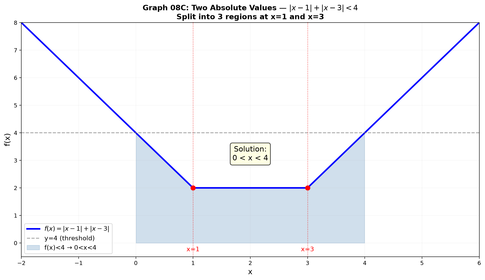
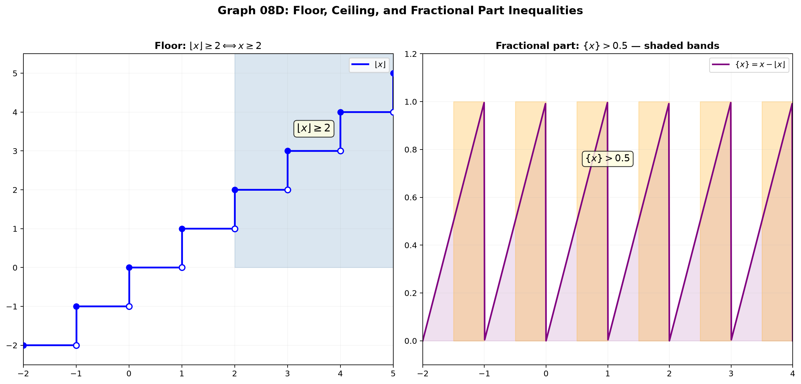

# Session 08B: Advanced Inequalities — Absolute Value, Exp/Log, Floor

**Phase 2 — Classical Techniques | 50 min**

*Prerequisites: 08A (sign charts), 10A (exponents & logs), 09A (floor function)*

---

## Part A: Absolute Value Inequalities

---

## Example 1: Simple Absolute Value — Distance from Zero

$|x| < a \iff -a < x < a$ (inside radius $a$).
$|x| > a \iff x < -a$ or $x > a$ (outside radius $a$).

$|x-3| < 5$ → $-5 < x-3 < 5$ → $-2 < x < 8$.

$|2x+1| \geq 3$ → $2x+1 \leq -3$ or $2x+1 \geq 3$ → $x \leq -2$ or $x \geq 1$.

---

## Example 2: Two Absolute Values — Split into Regions

$|x-1| + |x-3| < 4$. Critical points at $x=1,3$. Three regions:

**Region 1** ($x \leq 1$): $-(x-1)-(x-3) < 4$ → $-2x+4 < 4$ → $x > 0$. Intersect: $0 < x \leq 1$.
**Region 2** ($1 < x < 3$): $(x-1)-(x-3) < 4$ → $2 < 4$ → always true. $1 < x < 3$.
**Region 3** ($x \geq 3$): $(x-1)+(x-3) < 4$ → $2x < 8$ → $x < 4$. Intersect: $3 \leq x < 4$.

**Solution**: $0 < x < 4$.



---

## Part B: Exponential and Logarithmic Inequalities

---

## Example 3: Exponential — Base Decides Direction

$2^{x+1} > 8$. $8=2^3$. **Base > 1**: keep sign → $x+1 > 3$ → $x > 2$.

$(\frac{1}{2})^x \geq 4$. $4=2^2=(\frac{1}{2})^{-2}$. **Base < 1**: flip → $x \leq -2$.

$3^{x^2-4} < 1$. $1=3^0$. Base > 1 → $x^2-4 < 0$ → $-2 < x < 2$.

---

## Example 4: Logarithmic — Always Check the Argument!

$\log_2(x-1) < 3$. $3 = \log_2 8$. Base > 1 → $x-1 < 8$ → $x < 9$.
**Argument**: $x-1 > 0$ → $x > 1$. **Solution**: $1 < x < 9$.

$\log_{1/2}(x+2) \geq 1$. $1 = \log_{1/2}(1/2)$. Base < 1 → flip: $x+2 \leq 1/2$ → $x \leq -3/2$.
**Argument**: $x+2 > 0$ → $x > -2$. **Solution**: $-2 < x \leq -3/2$.

$\log_3(x^2-4) \leq 1$. $x^2-4 \leq 3$ → $x^2 \leq 7$. **Argument**: $x^2-4 > 0$ → $|x| > 2$.
Intersect: $[-\sqrt{7},-2) \cup (2,\sqrt{7}]$.

---

## Part C: Floor and Ceiling Inequalities

---

## Example 5: Floor Function Basics

$\lfloor x \rfloor$ = greatest integer $\leq x$. $\lfloor 2.7\rfloor = 2$, $\lfloor -0.3\rfloor = -1$.

$\lfloor x \rfloor \geq 3$ → $x \geq 3$ (if the floor is at least 3, $x$ must be $\geq 3$).

$\lfloor x \rfloor < 2$ → $x < 2$ (if the floor is below 2, $x$ must be below 2).

---

## Example 6: Inequalities with $\lfloor x \rfloor$ — Let $t = \lfloor x \rfloor$

$\lfloor x \rfloor^2 - 3\lfloor x \rfloor + 2 \leq 0$. Let $t = \lfloor x \rfloor$: $t^2-3t+2 \leq 0$ → $1 \leq t \leq 2$.

So $1 \leq \lfloor x \rfloor \leq 2$ → $1 \leq x < 3$ (floor equals 1 or 2).

---

## Example 7: Ceiling and Fractional Part

$\lceil x \rceil$ = smallest integer $\geq x$. $\{x\} = x - \lfloor x \rfloor$.

$\lceil x \rceil \leq 4$ → $x \leq 4$.

$\{x\} > 0.5$ → fractional part exceeds 0.5. Since $0 \leq \{x\} < 1$, solution: $x \in (n+0.5, n+1)$ for all integers $n$.



> **Up to here**: Absolute value → distance interpretation or split-cases.
> Exponential/log: base>1 keeps sign, 0<base<1 flips. Log: argument>0 always.
> Floor/ceiling: let $t=\lfloor x\rfloor$, solve integer inequality, then map back to $x$.

---

## What We Just Did

```
(1) Absolute value: |ax+b|<c → −c<ax+b<c. |ax+b|>c → two branches.
    Two absolute values → split number line at critical points, solve per region.

(2) Exponential/log inequalities: unify the base first.
    Base>1: keep inequality direction. 0<base<1: flip direction.
    Log: ALWAYS impose argument > 0 on top of the inequality solution.

(3) Floor/ceiling: [x]≥k ⇔ x≥k. Let t=[x], solve for integer t, then map to x-range.
    Fractional part: {x}>c means x lies in shifted intervals (n+c, n+1).
```

---

## Common Mistakes

### Mistake 1: Forgetting the argument condition in log inequalities
$\log(x-3) < 2$: must have $x-3>0$, so $x>3$, IN ADDITION to $x-3<100$.

### Mistake 2: $|x| > a$ → $x > a$ only (forgetting $x < -a$)

### Mistake 3: Treating $\lfloor x \rfloor \geq 2$ as $x \geq 2$ without considering the step pattern

---

## Practice 1

Solve: $|2x-5| \geq 7$.

→ Solutions: [Solutions](solutions/08B-solutions.md#practice-1)

---

## Practice 2

Solve: $\log_2(x^2-5x+6) \leq 1$. Check argument!

→ Solutions: [Solutions](solutions/08B-solutions.md#practice-2)

---

## Practice 3

Solve: $\lfloor 2x \rfloor > 3$.

→ Solutions: [Solutions](solutions/08B-solutions.md#practice-3)

---

## Practice 4: Real Battle

Solve $|x^2-4| \geq 3x$. Split into two cases from the absolute value, solve each quadratic inequality.

→ Solutions: [Solutions](solutions/08B-solutions.md#practice-4)

---

## Practice 5: Composition

Invent an inequality whose solution is $x \in (-2,-1] \cup [1,3) \cup (3,\infty)$. Make it involve absolute values or logs.

→ Solutions: [Solutions](solutions/08B-solutions.md#practice-5)

---

## Basic Drills

**D1.** Solve $|x+2| < 6$.

**D2.** Solve $|3x-1| \geq 5$.

**D3.** Solve $2^{x-1} < 32$.

**D4.** Solve $(\frac{1}{3})^{x} \geq 9$.

**D5.** Solve $\log_5(x+3) < 2$.

**D6.** Solve $\log_{1/2}(x-1) \geq 2$.

**D7.** Solve $\lfloor x \rfloor \leq 4$.

**D8.** Solve $|x-1| + |x+2| \leq 5$. Three regions.

**D9.** Solve $e^{2x} < e^{x+3}$.

**D10.** Solve $\{x\} < 0.25$. Fractional part.

> Solutions: [Solutions](solutions/08B-solutions.md#basic-drill)

---

## Advanced Drills

**A1.** Solve $||x-2|-3| \leq 1$. Nested absolute values.

**A2.** Solve $\log_2(x-1) + \log_2(x-2) \leq 1$. Combine logs, check arguments.

**A3.** Solve $(\log_2 x)^2 - 4\log_2 x + 3 \leq 0$. Substitution.

**A4.** Solve $|x^2-4| \geq 5$. Two cases.

**A5.** Solve $2^{2x} - 3\cdot2^x + 2 < 0$. Let $t=2^x$.

**A6.** Solve $\log_{0.5}(x^2-4x+3) > 0$. Base < 1 flips inequality.

**A7.** Solve $\lfloor x \rfloor \cdot \lceil x \rceil \leq 6$. Case analysis.

**A8.** Solve $|x-1| \cdot |x+2| > 4$. Split into 3 regions, solve quadratic per region.

**A9.** Solve $\frac{\log_2 x}{x-4} \leq 0$. Boundary at $x=1$ (log=0) and $x=4$ (denom=0).

**A10.** Find all $x$ where $\sin x > \frac{1}{2}$ for $x \in [0,2\pi]$. Use unit circle.

> Solutions: [Solutions](solutions/08B-solutions.md#advanced-drill)

---

## Today's Procedure

```
Step 1: Absolute value — single: use distance formula. Multiple: split at critical points.
         Solve the inequality in each region, then intersect with the region.
Step 2: Exponential/log — unify bases first.
         Base>1 keeps the inequality sign; 0<base<1 flips it.
         Log inequalities: always add argument>0 constraint.
Step 3: Floor/ceiling — let t=[x] (an integer). Solve the integer inequality.
         Map back: t≤[x]≤t+Δ → x in [t, t+1) or similar.
```

---

## How to Read These Symbols

| Symbol | Reads as | Meaning |
|:---:|:---:|------|
| $\frac{P(x)}{Q(x)} \geq 0$ | "P of x over Q of x greater than or equal to zero" | rational inequality — watch denominator zeros |
| $x \neq a$ | "x not equal to a" / "x cannot be a" | excluded value — denominator cannot be zero |
| quadratic in form | "quadratic in form" | substitution $t = f(x)$ reduces to quadratic |
| $\sqrt{A} < B$ | "square root of A less than B" | requires $A \geq 0$ AND squaring both sides |
| AM-GM | "A M G M" / "arithmetic mean - geometric mean inequality" | $(a+b)/2 \geq \sqrt{ab}$ for $a,b \geq 0$ |
| Cauchy-Schwarz | "Cauchy-Schwarz inequality" | $(a_1b_1+\cdots)^2 \leq (a_1^2+\cdots)(b_1^2+\cdots)$ |
| $\pm\infty$ | "plus or minus infinity" | unbounded direction on number line |

---

## Terminology

| What we called it | Math term | Notation |
|:---------------:|:---------:|:--------:|
| absolute value | absolute value / modulus | $\vert x\vert$ |
| distance from zero | absolute value interpretation | $\vert x-a\vert < b$ = within $b$ of $a$ |
| split into regions | case analysis | $x<a$, $a\le x<b$, $x\ge b$ |
| exponential inequality | exponential inequality | $a^{f(x)} > a^{g(x)}$ |
| base decides direction | monotonicity of $a^x$ | $a>1$ increasing, $0<a<1$ decreasing |
| argument check | domain restriction for log | $\log_a(f(x))$ requires $f(x)>0$ |
| floor / greatest integer | floor function | $\lfloor x\rfloor$ |
| ceiling | ceiling function | $\lceil x\rceil$ |
| fractional part | fractional part | $\{x\}=x-\lfloor x\rfloor$ |
