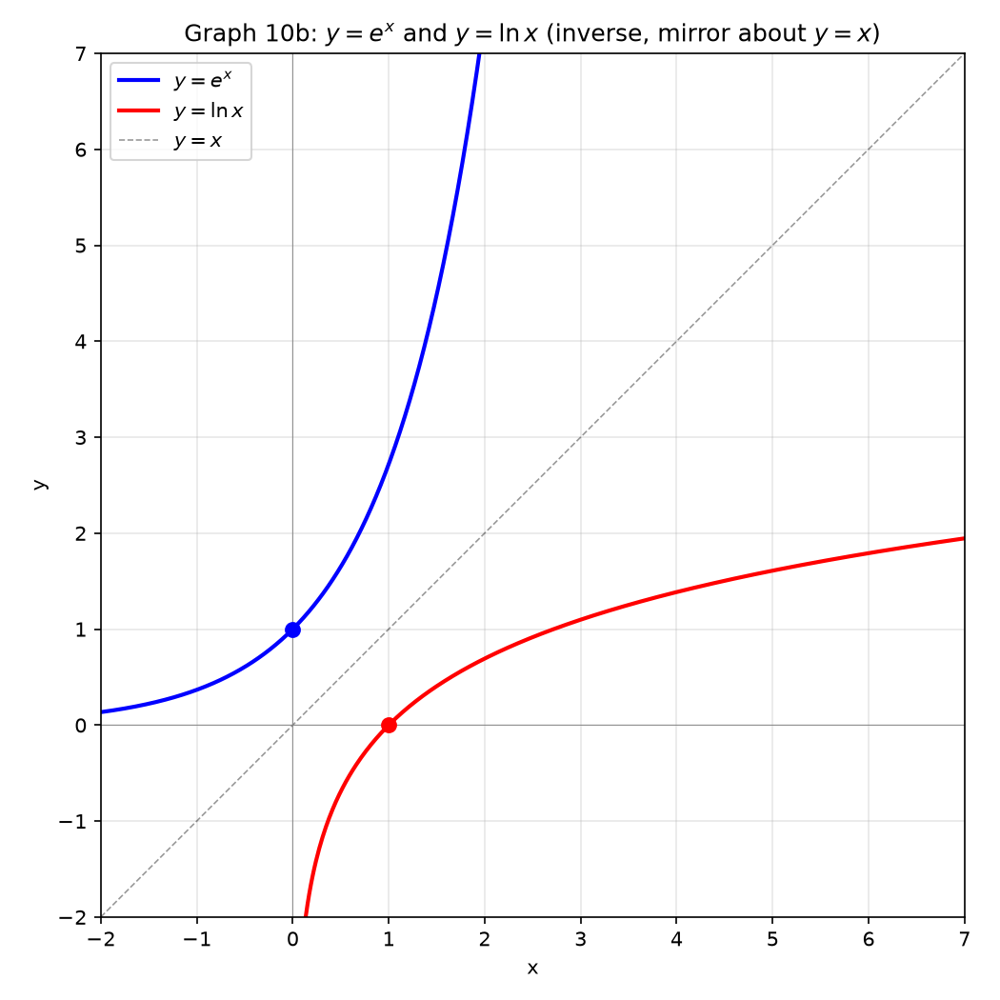

# 세션 10: 지수와 로그 — 거듭제곱의 모든 것

**Phase 2 — 고전 테크닉 | 75분**

---

## Part A: 지수 — 거듭제곱의 규칙

---

## 예시 1: 지수를 더하고 빼고 곱하고

**밑이 같을 때**: $2^3 \times 2^4$. 지수끼리 더한다 → $2^{3+4} = 2^7 = 128$.
$3^5 \div 3^2$. 지수끼리 뺀다 → $3^{5-2} = 3^3 = 27$.

손 확인: $2^3=8$, $2^4=16$. $8 \times 16 = 128 = 2^7$. 맞다.

**거듭제곱의 거듭제곱**: $(2^3)^4$. 지수끼리 곱한다 → $2^{3 \times 4} = 2^{12} = 4096$.

---

## 예시 2: 지수가 0 또는 음수

**0제곱**: $5^0 = 1$. $(-3)^0 = 1$. $x^0 = 1$ ($x \neq 0$).
이유: $5^3 \div 5^3 = 5^{3-3} = 5^0 = 1$.

**음수 지수**: $2^{-3} = \frac{1}{2^3} = \frac{1}{8}$.
$\left(\frac{2}{3}\right)^{-2} = \left(\frac{3}{2}\right)^2 = \frac{9}{4}$. 뒤집고 제곱.

**지수법칙 정리**:
- $a^m \cdot a^n = a^{m+n}$ (곱 → 더하기)
- $a^m \div a^n = a^{m-n}$ (나누기 → 빼기)
- $(a^m)^n = a^{mn}$ (거듭제곱 → 곱하기)
- $a^{-n} = \frac{1}{a^n}$ (음수 → 역수)

---

## 예시 3: 분수 지수 — 루트로 바꾼다

$8^{\frac{1}{3}} = \sqrt[3]{8} = 2$. 분모=루트 차수.
$16^{\frac{1}{4}} = \sqrt[4]{16} = 2$.

$8^{\frac{2}{3}}$: 분모=루트, 분자=거듭제곱.
$\sqrt[3]{8^2} = \sqrt[3]{64} = 4$. 또는 $(\sqrt[3]{8})^2 = 2^2 = 4$.

$27^{-\frac{2}{3}} = \frac{1}{(\sqrt[3]{27})^2} = \frac{1}{3^2} = \frac{1}{9}$.

**규칙**: $a^{\frac{m}{n}} = \sqrt[n]{a^m} = (\sqrt[n]{a})^m$.

---

## 예시 4: 밑이 다를 때 — 통일한다

$4^x = 2^{x+1}$.
① $4 = 2^2$ → $2^{2x} = 2^{x+1}$.
② $2x = x+1$ → $x = 1$.

$9^{x-1} = 27^{2x}$.
① 밑 3: $3^{2x-2} = 3^{6x}$.
② $2x-2 = 6x$ → $x = -\frac{1}{2}$.

---

## 예시 5: $a^x = t$ 치환 — 이차방정식으로

$2^{2x} - 5 \cdot 2^x + 4 = 0$.
① $t = 2^x$ ($t>0$) → $t^2 - 5t + 4 = 0$.
② $(t-1)(t-4) = 0$ → $t=1,4$.
③ $2^x = 1$ → $x=0$. $2^x = 4$ → $x=2$.

$3^{x+1} + 3^{x-1} = 30$.
① $3 \cdot 3^x + \frac{1}{3}\cdot 3^x = \frac{10}{3}\cdot 3^x = 30$.
② $3^x = 9$ → $x = 2$.

$5^x + 5^{2-x} = 26$.
① $5^x = t$. $5^{2-x} = 25 \cdot 5^{-x} = \frac{25}{t}$.
② $t + \frac{25}{t} = 26$ → $t^2 - 26t + 25 = 0$ → $(t-1)(t-25)=0$.
③ $t=1$: $x=0$. $t=25$: $5^x=25$ → $x=2$.

---

## 예시 6: 지수부등식 — 밑 크기가 결정

$2^{x+1} > 8$. $8 = 2^3$. 밑>1 → $x+1 > 3$ → $x > 2$.

$\left(\frac{1}{2}\right)^{x} \geq 4$. $4 = 2^2 = \left(\frac{1}{2}\right)^{-2}$.
밑<1 → 부등호 뒤집기: $x \leq -2$.

$3^{x^2-4} < 1$. $1 = 3^0$. 밑>1 → $x^2-4 < 0$ → $-2 < x < 2$.

> **여기까지**: 지수법칙 5개. $a^x=t$ 치환으로 이차방정식. 밑>1이면 부등호 유지, 밑<1이면 뒤집기.

---

## Part B: 로그 — "몇 제곱?"에 답한다

---

## 예시 7: 로그의 뜻

$\log_2 8$: "2의 몇 제곱이 8?" → $2^3=8$ → **3**.

$\log_3 81 = 4$. $\log_5 \frac{1}{25} = -2$. $\log_{10} 1000 = 3$.
$\log_a 1 = 0$ (모든 밑). $\log_a a = 1$.

---

## 예시 8: 로그 연산 — 곱→더하기, 나누기→빼기

$\log_2 (8 \times 4) = \log_2 8 + \log_2 4 = 3 + 2 = 5$. 확인: $32 = 2^5$.

$\log_3 \frac{81}{9} = \log_3 81 - \log_3 9 = 4 - 2 = 2$. 확인: $9 = 3^2$.

$\log_2 8^5 = 5 \log_2 8 = 5 \times 3 = 15$.

**규칙 3개**:
- $\log_a(MN) = \log_a M + \log_a N$
- $\log_a(M/N) = \log_a M - \log_a N$
- $\log_a(M^k) = k\log_a M$

---

## 예시 9: 밑 변환 — 어떤 밑이든 된다

$\log_4 8 = \frac{\log_2 8}{\log_2 4} = \frac{3}{2}$. $4^{3/2} = 8$. 맞다.

$\log_8 2 = \frac{\log_2 2}{\log_2 8} = \frac{1}{3}$.

$\log_{27} 9 = \frac{\log_3 9}{\log_3 27} = \frac{2}{3}$.

**밑 변환 공식**: $\log_a b = \frac{\log_c b}{\log_c a}$ ($c$는 임의).

---

## 예시 10: 상용로그와 자연로그

**$\log x$** = $\log_{10} x$ (밑 10 생략). $\log 100 = 2$, $\log 0.001 = -3$.

**$\ln x$** = $\log_e x$. $e \approx 2.71828$.
$\ln e = 1$, $\ln 1 = 0$, $\ln e^2 = 2$.

$e$의 정의: $\lim_{n\to\infty} (1 + \frac{1}{n})^n$. 연속복리의 극한.

**$\ln$ ↔ $\log$ 변환**: $\log x = \frac{\ln x}{\ln 10} \approx \frac{\ln x}{2.3026}$.

---

## 예시 11: $e^x$와 $\ln x$의 그래프 — 거울처럼 대칭

$y = e^x$: $(0,1)$ 지남. $x \to -\infty$ → $0$. $x \to \infty$ → $\infty$. 급증.

$y = \ln x$: $(1,0)$ 지남. $x \to 0^+$ → $-\infty$. $x \to \infty$ → $\infty$. 느리게 증가.

둘은 $y=x$ 선에 대칭. $(0,1)$ ↔ $(1,0)$, $(1,e)$ ↔ $(e,1)$.



---

## 예시 12: 로그부등식 — 진수>0 먼저!

$\log_2 (x-1) < 3$.
① $3 = \log_2 8$. 밑>1 → $x-1 < 8$ → $x < 9$.
② 진수>0: $x-1 > 0$ → $x > 1$.
→ **$1 < x < 9$.**

$\log_{\frac{1}{2}} (x+2) \geq 1$.
① $1 = \log_{\frac{1}{2}} \frac{1}{2}$. 밑<1 → $x+2 \leq \frac{1}{2}$ → $x \leq -\frac{3}{2}$.
② 진수>0: $x+2 > 0$ → $x > -2$.
→ **$-2 < x \leq -\frac{3}{2}$.**

> **여기까지**: 로그=지수의 거울. 연산 3규칙. $\ln$은 밑 $e$, $\log$는 밑 10.
> 로그부등식은 진수>0 조건을 반드시 겹친다.

---

## Part C: 지수·로그 방정식 — 모든 유형

---

## 예시 13: 로그 합치고 풀기

$\log_2 (x+1) + \log_2 (x-1) = 3$.
① 합침: $\log_2[(x+1)(x-1)] = 3$.
② 풀기: $(x+1)(x-1) = 2^3 = 8$ → $x^2-1=8$ → $x = \pm 3$.
③ 진수: $x+1>0, x-1>0$ → $x>1$. $x=-3$ 탈락. → **$x=3$.**

---

## 예시 14: $\log$를 $t$로 치환

$(\log_2 x)^2 - 3\log_2 x + 2 = 0$.
① $t = \log_2 x$ → $t^2-3t+2=0$ → $t=1,2$.
② $x = 2^1 = 2$, $x = 2^2 = 4$. → **$x=2,4$.**

---

## 예시 15: 양변에 $\ln$ 취하기

$2^x = 3^{x+1}$.
① $\ln(2^x) = \ln(3^{x+1})$ → $x\ln 2 = (x+1)\ln 3$.
② $x\ln 2 = x\ln 3 + \ln 3$ → $x(\ln 2 - \ln 3) = \ln 3$.
③ $x = \frac{\ln 3}{\ln 2 - \ln 3} \approx -2.71$.

$3^{2x-1} = 5^{x}$.
① $(2x-1)\ln 3 = x\ln 5$ → $2x\ln 3 - \ln 3 = x\ln 5$.
② $x(2\ln 3 - \ln 5) = \ln 3$ → $x = \frac{\ln 3}{2\ln 3 - \ln 5}$.

---

## 예시 16: 지수에 로그 섞인 고난도

$x^{\log_2 x} = 8x$.
① 양변에 $\log_2$ 취함: $\log_2(x^{\log_2 x}) = \log_2(8x)$.
② $(\log_2 x)^2 = 3 + \log_2 x$.
③ $t = \log_2 x$: $t^2 - t - 3 = 0$ → $t = \frac{1 \pm \sqrt{13}}{2}$.
④ $x = 2^{\frac{1 \pm \sqrt{13}}{2}}$.

---

## Part D: 현실 세계의 지수와 로그

---

## 예시 17: 복리와 연속복리

**일반 복리**: $A = P(1 + \frac{r}{n})^{nt}$.
$n$=이자 횟수/년. $n \to \infty$이면 연속복리 $A = Pe^{rt}$.

100만원, 5%, 3년. 연 1회: $100(1.05)^3 = 115.76$만원.
분기별($n=4$): $100(1 + \frac{0.05}{4})^{12} = 116.08$만원.
연속복리: $100 \cdot e^{0.15} = 116.18$만원.

---

## 예시 18: 반감기와 배증시간

**반감기** (half-life): 양이 반으로 줄어드는 시간 $t_{1/2}$.
$N(t) = N_0 e^{-kt}$, $k = \frac{\ln 2}{t_{1/2}}$.

탄소-14 반감기 5730년. $k = \frac{\ln 2}{5730} \approx 0.000121$.
100g에서 25g 남을 때까지 = 반감기 2번 = 11460년.

**배증시간** (doubling time): $t_2 = \frac{\ln 2}{k}$.
매년 7% 성장: $t_2 = \frac{\ln 2}{0.07} \approx 9.9$년. 10년마다 두 배.

---

## 예시 19: pH, 데시벨, 지진 규모 — 모두 로그!

**pH**: $\text{pH} = -\log[\text{H}^+]$.
중성: $[\text{H}^+] = 10^{-7}$ → pH = 7.
산성: $[\text{H}^+] = 10^{-3}$ → pH = 3. pH 1 감소 = 수소이온 10배.

**데시벨(dB)**: $\beta = 10\log\frac{I}{I_0}$.
$I_0 = 10^{-12}$ W/m² (가청 한계).
대화(50dB): $I = 10^{-7}$. 콘서트(110dB): $I = 10^{-1}$. 60dB 차이 = 백만 배.

**리히터 규모**: $M = \log\frac{A}{A_0}$.
규모 5→6: 진폭 10배, 에너지 약 32배.

---

## 예시 20: 지수증가 vs 로그증가

지수함수 $2^x$: $x=10$ → 1024. $x=20$ → 약 100만. 폭발적.
로그함수 $\log_2 x$: $x=1024$ → 10. $x=100만$ → 약 20. 굼뜨다.

데이터가 너무 넓은 범위일 때 로그 눈금을 쓴다:
1, 10, 100, 1000 → 로그 눈금에선 0, 1, 2, 3 등간격.


> **여기까지**: 복리·반감기·pH·dB·리히터 — 전부 지수/로그 응용.
> 로그 눈금은 넓은 범위를 압축한다.

---

## Part E: 궁극의 방정식·부등식 결정 트리

> 어떤 지수·로그 문제든 아래 결정 트리로 무기를 고른다.

---

## 🔑 방정식 — 무엇부터 할까?

```
지수·로그 방정식을 만나면
├── ① 밑이 같은가?
│   ├── YES → 지수끼리 같다고 놓는다 (a^{f(x)} = a^{g(x)} → f=g)
│   └── NO  → 밑 통일 시도. 안 되면 →
│       ├── 밑이 2,4,8... or 3,9,27... → 통일 가능
│       └── 밑이 2와 3처럼 소인수 다르면 → 양변에 log/ln 취하기
├── ② a^x 꼴이 반복되는가?
│   └── YES → t = a^x 치환 (t>0). 이차방정식으로.
├── ③ log_a (…) 꼴이 여러 개인가?
│   ├── 합/차 → log 합치기 (logM + logN = logMN)
│   └── log_a f(x) = 숫자 → a^{숫자} = f(x) 로 풀기
├── ④ (log x)^2 꼴인가?
│   └── YES → t = log x 치환. 이차방정식.
├── ⑤ x가 지수와 밑에 둘 다 있는가? (예: x^{log x})
│   └── YES → 양변에 log 취하기. log(x^{log x}) = (log x)^2.
└── ⑥ 그래도 안 풀리면?
    └── 그래프 그려서 근 개수 파악 → 수치적 근사.
```

---

## 예시 21: 결정 트리로 분류 — 어떤 무기를 쓸까?

**유형 1 — 밑 통일**: $2^{x+2} = 4^{x-1}$ → $2^{x+2} = 2^{2x-2}$ → $x+2=2x-2$ → $x=4$.

**유형 2 — $t$ 치환**: $9^x - 4\cdot3^x + 3 = 0$.
$t=3^x$ → $t^2-4t+3=0$ → $t=1,3$ → $x=0,1$.

**유형 3 — 로그 합치기**: $\log_2 x + \log_2(x-2) = 3$.
$\log_2[x(x-2)]=3$ → $x(x-2)=8$ → $x^2-2x-8=0$ → $x=4$ ($x=-2$ 탈락).

**유형 4 — $\log$ 치환**: $(\log_3 x)^2 - 2\log_3 x - 3 = 0$.
$t=\log_3 x$ → $t^2-2t-3=0$ → $t=-1,3$ → $x=\frac{1}{3}, 27$.

**유형 5 — 양변에 $\ln$**: $2^{x} = 5^{x-1}$.
$x\ln 2 = (x-1)\ln 5$ → $x(\ln 2 - \ln 5) = -\ln 5$ → $x = \frac{\ln 5}{\ln 5 - \ln 2}$.

**유형 6 — $x^{\log}$ 꼴**: $x^{\log_3 x} = 9x$.
$\log_3$ 취함 → $(\log_3 x)^2 = 2 + \log_3 x$ → $t^2-t-2=0$ → $t=-1,2$ → $x=\frac{1}{3}, 9$.

---

## 🔑 부등식 — 무엇부터 할까?

```
지수·로그 부등식을 만나면
├── ① 지수부등식인가?
│   ├── 밑>1 → 부등호 그대로: a^{f} > a^{g} → f > g
│   ├── 0<밑<1 → 부등호 뒤집기: a^{f} > a^{g} → f < g
│   └── a^{f} > (다른 밑) → 밑 통일 or 로그 취하기
├── ② 로그부등식인가?
│   ├── 밑>1 → 부등호 그대로 + 진수>0
│   ├── 0<밑<1 → 부등호 뒤집기 + 진수>0
│   └── log f(x) > log g(x) → f>g>0 (밑>1) or 0<f<g (밑<1)
├── ③ a^x = t 치환이 되는가?
│   └── t>0 조건으로 부등식 → t 범위 → x 범위
└── ④ 그래프로 판단
    └── y=a^x 또는 y=log_a x 그래프 그리고 높이 비교
```

---

## 예시 22: 부등식 결정 트리 실전

**밑>1 로그부등식**: $\log_3(x^2-1) > \log_3(x+5)$.
① 밑>1 → $x^2-1 > x+5$ 그리고 진수>0.
② $x^2-x-6 > 0$ → $(x-3)(x+2) > 0$ → $x < -2$ 또는 $x > 3$.
③ 진수: $x^2-1>0$ → $|x|>1$. $x+5>0$ → $x>-5$.
④ 겹침: $(-5,-1)\cup(1,\infty)$ ∩ ($x<-2$ 또는 $x>3$) = $(-5,-2) \cup (3,\infty)$.
⑤ 진수와 겹침: $(-5,-2)\cup(3,\infty)$ ∩ $((-\infty,-1)\cup(1,\infty))$ = $(-5,-2)\cup(3,\infty)$.

**밑<1 지수부등식**: $\left(\frac{1}{3}\right)^{2x-1} > 9$.
① $9 = 3^2 = \left(\frac{1}{3}\right)^{-2}$.
② 밑$\frac{1}{3}$<1 → $2x-1 < -2$ → $2x < -1$ → $x < -\frac{1}{2}$.

**혼합 부등식**: $2^x < 3^{x-1}$.
① $\ln$ 취함: $x\ln 2 < (x-1)\ln 3$.
② $x\ln 2 - x\ln 3 < -\ln 3$ → $x(\ln 2 - \ln 3) < -\ln 3$.
③ $\ln 2 - \ln 3 < 0$ → $x > \frac{-\ln 3}{\ln 2 - \ln 3} = \frac{\ln 3}{\ln 3 - \ln 2}$.

---

## 자주 하는 실수

### 실수 1: $\log(x+y) = \log x + \log y$로 찢는다

**틀린 길**: "$\log(x+y) = \log x + \log y$."

**왜 틀렸나**: $\log(xy) = \log x + \log y$다. 합은 못 찢는다.

**옳은 길**: $\log(xy)$일 때만 $\log x + \log y$.

---

### 실수 2: 로그방정식에서 진수 조건 누락

**틀린 길**: "$\log_2(x-1) + \log_2(x+3) = 3$ → $x^2+2x-3=8$ → $x=...$"

**왜 틀렸나**: 구한 해가 $x-1>0$, $x+3>0$을 만족하는지 반드시 확인.

**옳은 길**: 방정식 풀고 진수>0으로 걸러낸다.

---

### 실수 3: $a^0 = 0$으로 착각

**틀린 길**: "$2^0 = 0$."

**왜 틀렸나**: 어떤 수도 0제곱은 1이다. $a^0 = 1$ ($a \neq 0$).

**옳은 길**: $2^0 = 1$, $10^0 = 1$, $e^0 = 1$.

---

## 방금 우리가 한 일

```
① 지수법칙 5개. 로그=지수 거울. ln(e), log(10). 그래프 대칭.
② 방정식 결정 트리:
   밑통일 → a^x=t 치환 → 로그합치기 → log치환 → 양변 ln → x^{log}.
③ 부등식 결정 트리:
   밑>1이면 부등호 유지, 밑<1이면 뒤집기. 진수>0 반드시.
④ 실전: 복리·연속복리·반감기·배증·pH·dB·리히터.
```

---

## 연습 1

$2^{x+1} = 8^{x-2}$. 밑 2로 통일.

> 풀이: [풀이집](solutions/10-solutions.md#연습-1)

---

## 연습 2

$\log_3(2x-1) - \log_3(x+1) = 1$. 로그 빼기=나누기. 진수 조건!

> 풀이: [풀이집](solutions/10-solutions.md#연습-2)

---

## 연습 3

$4^x - 2^{x+2} - 32 = 0$. $2^x = t$ 치환.

> 풀이: [풀이집](solutions/10-solutions.md#연습-3)

---

## 연습 4: 구성형

$2^a = 3$과 $3^b = 2$일 때 $ab = 1$임을 보이고,
$5^c = 7$과 $7^d = 5$인 $c,d$도 같은 관계임을 확인하라.
일반 규칙을 말로 설명하라.

> 풀이: [풀이집](solutions/10-solutions.md#연습-4)

---

## 연습 5

$x^{\log_2 x} = 8x$. 양변에 $\log_2$ 취하기.

> 풀이: [풀이집](solutions/10-solutions.md#연습-5)

---

## 연습 6: 실전

방사성 물질이 매년 8%씩 붕괴한다. 처음 500g에서 100g 미만이 되는 시점을 구하라.
$500(0.92)^t < 100$. 양변에 $\log$ 취하기.

> 풀이: [풀이집](solutions/10-solutions.md#연습-6)

---

## 오늘 배운 절차

```
1단계: 지수법칙 5개+로그 3규칙 암기. ln/log 구분.
2단계: 방정식 결정 트리 — 밑통일→t치환→로그합치기→ln취하기.
       부등식 결정 트리 — 밑 크기로 부등호 결정. 진수>0.
3단계: 실전 — 복리·반감기·pH·dB. 로그눈금. 그래프로 판단.
```

---

## 용어 정리

지금까지 우리는 "지수", "밑", "진수", "로그를 취한다", "반감기" 같은 쉬운 말만 썼다.
**방법은 이미 다 배웠다.** 이제 수학에서 쓰는 이름을 소개한다.

| 우리가 써온 말 | 수학 용어 | 기호/설명 |
|:------------:|:--------:|:---:|
| 지수 | exponent | $a^n$에서 $n$ |
| 밑 | base | $a^n$, $\log_a b$에서 $a$ |
| 진수 | argument | $\log_a b$에서 $b$ |
| 제곱근(루트) | radical | $\sqrt[n]{a}$ |
| 역수 | reciprocal | $a^{-1} = 1/a$ |
| 로그를 취한다 | take logarithm | 양변에 $\log$/$\ln$ |
| 밑 변환 | change of base | $\log_a b = \frac{\log_c b}{\log_c a}$ |
| 자연로그 | natural log | $\ln x = \log_e x$ |
| 상용로그 | common log | $\log x = \log_{10} x$ |
| 연속복리 | continuous compound | $A = Pe^{rt}$ |
| 반감기 | half-life | $t_{1/2} = \ln 2/k$ |
| 배증시간 | doubling time | $t_2 = \ln 2/r$ |
| pH | 수소이온농도 | $\text{pH} = -\log[\text{H}^+]$ |
| 데시벨 | decibel | $\beta = 10\log(I/I_0)$ |
| 오일러 수 | Euler's number | $e \approx 2.71828$ |
