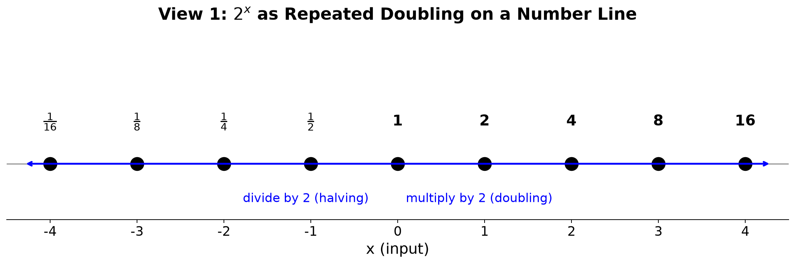
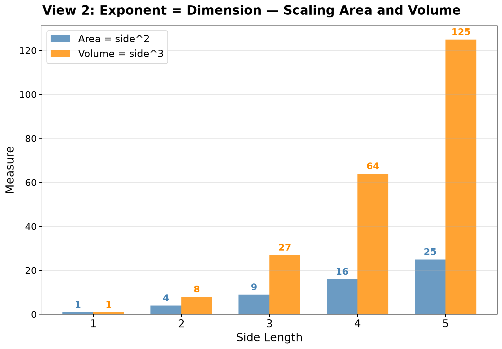
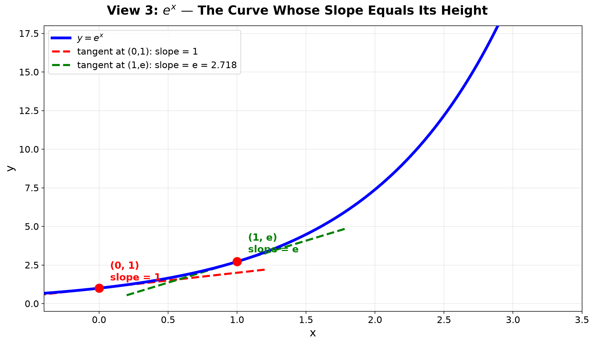
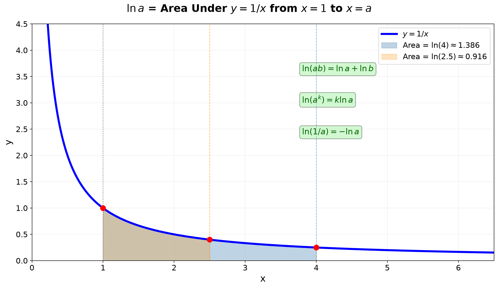
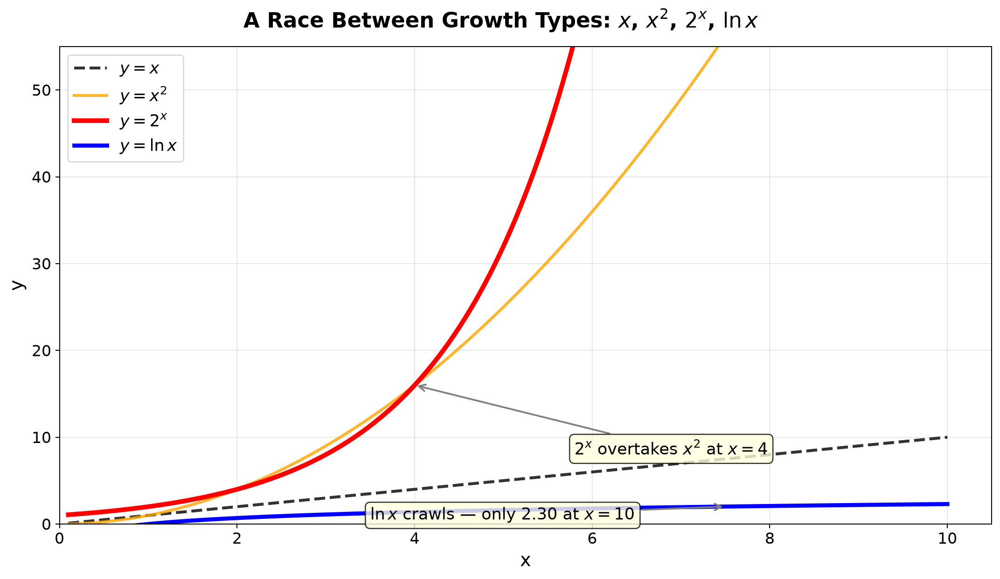

# Session 10A: Exponents and Logarithms — Core Rules and Equations

**Phase 2 — Classical Techniques | 80 min**

*Covers: exponent laws, logarithm definition and operations, equation solving, inequalities*

---

## Part A: Exponents — The Rules of Repeated Multiplication

---

## Example 1: Adding, Subtracting, and Multiplying Exponents

**Same base, multiply**: $2^3 \times 2^4$. Add the exponents. → $2^{3+4} = 2^7 = 128$.
$3^5 \div 3^2$. Subtract the exponents. → $3^{5-2} = 3^3 = 27$.

Hand check: $2^3=8$, $2^4=16$. $8 \times 16 = 128 = 2^7$. Correct.

**Power of a power**: $(2^3)^4$. Multiply the exponents. → $2^{3 \times 4} = 2^{12} = 4096$.

---

## Example 2: Zero and Negative Exponents

**Zero exponent**: $5^0 = 1$. $(-3)^0 = 1$. $x^0 = 1$ ($x \neq 0$).
Why: $5^3 \div 5^3 = 5^{3-3} = 5^0 = 1$.

**Negative exponent**: $2^{-3} = \frac{1}{2^3} = \frac{1}{8}$.
$\left(\frac{2}{3}\right)^{-2} = \left(\frac{3}{2}\right)^2 = \frac{9}{4}$. Flip it, then square.

**Exponent rules summary**:
- $a^m \cdot a^n = a^{m+n}$ (multiply → add)
- $a^m \div a^n = a^{m-n}$ (divide → subtract)
- $(a^m)^n = a^{mn}$ (power of power → multiply)
- $(ab)^n = a^n b^n$ (power of product → distribute)
- $a^{-n} = \frac{1}{a^n}$ (negative → reciprocal)

---

## Example 3: Fractional Exponents — Turn Them into Roots

$8^{\frac{1}{3}} = \sqrt[3]{8} = 2$. Denominator = root degree.
$16^{\frac{1}{4}} = \sqrt[4]{16} = 2$.

$8^{\frac{2}{3}}$: denominator = root, numerator = power.
$\sqrt[3]{8^2} = \sqrt[3]{64} = 4$. Or $(\sqrt[3]{8})^2 = 2^2 = 4$. Same result.

$27^{-\frac{2}{3}} = \frac{1}{(\sqrt[3]{27})^2} = \frac{1}{3^2} = \frac{1}{9}$.

**Rule**: $a^{\frac{m}{n}} = \sqrt[n]{a^m} = (\sqrt[n]{a})^m$.

---

## Visual Interlude: The Geometry of Powers — Three Views of $2^x$

**View 1 — Repeated Doubling on a Number Line.**

Place your finger at 1. Each step to the right multiplies by 2. Going right: multiply by 2. Going left: divide by 2. The number line is not additive — it is multiplicative. Equal steps in $x$ mean equal multiplicative jumps.



**View 2 — Area Growth of a Square.**

A square of side $s$ has area $s^2$. Double the side ($s \to 2s$): area quadruples ($s^2 \to 4s^2$). The exponent 2 captures the dimension: 2D objects scale as side$^2$. A cube of side $s$ scales as $s^3$.



**View 3 — The Graph as a Curve That Is Its Own Slope.**

The slope (steepness) at any point on $y = e^x$ equals the height at that point. This unique property — being its own derivative — is why $e^x$ is the "natural" exponential.



---

## Example 4: Different Bases — Unify Them

$4^x = 2^{x+1}$.
(1) $4 = 2^2$ → $2^{2x} = 2^{x+1}$.
(2) $2x = x+1$ → $x = 1$.

$9^{x-1} = 27^{2x}$.
(1) Base 3: $3^{2x-2} = 3^{6x}$.
(2) $2x-2 = 6x$ → $x = -\frac{1}{2}$.

$25^{x} \cdot 125^{1-x} = 5$.
(1) $5^{2x} \cdot 5^{3(1-x)} = 5^1$ → $5^{2x+3(1-x)} = 5^1$.
(2) $2x+3-3x = 1$ → $-x+3 = 1$ → $x = 2$.

---

## Example 5: Substitute $a^x = t$ — Turn Into a Quadratic

$2^{2x} - 5 \cdot 2^x + 4 = 0$.
(1) $t = 2^x$ ($t>0$) → $t^2 - 5t + 4 = 0$.
(2) $(t-1)(t-4) = 0$ → $t=1,4$.
(3) $2^x = 1$ → $x=0$. $2^x = 4$ → $x=2$.

$3^{x+1} + 3^{x-1} = 30$.
(1) $3 \cdot 3^x + \frac{1}{3}\cdot 3^x = \frac{10}{3}\cdot 3^x = 30$.
(2) $3^x = 9$ → $x = 2$.

$5^x + 5^{2-x} = 26$.
(1) $5^x = t$. $5^{2-x} = 25 \cdot 5^{-x} = \frac{25}{t}$.
(2) $t + \frac{25}{t} = 26$ → $t^2 - 26t + 25 = 0$ → $(t-1)(t-25)=0$.
(3) $t=1$: $x=0$. $t=25$: $5^x=25$ → $x=2$.

---

## Example 6: Exponential Inequalities — Base Size Decides the Direction

$2^{x+1} > 8$. $8 = 2^3$. Base > 1 → keep inequality: $x+1 > 3$ → $x > 2$.

$\left(\frac{1}{2}\right)^{x} \geq 4$. $4 = 2^2 = \left(\frac{1}{2}\right)^{-2}$.
Base < 1 → flip inequality: $x \leq -2$.

$3^{x^2-4} < 1$. $1 = 3^0$. Base > 1 → $x^2-4 < 0$ → $-2 < x < 2$.

$\left(\frac{1}{3}\right)^{x^2} > \frac{1}{27}$.
$\frac{1}{27} = \left(\frac{1}{3}\right)^3$. Base < 1 → $x^2 < 3$ → $-\sqrt{3} < x < \sqrt{3}$.

> **Up to here**: 5 exponent rules. $a^x=t$ substitution for quadratics. Base > 1 keeps inequality sign; base < 1 flips it.

---

## Part B: Logarithms — Answering "What Power?"

---

## Example 7: What a Logarithm Means

$\log_2 8$: "2 to what power gives 8?" → $2^3=8$ → **3**.

$\log_3 81 = 4$. $\log_5 \frac{1}{25} = -2$. $\log_{10} 1000 = 3$.
$\log_a 1 = 0$ (any base). $\log_a a = 1$.

$\log_{10} 0.001 = -3$. $\log_2 0.5 = -1$.

---

## Example 8: Log Operations — Product Becomes Sum, Quotient Becomes Difference

$\log_2 (8 \times 4) = \log_2 8 + \log_2 4 = 3 + 2 = 5$. Check: $32 = 2^5$.

$\log_3 \frac{81}{9} = \log_3 81 - \log_3 9 = 4 - 2 = 2$. Check: $9 = 3^2$.

$\log_2 8^5 = 5 \log_2 8 = 5 \times 3 = 15$.

**Three rules**:
- $\log_a(MN) = \log_a M + \log_a N$
- $\log_a(M/N) = \log_a M - \log_a N$
- $\log_a(M^k) = k\log_a M$

---

## Visual Interlude: The Logarithm as Area Under $1/x$

**The natural log $\ln a$ is the area under the curve $y = 1/x$ from $x=1$ to $x=a$.**

This visual definition makes log rules obvious:

**$\ln(ab) = \ln a + \ln b$**: The area from 1 to $ab$ equals the area from 1 to $a$ plus the area from $a$ to $ab$.
Stretch the second piece horizontally by factor $1/a$ and vertically by factor $a$ (area unchanged!) — it becomes the area from 1 to $b$.

**$\ln(1/a) = -\ln a$**: The area from 1 to $1/a$ is the negative of the area from 1 to $a$ (by symmetry of $1/x$ under $x \to 1/x$).

**$\ln(a^k) = k\ln a$**: Stretching the $x$-axis by factor $k$ stretches the area by factor $k$.

This geometric picture — log as area — unifies all three rules under one visual principle: **stretching and compressing area under a hyperbola.**



---

## Example 9: Change of Base — Any Base Works

$\log_4 8 = \frac{\log_2 8}{\log_2 4} = \frac{3}{2}$. $4^{3/2} = 8$. Correct.

$\log_8 2 = \frac{\log_2 2}{\log_2 8} = \frac{1}{3}$.

$\log_{27} 9 = \frac{\log_3 9}{\log_3 27} = \frac{2}{3}$.

**Change of base formula**: $\log_a b = \frac{\log_c b}{\log_c a}$ (any $c$).

Handy: $\log_a b \cdot \log_b a = 1$. Because $\frac{\log b}{\log a} \cdot \frac{\log a}{\log b} = 1$.

---

## Example 10: Common Log and Natural Log

**$\log x$** = $\log_{10} x$ (base 10 omitted). $\log 100 = 2$, $\log 0.001 = -3$.

**$\ln x$** = $\log_e x$. $e \approx 2.71828$.
$\ln e = 1$, $\ln 1 = 0$, $\ln e^2 = 2$.

Definition of $e$: $\lim_{n\to\infty} \left(1 + \frac{1}{n}\right)^n$. The limit of continuous compounding.

**$\ln$ ↔ $\log$ conversion**: $\log x = \frac{\ln x}{\ln 10} \approx \frac{\ln x}{2.3026}$.

---

## Example 11: Graphs of $e^x$ and $\ln x$ — Mirror Images

$y = e^x$: passes through $(0,1)$. $x \to -\infty$ → $0$. $x \to \infty$ → $\infty$. Explosive growth.

$y = \ln x$: passes through $(1,0)$. $x \to 0^+$ → $-\infty$. $x \to \infty$ → $\infty$. Slow growth.

The two are symmetric across the line $y=x$. $(0,1)$ ↔ $(1,0)$, $(1,e)$ ↔ $(e,1)$.


**Visual Comparison — A Race Between Functions:**

Superimpose four curves on one set of axes to feel their personalities. At $x=10$: $x=10$, $x^2=100$, $2^x=1024$, $\ln x=2.30$.
The exponential overtakes the quadratic at $x=4$ and never looks back. The log crawls.



**The mirror principle**: Flip the graph of $y = 2^x$ over the line $y=x$. What you get is $y = \log_2 x$.
Every point $(a, 2^a)$ becomes $(2^a, a)$. The roles of input and output swap.

---

## Example 12: Log Inequalities — Check the Argument First!

$\log_2 (x-1) < 3$.
(1) $3 = \log_2 8$. Base > 1 → $x-1 < 8$ → $x < 9$.
(2) Argument > 0: $x-1 > 0$ → $x > 1$.
→ **$1 < x < 9$.**

$\log_{\frac{1}{2}} (x+2) \geq 1$.
(1) $1 = \log_{\frac{1}{2}} \tfrac{1}{2}$. Base < 1 → $x+2 \leq \tfrac{1}{2}$ → $x \leq -\frac{3}{2}$.
(2) Argument > 0: $x+2 > 0$ → $x > -2$.
→ **$-2 < x \leq -\frac{3}{2}$.**

$\log_3(x^2-4) \leq 1$.
(1) $1 = \log_3 3$. Base > 1 → $x^2-4 \leq 3$ → $x^2 \leq 7$ → $-\sqrt{7} \leq x \leq \sqrt{7}$.
(2) Argument > 0: $x^2-4 > 0$ → $|x| > 2$.
(3) Intersect: $[-\sqrt{7}, -2) \cup (2, \sqrt{7}]$.

> **Up to here**: Log = mirror of exponent. 3 operation rules. $\ln$ uses base $e$, $\log$ uses base 10.
> Log inequalities: always impose argument > 0 on top of the solution.

---

## Part C: Exponential and Logarithmic Equations — Every Type

---

## Example 13: Combine Logs, Then Solve

$\log_2 (x+1) + \log_2 (x-1) = 3$.
(1) Combine: $\log_2[(x+1)(x-1)] = 3$.
(2) Solve: $(x+1)(x-1) = 2^3 = 8$ → $x^2-1=8$ → $x = \pm 3$.
(3) Check arguments: $x+1>0, x-1>0$ → $x>1$. $x=-3$ discarded. → **$x=3$.**

$\log(x+2) - \log(x-1) = 1$.
(1) $\log\frac{x+2}{x-1} = 1$ → $\frac{x+2}{x-1} = 10$.
(2) $x+2 = 10x-10$ → $12 = 9x$ → $x = \frac{4}{3}$.
(3) Arguments: $x+2>0, x-1>0$ → $x>1$. $\frac{4}{3} > 1$. Valid.

---

## Example 14: Substitute $\log$ as $t$

$(\log_2 x)^2 - 3\log_2 x + 2 = 0$.
(1) $t = \log_2 x$ → $t^2-3t+2=0$ → $t=1,2$.
(2) $x = 2^1 = 2$, $x = 2^2 = 4$. → **$x=2,4$.**

$(\ln x)^2 - 5\ln x + 6 = 0$.
$t=\ln x$ → $t^2-5t+6=0$ → $t=2,3$ → $x=e^2, e^3$.

---

## Example 15: Take $\ln$ on Both Sides

$2^x = 3^{x+1}$.
(1) $\ln(2^x) = \ln(3^{x+1})$ → $x\ln 2 = (x+1)\ln 3$.
(2) $x\ln 2 = x\ln 3 + \ln 3$ → $x(\ln 2 - \ln 3) = \ln 3$.
(3) $x = \frac{\ln 3}{\ln 2 - \ln 3} \approx -2.71$.

$3^{2x-1} = 5^{x}$.
(1) $(2x-1)\ln 3 = x\ln 5$ → $2x\ln 3 - \ln 3 = x\ln 5$.
(2) $x(2\ln 3 - \ln 5) = \ln 3$ → $x = \frac{\ln 3}{2\ln 3 - \ln 5}$.

$7^{x} = 2^{2x+3}$.
(1) $x\ln 7 = (2x+3)\ln 2$ → $x\ln 7 = 2x\ln 2 + 3\ln 2$.
(2) $x(\ln 7 - 2\ln 2) = 3\ln 2$ → $x = \frac{3\ln 2}{\ln 7 - 2\ln 2}$.

---

## Example 16: The Mixed Type — $x$ Appears in Both Exponent and Base

$x^{\log_2 x} = 8x$.
(1) Take $\log_2$ of both sides: $\log_2(x^{\log_2 x}) = \log_2(8x)$.
(2) $(\log_2 x)^2 = 3 + \log_2 x$.
(3) $t = \log_2 x$: $t^2 - t - 3 = 0$ → $t = \frac{1 \pm \sqrt{13}}{2}$.
(4) $x = 2^{\frac{1 \pm \sqrt{13}}{2}}$.

$x^{\log_3 x} = 9x$.
(1) $\log_3(x^{\log_3 x}) = \log_3(9x)$ → $(\log_3 x)^2 = 2 + \log_3 x$.
(2) $t^2 - t - 2 = 0$ → $t = -1, 2$ → $x = \frac{1}{3}, 9$.

> **Up to here**: Equation types — unify bases first. Different bases → take ln. Repeated $a^x$ → $t$-substitution.
> Multiple logs → combine into one. $(\log x)^2$ → $t$-substitution. $x^{\log x}$ → take log of both sides.

---

## Common Mistakes

### Mistake 1: Tearing $\log(x+y)$ as $\log x + \log y$

**Wrong path**: "$\log(x+y) = \log x + \log y$."

**Why wrong**: $\log(xy) = \log x + \log y$. A sum inside the log cannot be torn apart this way.

**Right path**: Only $\log(xy)$ splits into $\log x + \log y$. For $\log(x+y)$, leave it alone or factor if possible.

### Mistake 2: Forgetting the argument condition in log equations

**Wrong path**: "$\log_2(x-1) + \log_2(x+3) = 3$ → $x^2+2x-3=8$ → $x = \ldots$" (without checking).

**Why wrong**: Solutions must satisfy $x-1 > 0$ AND $x+3 > 0$. Any root violating this is invalid.

**Right path**: Solve the equation, then filter roots by argument > 0.

### Mistake 3: $a^0 = 0$

**Wrong path**: "$2^0 = 0$."

**Why wrong**: Any nonzero number to the zero power equals 1. $a^0 = 1$ ($a \neq 0$).

**Right path**: $2^0 = 1$, $10^0 = 1$, $e^0 = 1$.

### Mistake 4: $(e^x)^2 = e^{x^2}$

**Wrong path**: "$(e^x)^2 = e^{x^2}$."

**Why wrong**: Multiply the exponents when raising a power to a power: $(a^m)^n = a^{mn}$. So $(e^x)^2 = e^{2x}$. The expression $e^{x^2}$ is a different function.

**Right path**: $(e^x)^2 = e^{2x}$. Keep the two forms separate.

### Mistake 5: $\log_a(b-c) = \log_a b - \log_a c$

**Wrong path**: "$\log_2(8-2) = \log_2 8 - \log_2 2 = 3-1 = 2$."

**Why wrong**: $\log_2(8-2) = \log_2 6 \approx 2.585$, not 2. Log rules apply to multiplication/division, never addition/subtraction.

**Right path**: $\log_a(b/c) = \log_a b - \log_a c$ is valid. $\log_a(b-c)$ has no simple expansion.

---

## What We Just Did

```
(1) Exponent rules — 5 laws for multiplying, dividing, and powering.
    Log rules — product becomes sum, quotient becomes difference, power pulls out.
    ln uses base e, log uses base 10. The two are mirror images across y = x.

(2) Equation types — unify bases first. If bases differ, take ln of both sides.
    Repeated a^x → t-substitution (t > 0). Multiple logs → combine into one.
    (log x)^2 form → t = log x. x in both exponent and base → take log of both sides.
    Inequality types — base > 1 keeps the sign. Base < 1 flips the sign.
    Always check arg > 0 for log inequalities.
```

---

## Practice 1

$2^{x+1} = 8^{x-2}$. Unify to base 2.

→ Reference: **Example 4**

> Solutions: [Solutions](solutions/10A-solutions.md#practice-1)

---

## Practice 2

$\log_3(2x-1) - \log_3(x+1) = 1$. Log subtraction = division. Check arguments!

→ Reference: **Example 13**

> Solutions: [Solutions](solutions/10A-solutions.md#practice-2)

---

## Practice 3

$4^x - 2^{x+2} - 32 = 0$. Substitute $t = 2^x$.

→ Reference: **Example 5**

> Solutions: [Solutions](solutions/10A-solutions.md#practice-3)

---

## Practice 4: Composition

$2^a = 3$ and $3^b = 2$. Show that $ab = 1$.
Then check $5^c = 7$ and $7^d = 5$ for the same relationship.
State the general rule in words.

→ Reference: **Example 7, 9**

> Solutions: [Solutions](solutions/10A-solutions.md#practice-4)

---

## Practice 5

$x^{\log_2 x} = 8x$. Take $\log_2$ of both sides.

→ Reference: **Example 16**

> Solutions: [Solutions](solutions/10A-solutions.md#practice-5)

---

## Practice 6

$3^{x+2} - 3^{x} = 72$. Factor out $3^x$.

→ Reference: **Example 5**

> Solutions: [Solutions](solutions/10A-solutions.md#practice-6)

---

## Practice 7

$\log_2(x^2 - 3x) = 2$. Remove the log and check arguments.

→ Reference: **Example 7, 12**

> Solutions: [Solutions](solutions/10A-solutions.md#practice-7)

---

## Practice 8: Composition

Invent two different exponential equations where the substitution $t = 2^x$ leads to $t^2 - 6t + 8 = 0$.
Solve both and explain why they both reduce to the same quadratic.

→ Reference: **Example 5**

> Solutions: [Solutions](solutions/10A-solutions.md#practice-8)

---

## Practice 9

$\log_{\frac{1}{2}}(3x+1) \geq -2$. Handle base < 1 and argument > 0.

→ Reference: **Example 12**

> Solutions: [Solutions](solutions/10A-solutions.md#practice-9)

---

## Practice 10: Real Battle

$25^x + 5^{x+1} - 6 = 0$. Unify to base 5, then use $t = 5^x$.

→ Reference: **Example 4, 5**

> Solutions: [Solutions](solutions/10A-solutions.md#practice-10)

---

## Basic Algebra Drill — Exponents and Logs (10 Problems)

> Pure calculation. Build speed and fluency.

**D1.** Simplify $3^4 \cdot 3^{-2}$. Write the answer as an integer.

**D2.** Simplify $\frac{5^6}{5^2}$. Write the answer as an integer.

**D3.** Simplify $(2^3)^2$. Write the answer as an integer.

**D4.** Rewrite $16^{-\frac{1}{2}}$ as a simple fraction.

**D5.** Rewrite $27^{\frac{2}{3}}$ as an integer.

**D6.** Simplify $\frac{10^4 \cdot 10^{-1}}{10^2}$. Write the answer as an integer.

**D7.** Rewrite $\left(\frac{8}{27}\right)^{-\frac{2}{3}}$ as a simple fraction.

**D8.** Compute $\log_5 125 + \log_5 \frac{1}{5}$. Write the answer as an integer.

**D9.** Compute $\log_3 27 - \log_3 \frac{1}{9}$. Write the answer as an integer.

**D10.** Simplify $\ln e^5 + \ln 1 - \ln e^{-2}$. Write the answer as a single integer.

> Solutions: [Solutions](solutions/10A-solutions.md#basic-drill)

---

## Advanced Algebra Drill — Exponents and Logs (10 Problems)

> Multi-step equation solving. Each problem requires choosing the right weapon.

**A1.** Solve for $x$: $2^{x+2} + 2^{x} = 40$. Factor out $2^x$.

**A2.** Solve for $x$: $9^{x} - 3^{x+1} + 2 = 0$. Let $t = 3^x$.

**A3.** Solve for $x$: $\log_4(x+3) + \log_4(x-3) = 2$. Check arguments.

**A4.** Solve the inequality: $\left(\frac{1}{3}\right)^{2x-1} < \frac{1}{9}$. Handle base < 1.

**A5.** Solve for $x$: $5^{2x} - 6 \cdot 5^{x} + 5 = 0$. Substitute $t = 5^x$.

**A6.** Compute $\log_3 8 \cdot \log_4 9 \cdot \log_2 27$. Use change-of-base.

**A7.** Solve the inequality: $\log_2(x^2 - 5x + 6) \leq 1$. Enforce arguments > 0.

**A8.** Solve for $x$: $\ln(2x+1) - \ln(x-2) = 1$. Convert to exponential form.

**A9.** Solve for $x$: $x^{\log_3 x} = 81$. Take $\log_3$ of both sides.

**A10.** Solve for $x$: $e^{2x} - 5e^{x} + 6 = 0$. Let $t = e^x$.

> Solutions: [Solutions](solutions/10A-solutions.md#advanced-drill)

---

## Today's Procedure

```
Step 1: Apply the rules — multiply→add exponents, divide→subtract exponents,
         power→multiply exponents. Log of product→sum of logs.
         Log of quotient→difference of logs. Log of power→pull exponent out.

Step 2: Choose your weapon — same base? equate exponents. Different bases?
         take ln. Repeated a^x? t-substitution. Multiple logs? combine.
         Base>1? keep inequality. Base<1? flip inequality.
         Always check argument > 0.

Step 3: Practice until the steps feel automatic. If you can solve Example 5, 13, and 16
         without peeking at the method, you have mastered the core.
```

---

## Terminology

| What we called it | Mathematical term | Notation / Explanation |
|:-----------------:|:-----------------:|:----------------------:|
| exponent | exponent | $a^n$ — the $n$ |
| base | base | $a^n$ or $\log_a b$ — the $a$ |
| argument (of log) | argument | $\log_a b$ — the $b$ |
| root / radical | radical | $\sqrt[n]{a}$ |
| reciprocal | reciprocal | $a^{-1} = 1/a$ |
| take the log | take logarithm | apply $\log$ or $\ln$ to both sides |
| change of base | change of base | $\log_a b = \frac{\log_c b}{\log_c a}$ |
| natural log | natural logarithm | $\ln x = \log_e x$ |
| common log | common logarithm | $\log x = \log_{10} x$ |
| Euler's number | Euler's number | $e \approx 2.718281828$ |
