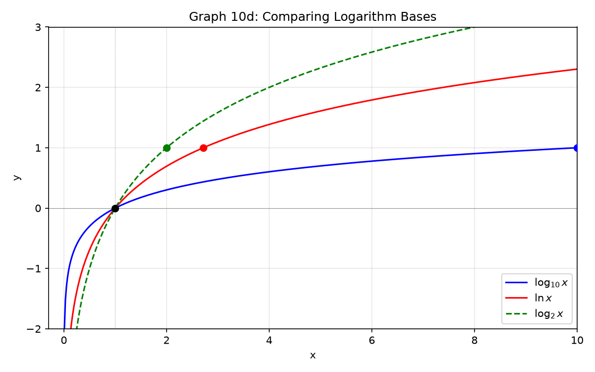
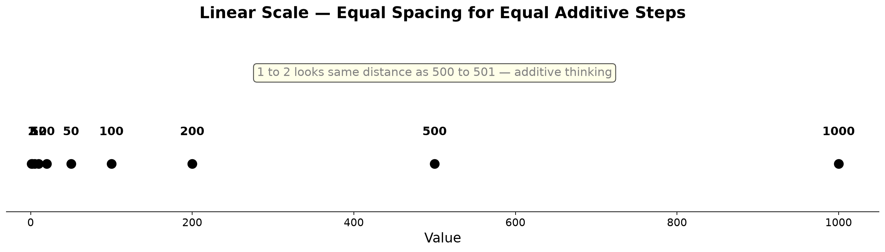
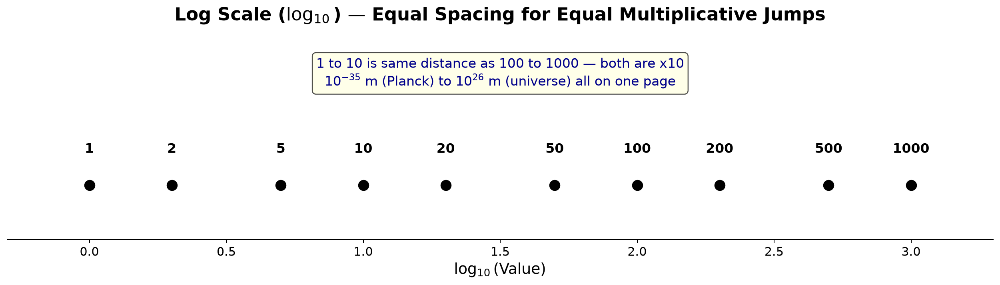

# Session 10B: Exponents and Logarithms — Applications and Advanced Techniques

**Phase 2 — Classical Techniques | 80 min**

*Prerequisites: 10A (exponent laws, logarithm operations, core equation types)*

---

## Part A: Exponents and Logs in the Real World

---

## Example 17: Compound Interest and Continuous Compounding

**Ordinary compound interest**: $A = P\left(1 + \frac{r}{n}\right)^{nt}$.
$n$ = number of compoundings per year. As $n \to \infty$, continuous compounding: $A = Pe^{rt}$.

1,000,000 won, 5%, 3 years.
Yearly ($n=1$): $100(1.05)^3 = 115.76$ ten-thousands.
Quarterly ($n=4$): $100\left(1 + \frac{0.05}{4}\right)^{12} = 116.08$ ten-thousands.
Continuous: $100 \cdot e^{0.15} = 116.18$ ten-thousands.

---

## Example 18: Half-Life and Doubling Time

**Half-life** $t_{1/2}$: time for quantity to halve.
$N(t) = N_0 e^{-kt}$, $k = \frac{\ln 2}{t_{1/2}}$.

Carbon-14 half-life = 5730 years. $k = \frac{\ln 2}{5730} \approx 0.000121$.
From 100g to 25g = 2 half-lives = 11460 years.

**Doubling time** $t_2 = \frac{\ln 2}{r}$.
7% annual growth: $t_2 = \frac{\ln 2}{0.07} \approx 9.9$ years. Doubles every 10 years.

---

## Example 19: pH, Decibels, Richter Scale — All Log Scales!

**pH**: $\text{pH} = -\log[\text{H}^+]$.
Neutral: $[\text{H}^+] = 10^{-7}$ → pH = 7.
Acidic: $[\text{H}^+] = 10^{-3}$ → pH = 3. pH drops by 1 = H+ concentration ×10.

**Decibels (dB)**: $\beta = 10\log\frac{I}{I_0}$.
$I_0 = 10^{-12}$ W/m² (threshold of hearing).
Conversation (50dB): $I = 10^{-7}$. Concert (110dB): $I = 10^{-1}$. 60dB difference = million-fold.

**Richter scale**: $M = \log\frac{A}{A_0}$.
Magnitude 5 → 6: amplitude ×10, energy ≈ ×32.

---

## Example 20: Exponential Growth vs. Log Growth

Exponential $2^x$: $x=10$ → 1024. $x=20$ → about 1,000,000. Explosive.
Logarithmic $\log_2 x$: $x=1024$ → 10. $x=$1,000,000 → about 20. Sluggish.

When data spans a huge range, use log scale:
1, 10, 100, 1000 → on log scale: 0, 1, 2, 3 — evenly spaced.



> **Up to here**: Compound interest, half-life, pH, dB, Richter — all applications of exponents and logs.
> Log scales compress wide ranges.

---

## Visual Interlude: The Log Scale — Compressing the Universe

A linear scale places 1, 2, 3, 4 at equal intervals. A log scale places 1, 10, 100, 1000 at equal intervals.

**Why this matters**: On a linear scale, the difference between 1 and 2 looks the same as the difference between 1001 and 1002.
On a log scale, 1 and 10 are as far apart as 1000 and 10000 — because both jumps are a factor of 10.





The entire history of the universe fits on a log scale: from Planck length ($10^{-35}$ m) to the observable universe ($10^{26}$ m) — a range of $10^{61}$.
Without log scales, we could not draw this on a single sheet of paper.

---

## Part B: Advanced Techniques — Beyond the Textbook

---

## Example 21: The Power Tower — Iterated Exponentiation (Tetration)

What is $x^{x^{x^{\cdot^{\cdot^{\cdot}}}}} = 2$? That is, an infinite stack of $x$ raised to $x$ raised to $x$...

(1) If the tower equals 2, then the whole tower *is* $x$ raised to (the tower), which equals 2.
So $x^2 = 2$ → $x = \sqrt{2}$.

(2) Check: $(\sqrt{2})^{(\sqrt{2})^{(\sqrt{2})^{\cdots}}} = 2$. Indeed it converges.

**What if the tower equals 4?** $x^4 = 4$ → $x = \sqrt[4]{4} = \sqrt{2}$. Wait — same $x$? That seems contradictory. The tower $\sqrt{2}^{\sqrt{2}^{\sqrt{2}^{\cdots}}}$ converges to 2, not 4. The equation $x^4 = 4$ gave a valid algebraic root, but the infinite tower actually converges only to values in $[e^{-e}, e^{1/e}] \approx [0.0659, 1.4447]$. So $x = \sqrt{2} \approx 1.414$ works and converges to 2. The tower does not converge to 4 from that starting value — 4 is outside the convergence range.

**Convergence condition**: The infinite tower $x^{x^{x^{\cdot^{\cdot^{\cdot}}}}}$ converges if and only if $e^{-e} \leq x \leq e^{1/e}$ (Euler, 1783). When it converges, the limit $L$ satisfies $x^L = L$.

**Special trick**: The maximum convergent value is $e$. At $x = e^{1/e}$, the limit is exactly $e$.

---

## Example 22: The Lambert $W$ Function — Solving $x e^x = k$

The equation $x e^x = 5$ cannot be solved with elementary functions. The Lambert $W$ function is defined as the inverse of $f(x) = x e^x$:
$W(k)$ is the solution to $W e^W = k$.

**Example**: $x \cdot 2^x = 3$.
(1) Rewrite $2^x = e^{x\ln 2}$. Then $x e^{x\ln 2} = 3$.
(2) Multiply both sides by $\ln 2$: $(x\ln 2) e^{x\ln 2} = 3\ln 2$.
(3) Now it is $u e^u = 3\ln 2$, where $u = x\ln 2$.
(4) $u = W(3\ln 2)$ → $x = \frac{W(3\ln 2)}{\ln 2}$.

**Example**: $x^x = 7$.
(1) $x^x = e^{x\ln x} = 7$. Take $\ln$: $x\ln x = \ln 7$.
(2) Set $u = \ln x$, so $x = e^u$: $e^u \cdot u = \ln 7$ → $u e^u = \ln 7$.
(3) $u = W(\ln 7)$ → $\ln x = W(\ln 7)$ → $x = e^{W(\ln 7)}$.
(4) Also expressible as $x = \frac{\ln 7}{W(\ln 7)}$. Numerically: $\ln 7 \approx 1.9459$, $W(1.9459) \approx 0.8689$, $x \approx 2.316$.

**The general trick for $x^x = k$**: take $\ln$, rearrange to $(\ln x) e^{\ln x} = \ln k$, then $W(\ln k) = \ln x$, so $x = e^{W(\ln k)}$.

**Another form**: $a^x = bx + c$. Rearrange to match $u e^u$ form, apply $W$.

---

## Example 23: The Log-Sum-Exp Trick (Numerical Stability)

When computing $\ln(e^{1000} + e^{1001})$ directly, $e^{1000}$ overflows double-precision floats. The log-sum-exp trick:

$\ln(e^a + e^b) = \max(a, b) + \ln\left(1 + e^{-|a-b|}\right)$.

For $a=1000, b=1001$: $\max = 1001$, $|a-b| = 1$.
$\ln(e^{1000} + e^{1001}) = 1001 + \ln(1 + e^{-1}) = 1001 + \ln(1 + 0.3679) = 1001 + 0.3133 \approx 1001.3133$.

This is how machine learning libraries compute stable softmax and cross-entropy. The small $e^{-|a-b|}$ sidesteps overflow completely. For $n$ terms: $\ln(\sum_i e^{a_i}) = \max(a_i) + \ln(\sum_i e^{a_i - \max(a_i)})$.

---

## Example 24: Logarithmic Differentiation — Tackle Messy Products and Powers

$y = x^x$. How to differentiate? Neither power rule (exponent not constant) nor exponential rule (base not constant) applies directly.

(1) Take $\ln$ of both sides: $\ln y = \ln(x^x) = x\ln x$.
(2) Differentiate implicitly: $\frac{y'}{y} = \ln x + x \cdot \frac{1}{x} = \ln x + 1$.
(3) $y' = y(\ln x + 1) = x^x(\ln x + 1)$.

More generally, for $y = f(x)^{g(x)}$:
(1) $\ln y = g(x) \ln f(x)$.
(2) $\frac{y'}{y} = g'(x)\ln f(x) + g(x)\frac{f'(x)}{f(x)}$.
(3) $y' = f(x)^{g(x)}\left[g'(x)\ln f(x) + \frac{g(x)f'(x)}{f(x)}\right]$.

**Another application**: $y = \frac{(x^2+1)^3 \sqrt{x-1}}{(x+2)^5}$.
(1) $\ln y = 3\ln(x^2+1) + \frac{1}{2}\ln(x-1) - 5\ln(x+2)$.
(2) Differentiate: $\frac{y'}{y} = \frac{6x}{x^2+1} + \frac{1}{2(x-1)} - \frac{5}{x+2}$.
(3) $y' = y \times$ (that expression). Clean one-step differentiation of a mess.

---

## Example 25: The AM–GM Inequality via Logs (Jensen)

For positive numbers $x_1, \ldots, x_n$, the arithmetic mean is at least the geometric mean:
$\frac{x_1+\cdots+x_n}{n} \geq \sqrt[n]{x_1\cdots x_n}$.

Proof via concavity of $\ln x$: $\ln x$ is concave on $(0,\infty)$. By Jensen's inequality:
$\ln\!\left(\frac{x_1+\cdots+x_n}{n}\right) \geq \frac{\ln x_1 + \cdots + \ln x_n}{n} = \ln\!\left(\sqrt[n]{x_1\cdots x_n}\right)$.

Exponentiate both sides (monotonic): $\frac{x_1+\cdots+x_n}{n} \geq \sqrt[n]{x_1\cdots x_n}$.

**Application**: Prove $a^2 + b^2 + c^2 \geq ab + bc + ca$.
By AM–GM on pairs: $\frac{a^2+b^2}{2} \geq ab$, $\frac{b^2+c^2}{2} \geq bc$, $\frac{c^2+a^2}{2} \geq ca$. Sum all three.

---

## Example 26: The Inequality $\ln(1+x) \leq x$ for $x > -1$

From the graph of $\ln(1+x)$: it lies below its tangent line $y=x$ at $x=0$.
This inequality is a workhorse of analysis.

**Proof sketch**: $\ln(1+x) = \int_0^x \frac{1}{1+t} dt \leq \int_0^x 1 dt = x$ for $x \geq 0$. For $-1 < x < 0$, the inequality still holds by concavity.

**Uses**:
- $\ln(n+1) - \ln n = \ln(1 + \frac{1}{n}) \leq \frac{1}{n}$. Summing to get a harmonic series bound.
- $\left(1 + \frac{1}{n}\right)^n \leq e$. Because $n\ln(1+\frac{1}{n}) \leq n \cdot \frac{1}{n} = 1$, exponentiate.
- For any $\varepsilon > 0$, $\ln x \leq \frac{x^\varepsilon - 1}{\varepsilon}$. A generalization via convexity.
- Sandwich: $\frac{x}{1+x} \leq \ln(1+x) \leq x$ for $x > -1$ (the left side follows from $\ln(1+x) = -\ln(\frac{1}{1+x})$).

---

## Example 27: Benford's Law — Why 1 Appears Most Often as the First Digit

In many real-world datasets (populations, stock prices, physical constants), the first digit $d$ occurs with probability $P(d) = \log_{10}\!\left(1 + \frac{1}{d}\right)$.

$P(1) \approx 30.1\%$, $P(2) \approx 17.6\%$, ..., $P(9) \approx 4.6\%$.

Why? A dataset whose log values are uniformly distributed (scale-invariant) produces this distribution. The mantissa of $\log_{10} x$ (the fractional part) determines the first digit. If the mantissa is uniformly distributed in $[0,1)$, then the probability of first digit $d$ is $\log_{10}(d+1) - \log_{10}(d) = \log_{10}\!\left(1 + \frac{1}{d}\right)$.

This is used to detect **fraud**: people fabricating numbers tend to distribute first digits uniformly; real data follows Benford.

---

## Example 28: Solving $a^b = b^a$ Type Equations

The equation $x^y = y^x$ for $x \neq y$ has nontrivial positive solutions. Take $\ln$:
$y\ln x = x\ln y$ → $\frac{\ln x}{x} = \frac{\ln y}{y}$.

So $x$ and $y$ are two points where $f(t) = \frac{\ln t}{t}$ takes the same value.

$f(t)$ increases on $(0, e]$, peaks at $t=e$ with $f(e)=1/e$, then decreases. For any $u \in (0, 1/e)$, there are two solutions $t_1 < e < t_2$ with $f(t_1) = f(t_2) = u$.

**Only integer solution with $x \neq y$**: $2^4 = 4^2 = 16$. Because $f(2) = f(4) = \frac{\ln 2}{2}$.

**Parametric form**: Let $y = tx$. Then $x^{tx} = (tx)^x$ → $x^t = tx$ → $x = t^{1/(t-1)}$, $y = t^{t/(t-1)}$. For rational $t$, this often generates integer pairs. $t=2$ gives $(2,4)$.

---

## Example 29: Stirling's Approximation — Factorials via Logs

$\ln(n!) = \sum_{k=1}^n \ln k$. Approximate by an integral:
$\ln(n!) \approx n\ln n - n + O(\ln n)$.

Stirling's formula: $n! \approx \sqrt{2\pi n} \left(\frac{n}{e}\right)^n$.

**Application**: How many digits in $100!$?
$\log_{10}(100!) \approx 100\ln(100)/\ln(10) - 100/\ln(10) + \tfrac{1}{2}\log_{10}(200\pi)$.
$\log_{10}(100!) \approx 157.97$. So $100!$ has 158 digits.

This log-integral technique is the only practical way to estimate huge factorials.

---

## Example 30: The Sophomore's Dream — When a Series Swaps Sum and Integral

The identity $\int_0^1 x^{-x} dx = \sum_{n=1}^\infty n^{-n}$ connects integration and infinite series.
Write $x^{-x} = e^{-x\ln x} = \sum_{n=0}^\infty \frac{(-x\ln x)^n}{n!}$.
Integrate term by term: $\int_0^1 (-x\ln x)^n dx = \frac{n!}{(n+1)^{n+1}}$.
The sum telescopes beautifully to $\sum_{n=1}^\infty n^{-n} \approx 1.29129$.

Similarly: $\int_0^1 x^x dx = \sum_{n=1}^\infty (-1)^{n+1} n^{-n}$.

These are rare cases where $x^x$ — which normally requires Lambert $W$ — yields an exact series solution through interchange of sum and integral.

---

## Part C: Ultimate Equation and Inequality Decision Tree

> For any exponent or log problem, pick your weapon using the decision tree below.

---

## Decision Tree — Equations

```
You encounter an exponential or logarithmic equation:
├── (1) Same base on both sides?
│   ├── YES → Set exponents equal: a^{f(x)} = a^{g(x)} → f = g
│   └── NO → Try to unify bases. If not possible:
│       ├── Bases like 2,4,8... or 3,9,27... → Unify possible
│       └── Bases with different primes (2 vs 3) → Take log/ln on both sides
├── (2) Does a^x repeat?
│   └── YES → Substitute t = a^x (t > 0). Solve the resulting quadratic/polynomial.
├── (3) Multiple log_a(...) terms?
│   ├── Sum/difference → Combine: log M + log N = log(MN)
│   └── log_a f(x) = number → a^{number} = f(x)
├── (4) (log x)^2 form?
│   └── YES → Substitute t = log x. Solve quadratic/polynomial.
├── (5) x in both exponent and base? (e.g., x^{log x})
│   └── YES → Take log of both sides. log(x^{log x}) = (log x)^2.
├── (6) x^x = k or x e^x = k?
│   └── YES → Rearrange to u e^u form. Use Lambert W.
├── (7) Power tower / tetration?
│   └── YES → x^{tower} = tower → x^{result} = result.
└── (8) Still stuck?
    └── Graph both sides. Count intersections. Numerical approximation.
```

---

## Example 31: Decision Tree in Action — Classify Before Solving

**Type 1 — Base unification**: $2^{x+2} = 4^{x-1}$ → $2^{x+2} = 2^{2x-2}$ → $x+2=2x-2$ → $x=4$.

**Type 2 — $t$-substitution**: $9^x - 4\cdot3^x + 3 = 0$.
$t=3^x$ → $t^2-4t+3=0$ → $t=1,3$ → $x=0,1$.

**Type 3 — Log combining**: $\log_2 x + \log_2(x-2) = 3$.
$\log_2[x(x-2)]=3$ → $x(x-2)=8$ → $x^2-2x-8=0$ → $x=4$ ($x=-2$ discarded).

**Type 4 — Log substitution**: $(\log_3 x)^2 - 2\log_3 x - 3 = 0$.
$t=\log_3 x$ → $t^2-2t-3=0$ → $t=-1,3$ → $x=\frac{1}{3}, 27$.

**Type 5 — $\ln$ on both sides**: $2^{x} = 5^{x-1}$.
$x\ln 2 = (x-1)\ln 5$ → $x(\ln 2 - \ln 5) = -\ln 5$ → $x = \frac{\ln 5}{\ln 5 - \ln 2}$.

**Type 6 — $x^{\log}$ form**: $x^{\log_3 x} = 9x$.
Take $\log_3$ → $(\log_3 x)^2 = 2 + \log_3 x$ → $t^2-t-2=0$ → $t=-1,2$ → $x=\frac{1}{3}, 9$.

**Type 7 — Lambert W**: $x \cdot 2^x = 5$.
$(x\ln 2) e^{x\ln 2} = 5\ln 2$ → $x = \frac{W(5\ln 2)}{\ln 2}$.

**Type 8 — Power tower**: $x^{x^{x^{\cdots}}} = 3$.
$x^3 = 3$ → $x = \sqrt[3]{3}$.

---

## Decision Tree — Inequalities

```
You encounter an exponential or logarithmic inequality:
├── (1) Exponential inequality?
│   ├── Base > 1 → Keep sign: a^f > a^g → f > g
│   ├── 0 < base < 1 → Flip sign: a^f > a^g → f < g
│   └── a^f > (different base) → Unify base or take log
├── (2) Logarithmic inequality?
│   ├── Base > 1 → Keep sign + enforce argument > 0
│   ├── 0 < base < 1 → Flip sign + enforce argument > 0
│   └── log f(x) > log g(x) → f > g > 0 (base>1) or 0 < f < g (base<1)
├── (3) Substitutable via a^x = t?
│   └── t > 0 constraint → t range → x range
├── (4) Quadratic in log or a^x?
│   └── Solve the inequality for t, then map back.
└── (5) Graph to confirm:
    └── Sketch y = a^x or y = log_a x. Compare heights.
```

---

## Example 32: Inequality Decision Tree in Action

**Base > 1 log inequality**: $\log_3(x^2-1) > \log_3(x+5)$.
(1) Base > 1 → $x^2-1 > x+5$ AND both arguments > 0.
(2) $x^2-x-6 > 0$ → $(x-3)(x+2) > 0$ → $x < -2$ or $x > 3$.
(3) Arguments: $x^2-1>0$ → $|x|>1$. $x+5>0$ → $x>-5$.
(4) Intersect: $(-5,-2) \cup (3,\infty)$.

**Base < 1 exponential inequality**: $\left(\frac{1}{3}\right)^{2x-1} > 9$.
(1) $9 = 3^2 = \left(\frac{1}{3}\right)^{-2}$.
(2) Base $\frac{1}{3} < 1$ → $2x-1 < -2$ → $2x < -1$ → $x < -\frac{1}{2}$.

**Mixed-base inequality**: $2^x < 3^{x-1}$.
(1) Take $\ln$: $x\ln 2 < (x-1)\ln 3$.
(2) $x\ln 2 - x\ln 3 < -\ln 3$ → $x(\ln 2 - \ln 3) < -\ln 3$.
(3) $\ln 2 - \ln 3 < 0$, divide and flip: $x > \frac{-\ln 3}{\ln 2 - \ln 3} = \frac{\ln 3}{\ln 3 - \ln 2}$.

**Quadratic log inequality**: $(\log_2 x)^2 - 3\log_2 x + 2 < 0$.
(1) $t = \log_2 x$: $t^2 - 3t + 2 < 0$ → $(t-1)(t-2) < 0$ → $1 < t < 2$.
(2) $1 < \log_2 x < 2$ → $2^1 < x < 2^2$ → $2 < x < 4$.

> **Up to here**: Decision trees unify all equation types (base unification, t-substitution, log-combine, Lambert W, power tower) and all inequality types (base direction, argument constraints, quadratic substitutions).

---

## Common Mistakes

### Mistake 1: Confusing $\log(x+y)$ with $\log x + \log y$

— see 10A for the full explanation.

### Mistake 2: Forgetting half-life uses $e^{-kt}$, not $e^{kt}$

**Wrong path**: $N(t) = N_0 e^{kt}$ with $k = \ln 2 / t_{1/2}$.

**Why wrong**: Exponential decay has a negative exponent. The sign matters.

**Right path**: $N(t) = N_0 e^{-kt}$ where $k = \ln 2 / t_{1/2} > 0$.

### Mistake 3: Thinking $x^x$ can be differentiated by power rule or exponential rule alone

**Wrong path**: "$\frac{d}{dx} x^x = x \cdot x^{x-1}$" (power rule) or "$= x^x \ln x$" (exponential rule).

**Why wrong**: Neither rule applies — both the base and the exponent are variable.

**Right path**: Logarithmic differentiation: $\ln y = x \ln x$, then $y'/y = \ln x + 1$, so $y' = x^x(\ln x + 1)$.

---

## What We Just Did

```
(1) Real-world applications — compound interest (discrete → continuous via e).
    Half-life (exponential decay) and doubling time (exponential growth).
    pH, dB, Richter — all logarithmic scales that compress huge ranges.
    Log-scale graph: equal steps = equal multiplicative factors.

(2) Advanced techniques — Power tower / tetration and convergence range.
    Lambert W function for x e^x = k and x^x = k.
    Log-sum-exp trick for numerical stability in ML.
    Logarithmic differentiation for f(x)^{g(x)}.

(3) Theoretical gems — AM–GM inequality proven via concavity of ln x.
    The inequality ln(1+x) ≤ x and its consequences.
    Benford's Law for first-digit frequencies.
    a^b = b^a solved via f(t) = ln(t)/t.
    Stirling's approximation for n!.
    Sophomore's Dream: ∫₀¹ x^{-x} dx = Σ n^{-n}.
```

---

## Practice 1

A radioactive substance decays 8% per year. Starting with 500g, find when it falls below 100g.
$500(0.92)^t < 100$. Take $\log$ of both sides.

→ Reference: **Example 18**

> Solutions: [Solutions](solutions/10B-solutions.md#practice-1)

---

## Practice 2

$x \cdot 3^x = 9$. Use the Lambert $W$ technique:
rewrite $3^x = e^{x\ln 3}$, multiply by $\ln 3$, match $u e^u$ form.

→ Reference: **Example 22**

> Solutions: [Solutions](solutions/10B-solutions.md#practice-2)

---

## Practice 3: Real Battle

Show that the infinite power tower $x^{x^{x^{\cdot^{\cdot^{\cdot}}}}}$ converges only for $e^{-e} \leq x \leq e^{1/e}$.
Then solve $x^{x^{x^{\cdot^{\cdot^{\cdot}}}}} = y$ for $x$ in terms of $y$, and evaluate for $y = e$.
Hint: if the limit is $L$, then $x^L = L$, so $x = L^{1/L}$.

→ Reference: **Example 21**

> Solutions: [Solutions](solutions/10B-solutions.md#practice-3)

---

## Practice 4

Use logarithmic differentiation to find $dy/dx$ for $y = (\sin x)^{\cos x}$.

→ Reference: **Example 24**

> Solutions: [Solutions](solutions/10B-solutions.md#practice-4)

---

## Practice 5

The pH of a solution is 4.5. Find the hydrogen ion concentration $[\text{H}^+]$.

→ Reference: **Example 19**

> Solutions: [Solutions](solutions/10B-solutions.md#practice-5)

---

## Practice 6: Real Battle

How many digits does $50!$ have? Use Stirling's approximation.

→ Reference: **Example 29**

> Solutions: [Solutions](solutions/10B-solutions.md#practice-6)

---

## Advanced Drills

> Intensive computation. These target the intermediate steps most students skip. Work each one fully.

**A1.** Simplify $\frac{2^{n+3} - 2^{n+1}}{2^{n}}$. Express as an integer.

**A2.** Solve for $x$: $3^{2x} \cdot 9^{1-x} = \frac{1}{27}$.

**A3.** Simplify $\log_2 48 - \log_2 3$. Express as a rational number.

**A4.** Compute $\log_2 5 \cdot \log_5 8 \cdot \log_8 3 \cdot \log_3 16$. (Hint: chain the change-of-base formula.)

**A5.** Simplify $\frac{\log_3 16}{\log_9 4}$. Express as a rational number.

**A6.** Write $\ln\!\left(\frac{e^3 \sqrt{e}}{e^{-2}}\right)$ as a single simplified number.

**A7.** Solve $\log_2(x-3) + \log_2(x+1) = 3$. Check all arguments after solving.

**A8.** Chain-simplify: $\log_3 2 \cdot \log_4 3 \cdot \log_5 4 \cdot \log_6 5 \cdot \log_7 6 \cdot \log_8 7$. Express as a rational number.

**A9.** Solve: $x^{\log_5 x} = 25x$. Take $\log_5$ of both sides.

**A10.** A bacteria culture doubles every 4 hours. Starting with 1000 cells, how many hours until it reaches 1,000,000? Use $N(t) = N_0 \cdot 2^{t/4}$.

> Solutions: [Solutions](solutions/10B-solutions.md#advanced-drill)

---

## Basic Drills

> Pure computation with real-world and advanced techniques.

**D1.** $1000 is invested at 6% annual interest compounded quarterly. Compute the amount after 2 years. Use $A = P(1 + r/n)^{nt}$.

**D2.** A substance has half-life 10 hours. Find the decay constant $k$ (use $k = \ln 2 / t_{1/2}$). What fraction remains after 25 hours?

**D3.** Find the pH of a solution with $[\text{H}^+] = 2.5 \times 10^{-6}$. Use $\text{pH} = -\log[\text{H}^+]$.

**D4.** A sound has intensity $I = 10^{-5}$ W/m². Find the decibel level (use $I_0 = 10^{-12}$).

**D5.** On a log scale, what is the midpoint between $10^2$ and $10^6$? (Hint: geometric mean, not arithmetic.)

**D6.** Rewrite $x \cdot 5^x = 10$ in the form $u e^u = k$ (preparing for Lambert W). Do not solve.

**D7.** Set up the logarithmic differentiation for $y = x^{\sin x}$. Write $\ln y$ and the differentiated form (do not simplify fully).

**D8.** Estimate $\log_{10}(20!)$ using Stirling: $\ln(n!) \approx n\ln n - n$.

**D9.** According to Benford's Law, what is the probability the first digit is 1? Use $P(1) = \log_{10}(2)$.

**D10.** Verify that $2^4 = 4^2$. Then find another pair $(x,y)$ with $x \neq y$ and $x^y = y^x$ by using the parametric form $x = t^{1/(t-1)}, y = t^{t/(t-1)}$ with $t=3$.

> Solutions: [Solutions](solutions/10B-solutions.md#basic-drill)

---

## Today's Procedure

```
Step 1: Apply — Use compound interest, half-life, pH, dB formulas directly.
         Recognize when a problem calls for exponential vs. log models.

Step 2: Extend — Lambert W for equations x·a^x = k or x^x = k.
         Power towers converge only in [e^{-e}, e^{1/e}].
         Log-differentiation for f(x)^{g(x)}. Log-sum-exp for numerical stability.

Step 3: Think — The decision trees (equations + inequalities) cover every type.
         If stuck, classify: base unification? t-substitution? log-combine?
         Lambert W? Graph it?
```

---

## How to Read These Symbols

| Symbol | Reads as | Meaning |
|:---:|:---:|------|
| $b^x = e^{x \ln b}$ | "b to the x equals e to the x natural log b" | change of base for exponentials |
| $\log_b a = \frac{\ln a}{\ln b}$ | "log base b of a equals ln a over ln b" | change of base formula |
| $a^x = b$ | "a to the x equals b" | exponential equation — take log of both sides |
| $\log_a(x+1) + \log_a(x-1) = c$ | "log base a of x plus 1 plus log base a of x minus 1 equals c" | logarithmic equation — combine then exponentiate |
| compound interest | "compound interest" | $A = P(1+r/n)^{nt}$ — interest added n times per year |
| continuous compounding | "continuous compounding" | $A = Pe^{rt}$ — interest added continuously |
| $t_2 = \ln 2 / k$ | "t-two equals ln 2 over k" / "doubling time" | time for quantity to double under exponential growth |
| $t_{1/2} = \ln 2 / |k|$ | "t-half equals ln 2 over absolute k" / "half-life" | time for quantity to halve under exponential decay |
| log-log plot | "log-log plot" | both axes logarithmic — power laws appear as straight lines |
| semi-log plot | "semi-log plot" | y-axis logarithmic, x-axis linear — exponentials appear as straight lines |

---

## Terminology

| What we called it | Mathematical term | Notation / Explanation |
|:-----------------:|:-----------------:|:----------------------:|
| continuous compounding | continuous compound interest | $A = Pe^{rt}$ |
| half-life | half-life | $t_{1/2} = \ln 2 / k$ |
| doubling time | doubling time | $t_2 = \ln 2 / r$ |
| pH | pH (hydrogen ion concentration) | $\text{pH} = -\log[\text{H}^+]$ |
| decibel | decibel | $\beta = 10\log(I/I_0)$ |
| Richter scale | Richter magnitude scale | $M = \log(A/A_0)$ |
| tetration | tetration / power tower | $^{n}a = a^{a^{\cdot^{\cdot^{a}}}}$ ($n$ times) |
| Lambert W function | Lambert $W$ function | $W(x)$ solves $W e^W = x$ |
| log-sum-exp | log-sum-exp trick | $\ln(e^a+e^b) = \max(a,b) + \ln(1+e^{-|a-b|})$ |
| logarithmic differentiation | logarithmic differentiation | Take $\ln$ then differentiate implicitly |
| Stirling's approximation | Stirling's approximation | $n! \approx \sqrt{2\pi n}(n/e)^n$ |
| Benford's Law | Benford's Law | $P(d) = \log_{10}(1 + 1/d)$ for first digit $d$ |
| AM–GM inequality | Arithmetic Mean–Geometric Mean inequality | $\frac{x_1+\cdots+x_n}{n} \geq \sqrt[n]{x_1\cdots x_n}$ |
