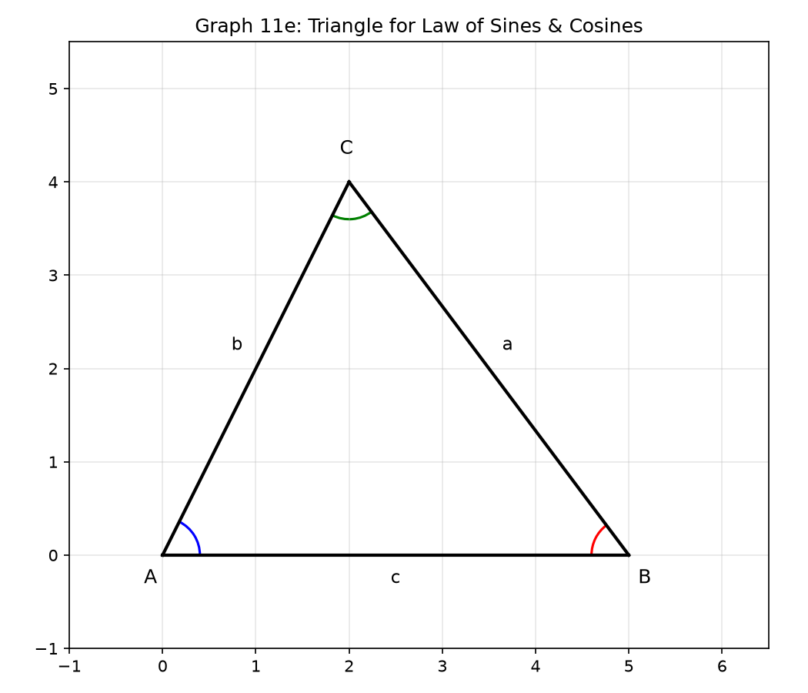
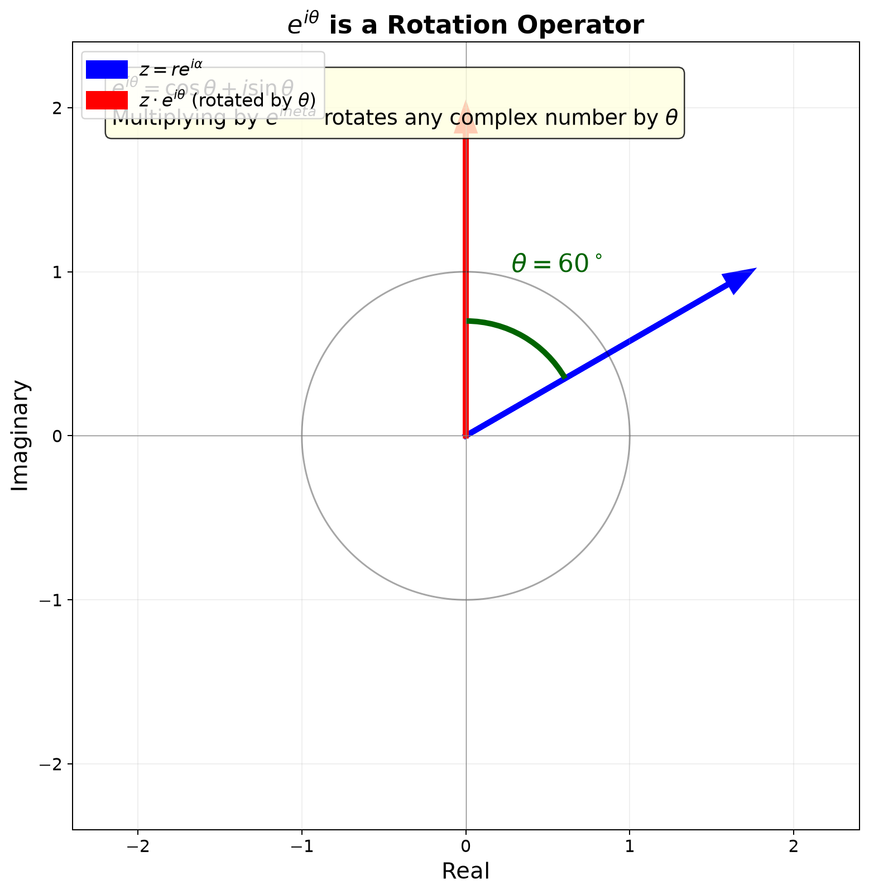

# Session 11: Trigonometry — Mastering Angles and Waves

**Phase 2 — Classical Techniques | 135 min**

---

## Part A: Angles — From Degrees to Radians

---

## Example 1: Remember Only $\pi = 180^\circ$

Radian measure: an angle that cuts an arc equal to the radius on the unit circle = 1 radian.
A semicircle has arc length $\pi r$ → $180^\circ = \pi$ rad.

Convert using proportion:
$90^\circ = \frac{\pi}{2}$. $60^\circ = \frac{\pi}{3}$. $45^\circ = \frac{\pi}{4}$. $30^\circ = \frac{\pi}{6}$.
$120^\circ = \frac{2\pi}{3}$. $270^\circ = \frac{3\pi}{2}$. $360^\circ = 2\pi$.

Reverse: $\frac{5\pi}{6} \times \frac{180^\circ}{\pi} = 150^\circ$.
$\frac{7\pi}{4} = 315^\circ$. $\frac{11\pi}{6} = 330^\circ$.

---

## Part B: The Unit Circle — The Seed of All Trigonometry

---

## Example 2: Read $(\cos\theta, \sin\theta)$ from the Unit Circle

On a circle of radius 1, go around by angle $\theta$. The coordinates of the point reached = $(\cos\theta, \sin\theta)$.

$\theta=0$: $(1,0)$. $\theta=\frac{\pi}{2}$: $(0,1)$. $\theta=\pi$: $(-1,0)$. $\theta=\frac{3\pi}{2}$: $(0,-1)$.

$\theta=\frac{\pi}{4}$: $x^2+y^2=1$, $x=y$ → $x=y=\frac{\sqrt{2}}{2}$. → $\cos\frac{\pi}{4}=\sin\frac{\pi}{4}=\frac{\sqrt{2}}{2}$.

$\theta=\frac{\pi}{3}$: 30-60-90 triangle. Short leg $\frac{1}{2}$, long leg $\frac{\sqrt{3}}{2}$.
→ $\cos\frac{\pi}{3}=\frac{1}{2}$, $\sin\frac{\pi}{3}=\frac{\sqrt{3}}{2}$.

$\theta=\frac{\pi}{6}$: $\cos\frac{\pi}{6}=\frac{\sqrt{3}}{2}$, $\sin\frac{\pi}{6}=\frac{1}{2}$.


---

## Visual Interlude: Unwrapping the Circle into the Sine Wave

**The single most important visualization in trigonometry.**

Imagine a point moving counterclockwise around the unit circle at constant speed. Now imagine a second graph underneath: the horizontal axis is the angle $\theta$ (or time), the vertical axis shows the height ($y$-coordinate) of the point.


At $\theta = 0$: the point is at $(1,0)$ — height 0. The sine wave starts at 0.
At $\theta = \frac{\pi}{2}$: the point is at $(0,1)$ — height 1. The sine wave hits its peak.
At $\theta = \pi$: the point is at $(-1,0)$ — height 0. The sine wave crosses the axis.
At $\theta = \frac{3\pi}{2}$: the point is at $(0,-1)$ — height −1. The sine wave bottoms out.
At $\theta = 2\pi$: back to $(1,0)$ — one full cycle complete.

**The cosine wave is the same unwrapping, but reading the $x$-coordinate instead.** It starts at 1 (the $x$-coordinate of the starting point), not 0.

The phase difference between sine and cosine is literally "the point on the circle is a quarter-turn ahead."

**Tangent unwrapped**: At each angle, draw a vertical line tangent to the circle at $(1,0)$. Extend the radius. Where it hits the tangent line, the $y$-coordinate is $\tan\theta$. As $\theta \to 90^\circ$, the radius becomes parallel to the tangent line — they never meet — so $\tan\theta \to \infty$.

---

## Example 3: Engrave the Special Angle Table in Your Hand

| $\theta$ | $0$ | $\frac{\pi}{6}$ | $\frac{\pi}{4}$ | $\frac{\pi}{3}$ | $\frac{\pi}{2}$ |
|:---:|:---:|:---:|:---:|:---:|:---:|
| $\sin$ | $0$ | $\frac{1}{2}$ | $\frac{\sqrt{2}}{2}$ | $\frac{\sqrt{3}}{2}$ | $1$ |
| $\cos$ | $1$ | $\frac{\sqrt{3}}{2}$ | $\frac{\sqrt{2}}{2}$ | $\frac{1}{2}$ | $0$ |
| $\tan$ | $0$ | $\frac{\sqrt{3}}{3}$ | $1$ | $\sqrt{3}$ | undefined |

$\sin$: $0, \frac{1}{2}, \frac{\sqrt{2}}{2}, \frac{\sqrt{3}}{2}, 1$ — increasing.
$\cos$: same sequence in reverse. $\tan = \frac{\sin}{\cos}$.

---

## Example 4: Quadrant Signs — "All Students Take Calculus"

$\tan\theta = \frac{\sin\theta}{\cos\theta}$. Reciprocal functions follow sign of their originals.

| Quadrant | $\sin$ | $\cos$ | $\tan$ | $\csc$ | $\sec$ | $\cot$ |
|:---:|:---:|:---:|:---:|:---:|:---:|:---:|
| 1 | + | + | + | + | + | + |
| 2 | + | − | − | + | − | − |
| 3 | − | − | + | − | − | + |
| 4 | − | + | − | − | + | − |

$\sin 150^\circ$: Q2 → +. $150^\circ = 180^\circ-30^\circ$ → $\sin 30^\circ = \frac{1}{2}$.
$\cos 210^\circ$: Q3 → −. $210^\circ = 180^\circ+30^\circ$ → $-\cos 30^\circ = -\frac{\sqrt{3}}{2}$.
$\tan 300^\circ$: Q4 → −. $300^\circ = 360^\circ-60^\circ$ → $-\tan 60^\circ = -\sqrt{3}$.

**Reference angle method**: Find the acute angle to the nearest $x$-axis. Apply quadrant sign.

---

## Visual Interlude: The Reference Angle — A Geometric Shortcut

Every angle $\theta$ has a "shadow" in Quadrant 1 — its reference angle $\theta_R$, the acute angle between the terminal side and the $x$-axis.


**The rule in one sentence**: $\sin(180^\circ \pm \theta) = \pm\sin\theta$ with sign from quadrant; $\sin(360^\circ \pm \theta) = \pm\sin\theta$ similarly. The *magnitude* of any trig value at any angle is the same as at its reference angle. Only the sign changes.

---

## Example 5: $\csc, \sec, \cot$ — Completing the Family of Six

$\csc\theta = \frac{1}{\sin\theta}$ ($\sin\theta \neq 0$). $\sec\theta = \frac{1}{\cos\theta}$ ($\cos\theta \neq 0$).
$\cot\theta = \frac{1}{\tan\theta} = \frac{\cos\theta}{\sin\theta}$ ($\sin\theta \neq 0$).

Evaluate:
$\csc\frac{\pi}{6} = \frac{1}{1/2} = 2$. $\sec\frac{\pi}{4} = \frac{1}{\sqrt{2}/2} = \sqrt{2}$.
$\cot\frac{\pi}{3} = \frac{1}{\sqrt{3}} = \frac{\sqrt{3}}{3}$.
$\csc\frac{5\pi}{6} = \frac{1}{\sin 150^\circ} = \frac{1}{1/2} = 2$.

**Extended Pythagorean identities**:
$\sin^2\theta + \cos^2\theta = 1$.
$1 + \tan^2\theta = \sec^2\theta$ (divide the above by $\cos^2\theta$).
$1 + \cot^2\theta = \csc^2\theta$ (divide the above by $\sin^2\theta$).

---

## Part C: Graphs — Drawing and Shaping Waves

---

## Example 6: Basic Graphs of $\sin$, $\cos$, $\tan$

**$y = \sin x$**: starts at $(0,0)$, period $2\pi$, amplitude 1, range $[-1,1]$.
Hits 1 at $\frac{\pi}{2}$, 0 at $\pi$, −1 at $\frac{3\pi}{2}$, 0 at $2\pi$. Origin-symmetric (odd).

**$y = \cos x$**: starts at $(0,1)$. $\sin$ shifted left by $\frac{\pi}{2}$. $y$-axis-symmetric (even).

**$y = \tan x$**: vertical asymptotes where $\cos=0$ ($\frac{\pi}{2}, \frac{3\pi}{2}, \dots$). Period $\pi$. Origin-symmetric (odd).


**Visual Insight — Tangent as Slope:**

On the unit circle, draw the radius to $(\cos\theta, \sin\theta)$. The slope of that radius line is:
$$\text{slope} = \frac{\text{rise}}{\text{run}} = \frac{\sin\theta}{\cos\theta} = \tan\theta.$$

So $\tan\theta$ is **the slope of the radius**. This explains everything about tangent:
- At $\theta = 0^\circ$, the radius points horizontally → slope 0 → $\tan 0 = 0$.
- At $\theta = 45^\circ$, the radius goes to $(\sqrt{2}/2, \sqrt{2}/2)$ → rise = run → slope 1 → $\tan 45^\circ = 1$.
- At $\theta = 90^\circ$, the radius points straight up → infinite slope → $\tan 90^\circ$ is undefined.
- At $\theta = 135^\circ$, the radius points to Q2 ($x$ negative, $y$ positive) → negative slope → $\tan 135^\circ$ is negative.


**Visual Insight — $\sin\theta$ and $\cos\theta$ as Projections:**

Drop a perpendicular from the point on the circle to the $x$-axis: the $x$-intercept is $\cos\theta$, the $y$-intercept is $\sin\theta$. They are literally the horizontal and vertical shadows of a rotating unit vector.

---

## Example 7: Graphs of $\csc$, $\sec$, $\cot$

$\csc x = \frac{1}{\sin x}$: asymptotes at $0, \pi, 2\pi, \dots$ (where $\sin=0$).
U-shaped branches above $y=1$ where $\sin>0$; ∩-shaped below $y=-1$ where $\sin<0$.

$\sec x = \frac{1}{\cos x}$: asymptotes at $\frac{\pi}{2}, \frac{3\pi}{2}, \dots$ (where $\cos=0$).
Branches above $y=1$ and below $y=-1$.

$\cot x = \frac{1}{\tan x} = \frac{\cos}{\sin}$: asymptotes at $0, \pi, 2\pi, \dots$ (where $\sin=0$). Period $\pi$, always decreasing.


---

## Example 8: $y = a\sin(bx + c) + d$ — Cooking a Wave

$y = 3\sin(2x - \frac{\pi}{3}) + 1$.

(1) **Amplitude**: $|a| = 3$. Wave height ±3 from center.
(2) **Period**: $\frac{2\pi}{|b|} = \frac{2\pi}{2} = \pi$.
(3) **Phase shift**: $bx + c = 0$ → $x = -\frac{c}{b} = \frac{\pi}{6}$. Right by $\frac{\pi}{6}$.
(4) **Vertical shift**: $+1$. Range $[-2, 4]$.

$y = -2\cos(\frac{x}{2})$: amplitude 2 (flipped), period $4\pi$.

$y = 4\sin(\pi x + \frac{\pi}{4}) - 3$:
Amplitude 4, period $\frac{2\pi}{\pi}=2$, phase $x=-\frac{1}{4}$ (left by $\frac{1}{4}$), range $[-7, 1]$.


---

## Basic Algebra Drill — Trigonometry (6 Problems)

> Pure calculation. Build speed with radians, evaluation, and simple identities.

**D1.** Convert to radians: $150^\circ$, $225^\circ$, $330^\circ$.

**D2.** Evaluate without a calculator: $\sin\frac{5\pi}{6}$, $\cos\frac{7\pi}{4}$, $\tan\frac{4\pi}{3}$.

**D3.** Given $\sin\theta = \frac{5}{13}$ and $\theta$ in Q2, find $\cos\theta$ and $\tan\theta$.

**D4.** Simplify $\frac{\sin x}{\csc x} + \frac{\cos x}{\sec x}$. (Express in terms of $\sin$ and $\cos$ first.)

**D5.** Evaluate $\sin^2 15^\circ + \sin^2 75^\circ$. (Hint: $\cos\theta = \sin(90^\circ-\theta)$.)

**D6.** Find the period and amplitude of $y = -4\cos(\frac{\pi}{2}x) + 3$.

**D7.** Given $\sin\theta = \frac{4}{5}$ and $\theta \in Q1$, compute $\sin 2\theta$ and $\cos 2\theta$ without finding $\theta$ first.

**D8.** Evaluate without a calculator: $\sin\frac{2\pi}{3} \cdot \cos\frac{\pi}{6} + \cos\frac{2\pi}{3} \cdot \sin\frac{\pi}{6}$. (Recognize the pattern.)

> Solutions: [Solutions](solutions/11-solutions.md#basic-drill)

---

## Part D: Identities — Arming Yourself with Formulas

---

## Example 9: Fundamental Identities

$\sin^2\theta + \cos^2\theta = 1$ (Pythagorean).

$\sin\theta = \frac{3}{5}$ → $\cos\theta = \pm\frac{4}{5}$ (sign determined by quadrant).

$\tan\theta = \frac{\sin\theta}{\cos\theta}$. $\cot\theta = \frac{\cos\theta}{\sin\theta}$.
$\sec^2\theta - \tan^2\theta = 1$. $\csc^2\theta - \cot^2\theta = 1$.

---

## Visual Interlude: Geometric Proof of $\sin^2\theta + \cos^2\theta = 1$

**No algebra needed — just look at the unit circle.**

The point $(\cos\theta, \sin\theta)$ lies on the circle $x^2 + y^2 = 1$ (by definition of the unit circle). Substitute $x = \cos\theta$, $y = \sin\theta$: $\cos^2\theta + \sin^2\theta = 1$.

This is the Pythagorean theorem in disguise: the radius (hypotenuse = 1) relates the legs $\cos\theta$ and $\sin\theta$.


**Deriving the other two identities geometrically**:
- Divide $\sin^2\theta + \cos^2\theta = 1$ by $\cos^2\theta$: $\tan^2\theta + 1 = \sec^2\theta$.
- Divide by $\sin^2\theta$: $1 + \cot^2\theta = \csc^2\theta$.

Three identities from one picture. The unit circle is a factory for identities.

---

## Example 10: Sum and Difference Formulas — Splitting and Merging Angles

$\sin(A+B) = \sin A\cos B + \cos A\sin B$.
$\sin(A-B) = \sin A\cos B - \cos A\sin B$.
$\cos(A+B) = \cos A\cos B - \sin A\sin B$.
$\cos(A-B) = \cos A\cos B + \sin A\sin B$.
$\tan(A \pm B) = \frac{\tan A \pm \tan B}{1 \mp \tan A \tan B}$.

$\sin 75^\circ = \sin(45^\circ+30^\circ) = \frac{\sqrt{2}}{2}\cdot\frac{\sqrt{3}}{2} + \frac{\sqrt{2}}{2}\cdot\frac{1}{2} = \frac{\sqrt{6}+\sqrt{2}}{4}$.

$\cos 15^\circ = \cos(45^\circ-30^\circ) = \frac{\sqrt{2}}{2}\cdot\frac{\sqrt{3}}{2} + \frac{\sqrt{2}}{2}\cdot\frac{1}{2} = \frac{\sqrt{6}+\sqrt{2}}{4}$.

$\tan 75^\circ = \frac{\tan 45^\circ + \tan 30^\circ}{1 - \tan 45^\circ\tan 30^\circ} = \frac{1 + 1/\sqrt{3}}{1 - 1/\sqrt{3}} = 2+\sqrt{3}$.

---

## Example 11: Double-Angle, Half-Angle, and Triple-Angle Formulas

$\sin 2\theta = 2\sin\theta\cos\theta$.
$\cos 2\theta = \cos^2\theta - \sin^2\theta = 2\cos^2\theta - 1 = 1 - 2\sin^2\theta$.
$\tan 2\theta = \frac{2\tan\theta}{1-\tan^2\theta}$.

Half-angle: $\sin^2\frac{\theta}{2} = \frac{1-\cos\theta}{2}$, $\cos^2\frac{\theta}{2} = \frac{1+\cos\theta}{2}$.

**Triple-angle**:
$\sin 3\theta = 3\sin\theta - 4\sin^3\theta$.
$\cos 3\theta = 4\cos^3\theta - 3\cos\theta$.
$\tan 3\theta = \frac{3\tan\theta - \tan^3\theta}{1 - 3\tan^2\theta}$.

These are essential for finding exact values of $\sin 10^\circ$, $\cos 20^\circ$, and solving cubic equations via trigonometry.

---

## Example 12: Harmonic Addition — Turning $a\sin x + b\cos x$ into One Wave

$3\sin x + 4\cos x$.

(1) $R = \sqrt{a^2+b^2} = \sqrt{9+16} = 5$.
(2) $\cos\phi = \frac{a}{R} = \frac{3}{5}$, $\sin\phi = \frac{b}{R} = \frac{4}{5}$.
(3) $3\sin x + 4\cos x = 5\sin(x + \phi)$. $\phi = \arcsin\frac{4}{5} \approx 53.13^\circ$.

$\sqrt{3}\sin x - \cos x = 2\sin(x - \frac{\pi}{6})$. ($R=2$, $\cos\phi=\frac{\sqrt{3}}{2}$, $\sin\phi=\frac{1}{2}$ → $\phi=\frac{\pi}{6}$)

$\sin x + \cos x = \sqrt{2}\sin(x + \frac{\pi}{4})$.

**General form**: $a\sin x \pm b\cos x = R\sin(x \pm \phi)$, $a\cos x \pm b\sin x = R\cos(x \mp \phi)$.

---

## Example 13: Product-to-Sum and Sum-to-Product

$\sin A\cos B = \frac{1}{2}[\sin(A+B) + \sin(A-B)]$.
$\cos A\cos B = \frac{1}{2}[\cos(A+B) + \cos(A-B)]$.
$\sin A\sin B = \frac{1}{2}[\cos(A-B) - \cos(A+B)]$.

$\sin A + \sin B = 2\sin\frac{A+B}{2}\cos\frac{A-B}{2}$.
$\sin A - \sin B = 2\cos\frac{A+B}{2}\sin\frac{A-B}{2}$.
$\cos A + \cos B = 2\cos\frac{A+B}{2}\cos\frac{A-B}{2}$.
$\cos A - \cos B = -2\sin\frac{A+B}{2}\sin\frac{A-B}{2}$.

**Uses**: factoring trig expressions, solving equations, proving identities.

---

## Part E: Equations and Triangles

---

## Example 14: Trigonometric Equations — Base Solution + $n \times$ Period

$\sin x = \frac{1}{2}$ → $x = \frac{\pi}{6} + 2n\pi$ or $\frac{5\pi}{6} + 2n\pi$.

$2\cos^2 x - \cos x - 1 = 0$.
(1) $t = \cos x$: $2t^2 - t - 1 = 0$ → $(2t+1)(t-1)=0$.
(2) $\cos x = 1$ → $x = 2n\pi$.
(3) $\cos x = -\frac{1}{2}$ → $x = \frac{2\pi}{3} + 2n\pi$ or $\frac{4\pi}{3} + 2n\pi$.

$\sin 2x = \cos x$.
(1) $2\sin x\cos x - \cos x = 0$ → $\cos x(2\sin x - 1) = 0$.
(2) $\cos x = 0$ → $x = \frac{\pi}{2} + n\pi$.
(3) $\sin x = \frac{1}{2}$ → $x = \frac{\pi}{6} + 2n\pi$ or $\frac{5\pi}{6} + 2n\pi$.

---

## Example 15: Law of Sines

$\frac{a}{\sin A} = \frac{b}{\sin B} = \frac{c}{\sin C} = 2R$.

Use when given two angles and one side (AAS/ASA).
$a=10$, $A=30^\circ$, $B=45^\circ$ → $b = a\frac{\sin B}{\sin A} = 10\frac{\sin45^\circ}{\sin30^\circ} = 10\frac{\sqrt{2}/2}{1/2} = 10\sqrt{2}$.

**Warning**: Two sides and a non-included angle (SSA) may have 2 solutions (ambiguous case).
$a=5$, $b=8$, $A=30^\circ$ → $\sin B = \frac{8\sin30^\circ}{5} = 0.8$ → $B \approx 53.1^\circ$ or $126.9^\circ$.

---

## Example 16: Law of Cosines

$a^2 = b^2 + c^2 - 2bc\cos A$.

Two sides + included angle (SAS) → third side. Three sides (SSS) → any angle.

$b=5$, $c=7$, $A=60^\circ$ → $a^2 = 25+49-2\cdot5\cdot7\cdot\frac{1}{2} = 39$ → $a=\sqrt{39}$.

Triangle 3,4,5 → $\cos A = \frac{4^2+5^2-3^2}{2\cdot4\cdot5} = \frac{32}{40} = \frac{4}{5}$. $A \approx 36.87^\circ$.

---

## Example 17: Triangle Area — Three Ways

**Base × height**: $\frac{1}{2} \times$ base $\times$ height.

**Two sides + included angle**: $\text{Area} = \frac{1}{2}ab\sin C = \frac{1}{2}bc\sin A = \frac{1}{2}ca\sin B$.

$a=5$, $b=8$, $C=30^\circ$ → $\frac{1}{2}\cdot5\cdot8\cdot\sin30^\circ = 20\cdot\frac{1}{2} = 10$.

**Heron's formula** (three sides): $s = \frac{a+b+c}{2}$, Area = $\sqrt{s(s-a)(s-b)(s-c)}$.
3,4,5 → $s=6$. $\sqrt{6\cdot3\cdot2\cdot1} = \sqrt{36} = 6$. Correct.

---

## Example 18: Inverse Trigonometric Functions

$\arcsin x$: the angle $\theta \in [-\frac{\pi}{2}, \frac{\pi}{2}]$ with $\sin\theta = x$.
$\arcsin\frac{1}{2} = \frac{\pi}{6}$. $\arcsin(-1) = -\frac{\pi}{2}$.

$\arccos x$: $\theta \in [0, \pi]$. $\arccos\frac{1}{2} = \frac{\pi}{3}$.

$\arctan x$: $\theta \in (-\frac{\pi}{2}, \frac{\pi}{2})$. $\arctan 1 = \frac{\pi}{4}$.

$\arcsin(\sin\frac{5\pi}{6})$: $\sin\frac{5\pi}{6} = \frac{1}{2}$. $\arcsin\frac{1}{2} = \frac{\pi}{6}$.
$\frac{5\pi}{6}$ lies outside $\arcsin$'s range; the answer is the value in $[-\frac{\pi}{2}, \frac{\pi}{2}]$ with the same sine.



> **Up to here**: 6 trig functions, wave shaping ($a,b,c,d$), 5 families of identities, harmonic addition.
> Equations → base solution + $n \times$ period. Law of sines (AAS/ASA/SSA-careful), law of cosines (SAS/SSS).
> Triangle area 3 ways. Inverse trig range restrictions.

---

## Part F: Advanced Techniques — Beyond the Textbook

---

## Example 19: Euler's Formula — The Deepest Bridge in Mathematics

$e^{i\theta} = \cos\theta + i\sin\theta$.

From this single equation, **every trig identity** follows algebraically:

**Deriving $\cos 2\theta$**:
$e^{i2\theta} = (e^{i\theta})^2 = (\cos\theta + i\sin\theta)^2 = (\cos^2\theta - \sin^2\theta) + i(2\sin\theta\cos\theta)$.
But $e^{i2\theta} = \cos 2\theta + i\sin 2\theta$. Equating real and imaginary parts:
$\cos 2\theta = \cos^2\theta - \sin^2\theta$, $\sin 2\theta = 2\sin\theta\cos\theta$.

**Deriving sum formulas**:
$e^{i(A+B)} = e^{iA}e^{iB} = (\cos A + i\sin A)(\cos B + i\sin B)$
$= (\cos A\cos B - \sin A\sin B) + i(\sin A\cos B + \cos A\sin B)$.
Equate to $\cos(A+B) + i\sin(A+B)$ → both formulas simultaneously.

**De Moivre's formula**: $(\cos\theta + i\sin\theta)^n = \cos(n\theta) + i\sin(n\theta)$.

**Roots of unity**: The $n$ solutions to $z^n = 1$ are $z_k = e^{2\pi i k/n} = \cos\frac{2\pi k}{n} + i\sin\frac{2\pi k}{n}$, $k=0,1,\dots,n-1$. Their sum is 0.

---

## Example 20: Chebyshev Polynomials — Trig as Polynomials in Disguise

Chebyshev polynomials of the first kind express $\cos(n\theta)$ as a polynomial in $\cos\theta$:

$T_n(\cos\theta) = \cos(n\theta)$.

$T_0(x)=1$, $T_1(x)=x$, $T_2(x)=2x^2-1$, $T_3(x)=4x^3-3x$, $T_4(x)=8x^4-8x^2+1$, $T_5(x)=16x^5-20x^3+5x$.

**The trick**: To solve $\cos 3\theta = \frac{1}{2}$, let $x = \cos\theta$. Then $4x^3 - 3x = \frac{1}{2}$.
$8x^3 - 6x - 1 = 0$. The roots are $\cos\frac{\pi}{9}, \cos\frac{7\pi}{9}, \cos\frac{13\pi}{9}$.

Likewise, $\cos 5\theta = \frac{1}{2}$ reduces to $T_5(x) = \frac{1}{2}$, a degree-5 polynomial whose roots are expressible in radicals — the Chebyshev polynomials are solved by inverse cosine.

**The hidden power**: Any $\cos(n\theta) = c$ equation is a degree-$n$ polynomial in $\cos\theta$ that can be solved exactly.

---

## Example 21: The Cubic Equation and Trigonometry (Casus Irreducibilis)

When a cubic $x^3 + px + q = 0$ has three real roots, Cardano's formula gives complex numbers under cube roots. But trig delivers real answers directly.

For $x^3 + px + q = 0$ with $4p^3 + 27q^2 < 0$ (three real roots), set:
$x = 2\sqrt{-\frac{p}{3}} \cos\theta$, where $\cos 3\theta = \frac{3q}{2p}\sqrt{-\frac{3}{p}}$.

Then the three roots are $2\sqrt{-\frac{p}{3}} \cos\!\left(\frac{\theta + 2\pi k}{3}\right)$, $k=0,1,2$.

**Example**: $x^3 - 3x - 1 = 0$.
$p=-3$, $q=-1$. $2\sqrt{-\frac{p}{3}} = 2\sqrt{1} = 2$.
$\cos 3\theta = \frac{3(-1)}{2(-3)}\sqrt{-\frac{3}{-3}} = \frac{-3}{-6} \cdot 1 = \frac{1}{2}$.
$3\theta = \frac{\pi}{3} + 2\pi k$ → $\theta = \frac{\pi}{9} + \frac{2\pi k}{3}$.
Roots: $2\cos\frac{\pi}{9}$, $2\cos\frac{7\pi}{9}$, $2\cos\frac{13\pi}{9}$.

No complex numbers needed — pure trigonometry solves the irreducible cubic.

---

## Example 22: Morrie's Law and Angle-Multiplication Magic

**Morrie's Law**: $\cos 20^\circ \cdot \cos 40^\circ \cdot \cos 80^\circ = \frac{1}{8}$.

Proof using $\sin 2\theta = 2\sin\theta\cos\theta$ repeatedly:
(1) $\cos 20^\circ \cos 40^\circ \cos 80^\circ$
(2) Multiply and divide by $\sin 20^\circ$:
$\frac{\sin 20^\circ \cos 20^\circ \cos 40^\circ \cos 80^\circ}{\sin 20^\circ} = \frac{\frac{1}{2}\sin 40^\circ \cos 40^\circ \cos 80^\circ}{\sin 20^\circ} = \frac{\frac{1}{4}\sin 80^\circ \cos 80^\circ}{\sin 20^\circ} = \frac{\frac{1}{8}\sin 160^\circ}{\sin 20^\circ}$.
(3) $\sin 160^\circ = \sin(180^\circ - 20^\circ) = \sin 20^\circ$. Cancel → $\frac{1}{8}$.

**Generalization**: $\prod_{k=1}^{n} \cos\!\left(\frac{\theta}{2^k}\right) = \frac{\sin\theta}{2^n \sin(\theta/2^n)}$.
Set $\theta = 180^\circ$, $n=3$ to recover Morrie's Law with different angles.

Another gem: $\cos\frac{\pi}{7} \cos\frac{2\pi}{7} \cos\frac{3\pi}{7} = \frac{1}{8}$.
And: $\sin 10^\circ \sin 50^\circ \sin 70^\circ = \frac{1}{8}$.

---

## Example 23: The Tangent Half-Angle Substitution (Weierstrass Substitution)

The substitution $t = \tan\frac{\theta}{2}$ turns any rational trigonometric expression into a rational function of $t$:

$\sin\theta = \frac{2t}{1+t^2}$, $\cos\theta = \frac{1-t^2}{1+t^2}$, $\tan\theta = \frac{2t}{1-t^2}$, $d\theta = \frac{2}{1+t^2}dt$.

**Application — Solving $\sin\theta + \cos\theta = 1$**:
(1) $\frac{2t}{1+t^2} + \frac{1-t^2}{1+t^2} = 1$ → $2t + 1 - t^2 = 1 + t^2$ → $2t^2 - 2t = 0$ → $t=0$ or $t=1$.
(2) $t = \tan\frac{\theta}{2} = 0$ → $\theta = 0 + 2n\pi$.
(3) $t = \tan\frac{\theta}{2} = 1$ → $\frac{\theta}{2} = \frac{\pi}{4} + n\pi$ → $\theta = \frac{\pi}{2} + 2n\pi$.

This technique is the universal fallback for any trigonometric equation or integral that resists factoring.

**Watch out**: $\theta = \pi + 2n\pi$ makes $t = \tan\frac{\theta}{2}$ undefined (asymptote). Check separately whether $\theta = \pi$ is a solution.

---

## Example 24: The Gudermannian — Bridging Trig and Hyperbolic Functions

The Gudermannian function $\text{gd}(x)$ connects trigonometric and hyperbolic functions without complex numbers:

$\text{gd}(x) = \int_0^x \frac{1}{\cosh t} dt = 2\arctan(e^x) - \frac{\pi}{2}$.

Properties:
$\sinh x = \tan(\text{gd}(x))$, $\cosh x = \sec(\text{gd}(x))$, $\tanh x = \sin(\text{gd}(x))$.
$\text{gd}^{-1}(\theta) = \ln|\sec\theta + \tan\theta| = \text{arcsinh}(\tan\theta)$.

This is the historical precursor to hyperbolic functions. Every hyperbolic identity maps to a trig identity via $\text{gd}$.

**Practical trick**: $\int \sec\theta d\theta = \text{gd}^{-1}(\theta) = \ln|\sec\theta + \tan\theta|$.

---

## Example 25: Sine of $18^\circ$ and $36^\circ$ — Where the Golden Ratio Hides

$\sin 18^\circ = \frac{\sqrt{5}-1}{4} \approx 0.3090$. $\cos 36^\circ = \frac{\sqrt{5}+1}{4} = \frac{\phi}{2} \approx 0.8090$.

**Derivation using a regular pentagon**:
In a regular pentagon, the diagonal-to-side ratio is the golden ratio $\phi = \frac{1+\sqrt{5}}{2}$.
From the 36°-72°-72° isosceles triangle in the pentagon:
$\sin 18^\circ = \frac{1}{2\phi} = \frac{\sqrt{5}-1}{4}$.
$\cos 36^\circ = \frac{\phi}{2} = \frac{\sqrt{5}+1}{4}$.

These values enable exact expressions for $\sin 3^\circ$, $\cos 3^\circ$ and every multiple thereof, via half-angle and sum/difference formulas. Every integer degree from 3° to 90° has an exact radical expression — a fact rarely taught.

---

## Example 26: Ptolemy's Theorem — A Trig Identity in Geometric Clothing

For a cyclic quadrilateral with sides $a,b,c,d$ and diagonals $p,q$:
$ac + bd = pq$.

**Connection to trig**: For a quadrilateral inscribed in a circle of diameter 1 with consecutive arcs subtending $A, B, C, D$:
$\sin A \sin C + \sin B \sin D = \sin(A+B) \sin(B+C)$.

Set $A=C=30^\circ$, $B=D=60^\circ$: the formula becomes $\sin 30^\circ\sin 30^\circ + \sin 60^\circ\sin 60^\circ = \sin 90^\circ\sin 90^\circ$, i.e., $\frac{1}{4} + \frac{3}{4} = 1$, verified.

**From Ptolemy, derive the sum formula**: Place four points on the unit circle at angles $0$, $x$, $x+y$, $y$.
Applying Ptolemy to the quadrilateral formed by these points yields $\sin(x+y) = \sin x\cos y + \cos x\sin y$.

---

## Example 27: Trigonometric Series and the Dirichlet Kernel

The sum of cosines: $\sum_{k=0}^{n} \cos(k\theta) = \frac{\sin((n+1)\theta/2)}{\sin(\theta/2)} \cos(n\theta/2) + \frac{1}{2}$.

The sum of sines: $\sum_{k=1}^{n} \sin(k\theta) = \frac{\sin(n\theta/2)\sin((n+1)\theta/2)}{\sin(\theta/2)}$.

**Trick**: Multiply the whole sum by $\sin(\theta/2)$ and use product-to-sum: each term telescopes.

**The Dirichlet kernel**: $D_n(\theta) = \frac{1}{2} + \sum_{k=1}^{n} \cos(k\theta) = \frac{\sin((n+1/2)\theta)}{2\sin(\theta/2)}$.

This kernel is the gateway to Fourier series. As $n \to \infty$, it approaches a Dirac delta comb, enabling spectral decomposition of any periodic signal.

---

## Example 28: The Basel Problem Connection — $\sum 1/n^2 = \pi^2/6$

Euler's solution used the infinite product for $\sin x$:
$\sin x = x \prod_{n=1}^\infty \left(1 - \frac{x^2}{n^2\pi^2}\right)$.

Expand the product and compare with the Taylor series $\sin x = x - \frac{x^3}{6} + \frac{x^5}{120} - \cdots$.
The coefficient of $x^3$ gives $-\frac{1}{\pi^2}\sum_{n=1}^\infty \frac{1}{n^2} = -\frac{1}{6}$ → $\sum_{n=1}^\infty \frac{1}{n^2} = \frac{\pi^2}{6}$.

**The infinite product representation** is a rarely-taught gem: it expresses an entire transcendental function as infinitely many factored roots, much like a polynomial factorization, but extending to an infinite-degree "polynomial."

---

## Example 29: Machin-Like Formulas — Computing $\pi$ with Arctangents

$\frac{\pi}{4} = 4\arctan\frac{1}{5} - \arctan\frac{1}{239}$ (Machin, 1706).

This follows from the arctangent addition formula:
$\arctan u + \arctan v = \arctan\frac{u+v}{1-uv}$ (with quadrant adjustment).

Applied repeatedly: $2\arctan\frac{1}{5} = \arctan\frac{5}{12}$. $4\arctan\frac{1}{5} = 2\arctan\frac{5}{12} = \arctan\frac{120}{119}$.
Then $\arctan\frac{120}{119} - \arctan\frac{1}{239} = \arctan 1 = \frac{\pi}{4}$.

Since $\arctan x$ has a rapidly converging series $\arctan x = x - \frac{x^3}{3} + \frac{x^5}{5} - \cdots$, using small arguments like $\frac{1}{5}$ and $\frac{1}{239}$ yields fast $\pi$ computation. This was the method used for all $\pi$ records until the 20th century.

---

## Example 30: Polar Curves and Parametric Trig — Roses, Cardioids, and More

Polar equations produce beautiful symmetric curves from simple trig expressions:

- **Rose curves**: $r = \cos(k\theta)$. If $k$ is odd, $k$ petals; if $k$ is even, $2k$ petals.
  $r = \cos(3\theta)$ → 3-petal rose. $r = \cos(2\theta)$ → 4-petal rose.
- **Cardioid**: $r = 1 + \cos\theta$. Heart-shaped.
- **Limacon**: $r = a + b\cos\theta$. Inner loop when $|a| < |b|$.
- **Archimedean spiral**: $r = \theta$.
- **Lemniscate**: $r^2 = \cos 2\theta$. Figure-eight.

Parametric trick: $x = r(\theta)\cos\theta$, $y = r(\theta)\sin\theta$.
Convert any polar $r=f(\theta)$ to parametric $(x,y)$ for plotting.

---

## Visual Interlude: The Complex Plane — Rotation as Multiplication

**$e^{i\theta}$ is a rotation operator.** Multiplying any complex number $z$ by $e^{i\theta}$ rotates $z$ by angle $\theta$ counterclockwise.



**Why this matters for trig**: Every trig identity is a statement about rotations.
- $\sin(\theta+90^\circ) = \cos\theta$ means: rotate by $90^\circ$ (multiply by $i$), then read the $y$-coordinate.
- $\cos(\theta+180^\circ) = -\cos\theta$: rotate by $180^\circ$ (multiply by $-1$), read the $x$-coordinate.
- De Moivre: $(\cos\theta + i\sin\theta)^n = \cos n\theta + i\sin n\theta$ means: rotating $n$ times by angle $\theta$ equals one rotation by $n\theta$.

**Three equivalent views of the same thing:**
1. **Geometric**: a point moving on a circle
2. **Algebraic**: $e^{i\theta} = \cos\theta + i\sin\theta$
3. **Physical**: a rotating vector (phasor) in AC circuit analysis

Each view illuminates a different aspect. Together they form a complete understanding.

---

## Advanced Algebra Drill — Trigonometry (6 Problems)

> Intensive computation. These test your ability to chain identities and manipulate expressions.

**A1.** Simplify $\frac{\sin 2x}{1 + \cos 2x}$. Express as a single trig function.

**A2.** Compute $\sin 15^\circ \cdot \cos 15^\circ \cdot \cos 30^\circ$. Simplify to a rational number times a radical.

**A3.** Express $\sin^4\theta - \cos^4\theta$ in terms of $\cos 2\theta$ only. (Hint: factor as a difference of squares.)

**A4.** Solve for all $x \in [0, 2\pi]$: $\sin x + \sin 2x + \sin 3x = 0$. (Hint: sum-to-product on $\sin x + \sin 3x$.)

**A5.** If $\tan\theta = \frac{3}{4}$ and $\theta \in Q3$, compute $\sin 2\theta$ and $\cos 2\theta$ exactly.

**A6.** Simplify $\frac{\cos 3\theta}{\cos\theta} + \frac{\sin 3\theta}{\sin\theta}$. (Use triple-angle formulas.)

**A7.** Prove $\frac{\sin 2x}{1 - \cos 2x} = \cot x$ by expressing both sides in terms of $\sin x$ and $\cos x$.

**A8.** In triangle $ABC$, $a = 8$, $b = 6$, $\angle C = 60^\circ$. Find side $c$ and the area. Then use the law of sines to find $\angle A$.

> Solutions: [Solutions](solutions/11-solutions.md#advanced-drill)

---

## Part G: Ultimate Equation and Inequality Solving Guide

> For any trig problem, pick your weapon using the decision tree below.

---

## Decision Tree — Trig Equations

```
You encounter a trigonometric equation:
├── (1) Only one type of trig function? (sin only, cos only, etc.)
│   ├── YES → Substitute t = sin x (or cos x). Solve polynomial.
│   │        CRITICAL: t ∈ [-1, 1] for sin/cos. Check!
│   └── NO →
├── (2) Different angles? (2x vs x, 3x vs x)
│   ├── YES → Use double/triple/half-angle to unify.
│   │        sin 2x = 2 sin x cos x, cos 2x = 1 − 2 sin²x = 2 cos²x − 1.
│   └── NO →
├── (3) sin and cos mixed together?
│   ├── sin = cos → divide by cos x (check cos x ≠ 0 separately).
│   │              Or use sin² + cos² = 1.
│   ├── a sin x + b cos x = c → harmonic addition: R sin(x+φ) = c.
│   └── sin², cos² mixed → use sin² + cos² = 1 to reduce to one type.
├── (4) Product = 0 form?
│   └── YES → Set each factor = 0. Union of all solution sets.
├── (5) Rational in sin/cos? (e.g., fractions of trig functions)
│   └── YES → Tangent half-angle substitution: t = tan(x/2).
├── (6) Restricted domain? [0, 2π], etc.
│   └── Find general solution, then pick n so answer falls in range.
├── (7) Degree-n trig polynomial? (cos(nx) = k)
│   └── Chebyshev: cos(nx) = T_n(cos x) = k. Solve polynomial, then arccos.
└── (8) Trigonometric inequality?
    └── Use unit circle or graph. Find intervals, apply period.
```

---

## Example 31: Decision Tree in Action — Equation Classification

**Type 1 — Single function + substitution**: $2\cos^2 x - \cos x - 1 = 0$.
$t = \cos x$, $t \in [-1,1]$. $2t^2 - t - 1 = 0$ → $(2t+1)(t-1)=0$.
$t = 1$ → $x = 2n\pi$. $t = -\frac{1}{2}$ → $x = \frac{2\pi}{3} + 2n\pi$ or $\frac{4\pi}{3} + 2n\pi$.

**Type 2 — Angle unification**: $\cos 2x = \sin x$.
$1 - 2\sin^2 x = \sin x$ → $2\sin^2 x + \sin x - 1 = 0$.
$t = \sin x$: $(2t-1)(t+1) = 0$ → $t = \frac{1}{2}, -1$.
$\sin x = \frac{1}{2}$ → $x = \frac{\pi}{6} + 2n\pi$ or $\frac{5\pi}{6} + 2n\pi$.
$\sin x = -1$ → $x = \frac{3\pi}{2} + 2n\pi$.

**Type 3 — Mixed + product = 0**: $\sin 2x = \cos x$.
$2\sin x\cos x - \cos x = 0$ → $\cos x(2\sin x - 1) = 0$.
$\cos x = 0$ → $x = \frac{\pi}{2} + n\pi$. $\sin x = \frac{1}{2}$ → $x = \frac{\pi}{6} + 2n\pi$ or $\frac{5\pi}{6} + 2n\pi$.

**Type 4 — Harmonic addition**: $\sin x + \sqrt{3}\cos x = 1$.
$R = \sqrt{1+3} = 2$, $\phi = \frac{\pi}{3}$. $2\sin(x + \frac{\pi}{3}) = 1$.
$\sin(x + \frac{\pi}{3}) = \frac{1}{2}$ → $x + \frac{\pi}{3} = \frac{\pi}{6} + 2n\pi$ or $\frac{5\pi}{6} + 2n\pi$.
$x = -\frac{\pi}{6} + 2n\pi$ or $\frac{\pi}{2} + 2n\pi$.

**Type 5 — Tangent half-angle**: $\sin x + 2\cos x = 1$.
$t = \tan\frac{x}{2}$: $\frac{2t}{1+t^2} + \frac{2(1-t^2)}{1+t^2} = 1$ → $2t + 2 - 2t^2 = 1 + t^2$.
$3t^2 - 2t - 1 = 0$ → $(3t+1)(t-1) = 0$ → $t = 1, -\frac{1}{3}$.
$t = 1$ → $x = \frac{\pi}{2} + 2n\pi$. $t = -\frac{1}{3}$ → $x = -2\arctan\frac{1}{3} + 2n\pi$.

---

## Decision Tree — Trig Inequalities

```
You encounter a trigonometric inequality:
├── (1) sin x > k or cos x > k form?
│   └── Use unit circle. Find the angular interval above/below height k.
│       Repeat with period.
├── (2) Quadratic form? (e.g., 2 sin²x − sin x − 1 < 0)
│   └── t-substitution → t-range → sin x range → x intervals.
├── (3) Product > 0 or product < 0?
│   └── Sign chart. Find zeros of each factor. Partition intervals.
└── (4) Mixed sin/cos inequality?
    └── Convert to single trig function via identities, then apply (1–3).
```

---

## Example 32: Trig Inequality in Practice

$\sin x > \frac{1}{2}$, $x \in [0, 2\pi]$.
Unit circle: height above $\frac{1}{2}$ → $x \in (\frac{\pi}{6}, \frac{5\pi}{6})$.
General: $\frac{\pi}{6} + 2n\pi < x < \frac{5\pi}{6} + 2n\pi$.

$2\sin^2 x - \sin x - 1 < 0$, $x \in [0, 2\pi]$.
$t = \sin x$: $2t^2 - t - 1 < 0$ → $(2t+1)(t-1) < 0$ → $-\frac{1}{2} < t < 1$.
$-\frac{1}{2} < \sin x < 1$. $\sin x = 1$ only at $x = \frac{\pi}{2}$, excluded (strict <).
$\sin x = -\frac{1}{2}$ at $x = \frac{7\pi}{6}, \frac{11\pi}{6}$.
Intervals where $\sin x > -\frac{1}{2}$: $[0, \frac{7\pi}{6}) \cup (\frac{11\pi}{6}, 2\pi]$.
Remove $x = \frac{\pi}{2}$ → final: $[0, \frac{\pi}{2}) \cup (\frac{\pi}{2}, \frac{7\pi}{6}) \cup (\frac{11\pi}{6}, 2\pi]$.

---

## Common Mistakes

### Mistake 1: $\sin 2x = 2\sin x$

**Wrong path**: "$\sin 2x = 2\sin x$."

**Why wrong**: $\sin 2x = 2\sin x\cos x$. The factor $\cos x$ is missing.

**Right path**: Double-angle formula exactly: $\sin 2\theta = 2\sin\theta\cos\theta$.

---

### Mistake 2: Forgetting $\arcsin$ range

**Wrong path**: "$\sin x = \frac{1}{2}$ → $x = \arcsin\frac{1}{2} = \frac{\pi}{6}$ or $\frac{5\pi}{6}$."

**Why wrong**: $\arcsin$ only returns values in $[-\frac{\pi}{2}, \frac{\pi}{2}]$. It never gives $\frac{5\pi}{6}$.

**Right path**: $\arcsin\frac{1}{2} = \frac{\pi}{6}$ only. The other solution is $\pi - \frac{\pi}{6} = \frac{5\pi}{6}$.

---

### Mistake 3: Mismatching side and opposite angle in Law of Sines

**Wrong path**: Writing $\frac{a}{\sin B}$.

**Why wrong**: Side $a$ is opposite angle $A$. The ratio is $\frac{a}{\sin A}$.

**Right path**: $\frac{a}{\sin A} = \frac{b}{\sin B} = \frac{c}{\sin C}$.

---

### Mistake 4: $\cos(A+B) = \cos A + \cos B$

**Wrong path**: "$\cos(A+B) = \cos A + \cos B$."

**Why wrong**: Cosine of a sum is not the sum of cosines.

**Right path**: $\cos(A+B) = \cos A\cos B - \sin A\sin B$.

---

### Mistake 5: Dividing by $\cos x$ without checking $\cos x = 0$

**Wrong path**: "$\sin x = \cos x$ → divide by $\cos x$ → $\tan x = 1$ → $x = \frac{\pi}{4} + n\pi$."

**Why wrong**: If $\cos x = 0$, the division is illegal and solutions where $\cos x = 0$ might be lost.

**Right path**: Check whether $\cos x = 0$ gives valid solutions first. For $\sin x = \cos x$: $\cos x = 0$ → $\sin x = \pm 1$, but $\cos x = 0$ and $\sin x = \pm 1$ never satisfy $\sin x = \cos x$ simultaneously. So division is safe here. But always verify.

---

## What We Just Did

```
(1) Foundations — unit circle gives (cos θ, sin θ). Special angle table.
    6 trig functions + quadrant signs. Wave shaping: y = a·sin(bx+c)+d.
    Amplitude = |a|. Period = 2π/|b|. Phase = −c/b. V-shift = d.

(2) Identity toolkit — sin²+cos²=1 and its 2 variants. Sum/difference formulas.
    Double-angle, half-angle, triple-angle. Harmonic addition: a sin+b cos → R sin(x+φ).
    Product↔sum conversions. All derived from one picture: the unit circle.

(3) Equation solving — one trig type? t-sub with t ∈ [-1,1]. Mixed angles?
    unify via double-angle. Mixed sin+cos? factor or harmonic-add.
    Rational trig? tangent half-angle. Cubic? Chebyshev→arccos.
    Triangles: SAS→law of cosines, AAS→law of sines, area=½ab sin C or Heron.
```

---

## Practice 1

$\sin\theta = -\frac{\sqrt{3}}{2}$, $\theta$ in Q4. Find $\cos\theta$, $\tan\theta$, $\sec\theta$, $\csc\theta$, $\cot\theta$.

→ Reference: **Example 3, 4, 5**

> Solutions: [Solutions](solutions/11-solutions.md#practice-1)

---

## Practice 2

For $y = 2\sin(3x + \pi) - 1$, give the amplitude, period, phase shift, and vertical shift. State the max and min values.

→ Reference: **Example 8**

> Solutions: [Solutions](solutions/11-solutions.md#practice-2)

---

## Practice 3

Solve $\cos 2x = \sin x$ on $[0, 2\pi]$. Use $\cos 2x = 1 - 2\sin^2 x$.

→ Reference: **Example 14, 11**

> Solutions: [Solutions](solutions/11-solutions.md#practice-3)

---

## Practice 4: Composition

Write $5\sin x + 12\cos x$ as $R\sin(x+\phi)$. Find the maximum value and the $x$ at which it occurs.
Give one more example where this method is useful.

→ Reference: **Example 12**

> Solutions: [Solutions](solutions/11-solutions.md#practice-4)

---

## Practice 5

Triangle with $a=7$, $b=10$, $c=13$. Find all three angles and the area.

→ Reference: **Example 16, 17**

> Solutions: [Solutions](solutions/11-solutions.md#practice-5)

---

## Practice 6: Real Battle

$\sec x + \tan x = 2$. Find $\sec x - \tan x$ and $\sin x$.
Use $(\sec x + \tan x)(\sec x - \tan x) = 1$.

→ Reference: **Example 5, 9**

> Solutions: [Solutions](solutions/11-solutions.md#practice-6)

---

## Practice 7

Solve $\sin 3x = \cos x$ on $[0, 2\pi]$.
Hint: $\sin 3x = 3\sin x - 4\sin^3 x$, $\cos x = \pm\sqrt{1-\sin^2 x}$ — or use $\sin 3x = \cos x = \sin(\frac{\pi}{2} - x)$.

→ Reference: **Example 11, 14**

> Solutions: [Solutions](solutions/11-solutions.md#practice-7)

---

## Practice 8

Prove $\tan x + \sec x = \tan\!\left(\frac{x}{2} + \frac{\pi}{4}\right)$ using the tangent half-angle substitution.

→ Reference: **Example 23**

> Solutions: [Solutions](solutions/11-solutions.md#practice-8)

---

## Practice 9: Composition

Using Euler's formula $e^{i\theta} = \cos\theta + i\sin\theta$, derive formulas for $\sin 3\theta$ and $\cos 3\theta$ purely algebraically (by cubing $e^{i\theta}$). Then verify they match the standard triple-angle formulas.

→ Reference: **Example 19**

> Solutions: [Solutions](solutions/11-solutions.md#practice-9)

---

## Practice 10

Solve $x^3 - 3x + 1 = 0$ using the trigonometric method for cubic equations.
Identify the three real roots in the form $2\cos\alpha$, $2\cos\beta$, $2\cos\gamma$.

→ Reference: **Example 21**

> Solutions: [Solutions](solutions/11-solutions.md#practice-10)

---

## Practice 11

Prove $\cos\frac{\pi}{7} \cos\frac{2\pi}{7} \cos\frac{3\pi}{7} = \frac{1}{8}$ using the same trick as Morrie's Law.
Hint: multiply and divide by $\sin\frac{\pi}{7}$, apply $\sin 2\theta = 2\sin\theta\cos\theta$ repeatedly, and use $\sin\frac{8\pi}{7} = -\sin\frac{\pi}{7}$.

→ Reference: **Example 22**

> Solutions: [Solutions](solutions/11-solutions.md#practice-11)

---

## Practice 12: Real Battle

Find the exact value of $\sin 3^\circ$ as a radical expression.
Approach: $\sin 3^\circ = \sin(18^\circ - 15^\circ)$. Use $\sin 18^\circ = \frac{\sqrt{5}-1}{4}$ (from Example 25) and $\sin 15^\circ = \frac{\sqrt{6}-\sqrt{2}}{4}$ (from Example 10). Apply the difference formula. Then simplify.

→ Reference: **Example 10, 25**

> Solutions: [Solutions](solutions/11-solutions.md#practice-12)

---

## Today's Procedure

```
Step 1: Build the foundation — memorize the unit circle and special angle table.
         Know where sin, cos, tan are positive in each quadrant.
         Read amplitude, period, phase, and vertical shift from a·sin(bx+c)+d.

Step 2: Wield the identities — sin²+cos²=1 and its variants come from one picture.
         Sum/difference formulas split angles. Double-angle formulas bridge 2x to x.
         Harmonic addition merges a sin x + b cos x into one wave.

Step 3: Solve systematically — equations: t-sub → unify angles → factor → harmonic-add.
         Triangles: SAS→cosines, AAS→sines, area=½ab sin C. Check for ambiguous SSA case.
         Inequalities: draw the unit circle or graph, mark the interval, repeat with period.
```

---

## Terminology

Up to now we used plain words like "wave", "one full turn", "flip", "opposite angle", "included angle".
**You have already learned all the methods.** Now we attach the formal mathematical names.

| What we called it | Mathematical term | Notation / Explanation |
|:-----------------:|:-----------------:|:----------------------:|
| radian | radian | $\pi = 180^\circ$ |
| unit circle | unit circle | radius = 1 |
| one full turn (period) | period | $\sin$/$\cos$: $2\pi$, $\tan$: $\pi$ |
| wave height (amplitude) | amplitude | $|a|$ |
| phase shift | phase shift | $-c/b$ |
| reciprocal trig functions | reciprocal trigonometric functions | $\csc, \sec, \cot$ |
| sum formulas | sum and difference formulas | $\sin(A \pm B), \cos(A \pm B)$ |
| double/triple/half-angle | double-angle, triple-angle, half-angle | $\sin 2\theta, \sin 3\theta, \sin(\theta/2)$ |
| harmonic addition | harmonic addition / auxiliary angle | $a\sin x + b\cos x = R\sin(x+\phi)$ |
| law of sines | law of sines | $\frac{a}{\sin A} = 2R$ |
| law of cosines | law of cosines | $a^2 = b^2 + c^2 - 2bc\cos A$ |
| Heron's formula | Heron's formula | $\sqrt{s(s-a)(s-b)(s-c)}$ |
| inverse trig functions | inverse trigonometric functions | $\arcsin, \arccos, \arctan$ |
| Euler's formula | Euler's formula | $e^{i\theta} = \cos\theta + i\sin\theta$ |
| De Moivre | De Moivre's theorem | $(\cos\theta + i\sin\theta)^n = \cos n\theta + i\sin n\theta$ |
| Chebyshev polynomials | Chebyshev polynomials | $T_n(\cos\theta) = \cos n\theta$ |
| casus irreducibilis | casus irreducibilis | cubic with 3 real roots via trig |
| Weierstrass substitution | Weierstrass / tangent half-angle substitution | $t = \tan(\theta/2)$ |
| Gudermannian | Gudermannian function | $\text{gd}(x)$ — bridge between trig and hyperbolic |
| Ptolemy's theorem | Ptolemy's theorem | $ac + bd = pq$ for cyclic quadrilaterals |
| Dirichlet kernel | Dirichlet kernel | $D_n(\theta) = \frac{\sin((n+1/2)\theta)}{2\sin(\theta/2)}$ |
| Machin formula | Machin-like formula | $\frac{\pi}{4} = 4\arctan\frac{1}{5} - \arctan\frac{1}{239}$ |
