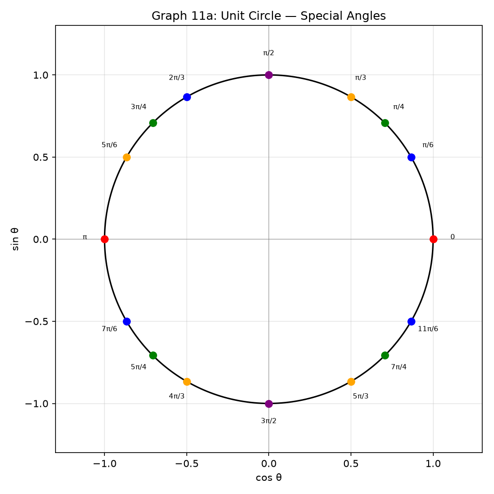
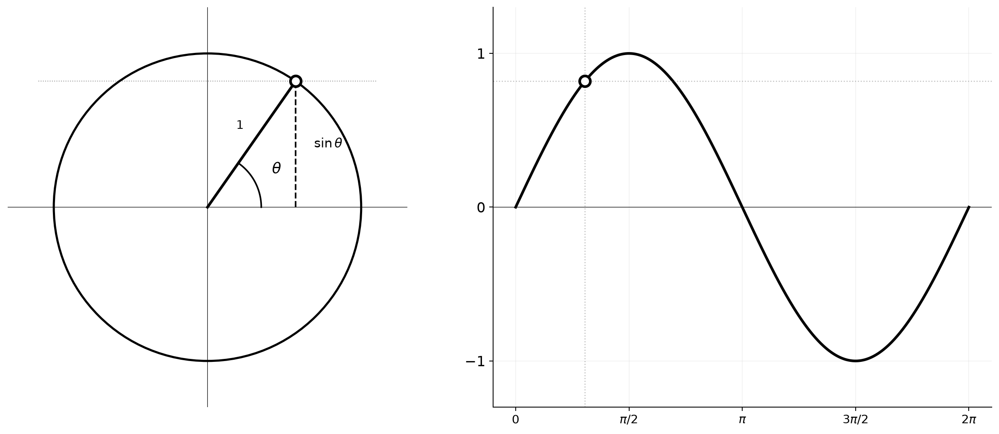
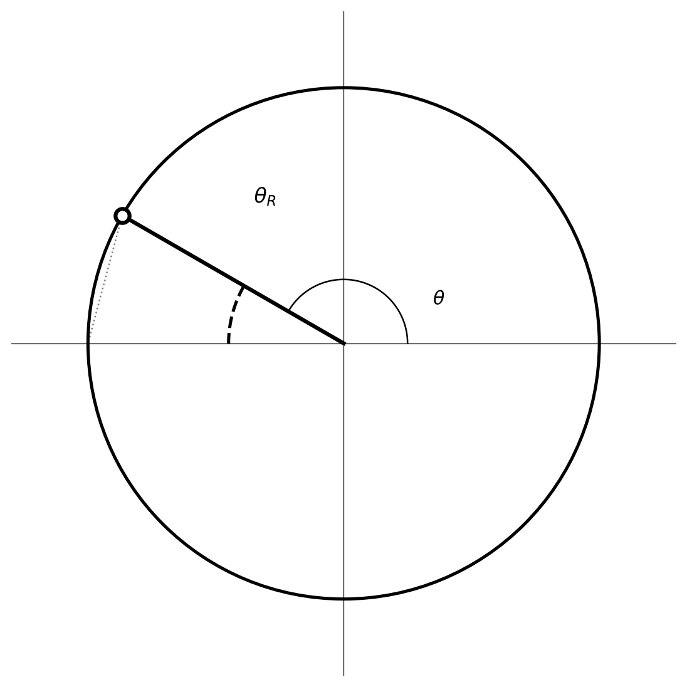
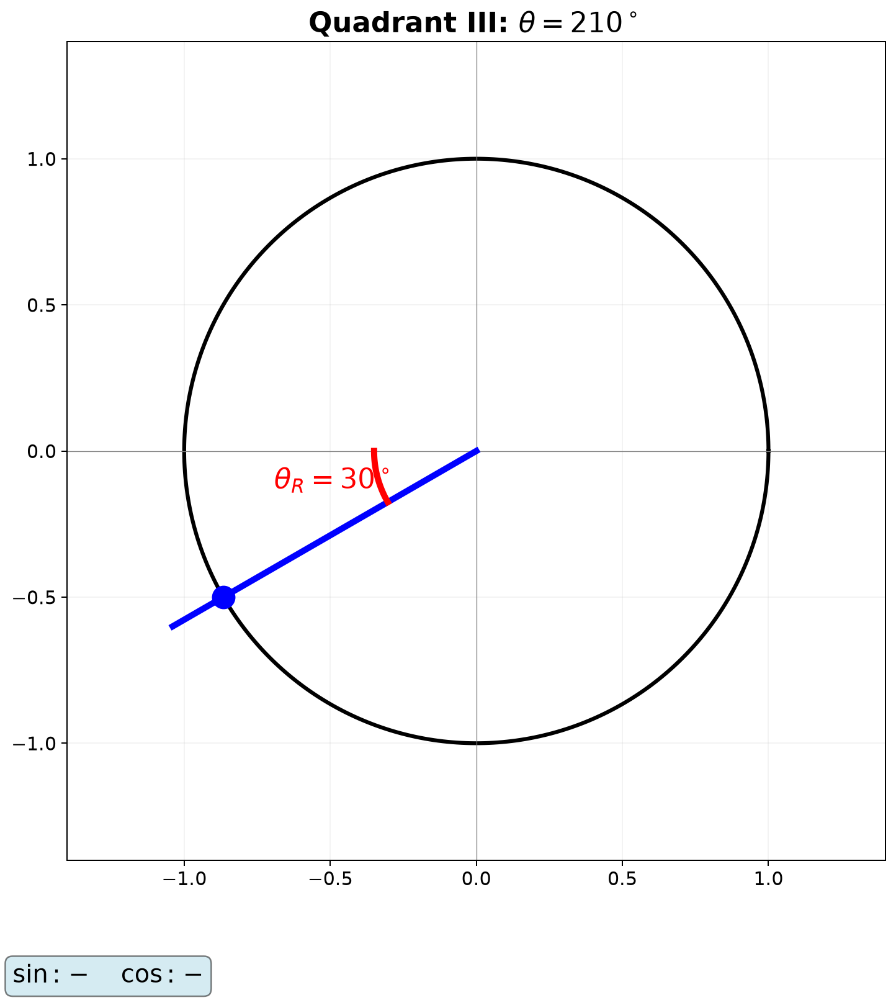
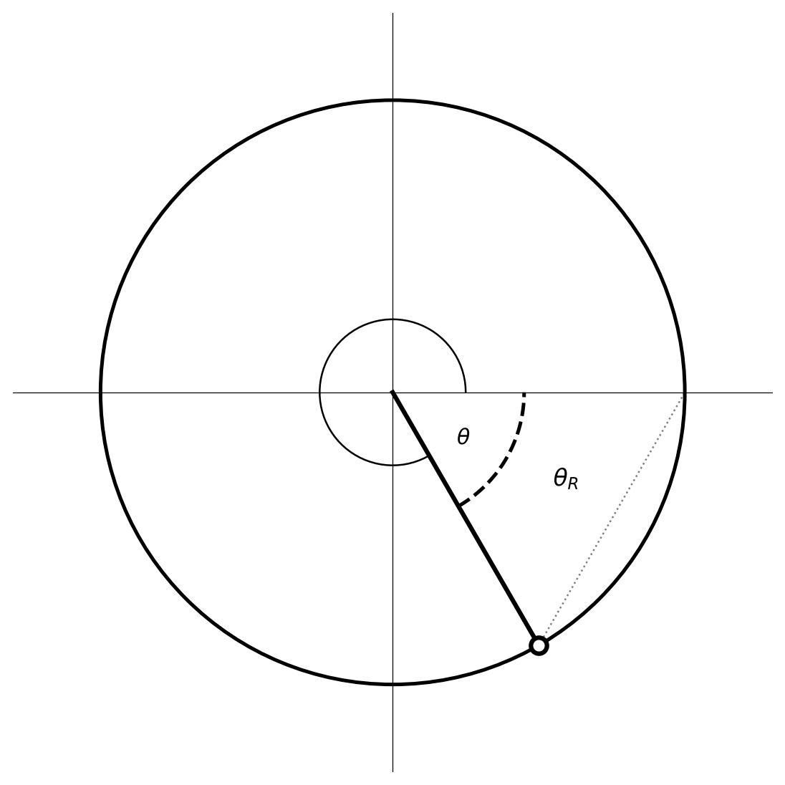
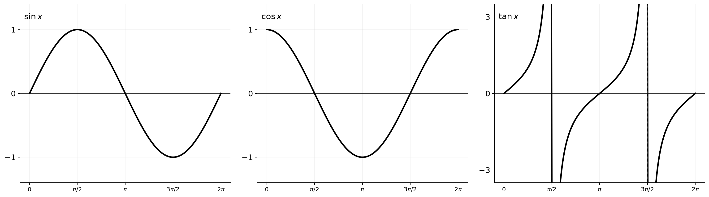
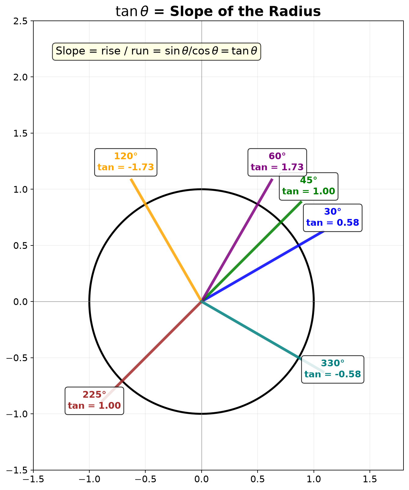
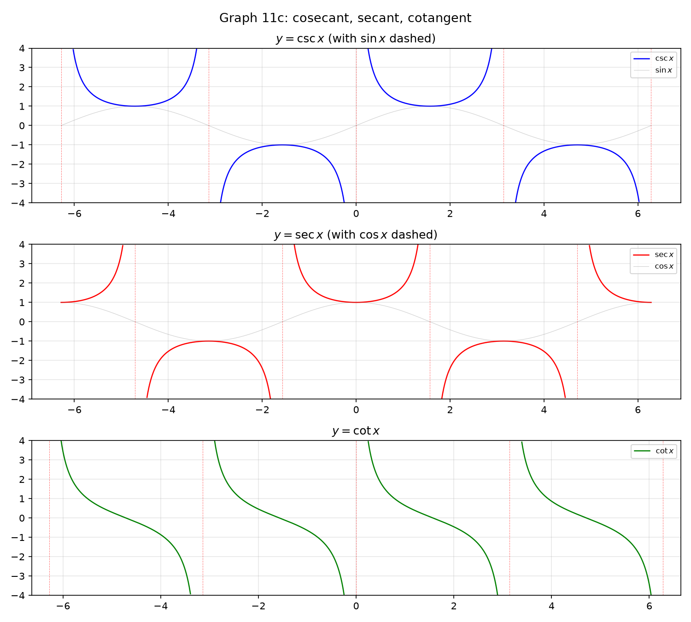
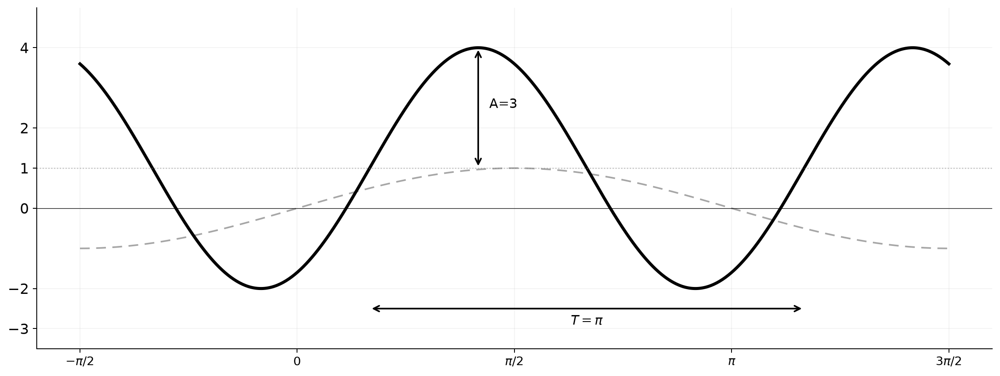
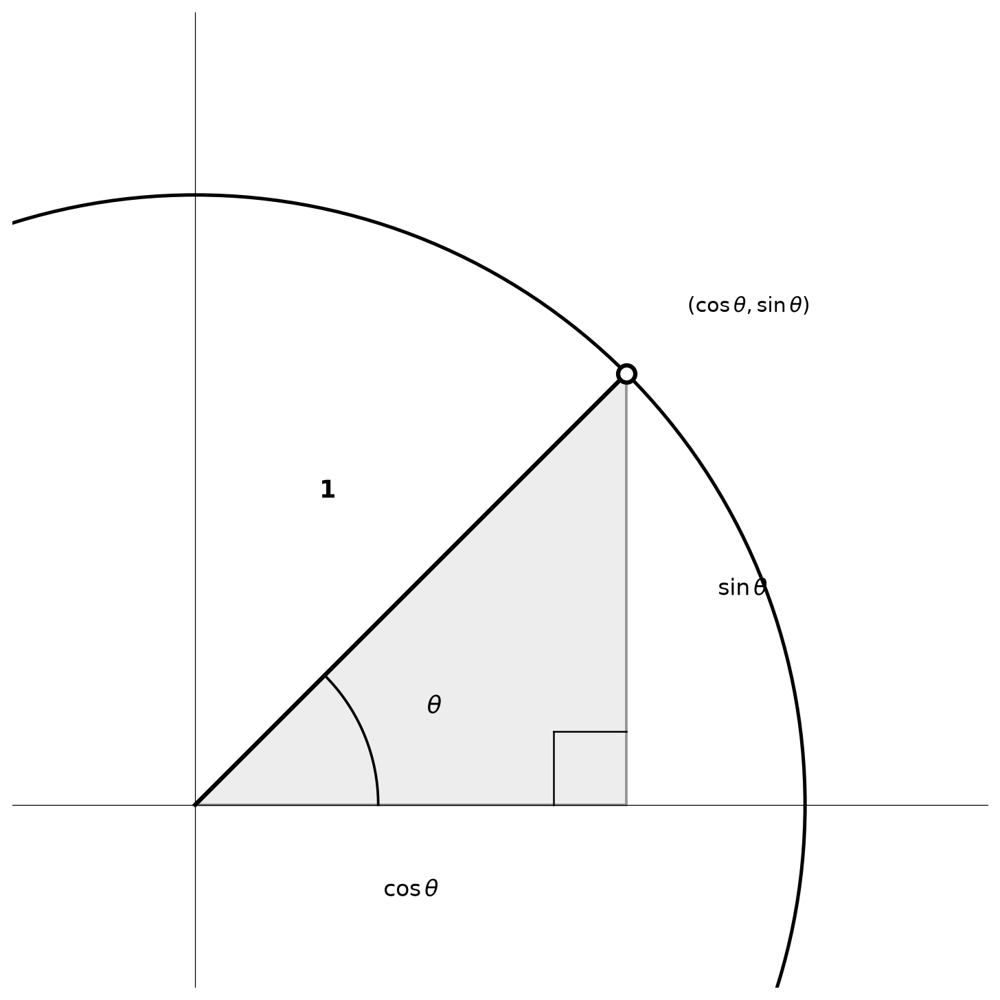

# Session 11A: Trigonometry Foundations — Angles, Circles, and Waves

**Phase 2 — Classical Techniques | 75 min**

---

## Part A: Angles — From Degrees to Radians

---

## Example 1: Remember Only $\pi = 180^\circ$

Radian measure: an angle that cuts an arc equal to the radius on the unit circle = 1 radian.
A semicircle has arc length $\pi r$ → $180^\circ = \pi$ rad.

Convert using proportion:
$90^\circ = \frac{\pi}{2}$. $60^\circ = \frac{\pi}{3}$. $45^\circ = \frac{\pi}{4}$. $30^\circ = \frac{\pi}{6}$.
$120^\circ = \frac{2\pi}{3}$. $270^\circ = \frac{3\pi}{2}$. $360^\circ = 2\pi$.

Reverse: $\frac{5\pi}{6} \times \frac{180^\circ}{\pi} = 150^\circ$.
$\frac{7\pi}{4} = 315^\circ$. $\frac{11\pi}{6} = 330^\circ$.

---

## Part B: The Unit Circle — The Seed of All Trigonometry

---

## Example 2: Read $(\cos\theta, \sin\theta)$ from the Unit Circle

On a circle of radius 1, go around by angle $\theta$. The coordinates of the point reached = $(\cos\theta, \sin\theta)$.

$\theta=0$: $(1,0)$. $\theta=\frac{\pi}{2}$: $(0,1)$. $\theta=\pi$: $(-1,0)$. $\theta=\frac{3\pi}{2}$: $(0,-1)$.

$\theta=\frac{\pi}{4}$: $x^2+y^2=1$, $x=y$ → $x=y=\frac{\sqrt{2}}{2}$. → $\cos\frac{\pi}{4}=\sin\frac{\pi}{4}=\frac{\sqrt{2}}{2}$.

$\theta=\frac{\pi}{3}$: 30-60-90 triangle. Short leg $\frac{1}{2}$, long leg $\frac{\sqrt{3}}{2}$.
→ $\cos\frac{\pi}{3}=\frac{1}{2}$, $\sin\frac{\pi}{3}=\frac{\sqrt{3}}{2}$.

$\theta=\frac{\pi}{6}$: $\cos\frac{\pi}{6}=\frac{\sqrt{3}}{2}$, $\sin\frac{\pi}{6}=\frac{1}{2}$.



---

## Visual Interlude: Unwrapping the Circle into the Sine Wave

**The single most important visualization in trigonometry.**

Imagine a point moving counterclockwise around the unit circle at constant speed. Now imagine a second graph underneath: the horizontal axis is the angle $\theta$ (or time), the vertical axis shows the height ($y$-coordinate) of the point.



At $\theta = 0$: the point is at $(1,0)$ — height 0. The sine wave starts at 0.
At $\theta = \frac{\pi}{2}$: the point is at $(0,1)$ — height 1. The sine wave hits its peak.
At $\theta = \pi$: the point is at $(-1,0)$ — height 0. The sine wave crosses the axis.
At $\theta = \frac{3\pi}{2}$: the point is at $(0,-1)$ — height −1. The sine wave bottoms out.
At $\theta = 2\pi$: back to $(1,0)$ — one full cycle complete.

**The cosine wave is the same unwrapping, but reading the $x$-coordinate instead.** It starts at 1 (the $x$-coordinate of the starting point), not 0. The phase difference is literally "a quarter-turn ahead."

**Tangent unwrapped**: At each angle, draw a vertical line tangent to the circle at $(1,0)$. Extend the radius. Where it hits the tangent line, the $y$-coordinate is $\tan\theta$. As $\theta \to 90^\circ$, the radius becomes parallel to the tangent line — they never meet — so $\tan\theta \to \infty$.

---

## Example 3: Engrave the Special Angle Table in Your Hand

| $\theta$ | $0$ | $\frac{\pi}{6}$ | $\frac{\pi}{4}$ | $\frac{\pi}{3}$ | $\frac{\pi}{2}$ |
|:---:|:---:|:---:|:---:|:---:|:---:|
| $\sin$ | $0$ | $\frac{1}{2}$ | $\frac{\sqrt{2}}{2}$ | $\frac{\sqrt{3}}{2}$ | $1$ |
| $\cos$ | $1$ | $\frac{\sqrt{3}}{2}$ | $\frac{\sqrt{2}}{2}$ | $\frac{1}{2}$ | $0$ |
| $\tan$ | $0$ | $\frac{\sqrt{3}}{3}$ | $1$ | $\sqrt{3}$ | undefined |

$\sin$: $0, \frac{1}{2}, \frac{\sqrt{2}}{2}, \frac{\sqrt{3}}{2}, 1$ — increasing.
$\cos$: same sequence in reverse. $\tan = \frac{\sin}{\cos}$.

---

## Example 4: Quadrant Signs — "All Students Take Calculus"

$\tan\theta = \frac{\sin\theta}{\cos\theta}$. Reciprocal functions follow sign of their originals.

| Quadrant | $\sin$ | $\cos$ | $\tan$ | $\csc$ | $\sec$ | $\cot$ |
|:---:|:---:|:---:|:---:|:---:|:---:|:---:|
| 1 | + | + | + | + | + | + |
| 2 | + | − | − | + | − | − |
| 3 | − | − | + | − | − | + |
| 4 | − | + | − | − | + | − |

$\sin 150^\circ$: Q2 → +. $150^\circ = 180^\circ-30^\circ$ → $\sin 30^\circ = \frac{1}{2}$.
$\cos 210^\circ$: Q3 → −. $210^\circ = 180^\circ+30^\circ$ → $-\cos 30^\circ = -\frac{\sqrt{3}}{2}$.
$\tan 300^\circ$: Q4 → −. $300^\circ = 360^\circ-60^\circ$ → $-\tan 60^\circ = -\sqrt{3}$.

**Reference angle method**: Find the acute angle to the nearest $x$-axis. Apply quadrant sign.

---

## Visual Interlude: The Reference Angle — A Geometric Shortcut

Every angle $\theta$ has a "shadow" in Quadrant 1 — its reference angle $\theta_R$, the acute angle between the terminal side and the $x$-axis.







**The rule**: The *magnitude* of any trig value at any angle is the same as at its reference angle. Only the sign changes — determined by the quadrant.

---

## Example 5: $\csc, \sec, \cot$ — Completing the Family of Six

$\csc\theta = \frac{1}{\sin\theta}$ ($\sin\theta \neq 0$). $\sec\theta = \frac{1}{\cos\theta}$ ($\cos\theta \neq 0$).
$\cot\theta = \frac{1}{\tan\theta} = \frac{\cos\theta}{\sin\theta}$ ($\sin\theta \neq 0$).

Evaluate:
$\csc\frac{\pi}{6} = \frac{1}{1/2} = 2$. $\sec\frac{\pi}{4} = \frac{1}{\sqrt{2}/2} = \sqrt{2}$.
$\cot\frac{\pi}{3} = \frac{1}{\sqrt{3}} = \frac{\sqrt{3}}{3}$.
$\csc\frac{5\pi}{6} = \frac{1}{\sin 150^\circ} = \frac{1}{1/2} = 2$.

**Extended Pythagorean identities**:
$\sin^2\theta + \cos^2\theta = 1$.
$1 + \tan^2\theta = \sec^2\theta$ (divide the above by $\cos^2\theta$).
$1 + \cot^2\theta = \csc^2\theta$ (divide the above by $\sin^2\theta$).

---

## Part C: Graphs — Drawing and Shaping Waves

---

## Example 6: Basic Graphs of $\sin$, $\cos$, $\tan$

**$y = \sin x$**: starts at $(0,0)$, period $2\pi$, amplitude 1, range $[-1,1]$.
Hits 1 at $\frac{\pi}{2}$, 0 at $\pi$, −1 at $\frac{3\pi}{2}$, 0 at $2\pi$. Origin-symmetric (odd).

**$y = \cos x$**: starts at $(0,1)$. $\sin$ shifted left by $\frac{\pi}{2}$. $y$-axis-symmetric (even).

**$y = \tan x$**: vertical asymptotes where $\cos=0$ ($\frac{\pi}{2}, \frac{3\pi}{2}, \dots$). Period $\pi$. Origin-symmetric (odd).



**Visual Insight — Tangent as Slope:**

On the unit circle, draw the radius to $(\cos\theta, \sin\theta)$. The slope of that radius line is:
$$\text{slope} = \frac{\text{rise}}{\text{run}} = \frac{\sin\theta}{\cos\theta} = \tan\theta.$$

So $\tan\theta$ is **the slope of the radius**.



**Visual Insight — $\sin\theta$ and $\cos\theta$ as Projections:**

Drop a perpendicular from the point on the circle to the $x$-axis: the $x$-intercept is $\cos\theta$, the $y$-intercept is $\sin\theta$. They are literally the horizontal and vertical shadows of a rotating unit vector.

---

## Example 7: Graphs of $\csc$, $\sec$, $\cot$

$\csc x = \frac{1}{\sin x}$: asymptotes at $0, \pi, 2\pi, \dots$ (where $\sin=0$).
U-shaped branches above $y=1$ where $\sin>0$; ∩-shaped below $y=-1$ where $\sin<0$.

$\sec x = \frac{1}{\cos x}$: asymptotes at $\frac{\pi}{2}, \frac{3\pi}{2}, \dots$ (where $\cos=0$).
Branches above $y=1$ and below $y=-1$.

$\cot x = \frac{1}{\tan x} = \frac{\cos}{\sin}$: asymptotes at $0, \pi, 2\pi, \dots$ (where $\sin=0$). Period $\pi$, always decreasing.



---

## Example 8: $y = a\sin(bx + c) + d$ — Cooking a Wave

$y = 3\sin(2x - \frac{\pi}{3}) + 1$.

(1) **Amplitude**: $|a| = 3$. Wave height ±3 from center.
(2) **Period**: $\frac{2\pi}{|b|} = \frac{2\pi}{2} = \pi$.
(3) **Phase shift**: $bx + c = 0$ → $x = -\frac{c}{b} = \frac{\pi}{6}$. Right by $\frac{\pi}{6}$.
(4) **Vertical shift**: $+1$. Range $[-2, 4]$.

$y = -2\cos(\frac{x}{2})$: amplitude 2 (flipped), period $4\pi$.

$y = 4\sin(\pi x + \frac{\pi}{4}) - 3$:
Amplitude 4, period $\frac{2\pi}{\pi}=2$, phase $x=-\frac{1}{4}$ (left by $\frac{1}{4}$), range $[-7, 1]$.



> **Up to here**: Radians from $\pi=180^\circ$. Unit circle → $(\cos\theta,\sin\theta)$. Special angle table engraved.
> 6 trig functions + quadrant signs. Graphs of all 6 functions. Wave shaping with $a,b,c,d$.

---

## Visual Interlude: Geometric Proof of $\sin^2\theta + \cos^2\theta = 1$

**No algebra needed — just look at the unit circle.**

The point $(\cos\theta, \sin\theta)$ lies on the circle $x^2 + y^2 = 1$. Substitute $x = \cos\theta$, $y = \sin\theta$: $\cos^2\theta + \sin^2\theta = 1$. This is the Pythagorean theorem in disguise.



Three identities from one picture — the unit circle is a factory for identities.

---

## Common Mistakes

### Mistake 1: $\sin 2x = 2\sin x$

**Wrong path**: "$\sin 2x = 2\sin x$."

**Why wrong**: $\sin 2x = 2\sin x\cos x$. The factor $\cos x$ is missing.

**Right path**: $\sin 2\theta = 2\sin\theta\cos\theta$. Always write both factors.

---

### Mistake 2: Forgetting $\arcsin$ range

**Wrong path**: "$\sin x = \frac{1}{2}$ → $x = \arcsin\frac{1}{2} = \frac{\pi}{6}$ or $\frac{5\pi}{6}$."

**Why wrong**: $\arcsin$ returns values only in $[-\frac{\pi}{2}, \frac{\pi}{2}]$.

**Right path**: $\arcsin\frac{1}{2} = \frac{\pi}{6}$. Find the second solution manually: $\pi - \frac{\pi}{6} = \frac{5\pi}{6}$.

---

### Mistake 3: Confusing period of $\tan x$

**Wrong path**: "The period of $\tan x$ is $2\pi$, same as $\sin$ and $\cos$."

**Why wrong**: $\tan x = \frac{\sin x}{\cos x}$ repeats every $\pi$ because both numerator and denominator flip sign after $\pi$, canceling out.

**Right path**: Period of $\tan x$ is $\pi$. Asymptotes occur every $\pi$ as well.

---

## What We Just Did

```
(1) Radian measure — π = 180°, convert by proportion.  Memorize the common angles.
    The unit circle: a point at angle θ has coordinates (cos θ, sin θ).
    Read sine and cosine directly from the circle. Special angle table engraved.

(2) Six functions — sin, cos, tan plus their reciprocals csc, sec, cot.
    Quadrant signs: All positive in Q1, Sin positive in Q2, Tan in Q3, Cos in Q4.
    Reference angle: reduce any angle to its Q1 acute shadow.

(3) Graphs — sin starts at 0, cos starts at 1, tan has asymptotes.
    y = a·sin(bx+c)+d: amplitude=|a|, period=2π/|b|, phase=−c/b, v-shift=d.
    Tangent is the slope of the radius. sin²+cos²=1 is the Pythagorean theorem.
```

---

## Practice 1

$\sin\theta = -\frac{\sqrt{3}}{2}$, $\theta$ in Q4. Find $\cos\theta$, $\tan\theta$, $\sec\theta$, $\csc\theta$, $\cot\theta$.

→ Reference: **Example 3, 4, 5**

> Solutions: [Solutions](solutions/11A-solutions.md#practice-1)

---

## Practice 2

For $y = 2\sin(3x + \pi) - 1$, give the amplitude, period, phase shift, and vertical shift. State the max and min values.

→ Reference: **Example 8**

> Solutions: [Solutions](solutions/11A-solutions.md#practice-2)

---

## Practice 3: Composition

Draw a rough sketch of one period of $y = -3\cos(2x) + 2$. Label the maximum, minimum, and axis intercepts. Then explain in words how each parameter ($a,b,d$) changed the graph from the basic $y=\cos x$.

→ Reference: **Example 6, 8**

> Solutions: [Solutions](solutions/11A-solutions.md#practice-3)

---

## Practice 4

Convert to radians and evaluate exactly: $\sin 210^\circ$, $\cos 315^\circ$, $\tan 240^\circ$.

→ Reference: **Example 1, 4**

> Solutions: [Solutions](solutions/11A-solutions.md#practice-4)

---

## Practice 5: Real Battle

A Ferris wheel has radius 30 m and completes one revolution in 4 minutes. The lowest point is 2 m above the ground. Write a function $h(t) = a\sin(bt + c) + d$ for the height above ground after $t$ minutes, assuming you start at the lowest point.

→ Reference: **Example 8**

> Solutions: [Solutions](solutions/11A-solutions.md#practice-5)

---

## Basic Algebra Drill — Trigonometry Foundations (10 Problems)

> Pure calculation. Every fundamental operation appears at least once. Build speed.

**D1.** Convert to radians: $150^\circ$, $225^\circ$, $330^\circ$.

**D2.** Convert to degrees: $\frac{3\pi}{4}$, $\frac{5\pi}{3}$, $\frac{11\pi}{6}$.

**D3.** Evaluate without a calculator: $\sin\frac{5\pi}{6}$, $\cos\frac{7\pi}{4}$, $\tan\frac{4\pi}{3}$.

**D4.** Evaluate without a calculator: $\sin\frac{3\pi}{2}$, $\cos\pi$, $\tan\frac{5\pi}{4}$.

**D5.** Given $\sin\theta = \frac{5}{13}$ and $\theta$ in Q2, find $\cos\theta$ and $\tan\theta$.

**D6.** Given $\cos\theta = -\frac{3}{5}$ and $\theta$ in Q3, find $\sin\theta$, $\tan\theta$, $\sec\theta$, $\csc\theta$, $\cot\theta$.

**D7.** Find the period and amplitude of $y = -4\cos(\frac{\pi}{2}x) + 3$.

**D8.** Find the amplitude, period, phase shift, and vertical shift of $y = 5\sin(4x - \pi) - 2$.

**D9.** Simplify $\frac{\sin x}{\csc x} + \frac{\cos x}{\sec x}$. (Write $\csc$ and $\sec$ in terms of $\sin$ and $\cos$ first.)

**D10.** Evaluate $\sin^2 15^\circ + \sin^2 75^\circ$. (Hint: $\sin 75^\circ = \cos 15^\circ$.)

> Solutions: [Solutions](solutions/11A-solutions.md#basic-drill)

---

## Advanced Algebra Drill — Trigonometry Foundations (10 Problems)

> Multi-step. Moves beyond single-step evaluation into identity chaining and equation solving.

**A1.** Find all six trigonometric functions of $\theta = \frac{5\pi}{3}$.

**A2.** If $\sin\theta = \frac{4}{5}$ and $\theta \in Q1$, compute $\sin 2\theta$ and $\cos 2\theta$ without finding $\theta$ first.

**A3.** Simplify $\frac{\sin(-x)}{\cos(-x)} + \frac{\cos(-x)}{\sin(-x)}$. Use odd/even properties.

**A4.** Evaluate $\sin\frac{2\pi}{3} \cdot \cos\frac{\pi}{6} + \cos\frac{2\pi}{3} \cdot \sin\frac{\pi}{6}$ by recognizing the sum formula pattern.

**A5.** Write $y = -2\sin(3x + \frac{\pi}{2}) + 1$ in the form $y = a\cos(bx + c) + d$. (Hint: $\sin(\theta + \frac{\pi}{2}) = \cos\theta$.)

**A6.** Find all $x \in [0, 2\pi]$ such that $2\sin^2 x - 1 = 0$.

**A7.** If $\tan\theta = 2$ and $\theta \in Q3$, find $\sin\theta$ and $\cos\theta$ exactly. (Draw the triangle, apply quadrant signs.)

**A8.** Simplify $\frac{1 - \cos^2\theta}{\sin\theta} + \frac{1 - \sin^2\theta}{\cos\theta}$ to a single trig function.

**A9.** A wave has equation $y = 3\cos(\frac{\pi}{4}x) - 1$. Find all $x \in [0, 16]$ where $y = -1$.

**A10.** Prove that $\sin^4\theta + \cos^4\theta = 1 - \frac{1}{2}\sin^2 2\theta$.

> Solutions: [Solutions](solutions/11A-solutions.md#advanced-drill)

---

## Today's Procedure

```
Step 1: Radians — π = 180°. Convert by multiplying by π/180° (to radians)
         or 180°/π (to degrees). Memorize the 5 special angles: 0, π/6, π/4, π/3, π/2.
         Read (cos θ, sin θ) directly from the unit circle.

Step 2: Six functions — sin, cos, tan, csc=1/sin, sec=1/cos, cot=1/tan.
         Quadrant signs: All-Sin-Tan-Cos. Reference angle = acute angle to x-axis.
         Pythagorean identity: sin²+cos²=1, plus its two variants.

Step 3: Graphs — sin: starts at 0, period 2π. cos: starts at 1, period 2π.
         tan: asymptotes at π/2 + nπ, period π.
         y = a·sin(bx+c)+d: a = amplitude, 2π/|b| = period, −c/b = phase, d = v-shift.
```

---

## Terminology

Up to now we used plain words like "radian", "unit circle", "wave", "one full turn".
**You have already learned all the methods.** Now we attach the formal mathematical names.

| What we called it | Mathematical term | Notation |
|:-----------------:|:-----------------:|:--------:|
| radian | radian | $\pi = 180^\circ$ |
| unit circle | unit circle | $x^2 + y^2 = 1$ |
| period / one full turn | period | $\sin$/$\cos$: $2\pi$, $\tan$: $\pi$ |
| amplitude / wave height | amplitude | $|a|$ |
| phase shift | phase shift | $-c/b$ |
| reciprocal trig functions | reciprocal trigonometric functions | $\csc, \sec, \cot$ |
| Pythagorean identity | Pythagorean identity | $\sin^2\theta + \cos^2\theta = 1$ |
| reference angle | reference angle | acute angle to nearest $x$-axis |
