# Session 11A: Trigonometric Foundations — Radians, the Unit Circle, and Six Functions

**Phase 2 — Classical Techniques | 105 min**

*Covers: radians and degree conversion, unit circle coordinates, sin/cos/tan/csc/sec/cot definitions and graphs, inverse trig functions and their graphs*

*Prerequisite for: [11B — Trigonometric Identities, Equations, and Beyond](11B-trig-advanced.md)*

---

## Part A: Radians and the Unit Circle — The Two Pillars

---

## Example 1: What a Radian Really Is

Take a circle of radius $r$. Walk along the circumference for exactly $r$ units of length. The angle you swept out is **1 radian**.

In one full trip around the circle, you walk $2\pi r$ (the full circumference). So there are $2\pi$ radians in a full circle.

$360^\circ = 2\pi \text{ rad}$. $180^\circ = \pi \text{ rad}$. $90^\circ = \frac{\pi}{2} \text{ rad}$.

**Why radians?** Because the arc length formula becomes trivial: $s = r\theta$.
Degrees: $s = \frac{\pi r \theta}{180^\circ}$ — messy. Radians: $s = r\theta$ — clean.
This simplicity is why calculus *only* works in radians. $\frac{d}{dx}\sin x = \cos x$ is true only when $x$ is in radians.

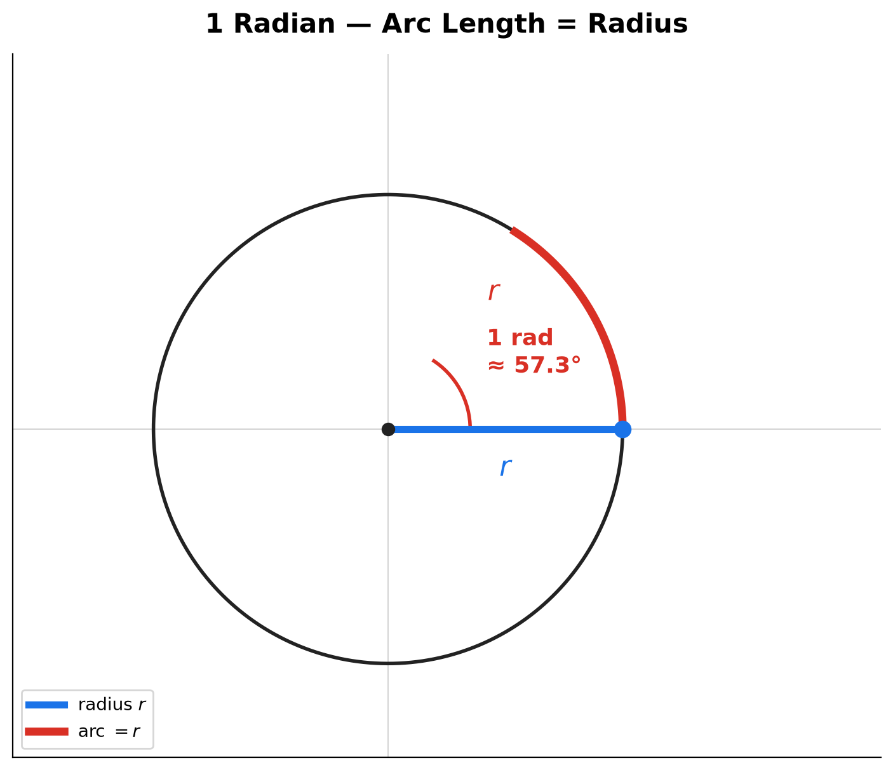

> **Geometric insight**: 1 radian ≈ 57.3°. An angle of 1 radian cuts off an arc exactly as long as the radius. This is the natural unit of angle — no arbitrary "360" involved. The number 360 comes from ancient Babylonian astronomy (close to 365 days/year). Radians come from the geometry of the circle itself.

---

## Example 2: Converting Between Degrees and Radians — Multiply by $\pi/180^\circ$

**Degrees → radians**: multiply by $\frac{\pi}{180^\circ}$.

$30^\circ \to 30^\circ \times \frac{\pi}{180^\circ} = \frac{\pi}{6}$.
$45^\circ \to 45^\circ \times \frac{\pi}{180^\circ} = \frac{\pi}{4}$.
$60^\circ \to 60^\circ \times \frac{\pi}{180^\circ} = \frac{\pi}{3}$.
$120^\circ \to 120^\circ \times \frac{\pi}{180^\circ} = \frac{2\pi}{3}$.
$270^\circ \to 270^\circ \times \frac{\pi}{180^\circ} = \frac{3\pi}{2}$.

**Radians → degrees**: multiply by $\frac{180^\circ}{\pi}$.

$\frac{\pi}{6} \to \frac{\pi}{6} \times \frac{180^\circ}{\pi} = 30^\circ$.
$\frac{5\pi}{4} \to \frac{5\pi}{4} \times \frac{180^\circ}{\pi} = 225^\circ$.
$\frac{7\pi}{3} \to \frac{7\pi}{3} \times \frac{180^\circ}{\pi} = 420^\circ$ (one full circle + 60°).

**Mental shortcut table** — memorize these and derive others by proportions:

| Degrees | $0^\circ$ | $30^\circ$ | $45^\circ$ | $60^\circ$ | $90^\circ$ | $180^\circ$ | $270^\circ$ | $360^\circ$ |
|:---:|:---:|:---:|:---:|:---:|:---:|:---:|:---:|:---:|
| Radians | $0$ | $\frac{\pi}{6}$ | $\frac{\pi}{4}$ | $\frac{\pi}{3}$ | $\frac{\pi}{2}$ | $\pi$ | $\frac{3\pi}{2}$ | $2\pi$ |

To get $120^\circ$: $120^\circ = 2 \times 60^\circ = 2 \times \frac{\pi}{3} = \frac{2\pi}{3}$.
To get $210^\circ$: $210^\circ = 180^\circ + 30^\circ = \pi + \frac{\pi}{6} = \frac{7\pi}{6}$.

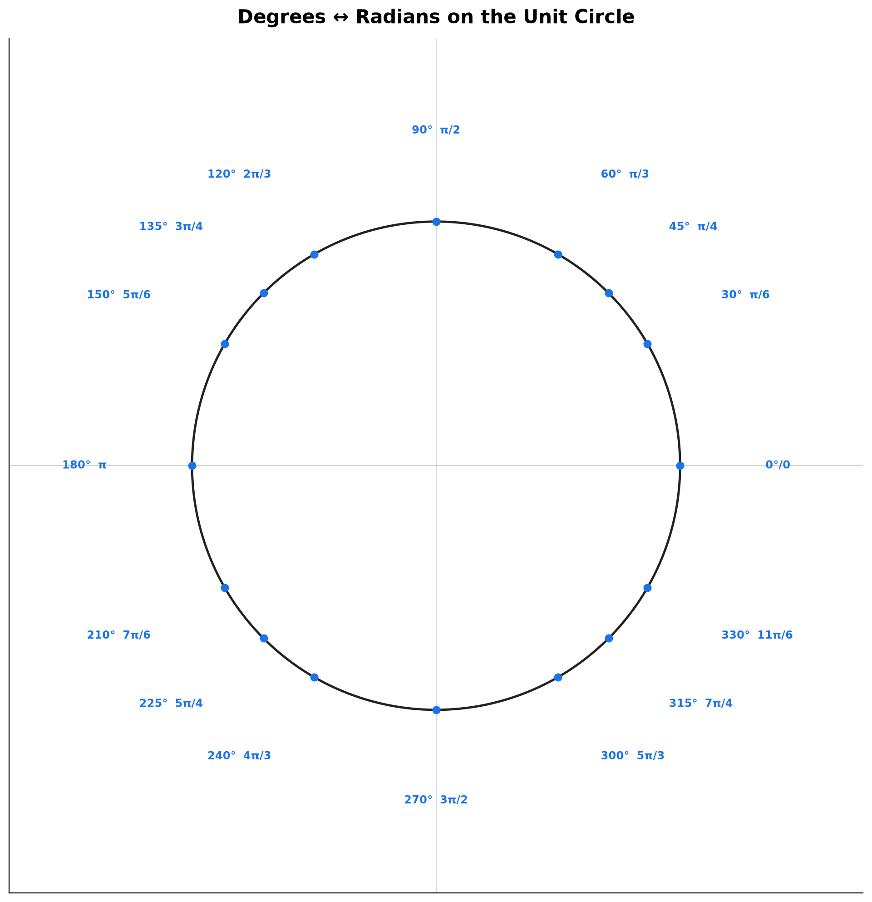

> **Geometric insight**: Thinking in radians means thinking in multiples of $\pi$. A quarter-turn is $\pi/2$, not 90. A half-turn is $\pi$, not 180. This rewires your brain to see angles as *distances along the circle*, not arbitrary numbers.

**Method — Converting any angle in 3 steps:**

(1) **Pick the direction.** Degrees → radians: multiply by $\frac{\pi}{180^\circ}$. Radians → degrees: multiply by $\frac{180^\circ}{\pi}$.

(2) **Multiply numerators, multiply denominators.** Treat $\pi$ like a symbol, not a number.
$150^\circ \times \frac{\pi}{180^\circ} = \frac{150\pi}{180}$. Reduce the fraction: $\frac{150}{180} = \frac{5}{6}$. Result: $\frac{5\pi}{6}$.

(3) **If the result is $>2\pi$ or negative, wrap it.** $\frac{7\pi}{3} > 2\pi$: subtract $2\pi = \frac{6\pi}{3}$ → $\frac{\pi}{3}$. $-\frac{\pi}{4}$ is negative: add $2\pi = \frac{8\pi}{4}$ → $\frac{7\pi}{4}$.

---

## Example 3: The Unit Circle — A Circle of Radius 1

Draw a circle centered at $(0,0)$ with radius 1. This is the **unit circle**.

Pick any angle $\theta$ measured counterclockwise from the positive $x$-axis. Draw a ray at that angle. It hits the circle at exactly one point. Call that point $(x, y)$.

**The $x$-coordinate of that point is $\cos\theta$. The $y$-coordinate of that point is $\sin\theta$.**

$\theta = 0$: ray hits $(1, 0)$. So $\cos 0 = 1$, $\sin 0 = 0$.
$\theta = \frac{\pi}{2}$: ray hits $(0, 1)$. So $\cos\frac{\pi}{2} = 0$, $\sin\frac{\pi}{2} = 1$.
$\theta = \pi$: ray hits $(-1, 0)$. So $\cos\pi = -1$, $\sin\pi = 0$.
$\theta = \frac{3\pi}{2}$: ray hits $(0, -1)$. So $\cos\frac{3\pi}{2} = 0$, $\sin\frac{3\pi}{2} = -1$.

**The Pythagorean identity drops out immediately**: $x^2 + y^2 = 1$ (every point on the unit circle satisfies this). Since $x = \cos\theta$ and $y = \sin\theta$: $\cos^2\theta + \sin^2\theta = 1$.

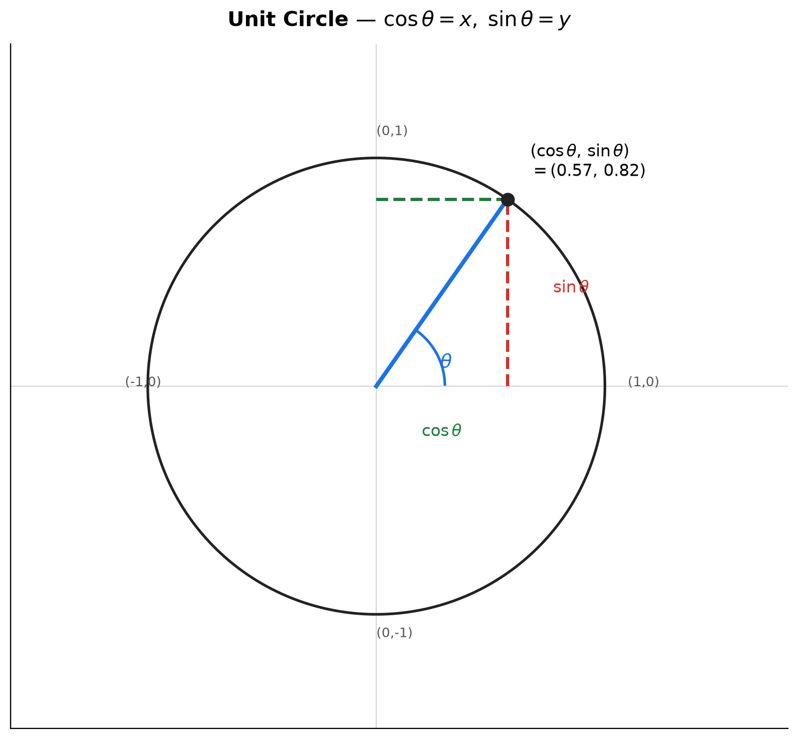

> **Geometric insight**: The unit circle turns trigonometry into coordinate geometry. $\cos\theta$ is just the horizontal position, $\sin\theta$ is the vertical position. Every trig fact about $\sin$ and $\cos$ is a fact about where a point lies on a circle.

---

## Example 4: Special Angles — Exact Coordinates on the Unit Circle

**$\theta = \frac{\pi}{4}$ (45°)**: The point lies on the line $y = x$. Since $x^2 + y^2 = 1$ and $x = y$:
$2x^2 = 1 \to x = \frac{1}{\sqrt{2}} = \frac{\sqrt{2}}{2}$. So $\cos\frac{\pi}{4} = \frac{\sqrt{2}}{2}$, $\sin\frac{\pi}{4} = \frac{\sqrt{2}}{2}$.

**$\theta = \frac{\pi}{6}$ (30°)**: The 30-60-90 triangle has sides in ratio $1 : \sqrt{3} : 2$ (short leg : long leg : hypotenuse). On the unit circle, the hypotenuse is 1, so divide by 2:
Short leg (opposite 30°, which is $\sin$) = $\frac{1}{2}$. Long leg (adjacent to 30°, which is $\cos$) = $\frac{\sqrt{3}}{2}$.
$\sin\frac{\pi}{6} = \frac{1}{2}$, $\cos\frac{\pi}{6} = \frac{\sqrt{3}}{2}$.

**$\theta = \frac{\pi}{3}$ (60°)**: Swap the legs from 30°.
$\sin\frac{\pi}{3} = \frac{\sqrt{3}}{2}$, $\cos\frac{\pi}{3} = \frac{1}{2}$.

**Summary table — first quadrant special angles**:

| $\theta$ (rad) | $0$ | $\frac{\pi}{6}$ | $\frac{\pi}{4}$ | $\frac{\pi}{3}$ | $\frac{\pi}{2}$ |
|:---:|:---:|:---:|:---:|:---:|:---:|
| $\sin\theta$ | $0$ | $\frac{1}{2}$ | $\frac{\sqrt{2}}{2}$ | $\frac{\sqrt{3}}{2}$ | $1$ |
| $\cos\theta$ | $1$ | $\frac{\sqrt{3}}{2}$ | $\frac{\sqrt{2}}{2}$ | $\frac{1}{2}$ | $0$ |

**Pattern to memorize**: $\sin$ goes $0, \frac{1}{2}, \frac{\sqrt{2}}{2}, \frac{\sqrt{3}}{2}, 1$ (the $\frac{\sqrt{n}}{2}$ pattern for $n=0,1,2,3,4$). $\cos$ is the same list read backwards.

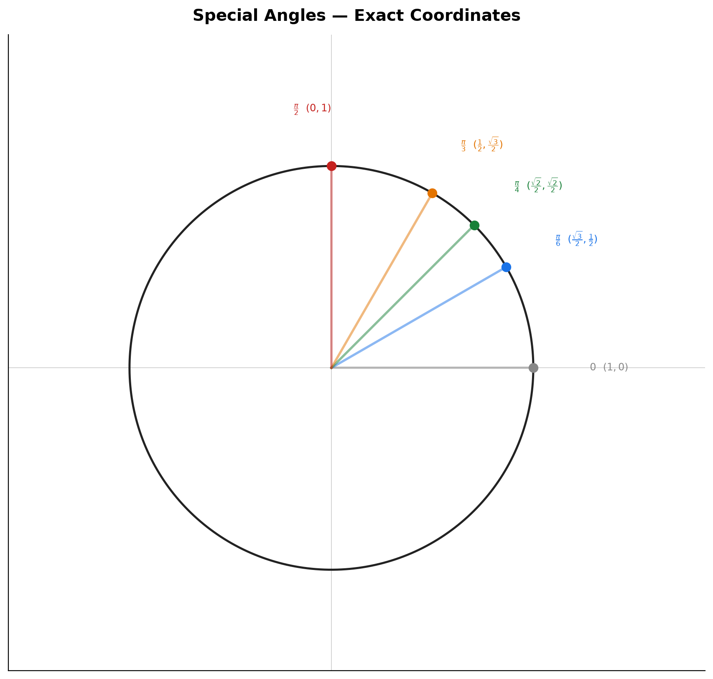

> **Geometric insight**: Every angle that is a multiple of $\frac{\pi}{6}$ or $\frac{\pi}{4}$ has an exact coordinate expressible with square roots. These 16 points (4 quadrants × 4 angles each) are your reference grid. All other trig values flow from them via symmetry.

---

## Example 5: Quadrants, Signs, and Reference Angles

**Signs by quadrant — "All Students Take Calculus":**

| Quadrant | I | II | III | IV |
|:---:|:---:|:---:|:---:|:---:|
| $\sin$ | $+$ | $+$ | $-$ | $-$ |
| $\cos$ | $+$ | $-$ | $-$ | $+$ |
| $\tan$ | $+$ | $-$ | $+$ | $-$ |

Memory: **A**ll positive in QI → **S**ine positive in QII → **T**angent positive in QIII → **C**osine positive in QIV.

**Reference angle**: For any angle $\theta$, find the acute angle between the terminal ray and the $x$-axis. The $\sin$/$\cos$ *magnitudes* match the reference angle. The *sign* comes from the quadrant.

$\theta = \frac{5\pi}{6}$ (150°, QII). Reference angle = $\pi - \frac{5\pi}{6} = \frac{\pi}{6}$.
$\sin\frac{5\pi}{6} = +\sin\frac{\pi}{6} = \frac{1}{2}$ (positive in QII).
$\cos\frac{5\pi}{6} = -\cos\frac{\pi}{6} = -\frac{\sqrt{3}}{2}$ (negative in QII).

$\theta = \frac{7\pi}{4}$ (315°, QIV). Reference angle = $2\pi - \frac{7\pi}{4} = \frac{\pi}{4}$.
$\sin\frac{7\pi}{4} = -\frac{\sqrt{2}}{2}$, $\cos\frac{7\pi}{4} = +\frac{\sqrt{2}}{2}$.

$\theta = \frac{4\pi}{3}$ (240°, QIII). Reference angle = $\frac{4\pi}{3} - \pi = \frac{\pi}{3}$.
$\sin\frac{4\pi}{3} = -\frac{\sqrt{3}}{2}$, $\cos\frac{4\pi}{3} = -\frac{1}{2}$.

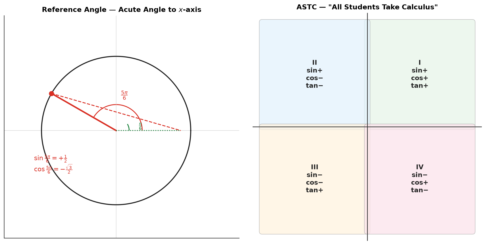

> **Geometric insight**: Every angle outside QI is just a QI angle reflected across an axis. The reflection determines the sign. The reference angle determines the magnitude.

> **Up to here**: Radians measure angles by arc length. Unit circle gives $\cos$ as $x$, $\sin$ as $y$. Special angles at multiples of $\frac{\pi}{6}$ and $\frac{\pi}{4}$ have exact radical coordinates. Reference angles + ASTC give any angle's trig values.

**Method — Evaluating sin, cos, tan for any angle in 3 steps:**

(1) **Normalize the angle into $[0, 2\pi)$.** If $\theta > 2\pi$, subtract $2\pi$ repeatedly until it falls in range. If $\theta < 0$, add $2\pi$ repeatedly.

(2) **Find the reference angle $\alpha$.** Which quadrant? QI: $\alpha = \theta$. QII: $\alpha = \pi - \theta$. QIII: $\alpha = \theta - \pi$. QIV: $\alpha = 2\pi - \theta$. The reference angle is always acute ($0$ to $\frac{\pi}{2}$).

(3) **Read sin $\alpha$, cos $\alpha$ from the special-angle table. Attach the ASTC sign.**
QI: $(+,+)$. QII: $(+,-)$. QIII: $(-,-)$. QIV: $(-,+)$. Then $\tan = \sin/\cos$.

*Walkthrough for $\frac{11\pi}{6}$:* QIV. $\alpha = 2\pi - \frac{11\pi}{6} = \frac{\pi}{6}$. $\sin\frac{\pi}{6}=\frac{1}{2}$, $\cos\frac{\pi}{6}=\frac{\sqrt{3}}{2}$. QIV: sin $(-)$, cos $(+)$. → $\sin\frac{11\pi}{6} = -\frac{1}{2}$, $\cos\frac{11\pi}{6} = \frac{\sqrt{3}}{2}$, $\tan\frac{11\pi}{6} = -\frac{1}{\sqrt{3}} = -\frac{\sqrt{3}}{3}$.

---

## Part B: The Six Trigonometric Functions — Definitions and Graphs

---

## Example 6: $\sin\theta$ and $\cos\theta$ — The Graphs Born from the Circle

Unroll the unit circle. As $\theta$ increases, the $y$-coordinate ($\sin\theta$) rises and falls, tracing a smooth wave. The $x$-coordinate ($\cos\theta$) does the same, shifted by $\frac{\pi}{2}$.

**$\sin\theta$ graph**:
- Starts at 0. Rises to 1 at $\frac{\pi}{2}$. Falls to 0 at $\pi$. Drops to $-1$ at $\frac{3\pi}{2}$. Returns to 0 at $2\pi$.
- **Period** = $2\pi$ (one full wave repeats every $2\pi$).
- **Amplitude** = 1 (the wave goes from $-1$ to $1$).
- **Domain**: all real numbers. **Range**: $[-1, 1]$.
- **Symmetry**: $\sin(-\theta) = -\sin\theta$ (odd — symmetric about origin).

**$\cos\theta$ graph**:
- Starts at 1. Falls to 0 at $\frac{\pi}{2}$. Drops to $-1$ at $\pi$. Rises to 0 at $\frac{3\pi}{2}$. Returns to 1 at $2\pi$.
- Same period and amplitude as sine.
- $\cos\theta = \sin(\theta + \frac{\pi}{2})$ — the cosine wave is the sine wave shifted left by $\frac{\pi}{2}$.
- **Symmetry**: $\cos(-\theta) = \cos\theta$ (even — symmetric about $y$-axis).

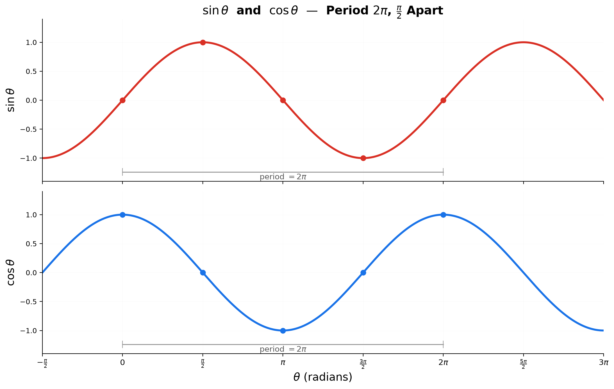

> **Geometric insight**: Watch a point move around the unit circle at constant speed. Plot its $y$-coordinate against time — that's $\sin t$. Plot its $x$-coordinate against time — that's $\cos t$. The two waves are the same shape, just $\frac{\pi}{2}$ out of phase.

---

## Example 7: $\tan\theta$ — Slope of the Ray

On the unit circle, $\tan\theta = \frac{\sin\theta}{\cos\theta} = \frac{y}{x}$. This is the slope of the ray from the origin.

Geometrically, extend the ray until it hits the vertical line $x = 1$ (the tangent line to the circle at $(1,0)$). The $y$-coordinate of that intersection is $\tan\theta$.

**Special values**:
$\tan 0 = 0$. $\tan\frac{\pi}{6} = \frac{1/2}{\sqrt{3}/2} = \frac{1}{\sqrt{3}} = \frac{\sqrt{3}}{3}$.
$\tan\frac{\pi}{4} = \frac{\sqrt{2}/2}{\sqrt{2}/2} = 1$. $\tan\frac{\pi}{3} = \frac{\sqrt{3}/2}{1/2} = \sqrt{3}$.

**$\tan\theta$ graph**:
- **Period** = $\pi$ (repeats every $\pi$, not $2\pi$).
- **Vertical asymptotes** at $\theta = \frac{\pi}{2} + n\pi$ (where $\cos\theta = 0$).
- The graph shoots up to $+\infty$ approaching an asymptote from the left, and down from $-\infty$ from the right.
- **Domain**: all real numbers except $\frac{\pi}{2} + n\pi$. **Range**: all real numbers.
- **Symmetry**: $\tan(-\theta) = -\tan\theta$ (odd).

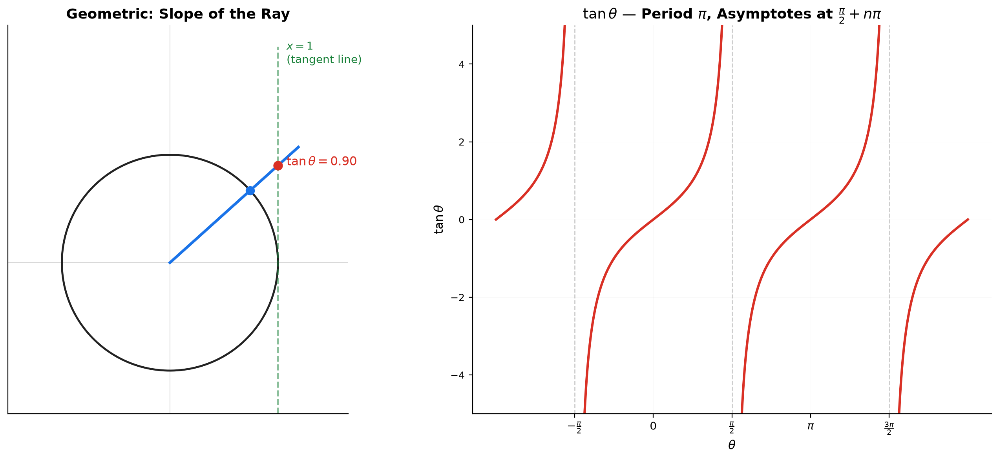

> **Geometric insight**: $\tan\theta$ is the slope. As the ray gets nearly vertical, the slope explodes to infinity — hence the asymptotes. Every $\pi$ radians you're back to the same slope (a line and its extension 180° later have the same slope), so the period is $\pi$.

---

## Example 8: $\csc\theta$, $\sec\theta$, $\cot\theta$ — The Reciprocals

$\csc\theta = \frac{1}{\sin\theta}$. $\sec\theta = \frac{1}{\cos\theta}$. $\cot\theta = \frac{1}{\tan\theta} = \frac{\cos\theta}{\sin\theta}$.

**$\csc\theta$ graph** (reciprocal of sine):
- Where $\sin\theta$ is large ($\pm 1$), $\csc\theta$ is small ($\pm 1$).
- Where $\sin\theta$ is near 0, $\csc\theta$ explodes to $\pm\infty$ → vertical asymptotes at $\theta = n\pi$.
- U-shaped branches alternating above $y=1$ and below $y=-1$.
- **Period** = $2\pi$. **Range**: $(-\infty, -1] \cup [1, \infty)$.

**$\sec\theta$ graph** (reciprocal of cosine):
- Same shape as $\csc\theta$ but shifted by $\frac{\pi}{2}$.
- Asymptotes at $\theta = \frac{\pi}{2} + n\pi$ (same places as $\tan\theta$).
- **Period** = $2\pi$. **Range**: $(-\infty, -1] \cup [1, \infty)$.

**$\cot\theta$ graph** (reciprocal of tangent):
- $\cot\theta = \frac{\cos\theta}{\sin\theta}$ = slope of the ray measured from the $y$-axis.
- Starts at $+\infty$ at 0, crosses 0 at $\frac{\pi}{2}$, goes to $-\infty$ at $\pi$.
- **Period** = $\pi$. Asymptotes at $\theta = n\pi$.
- **Range**: all real numbers.

**Key reciprocal relationships**:
- $\csc\theta \cdot \sin\theta = 1$. $\sec\theta \cdot \cos\theta = 1$. $\cot\theta \cdot \tan\theta = 1$.
- Pythagorean variants: $1 + \tan^2\theta = \sec^2\theta$. $1 + \cot^2\theta = \csc^2\theta$.

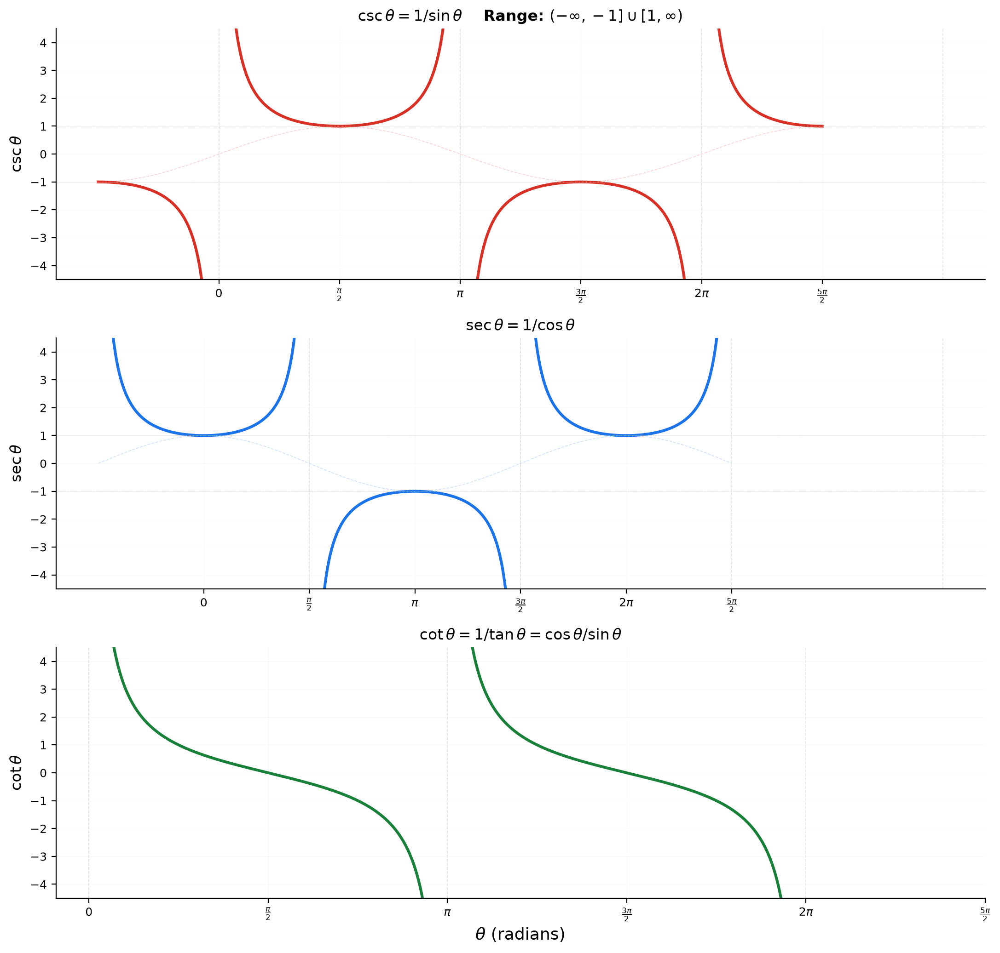

> **Geometric insight on the unit circle**: Draw the tangent line at $(0,1)$ (horizontal). The ray extended hits it at $(\cot\theta, 1)$. Draw the tangent line at $(1,0)$ (vertical). The ray hits it at $(1, \tan\theta)$. Draw the tangent at the point itself — the $x$-intercept of that tangent line relates to $\csc\theta$ and $\sec\theta$. All six functions come from the same diagram.

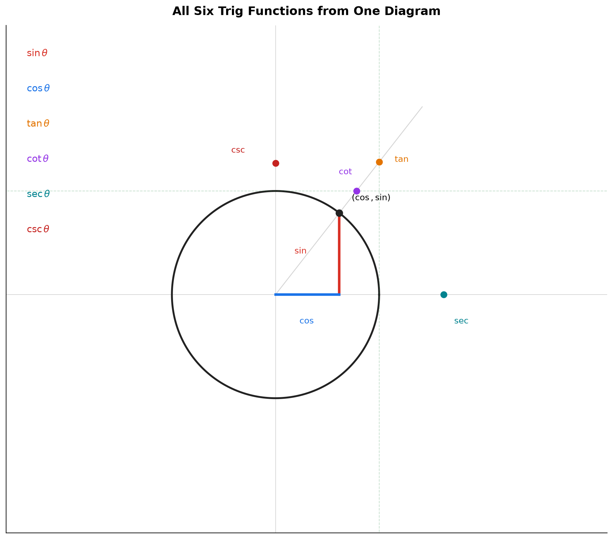

**Method — Sketching csc, sec, cot from their reciprocals in 3 steps:**

(1) **Lightly sketch the reciprocal function first.** For $\csc\theta$, sketch $\sin\theta$. For $\sec\theta$, sketch $\cos\theta$. For $\cot\theta$, sketch $\tan\theta$.

(2) **Draw dashed vertical lines where the reciprocal crosses zero.** These are the asymptotes. $\csc$: at $\theta = n\pi$ (where $\sin=0$). $\sec$: at $\theta = \frac{\pi}{2}+n\pi$ (where $\cos=0$). $\cot$: at $\theta = n\pi$ (where $\\sin=0$).

(3) **Flip the values: where the reciprocal is at its peak ($\pm 1$), the function touches $\pm 1$. Where the reciprocal is near $0$, the function shoots toward $\pm\infty$.** Draw U-shaped branches between asymptotes. For $\csc$ and $\sec$, the branches always stay outside the strip $(-1,1)$. For $\cot$, the curve falls from $+\infty$ to $-\infty$ crossing the $\theta$-axis once per period.

*Walkthrough — sketch $\csc\theta$ on $[0, 2\pi]$:* Light-draw $\sin\theta$ (starts 0, peaks at $\pi/2$, back to 0 at $\pi$, dips to $-1$ at $3\pi/2$, back to 0 at $2\pi$). Asymptotes at $0, \pi, 2\pi$. At $\pi/2$ ($\sin=1$): $\csc=1$. At $3\pi/2$ ($\sin=-1$): $\csc=-1$. Branches: $(0,\pi)$ opens upward from $+\infty$ to $1$ to $+\infty$. $(\pi,2\pi)$ opens downward from $-\infty$ to $-1$ to $-\infty$.

> **Up to here**: $\sin$ and $\cos$ are the $y$ and $x$ of a point on the unit circle. $\tan$ is the slope. $\csc$, $\sec$, $\cot$ are their reciprocals. Each has a characteristic graph with period and asymptotes (except $\sin$ and $\cos$, which have no asymptotes).

---

## Example 9: Transforming the Graphs — Stretch, Shift, Compress

Given $y = A\sin(B\theta - C) + D$ (and same form for $\cos$):

- **$|A|$ = amplitude**: the wave reaches $|A|$ above and below the midline. If $A < 0$, the wave flips vertically.
- **$|B|$ = frequency factor**: period = $\frac{2\pi}{|B|}$. $B=2$ squeezes the wave (period = $\pi$). $B=\frac{1}{2}$ stretches it (period = $4\pi$).
- **$\frac{C}{B}$ = phase shift**: horizontal shift. Positive = shift right.
- **$D$ = vertical shift**: the midline moves to $y = D$.

**Example — build $y = 2\sin(3\theta - \frac{\pi}{2}) + 1$ step by step:**

(1) Start with $y = \sin\theta$. Period $2\pi$, amplitude 1, midline $y=0$.

(2) $y = 2\sin\theta$. Amplitude becomes 2. Wave stretches vertically from $-2$ to $2$.

(3) $y = 2\sin(3\theta)$. $B=3$. Period = $\frac{2\pi}{3}$. Wave compresses horizontally — three full waves in $[0, 2\pi]$.

(4) $y = 2\sin(3\theta - \frac{\pi}{2})$. Phase shift = $\frac{\pi/2}{3} = \frac{\pi}{6}$ to the right.

(5) $y = 2\sin(3\theta - \frac{\pi}{2}) + 1$. Shift everything up by 1. Midline is now $y=1$. Range: $[-1, 3]$.

**For $\tan$**: $y = A\tan(B\theta - C) + D$. Period = $\frac{\pi}{|B|}$. Asymptotes shift with the phase shift. No "amplitude" (wave is unbounded), but $|A|$ controls vertical stretch.

**Example — build $y = \frac{1}{2}\tan(2\theta + \frac{\pi}{4}) - 1$ step by step:**

(1) Start with $y = \tan\theta$. Period $\pi$, asymptotes at $\frac{\pi}{2} + n\pi$, crosses $0$ at $n\pi$.

(2) $y = \tan(2\theta)$. $B=2$. Period = $\frac{\pi}{2}$. Asymptotes at $\frac{\pi}{4} + n\frac{\pi}{2}$. Compresses horizontally.

(3) $y = \tan(2\theta + \frac{\pi}{4})$. Rewrite: $y = \tan(2(\theta + \frac{\pi}{8}))$. Phase shift = $-\frac{\pi}{8}$ (left). All asymptotes and zero-crossings shift left by $\frac{\pi}{8}$.

(4) $y = \frac{1}{2}\tan(2\theta + \frac{\pi}{4})$. Vertical compression by factor $\frac{1}{2}$. The S-curve is half as tall at every point.

(5) $y = \frac{1}{2}\tan(2\theta + \frac{\pi}{4}) - 1$. Shift down by 1. Midline (the "center" of the S) moves from $y=0$ to $y=-1$. Zero-crossings become crossings at $y=-1$.

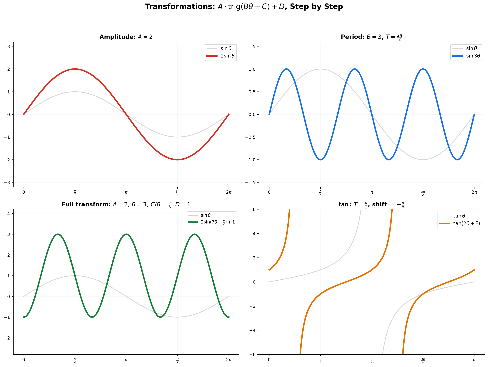

> **Geometric insight**: $A$ stretches the circle's radius vertically. $B$ changes how fast the point spins around the circle. $C$ changes where you start. $D$ raises or lowers the center of the circle.

---

## Part C: Inverse Trigonometric Functions — Flipping the Question

---

## Example 10: $\arcsin x$ — "What Angle Gives This Sine?"

$\sin\theta = x$ → $\theta = \arcsin x$ (also written $\sin^{-1}x$, but this is NOT $\frac{1}{\sin x}$).

**The problem**: $\sin\theta$ is not one-to-one. $\sin 0 = 0$, $\sin\pi = 0$, $\sin 2\pi = 0$. To define an inverse, we must **restrict the domain**.

For $\arcsin$, restrict $\sin$ to $[-\frac{\pi}{2}, \frac{\pi}{2}]$. On this interval, sine rises strictly from $-1$ to $1$ — every value appears exactly once.

**Domain of $\arcsin$**: $[-1, 1]$. **Range of $\arcsin$**: $[-\frac{\pi}{2}, \frac{\pi}{2}]$.

$\arcsin 0 = 0$. $\arcsin\frac{1}{2} = \frac{\pi}{6}$. $\arcsin 1 = \frac{\pi}{2}$. $\arcsin(-1) = -\frac{\pi}{2}$.
$\arcsin\frac{\sqrt{2}}{2} = \frac{\pi}{4}$. $\arcsin(-\frac{\sqrt{3}}{2}) = -\frac{\pi}{3}$.

**Graph**: Take the graph of $y = \sin\theta$ on $[-\frac{\pi}{2}, \frac{\pi}{2}]$, flip it across the line $y = x$. The result is a curve that rises from $(-1, -\frac{\pi}{2})$ to $(1, \frac{\pi}{2})$, steepest at the ends, flattest at the origin.

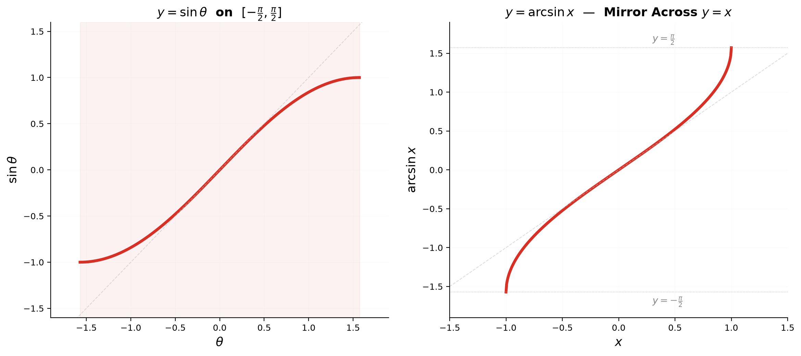

> **Geometric insight**: $\arcsin x$ answers "at what angle (between $-\frac{\pi}{2}$ and $\frac{\pi}{2}$) is the $y$-coordinate on the unit circle equal to $x$?" The restriction to $[-\frac{\pi}{2}, \frac{\pi}{2}]$ picks the *right half* of the unit circle — where every horizontal line hits the circle exactly once.

---

## Example 11: $\arccos x$ — "What Angle Gives This Cosine?"

For $\arccos$, restrict $\cos$ to $[0, \pi]$. On this interval, cosine falls strictly from $1$ to $-1$.

**Domain of $\arccos$**: $[-1, 1]$. **Range of $\arccos$**: $[0, \pi]$.

$\arccos 1 = 0$. $\arccos\frac{1}{2} = \frac{\pi}{3}$. $\arccos 0 = \frac{\pi}{2}$. $\arccos(-1) = \pi$.
$\arccos\frac{\sqrt{2}}{2} = \frac{\pi}{4}$. $\arccos(-\frac{\sqrt{3}}{2}) = \frac{5\pi}{6}$.

**Graph**: Flip $y = \cos\theta$ on $[0, \pi]$ across $y = x$. Falls from $(-1, \pi)$ to $(1, 0)$. Steepest at the ends, flattest at the middle.

**Key relationship**: $\arcsin x + \arccos x = \frac{\pi}{2}$ for all $x \in [-1, 1]$. The two angles are complementary.

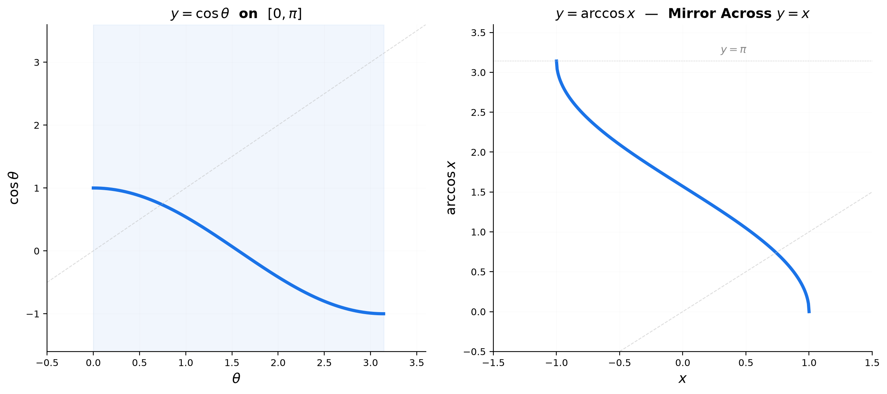

> **Geometric insight**: $\arccos x$ answers "at what angle (between $0$ and $\pi$) is the $x$-coordinate on the unit circle equal to $x$?" The restriction to $[0, \pi]$ picks the *top half* of the unit circle.

---

## Example 12: $\arctan x$ — "What Angle Gives This Slope?"

For $\arctan$, restrict $\tan$ to $(-\frac{\pi}{2}, \frac{\pi}{2})$. On this interval, $\tan$ rises from $-\infty$ to $+\infty$, hitting every real number exactly once.

**Domain of $\arctan$**: all real numbers. **Range of $\arctan$**: $(-\frac{\pi}{2}, \frac{\pi}{2})$.

$\arctan 0 = 0$. $\arctan 1 = \frac{\pi}{4}$. $\arctan\sqrt{3} = \frac{\pi}{3}$. $\arctan(-1) = -\frac{\pi}{4}$.
As $x \to \infty$, $\arctan x \to \frac{\pi}{2}$ (but never reaches it). As $x \to -\infty$, $\arctan x \to -\frac{\pi}{2}$.

**Graph**: S-shaped curve with horizontal asymptotes at $y = \frac{\pi}{2}$ and $y = -\frac{\pi}{2}$. Passes through $(0,0)$. Steepest at the origin, flattening toward the asymptotes.

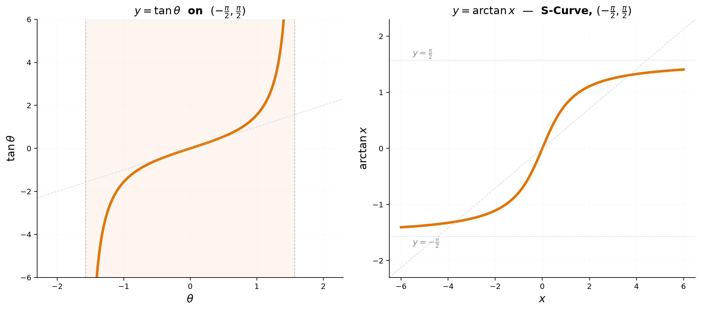

> **Geometric insight**: $\arctan x$ answers "at what angle (between $-\frac{\pi}{2}$ and $\frac{\pi}{2}$) does the ray have slope $x$?" The restriction to $(-\frac{\pi}{2}, \frac{\pi}{2})$ picks the *right half* of the unit circle, excluding the vertical position where slope is undefined.

---

## Example 13: Composing Trig and Inverse Trig — Watch the Domains!

**$\arcsin(\sin\theta)$**: Only equals $\theta$ if $\theta \in [-\frac{\pi}{2}, \frac{\pi}{2}]$.

$\arcsin(\sin\frac{\pi}{6}) = \arcsin(\frac{1}{2}) = \frac{\pi}{6}$. Fine — $\frac{\pi}{6}$ is in range.
$\arcsin(\sin\frac{5\pi}{6})$: $\sin\frac{5\pi}{6} = \frac{1}{2}$. $\arcsin(\frac{1}{2}) = \frac{\pi}{6}$. **Not $\frac{5\pi}{6}$!**
Why: $\frac{5\pi}{6}$ is outside $\arcsin$'s range. The answer is the angle in $[-\frac{\pi}{2}, \frac{\pi}{2}]$ with the same sine — which is $\frac{\pi}{6}$.

$\arcsin(\sin\frac{7\pi}{6})$: $\sin\frac{7\pi}{6} = -\frac{1}{2}$. $\arcsin(-\frac{1}{2}) = -\frac{\pi}{6}$. (Not $\frac{7\pi}{6}$.)

**$\sin(\arcsin x)$**: Always equals $x$, for all $x \in [-1, 1]$. The outer $\sin$ undoes the inner $\arcsin$.

$\sin(\arcsin\frac{3}{5}) = \frac{3}{5}$. $\sin(\arcsin(-0.7)) = -0.7$.

**Method — Composing inverse-then-trig (right-triangle method), 3 steps:**

Given something like $\cos(\arcsin x)$ or $\tan(\arccos x)$, you are answering: "Take the angle whose sine is $x$. What is its cosine?"

(1) **Draw a right triangle.** Label the angle as $\theta$. Write the given ratio on two sides. For $\arcsin x$: opposite = $x$, hypotenuse = $1$. For $\arccos x$: adjacent = $x$, hypotenuse = $1$. For $\arctan x$: opposite = $x$, adjacent = $1$.

(2) **Find the missing side with Pythagoras.** $a^2 + b^2 = c^2$. For $\arcsin x$: adjacent = $\sqrt{1 - x^2}$ (positive, since $-\frac{\pi}{2} \leq \theta \leq \frac{\pi}{2}$ guarantees cos $\geq 0$).

(3) **Read the target trig function from the triangle.** $\cos\theta$ = adjacent/hypotenuse. $\tan\theta$ = opposite/adjacent. $\sin\theta$ = opposite/hypotenuse.

**Walkthrough 1 — $\cos(\arcsin\frac{3}{5})$:** (1) Triangle: opposite = 3, hypotenuse = 5. (2) Adjacent = $\sqrt{25-9} = 4$. (3) $\cos\theta = \frac{4}{5}$.

**Walkthrough 2 — $\tan(\arccos(-\frac{5}{13}))$:** (1) Triangle: adjacent = $-5$ (QII angle), hypotenuse = 13. (2) Opposite = $\sqrt{169-25} = 12$. Since $\theta \in [0,\pi]$ and $\cos\theta = -\frac{5}{13}$, $\theta$ is in QII → $\sin\theta > 0$, so opposite = $+12$. (3) $\tan\theta = \frac{12}{-5} = -\frac{12}{5}$.

**Walkthrough 3 — $\sin(\arctan\frac{3}{4})$:** (1) Triangle: opposite = 3, adjacent = 4. (2) Hypotenuse = $\sqrt{9+16} = 5$. (3) $\sin\theta = \frac{3}{5}$.

**Walkthrough 4 — $\cos(\arcsin x)$ as a formula:** (1) Triangle: opposite = $x$, hypotenuse = 1. (2) Adjacent = $\sqrt{1 - x^2}$. (3) $\cos\theta = \frac{\sqrt{1 - x^2}}{1} = \sqrt{1 - x^2}$.

**Walkthrough 5 — $\tan(\arcsin x)$ as a formula:** (1) Triangle: opposite = $x$, hypotenuse = 1. (2) Adjacent = $\sqrt{1 - x^2}$. (3) $\tan\theta = \frac{x}{\sqrt{1 - x^2}}$.

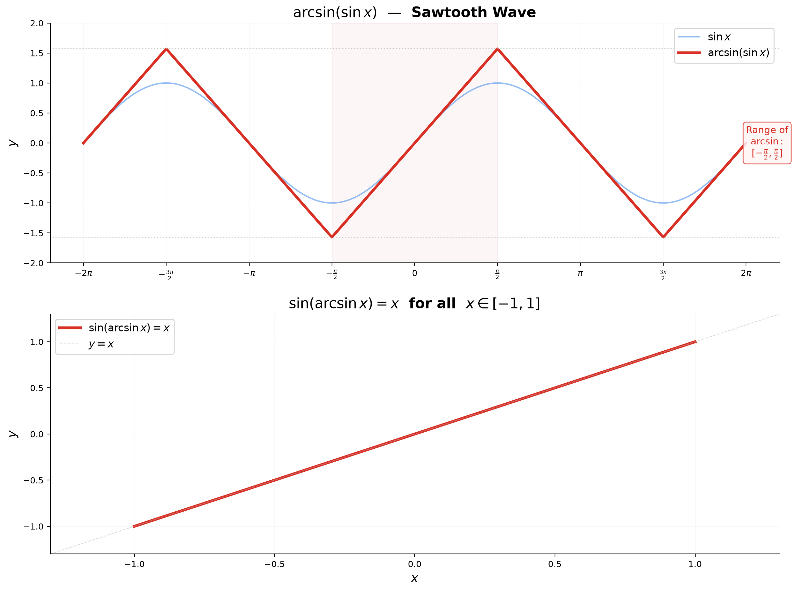

> **Geometric insight**: $\arcsin(\sin\theta)$ produces a "sawtooth" wave — it bounces $\theta$ back into $[-\frac{\pi}{2}, \frac{\pi}{2}]$. Think of folding the number line like an accordion into that interval. $\sin(\arcsin x)$ is just the identity on $[-1,1]$. $\cos(\arcsin x)$ draws a right triangle and uses Pythagoras.

> **Up to here**: $\arcsin$, $\arccos$, $\arctan$ are inverses with restricted domains. Their graphs are mirrors of the original across $y=x$. Composition requires checking whether the angle is in the restricted range; if not, find the equivalent angle that is.

**Method — Sketching arcsin, arccos, arctan in 3 steps:**

(1) **Draw the original function on its restricted (principal) branch.** $\sin$ on $[-\frac{\pi}{2}, \frac{\pi}{2}]$: rises from $-1$ to $1$. $\cos$ on $[0, \pi]$: falls from $1$ to $-1$. $\tan$ on $(-\frac{\pi}{2}, \frac{\pi}{2})$: rises from $-\infty$ to $+\infty$, crossing $0$.

(2) **Draw the line $y=x$ (the mirror).** For each key point $(a,b)$ on the original, plot the reflected point $(b,a)$.
$\sin$: $(-\frac{\pi}{2},-1) \to (-1,-\frac{\pi}{2})$, $(0,0)\to(0,0)$, $(\frac{\pi}{2},1)\to(1,\frac{\pi}{2})$.
$\cos$: $(0,1)\to(1,0)$, $(\frac{\pi}{2},0)\to(0,\frac{\pi}{2})$, $(\pi,-1)\to(-1,\pi)$.
$\tan$: horizontal asymptotes of $\tan$ become vertical bounds for $\arctan$: $y \to \pm\frac{\pi}{2}$.

(3) **Connect the reflected points with the characteristic shape.** $\arcsin$: steep at ends, flat at center. $\arccos$: steep at ends, flat at center (falling). $\arctan$: S-curve, steepest at origin, flattening toward $\pm\frac{\pi}{2}$.

*Walkthrough — sketch $\arccos x$:* Start with $\cos\theta$ on $[0,\pi]$. Key points: $(0,1)$, $(\frac{\pi}{3},\frac{1}{2})$, $(\frac{\pi}{2},0)$, $(\frac{2\pi}{3},-\frac{1}{2})$, $(\pi,-1)$. Reflect across $y=x$: $(1,0)$, $(\frac{1}{2},\frac{\pi}{3})$, $(0,\frac{\pi}{2})$, $(-\frac{1}{2},\frac{2\pi}{3})$, $(-1,\pi)$. Connect smoothly falling from left to right.

---

## Decision Tree — Evaluating Trig at Any Angle

```
You need sin θ, cos θ, tan θ for an angle θ:
├── (1) Is θ one of the 5 special angles in QI? (0, π/6, π/4, π/3, π/2)
│   └── Read exact value from the table. Done.
├── (2) Find the reference angle α — the acute angle to the x-axis.
│   └── If θ > 2π, subtract 2π repeatedly until θ ∈ [0, 2π).
│   └── If θ < 0, add 2π repeatedly until θ ∈ [0, 2π).
│   └── QI (0<θ<π/2): α = θ
│   └── QII (π/2<θ<π): α = π − θ
│   └── QIII (π<θ<3π/2): α = θ − π
│   └── QIV (3π/2<θ<2π): α = 2π − θ
├── (3) sin θ = ±sin α, cos θ = ±cos α. Sign from ASTC quadrant.
└── (4) tan θ = sin θ / cos θ.
```

---

## Decision Tree — Graphing a Trig Function

```
Given y = A·trig(B(θ − C)) + D:
├── (1) Identify the parent function (sin, cos, tan, csc, sec, cot).
│   └── Draw its basic shape with period and key points.
├── (2) Apply vertical stretch |A| and flip if A < 0.
│   └── sin/cos: amplitude = |A|. tan/cot/sec/csc: vertical stretch only.
├── (3) Apply horizontal stretch/compression — period = (base period)/|B|.
│   └── sin/cos/csc/sec: base = 2π. tan/cot: base = π.
├── (4) Apply horizontal shift C (right if positive).
├── (5) Apply vertical shift D (up if positive).
├── (6) Draw asymptotes for tan/cot/sec/csc:
│   └── tan: θ = C + (π/2|B|) + n·(π/|B|)
│   └── cot: θ = C + n·(π/|B|)
│   └── sec: θ = C + (π/2|B|) + n·(2π/|B|)
│   └── csc: θ = C + n·(2π/|B|)
└── (7) Plot 5 key points per period and connect smoothly.
```

---

## Common Mistakes

### Mistake 1: Confusing $\sin^{-1}x$ with $(\sin x)^{-1} = \csc x$

**Wrong path**: Seeing $\sin^{-1}x$ and thinking it means $\frac{1}{\sin x}$.

**Why wrong**: $\sin^{-1}x$ is the *inverse function* (arcsine), not the reciprocal. This is an unfortunate notation collision. $\sin^2 x$ means $(\sin x)^2$, but $\sin^{-1} x$ does NOT mean $(\sin x)^{-1}$.

**Right path**: $\sin^{-1}x = \arcsin x$ (the angle whose sine is $x$). $\frac{1}{\sin x} = \csc x$ (the reciprocal). When in doubt, use $\arcsin$ notation to avoid confusion.

---

### Mistake 2: Forgetting that $\arcsin$ output is restricted to $[-\frac{\pi}{2}, \frac{\pi}{2}]$

**Wrong path**: "$\arcsin(\sin\frac{3\pi}{4}) = \frac{3\pi}{4}$."

**Why wrong**: $\frac{3\pi}{4}$ is not in $[-\frac{\pi}{2}, \frac{\pi}{2}]$. $\arcsin$ can only output angles in this range.

**Right path**: $\sin\frac{3\pi}{4} = \frac{\sqrt{2}}{2}$. $\arcsin\frac{\sqrt{2}}{2} = \frac{\pi}{4}$. The correct answer is $\frac{\pi}{4}$.

---

### Mistake 3: Using degrees in calculus formulas

**Wrong path**: "$\frac{d}{dx}\sin x^\circ = \cos x^\circ$."

**Why wrong**: The derivative formula $\frac{d}{dx}\sin x = \cos x$ is only true when $x$ is in radians. With degrees, you get an extra factor of $\frac{\pi}{180^\circ}$.

**Right path**: Always convert to radians before doing calculus. $\frac{d}{dx}\sin x = \cos x$ (radians only).

---

### Mistake 4: Mixing up period of $\tan$ with $\sin$/$\cos$

**Wrong path**: "$\tan\theta$ has period $2\pi$."

**Why wrong**: $\tan\theta = \tan(\theta + \pi)$, not $\tan(\theta + 2\pi)$. The slope repeats after a half-turn.

**Right path**: $\tan\theta$ and $\cot\theta$ have period $\pi$. $\sin\theta$, $\cos\theta$, $\sec\theta$, $\csc\theta$ have period $2\pi$.

---

### Mistake 5: Drawing $\csc\theta$ and $\sec\theta$ graphs with values between $-1$ and $1$

**Wrong path**: Drawing $\csc\theta$ that dips to 0 between asymptotes.

**Why wrong**: $\csc\theta = \frac{1}{\sin\theta}$. Since $|\sin\theta| \leq 1$, $|\csc\theta| \geq 1$. It can never be between $-1$ and $1$.

**Right path**: $\csc\theta$ and $\sec\theta$ live entirely in $(-\infty, -1] \cup [1, \infty)$. Their graphs never cross the strip between $y=-1$ and $y=1$.

---

## What We Just Did

```
(1) Radians — defined by arc length: s = rθ. 360° = 2π rad. Convert: multiply by π/180°
    or 180°/π. Method: (i) pick direction, (ii) multiply + reduce fraction, (iii) wrap into
    [0, 2π) if needed. Radians are the natural unit; calculus only works in radians.

(2) Unit circle — cos θ = x-coordinate, sin θ = y-coordinate of a point on x²+y²=1.
    Special angles (π/6, π/4, π/3, π/2) have exact radical coordinates.
    Method for any angle: (i) normalize to [0, 2π), (ii) find reference angle α,
    (iii) read sin α/cos α from table, apply ASTC sign. tan = sin/cos.

(3) Six functions — sin and cos are waves of period 2π, amplitude 1.
    tan = sin/cos, period π, vertical asymptotes where cos=0.
    csc = 1/sin, sec = 1/cos, cot = 1/tan — each has asymptotes where the denominator is 0.
    Method for csc/sec/cot graphs: (i) lightly sketch the reciprocal, (ii) draw asymptotes
    where reciprocal=0, (iii) flip values (large↔small). Branches never enter (-1,1).

(4) Graph transformations — A = vertical stretch, B = frequency factor (period = base/|B|),
    C/B = phase shift, D = vertical shift. Method (5 steps): parent → A → B → C → D.
    Applied to both sin/cos and tan with their respective base periods.

(5) Inverse functions — arcsin: [-1,1] → [-π/2, π/2]. arccos: [-1,1] → [0, π].
    arctan: ℝ → (-π/2, π/2). Method for sketching: (i) draw original on restricted branch,
    (ii) reflect key points across y=x, (iii) connect with characteristic shape.

(6) Composition — arcsin(sin θ) = θ only if θ ∈ [-π/2, π/2]; otherwise fold it in.
    sin(arcsin x) = x always (for x ∈ [-1,1]).
    Method for cos(arcsin x) etc.: (i) draw right triangle, label given ratio on two sides,
    (ii) find missing side with Pythagoras, (iii) read target function from triangle sides.
```

---

## Practice 1

Convert: (a) $150^\circ$ to radians. (b) $\frac{7\pi}{6}$ to degrees. (c) $-45^\circ$ to radians.

→ Reference: **Example 2**

> Solutions: [Solutions](solutions/11A-solutions.md#practice-1)

---

## Practice 2

Find the exact values without a calculator:
(a) $\sin\frac{5\pi}{3}$ (b) $\cos\frac{3\pi}{4}$ (c) $\tan\frac{7\pi}{6}$ (d) $\sec\frac{5\pi}{4}$

→ Reference: **Example 4, 5, 7, 8**

> Solutions: [Solutions](solutions/11A-solutions.md#practice-2)

---

## Practice 3

Sketch the graph of $y = -3\cos(2\theta + \frac{\pi}{3}) - 1$. Label: amplitude, period, phase shift, midline, and the five key points of one period.

→ Reference: **Example 9**

> Solutions: [Solutions](solutions/11A-solutions.md#practice-3)

---

## Practice 4

Evaluate: (a) $\arcsin(-\frac{\sqrt{3}}{2})$ (b) $\arccos(-\frac{\sqrt{2}}{2})$ (c) $\arctan(-\sqrt{3})$

→ Reference: **Example 10, 11, 12**

> Solutions: [Solutions](solutions/11A-solutions.md#practice-4)

---

## Practice 5: Composition

Find the exact value of $\sin(\arccos\frac{5}{13} + \arcsin\frac{4}{5})$. Draw right triangles for each inverse trig expression.

→ Reference: **Example 13**

> Solutions: [Solutions](solutions/11A-solutions.md#practice-5)

---

## Practice 6

Simplify: (a) $\cos(\arctan x)$ as an algebraic expression in $x$. (b) $\tan(\arcsin\frac{x}{\sqrt{x^2+1}})$.

→ Reference: **Example 13**

> Solutions: [Solutions](solutions/11A-solutions.md#practice-6)

---

## Practice 7

Identify the domain restrictions for: (a) $\arcsin(2x-1)$ (b) $\arccos(\frac{x}{x+1})$. Give your answer in interval notation.

→ Reference: **Example 10, 11**

> Solutions: [Solutions](solutions/11A-solutions.md#practice-7)

---

## Practice 8: Composition — Build the Graph

Draw the graph of $y = \arcsin(\sin x)$ for $x \in [-2\pi, 2\pi]$. Explain the sawtooth pattern. Then draw $y = \sin(\arcsin x)$ on its natural domain.

→ Reference: **Example 13**

> Solutions: [Solutions](solutions/11A-solutions.md#practice-8)

---

## Practice 9: Real Battle — From Circle to Graph to Inverse

A point $P$ moves counterclockwise on the unit circle, starting at $(1,0)$ at $t=0$, completing one revolution every $4\pi$ seconds.

(a) Write the $y$-coordinate of $P$ as a function of time: $y(t) = \sin(Bt)$. Find $B$.

(b) Write the $x$-coordinate as $x(t) = \cos(Bt)$.

(c) At what times $t \in [0, 4\pi]$ does the point cross the line $y = \frac{1}{2}$? Give exact answers.

(d) What is the slope of the ray at $t = \frac{\pi}{3}$?

(e) At what angle (in radians) does the ray have slope $2$? Give your answer using $\arctan$.

→ Reference: **Example 3, 4, 6, 7, 10**

> Solutions: [Solutions](solutions/11A-solutions.md#practice-9)

---

## Practice 10: Real Battle — Graph All Six

On the same set of axes $[0, 2\pi]$, sketch $\sin\theta$, $\cos\theta$, and $\tan\theta$. Use three different colors. Mark all asymptotes for $\tan\theta$. Then on a separate set of axes, sketch $\csc\theta$, $\sec\theta$, and $\cot\theta$.

→ Reference: **Example 6, 7, 8**

> Solutions: [Solutions](solutions/11A-solutions.md#practice-10)

---

## Basic Drills

> Pure fluency. Build instant recall of special angles and values.

**D1.** Convert $210^\circ$ to radians. Write as a fraction of $\pi$.

**D2.** Convert $\frac{11\pi}{6}$ to degrees.

**D3.** What is the reference angle for $\frac{5\pi}{4}$?

**D4.** $\sin\frac{2\pi}{3} = ?$ (exact value)

**D5.** $\cos\frac{5\pi}{6} = ?$ (exact value)

**D6.** $\tan\frac{4\pi}{3} = ?$ (exact value)

**D7.** $\sec\frac{\pi}{3} = ?$ (exact value)

**D8.** $\csc\frac{7\pi}{6} = ?$ (exact value)

**D9.** $\cot\frac{3\pi}{4} = ?$ (exact value)

**D10.** $\arcsin(\sin\frac{7\pi}{4}) = ?$

> Solutions: [Solutions](solutions/11A-solutions.md#basic-drill)

---

## Advanced Drills

> Multi-step. Each problem chains 2–3 skills from 11A. Covers graph transformations, inverse evaluation, and composition.

**A1.** Graph $y = 2\csc(\theta - \frac{\pi}{4})$ on $[0, 2\pi]$. Label all asymptotes and the coordinates of all local minima and maxima.

**A2.** Graph $y = -2\sin(\frac{1}{2}\theta + \frac{\pi}{3})$ on $[-2\pi, 4\pi]$. Identify amplitude, period, phase shift, and midline. Mark all $x$-intercepts.

**A3.** Graph $y = 3\tan(\frac{\theta}{2} - \frac{\pi}{6})$ on $[-\pi, 3\pi]$. Draw all asymptotes. Mark where the curve crosses the midline.

**A4.** Evaluate $\sin(\arccos\frac{12}{13}) + \cos(\arcsin\frac{3}{5})$ without a calculator. (Hint: draw two right triangles.)

**A5.** Simplify $\sec(\arctan x)$ as an algebraic expression in $x$. Use the right-triangle method.

**A6.** Find the exact value of $\arcsin(\cos\frac{5\pi}{6})$. (Hint: convert cos to sin first.)

**A7.** Given $\arcsin x = \arccos 2x$ for $x > 0$, find $x$ exactly. (Hint: take sine of both sides.)

**A8.** A point $P$ on the unit circle has coordinates $(\frac{5}{13}, -\frac{12}{13})$. (a) What is $\sin\theta$ and $\cos\theta$? (b) In which quadrant is $\theta$? (c) Find $\tan\theta$, $\csc\theta$, $\sec\theta$, $\cot\theta$. (d) What is the reference angle? (e) Write $\theta$ as an inverse trig expression.

**A9.** The function $f(\theta) = 4\sin(3\theta - \frac{\pi}{2}) + 2$ models the height of a Ferris wheel car (in meters, $\theta$ in minutes). (a) What is the maximum height? (b) At what $\theta \in [0, 2\pi]$ does it first reach the maximum? (c) What is the period, and what does it mean physically? (d) Sketch one full period with labels.

**A10.** Find all $x \in [-1, 1]$ such that $\arcsin x = \arccos x$. Then solve $\arctan x = \arccos x$ for $x > 0$. Give exact answers.

> Solutions: [Solutions](solutions/11A-solutions.md#advanced-drill)

---

## Today's Procedure

```
Step 1: Angle conversion — degrees→rad: multiply by π/180°, reduce fraction, wrap into [0,2π).
         rad→degrees: multiply by 180°/π. Radians = arc length / radius = natural angle unit.

Step 2: Any trig value — normalize angle to [0,2π). Find reference angle α by quadrant.
         Read sin α, cos α from the √n/2 table. Apply ASTC sign. tan = sin/cos.
         csc = 1/sin. sec = 1/cos. cot = 1/tan.

Step 3: Graph sin/cos/tan — identify parent. Apply A (vertical), B (period = base/|B|),
         C (phase shift = C/B), D (vertical shift) in sequence. Plot 5 key points per period.
         For tan: base period = π, draw asymptotes at θ = C/B + π/(2|B|) + n·π/|B|.

Step 4: Graph csc/sec/cot — lightly sketch the reciprocal (sin/cos/tan). Draw asymptotes
         where reciprocal = 0. Flip values: where reciprocal = ±1, function = ±1.
         Where reciprocal → 0, function → ±∞. csc/sec never enter (-1, 1).

Step 5: Inverse trig — arcsin(x) ∈ [-π/2, π/2], arccos(x) ∈ [0, π], arctan(x) ∈ (-π/2, π/2).
         To sketch: restrict original to principal branch, reflect across y=x, connect.
         To evaluate arcsin(sin θ): if θ outside range, find equivalent angle inside range.

Step 6: Composition via right triangle — for cos(arcsin x), tan(arccos x), etc.:
         (i) Draw triangle, label the given ratio on two sides.
         (ii) Find the missing side with a² + b² = c².
         (iii) Read the target function from the three sides.
```

---

## How to Read These Symbols

| Symbol | Reads as | Meaning |
|:---:|:---:|------|
| $\pi$ | "pi" | ratio of circumference to diameter ≈ 3.14159; $\pi$ rad = 180° |
| $\theta$ | "theta" | a variable representing an angle (in radians by default) |
| $\sin\theta$ | "sine theta" | $y$-coordinate of the point on the unit circle at angle $\theta$ |
| $\cos\theta$ | "cosine theta" | $x$-coordinate of the point on the unit circle at angle $\theta$ |
| $\tan\theta$ | "tangent theta" | $\sin\theta / \cos\theta$; slope of the ray at angle $\theta$ |
| $\csc\theta$ | "cosecant theta" | $1 / \sin\theta$; reciprocal of sine |
| $\sec\theta$ | "secant theta" | $1 / \cos\theta$; reciprocal of cosine |
| $\cot\theta$ | "cotangent theta" | $1 / \tan\theta = \cos\theta / \sin\theta$; reciprocal of tangent |
| $\arcsin x$ | "arcsine of x" | the angle in $[-\frac{\pi}{2}, \frac{\pi}{2}]$ whose sine is $x$ |
| $\arccos x$ | "arccosine of x" | the angle in $[0, \pi]$ whose cosine is $x$ |
| $\arctan x$ | "arctangent of x" | the angle in $(-\frac{\pi}{2}, \frac{\pi}{2})$ whose tangent is $x$ |
| ASTC | "All Students Take Calculus" | memory aid: All positive in QI, Sine in QII, Tangent in QIII, Cosine in QIV |
| reference angle | "reference angle" | acute angle between the terminal ray and the $x$-axis |
| period | "period" | horizontal length of one full cycle before the graph repeats |
| amplitude | "amplitude" | half the distance between maximum and minimum (for sin/cos only) |
| asymptote | "asymptote" | a vertical line the graph approaches but never crosses |

---

## Terminology

Up to now we used plain words like "height on the circle", "slope of the ray", "flip across the line $y=x$".
**You have already learned all the methods.** Now we attach the formal mathematical names.

| What we called it | Mathematical term | Notation |
|:-----------------:|:-----------------:|:--------:|
| arc-length angle | radian | rad (dimensionless; $2\pi$ rad = 360°) |
| circle of radius 1 | unit circle | $x^2 + y^2 = 1$ |
| $x$-coordinate on unit circle | cosine | $\cos\theta$ |
| $y$-coordinate on unit circle | sine | $\sin\theta$ |
| height ÷ horizontal | tangent | $\tan\theta = \frac{\sin\theta}{\cos\theta}$ |
| 1 ÷ sine | cosecant | $\csc\theta = \frac{1}{\sin\theta}$ |
| 1 ÷ cosine | secant | $\sec\theta = \frac{1}{\cos\theta}$ |
| 1 ÷ tangent | cotangent | $\cot\theta = \frac{1}{\tan\theta}$ |
| acute angle to $x$-axis | reference angle | $\alpha$ (alpha) |
| wave height | amplitude | $\lvert A \rvert$ in $y = A\sin(B\theta - C) + D$ |
| horizontal cycle length | period | $\frac{2\pi}{\lvert B \rvert}$ for sin/cos; $\frac{\pi}{\lvert B \rvert}$ for tan/cot |
| horizontal shift | phase shift | $\frac{C}{B}$ in $y = A\sin(B\theta - C) + D$ |
| middle line | midline / vertical shift | $D$ in $y = A\sin(B\theta - C) + D$ |
| inverse of sine | arcsine / inverse sine | $\arcsin x$ or $\sin^{-1}x$ |
| inverse of cosine | arccosine / inverse cosine | $\arccos x$ or $\cos^{-1}x$ |
| inverse of tangent | arctangent / inverse tangent | $\arctan x$ or $\tan^{-1}x$ |
| restricted domain for inverse | principal branch | $[-\frac{\pi}{2}, \frac{\pi}{2}]$ for arcsin; $[0, \pi]$ for arccos; $(-\frac{\pi}{2}, \frac{\pi}{2})$ for arctan |

---

> **Next:** [11B — Trigonometric Identities, Equations, and Beyond](11B-trig-advanced.md) — where you learn to split and merge angles, solve trig equations, prove identities, and discover deep connections through Euler's formula.
