# Session 11B: Trigonometric Identities, Equations, and Beyond

**Phase 2 — Classical Techniques | 105 min**

*Prerequisite: [11A — Trigonometric Foundations](11A-trig-foundations.md) (radians, unit circle, six trig functions, graphs, inverse trig)*

*This session assumes you can: convert degrees ↔ radians, read sin/cos/tan/csc/sec/cot from the unit circle, sketch all six graphs with transformations, and evaluate arcsin/arccos/arctan. If any of this is shaky, review 11A first.*

---

## Part A: Trigonometric Identities — Your Algebraic Arsenal

---

## Example 1: Sum and Difference Formulas — Splitting and Merging Angles

$\sin(A+B) = \sin A\cos B + \cos A\sin B$.
$\sin(A-B) = \sin A\cos B - \cos A\sin B$.
$\cos(A+B) = \cos A\cos B - \sin A\sin B$.
$\cos(A-B) = \cos A\cos B + \sin A\sin B$.
$\tan(A \pm B) = \frac{\tan A \pm \tan B}{1 \mp \tan A \tan B}$.

$\sin 75^\circ = \sin(45^\circ+30^\circ) = \frac{\sqrt{2}}{2}\cdot\frac{\sqrt{3}}{2} + \frac{\sqrt{2}}{2}\cdot\frac{1}{2} = \frac{\sqrt{6}+\sqrt{2}}{4}$.

$\cos 15^\circ = \cos(45^\circ-30^\circ) = \frac{\sqrt{2}}{2}\cdot\frac{\sqrt{3}}{2} + \frac{\sqrt{2}}{2}\cdot\frac{1}{2} = \frac{\sqrt{6}+\sqrt{2}}{4}$.

$\tan 75^\circ = \frac{\tan 45^\circ + \tan 30^\circ}{1 - \tan 45^\circ\tan 30^\circ} = \frac{1 + 1/\sqrt{3}}{1 - 1/\sqrt{3}} = 2+\sqrt{3}$.

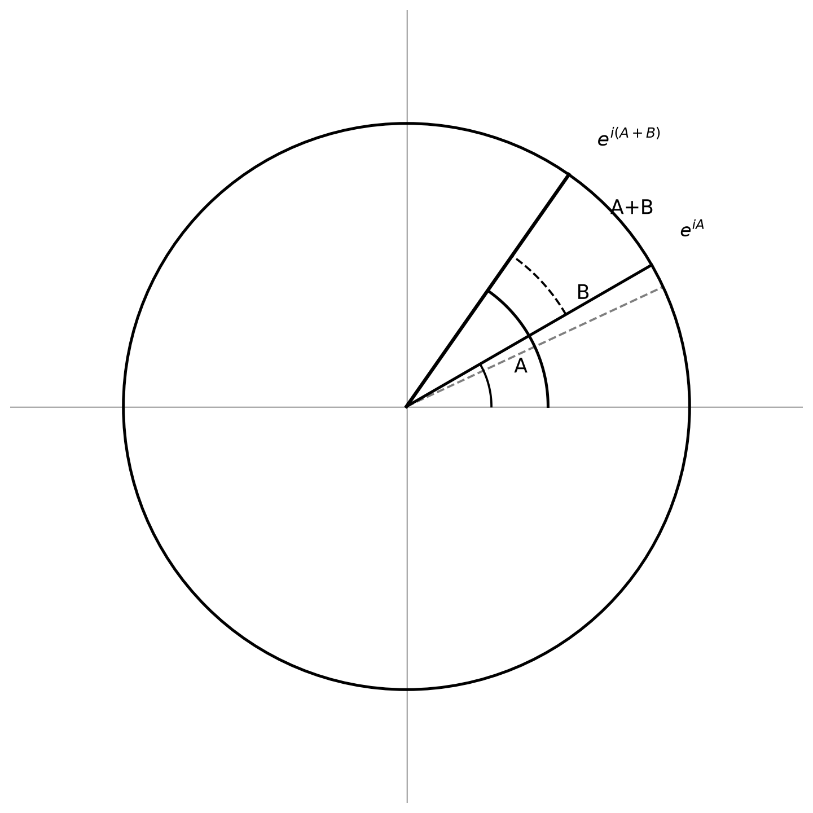

> **Geometric insight**: $e^{i(A+B)} = e^{iA}e^{iB}$ — adding angles = multiplying complex numbers on the unit circle. Expand $(\cos A + i\sin A)(\cos B + i\sin B)$ and match real/imaginary parts to get all four sum formulas at once.

---

## Example 2: Double-Angle, Half-Angle, and Triple-Angle Formulas

$\sin 2\theta = 2\sin\theta\cos\theta$.
$\cos 2\theta = \cos^2\theta - \sin^2\theta = 2\cos^2\theta - 1 = 1 - 2\sin^2\theta$.
$\tan 2\theta = \frac{2\tan\theta}{1-\tan^2\theta}$.

Half-angle: $\sin^2\frac{\theta}{2} = \frac{1-\cos\theta}{2}$, $\cos^2\frac{\theta}{2} = \frac{1+\cos\theta}{2}$.

**Triple-angle**:
$\sin 3\theta = 3\sin\theta - 4\sin^3\theta$.
$\cos 3\theta = 4\cos^3\theta - 3\cos\theta$.
$\tan 3\theta = \frac{3\tan\theta - \tan^3\theta}{1 - 3\tan^2\theta}$.

---

## Example 3: Harmonic Addition — Turning $a\sin x + b\cos x$ into One Wave

$3\sin x + 4\cos x$.

(1) $R = \sqrt{a^2+b^2} = \sqrt{9+16} = 5$.
(2) $\cos\phi = \frac{a}{R} = \frac{3}{5}$, $\sin\phi = \frac{b}{R} = \frac{4}{5}$. $\phi = \arcsin\frac{4}{5} \approx 53.13^\circ$.
(3) $3\sin x + 4\cos x = 5\sin(x + \phi)$.

$\sqrt{3}\sin x - \cos x = 2\sin(x - \frac{\pi}{6})$. $\sin x + \cos x = \sqrt{2}\sin(x + \frac{\pi}{4})$.

**General form**: $a\sin x \pm b\cos x = R\sin(x \pm \phi)$, $a\cos x \pm b\sin x = R\cos(x \mp \phi)$.

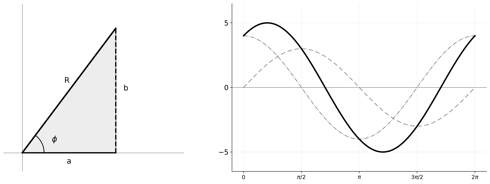

> **Geometric insight**: The coefficients $(a, b)$ form a right triangle. The hypotenuse $R = \sqrt{a^2+b^2}$ is the amplitude, angle $\phi$ is the phase shift. Left: phasor triangle. Right: two component waves merge into one shifted sine wave.

---

## Example 4: Product-to-Sum and Sum-to-Product

$\sin A\cos B = \frac{1}{2}[\sin(A+B) + \sin(A-B)]$.
$\cos A\cos B = \frac{1}{2}[\cos(A+B) + \cos(A-B)]$.
$\sin A\sin B = \frac{1}{2}[\cos(A-B) - \cos(A+B)]$.

$\sin A + \sin B = 2\sin\frac{A+B}{2}\cos\frac{A-B}{2}$.
$\sin A - \sin B = 2\cos\frac{A+B}{2}\sin\frac{A-B}{2}$.
$\cos A + \cos B = 2\cos\frac{A+B}{2}\cos\frac{A-B}{2}$.
$\cos A - \cos B = -2\sin\frac{A+B}{2}\sin\frac{A-B}{2}$.

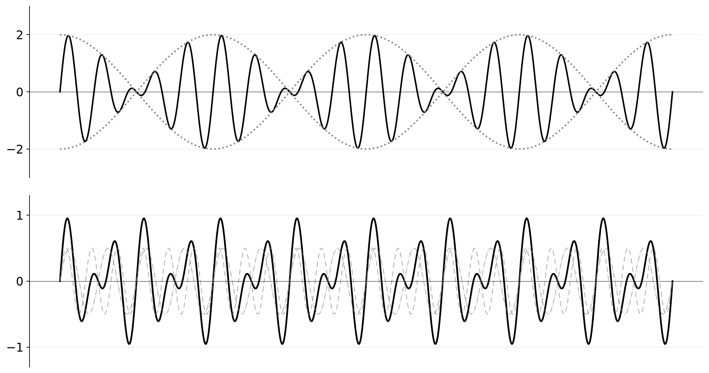

> **Geometric insight**: Top — two close frequencies sum to a "beat" pattern (envelope: $2\cos(\frac{A-B}{2}x)$). Bottom — $\sin A\cos B$ decomposes into two sine waves at $A+B$ and $A-B$.

> **Up to here**: Sum/difference, double/half/triple angle, harmonic addition, product↔sum.
> These identities are your tools for simplifying, solving, and proving.

---

## Part B: Trigonometric Equations and Triangles

---

## Example 5: Trigonometric Equations — Base Solution + $n \times$ Period

$\sin x = \frac{1}{2}$ → $x = \frac{\pi}{6} + 2n\pi$ or $\frac{5\pi}{6} + 2n\pi$.

$2\cos^2 x - \cos x - 1 = 0$.
(1) $t = \cos x$: $2t^2 - t - 1 = 0$ → $(2t+1)(t-1)=0$.
(2) $\cos x = 1$ → $x = 2n\pi$. $\cos x = -\frac{1}{2}$ → $x = \frac{2\pi}{3} + 2n\pi$ or $\frac{4\pi}{3} + 2n\pi$.

$\sin 2x = \cos x$.
(1) $2\sin x\cos x - \cos x = 0$ → $\cos x(2\sin x - 1) = 0$.
(2) $\cos x = 0$ → $x = \frac{\pi}{2} + n\pi$. $\sin x = \frac{1}{2}$ → $x = \frac{\pi}{6} + 2n\pi$ or $\frac{5\pi}{6} + 2n\pi$.

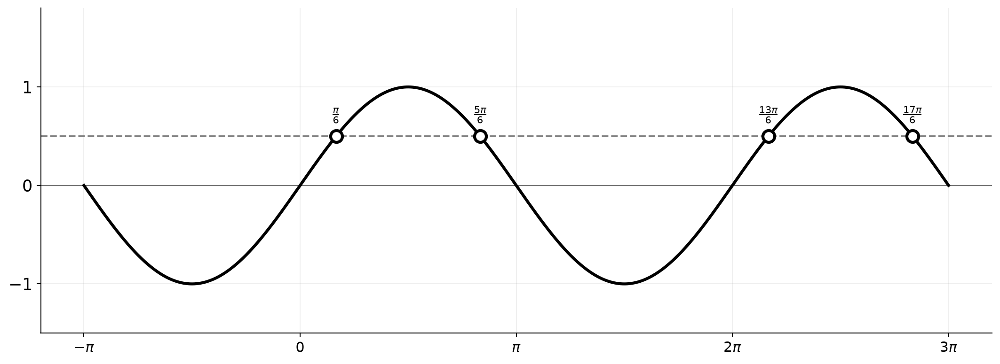

> **Geometric insight**: $\sin x = \frac{1}{2}$ means finding where the sine wave meets $y = \frac{1}{2}$. Intersections repeat every $2\pi$, two per period.

---

## Example 6: Law of Sines

$\frac{a}{\sin A} = \frac{b}{\sin B} = \frac{c}{\sin C} = 2R$.

Use when given two angles and one side (AAS/ASA).
$a=10$, $A=30^\circ$, $B=45^\circ$ → $b = a\frac{\sin B}{\sin A} = 10\frac{\sin45^\circ}{\sin30^\circ} = 10\sqrt{2}$.

**Warning**: Two sides and a non-included angle (SSA) may have 2 solutions (ambiguous case).
$a=5$, $b=8$, $A=30^\circ$ → $\sin B = \frac{8\sin30^\circ}{5} = 0.8$ → $B \approx 53.1^\circ$ or $126.9^\circ$.

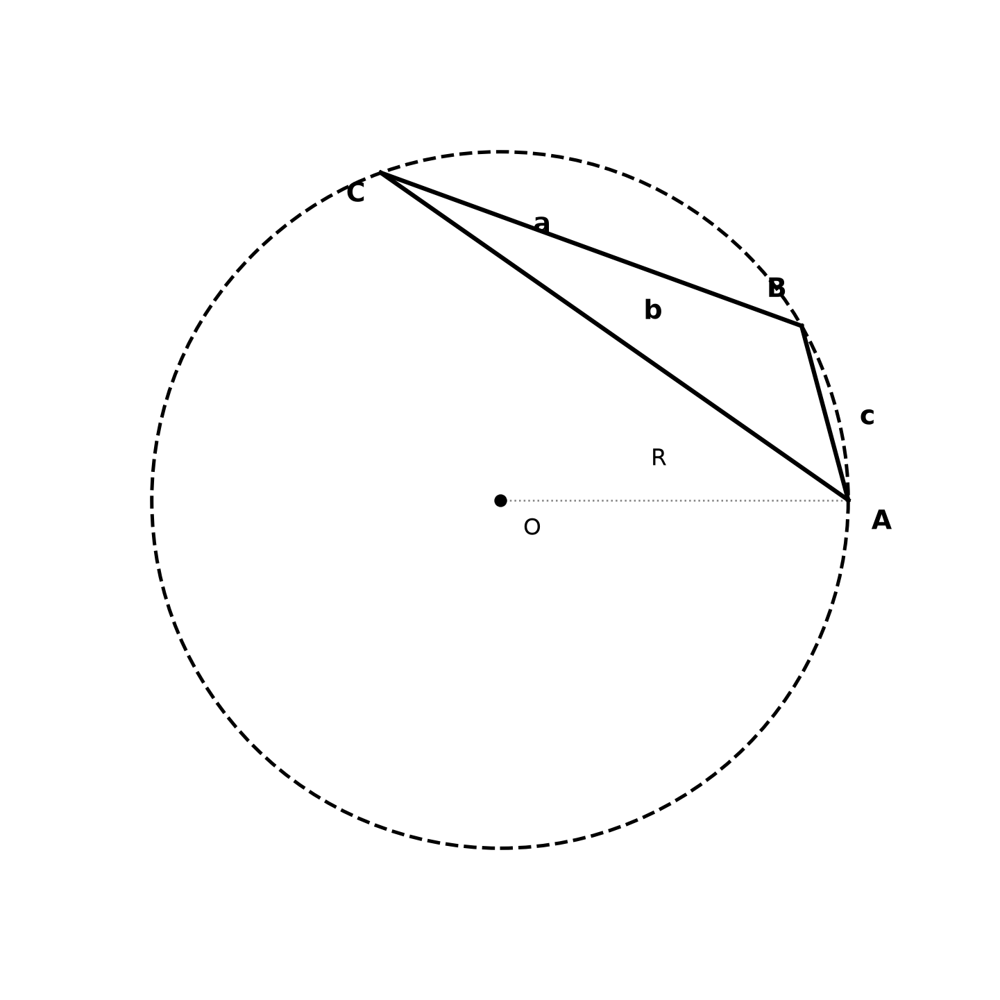

> **Geometric insight**: Every triangle fits in a unique circumcircle. Each side is proportional to the sine of its opposite angle — constant of proportionality = $2R$ (the diameter). Longest side faces largest angle.

---

## Example 7: Law of Cosines

$a^2 = b^2 + c^2 - 2bc\cos A$.

Two sides + included angle (SAS) → third side. Three sides (SSS) → any angle.

$b=5$, $c=7$, $A=60^\circ$ → $a^2 = 25+49-2\cdot5\cdot7\cdot\frac{1}{2} = 39$ → $a=\sqrt{39}$.

Triangle 3,4,5 → $\cos A = \frac{4^2+5^2-3^2}{2\cdot4\cdot5} = \frac{4}{5}$. $A \approx 36.87^\circ$.

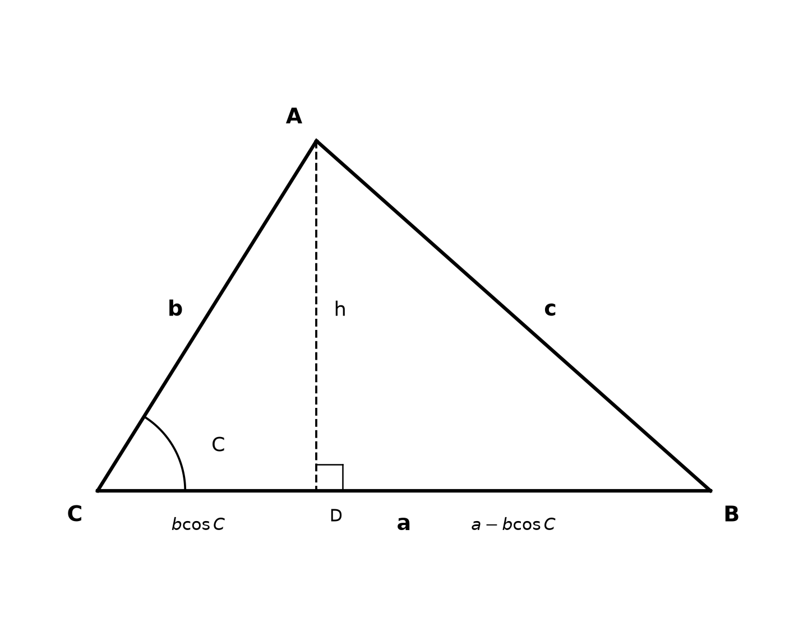

> **Geometric insight**: Drop altitude $h$ from A to side $a$. Base splits into $b\cos C$ and $a - b\cos C$. Pythagorean theorem on the right triangle with hypotenuse $c$: $c^2 = h^2 + (a - b\cos C)^2 = b^2\sin^2 C + a^2 - 2ab\cos C + b^2\cos^2 C = a^2 + b^2 - 2ab\cos C$.

---

## Example 8: Triangle Area — Three Ways

**Two sides + included angle**: $\text{Area} = \frac{1}{2}ab\sin C$.
$a=5$, $b=8$, $C=30^\circ$ → $\frac{1}{2}\cdot5\cdot8\cdot\sin30^\circ = 10$.

**Heron's formula** (three sides): $s = \frac{a+b+c}{2}$, Area = $\sqrt{s(s-a)(s-b)(s-c)}$.
3,4,5 → $s=6$. $\sqrt{6\cdot3\cdot2\cdot1} = 6$.

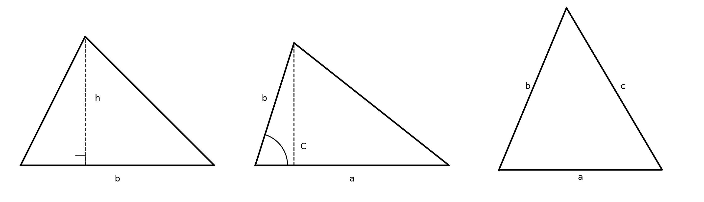

> **Geometric insight**: (1) base $\times$ height. (2) height = $b\sin C$, same triangle, different inputs. (3) Heron needs only side lengths — no angles.

---

## Example 9: Inverse Trigonometric Functions — The Bridge Back to Angles

> **From 11A**: You already know $\arcsin$, $\arccos$, $\arctan$ — their restricted domains, ranges, and graphs. Here we focus on *using* them in equations and identities.

$\arcsin\frac{1}{2} = \frac{\pi}{6}$. $\arccos\frac{1}{2} = \frac{\pi}{3}$. $\arctan 1 = \frac{\pi}{4}$.

**The domain trap**: $\arcsin(\sin\frac{5\pi}{6})$: $\sin\frac{5\pi}{6} = \frac{1}{2}$. $\arcsin\frac{1}{2} = \frac{\pi}{6}$.
$\frac{5\pi}{6}$ lies outside $\arcsin$'s range; the answer is the value in $[-\frac{\pi}{2}, \frac{\pi}{2}]$ with the same sine.

**Inverse trig in equations** — these appear when the unknown is an angle:

$2\arcsin x = \arccos x$. Take cosine of both sides:
$\cos(2\arcsin x) = \cos(\arccos x) = x$.
Let $\theta = \arcsin x$, so $\sin\theta = x$, $\cos\theta = \sqrt{1-x^2}$ (since $\theta \in [-\frac{\pi}{2}, \frac{\pi}{2}]$).
$\cos 2\theta = 1 - 2\sin^2\theta = 1 - 2x^2$. So $1 - 2x^2 = x$ → $2x^2 + x - 1 = 0$ → $x = \frac{1}{2}$ or $x = -1$.
Check: $x=\frac{1}{2}$ → $2\arcsin\frac{1}{2} = \frac{\pi}{3}$, $\arccos\frac{1}{2} = \frac{\pi}{3}$. ✓
$x=-1$ → $2\arcsin(-1) = -\pi$. But $\arccos(-1) = \pi$. Not equal. Discard.

$\arctan x + \arctan\frac{1}{x} = \frac{\pi}{2}$ (for $x > 0$). The two angles are complementary.

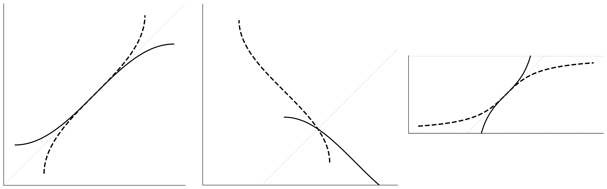

> **Geometric insight**: Inverse trig equations often reduce to algebraic equations after applying a trig function to both sides. The key extra step: checking that the solution falls within each inverse function's range.

---

## Part C: Advanced Techniques — Beyond the Textbook

---

## Example 10: Euler's Formula — The Deepest Bridge in Mathematics

$e^{i\theta} = \cos\theta + i\sin\theta$.

From this single equation, **every trig identity** follows algebraically:

**Deriving $\cos 2\theta$** via cubing:
$e^{i2\theta} = (e^{i\theta})^2 = (\cos\theta + i\sin\theta)^2 = (\cos^2\theta - \sin^2\theta) + i(2\sin\theta\cos\theta)$.
Equating real and imaginary parts: $\cos 2\theta = \cos^2\theta - \sin^2\theta$, $\sin 2\theta = 2\sin\theta\cos\theta$.

**De Moivre**: $(\cos\theta + i\sin\theta)^n = \cos(n\theta) + i\sin(n\theta)$.

**Roots of unity**: $z^n = 1$ → $z_k = e^{2\pi i k/n} = \cos\frac{2\pi k}{n} + i\sin\frac{2\pi k}{n}$, $k=0,1,\dots,n-1$.

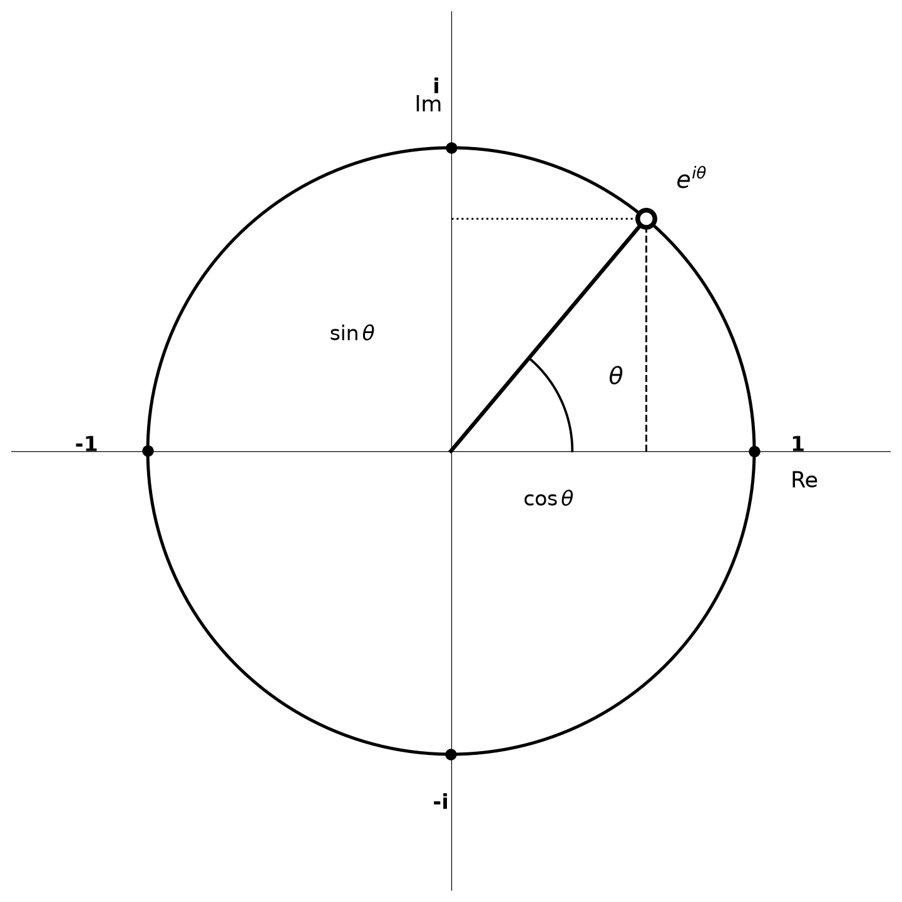

> **Geometric insight**: $e^{i\theta}$ rotates a point on the unit circle by $\theta$. Real part = $\cos\theta$, imaginary = $\sin\theta$. De Moivre: $(e^{i\theta})^n = e^{in\theta}$ = rotate $n$ times.

---

## Example 11: Chebyshev Polynomials — Trig as Polynomials

$T_n(\cos\theta) = \cos(n\theta)$. $T_0(x)=1$, $T_1(x)=x$, $T_2(x)=2x^2-1$, $T_3(x)=4x^3-3x$, $T_4(x)=8x^4-8x^2+1$.

![Chebyshev polynomials T₁ through T₄ on [-1, 1]](graphs/11b9-chebyshev-polynomials.png)

> **Geometric insight**: On $[-1, 1]$, Chebyshev polynomials oscillate between $-1$ and $1$ with $n+1$ equally spaced extrema. Defined by $T_n(\cos\theta) = \cos(n\theta)$ — cosines disguised as polynomials.

To solve $\cos 3\theta = \frac{1}{2}$, let $x = \cos\theta$. Then $4x^3 - 3x = \frac{1}{2}$ → $8x^3 - 6x - 1 = 0$.
The roots are $\cos\frac{\pi}{9}, \cos\frac{7\pi}{9}, \cos\frac{13\pi}{9}$.

---

## Example 12: The Cubic Equation via Trigonometry (Casus Irreducibilis)

For $x^3 + px + q = 0$ with three real roots, set $x = 2\sqrt{-\frac{p}{3}}\cos\theta$ where $\cos 3\theta = \frac{3q}{2p}\sqrt{-\frac{3}{p}}$.

**Example**: $x^3 - 3x - 1 = 0$. $p=-3$, $q=-1$. $2\sqrt{1} = 2$.
$\cos 3\theta = \frac{1}{2}$. Roots: $2\cos\frac{\pi}{9}$, $2\cos\frac{7\pi}{9}$, $2\cos\frac{13\pi}{9}$.

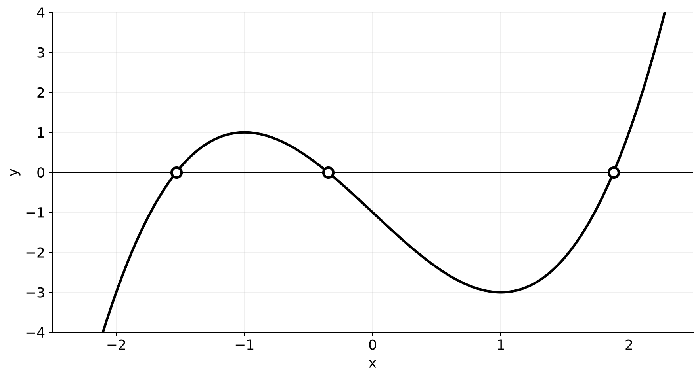

> **Geometric insight**: When a cubic has three real roots (casus irreducibilis), real radicals don't suffice — you need trig. Substituting $x = 2\sqrt{-p/3}\cos\theta$ turns $x^3+px+q=0$ into $\cos 3\theta = c$. Three roots = three angles solving $\cos 3\theta = c$ in $[0, \pi]$.

---

## Example 13: Morrie's Law and Angle Product Magic

**Morrie's Law**: $\cos 20^\circ \cdot \cos 40^\circ \cdot \cos 80^\circ = \frac{1}{8}$.

Proof: multiply and divide by $\sin 20^\circ$, apply $\sin 2\theta = 2\sin\theta\cos\theta$ repeatedly. Everything cancels except $\frac{1}{8}$.

Generalization: $\prod_{k=1}^{n} \cos(\frac{\theta}{2^k}) = \frac{\sin\theta}{2^n \sin(\theta/2^n)}$.

Also: $\cos\frac{\pi}{7} \cos\frac{2\pi}{7} \cos\frac{3\pi}{7} = \frac{1}{8}$. $\sin 10^\circ \sin 50^\circ \sin 70^\circ = \frac{1}{8}$.

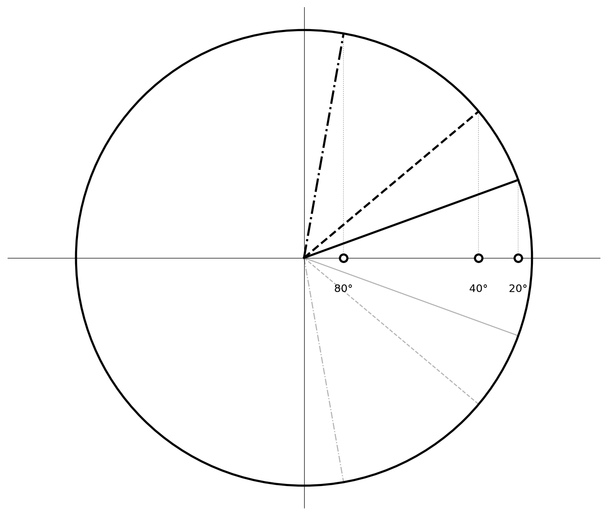

> **Geometric insight**: Each cosine = $x$-coordinate on unit circle at that angle. Proof: multiply by $\sin 20^\circ/\sin 20^\circ$, apply $\sin 2\theta = 2\sin\theta\cos\theta$ — product telescopes to $\frac{1}{8}$.

---

## Example 14: Tangent Half-Angle Substitution (Weierstrass)

$t = \tan\frac{\theta}{2}$ turns any rational trig expression into a rational function:
$\sin\theta = \frac{2t}{1+t^2}$, $\cos\theta = \frac{1-t^2}{1+t^2}$, $\tan\theta = \frac{2t}{1-t^2}$.

**Solving $\sin\theta + \cos\theta = 1$**: Substitute → $2t+1-t^2 = 1+t^2$ → $t=0$ or $t=1$.
→ $\theta = 0$ or $\theta = \frac{\pi}{2}$ (plus multiples of $2\pi$).

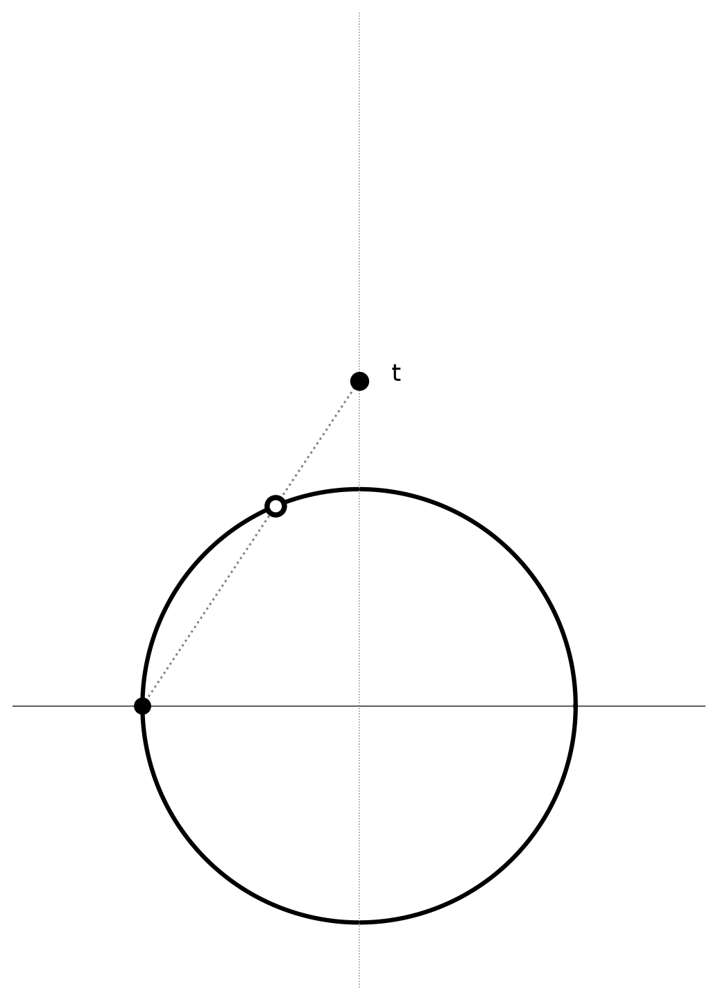

> **Geometric insight**: $t = \tan(\theta/2)$ is where the line from $(-1,0)$ through $(\cos\theta,\sin\theta)$ hits the $y$-axis — stereographic projection. Rational $t$ $\leftrightarrow$ rational point on circle. This is why $t$-substitution turns trig integrals into rational ones.

---

## Example 15: Sine of $18^\circ$ and $36^\circ$ — The Golden Ratio

$\sin 18^\circ = \frac{\sqrt{5}-1}{4} \approx 0.3090$. $\cos 36^\circ = \frac{\sqrt{5}+1}{4} = \frac{\phi}{2} \approx 0.8090$.

From the regular pentagon, the diagonal-to-side ratio is $\phi = \frac{1+\sqrt{5}}{2}$. Every integer degree from $3^\circ$ to $90^\circ$ has an exact radical expression via chaining $15^\circ$, $18^\circ$, and $36^\circ$ values.

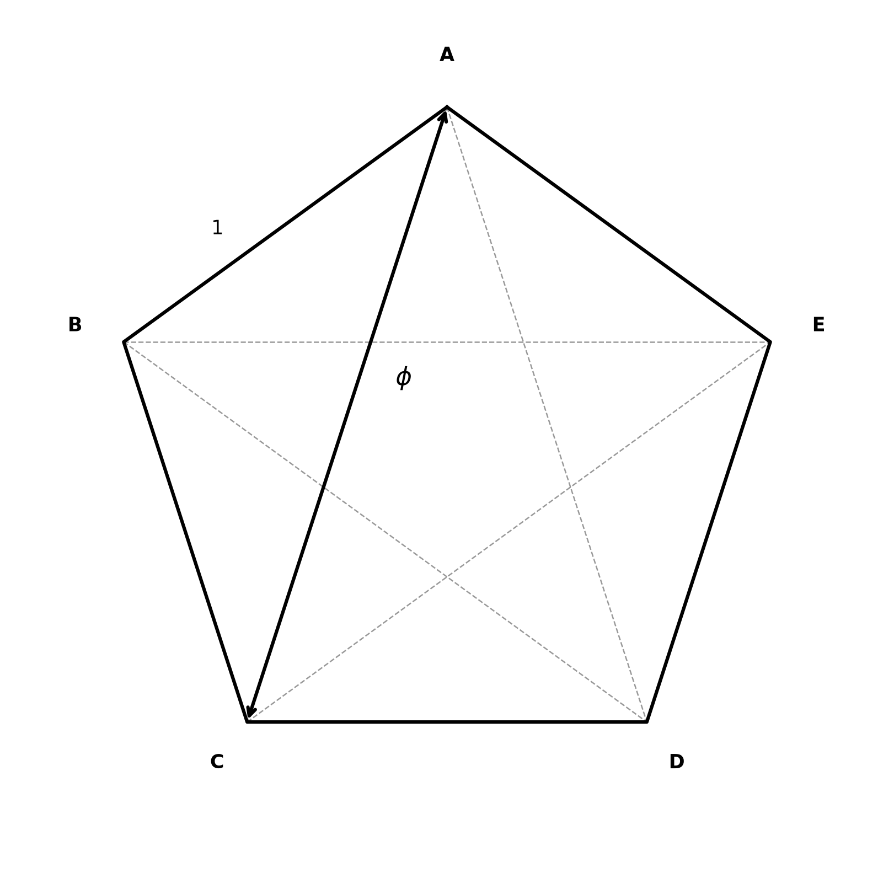

> **Geometric insight**: In a regular pentagon, diagonal/side = $\phi = \frac{1+\sqrt{5}}{2}$. From this geometry: $\sin 18^\circ = \frac{\sqrt{5}-1}{4}$, $\cos 36^\circ = \frac{\phi}{2}$. Chain with $15^\circ$ values to get exact radicals for any multiple of $3^\circ$.

---

## Example 16: Polar Curves — Roses, Cardioids, and More

- **Rose curves**: $r = \cos(k\theta)$. $k$ odd → $k$ petals; $k$ even → $2k$ petals.
- **Cardioid**: $r = 1 + \cos\theta$ (heart-shaped).
- **Limacon**: $r = a + b\cos\theta$ (inner loop when $|a| < |b|$).
- **Lemniscate**: $r^2 = \cos 2\theta$ (figure-eight).

Parametric conversion: $x = r(\theta)\cos\theta$, $y = r(\theta)\sin\theta$.

---

## Visual Interlude: Trigonometry in 3D and Beyond

**Spherical coordinates** — polar coordinates extended to 3D. A point is $(r, \theta, \phi)$:
$x = r\sin\phi\cos\theta$, $y = r\sin\phi\sin\theta$, $z = r\cos\phi$.

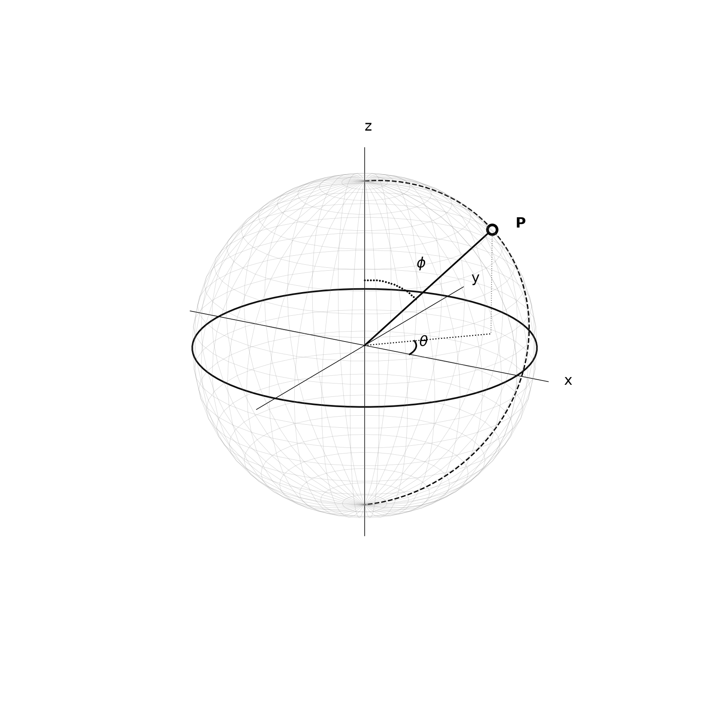

The unit sphere ($r=1$) is parametrized by sine and cosine alone. $\phi$ is the polar angle from the $z$-axis; $\theta$ is the azimuthal angle in the $xy$-plane.

**Hyperspheres in $n$ dimensions** — the volume of an $n$-dimensional ball of radius $R$:
$V_n(R) = \frac{\pi^{n/2}}{\Gamma(n/2 + 1)} R^n$.

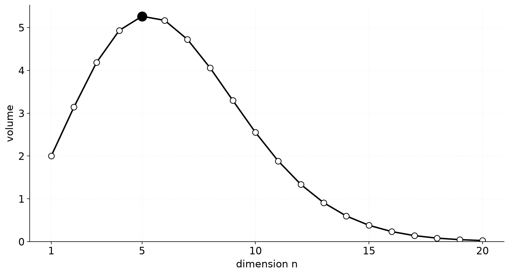

The surface area involves $\int \sin^{n-2}\phi\,d\phi$ — trig generalizes to every dimension. Spherical harmonics $Y_\ell^m(\theta,\phi)$, the higher-dimensional cousins of $\sin(k\theta)$ and $\cos(k\theta)$, power quantum mechanics, geophysics, and computer graphics.

---

## Decision Tree — Trig Equations

```
You encounter a trigonometric equation:
├── (1) Only one type of trig function?
│   └── Substitute t = sin x (or cos x). t ∈ [-1, 1]. Solve polynomial.
├── (2) Different angles? (2x vs x)
│   └── Use double/triple/half-angle to unify all angles.
├── (3) sin and cos mixed?
│   ├── sin = cos → divide by cos (check cos ≠ 0).
│   ├── a sin + b cos = c → harmonic addition: R sin(x+φ) = c.
│   └── Product = 0 → set each factor = 0.
├── (4) Rational in sin/cos?
│   └── Tangent half-angle: t = tan(x/2).
├── (5) Restricted domain?
│   └── Find general solution, pick n so answer falls in range.
└── (6) Inequality?
    └── Use unit circle or graph. Find intervals, apply period.
```

---

## Decision Tree — Trig Inequalities

```
You encounter a trigonometric inequality:
├── (1) sin x > k or cos x > k form?
│   └── Use unit circle. Mark the angular interval above/below height k. Apply period.
├── (2) Quadratic form? (2 sin²x − sin x − 1 < 0)
│   └── t-substitution → t-range → sin x range → x intervals.
└── (3) Product > 0 or < 0?
    └── Sign chart. Find zeros of each factor. Partition intervals.
```

---

## Common Mistakes

### Mistake 1: $\cos(A+B) = \cos A + \cos B$

**Wrong path**: "$\cos(A+B) = \cos A + \cos B$."

**Why wrong**: Cosine does not distribute over addition.

**Right path**: $\cos(A+B) = \cos A\cos B - \sin A\sin B$. You must multiply, not add.

---

### Mistake 2: Dividing by $\cos x$ without checking $\cos x = 0$

**Wrong path**: "$\sin x = \cos x$ → divide by $\cos x$ → $\tan x = 1$."

**Why wrong**: If $\cos x = 0$, the division is illegal. Solutions where $\cos x = 0$ might be lost.

**Right path**: Check $\cos x = 0$ first. For $\sin x = \cos x$, $\cos x = 0$ gives no solution. Then divide safely.

---

### Mistake 3: Mismatching side and opposite angle in Law of Sines

**Wrong path**: Writing $\frac{a}{\sin B}$.

**Why wrong**: Side $a$ sits opposite angle $A$. Each side pairs with its own opposite angle.

**Right path**: $\frac{a}{\sin A} = \frac{b}{\sin B} = \frac{c}{\sin C}$. Match the letters.

---

## What We Just Did

```
Building on 11A (radians, unit circle, six graphs, inverse trig):

(1) Identity toolkit — sum/difference (6 formulas). Double/half/triple angle.
    Harmonic addition merges a sin+b cos into one wave. Product↔sum converts
    multiplication to addition and vice versa.

(2) Equation solving — one trig type → t-sub. Mixed angles → unify via double-angle.
    Mixed sin+cos → factor or harmonic-add. Rational trig → tan half-angle.
    Inverse trig equations → apply trig to both sides, check ranges.
    Triangles: SAS→law of cosines, AAS→law of sines. Area = ½ab sin C or Heron.

(3) Advanced — Euler's formula unifies all identities. Chebyshev polynomials encode
    cos(nθ). Cubic equations solved via trig. Morrie's Law and product gems.
    Golden ratio hides in sin 18°. Spherical coordinates extend trig to 3D.
    Hypersphere volumes use trig in n dimensions.
```

---

## Practice 1

Solve $\cos 2x = \sin x$ on $[0, 2\pi]$. Use $\cos 2x = 1 - 2\sin^2 x$.

→ Reference: **Example 2, 5**

> Solutions: [Solutions](solutions/11B-solutions.md#practice-1)

---

## Practice 2: Composition

Write $5\sin x + 12\cos x$ as $R\sin(x+\phi)$. Find the maximum value and the $x$ at which it occurs.

→ Reference: **Example 3**

> Solutions: [Solutions](solutions/11B-solutions.md#practice-2)

---

## Practice 3

Triangle with $a=7$, $b=10$, $c=13$. Find all three angles and the area.

→ Reference: **Example 7, 8**

> Solutions: [Solutions](solutions/11B-solutions.md#practice-3)

---

## Practice 4: Real Battle

$\sec x + \tan x = 2$. Find $\sec x - \tan x$ and $\sin x$.
Use $(\sec x + \tan x)(\sec x - \tan x) = 1$.

→ Reference: **Pythagorean identity**

> Solutions: [Solutions](solutions/11B-solutions.md#practice-4)

---

## Practice 5

Solve $\sin 3x = \cos x$ on $[0, 2\pi]$.
Hint: $\sin 3x = \cos x = \sin(\frac{\pi}{2} - x)$.

→ Reference: **Example 1, 5**

> Solutions: [Solutions](solutions/11B-solutions.md#practice-5)

---

## Practice 6: Composition

Using Euler's formula $e^{i\theta} = \cos\theta + i\sin\theta$, derive formulas for $\sin 3\theta$ and $\cos 3\theta$ by cubing $e^{i\theta}$.

→ Reference: **Example 10**

> Solutions: [Solutions](solutions/11B-solutions.md#practice-6)

---

## Practice 7

Solve $x^3 - 3x + 1 = 0$ using the trigonometric method. Identify the three real roots as $2\cos\alpha$, $2\cos\beta$, $2\cos\gamma$.

→ Reference: **Example 12**

> Solutions: [Solutions](solutions/11B-solutions.md#practice-7)

---

## Practice 8: Real Battle

Find the exact value of $\sin 3^\circ$ as a radical expression using $\sin 3^\circ = \sin(18^\circ - 15^\circ)$.

→ Reference: **Example 15**

> Solutions: [Solutions](solutions/11B-solutions.md#practice-8)

---

---

## Basic Algebra Drill — Identities and Equations (10 Problems)

> Pure calculation refresher. Rapid evaluation using identities.

**D1.** Evaluate $\sin 75^\circ$ using the sum formula $\sin(45^\circ+30^\circ)$.

**D2.** Evaluate $\cos 105^\circ$ using the sum formula $\cos(60^\circ+45^\circ)$.

**D3.** Evaluate $\tan 15^\circ$ using the difference formula.

**D4.** Given $\sin A = \frac{3}{5}$ (A in Q1) and $\cos B = \frac{5}{13}$ (B in Q1), find $\sin(A+B)$.

**D5.** Given $\cos\theta = -\frac{4}{5}$ ($\theta$ in Q2), find $\cos 2\theta$ and determine its sign.

**D6.** Write $\sin 3x \cdot \cos x$ as a sum of two sine terms (product-to-sum).

**D7.** Write $\sin 5x + \sin x$ as a product (sum-to-product).

**D8.** Evaluate $\arcsin(\frac{\sqrt{3}}{2})$ and $\arccos(-\frac{1}{2})$.

**D9.** Find the exact value of $\sin(\arcsin\frac{3}{5} + \arccos\frac{5}{13})$.

**D10.** In triangle $ABC$, $A=40^\circ$, $B=60^\circ$, $a=8$. Find side $b$ using the law of sines.

> Solutions: [Solutions](solutions/11B-solutions.md#basic-drill)

---

## Advanced Algebra Drill — Trigonometric Identities and Equations (10 Problems)

> Multi-step. Each problem chains 2–3 identities. Covers all major formula families.

**A1.** Simplify $\frac{\sin 2x}{1 + \cos 2x}$. Express as a single trig function.

**A2.** Express $\sin^4\theta - \cos^4\theta$ in terms of $\cos 2\theta$ only. (Hint: factor as difference of squares.)

**A3.** Prove $\frac{\sin 2x}{1 - \cos 2x} = \cot x$.

**A4.** In triangle $ABC$, $a=8$, $b=6$, $\angle C = 60^\circ$. Find side $c$ and the area.

**A5.** Simplify $\frac{\cos 3\theta}{\cos\theta} + \frac{\sin 3\theta}{\sin\theta}$. (Use triple-angle formulas.)

**A6.** Compute $\sin 15^\circ \cdot \cos 15^\circ \cdot \cos 30^\circ$. Simplify to $\frac{\sqrt{m}}{n}$ form.

**A7.** Write $3\sin x + \sqrt{3}\cos x$ in the form $R\sin(x + \phi)$. Give $R$ and $\phi$ exactly.

**A8.** Solve $2\sin^2 x - 3\sin x + 1 = 0$ for $x \in [0, 2\pi]$.

**A9.** If $\tan\theta = \frac{3}{4}$ and $\theta \in Q3$, compute $\sin 2\theta$ and $\cos 2\theta$ exactly.

**A10.** In triangle $ABC$, $a=7$, $b=8$, $c=9$. Find the largest angle (opposite the longest side) and the area.

> Solutions: [Solutions](solutions/11B-solutions.md#advanced-drill)

---

## Today's Procedure

```
Step 1: Wield the identities — sum/difference splits angles. Double-angle bridges 2x↔x.
         Harmonic addition merges a sin+b cos into R sin(x+φ). Product↔sum converts
         multiplication to addition. Use these to simplify, factor, and prove.

Step 2: Solve equations — t-sub for single trig type. Unify mixed angles via double-angle.
         Factor when product=0. Harmonic-add for a sin+b cos=c. tan(x/2) as universal fallback.
         Inequalities: draw the unit circle, mark the interval, repeat with period.

Step 3: Extend — Euler's formula gives every identity algebraically. Cubic equations
         solved via trig avoid complex numbers. Regular pentagon gives exact sin 18°.
         Spherical coordinates extend trig to 3D. Hypersphere volumes use trig in nD.
```

---

## How to Read These Symbols

| Symbol | Reads as | Meaning |
|:---:|:---:|------|
| $\sin(A\pm B)$ | "sine of A plus or minus B" | sine addition formula: sinAcosB ± cosAsinB |
| $\cos(A\pm B)$ | "cosine of A plus or minus B" | cosine addition formula: cosAcosB ∓ sinAsinB |
| $\tan(A\pm B)$ | "tangent of A plus or minus B" | (tanA ± tanB)/(1 ∓ tanA tanB) |
| $\sin^2\theta = \frac{1-\cos2\theta}{2}$ | "sine squared theta equals one minus cosine two theta over two" | power-reduction — used in integration |
| $\cos^2\theta = \frac{1+\cos2\theta}{2}$ | "cosine squared theta equals one plus cosine two theta over two" | power-reduction — used in integration |
| $\sin^{-1}x$, $\cos^{-1}x$, $\tan^{-1}x$ | "inverse sine of x" / "arcsine of x" | inverse trig — returns an angle |
| $\arcsin x$ | "arcsine of x" | alternative notation for sin^{-1}x (avoids confusion with 1/sin) |
| Law of Sines | "Law of Sines" | $\frac{a}{\sin A} = \frac{b}{\sin B} = \frac{c}{\sin C}$ |
| Law of Cosines | "Law of Cosines" | $c^2 = a^2 + b^2 - 2ab\cos C$ — generalizes Pythagorean theorem |
| harmonic identity | "harmonic identity" / "auxiliary angle method" | $a\sin x + b\cos x = R\sin(x+\phi)$ where $R=\sqrt{a^2+b^2}$ |

---

## Terminology

Up to now we used plain words like "splitting angles", "harmonic addition", "golden ratio".
**You have already learned all the methods.** Now we attach the formal mathematical names.

| What we called it | Mathematical term | Notation |
|:-----------------:|:-----------------:|:--------:|
| sum/difference formulas | sum and difference identities | $\sin(A \pm B), \cos(A \pm B)$ |
| double/triple/half-angle | multiple-angle formulas | $\sin 2\theta, \sin 3\theta$ |
| harmonic addition | harmonic addition / auxiliary angle | $a\sin x + b\cos x = R\sin(x+\phi)$ |
| product-to-sum | product-to-sum identities | $\sin A\cos B = \frac{1}{2}[\sin(A+B)+\sin(A-B)]$ |
| law of sines | law of sines | $\frac{a}{\sin A} = \frac{b}{\sin B} = \frac{c}{\sin C}$ |
| law of cosines | law of cosines | $a^2 = b^2 + c^2 - 2bc\cos A$ |
| Heron's formula | Heron's formula | $\sqrt{s(s-a)(s-b)(s-c)}$ |
| inverse trig | inverse trigonometric functions | $\arcsin, \arccos, \arctan$ |
| Euler's formula | Euler's formula | $e^{i\theta} = \cos\theta + i\sin\theta$ |
| Chebyshev polynomials | Chebyshev polynomials of the first kind | $T_n(\cos\theta) = \cos(n\theta)$ |
| casus irreducibilis | casus irreducibilis | cubic with 3 real roots via trig |
| Weierstrass substitution | tangent half-angle substitution | $t = \tan(\theta/2)$ |
| spherical coordinates | spherical coordinates | $(r, \theta, \phi)$, $x=r\sin\phi\cos\theta$ |
| hypersphere | $n$-sphere / hypersphere | $V_n = \pi^{n/2}R^n / \Gamma(n/2+1)$ |
