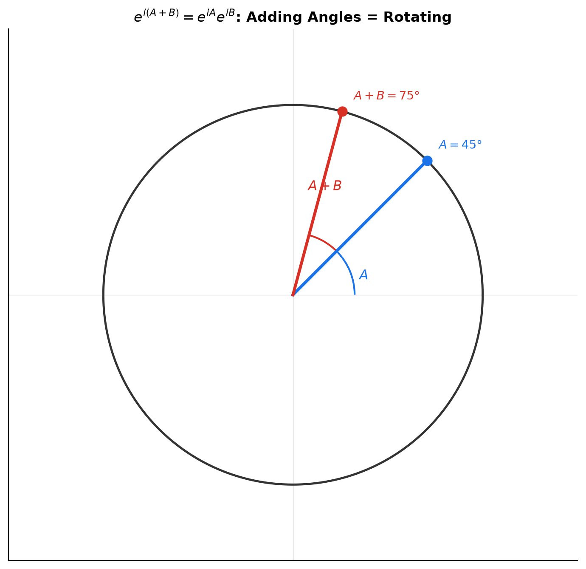
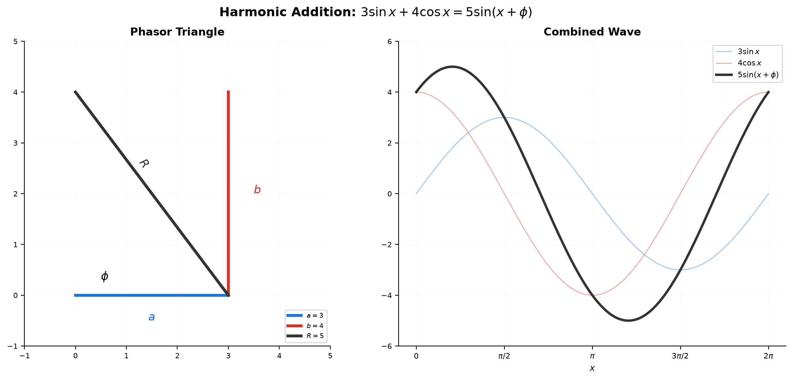
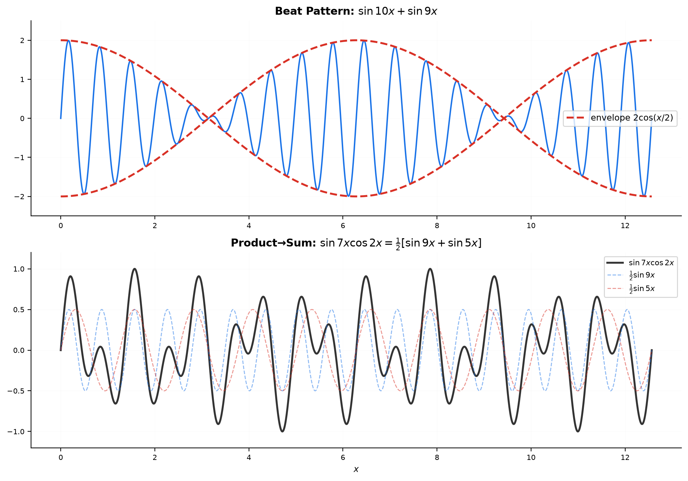
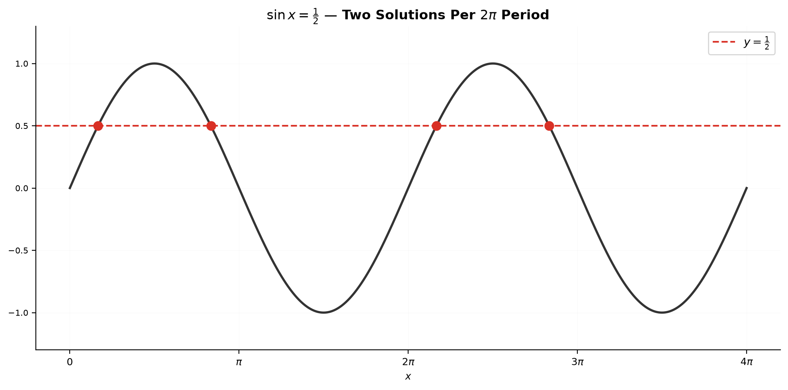
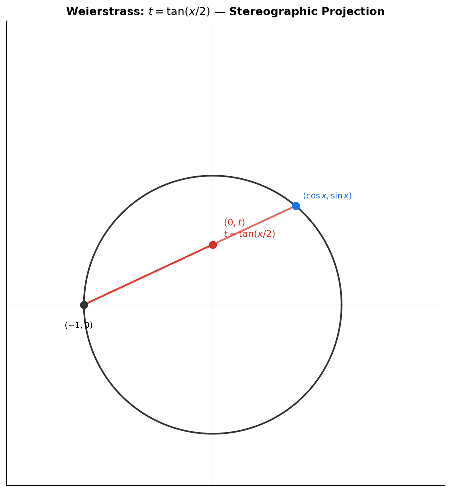
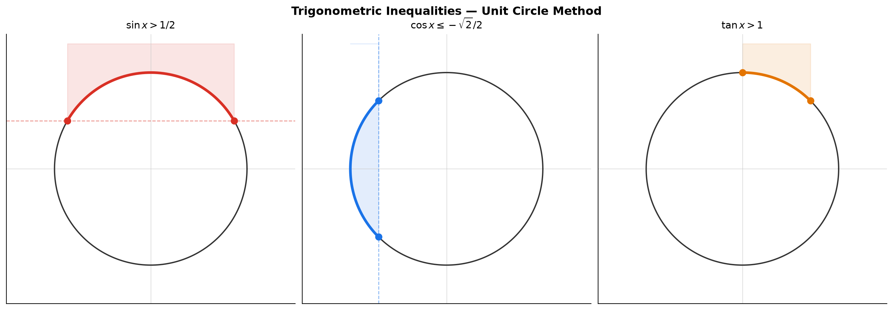
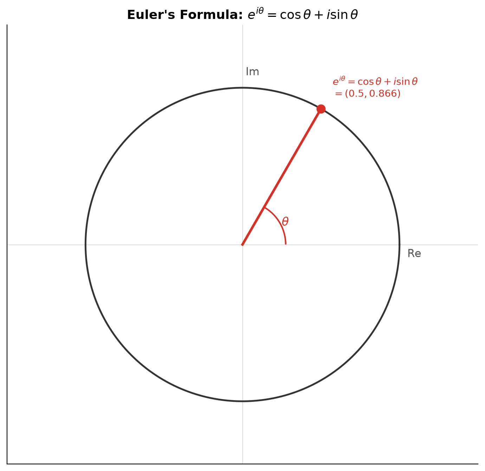
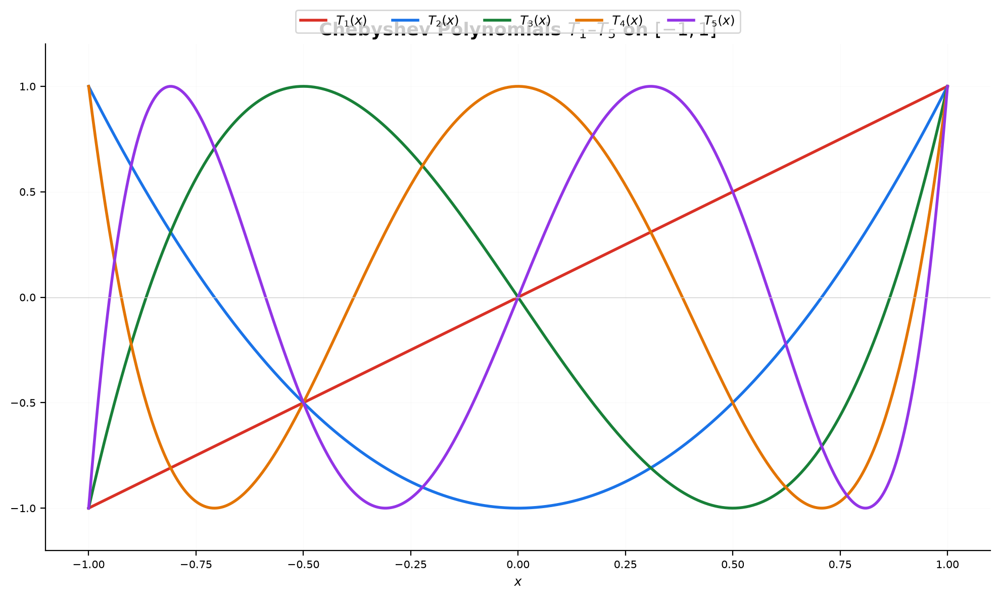
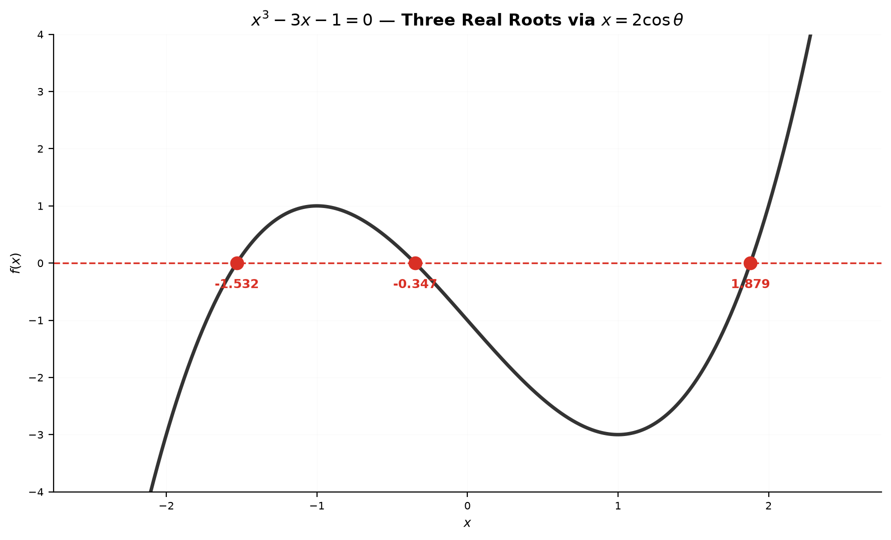
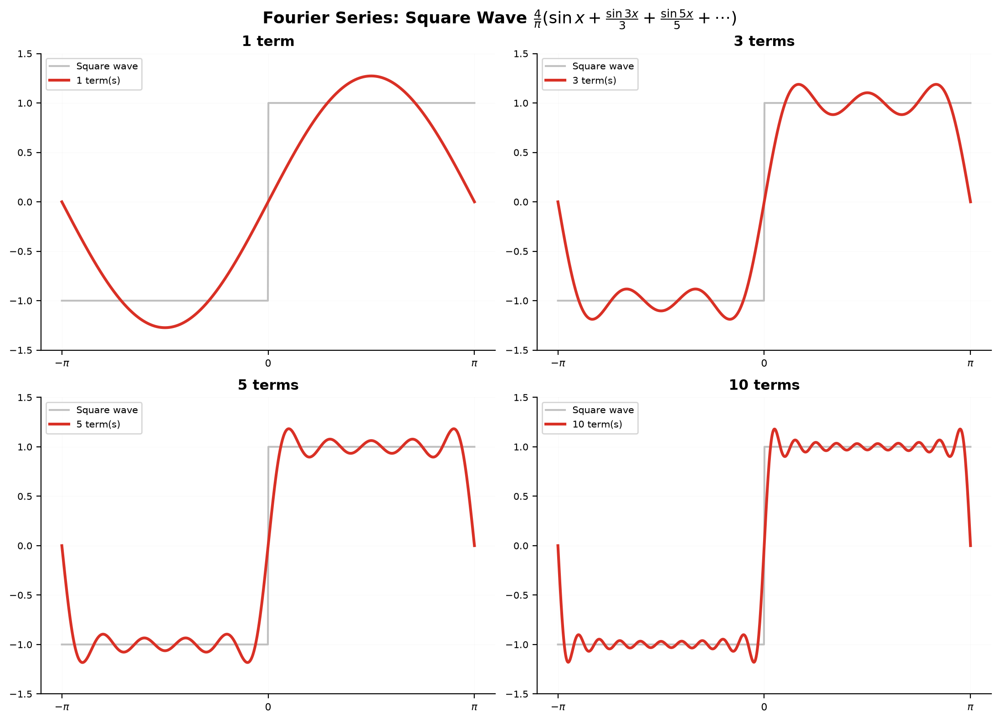

# Session 11B: Trigonometric Identities, Equations, and Beyond

**Phase 2 — Classical Techniques | 135 min**

*Prerequisite: [11A — Trigonometric Foundations](11A-trig-foundations.md) (radians, unit circle, six trig functions, graphs, inverse trig)*

*This session assumes fluency with: degree ↔ radian conversion, all six trig values from the unit circle, graph sketching with transformations, and arcsin/arccos/arctan evaluation. If shaky, review 11A first.*

---

## Part A: Trigonometric Identities — Your Algebraic Arsenal

---

## Example 1: Sum and Difference Formulas — Splitting and Merging Angles

Start with two angles whose trig values you know: $45^\circ$ and $30^\circ$.

**Find $\sin 75^\circ$:** $75^\circ = 45^\circ + 30^\circ$.

$\sin 75^\circ = \sin 45^\circ\cos 30^\circ + \cos 45^\circ\sin 30^\circ$
$= \frac{\sqrt{2}}{2}\cdot\frac{\sqrt{3}}{2} + \frac{\sqrt{2}}{2}\cdot\frac{1}{2} = \frac{\sqrt{6}+\sqrt{2}}{4}$.

**Find $\cos 15^\circ$:** $15^\circ = 45^\circ - 30^\circ$.

$\cos 15^\circ = \cos 45^\circ\cos 30^\circ + \sin 45^\circ\sin 30^\circ$
$= \frac{\sqrt{2}}{2}\cdot\frac{\sqrt{3}}{2} + \frac{\sqrt{2}}{2}\cdot\frac{1}{2} = \frac{\sqrt{6}+\sqrt{2}}{4}$.

**Find $\tan 75^\circ$:** $\tan 75^\circ = \frac{\tan 45^\circ + \tan 30^\circ}{1 - \tan 45^\circ\tan 30^\circ} = \frac{1 + 1/\sqrt{3}}{1 - 1/\sqrt{3}} = 2+\sqrt{3}$.

**Find $\sin 105^\circ$:** $105^\circ = 60^\circ + 45^\circ$.

$\sin 105^\circ = \sin 60^\circ\cos 45^\circ + \cos 60^\circ\sin 45^\circ = \frac{\sqrt{3}}{2}\cdot\frac{\sqrt{2}}{2} + \frac{1}{2}\cdot\frac{\sqrt{2}}{2} = \frac{\sqrt{6}+\sqrt{2}}{4}$. Same as $\sin 75^\circ$.

**The six formulas:**

$\sin(A+B) = \sin A\cos B + \cos A\sin B$
$\sin(A-B) = \sin A\cos B - \cos A\sin B$
$\cos(A+B) = \cos A\cos B - \sin A\sin B$
$\cos(A-B) = \cos A\cos B + \sin A\sin B$
$\tan(A+B) = \frac{\tan A + \tan B}{1 - \tan A\tan B}$
$\tan(A-B) = \frac{\tan A - \tan B}{1 + \tan A\tan B}$



> **Geometric insight**: $e^{i(A+B)} = e^{iA}e^{iB}$. Expanding $(\cos A + i\sin A)(\cos B + i\sin B)$ and matching real/imaginary parts gives all four sin/cos formulas at once — no memorization needed.

**Method — Computing a sum/difference trig value in 3 steps:**

(1) **Pick the formula.** Is it sin, cos, or tan? Sum or difference? Write it out.

(2) **Plug in the known values.** Read sin and cos of the two component angles from the special-angle table. Multiply carefully; watch the signs ($\pm$ and $\mp$).

(3) **Simplify the radical expression.** Combine like terms. For tan, rationalize the denominator if needed.

> 💡 **Pro tip — Picking the split**: To compute $\sin 105^\circ$, split as $60^\circ+45^\circ$ (both special angles) rather than $90^\circ+15^\circ$ ($15^\circ$ is not a basic special angle). Always split into angles from $\{0^\circ, 30^\circ, 45^\circ, 60^\circ, 90^\circ\}$.

---

## Example 2: Double-Angle, Half-Angle, and Triple-Angle

Set $A = B = \theta$ in the sum formulas:

$\sin 2\theta = 2\sin\theta\cos\theta$.
$\cos 2\theta = \cos^2\theta - \sin^2\theta = 2\cos^2\theta - 1 = 1 - 2\sin^2\theta$.
$\tan 2\theta = \frac{2\tan\theta}{1-\tan^2\theta}$.

**Given $\sin\theta = \frac{3}{5}$ with $\theta$ in QI, find $\sin 2\theta$ and $\cos 2\theta$:**

(1) Find $\cos\theta$: $\cos\theta = \sqrt{1 - \frac{9}{25}} = \frac{4}{5}$.

(2) $\sin 2\theta = 2\cdot\frac{3}{5}\cdot\frac{4}{5} = \frac{24}{25}$.

(3) $\cos 2\theta = 2\cos^2\theta - 1 = 2\cdot\frac{16}{25} - 1 = \frac{7}{25}$.

**Given $\cos\theta = -\frac{3}{5}$ with $\theta$ in QII, find $\sin 2\theta$:**

(1) $\sin\theta = \sqrt{1 - \frac{9}{25}} = \frac{4}{5}$ (positive in QII).

(2) $\sin 2\theta = 2\cdot\frac{4}{5}\cdot(-\frac{3}{5}) = -\frac{24}{25}$.

(3) $\cos 2\theta = 1 - 2\sin^2\theta = 1 - 2\cdot\frac{16}{25} = -\frac{7}{25}$.

**Half-angle — from $\cos 2\theta = 2\cos^2\theta - 1$, replace $\theta \to \theta/2$:**

$\cos\theta = 2\cos^2\frac{\theta}{2} - 1$ → $\cos^2\frac{\theta}{2} = \frac{1+\cos\theta}{2}$.
$\sin^2\frac{\theta}{2} = \frac{1-\cos\theta}{2}$.

**Find $\sin 15^\circ$ via half-angle of $30^\circ$:**

$\sin^2 15^\circ = \frac{1 - \cos 30^\circ}{2} = \frac{1 - \sqrt{3}/2}{2} = \frac{2-\sqrt{3}}{4}$.
$\sin 15^\circ = \frac{\sqrt{2-\sqrt{3}}}{2} = \frac{\sqrt{6}-\sqrt{2}}{4}$ (rationalizing).

**Triple-angle:**

$\sin 3\theta = 3\sin\theta - 4\sin^3\theta$.
$\cos 3\theta = 4\cos^3\theta - 3\cos\theta$.
$\tan 3\theta = \frac{3\tan\theta - \tan^3\theta}{1 - 3\tan^2\theta}$.

> **Geometric insight**: Double-angle = rotating twice on the unit circle. The three forms of $\cos 2\theta$ are the same curve — choose the one matching what you already know ($\sin\theta$, $\cos\theta$, or both).

**Method — Choosing the right $\cos 2\theta$ form in 3 steps:**

(1) **Look at what you have.** Know $\sin\theta$ → use $1 - 2\sin^2\theta$. Know $\cos\theta$ → use $2\cos^2\theta - 1$. Know both → use $\cos^2\theta - \sin^2\theta$.

(2) **Plug in and compute.** Square first, multiply by 2, then add or subtract.

(3) **For half-angle, decide the sign.** $\frac{\theta}{2}$ may be in a different quadrant. Check: if $\theta \in [0,\pi]$, then $\frac{\theta}{2} \in [0,\frac{\pi}{2}]$ → all positive. If $\theta \in (\pi,2\pi)$, then $\frac{\theta}{2} \in (\frac{\pi}{2},\pi)$ → sin positive, cos negative.

> 💡 **Pro tip — The three faces of $\cos 2\theta$**: When you need $\cos 2\theta$ and already know $\sin\theta$, use $1-2\sin^2\theta$ — no need to find $\cos\theta$ first. When you know $\cos\theta$, use $2\cos^2\theta-1$. This saves a Pythagorean step and avoids sign ambiguity.

---

## Example 3: Harmonic Addition — $a\sin x + b\cos x$ into One Wave

**$3\sin x + 4\cos x$:** $R = \sqrt{3^2+4^2} = 5$. $\phi = \arctan\frac{4}{3} \approx 53.13^\circ$.
Result: $5\sin(x + \phi)$.

**$\sqrt{3}\sin x - \cos x$:** $R = \sqrt{3+1} = 2$. $\phi = \arctan\frac{-1}{\sqrt{3}} = -\frac{\pi}{6}$. Result: $2\sin(x - \frac{\pi}{6})$.

**$\sin x + \cos x$:** $R = \sqrt{2}$. $\phi = \arctan 1 = \frac{\pi}{4}$. Result: $\sqrt{2}\sin(x + \frac{\pi}{4})$.

**$5\sin x + 12\cos x$:** $R = \sqrt{25+144} = 13$. $\phi = \arctan\frac{12}{5}$. Result: $13\sin(x + \phi)$, max value = $13$.

**Why this matters**: $a\sin x + b\cos x$ appears in physics (superposition of waves), engineering (AC circuits), and differential equations. Reducing it to one wave makes amplitude and phase obvious.



> **Geometric insight**: $(a, b)$ is a point in the plane. $R$ = distance from origin, $\phi$ = angle from positive $x$-axis. The expression is the projection of a rotating vector — a pure sine wave of amplitude $R$, shifted by $\phi$.

**Method — Harmonic addition in 3 steps:**

(1) **Compute $R$.** Square both coefficients, add them, take the square root. $R = \sqrt{a^2 + b^2}$.

(2) **Find $\phi$.** The right triangle has legs $a$ (horizontal) and $b$ (vertical). $\phi = \arctan\frac{b}{a}$, adjusted for quadrant: if $a < 0$, add $\pi$ to $\arctan$.

(3) **Write the result.** $a\sin x + b\cos x = R\sin(x + \phi)$. Alternative: $R\cos(x - \phi')$ with $\phi' = \arctan\frac{a}{b}$.

> 💡 **Pro tip — Existence check**: Before solving $a\sin x + b\cos x = c$, compute $R = \sqrt{a^2+b^2}$. If $|c| > R$, stop — no solution exists. If $|c| = R$, exactly one solution per period. If $|c| < R$, two solutions. Saves time on impossible equations.

---

## Example 4: Product-to-Sum and Sum-to-Product

**Product-to-sum — turn multiplication into addition:**

$\sin A\cos B = \frac{1}{2}[\sin(A+B) + \sin(A-B)]$
$\cos A\cos B = \frac{1}{2}[\cos(A+B) + \cos(A-B)]$
$\sin A\sin B = \frac{1}{2}[\cos(A-B) - \cos(A+B)]$

**Compute $\sin 75^\circ\cos 15^\circ$:**
$= \frac{1}{2}[\sin 90^\circ + \sin 60^\circ] = \frac{1}{2}[1 + \frac{\sqrt{3}}{2}] = \frac{2+\sqrt{3}}{4}$.

**Sum-to-product — turn addition into multiplication:**

$\sin A + \sin B = 2\sin\frac{A+B}{2}\cos\frac{A-B}{2}$
$\sin A - \sin B = 2\cos\frac{A+B}{2}\sin\frac{A-B}{2}$
$\cos A + \cos B = 2\cos\frac{A+B}{2}\cos\frac{A-B}{2}$
$\cos A - \cos B = -2\sin\frac{A+B}{2}\sin\frac{A-B}{2}$

**Simplify $\sin 75^\circ + \sin 15^\circ$:**
$= 2\sin 45^\circ\cos 30^\circ = 2\cdot\frac{\sqrt{2}}{2}\cdot\frac{\sqrt{3}}{2} = \frac{\sqrt{6}}{2}$.



> **Geometric insight**: When $A \approx B$, $\sin A + \sin B$ produces a "beat" — a fast oscillation inside a slow envelope. The sum-to-product formula reveals the envelope ($2\cos\frac{A-B}{2}$) explicitly.

**Method — Deciding which direction in 3 steps:**

(1) **Read the operation.** Multiplication of trigs → product-to-sum. Addition/subtraction of trigs → sum-to-product.

(2) **Identify $A$ and $B$.** The larger argument first.

(3) **Apply the formula and simplify.** Product-to-sum: compute $A+B$ and $A-B$, multiply by $\frac{1}{2}$. Sum-to-product: compute $\frac{A+B}{2}$ and $\frac{A-B}{2}$, multiply by $2$.

> 💡 **Pro tip — When sum-to-product beats double-angle**: For $\sin 5x = \sin 3x$, rewriting as $\sin 5x - \sin 3x = 0$ and using sum-to-product gives $2\cos 4x\sin x = 0$ — factorized immediately. Using triple-angle would produce a messy cubic. **Rule**: same function, different arguments → sum-to-product.

---

## Example 5: Power-Reduction — Squares into First Powers

From $\cos 2\theta$ formulas, solve for $\sin^2\theta$ and $\cos^2\theta$:

$\sin^2\theta = \frac{1 - \cos 2\theta}{2}$. $\cos^2\theta = \frac{1 + \cos 2\theta}{2}$. $\tan^2\theta = \frac{1 - \cos 2\theta}{1 + \cos 2\theta}$.

**Compute $\sin^2 75^\circ$:** $\frac{1 - \cos 150^\circ}{2} = \frac{1 - (-\sqrt{3}/2)}{2} = \frac{2+\sqrt{3}}{4}$.

**Compute $\cos^2\frac{\pi}{8}$:** $\frac{1 + \cos\frac{\pi}{4}}{2} = \frac{1 + \sqrt{2}/2}{2} = \frac{2+\sqrt{2}}{4}$.

**For cubes — invert the triple-angle formulas:**
$\sin^3\theta = \frac{3\sin\theta - \sin 3\theta}{4}$. $\cos^3\theta = \frac{3\cos\theta + \cos 3\theta}{4}$.

**Why these matter**: $\int \sin^2 x\,dx$ is impossible without power-reduction. The identity turns $\sin^2 x = \frac{1}{2} - \frac{1}{2}\cos 2x$, and each term integrates trivially.

**Method — Reducing a power in 3 steps:**

(1) **Check the parity.** Even power ($\sin^2$, $\cos^4$) → use $\sin^2\theta = \frac{1-\cos 2\theta}{2}$ repeatedly. Odd power ($\sin^3$) → use $\sin^3\theta = \frac{3\sin\theta - \sin 3\theta}{4}$.

(2) **Apply the formula.** For $\sin^4\theta$: $(\frac{1-\cos 2\theta}{2})^2 = \frac{1 - 2\cos 2\theta + \cos^2 2\theta}{4}$. Then reduce $\cos^2 2\theta$ again.

(3) **Simplify to first-power cosines.** The result is a sum of $\cos(k\theta)$ terms. This is the form needed for integration.

> **Up to here**: Sum/difference (6 formulas). Double/half/triple angle. Harmonic addition: $a\sin x + b\cos x \to R\sin(x+\phi)$. Product↔sum. Power-reduction. These tools are for simplifying, solving, and proving.

---

## Part B: Trigonometric Equations and Inequalities

---

## Example 6: Basic Equations — Base Angle + $n \times$ Period

**$\sin x = \frac{1}{2}$:**

(1) Base angle: $\arcsin\frac{1}{2} = \frac{\pi}{6}$.
(2) Sine positive in QI and QII → $x = \frac{\pi}{6}$ and $x = \pi - \frac{\pi}{6} = \frac{5\pi}{6}$.
(3) General: $x = \frac{\pi}{6} + 2n\pi$ or $x = \frac{5\pi}{6} + 2n\pi$, $n \in \mathbb{Z}$.

**$\cos x = -\frac{\sqrt{3}}{2}$:**

(1) Base: $\arccos\frac{\sqrt{3}}{2} = \frac{\pi}{6}$. Cosine negative in QII and QIII.
(2) $x = \pi - \frac{\pi}{6} = \frac{5\pi}{6}$, $x = \pi + \frac{\pi}{6} = \frac{7\pi}{6}$.
(3) General: $x = \frac{5\pi}{6} + 2n\pi$ or $x = \frac{7\pi}{6} + 2n\pi$.

**$\tan x = -1$:**

(1) Base: $\arctan 1 = \frac{\pi}{4}$. Tangent negative in QII and QIV: $\frac{3\pi}{4}$, $\frac{7\pi}{4}$.
(2) Period of tan is $\pi$ → general: $x = \frac{3\pi}{4} + n\pi$.



**Method — Any basic trig equation in 3 steps:**

(1) **Find the base angle.** $\alpha = \arcsin|k|$ (or $\arccos|k|$, $\arctan|k|$). This is the QI reference.

(2) **Determine all quadrants where the function has the given sign** (ASTC). Two quadrants per period for sin/cos; tan covers both in one $\pi$-period.

(3) **Write the general solution.** For sin/cos: $\alpha$ and $\pi-\alpha$ (or $2\pi-\alpha$, depending), each $+ 2\pi n$. For tan: $\alpha + \pi n$.

> 💡 **Pro tip — The most common mistake**: After finding $\arcsin k = \alpha$, students stop and write $x = \alpha$. This loses half the solutions. Always ask: *"Where else on the unit circle does sine have this value?"* The answer is always the mirror angle across the $y$-axis: $\pi - \alpha$ (for sine) or $2\pi - \alpha$ (for cosine in QIV).

---

## Example 7: Quadratic Equations — $t$-Substitution

**$2\cos^2 x - \cos x - 1 = 0$:**

(1) Let $t = \cos x$, $t \in [-1, 1]$. Then $2t^2 - t - 1 = 0$.

(2) Factor: $(2t+1)(t-1) = 0$. $t = 1$ or $t = -\frac{1}{2}$.

(3) $\cos x = 1$ → $x = 2n\pi$. $\cos x = -\frac{1}{2}$ → $x = \frac{2\pi}{3} + 2n\pi$ or $\frac{4\pi}{3} + 2n\pi$.

**$2\sin^2 x + 3\sin x + 1 = 0$:**

(1) $t = \sin x$, $t \in [-1, 1]$: $2t^2 + 3t + 1 = 0$ → $(2t+1)(t+1) = 0$.

(2) $t = -\frac{1}{2}$ or $t = -1$.

(3) $\sin x = -\frac{1}{2}$ → $x = \frac{7\pi}{6} + 2n\pi$ or $\frac{11\pi}{6} + 2n\pi$.
$\sin x = -1$ → $x = \frac{3\pi}{2} + 2n\pi$.

**$3\tan^2 x - 1 = 0$:**

(1) $t = \tan x$: $3t^2 - 1 = 0$ → $t = \pm\frac{1}{\sqrt{3}}$.

(2) $\tan x = \frac{\sqrt{3}}{3}$ → $x = \frac{\pi}{6} + n\pi$. $\tan x = -\frac{\sqrt{3}}{3}$ → $x = -\frac{\pi}{6} + n\pi$.

**Always check $t \in [-1,1]$ for sin/cos.** Roots outside are invalid. For tan, $t$ can be any real number.

> **Geometric insight**: $t$-substitution flattens the trig equation into algebra. Each valid $t \in [-1,1]$ (sin/cos) corresponds to a horizontal line intersecting the unit circle at two points (except $t = \pm 1$, which touches tangentially).

**Method — Quadratic trig equations in 3 steps:**

(1) **Let $t = \sin x$ (or $\cos x$, $\tan x$).** Replace every trig term. For sin/cos, $t \in [-1,1]$.

(2) **Solve the quadratic.** Factor or use the formula. Discard $t \notin [-1,1]$ for sin/cos.

(3) **Solve each $t$-equation** using the method from Example 6.

---

## Example 8: Mixed-Angle Equations — Unify All Angles

**$\sin 2x = \cos x$:**

(1) Replace $\sin 2x = 2\sin x\cos x$: $2\sin x\cos x = \cos x$.

(2) Bring to one side: $2\sin x\cos x - \cos x = 0$ → $\cos x(2\sin x - 1) = 0$.

(3) $\cos x = 0$ → $x = \frac{\pi}{2} + n\pi$.
$\sin x = \frac{1}{2}$ → $x = \frac{\pi}{6} + 2n\pi$ or $\frac{5\pi}{6} + 2n\pi$.

**$\cos 2x + \cos x = 0$:**

(1) Use $\cos 2x = 2\cos^2 x - 1$: $2\cos^2 x - 1 + \cos x = 0$ → $2\cos^2 x + \cos x - 1 = 0$.

(2) $t = \cos x$: $(2t-1)(t+1) = 0$ → $t = \frac{1}{2}, -1$.

(3) $\cos x = \frac{1}{2}$ → $x = \pm\frac{\pi}{3} + 2n\pi$. $\cos x = -1$ → $x = \pi + 2n\pi$.

**When sum-to-product is better: $\sin 5x = \sin 3x$:**

(1) $\sin 5x - \sin 3x = 0$ → $2\cos 4x \sin x = 0$.

(2) $\cos 4x = 0$ → $4x = \frac{\pi}{2} + n\pi$ → $x = \frac{\pi}{8} + \frac{n\pi}{4}$.
$\sin x = 0$ → $x = n\pi$.

**Method — Mixed-angle equations in 3 steps:**

(1) **Pick a strategy.** Different functions of same angle → factor. Different angles → unify via double/triple-angle or sum-to-product.

(2) **Convert everything to the same angle.** Replace $2x$, $3x$ with expressions in $x$.

(3) **Factor if possible, otherwise $t$-substitute.** Solve the resulting equation as in Examples 6-7.

---

## Example 9: Mixed $\sin$/$\cos$ — Factor or Harmonic-Add

**Case 1 — Factorable: $\sin x = \cos x$:**

Check $\cos x = 0$: no solution here ($\sin\frac{\pi}{2} = 1 \neq 0$). Divide by $\cos x$: $\tan x = 1$ → $x = \frac{\pi}{4} + n\pi$.

**Case 2 — Harmonic addition: $\sin x + \sqrt{3}\cos x = 1$:**

(1) $R = \sqrt{1+3} = 2$, $\phi = \arctan\frac{\sqrt{3}}{1} = \frac{\pi}{3}$.

(2) $2\sin(x + \frac{\pi}{3}) = 1$ → $\sin(x + \frac{\pi}{3}) = \frac{1}{2}$.

(3) $x + \frac{\pi}{3} = \frac{\pi}{6} + 2n\pi$ or $\frac{5\pi}{6} + 2n\pi$.
$x = -\frac{\pi}{6} + 2n\pi$ or $x = \frac{\pi}{2} + 2n\pi$.

**Case 3 — $3\cos x - 4\sin x = 2$:**

(1) $R = \sqrt{9+16} = 5$. $\phi = \arctan\frac{3}{-4} = \pi - \arctan\frac{3}{4}$ (since $a < 0$).
Rewrite: $5\cos(x - \phi')$ where $\phi' = \arctan\frac{4}{3}$.

(2) $5\cos(x - \phi') = 2$ → $\cos(x - \phi') = \frac{2}{5}$.

(3) $x - \phi' = \pm\arccos\frac{2}{5} + 2n\pi$ → $x = \phi' \pm \arccos\frac{2}{5} + 2n\pi$.

> **Geometric insight**: $a\sin x + b\cos x = c$ is the intersection of a shifted sine wave with horizontal line $y = c$. If $|c| > R$, no solution. If $|c| = R$, one solution per period. If $|c| < R$, two solutions.

---

## Example 10: Weierstrass $t = \tan\frac{x}{2}$ — The Universal Solver

$t = \tan\frac{x}{2}$ converts any rational trig equation into a rational equation in $t$:
$\sin x = \frac{2t}{1+t^2}$. $\cos x = \frac{1-t^2}{1+t^2}$. $\tan x = \frac{2t}{1-t^2}$.

**Solve $\sin x + \cos x = 1$:**

(1) Substitute: $\frac{2t}{1+t^2} + \frac{1-t^2}{1+t^2} = 1$.

(2) Clear $1+t^2$ (never zero): $2t + 1 - t^2 = 1 + t^2$ → $2t^2 - 2t = 0$ → $2t(t-1) = 0$.

(3) $t = 0$ → $\tan\frac{x}{2} = 0$ → $x = 2n\pi$.
$t = 1$ → $\tan\frac{x}{2} = 1$ → $x = \frac{\pi}{2} + 2n\pi$.

**Solve $\frac{1}{\sin x} = 2$ on $[0, 2\pi]$:**

(1) Using Weierstrass: $\frac{1+t^2}{2t} = 2$ → $1+t^2 = 4t$ → $t^2 - 4t + 1 = 0$.

(2) $t = 2 \pm \sqrt{3}$.

(3) $t = 2+\sqrt{3}$ → $\tan\frac{x}{2} = 2+\sqrt{3}$ → $\frac{x}{2} = \frac{5\pi}{12}$ → $x = \frac{5\pi}{6}$.
$t = 2-\sqrt{3}$ → $\frac{x}{2} = \frac{\pi}{12}$ → $x = \frac{\pi}{6}$.



> **Geometric insight**: $t = \tan\frac{x}{2}$ maps the unit circle (minus $(-1,0)$) one-to-one onto the real line. A line from $(-1,0)$ through $(\cos x,\sin x)$ hits the $y$-axis at $(0,t)$. This is stereographic projection.

**Method — Weierstrass in 3 steps:**

(1) **Replace all trig terms** with their $t$-forms. $t = \tan\frac{x}{2}$.

(2) **Clear denominators** by multiplying through by $1+t^2$. The result is a polynomial in $t$.

(3) **Solve for $t$, then convert back.** $t = k$ → $\frac{x}{2} = \arctan k + n\pi$ → $x = 2\arctan k + 2n\pi$.

> 💡 **Pro tip — When Weierstrass is overkill**: Don't use $t = \tan(x/2)$ for $\sin x = \cos x$ — just divide by $\cos x$ to get $\tan x = 1$. Don't use it for $\sin x = \frac{1}{2}$ — just read the unit circle. Weierstrass is your **last resort** for messy rational equations like $\frac{1+\sin x}{\cos x} = 3$. If a simpler method (factoring, harmonic addition, basic solving) works, use that instead.

---

## Example 11: Trigonometric Inequalities — The Unit Circle Method

**$\sin x > \frac{1}{2}$ on $[0, 2\pi]$:**

(1) $\sin x = \frac{1}{2}$ at $x = \frac{\pi}{6}, \frac{5\pi}{6}$.

(2) On the unit circle, $\sin x = y$-coordinate. $\sin x > \frac{1}{2}$ → point is above $y = \frac{1}{2}$.

(3) Answer: $x \in (\frac{\pi}{6}, \frac{5\pi}{6})$. General: $x \in (\frac{\pi}{6} + 2n\pi, \frac{5\pi}{6} + 2n\pi)$.

**$\cos x \leq -\frac{\sqrt{2}}{2}$ on $[0, 2\pi]$:**

(1) $\cos x = -\frac{\sqrt{2}}{2}$ at $x = \frac{3\pi}{4}, \frac{5\pi}{4}$.

(2) $\cos x \leq -\frac{\sqrt{2}}{2}$ → $x$-coordinate is at or left of $-\frac{\sqrt{2}}{2}$. On the unit circle: the left arc through $\pi$.

(3) Answer: $x \in [\frac{3\pi}{4}, \frac{5\pi}{4}]$.

**$\tan x > 1$ on $[0, 2\pi]$:**

(1) $\tan x = 1$ at $\frac{\pi}{4}, \frac{5\pi}{4}$.

(2) $\tan x > 1$ → slope steeper than $45^\circ$. Ray between $45^\circ$ and $90^\circ$ (QI) or $225^\circ$ to $270^\circ$ (QIII).

(3) $x \in (\frac{\pi}{4}, \frac{\pi}{2}) \cup (\frac{5\pi}{4}, \frac{3\pi}{2})$.
General: $x \in (\frac{\pi}{4} + n\pi, \frac{\pi}{2} + n\pi)$.



---

## Example 12: Quadratic Trig Inequalities

**$2\sin^2 x - \sin x - 1 < 0$ on $[0, 2\pi]$:**

(1) $t = \sin x$, $t \in [-1, 1]$. $(2t+1)(t-1) < 0$. Roots: $t = -\frac{1}{2}, 1$.

(2) Sign chart: $t \in (-\frac{1}{2}, 1)$ makes the product negative. So $-\frac{1}{2} < \sin x < 1$.

(3) $-\frac{1}{2} < \sin x$ and $\sin x < 1$.
$\sin x > -\frac{1}{2}$: $x \in [0, \frac{7\pi}{6}) \cup (\frac{11\pi}{6}, 2\pi]$.
$\sin x < 1$: all $x$ except $\frac{\pi}{2}$.
Intersection: $x \in [0, \frac{\pi}{2}) \cup (\frac{\pi}{2}, \frac{7\pi}{6}) \cup (\frac{11\pi}{6}, 2\pi]$.

**Method — Quadratic trig inequalities in 3 steps:**

(1) **$t$-substitute.** Solve the quadratic inequality algebraically to get a $t$-range.

(2) **Translate to trig inequalities.** e.g., $-\frac{1}{2} < t < 1$ → $-\frac{1}{2} < \sin x < 1$.

(3) **Solve on the unit circle and intersect arcs.**

> 💡 **Do's and Don'ts — Equations & Inequalities:**
>
> | ✅ Do | ❌ Don't |
> |------|------|
> | **Check $t \in [-1,1]$** after solving a quadratic in $\sin x$ or $\cos x$. Discard $t = -2$ or $t = 1.5$ — impossible. | Don't blindly accept all $t$-roots. $\sin x = -2$ has no solution. |
> | **Find both solutions per period** for sin/cos. $\sin x = \frac{1}{2}$ → $x = \frac{\pi}{6}$ AND $\frac{5\pi}{6}$. | Don't stop at just $\arcsin(\frac{1}{2}) = \frac{\pi}{6}$. $\arcsin$ only gives the QI angle. |
> | **Factor, don't divide** when terms share a trig factor. $\sin x\cos x = \cos x$ → $\cos x(\sin x - 1) = 0$. | Don't divide by $\cos x$. You'll lose the solutions where $\cos x = 0$. |
> | **Draw the unit circle** for inequalities. Shade the arc where $\sin x > k$ (above $y=k$) or $\cos x < k$ (left of $x=k$). | Don't memorize inequality ranges. One sign error and the interval flips. The circle never lies. |
> | **Check endpoints manually** for $\leq$ or $\geq$ inequalities. At the boundary, equality holds — include it. | Don't assume open/closed from memory. $\sin x \geq \frac{1}{2}$ includes $\frac{\pi}{6}$ and $\frac{5\pi}{6}$; $\sin x > \frac{1}{2}$ excludes them. |
> | **Verify by plugging back** one solution from each family into the original equation, especially after squaring or dividing. | Don't skip verification after squaring both sides — squaring can introduce extraneous solutions. |
> | **Use period shortcuts**: $\tan x = k$ → $x = \arctan k + n\pi$ (one formula covers both quadrants because period is $\pi$). | Don't write two separate families for tan — it's redundant. $\tan x = 1$ → $x = \frac{\pi}{4} + n\pi$ already covers $\frac{5\pi}{4}$. |

---

## Example 13: Law of Sines and Law of Cosines

**Law of Sines**: $\frac{a}{\sin A} = \frac{b}{\sin B} = \frac{c}{\sin C} = 2R$.

Use when given AAS or ASA (two angles + one side).

**Find $b$ when $a=10$, $A=30^\circ$, $B=45^\circ$:**
$b = a\frac{\sin B}{\sin A} = 10\frac{\sin 45^\circ}{\sin 30^\circ} = 10\frac{\sqrt{2}/2}{1/2} = 10\sqrt{2}$.

**Ambiguous case (SSA)**: $a=5$, $b=8$, $A=30^\circ$.
$\sin B = \frac{8\sin 30^\circ}{5} = 0.8$ → $B \approx 53.1^\circ$ or $126.9^\circ$. Two possible triangles.

**Law of Cosines**: $c^2 = a^2 + b^2 - 2ab\cos C$.

**Find side $c$ when $a=5$, $b=7$, $C=60^\circ$:**
$c^2 = 25+49-2(5)(7)\frac{1}{2} = 74-35 = 39$ → $c = \sqrt{39}$.

**Find angle $A$ in 3-4-5 triangle**: $\cos A = \frac{4^2+5^2-3^2}{2\cdot4\cdot5} = \frac{16+25-9}{40} = \frac{4}{5}$ → $A \approx 36.87^\circ$.

**Triangle area**:
$\frac{1}{2}ab\sin C$ (two sides + included angle). $a=5, b=8, C=30^\circ$ → $\frac{1}{2}\cdot5\cdot8\cdot\frac{1}{2} = 10$.
Heron: $s = \frac{a+b+c}{2}$, $\text{Area} = \sqrt{s(s-a)(s-b)(s-c)}$.

> 💡 **Pro tip — The ambiguous SSA case**: Given two sides and a non-included angle, always check if $\sin B = \frac{b\sin A}{a} \leq 1$. If $\sin B = 1$, exactly one right triangle. If $\sin B < 1$, there may be two triangles ($B$ acute or obtuse) or one ($B$ must be acute because $a \geq b$). Draw it — don't guess.

> **Up to here**: 6 equation types (basic, quadratic, mixed-angle, mixed-function, Weierstrass, inverse trig) + inequalities + triangles. Each type has a clear 3-step method.

---

## Part C: College-Level Techniques

---

## Example 14: Euler's Formula — Every Identity from One Equation

$e^{i\theta} = \cos\theta + i\sin\theta$.

**Deriving the sum formulas**: $e^{i(A+B)} = e^{iA}e^{iB}$.
$(\cos A + i\sin A)(\cos B + i\sin B) = (\cos A\cos B - \sin A\sin B) + i(\sin A\cos B + \cos A\sin B)$.
Equate with $\cos(A+B) + i\sin(A+B)$ → both sum formulas at once.

**De Moivre**: $(\cos\theta + i\sin\theta)^n = \cos(n\theta) + i\sin(n\theta)$.

**Compute $\cos 3\theta$ via De Moivre**: Expand $(\cos\theta + i\sin\theta)^3 = \cos^3\theta + 3i\cos^2\theta\sin\theta - 3\cos\theta\sin^2\theta - i\sin^3\theta$.
Real part: $\cos^3\theta - 3\cos\theta(1-\cos^2\theta) = 4\cos^3\theta - 3\cos\theta = \cos 3\theta$.



> **Geometric insight**: Multiplication by $e^{i\theta}$ rotates a complex number by $\theta$. Euler's formula turns trig into exponent arithmetic.

---

## Example 15: Chebyshev Polynomials — Cosines as Polynomials

$T_n(\cos\theta) = \cos(n\theta)$.

$T_0(x)=1$, $T_1(x)=x$, $T_2(x)=2x^2-1$, $T_3(x)=4x^3-3x$, $T_4(x)=8x^4-8x^2+1$, $T_5(x)=16x^5-20x^3+5x$.

Recurrence: $T_{n+1}(x) = 2xT_n(x) - T_{n-1}(x)$.

**Solve $\cos 3\theta = \frac{1}{2}$ via Chebyshev**: $x = \cos\theta$, $T_3(x) = 4x^3-3x = \frac{1}{2}$ → $8x^3-6x-1=0$.
Roots: $x = \cos\frac{\pi}{9}, \cos\frac{7\pi}{9}, \cos\frac{13\pi}{9}$.



> **Geometric insight**: Chebyshev polynomials oscillate between $-1$ and $1$ with $n+1$ equally spaced extrema on $[-1,1]$. This equal-ripple property makes them optimal for approximation theory.

---

## Example 16: Cubic Equations via Trigonometry

For $x^3 + px + q = 0$ with 3 real roots (casus irreducibilis):
Set $x = 2\sqrt{-\frac{p}{3}}\cos\theta$ where $\cos 3\theta = \frac{3q}{2p}\sqrt{-\frac{3}{p}}$.

**Solve $x^3 - 3x - 1 = 0$:**

(1) $p=-3$, $q=-1$. $x = 2\cos\theta$.

(2) $\cos 3\theta = \frac{3(-1)}{2(-3)}\sqrt{-\frac{3}{-3}} = \frac{1}{2}$.

(3) $3\theta = \frac{\pi}{3}, \frac{7\pi}{3}, \frac{13\pi}{3}$ → $\theta = \frac{\pi}{9}, \frac{7\pi}{9}, \frac{13\pi}{9}$.
Roots: $2\cos\frac{\pi}{9} \approx 1.879$, $2\cos\frac{7\pi}{9} \approx -1.532$, $2\cos\frac{13\pi}{9} \approx -0.347$.



> **Geometric insight**: The identity $4\cos^3\theta - 3\cos\theta = \cos 3\theta$ turns the cubic into $\cos 3\theta = c$. The three roots come from three angles in $[0, \pi]$ whose triple has the same cosine.

---

## Example 17: Viete's Formula — Infinite Product for $\pi$

$\frac{2}{\pi} = \frac{\sqrt{2}}{2} \cdot \frac{\sqrt{2+\sqrt{2}}}{2} \cdot \frac{\sqrt{2+\sqrt{2+\sqrt{2}}}}{2} \cdots$

**Derivation**: Repeatedly apply the half-angle formula $\cos\frac{\theta}{2} = \sqrt{\frac{1+\cos\theta}{2}}$ starting from $\theta = \frac{\pi}{2}$.

$\cos\frac{\pi}{4} = \frac{\sqrt{2}}{2}$. $\cos\frac{\pi}{8} = \frac{\sqrt{2+\sqrt{2}}}{2}$. $\cos\frac{\pi}{16} = \frac{\sqrt{2+\sqrt{2+\sqrt{2}}}}{2}$.

The identity $\frac{\sin x}{x} = \cos\frac{x}{2}\cos\frac{x}{4}\cos\frac{x}{8}\cdots$ with $x = \frac{\pi}{2}$ gives $\frac{2}{\pi}$ as the infinite product.

---
---
## Example 18: Trigonometric Integrals Preview

Using $\sin^2\theta = \frac{1-\cos 2\theta}{2}$:

$\int \sin^2 x\,dx = \int \frac{1-\cos 2x}{2}\,dx = \frac{x}{2} - \frac{\sin 2x}{4} + C$

$\int \cos^2 x\,dx = \frac{x}{2} + \frac{\sin 2x}{4} + C$

$\int_0^{\pi} \sin^2 x\,dx = [\frac{x}{2} - \frac{\sin 2x}{4}]_0^{\pi} = \frac{\pi}{2}$

**Cubic**: $\int \sin^3 x\,dx = \int \frac{3\sin x - \sin 3x}{4}\,dx = -\frac{3\cos x}{4} + \frac{\cos 3x}{12} + C$

> **Geometric insight**: Every trig integral depends on the identities from Part A. Power-reduction turns unintegrable squares into integrable first powers.

---

## Example 19: Generating Pythagorean Triples

Via the Weierstrass parametrization: every rational point $(x,y)$ on $x^2+y^2=1$ has $x = \frac{1-t^2}{1+t^2}$, $y = \frac{2t}{1+t^2}$ for rational $t$.

Let $t = \frac{p}{q}$: then $(q^2-p^2, 2pq, q^2+p^2)$ is a Pythagorean triple.

| $p$ | $q$ | triple |
|:---:|:---:|------|
| 1 | 2 | $3,4,5$ |
| 2 | 3 | $5,12,13$ |
| 1 | 4 | $8,15,17$ |
| 3 | 4 | $7,24,25$ |

> **Geometric insight**: Rational points on the unit circle = Pythagorean triples. The Weierstrass $t = \tan\frac{\theta}{2}$ parametrizes them all.

---

## Example 20: Fourier Series — Decomposing Waves

Any $2\pi$-periodic $f(x)$ = $\frac{a_0}{2} + \sum_{n=1}^{\infty} (a_n\cos nx + b_n\sin nx)$.

**Square wave** $f(x) = \begin{cases} 1 & 0 < x < \pi \\ -1 & -\pi < x < 0 \end{cases}$:

$f(x) = \frac{4}{\pi}(\sin x + \frac{\sin 3x}{3} + \frac{\sin 5x}{5} + \cdots)$.

The identities from Part A make computing $a_n$, $b_n$ possible:
$a_n = \frac{1}{\pi}\int_{-\pi}^{\pi} f(x)\cos nx\,dx$. $b_n = \frac{1}{\pi}\int_{-\pi}^{\pi} f(x)\sin nx\,dx$.



> **Geometric insight**: Fourier's discovery (1807): ANY periodic wave is built from pure sines and cosines. The identities from this session are the alphabet; Fourier series is the language.

---

## Decision Tree — Trig Equations

```
You encounter a trigonometric equation:
├── (1) Single trig type, same angle? (sin x = k, 2cos²x−cos x−1=0)
│   └── t = sin x (or cos x). Solve polynomial. Check t ∈ [−1,1].
├── (2) Different angles? (sin 2x = cos x)
│   └── Unify via double/triple-angle or sum-to-product.
├── (3) sin and cos mixed?
│   ├── Factorable → set each factor = 0.
│   ├── a sin x + b cos x = c → harmonic addition.
│   └── Else → Weierstrass t = tan(x/2).
├── (4) Inverse trig? (2arcsin x = arccos x)
│   └── Apply trig to both sides, check ranges.
└── (5) Inequality?
    ├── sin x > k / cos x < k → unit circle arcs.
    └── Quadratic → t-sub, solve inequality, map back.
```

---

## Decision Tree — Choosing an Identity

```
├── Sum/diff inside trig → sum/difference formulas
├── Multiple angle (2θ, 3θ, θ/2) → double/half/triple-angle
├── a sin x + b cos x → harmonic addition → R sin(x+φ)
├── Product of trigs → product-to-sum
├── Sum of trigs → sum-to-product
├── sin²θ or cos²θ → power-reduction
└── cos(nθ) as polynomial → Chebyshev T_n
```

---

## Common Mistakes

### Mistake 1: $\cos(A+B) = \cos A + \cos B$

**Wrong path**: $\cos(A+B) = \cos A + \cos B$.

**Why wrong**: Cosine does not distribute. $\cos 90^\circ = \cos(60^\circ+30^\circ) \neq \frac{1}{2} + \frac{\sqrt{3}}{2}$.

**Right path**: $\cos(A+B) = \cos A\cos B - \sin A\sin B$.

---

### Mistake 2: Dividing by $\cos x$ without checking $\cos x = 0$

**Wrong path**: $\sin x = \cos x$ → divide by $\cos x$ → $\tan x = 1$.

**Why wrong**: If $\cos x = 0$, division is illegal. Solutions might be lost.

**Right path**: Check $\cos x = 0$ first. If no solution, then divide safely.

---

### Mistake 3: Only one solution per period for sin/cos

**Wrong path**: $\sin x = \frac{1}{2}$ → $x = \frac{\pi}{6} + 2n\pi$.

**Why wrong**: $\sin x = \frac{1}{2}$ has TWO solutions per period: $\frac{\pi}{6}$ (QI) and $\frac{5\pi}{6}$ (QII).

**Right path**: Find both quadrant solutions, add $2\pi n$ to each.

---

### Mistake 4: Mismatching side and angle in Law of Sines

**Wrong path**: $\frac{a}{\sin B}$.

**Why wrong**: Side $a$ is opposite angle $A$.

**Right path**: $\frac{a}{\sin A} = \frac{b}{\sin B} = \frac{c}{\sin C}$. Letters must match.

---

### Mistake 5: Forgetting $t \in [-1,1]$ when substituting sin/cos

**Wrong path**: $2\sin^2 x + 3\sin x + 1 = 0$ → $t = -2$ or $t = -\frac{1}{2}$ → both valid.

**Why wrong**: $t = \sin x$ must be in $[-1,1]$. $t = -2$ is impossible.

**Right path**: After solving the quadratic, filter $t \in [-1,1]$ before converting back.

---

## What We Just Did

```
Building on 11A (radians, unit circle, six graphs, inverse trig):

(1) Identity toolkit (5 families):
    Sum/difference (6 formulas). Double/half/triple angle.
    Harmonic addition: a sin x + b cos x → R sin(x+φ), R = √(a²+b²).
    Product↔sum (6 formulas). Power-reduction: sin²θ = (1−cos 2θ)/2.

(2) Equation solving (6 types, each with 3-step method):
    Basic (Example 6). Quadratic/t-sub (7). Mixed-angle (8).
    Mixed-function—factor or harmonic-add (9). Weierstrass (10).
    Inverse trig equations.

(3) Inequalities (Examples 11-12):
    Unit circle method: boundary angles → arcs.
    Quadratic: t-sub → algebraic inequality → map back to arcs.

(4) Triangles: Law of Sines, Law of Cosines, area (Example 13).

(5) College techniques:
    Euler: e^{iθ} = cos θ + i sin θ → all identities from exponent rules.
    De Moivre. Roots of unity.
    Chebyshev: T_n(cos θ) = cos(nθ).
    Cubic via trig: x = 2√(-p/3) cos θ solves casus irreducibilis.
    Viete's infinite product for π.
    Trig integrals: power-reduction in action.
    Pythagorean triples via rational parametrization.
    Fourier series: any wave = Σ sines + cosines.
```

---

## Practice 1

Use the sum formula to compute $\sin 105^\circ$ exactly. Verify using $\sin 105^\circ = \sin(180^\circ - 75^\circ) = \sin 75^\circ$.

→ Reference: **Example 1**

> Solutions: [Solutions](solutions/11B-solutions.md#practice-1)

---

## Practice 2

Given $\sin\theta = \frac{5}{13}$ with $\theta$ in QII, find $\sin 2\theta$, $\cos 2\theta$, and $\tan 2\theta$.

→ Reference: **Example 2**

> Solutions: [Solutions](solutions/11B-solutions.md#practice-2)

---

## Practice 3

Write $12\sin x + 5\cos x$ in the form $R\sin(x+\phi)$. Find the maximum value and the smallest positive $x$ where it occurs.

→ Reference: **Example 3**

> Solutions: [Solutions](solutions/11B-solutions.md#practice-3)

---

## Practice 4

Solve $2\cos^2 x - 3\cos x + 1 = 0$ for $x \in [0, 2\pi]$. List all solutions.

→ Reference: **Example 7**

> Solutions: [Solutions](solutions/11B-solutions.md#practice-4)

---

## Practice 5

Simplify $\sin 5x + \sin x$ using sum-to-product, then solve $\sin 5x + \sin x = 0$ on $[0, 2\pi]$.

→ Reference: **Example 4, 8**

> Solutions: [Solutions](solutions/11B-solutions.md#practice-5)

---

## Practice 6

Solve $\sin x \geq \frac{\sqrt{3}}{2}$ on $[0, 2\pi]$. Draw the unit circle and shade the solution arcs.

→ Reference: **Example 11**

> Solutions: [Solutions](solutions/11B-solutions.md#practice-6)

---

## Practice 7

Solve $2\sin^2 x - \sin x - 1 < 0$ on $[0, 2\pi]$. Give your answer in interval notation.

→ Reference: **Example 12**

> Solutions: [Solutions](solutions/11B-solutions.md#practice-7)

---

## Practice 8

Triangle $ABC$: $a=7$, $b=10$, $c=13$. Find all three angles and the area.

→ Reference: **Example 13**

> Solutions: [Solutions](solutions/11B-solutions.md#practice-8)

---

## Practice 9: Real Battle

Using Euler's formula, derive $\sin 4\theta$ and $\cos 4\theta$ by expanding $(\cos\theta + i\sin\theta)^4$.

→ Reference: **Example 14**

> Solutions: [Solutions](solutions/11B-solutions.md#practice-9)

---

## Practice 10: Real Battle

(a) Solve $x^3 - 3x + 1 = 0$ using the trigonometric method. Give all three real roots as $2\cos\alpha$.

(b) A sound wave is approximately $f(t) = \sin t + \frac{1}{3}\sin 3t + \frac{1}{5}\sin 5t$. Use harmonic addition identities to find all $t \in [0, 2\pi]$ where $f(t) = 1$.

→ Reference: **Example 16, 20**

> Solutions: [Solutions](solutions/11B-solutions.md#practice-10)

---

## Basic Algebra Drill — Identities and Equations (10 Problems)

> Pure fluency. Instant recall and rapid computation.

**D1.** Compute $\sin 75^\circ$ using $\sin(45^\circ+30^\circ)$.

**D2.** Compute $\cos 105^\circ$ using $\cos(60^\circ+45^\circ)$.

**D3.** Compute $\tan 15^\circ$ using $\tan(45^\circ-30^\circ)$.

**D4.** Given $\sin A = \frac{3}{5}$ (A in QI) and $\cos B = \frac{5}{13}$ (B in QI), find $\sin(A+B)$.

**D5.** Given $\cos\theta = -\frac{4}{5}$ ($\theta$ in QII), find $\cos 2\theta$.

**D6.** Write $\sin 3x\cos x$ as a sum of two sines (product-to-sum).

**D7.** Write $\sin 5x + \sin x$ as a product (sum-to-product).

**D8.** Compute $\arcsin(\frac{\sqrt{3}}{2})$ and $\arccos(-\frac{1}{2})$.

**D9.** Compute $\sin(\arcsin\frac{3}{5} + \arccos\frac{5}{13})$.

**D10.** Triangle $ABC$: $A=40^\circ$, $B=60^\circ$, $a=8$. Find side $b$ (Law of Sines).

> Solutions: [Solutions](solutions/11B-solutions.md#basic-drill)

---

## Advanced Algebra Drill — Multi-Step Problems (10 Problems)

> Chains 2–3 techniques. Covers all identities, equation types, and college-level material.

**A1.** Prove $\frac{\sin 2x}{1+\cos 2x} = \tan x$. Then use it to simplify $\tan 15^\circ$.

**A2.** Solve $\cos 2x + 3\sin x = 2$ for $x \in [0, 2\pi]$. (Hint: $\cos 2x = 1 - 2\sin^2 x$.)

**A3.** Solve $\tan^2 x - (1+\sqrt{3})\tan x + \sqrt{3} = 0$ for $x \in [0, 2\pi]$.

**A4.** Solve $\cos 2x + \cos x < 0$ on $[0, 2\pi]$. (Use $\cos 2x = 2\cos^2 x - 1$.)

**A5.** Simplify $\sin^4\theta - \cos^4\theta$ as a single trig function of $2\theta$. (Factor as difference of squares.)

**A6.** Compute $\cos 20^\circ \cdot \cos 40^\circ \cdot \cos 80^\circ$ exactly. (Multiply and divide by $\sin 20^\circ$.)

**A7.** Find all $x \in [0, 2\pi]$ such that $\sin 3x = \sin x$. Use sum-to-product.

**A8.** Derive $\cos 5\theta$ as a polynomial in $\cos\theta$ using Chebyshev: $T_5(x) = 2xT_4(x) - T_3(x)$.

**A9.** Generate the Pythagorean triple from $p=2, q=5$. Verify $a^2+b^2=c^2$.

**A10.** Compute the first three nonzero terms of the Fourier sine series for $f(x)=x$ on $(-\pi,\pi)$. ($b_n = \frac{2}{\pi}\int_0^{\pi} x\sin nx\,dx = \frac{2(-1)^{n+1}}{n}$.)

> Solutions: [Solutions](solutions/11B-solutions.md#advanced-drill)

---

## Today's Procedure

```
Step 1: Wield the identities — sum/difference. Double/half-angle. Harmonic addition:
         a sin x + b cos x → R sin(x+φ). Product↔sum. Power-reduction.

Step 2: Solve equations — 6 types, each 3-step.
         Basic: arcsin → quadrants → +n×period.
         Quadratic: t-sub → polynomial → convert back.
         Mixed-angle: unify → solve.
         Mixed-function: factor or harmonic-add.
         Weierstrass: t = tan(x/2) universal.
         Inverse trig: apply trig, check ranges.

Step 3: Inequalities — unit circle: boundary angles → shade arcs.

Step 4: Triangles — SAS/SSS → Law of Cosines. AAS/ASA → Law of Sines.

Step 5: College — Euler: e^{iθ} = cos θ + i sin θ. De Moivre. Chebyshev.
         Cubic via trig. Viete. Trig integrals. Fourier series.
```

---

## How to Read These Symbols

| Symbol | Reads as | Meaning |
|:---:|:---:|------|
| $\sin(A\pm B)$ | sine of A plus/minus B | $\sin A\cos B \pm \cos A\sin B$ |
| $\cos(A\pm B)$ | cosine of A plus/minus B | $\cos A\cos B \mp \sin A\sin B$ |
| $R\sin(x+\phi)$ | R sine x plus phi | harmonic addition, $R = \sqrt{a^2+b^2}$ |
| $\arcsin x$ | arcsine of x | angle in $[-\frac{\pi}{2},\frac{\pi}{2}]$ with sine $x$ |
| $e^{i\theta}$ | e to the i theta | $\cos\theta + i\sin\theta$ (Euler) |
| $T_n(x)$ | T sub n of x | Chebyshev polynomial: $T_n(\cos\theta)=\cos(n\theta)$ |
| $\sum$ | sigma / sum | Fourier series: sum of sines and cosines |
| $n \in \mathbb{Z}$ | n in Z | $n$ is any integer |

---

## Terminology

| What we called it | Mathematical term | Notation |
|:---:|:---:|:---:|
| splitting/merging angles | sum and difference identities | $\sin(A\pm B), \cos(A\pm B)$ |
| double/half/triple angle | multiple-angle formulas | $\sin 2\theta, \sin 3\theta$ |
| combining into one wave | harmonic addition | $a\sin x + b\cos x = R\sin(x+\phi)$ |
| product becomes sum | product-to-sum identities | $\sin A\cos B = \frac{1}{2}[\sin(A+B)+\sin(A-B)]$ |
| sum becomes product | sum-to-product identities | $\sin A+\sin B = 2\sin\frac{A+B}{2}\cos\frac{A-B}{2}$ |
| removing squares | power-reduction | $\sin^2\theta = \frac{1-\cos 2\theta}{2}$ |
| universal trig substitution | Weierstrass substitution | $t = \tan\frac{x}{2}$ |
| rotation in complex plane | Euler's formula | $e^{i\theta} = \cos\theta + i\sin\theta$ |
| power to multiple angle | De Moivre's theorem | $(\cos\theta+i\sin\theta)^n = \cos(n\theta)+i\sin(n\theta)$ |
| cosines as polynomials | Chebyshev polynomials | $T_n(\cos\theta) = \cos(n\theta)$ |
| cubic with 3 real roots | casus irreducibilis | solved via $x = 2\sqrt{-p/3}\cos\theta$ |
| infinite product for $\pi$ | Viete's formula | $\frac{2}{\pi} = \cos\frac{\pi}{4}\cos\frac{\pi}{8}\cdots$ |
| wave decomposition | Fourier series | $f(x) = \frac{a_0}{2} + \sum(a_n\cos nx + b_n\sin nx)$ |

---

> **Next:** [12A1 — Complex Numbers](12A1-complex-numbers.md) — where Euler's formula becomes your engine for rotation, roots, and beyond.
