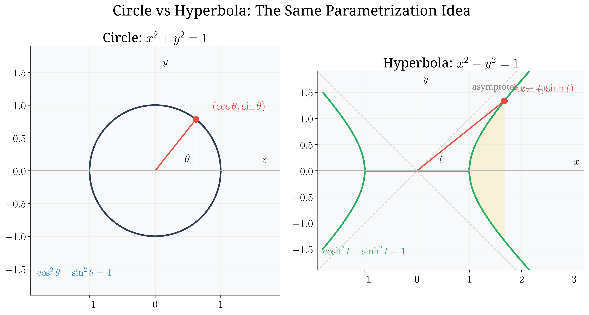
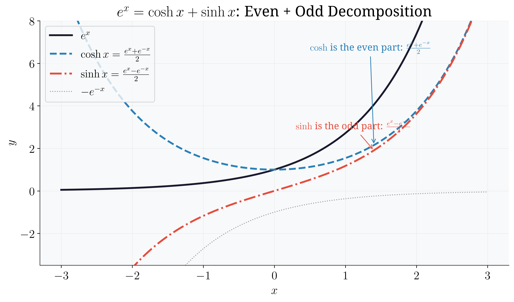
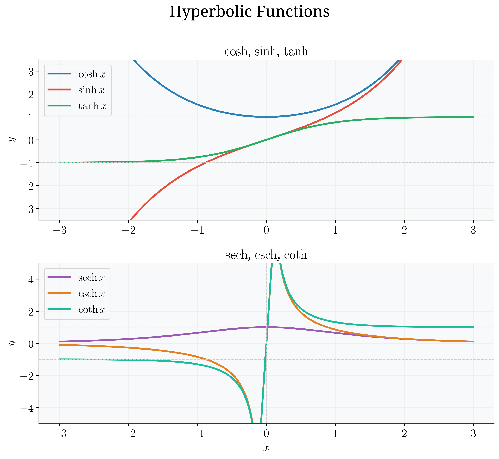
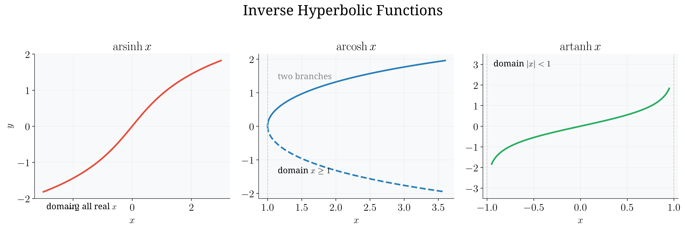
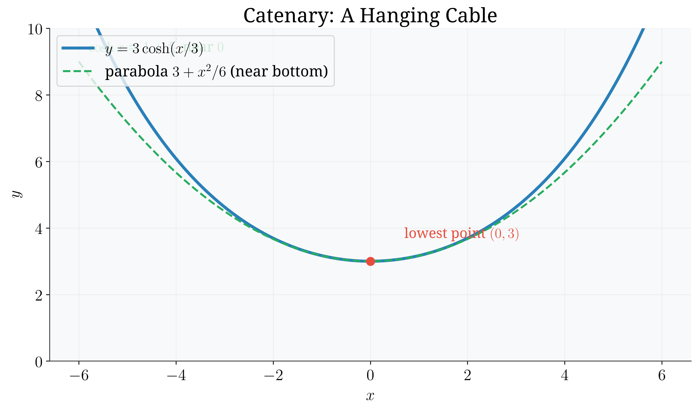

# Session 11C: Hyperbolic Functions — The Trigonometric Functions of a Hyperbola

**Phase 2 — Classical Techniques | 90 min**

*Prerequisites: 11A (trig foundations), 11B (identities, Euler's formula), 10A (exponentials & logarithms)*

> Trigonometric functions came from the circle. Hyperbolic functions come from the hyperbola — yet they are built from nothing but $e^x$ (10A) and obey identities that mirror everything from 11B. Where 11B ended with Euler's formula $e^{i\theta} = \cos\theta + i\sin\theta$, 11C starts with its no-$i$ twin: $e^x = \cosh x + \sinh x$. Same algebra, parallel universe.

> 💡 **Stuck?** Every problem has a collapsible **Hint** below it — click it only when you need a nudge.

---

## Part A: Definitions — The Hyperbola's Trigonometry

---

## Example 1: The Analogy — Circle vs Hyperbola

The unit circle is $x^2 + y^2 = 1$. The **unit hyperbola** is $x^2 - y^2 = 1$.

Just as $(\cos\theta,\, \sin\theta)$ parametrizes the circle, the pair $(\cosh t,\, \sinh t)$ parametrizes the **right branch** of the hyperbola. The number $t$ is not an ordinary angle — it is a **hyperbolic angle**: for the circle, the parameter $\theta$ (in radians) equals the arc length and twice the sector area; for the hyperbola, $t$ equals twice the sector area (there is no arc-length version — the hyperbola has infinite length).

**The parallel that matters**:
- Every point on the circle satisfies $\cos^2\theta + \sin^2\theta = 1$.
- Every point on the hyperbola satisfies $\cosh^2 t - \sinh^2 t = 1$.



*Graph 11C-1: Left — the unit circle $x^2+y^2=1$ with point $(\cos\theta,\sin\theta)$. Right — the unit hyperbola $x^2-y^2=1$ with point $(\cosh t,\sinh t)$. The shaded sector has area $t/2$ on both sides.*

> **Geometric insight**: The minus sign in $x^2 - y^2 = 1$ is the whole story. It flips a circle into a hyperbola, and every identity in 11C will inherit that single sign change.

---

## Example 2: Definitions via $e^x$ — The Six Hyperbolic Functions (🔗 10A)

$$\cosh x = \frac{e^x + e^{-x}}{2} \qquad \sinh x = \frac{e^x - e^{-x}}{2}$$

(Read: "kosh", "sinch". The rest: "tanch", "setch", "cosetch", "cotanch".)

$$\tanh x = \frac{\sinh x}{\cosh x}, \qquad \operatorname{sech} x = \frac{1}{\cosh x}, \qquad \operatorname{csch} x = \frac{1}{\sinh x}, \qquad \coth x = \frac{\cosh x}{\sinh x}.$$

**Two consequences drop out immediately:**

**(1) $e^x$ splits into $\cosh + \sinh$** — add the definitions:
$$e^x = \cosh x + \sinh x, \qquad e^{-x} = \cosh x - \sinh x.$$

Compare with 11B's Euler formula: $e^{i\theta} = \cos\theta + i\sin\theta$. Same pattern, **no $i$**.

**(2) The core identity** — square and subtract:
$$\cosh^2 x - \sinh^2 x = \frac{e^{2x} + 2 + e^{-2x}}{4} - \frac{e^{2x} - 2 + e^{-2x}}{4} = \frac{4}{4} = 1.$$

**Parity**: $\cosh(-x) = \cosh x$ (even), $\sinh(-x) = -\sinh x$ (odd), $\tanh$ odd. And $\cosh 0 = 1$, $\sinh 0 = 0$, $\tanh 0 = 0$.



*Graph 11C-2: Every function splits into an even part $\frac{f(x)+f(-x)}{2}$ and an odd part $\frac{f(x)-f(-x)}{2}$. For $f(x)=e^x$, those halves are exactly $\cosh x$ and $\sinh x$.*

> **Geometric insight**: $\cosh$ is the even half of $e^x$; $\sinh$ is the odd half. Removing the $i$ from Euler's formula un-bounds the functions: $\sinh$ and $\cosh$ grow exponentially, while $\sin$ and $\cos$ stay trapped in $[-1,1]$.

---

## Example 3: Values and Graphs

| function | parity | range | special values | behavior |
|:---:|:---:|:---:|:---:|------|
| $\cosh x$ | even | $[1, \infty)$ | $\cosh 0 = 1$ | grows like $\frac{1}{2}e^x$ |
| $\sinh x$ | odd | $\mathbb{R}$ | $\sinh 0 = 0$ | grows like $\pm\frac{1}{2}e^{\pm x}$ |
| $\tanh x$ | odd | $(-1, 1)$ | $\tanh 0 = 0$ | $\to \pm 1$ as $x \to \pm\infty$ |
| $\operatorname{sech} x$ | even | $(0, 1]$ | $\operatorname{sech} 0 = 1$ | $\to 0$ as $x\to\pm\infty$ |
| $\operatorname{csch} x$ | odd | $\mathbb{R}\setminus\{0\}$ | — | blows up at $x=0$ |
| $\coth x$ | odd | $(-\infty,-1)\cup(1,\infty)$ | — | blows up at $x=0$; $\to\pm1$ |



*Graph 11C-3: Top — $\cosh x$ (even, dips to 1 at the origin), $\sinh x$ (odd, through the origin), $\tanh x$ (odd, between $-1$ and $1$). Bottom — the reciprocal functions with their asymptote at $x=0$.*

> **Geometric insight**: Only $\tanh$ (and $\coth$) are bounded. The graph of $\tanh$ is a smooth "S" — a compressed version of the shape you get by gluing two horizontal asymptotes with one vertical step.

---

## Part B: Identities — The Parallel Universe

---

## Example 4: The Core Identity and Its Family (🔗 11B)

Every identity from 11B has a hyperbolic twin. The pattern: **every minus sign in the trig column becomes a plus in the hyperbolic column — exactly when a product of two sines is involved.**

| 11B (trig) | 11C (hyperbolic) |
|:---|:---|
| $\cos^2\theta + \sin^2\theta = 1$ | $\cosh^2 x - \sinh^2 x = 1$ |
| $\cos 2\theta = \cos^2\theta - \sin^2\theta$ | $\cosh 2x = \cosh^2 x + \sinh^2 x$ |
| $\sin 2\theta = 2\sin\theta\cos\theta$ | $\sinh 2x = 2\sinh x\cosh x$ |
| $1 + \tan^2\theta = \sec^2\theta$ | $1 - \tanh^2 x = \operatorname{sech}^2 x$ |
| $\cot^2\theta + 1 = \csc^2\theta$ | $\coth^2 x - 1 = \operatorname{csch}^2 x$ |

**Deriving $\cosh 2x$ from scratch** (the sign is the only change):

$\cosh 2x = \cosh^2 x + \sinh^2 x = 2\cosh^2 x - 1 = 1 + 2\sinh^2 x$.

> **Geometric insight**: Trig identities live on a circle where $\sin^2 + \cos^2 = 1$; hyperbolic identities live on a hyperbola where $\cosh^2 - \sinh^2 = 1$. One sign carries all the difference.

---

## Example 5: Addition Formulas — $e^x = \cosh x + \sinh x$ (🔗 11B Example 14)

11B derived the sum formulas from $e^{i(A+B)} = e^{iA}e^{iB}$. Do the same with $e^{x+y} = e^x e^y$:

$$e^{x+y} = (\cosh x + \sinh x)(\cosh y + \sinh y) = \underbrace{(\cosh x\cosh y + \sinh x\sinh y)}_{\text{even part}} + \underbrace{(\sinh x\cosh y + \cosh x\sinh y)}_{\text{odd part}}.$$

Matching even and odd parts:

$$\sinh(x+y) = \sinh x\cosh y + \cosh x\sinh y \qquad \text{— same as } \sin(A+B).$$
$$\cosh(x+y) = \cosh x\cosh y + \sinh x\sinh y \qquad \text{— note the } \mathbf{+} \text{ (trig uses } - \text{).}$$

**Difference versions**: replace $y$ with $-y$ (using parity): $\sinh(x-y) = \sinh x\cosh y - \cosh x\sinh y$; $\cosh(x-y) = \cosh x\cosh y - \sinh x\sinh y$.

> **Geometric insight**: Only $\sinh$ "remembers" its oddness in the cross terms. $\cosh$ is even, so its formula must be symmetric in $x, y$ — forcing the plus sign.

---

## Example 6: Osborne's Rule — Trig to Hyperbolic in One Step

**Osborne's rule**: Take any identity from 11B. Replace $\sin \to \sinh$, $\cos \to \cosh$, $\tan \to \tanh$ (and reciprocals accordingly). Then **flip the sign of every term that is a product of two sines**.

**Why it works**: from Euler's formula, $\cos(ix) = \cosh x$ and $\sin(ix) = i\sinh x$. Substituting $\theta = ix$ into a trig identity, each $\sin$ contributes an $i$ — so a term containing a product of two sines picks up $i^2 = -1$.

**Examples:**
- $\sin(A+B) = \sin A\cos B + \cos A\sin B$ — each term has one sine → no flip → $\sinh(A+B) = \sinh A\cosh B + \cosh A\sinh B$. ✓
- $\cos 2\theta = \cos^2\theta - \sin^2\theta$ — the $-\sin^2$ term is a product of two sines → flip → $\cosh 2x = \cosh^2 x + \sinh^2 x$. ✓
- $1 + \tan^2\theta = \sec^2\theta$ — $\tan^2\theta$ hides a product of two sines ($\sin^2\theta/\cos^2\theta$) → flip → $1 - \tanh^2 x = \operatorname{sech}^2 x$. ✓

> **Geometric insight**: The rule is a shortcut for the $i$'s. Every time a trig identity "uses" a pair of sines, the hyperbola's minus sign flips it.

---

## Example 7: Inverse Hyperbolic Functions — Logarithmic Forms (🔗 11A)

Just as $\arcsin$ asks "what angle gives this sine?", $\operatorname{arsinh}$ asks "what input $x$ gives this hyperbolic value?"

**Derive $\operatorname{arsinh}$**: solve $y = \sinh x = \frac{e^x - e^{-x}}{2}$ for $x$:

$2y = e^x - e^{-x}$ → multiply by $e^x$: $e^{2x} - 2y e^x - 1 = 0$ → $e^x = y \pm \sqrt{y^2 + 1}$.

Since $e^x > 0$ and $y - \sqrt{y^2+1} < 0$, take the $+$: $x = \ln\left(y + \sqrt{y^2+1}\right)$.

$$\operatorname{arsinh} x = \ln\left(x + \sqrt{x^2+1}\right), \qquad \text{domain } \mathbb{R}.$$

**The other two** (same trick):
$$\operatorname{arcosh} x = \ln\left(x + \sqrt{x^2-1}\right), \qquad \text{domain } x \ge 1 \text{ (principal: } x \ge 0 \text{ branch)}.$$
$$\operatorname{artanh} x = \frac{1}{2}\ln\left(\frac{1+x}{1-x}\right), \qquad \text{domain } |x| < 1.$$



*Graph 11C-4: $\operatorname{arsinh} x$ (all reals), $\operatorname{arcosh} x$ (only $x\ge1$, two branches), $\operatorname{artanh} x$ (only $|x|<1$, blows up at $\pm1$).*

> **Geometric insight**: Unlike $\arcsin$/$\arccos$ (which are bounded because $\sin$/$\cos$ are bounded), $\operatorname{arsinh}$ is defined everywhere — because $\sinh$ grows without bound. Domain problems only appear where the original function is bounded ($\cosh \ge 1$, $|\tanh| < 1$).

---

## Part C: Calculus and Applications Preview (🔗 14A, 16A)

---

## Example 8: Derivatives — No Sign Changes

From the definitions, using 14A's rules:

$$\frac{d}{dx}\sinh x = \cosh x, \qquad \frac{d}{dx}\cosh x = \sinh x, \qquad \frac{d}{dx}\tanh x = \operatorname{sech}^2 x.$$

**Compare with trig**: $\frac{d}{dx}\cos x = -\sin x$ has a minus sign; $\frac{d}{dx}\cosh x = \sinh x$ does **not**. The hyperbola's sign change removes the annoying minus from calculus — this is the payoff of the hyperbolic construction.

**Reciprocals** (by the quotient rule):
$$\frac{d}{dx}\operatorname{csch} x = -\operatorname{csch} x\,\coth x, \quad \frac{d}{dx}\operatorname{sech} x = -\operatorname{sech} x\,\tanh x, \quad \frac{d}{dx}\coth x = -\operatorname{csch}^2 x.$$

**Inverse derivatives** (via $\frac{dy}{dx} = 1\big/\frac{dx}{dy}$):
$$\frac{d}{dx}\operatorname{arsinh} x = \frac{1}{\sqrt{x^2+1}}, \qquad \frac{d}{dx}\operatorname{arcosh} x = \frac{1}{\sqrt{x^2-1}}, \qquad \frac{d}{dx}\operatorname{artanh} x = \frac{1}{1-x^2}.$$

> **Geometric insight**: These three inverse-derivative formulas are the "native" answers to $\int \frac{dx}{\sqrt{x^2+1}}$, $\int \frac{dx}{\sqrt{x^2-1}}$, $\int \frac{dx}{1-x^2}$ — integrals that 16A's trig substitution handles with $\tan$, $\sec$, $\sin$. The hyperbolic functions make the answers immediate.

---

## Example 9: Integrals — The Bridge to Trig Substitution (🔗 16A)

$$\int \sinh x\,dx = \cosh x + C, \qquad \int \cosh x\,dx = \sinh x + C, \qquad \int \operatorname{sech}^2 x\,dx = \tanh x + C.$$

And the famous ones (reverse of the inverse derivatives):
$$\int \frac{dx}{\sqrt{x^2+1}} = \operatorname{arsinh} x + C, \qquad \int \frac{dx}{\sqrt{x^2-1}} = \operatorname{arcosh} x + C, \qquad \int \frac{dx}{1-x^2} = \operatorname{artanh} x + C.$$

**Example**: $\displaystyle \int_0^1 \frac{dx}{\sqrt{x^2+1}} = \operatorname{arsinh} 1 - \operatorname{arsinh} 0 = \ln(1+\sqrt{2}) \approx 0.8814$.

> **Geometric insight**: In 16A you will meet these as "trig substitution" integrals. Knowing the hyperbolic route gives you two tools for the same job — choose whichever makes the algebra cleaner.

---

## Example 10: Applications — Catenary and the Sigmoid

**Catenary (hanging cable)**: a chain hanging under its own weight does not form a parabola — it forms $y = a\cosh\left(\frac{x}{a}\right)$. Near the bottom it looks parabolic (why? $\cosh x \approx 1 + \frac{x^2}{2}$), but it turns upward far faster.



*Graph 11C-5: The catenary $y = 3\cosh(x/3)$ with its minimum at $(0,3)$. Compare with a parabola that matches it near the bottom — the catenary rises faster away from the center.*

**Sigmoid (machine learning)**: $y = \tanh x$ has range $(-1,1)$, is increasing, and satisfies
$$y' = 1 - y^2, \qquad y(0) = 0.$$
This is the logistic differential equation (🔗 19) — it models population growth with a carrying capacity of $1$, and $\tanh$ is one of the standard activation functions in neural networks.

> **Geometric insight**: "Where do hyperbolic functions appear in the real world?" — anywhere a quantity saturates (tanh), anything hanging under gravity (cosh), and anything built from two opposing exponentials (sinh: relativistic velocity addition, etc.).

---

## Common Mistakes

### Mistake 1: $\cosh^2 x + \sinh^2 x = 1$

**Wrong.** The identity is $\cosh^2 x - \sinh^2 x = 1$. There is no "hyperbolic unit circle" — the points $(\cosh x, \sinh x)$ lie on the **hyperbola** $x^2 - y^2 = 1$.

### Mistake 2: $\cosh(x+y)$ with a minus sign

$\cosh(x+y) = \cosh x\cosh y + \sinh x\sinh y$ — the sign is **plus**, unlike $\cos(A+B) = \cos A\cos B - \sin A\sin B$. Only $\cosh(x-y)$ has the minus.

### Mistake 3: Forgetting $\cosh x \ge 1$

$\cosh$ never goes below $1$. So $\cosh x = 0$ or $\cosh x = \frac12$ have **no solutions**, while $\sinh x$ can equal anything.

### Mistake 4: Misapplying Osborne's rule

Only **products of two sines** flip sign. $\sin(A+B) = \sin A\cos B + \cos A\sin B$ has single sines — no flip. But $\sin^2\theta$ or $\tan^2\theta$ (which hides a product of two sines) flip.

### Mistake 5: Forgetting the domains of inverse hyperbolics

$\operatorname{arcosh}$ needs $x \ge 1$; $\operatorname{artanh}$ needs $|x| < 1$. $\operatorname{arsinh}$ is the only one defined on all of $\mathbb{R}$.

---

## What We Just Did

```
(1) Hyperbolic = trig of the hyperbola x²−y²=1. (cosh t, sinh t) parametrize it just as
    (cos θ, sin θ) parametrize the circle. t = hyperbolic angle = 2 × sector area.
(2) Built from e^x (10A): cosh x = (e^x+e^−x)/2, sinh x = (e^x−e^−x)/2.
    e^x = cosh x + sinh x — the no-i twin of Euler's formula (11B).
(3) Core identity: cosh²x − sinh²x = 1. cosh is even and cosh x ≥ 1; sinh/tanh are odd.
(4) Addition formulas from e^{x+y} = e^x e^y:
    sinh(x+y) = sinh x cosh y + cosh x sinh y  (same as trig)
    cosh(x+y) = cosh x cosh y + sinh x sinh y  (PLUS — the only change from trig)
(5) Osborne's rule: trig → hyperbolic by sin→sinh, and flip signs on products of two sines.
(6) Inverses: arsinh x = ln(x+√(x²+1)); arcosh x = ln(x+√(x²−1)) for x≥1;
    artanh x = ½ ln((1+x)/(1−x)) for |x|<1.
(7) Calculus (14A/16A): d/dx sinh = cosh, d/dx cosh = sinh, d/dx tanh = sech² — no sign flips.
    ∫ dx/√(x²+1), ∫ dx/√(x²−1), ∫ dx/(1−x²) come out clean via inverse hyperbolics.
(8) Applications: catenary y = a cosh(x/a); tanh = sigmoid, solves y' = 1−y² (logistic, 19).
```

---

## Practice 1

Use the $e^x$ definitions to find exact values: (a) $\cosh(\ln 2)$ (b) $\sinh(\ln 2)$ (c) $\tanh(\ln 2)$. Then verify $\cosh^2(\ln 2) - \sinh^2(\ln 2) = 1$.

<details>
<summary>💡 Hint</summary>

$e^{\ln 2} = 2$ and $e^{-\ln 2} = \frac12$. Plug both into $\cosh x = \frac{e^x+e^{-x}}{2}$ and $\sinh x = \frac{e^x-e^{-x}}{2}$.

</details>

→ Reference: **Example 2**

> Solutions: [Solutions](solutions/11C-solutions.md#practice-1)

---

## Practice 2

Prove from the $e^x$ definitions: (a) $\cosh^2 x - \sinh^2 x = 1$ (b) $\cosh(2x) = \cosh^2 x + \sinh^2 x$.

<details>
<summary>💡 Hint</summary>

For (a), square both definitions and subtract — the cross terms cancel. For (b), start from $\cosh(2x) = \frac{e^{2x}+e^{-2x}}{2}$ and rewrite $e^{2x} = (e^x)^2$ in terms of $\cosh x \pm \sinh x$.

</details>

→ Reference: **Example 2, 5**

> Solutions: [Solutions](solutions/11C-solutions.md#practice-2)

---

## Practice 3

Given $\sinh x = \frac{3}{4}$ with $x > 0$, find $\cosh x$, $\tanh x$, $\operatorname{sech} x$, $\operatorname{csch} x$, and $\coth x$.

<details>
<summary>💡 Hint</summary>

Use the core identity: $\cosh^2 x = 1 + \sinh^2 x = 1 + \frac{9}{16}$. Since $x > 0$, $\cosh x$ is positive — the answer is a nice fraction.

</details>

→ Reference: **Example 4**

> Solutions: [Solutions](solutions/11C-solutions.md#practice-3)

---

## Practice 4

Use Osborne's rule to convert these 11B identities, then verify ONE of them directly from the $e^x$ definitions:
(a) $\sin 2\theta = 2\sin\theta\cos\theta$
(b) $\cos 2\theta = \cos^2\theta - \sin^2\theta$
(c) $1 + \tan^2\theta = \sec^2\theta$

<details>
<summary>💡 Hint</summary>

Which terms are products of two sines? (a) has single sines — no flip. (b) and (c) each hide a product of two sines — flip those signs. Verify (b) using $\cosh 2x = \frac{e^{2x}+e^{-2x}}{2}$.

</details>

→ Reference: **Example 6**

> Solutions: [Solutions](solutions/11C-solutions.md#practice-4)

---

## Practice 5

Solve exactly, giving $\ln$ forms: (a) $\sinh x = 2$ (b) $\tanh x = \frac{1}{2}$ (c) $\cosh x = 3$.

<details>
<summary>💡 Hint</summary>

Use the inverse formulas from Example 7: $\operatorname{arsinh} 2$, $\operatorname{artanh}\frac12$, and $\pm\operatorname{arcosh} 3$. Simplify $\sqrt{4+1}$, $\sqrt{9-1}$, and $\frac{1+1/2}{1-1/2}$.

</details>

→ Reference: **Example 7**

> Solutions: [Solutions](solutions/11C-solutions.md#practice-5)

---

## Practice 6

Differentiate: (a) $\cosh(3x)$ (b) $\sinh(x^2)$ (c) $\tanh x$ (d) $\ln(\cosh x)$.

<details>
<summary>💡 Hint</summary>

Chain rule (14A): (a) $3\sinh(3x)$. (d) $\frac{d}{dx}\ln(\cosh x) = \frac{\sinh x}{\cosh x}$ — what is that ratio?

</details>

→ Reference: **Example 8**

> Solutions: [Solutions](solutions/11C-solutions.md#practice-6)

---

## Practice 7

Evaluate: (a) $\int \sinh(2x)\,dx$ (b) $\int \operatorname{sech}^2(3x)\,dx$ (c) $\int_0^1 \frac{dx}{\sqrt{x^2+1}}$.

<details>
<summary>💡 Hint</summary>

(a), (b): guess-and-check with the derivative table (adjust for the inner $2x$ and $3x$). (c): recognize $\int \frac{dx}{\sqrt{x^2+1}} = \operatorname{arsinh} x$, then write the answer as $\ln(1+\sqrt2)$.

</details>

→ Reference: **Example 9**

> Solutions: [Solutions](solutions/11C-solutions.md#practice-7)

---

## Practice 8: Real Battle

(a) Show that $y = \tanh x$ satisfies $y' = 1 - y^2$ with $y(0) = 0$ — the logistic equation (🔗 19).
(b) A cable hangs as $y = 3\cosh\left(\frac{x}{3}\right)$ for $x \in [-3, 3]$. Find the lowest height, the height at the two ends, and the slope of the cable at $x = 3$.

<details>
<summary>💡 Hint</summary>

(a) $y' = \operatorname{sech}^2 x = 1 - \tanh^2 x$. (b) Lowest point at $x=0$ where $\cosh 0 = 1$. Ends at $x=\pm 3$: $3\cosh(1)$. Slope = $y' = \sinh\left(\frac{x}{3}\right)$ (chain rule).

</details>

→ Reference: **Example 8, 10**

> Solutions: [Solutions](solutions/11C-solutions.md#practice-8)

---

## Basic Drills

> Pure fluency. Instant recall of definitions and values.

**D1.** $\cosh 0$, $\sinh 0$, $\tanh 0$ — what are they?

**D2.** Compute $\cosh(\ln 2)$ and $\sinh(\ln 2)$ exactly.

**D3.** $\cosh^2 x - \sinh^2 x = ?$ (always)

**D4.** Write $e^x$ and $e^{-x}$ in terms of $\cosh x$ and $\sinh x$.

**D5.** True or false: $\cosh x \ge 1$ for all real $x$.

**D6.** Compute $\sinh(2\ln 2)$ exactly (double-angle or definition).

**D7.** $\displaystyle \lim_{x\to\infty}\tanh x = ?$ And as $x \to -\infty$?

**D8.** Simplify $\operatorname{sech}^2 x + \tanh^2 x$.

**D9.** $\operatorname{arsinh} 0 = ?$ and $\operatorname{artanh} 0 = ?$

**D10.** $\frac{d}{dx}\sinh x$ and $\frac{d}{dx}\cosh x$.

> Solutions: [Solutions](solutions/11C-solutions.md#basic-drill)

---

## Advanced Drills

> Chains 2–3 techniques. Covers identities, equations, inverses, and the calculus preview.

**A1.** Prove $\cosh(x+y) = \cosh x\cosh y + \sinh x\sinh y$ directly from the $e^x$ definitions.

<details>
<summary>💡 Hint</summary>

Multiply out $\frac{(e^x+e^{-x})(e^y+e^{-y}) + (e^x-e^{-x})(e^y-e^{-y})}{4}$ and collect the four $e$-terms.

</details>

**A2.** Derive $\tanh(x+y) = \frac{\tanh x + \tanh y}{1 + \tanh x\,\tanh y}$ using Osborne's rule or the $\sinh$/$\cosh$ addition formulas.

<details>
<summary>💡 Hint</summary>

Divide $\sinh(x+y)$ by $\cosh(x+y)$ and divide top and bottom by $\cosh x\cosh y$.

</details>

**A3.** Solve $\cosh x = 2$ for all real $x$. Give exact $\ln$ forms. What is the minimum value of $\cosh x$?

<details>
<summary>💡 Hint</summary>

$\operatorname{arcosh} 2 = \ln(2 + \sqrt{3})$. Since $\cosh$ is even, both $x$ and $-x$ work.

</details>

**A4.** Show $\sinh(3x) = 3\sinh x + 4\sinh^3 x$. Compare with $\sin 3\theta = 3\sin\theta - 4\sin^3\theta$ — which sign changed and why?

<details>
<summary>💡 Hint</summary>

Start from $\sinh(3x) = \sinh(2x+x)$ and use both addition and double-angle formulas. Compare the two signs: Osborne's rule says a product of three sines is odd.

</details>

**A5.** Derive $\operatorname{arsinh} x = \ln\left(x + \sqrt{x^2+1}\right)$ by solving $y = \sinh x$ for $x$.

<details>
<summary>💡 Hint</summary>

$2y = e^x - e^{-x}$; multiply by $e^x$ to get a quadratic in $e^x$. Discard the negative root since $e^x > 0$.

</details>

**A6.** Sketch $y = \tanh x$ and $y = \coth x$ on the same axes. Label all horizontal and vertical asymptotes, and the $y$-intercept.

<details>
<summary>💡 Hint</summary>

$\tanh$: between $y=\pm1$, passes through the origin. $\coth = 1/\tanh$: blows up at $x=0$, approaches $\pm1$ at the ends — note the gap between $-1$ and $1$.

</details>

**A7.** Differentiate $\operatorname{arsinh} x$ using the chain rule (14A) and show the result is $\frac{1}{\sqrt{x^2+1}}$.

<details>
<summary>💡 Hint</summary>

$\frac{d}{dx}\ln(x+\sqrt{x^2+1}) = \frac{1 + x/\sqrt{x^2+1}}{x+\sqrt{x^2+1}}$. Combine the numerator over one fraction and cancel.

</details>

**A8.** A cable hangs as $y = a\cosh\left(\frac{x}{a}\right)$. (a) What is the lowest point? (b) What is the height at $x = a$? (c) What is the slope at $x = a$?

<details>
<summary>💡 Hint</summary>

Lowest point at $x=0$: $y = a\cosh 0 = a$. Height at $x=a$: $a\cosh 1$. Slope: $y' = \sinh(x/a)$.

</details>

**A9.** Evaluate $\displaystyle \int_0^1 \frac{dx}{\sqrt{x^2+1}}$ exactly.

<details>
<summary>💡 Hint</summary>

$\int \frac{dx}{\sqrt{x^2+1}} = \operatorname{arsinh} x$; then $\operatorname{arsinh} 1 = \ln(1+\sqrt2)$.

</details>

**A10.** Prove $\cosh(2x) = 1 + 2\sinh^2 x$ and use it to find all real $x$ with $\cosh(2x) = 2$. Give exact answers.

<details>
<summary>💡 Hint</summary>

$\cosh 2x = 2\cosh^2x - 1 = 1 + 2\sinh^2x$. Setting this equal to $2$ gives $\sinh x = \pm\frac{1}{\sqrt2}$, so $x = \pm\operatorname{arsinh}\frac{1}{\sqrt2}$.

</details>

> Solutions: [Solutions](solutions/11C-solutions.md#advanced-drill)

---

## Today's Procedure

```
Step 1: Definitions — cosh x = (e^x+e^−x)/2, sinh x = (e^x−e^−x)/2. tanh = sinh/cosh.
         e^x = cosh x + sinh x. cosh even, ≥1; sinh/tanh odd.

Step 2: Identities — cosh²x − sinh²x = 1. Addition: sinh(x±y), cosh(x±y) (the + sign!).
         Double/half angle. For ANY 11B identity, apply Osborne's rule:
         sin→sinh and flip the sign of products of two sines.

Step 3: Inverses — arsinh x = ln(x+√(x²+1)) (all x). arcosh x = ln(x+√(x²−1)) (x≥1).
         artanh x = ½ln((1+x)/(1−x)) (|x|<1). To solve, use the log forms.

Step 4: Calculus (14A/16A) — d/dx sinh = cosh, cosh = sinh, tanh = sech² (no minus signs!).
         ∫ dx/√(x²+1) = arsinh, ∫ dx/√(x²−1) = arcosh, ∫ dx/(1−x²) = artanh.

Step 5: Recognize — catenary: y = a cosh(x/a). Sigmoid/logistic: y = tanh x, y' = 1−y².
```

---

## How to Read These Symbols

| Symbol | Reads as | Meaning |
|:---:|:---:|------|
| $\cosh x$ | "kosh x" / hyperbolic cosine | $\frac{e^x+e^{-x}}{2}$ — the even half of $e^x$ |
| $\sinh x$ | "sinch x" / hyperbolic sine | $\frac{e^x-e^{-x}}{2}$ — the odd half of $e^x$ |
| $\tanh x$ | "tanch x" | $\sinh x/\cosh x$ — range $(-1,1)$, like a smoothed step |
| $\operatorname{sech} x$ | "setch x" | $1/\cosh x$ — range $(0,1]$ |
| $\operatorname{csch} x$ | "cosetch x" | $1/\sinh x$ |
| $\coth x$ | "cotanch x" | $1/\tanh x$ |
| $\operatorname{arsinh} x$ | "a r sinch x" | inverse hyperbolic sine: $\ln(x+\sqrt{x^2+1})$ |
| $\operatorname{arcosh} x$ | "a r kosh x" | inverse hyperbolic cosine: $\ln(x+\sqrt{x^2-1})$, $x\ge1$ |
| $\operatorname{artanh} x$ | "a r tanch x" | inverse hyperbolic tangent: $\frac12\ln\frac{1+x}{1-x}$, $\lvert x\rvert<1$ |
| $e^x = \cosh x + \sinh x$ | "e to the x equals kosh plus sinch" | the no-$i$ twin of Euler's formula from 11B |
| Osborne's rule | "Osborne's rule" | trig → hyperbolic by $\sin\to\sinh$, flipping products of two sines |
| catenary | "catenary" | hanging-cable curve $y = a\cosh(x/a)$ |
| sigmoid | "sigmoid" | S-shaped curve; $\tanh$ is a standard one, solving $y'=1-y^2$ |

---

## Terminology

| What we call it | Math term | Notation |
|:---:|:---:|:---:|
| the trig of the hyperbola | hyperbolic functions | $\cosh, \sinh, \tanh, \operatorname{sech}, \operatorname{csch}, \coth$ |
| sector parameter on the hyperbola | hyperbolic angle | $t$ in $(\cosh t, \sinh t)$ |
| parallel version of a trig identity | hyperbolic identity | $\cosh^2-\sinh^2=1$, addition formulas |
| flipping trig identities into hyperbolic ones | Osborne's rule | $\sin\to\sinh$; flip products of two sines |
| inverse of a hyperbolic function | inverse hyperbolic function | $\operatorname{arsinh}, \operatorname{arcosh}, \operatorname{artanh}$ |
| shape of a hanging chain | catenary | $y = a\cosh(x/a)$ |
| S-shaped activation function | sigmoid / logistic curve | $y = \tanh x$, $y' = 1-y^2$ |
