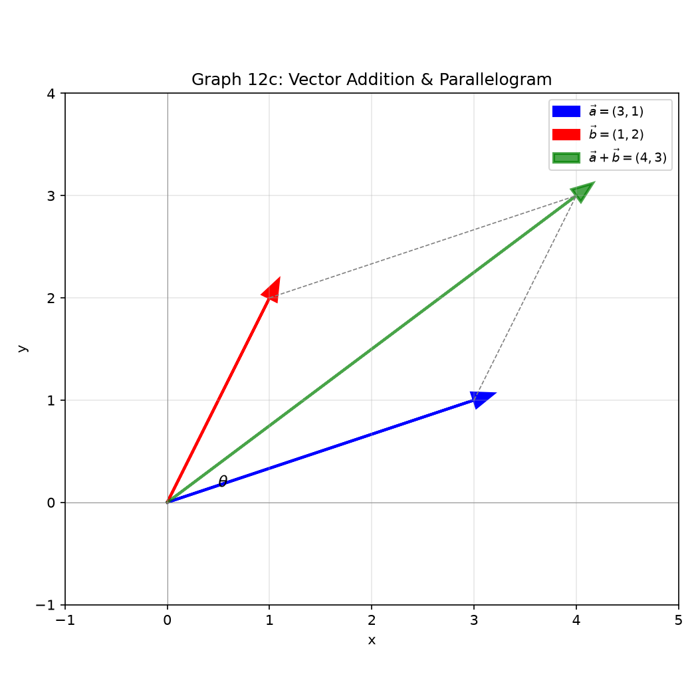

# 세션 12: 복소수·벡터·수열 — 셋을 한 방에

**Phase 2 — 고전 테크닉 | 90분**

---

## Part A: 복소수 — 허수를 품은 수

---

## 예시 1: $i$와 그 거듭제곱

$i^2 = -1$. $i^3 = -i$. $i^4 = 1$. $i^5 = i$.

**순환**: $i \to -1 \to -i \to 1 \to i \to \cdots$ (4마다 반복).

$i^{50} = (i^4)^{12} \cdot i^2 = 1^{12} \cdot (-1) = -1$.
$i^{101} = i^{4\cdot25+1} = i$.

$\sqrt{-9} = 3i$. $\sqrt{-8} = 2\sqrt{2}i$.

---

## 예시 2: 복소수 사칙연산

$z_1 = 2+3i$, $z_2 = 1-5i$.

**더하기**: 실수끼리, 허수끼리 → $(2+1)+(3-5)i = 3-2i$.

**곱하기**: 분배법칙, $i^2=-1$.
$(2+3i)(1-5i) = 2-10i+3i-15i^2 = 2-7i+15 = 17-7i$.

**나누기**: 분모의 켤레 곱하기.
$\frac{2+3i}{1-5i} \cdot \frac{1+5i}{1+5i} = \frac{-13+13i}{26} = -\frac{1}{2} + \frac{1}{2}i$.

---

## 예시 3: 켤레와 크기(모듈러스)

$z = a+bi$. **켤레** $\bar{z} = a-bi$. **크기** $|z| = \sqrt{a^2+b^2}$.

$z = 3+4i$: $\bar{z}=3-4i$, $|z|=\sqrt{9+16}=5$.

$z\cdot\bar{z} = a^2+b^2 = |z|^2$. 확인: $(3+4i)(3-4i) = 9+16 = 25$.
$\overline{z_1 z_2} = \bar{z_1}\bar{z_2}$.

---

## 예시 4: 복소평면과 극형식

복소수 $a+bi$를 점 $(a,b)$로. $r = |z|$ (원점 거리), $\theta$ = $x$축과의 각(편각).

$a = r\cos\theta$, $b = r\sin\theta$. → **극형식**: $z = r(\cos\theta + i\sin\theta)$.

$z = 1 + i\sqrt{3}$:
$r = \sqrt{1+3} = 2$. $\cos\theta=\frac{1}{2}$, $\sin\theta=\frac{\sqrt{3}}{2}$ → $\theta = \frac{\pi}{3}$.
→ $z = 2(\cos\frac{\pi}{3} + i\sin\frac{\pi}{3})$.

$z = -1 + i$: $r = \sqrt{2}$, $\theta = \frac{3\pi}{4}$.


---

## 예시 5: 오일러 공식과 드무아브르

**오일러 공식**: $e^{i\theta} = \cos\theta + i\sin\theta$.
→ 극형식 = $re^{i\theta}$.

$1+i\sqrt{3} = 2e^{i\pi/3}$. $e^{i\pi} = \cos\pi + i\sin\pi = -1$. → $e^{i\pi}+1=0$.

**드무아브르**: $z^n = r^n(\cos n\theta + i\sin n\theta) = r^n e^{in\theta}$.

$(1+i)^6$: $r=\sqrt{2}$, $\theta=\frac{\pi}{4}$.
$= (\sqrt{2})^6 e^{i\cdot6\pi/4} = 8e^{i\cdot3\pi/2} = 8(0 - i) = -8i$.


---

## 예시 6: 1의 $n$제곱근

$z^4 = 1$의 네 근.
$1 = e^{i\cdot0}$. $z_k = 1^{1/4} e^{i\cdot2\pi k/4}$, $k=0,1,2,3$.
→ $1, i, -1, -i$. 복소평면에 정사각형.

$z^3 = -8 = 8e^{i\pi}$.
$z_k = 2e^{i(\pi+2\pi k)/3}$.
$k=0$: $2e^{i\pi/3} = 1+i\sqrt{3}$.
$k=1$: $2e^{i\pi} = -2$.
$k=2$: $2e^{i\cdot5\pi/3} = 1-i\sqrt{3}$.


> **여기까지**: $i^2=-1$, 4순환. 켤레·크기. 극형식과 오일러 공식 $re^{i\theta}$.
> 드무아브르로 거듭제곱 한 방. $n$제곱근은 $n$개, 원 위에 균등 분포.

---

## Part B: 벡터 — 방향과 크기

---

## 예시 7: 벡터 연산과 크기

$\vec{a} = (3,4)$. 크기 $|\vec{a}| = \sqrt{9+16} = 5$.
$\vec{a}+\vec{b} = (a_1+b_1, a_2+b_2)$. $k\vec{a} = (ka_1, ka_2)$.

단위벡터: $\hat{a} = \frac{\vec{a}}{|\vec{a}|} = (\frac{3}{5}, \frac{4}{5})$.

---

## 예시 8: 내적 — 각도와 수직 판정

$\vec{a}\cdot\vec{b} = a_1b_1 + a_2b_2 = |\vec{a}||\vec{b}|\cos\theta$.

$(3,4)\cdot(1,2) = 3+8 = 11$.
$\cos\theta = \frac{11}{5\cdot\sqrt{5}} = \frac{11}{5\sqrt{5}}$. $\theta \approx 10.3^\circ$.

내적=0 → 수직. $(3,4)\cdot(-4,3) = -12+12 = 0$.

---

## 예시 9: 벡터 투영(projection)

$\vec{a}$의 $\vec{b}$ 위로의 **스칼라 투영**: $\text{comp}_{\vec{b}}\vec{a} = \frac{\vec{a}\cdot\vec{b}}{|\vec{b}|}$.
**벡터 투영**: $\text{proj}_{\vec{b}}\vec{a} = \frac{\vec{a}\cdot\vec{b}}{|\vec{b}|^2}\vec{b}$.

$\vec{a}=(3,4)$, $\vec{b}=(1,0)$.
스칼라 투영: $\frac{3}{1} = 3$ (그림자 길이).
벡터 투영: $3(1,0) = (3,0)$.

---

## 예시 10: 외적 — 3D 전용, 수직 벡터

$\vec{a}\times\vec{b} = (a_2b_3-a_3b_2,\; a_3b_1-a_1b_3,\; a_1b_2-a_2b_1)$.

$(1,0,0)\times(0,1,0) = (0,0,1)$ (오른손 법칙).

$|\vec{a}\times\vec{b}| = |\vec{a}||\vec{b}|\sin\theta$ = 평행사변형 넓이.

---

## 예시 11: 벡터로 기하 문제 풀기

**삼각형 넓이**: $\frac{1}{2}|\vec{AB}\times\vec{AC}|$.
$\vec{AB}=(3,1)$, $\vec{AC}=(1,4)$ → 외적 크기(2D) = $|3\cdot4-1\cdot1| = 11$. 넓이 = $\frac{11}{2}$.

**점과 직선 거리**: 직선 $\vec{r}=\vec{p}+t\vec{d}$, 점 $Q$까지 거리.
$d = \frac{|\vec{d}\times(\vec{Q}-\vec{p})|}{|\vec{d}|}$.

점 $(5,7)$에서 직선 $(1,2)+t(3,4)$까지: 미룸 (벡터 크기로 계산).



> **여기까지**: 벡터 성분 연산. 내적=각+수직. 투영. 외적(3D)=수직벡터+넓이.

---

## Part C: 수열 — 규칙으로 수를 줄 세운다

---

## 예시 12: 등차수열 — 같은 수를 계속 더한다

첫 항이 3이다. 매번 2씩 더한다.
항을 죽 써본다: 3, 5, 7, 9, 11, 13, ...

**n번째 항 구하기**:
① 첫 항 $a_1$을 확인한다. → 3.
② 공차 $d$ (매번 더하는 값)를 확인한다. → 2.
③ $n-1$번 더했으므로 $a_n = a_1 + (n-1)d$.

손으로: 10번째 항 = $3 + 9 \times 2 = 3 + 18 = 21$.
100번째 항 = $3 + 99 \times 2 = 201$.

**합 구하기 — 두 가지 방법**:
방법1: $S_n = \frac{n(a_1 + a_n)}{2}$. 처음+끝을 $n$번 더해 반으로.
방법2: $S_n = \frac{n}{2}[2a_1 + (n-1)d]$. 첫 항과 공차로 바로.

손으로: 첫 10항 합.
방법1: $S_{10} = \frac{10(3 + 21)}{2} = \frac{10 \times 24}{2} = 120$.
방법2: $S_{10} = \frac{10}{2}[2\cdot3 + 9\cdot2] = 5[6+18] = 120$. 같다.

---

## 예시 13: 등비수열 — 같은 수를 계속 곱한다

첫 항이 2다. 매번 3을 곱한다.
항을 죽 써본다: 2, 6, 18, 54, 162, ...

**n번째 항 구하기**:
① 첫 항 $a_1$을 확인한다. → 2.
② 공비 $r$ (매번 곱하는 값)를 확인한다. → 3.
③ $n-1$번 곱했으므로 $a_n = a_1 \cdot r^{n-1}$.

손으로: 5번째 항 = $2 \times 3^4 = 2 \times 81 = 162$.

**합 구하기**: $S_n = a_1\frac{1-r^n}{1-r}$ ($r \neq 1$).
손으로: 첫 5항 합.
$S_5 = 2 \cdot \frac{1-3^5}{1-3} = 2 \cdot \frac{1-243}{-2} = 2 \cdot \frac{-242}{-2} = 242$.
검산: $2+6+18+54+162 = 242$. 딱 맞다.

**무한등비합 — 끝없이 더해도 유한한 값**:
조건: $|r| < 1$ (공비의 절댓값이 1보다 작아야).
공식: $S_\infty = \frac{a_1}{1-r}$.

$2 + 1 + \frac{1}{2} + \frac{1}{4} + \cdots$
① $a_1=2$, $r=\frac{1}{2}$.
② $S_\infty = \frac{2}{1-\frac{1}{2}} = \frac{2}{\frac{1}{2}} = 4$.

$0.\dot{9} = 0.999\ldots$
① $0.999\ldots = \frac{9}{10} + \frac{9}{100} + \frac{9}{1000} + \cdots$
② $a_1 = \frac{9}{10}$, $r = \frac{1}{10}$.
③ $S_\infty = \frac{9/10}{1-1/10} = \frac{9/10}{9/10} = 1$. → $0.\dot{9}=1$.

---

## 예시 14: $\sum$ 기호 — 합을 짧게 쓴다

$\sum_{k=1}^{n} a_k$ = "$k$에 1부터 $n$까지 넣은 $a_k$를 전부 더한다."

$\sum_{k=1}^{5} k = 1+2+3+4+5 = 15$.
$\sum_{k=1}^{4} k^2 = 1+4+9+16 = 30$.

**세 가지 필수 공식 — 손에 새긴다**:
① $\sum_{k=1}^{n} k = \frac{n(n+1)}{2}$.
   $1$부터 $100$까지 = $\frac{100\cdot101}{2} = 5050$.

② $\sum_{k=1}^{n} k^2 = \frac{n(n+1)(2n+1)}{6}$.
   $1^2$부터 $10^2$까지 = $\frac{10\cdot11\cdot21}{6} = \frac{2310}{6} = 385$.

③ $\sum_{k=1}^{n} k^3 = \left(\frac{n(n+1)}{2}\right)^2 = (\sum k)^2$.
   $1^3$부터 $5^3$까지 = $15^2 = 225$.
   확인: $1+8+27+64+125 = 225$.

**홀수의 합**: $\sum(2k-1) = 2\sum k - \sum 1 = n(n+1) - n = n^2$.
$1+3+5+7+9 = 25 = 5^2$. 홀수 $n$개 합 = $n^2$.

---

## 예시 15: $S_n$으로 $a_n$을 찾아낸다

$S_n$ = 첫 $n$항까지의 합.

**규칙**:
① 첫 항은 따로: $a_1 = S_1$.
② $n \geq 2$일 때: $a_n = S_n - S_{n-1}$. (합에서 이전 합을 뺀다)

손으로 실험 — $S_n = n^2$인 수열.
① $a_1 = S_1 = 1$.
② $a_2 = S_2 - S_1 = 4 - 1 = 3$.
③ $a_3 = S_3 - S_2 = 9 - 4 = 5$.
④ $a_n = n^2 - (n-1)^2 = n^2 - (n^2-2n+1) = 2n-1$.
→ $1, 3, 5, 7, \dots$ 등차수열이다!

$S_n = 2^n - 1$인 수열.
① $a_1 = S_1 = 1$.
② $a_n = (2^n-1) - (2^{n-1}-1) = 2^n - 2^{n-1} = 2^{n-1}$.
→ $1, 2, 4, 8, \dots$ 등비수열이다!

> **여기까지**: 등차는 $+d$로 가고 합은 $\frac{n(a_1+a_n)}{2}$.
> 등비는 $\times r$로 가고 합은 $a_1\frac{1-r^n}{1-r}$.
> $\sum k,\sum k^2,\sum k^3$ 공식 3개. $S_n \to a_n$ 변환.

---

## 예시 16: 텔레스코핑 — 가운데 항이 싹 지워진다

$\sum_{k=1}^{n} \frac{1}{k(k+1)}$을 구한다.

① 부분분수로 찢는다: $\frac{1}{k(k+1)} = \frac{1}{k} - \frac{1}{k+1}$.
② 항을 죽 늘어놓는다:
$k=1$: $\frac{1}{1} - \frac{1}{2}$.
$k=2$: $\frac{1}{2} - \frac{1}{3}$.
$k=3$: $\frac{1}{3} - \frac{1}{4}$.
$\vdots$
$k=n$: $\frac{1}{n} - \frac{1}{n+1}$.

③ 더하면: $-\frac{1}{2}+\frac{1}{2}$가 지워지고, $-\frac{1}{3}+\frac{1}{3}$도 지워지고...
결국 $\frac{1}{1}$과 $-\frac{1}{n+1}$만 남는다. → $1 - \frac{1}{n+1}$.

또 다른 예: $\sum_{k=1}^{n} (\sqrt{k+1} - \sqrt{k})$.
$k=1$: $\sqrt{2}-\sqrt{1}$. $k=2$: $\sqrt{3}-\sqrt{2}$. $k=3$: $\sqrt{4}-\sqrt{3}$.
$\sqrt{2}, \sqrt{3}$가 싹 지워지고 $\sqrt{n+1} - 1$만 남는다.

**텔레스코핑의 핵심**: $f(k+1)-f(k)$ 꼴이면 합 = $f(n+1)-f(1)$.

---

## 예시 17: 조화수열 — 역수가 등차인 수열

$\frac{1}{2}, \frac{1}{5}, \frac{1}{8}, \frac{1}{11}, \dots$

① 분모만 보면: 2, 5, 8, 11, ... → $a_1=2$, $d=3$인 등차수열.
② 분모의 일반항: $2 + (n-1)\cdot3 = 3n-1$.
③ 따라서 수열의 일반항: $\frac{1}{3n-1}$.

**조화수열의 정의**: 각 항의 역수를 취했을 때 등차수열이 되는 수열.
조화중항: $a,b,c$가 조화수열 → $\frac{1}{a}, \frac{1}{b}, \frac{1}{c}$가 등차.

---

## 예시 18: 점화식 — 이웃 항으로 다음 항을 만든다

**점화식이 뭔가**: "앞 항(들)을 알면 다음 항을 계산할 수 있는 규칙."

**가장 단순한 점화식**: $a_{n+1} = 2a_n$, $a_1 = 1$.
① $a_1 = 1$.
② $a_2 = 2 \times 1 = 2$.
③ $a_3 = 2 \times 2 = 4$.
④ $a_4 = 2 \times 4 = 8$.
→ 등비수열이다. $a_n = 2^{n-1}$.

**한 단계 업그레이드**: $a_{n+1} = 2a_n + 1$, $a_1 = 1$.
① $a_1 = 1$.
② $a_2 = 2\cdot1 + 1 = 3$.
③ $a_3 = 2\cdot3 + 1 = 7$.
④ $a_4 = 2\cdot7 + 1 = 15$.

패턴을 본다: 1, 3, 7, 15, ... → $2^1-1$, $2^2-1$, $2^3-1$, $2^4-1$, ...
→ 일반항: $a_n = 2^n - 1$.

**피보나치 수열** — 앞의 두 항으로 결정:
$a_{n+2} = a_{n+1} + a_n$, $a_1 = 1$, $a_2 = 1$.
① $a_3 = 1+1 = 2$.
② $a_4 = 1+2 = 3$.
③ $a_5 = 2+3 = 5$.
④ $a_6 = 3+5 = 8$.
→ 1, 1, 2, 3, 5, 8, 13, 21, 34, 55, ...

해바라기 씨앗 배열, 솔방울 나선에서 이 수열이 나온다.

---

## 예시 19: $[x]$와 수열 — 가우스 기호로 묶어 센다

$\sum_{k=1}^{10} [\sqrt{k}]$.

① $\sqrt{k}$ 값들을 본다:
$\sqrt{1}=1.0$, $\sqrt{2}=1.4$, $\sqrt{3}=1.7$ → 셋 다 $[x]=1$.
$\sqrt{4}=2.0$, $\sqrt{5}=2.2$, $\sqrt{6}=2.4$, $\sqrt{7}=2.6$, $\sqrt{8}=2.8$ → 다섯 개가 $[x]=2$.
$\sqrt{9}=3.0$, $\sqrt{10}=3.1$ → 둘 다 $[x]=3$.

② 값별로 개수를 곱한다: $3\times 1 + 5\times 2 + 2\times 3 = 3+10+6 = 19$.

$\sum_{k=1}^{100} [\log_{10} k]$ — 자릿수 세기.
① 1자리($1$~$9$): $[\log_{10}k]=0$ → 9개.
② 2자리($10$~$99$): $[\log_{10}k]=1$ → 90개.
③ 3자리($100$): $[\log_{10}k]=2$ → 1개.
④ 합 = $0+90+2 = 92$.

> **여기까지**: 텔레스코핑은 $f(k+1)-f(k)$ 꼴. 조화수열은 역수가 등차.
> 점화식은 앞 항 → 다음 항. 피보나치는 $a_{n+2}=a_{n+1}+a_n$.
> $[x]$ 합은 값별 개수를 세어 곱한다.

---

## Part D: 수열 심화 — 계차·군수열·점화식 해법

---

## 예시 20: 계차수열 — 이웃 항의 차이를 본다

수열: 1, 3, 7, 13, 21, ...

① 이웃 항끼리 뺀다. $b_n = a_{n+1} - a_n$.
   $3-1=2$, $7-3=4$, $13-7=6$, $21-13=8$, ...
② 차이들을 보니 $2, 4, 6, 8, \dots$ → $b_n = 2n$. 등차수열이다.

③ 원래 수열의 $n$번째 항은:
   $a_n = a_1 + (b_1 + b_2 + \cdots + b_{n-1})$ = 첫 항 + 차이들의 합.
   $a_n = 1 + \sum_{k=1}^{n-1} 2k$.

④ $\sum$ 공식 적용: $1 + 2\cdot\frac{(n-1)n}{2} = 1 + n(n-1) = n^2 - n + 1$.

⑤ 확인: $n=3$ → $9-3+1 = 7$ ✓. $n=5$ → $25-5+1 = 21$ ✓.

**계차수열의 핵심 공식**: $a_n = a_1 + \sum_{k=1}^{n-1} (a_{k+1} - a_k)$.

---

## 예시 21: 군수열 — 묶음으로 나눠 센다

$(1), (2,3), (4,5,6), (7,8,9,10), \dots$

① 규칙을 찾는다: 1군에 1개, 2군에 2개, 3군에 3개, ... $n$군에 $n$개.

② $n$군 앞까지 몇 개의 수가 있는가?
   $1+2+\cdots+(n-1) = \frac{(n-1)n}{2}$개.

③ 따라서 $n$군의 첫 항 = $1 + \frac{(n-1)n}{2}$.
   $n$군의 마지막 항 = 자연수 $\frac{n(n+1)}{2}$.

손으로: 10군의 첫 항 = $1 + \frac{9\cdot10}{2} = 1 + 45 = 46$.
10군의 마지막 항 = $\frac{10\cdot11}{2} = 55$.
10군: 46, 47, 48, ..., 55 (10개).

**역추적**: 100은 몇 군에 들까?
$\frac{n(n+1)}{2} \geq 100$ → $n(n+1) \geq 200$.
$13 \times 14 = 182 < 200$. $14 \times 15 = 210 \geq 200$.
→ 14군. 14군의 첫 항은 $1 + \frac{13\cdot14}{2} = 92$, 마지막은 105.

---

## 예시 22: 점화식 해법 — 계차 이용 ($+f(n)$ 꼴)

$a_{n+1} = a_n + 3n$, $a_1 = 2$.

① 이웃 항 차이 = $a_{n+1} - a_n = 3n$. 계차가 $3n$.
② $a_n = a_1 + \sum_{k=1}^{n-1} 3k = 2 + 3\cdot\frac{(n-1)n}{2}$.
③ $a_n = 2 + \frac{3n(n-1)}{2}$.

확인: $a_2 = 2 + 3 = 5$. $a_3 = 5 + 6 = 11$. $a_4 = 11 + 9 = 20$.
공식: $a_4 = 2 + \frac{3\cdot4\cdot3}{2} = 2 + 18 = 20$ ✓.

---

## 예시 23: 점화식 해법 — 1차 선형 ($pa_n+q$ 꼴)

$a_{n+1} = 3a_n - 4$, $a_1 = 5$.

① **특성방정식**: $x = 3x - 4$ → $2x = 4$ → $x = 2$.
② $x=2$를 양변에서 뺀다: $a_{n+1} - 2 = 3(a_n - 2)$.
③ $b_n = a_n - 2$로 놓으면 $b_{n+1} = 3b_n$ → 공비 3인 등비수열!
④ $b_1 = a_1 - 2 = 3$. $b_n = 3 \cdot 3^{n-1} = 3^n$.
⑤ $a_n = b_n + 2 = 3^n + 2$.

확인: $n=1$ → $3+2=5$ ✓. $n=2$ → $9+2=11$. $a_2 = 3\cdot5-4=11$ ✓.

**일반 공식**: $a_{n+1}=pa_n+q$ → $x = \frac{q}{1-p}$ ($p\neq1$).
$a_n - x$가 등비수열(공비 $p$)이 된다.

---

## 예시 24: 점화식 해법 — 2차 선형 ($a_{n+2}=pa_{n+1}+qa_n$)

$a_{n+2} = 5a_{n+1} - 6a_n$, $a_1 = 1$, $a_2 = 2$.

① **특성방정식**: $r^2 = 5r - 6$ → $r^2 - 5r + 6 = 0$.
② $(r-2)(r-3)=0$ → $r = 2, 3$ (서로 다른 두 실근).

③ 일반해 꼴: $a_n = A \cdot 2^n + B \cdot 3^n$.
④ $n=1,2$ 대입:
   $2A + 3B = 1$.
   $4A + 9B = 2$.
⑤ 위 식$\times$3: $6A+9B=3$. 아랫식 빼기: $2A = 1$ → $A = \frac{1}{2}$.
   $2\cdot\frac{1}{2} + 3B = 1$ → $B = 0$.
⑥ $a_n = \frac{1}{2} \cdot 2^n = 2^{n-1}$.

**피보나치 (심화)**: $a_{n+2}=a_{n+1}+a_n$, $a_1=a_2=1$.
$r^2=r+1$ → $r = \frac{1\pm\sqrt{5}}{2}$.
$a_n = \frac{1}{\sqrt{5}}\left[\left(\frac{1+\sqrt{5}}{2}\right)^n - \left(\frac{1-\sqrt{5}}{2}\right)^n\right]$.

---

## 예시 25: 수학적 귀납법 — 모든 $n$을 한 방에 증명

**귀납법 = 도미노**. 첫 번째가 넘어지고, 하나가 넘어지면 다음도 넘어진다.

**2단계 구조**:
1단계: $n=1$일 때 참임을 보인다. (첫 도미노를 넘긴다)
2단계: $n=k$가 참 → $n=k+1$도 참임을 보인다. (연쇄 반응)

**예제 1**: $1+2+\cdots+n = \frac{n(n+1)}{2}$.

① $n=1$: 왼쪽 $1$, 오른쪽 $\frac{1\cdot2}{2}=1$. ✓ (첫 도미노 넘어감)
② $n=k$일 때 참이라 가정: $1+\cdots+k = \frac{k(k+1)}{2}$.
③ $n=k+1$일 때:
   왼쪽 = $(1+\cdots+k) + (k+1)$.
   가정을 밀어넣는다 = $\frac{k(k+1)}{2} + (k+1)$.
   통분 = $\frac{k(k+1) + 2(k+1)}{2} = \frac{(k+1)(k+2)}{2}$.
   → $n=k+1$ 공식과 정확히 일치! ✓
④ ∴ 모든 자연수 $n$에 대해 참.

**예제 2**: $n^3 - n$은 항상 6의 배수.

① $n=1$: $1-1=0 = 6\times0$ ✓.
② $n=k$: $k^3-k = 6m$이라 가정.
③ $n=k+1$: $(k+1)^3-(k+1) = k^3+3k^2+3k+1-k-1$.
   $= (k^3-k) + 3k(k+1) = 6m + 3k(k+1)$.
   $k(k+1)$은 연속된 두 수의 곱 → 항상 짝수. $3k(k+1)$은 6의 배수.
   → $6m + 6\cdot\frac{k(k+1)}{2}$ = 6의 배수. ✓

---

## 예시 26: 수열의 극한 — $n$이 끝없이 커지면

$a_n = \frac{n}{n+1}$.

① 값 찍어보기: $n=1$ → $0.5$. $n=10$ → $0.909$. $n=100$ → $0.990$. $n=1000$ → $0.999$.
② $n$이 커질수록 1에 한없이 가까워진다 → $\lim_{n\to\infty} \frac{n}{n+1} = 1$.

$a_n = \frac{3n^2 + 2n}{n^2 + 1}$.

① $\frac{\infty}{\infty}$ 꼴 → **분자·분모를 최고차 $n^2$로 나눈다**.
   $\frac{3 + 2/n}{1 + 1/n^2}$.
② $n\to\infty$일 때 $2/n \to 0$, $1/n^2 \to 0$.
③ → $\frac{3+0}{1+0} = 3$.

**극한 계산 핵심 규칙**:
- $\frac{\infty}{\infty}$ 꼴 → 최고차항으로 나눈다.
- $\infty - \infty$ 꼴 → 유리화하거나 통분.
- $\lim(1+\frac{1}{n})^n = e \approx 2.718$.
- $\lim\frac{\ln n}{n} = 0$ (로그보다 다항식이 더 빨리 커진다).

> **여기까지**: 계차수열은 $a_n = a_1 + \sum b_k$. 군수열은 묶음별 개수.
> 점화식: $+f(n)$형→계차, $pa_n+q$형→특성방정식, 2차선형→$r^2=pr+q$.
> 귀납법 = $n=1$ 확인 + $k\to k+1$. 극한 = 최고차항 나누기.

---

## 자주 하는 실수

### 실수 1: $\sqrt{-4} = -2$

**틀린 길**: "$\sqrt{-4} = -2$."

**왜 틀렸나**: $-2$ 제곱은 4다. $\sqrt{-4} = 2i$.

**옳은 길**: 음수의 제곱근은 $i$를 붙인다.

---

### 실수 2: 등비합 공식 분모 실수

**틀린 길**: $r>1$일 때 $\frac{1-r^n}{1-r}$이 음수라 헷갈림.

**왜 틀렸나**: 분자도 음수라 결과는 양수다. $\frac{1-r^n}{1-r} = \frac{r^n-1}{r-1}$.

**옳은 길**: 편한 식 하나만 외우고 일관되게 쓴다.

---

### 실수 3: 내적 음수 → 둔각

**틀린 길**: "내적 음수면 예각이다."

**왜 틀렸나**: $\cos\theta$ 음수 → $\theta > 90^\circ$ (둔각).

**옳은 길**: 내적 부호 = $\cos\theta$ 부호.

---

### 실수 4: 오일러 공식 $e^{i\theta}$를 $\cos\theta + i\sin\theta$로 안 바꿈

**틀린 길**: "$e^{i\pi/2}$를 계산 못한다."

**왜 틀렸나**: $e^{i\pi/2} = \cos\frac{\pi}{2} + i\sin\frac{\pi}{2} = i$.

**옳은 길**: 오일러 공식으로 삼각함수+복소수 연결.

---

## 방금 우리가 한 일

```
① 복소수: i²=−1. 켤레·크기. 극형식 re^{iθ}=r(cosθ+isinθ).
   오일러 e^{iθ}. 드무아브르 z^n. n제곱근.
② 벡터: 성분연산. 내적(각·수직). 투영. 외적(3D·넓이).
③ 수열 기초: 등차·등비 일반항+합. Σk,Σk²,Σk³. S_n→a_n.
④ 수열 심화: 계차수열, 군수열, 점화식 5유형, 귀납법, 극한.
   텔레스코핑. 조화수열. [x] 합.
```

---

## 연습 1

$\frac{3-i}{2+i}$를 $a+bi$ 꼴과 극형식으로.

> 풀이: [풀이집](solutions/12-solutions.md#연습-1)

---

## 연습 2

$z=1-i$의 $z^8$을 드무아브르로.

> 풀이: [풀이집](solutions/12-solutions.md#연습-2)

---

## 연습 3

$\vec{a}=(2,-1,3)$, $\vec{b}=(1,4,-2)$. 내적·외적 구하고 외적이 $\vec{a},\vec{b}$에 수직임을 확인.

> 풀이: [풀이집](solutions/12-solutions.md#연습-3)

---

## 연습 4: 구성형

등차이면서 등비인 수열은 어떤 수열인지 밝히고,
일상생활에서 등비수열을 찾을 수 있는 예 2가지를 들어라.

> 풀이: [풀이집](solutions/12-solutions.md#연습-4)

---

## 연습 5

$\sum_{k=1}^{n}(2k-1) = n^2$을 $\sum$ 공식과 텔레스코핑 두 방법으로 증명하라.

> 풀이: [풀이집](solutions/12-solutions.md#연습-5)

---

## 연습 6: 실전

$z^3 = -8$의 세 근을 구하고, 복소평면에서 세 점이 이루는 삼각형의 넓이를 구하라.
(외적 활용)

> 풀이: [풀이집](solutions/12-solutions.md#연습-6)

---

## 오늘 배운 절차

```
1단계: 복소수 — i²=−1, 켤레·크기. 극형식+오일러. 드무아브르. n제곱근.
2단계: 벡터 — 성분연산. 내적(각·수직). 투영. 외적(3D·넓이).
3단계: 수열 — 등차·등비 일반항+합. Σ공식. S_n→a_n.
       계차·군수열. 점화식 5유형 해법. 귀납법. 수열 극한.
```

---

## 용어 정리

지금까지 우리는 "허수", "켤레", "방향", "첫째항", "공차", "공비" 같은 쉬운 말만 썼다.
**방법은 이미 다 배웠다.** 이제 수학에서 쓰는 이름을 소개한다.

| 우리가 써온 말 | 수학 용어 | 기호/설명 |
|:------------:|:--------:|:---:|
| 허수 단위 | imaginary unit | $i$, $i^2=-1$ |
| 켤레 | conjugate | $\bar{z}=a-bi$ |
| 크기(길이) | modulus | $\lvert z\rvert=\sqrt{a^2+b^2}$ |
| 편각 | argument | $\theta = \arg(z)$ |
| 극형식 | polar form | $z=r(\cos\theta+i\sin\theta)=re^{i\theta}$ |
| 오일러 공식 | Euler's formula | $e^{i\theta}=\cos\theta+i\sin\theta$ |
| 드무아브르 | De Moivre | $z^n=r^n(\cos n\theta+i\sin n\theta)$ |
| $n$제곱근 | $n$th roots of unity | 원 위 $n$등분점 |
| 내적 | dot product | $\vec{a}\cdot\vec{b}=\lvert\vec{a}\rvert\lvert\vec{b}\rvert\cos\theta$ |
| 투영 | projection | $\text{proj}_{\vec{b}}\vec{a}$ |
| 외적 | cross product | $\vec{a}\times\vec{b}$, 3D 전용 |
| 등차수열 | arithmetic sequence | $a_n=a_1+(n-1)d$ |
| 등비수열 | geometric sequence | $a_n=a_1 r^{n-1}$ |
| 무한등비합 | infinite geometric sum | $\frac{a_1}{1-r}$ ($\lvert r\rvert<1$) |
| 합 기호 | sigma notation | $\sum_{k=1}^{n}$ |
| 텔레스코핑 | telescoping | 이웃 항끼리 소거 |
| 조화수열 | harmonic sequence | 역수가 등차 |
| 점화식 | recurrence | $a_{n+1}=f(a_n)$ |
