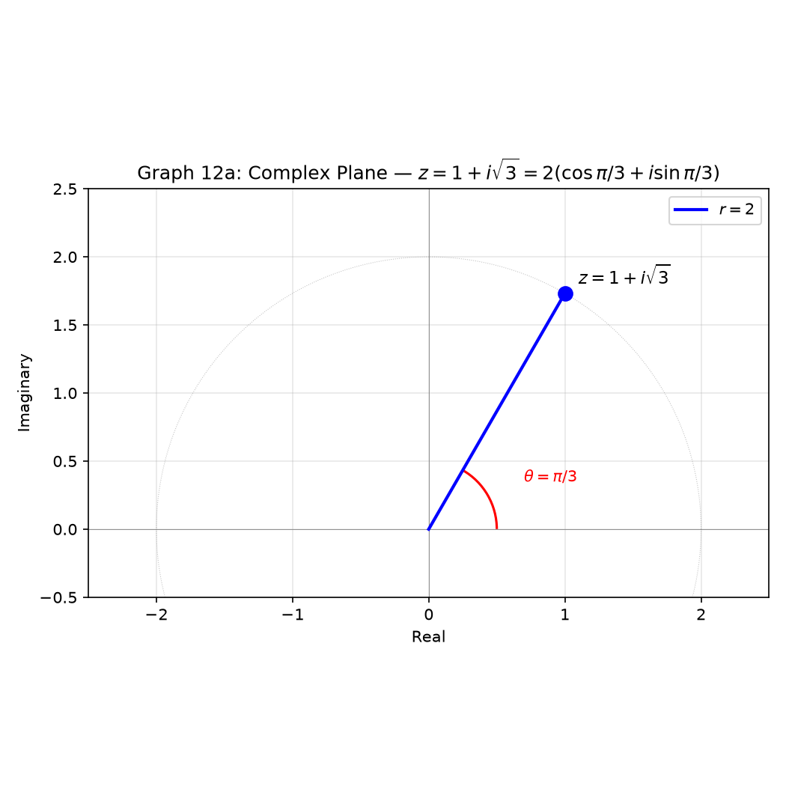
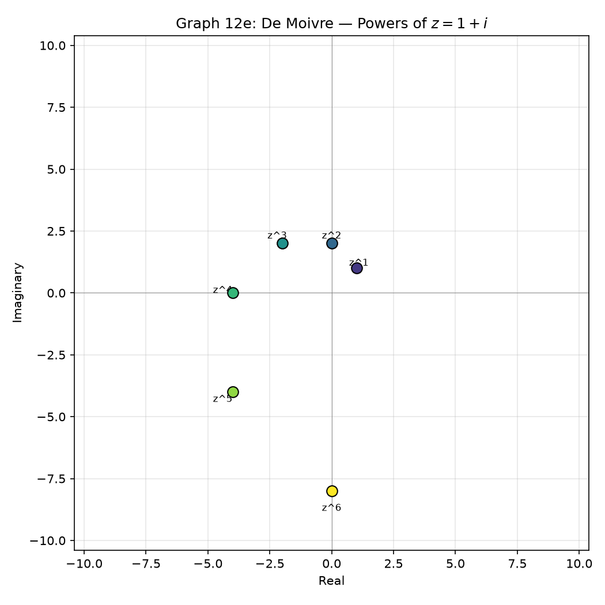
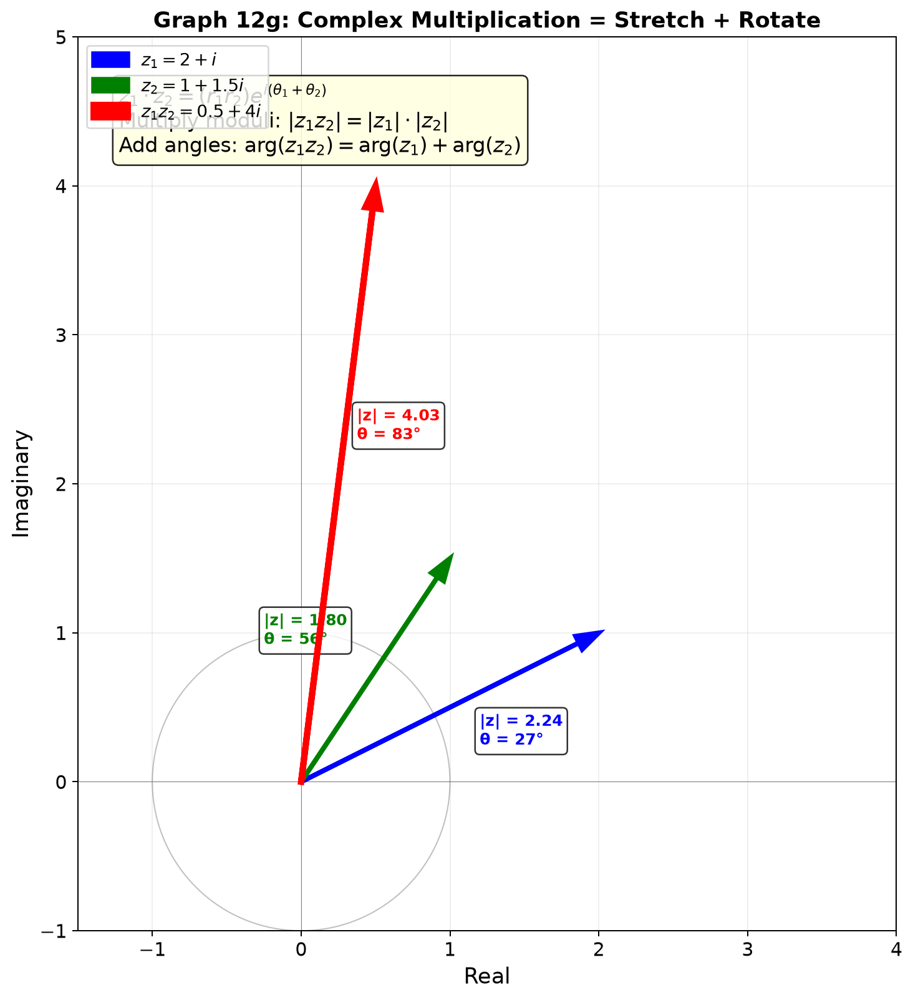
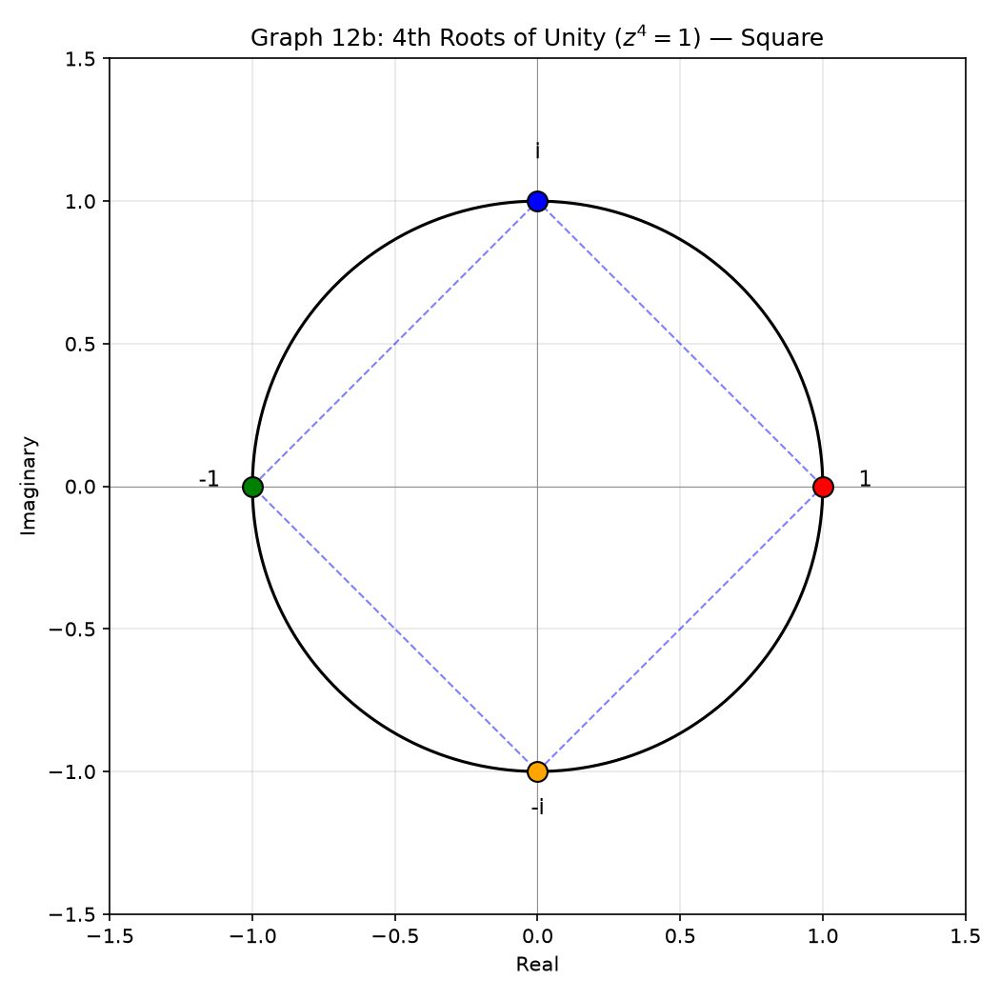

# Session 12A1: Complex Numbers — Beyond the Real Line

**Phase 2 — Classical Techniques | 70 min**

---

## Part A: The Basics — $i$ and Its Arithmetic

---

## Example 1: $i$ and Its Powers — A 4-Cycle

$i^2 = -1$. This single fact defines everything about complex numbers.

Multiply by $i$ repeatedly and watch the cycle:
$i^1 = i$, $i^2 = -1$, $i^3 = -i$, $i^4 = 1$, $i^5 = i$, ...

The cycle repeats every 4 steps: $i \to -1 \to -i \to 1 \to i \to \cdots$

To find $i^{50}$: divide 50 by 4. Remainder 2. So $i^{50} = i^2 = -1$.
To find $i^{101}$: 101 ÷ 4 = 25 remainder 1. So $i^{101} = i^1 = i$.

Square roots of negative numbers:
$\sqrt{-9} = 3i$. $\sqrt{-8} = 2\sqrt{2}i$. $\sqrt{-1} = i$.

---

## Example 2: Adding, Multiplying, and Dividing Complex Numbers

Let $z_1 = 2+3i$, $z_2 = 1-5i$.

**Add**: Pair the real parts, pair the imaginary parts.
$(2+1) + (3-5)i = 3 - 2i$.

**Multiply**: Distribute normally, then replace $i^2$ with $-1$.
$(2+3i)(1-5i) = 2 - 10i + 3i - 15i^2 = 2 - 7i + 15 = 17 - 7i$.

**Divide**: Multiply top and bottom by the conjugate of the denominator.
$\frac{2+3i}{1-5i} \cdot \frac{1+5i}{1+5i} = \frac{2+10i+3i+15i^2}{1+25} = \frac{2+13i-15}{26} = \frac{-13+13i}{26} = -\frac{1}{2} + \frac{1}{2}i$.

---

## Example 3: Conjugate and Modulus — The Twin Tools

For $z = a+bi$:
- **Conjugate**: $\bar{z} = a-bi$ (flip the sign of the imaginary part).
- **Modulus** (magnitude): $|z| = \sqrt{a^2+b^2}$ (distance from the origin).

For $z = 3+4i$: $\bar{z} = 3-4i$, $|z| = \sqrt{9+16} = 5$.

Key identity: $z \cdot \bar{z} = a^2+b^2 = |z|^2$.
Check: $(3+4i)(3-4i) = 9 - 16i^2 = 9+16 = 25 = 5^2$. Exactly.

Also: $\overline{z_1 z_2} = \bar{z_1}\bar{z_2}$. The conjugate of a product equals the product of the conjugates.

---

## Example 4: The Complex Plane and Polar Form

Plot $a+bi$ as the point $(a,b)$ in the plane. The distance from the origin is $r = |z|$. The angle measured from the positive $x$-axis is $\theta$.

$a = r\cos\theta$, $b = r\sin\theta$.

This gives the **polar form**: $z = r(\cos\theta + i\sin\theta)$.

**Example**: $z = 1 + i\sqrt{3}$.
$r = \sqrt{1+3} = 2$. $\cos\theta = \frac{1}{2}$, $\sin\theta = \frac{\sqrt{3}}{2}$, so $\theta = \frac{\pi}{3}$.
Polar form: $z = 2(\cos\frac{\pi}{3} + i\sin\frac{\pi}{3})$.

**Example**: $z = -1 + i$.
$r = \sqrt{2}$. $\cos\theta = -\frac{1}{\sqrt{2}}$, $\sin\theta = \frac{1}{\sqrt{2}}$, so $\theta = \frac{3\pi}{4}$.
Polar form: $z = \sqrt{2}(\cos\frac{3\pi}{4} + i\sin\frac{3\pi}{4})$.



---

## Example 5: Euler's Formula and De Moivre — The Power Tools

**Euler's formula**: $e^{i\theta} = \cos\theta + i\sin\theta$.

This compresses the polar form to a single exponential: $z = re^{i\theta}$.

$1 + i\sqrt{3} = 2e^{i\pi/3}$. And the beautiful identity: $e^{i\pi} + 1 = 0$.

**De Moivre's theorem**: $z^n = r^n(\cos n\theta + i\sin n\theta) = r^n e^{in\theta}$.
Raising to a power multiplies the angle by $n$ and raises the modulus by $n$.

**Example**: Compute $(1+i)^6$.
$r = \sqrt{1+1} = \sqrt{2}$, $\theta = \frac{\pi}{4}$.
$(1+i)^6 = (\sqrt{2})^6 \cdot e^{i\cdot 6\pi/4} = 8 \cdot e^{i\cdot 3\pi/2} = 8(0 - i) = -8i$.



**Visual Insight — Complex Multiplication = Stretch + Rotate:**

Every complex multiplication $z_1 \cdot z_2$ is a single geometric operation: stretch by $|z_2|$ and rotate by $\arg(z_2)$. This is why De Moivre works — raising to the $n$th power simply multiplies the angle by $n$ and raises the modulus to the $n$th power.



---

## Example 6: $n$th Roots of Unity — Evenly Spaced Around the Circle

The equation $z^4 = 1$ has four solutions. Write $1 = e^{i\cdot 0}$:
$z_k = 1^{1/4} \cdot e^{i\cdot 2\pi k/4}$ for $k = 0,1,2,3$.
→ $1,\; i,\; -1,\; -i$.

These four points form a square on the unit circle — evenly spaced by $90^\circ$.

**Example**: Solve $z^3 = -8$.
$-8 = 8e^{i\pi}$. The three cube roots:
$z_k = 2 \cdot e^{i(\pi + 2\pi k)/3}$ for $k = 0,1,2$.
$k=0$: $2e^{i\pi/3} = 1 + i\sqrt{3}$.
$k=1$: $2e^{i\pi} = -2$.
$k=2$: $2e^{i\cdot 5\pi/3} = 1 - i\sqrt{3}$.

Three points equally spaced by $120^\circ$ on a circle of radius 2.



> **Up to here**: $i^2 = -1$, 4-cycle. Conjugate flips the imaginary sign. Modulus = distance from origin.
> Polar form $re^{i\theta}$ packs both magnitude and direction. De Moivre handles powers in one step.
> The $n$ $n$th roots are $n$ points evenly spaced on a circle.

---

## Visual Interlude: Three Geometric Views of Complex Numbers

**View 1 — The Complex Plane as $\mathbb{R}^2$.** A complex number $a+bi$ is exactly the point $(a,b)$. Addition of complex numbers = addition of vectors. The modulus is the Euclidean distance from the origin.

**View 2 — Polar Form as Stretch + Rotate.** Multiplying by $re^{i\theta}$ stretches by factor $r$ and rotates by angle $\theta$. Complex multiplication is a single geometric operation combining scaling and rotation. This is why multiplying by $i$ rotates by $90^\circ$ — because $i = 1 \cdot e^{i\pi/2}$.

**View 3 — Roots of Unity as Regular Polygons.** The $n$ solutions to $z^n = 1$ are $n$ points equally spaced on the unit circle. They form a regular $n$-gon. Their sum is always 0 — the center of mass is at the origin.

---

## Common Mistakes

### Mistake 1: $\sqrt{-4} = -2$

**Wrong path**: "The square root of $-4$ is $-2$."

**Why wrong**: $(-2)^2 = 4$, not $-4$. The square root of a negative number is imaginary.

**Right path**: $\sqrt{-4} = \sqrt{4} \cdot \sqrt{-1} = 2i$. Always pull out the $i$.

---

### Mistake 2: Forgetting the 4-cycle for powers of $i$

**Wrong path**: "$i^{23} = i^{20} \cdot i^3 = 1 \cdot i$... wait, what is $i^3$?"

**Why wrong**: Not internalizing the 4-cycle means recalculating every time.

**Right path**: Divide the exponent by 4. Remainder 0 → 1. Remainder 1 → $i$. Remainder 2 → $-1$. Remainder 3 → $-i$.

---

### Mistake 3: Confusing $|z|^2$ with $z^2$

**Wrong path**: "$|3+4i|^2 = (3+4i)^2$."

**Why wrong**: $|z|^2 = z\bar{z} = a^2+b^2 = 25$. But $z^2 = (3+4i)^2 = 9+24i-16 = -7+24i$. Completely different.

**Right path**: $|z|^2$ is always a non-negative real number. $z^2$ is generally complex.

---

## What We Just Did

```
(1) Basic arithmetic — i² = −1 with 4-cycle. Add: pair real and imaginary parts.
    Multiply: distribute, replace i² → −1. Divide: multiply by conjugate of denominator.

(2) Geometric view — plot a+bi as (a,b). Modulus = distance from origin = |z|.
    Polar form z = re^{iθ} encodes magnitude r and direction θ.
    Multiplication: multiply moduli, add angles.

(3) Power tools — De Moivre: z^n = r^n e^{inθ}. Powers are one-step.
    nth roots: radius r^{1/n}, angles (θ+2πk)/n for k = 0,1,...,n−1.
    n roots form a regular n-gon on a circle.
```

---

## Practice 1

Divide $\frac{3-i}{2+i}$. Write the answer in the form $a+bi$.

→ Reference: **Example 2**

> Solutions: [Solutions](solutions/12A1-solutions.md#practice-1)

---

## Practice 2

Write $z = 1-i$ in polar form. Then compute $z^8$ using De Moivre.

→ Reference: **Example 5**

> Solutions: [Solutions](solutions/12A1-solutions.md#practice-2)

---

## Practice 3

Find all three cube roots of $-8$. Give each in $a+bi$ form.

→ Reference: **Example 6**

> Solutions: [Solutions](solutions/12A1-solutions.md#practice-3)

---

## Practice 4: Composition

Explain why multiplying a complex number by $i$ rotates it by $90^\circ$ counterclockwise. Then find the result of multiplying $3+4i$ by $i^3$, and describe the geometric transformation in words.

→ Reference: **Example 1, 5**

> Solutions: [Solutions](solutions/12A1-solutions.md#practice-4)

---

## Practice 5

Write $z = -1 + i\sqrt{3}$ in polar form $re^{i\theta}$. Then find $z^6$.

→ Reference: **Example 4, 5**

> Solutions: [Solutions](solutions/12A1-solutions.md#practice-5)

---

## Practice 6: Real Battle

The three cube roots of $-8$ form a triangle in the complex plane. Find its area. Also find a $2 \times 2$ matrix that rotates the plane by $120^\circ$, and verify that applying it three times gives the identity.

→ Reference: **Example 6, 13 (from 12A2)**

> Solutions: [Solutions](solutions/12A1-solutions.md#practice-6)

---

## Basic Algebra Drill — Complex Numbers (4 Problems)

> Pure calculation. Build fluency with $i$, conjugates, and polar form.

**D1.** Simplify $i^{27}$. Write as $1$, $-1$, $i$, or $-i$.

**D2.** Compute $(2-3i)(1+4i)$. Write in $a+bi$ form.

**D3.** Find the conjugate and modulus of $z = 5 - 12i$.

**D4.** Find $i^{4k+3}$ for any integer $k$. State the result.

> Solutions: [Solutions](solutions/12A1-solutions.md#basic-drill)

---

## Advanced Algebra Drill — Complex Numbers (4 Problems)

> Multi-step. Chain polar form, Euler, and De Moivre.

**A1.** Solve for $z$: $(1+i)z + 3 = 2i - z$. Write $z$ in $a+bi$ form.

**A2.** Compute $(1+i\sqrt{3})^9$ using De Moivre. Give the answer in $a+bi$ form.

**A3.** Find all four 4th roots of $-16$. Write each in polar form $re^{i\theta}$ and in $a+bi$ form.

**A4.** The four 4th roots of 1 form a square. Compute its area.

> Solutions: [Solutions](solutions/12A1-solutions.md#advanced-drill)

---

## Today's Procedure

```
Step 1: Arithmetic — i²=−1 with 4-cycle. Add: pair real, pair imaginary.
         Multiply: distribute, replace i²→−1. Divide: conjugate trick.
         Conjugate flips the sign of i. Modulus = distance from origin.

Step 2: Polar form — z = re^{iθ} where r = |z|, θ = arctan(b/a) with quadrant check.
         Multiplication: (r₁e^{iθ₁})(r₂e^{iθ₂}) = (r₁r₂)e^{i(θ₁+θ₂)}.
         De Moivre: (re^{iθ})^n = r^n e^{inθ}.

Step 3: Roots — z^n = w has exactly n solutions.
         z_k = |w|^{1/n} · e^{i(arg(w) + 2πk)/n}, k = 0,1,...,n−1.
         The n roots are evenly spaced on a circle — a regular n-gon.
```

---

## Terminology

Up to now we used plain words like "imaginary", "conjugate", "modulus", "angle".
**You have already learned all the methods.** Now we attach the formal mathematical names.

| What we called it | Mathematical term | Notation |
|:-----------------:|:-----------------:|:--------:|
| imaginary unit | imaginary unit | $i$, $i^2=-1$ |
| conjugate | complex conjugate | $\bar{z} = a-bi$ |
| modulus / magnitude | modulus | $|z| = \sqrt{a^2+b^2}$ |
| argument / angle | argument | $\theta = \arg(z)$ |
| polar form | polar / exponential form | $z = re^{i\theta}$ |
| Euler's formula | Euler's formula | $e^{i\theta} = \cos\theta + i\sin\theta$ |
| De Moivre's theorem | De Moivre's theorem | $z^n = r^n e^{in\theta}$ |
| $n$th roots of unity | roots of unity | $e^{2\pi i k/n}$, $k=0,\dots,n-1$ |
