# Session 12A1: Complex Numbers — The Matrix You Already Know

**Phase 2 — Classical Techniques | 80 min**

**Prerequisite**: Session 12A2 (Matrices and Vectors) — you know what a rotation matrix is.

---

## The One Insight That Changes Everything

You already know that $R_\theta = \begin{pmatrix} \cos\theta & -\sin\theta \\ \sin\theta & \cos\theta \end{pmatrix}$ rotates vectors by $\theta$.

Now look at this:

$$\begin{pmatrix} a & -b \\ b & a \end{pmatrix} = \sqrt{a^2+b^2} \cdot \begin{pmatrix} \cos\theta & -\sin\theta \\ \sin\theta & \cos\theta \end{pmatrix}$$

**This is a rotation-scaling matrix.** It rotates by $\theta = \arctan(b/a)$ and scales by $r = \sqrt{a^2+b^2}$.

A **complex number** $z = a+bi$ is just a shorthand for exactly this matrix.

Every operation you do with complex numbers — addition, multiplication, powers, roots — is an operation on these rotation-scaling matrices. You already know the geometry. Now we give it a name and a more compact notation.

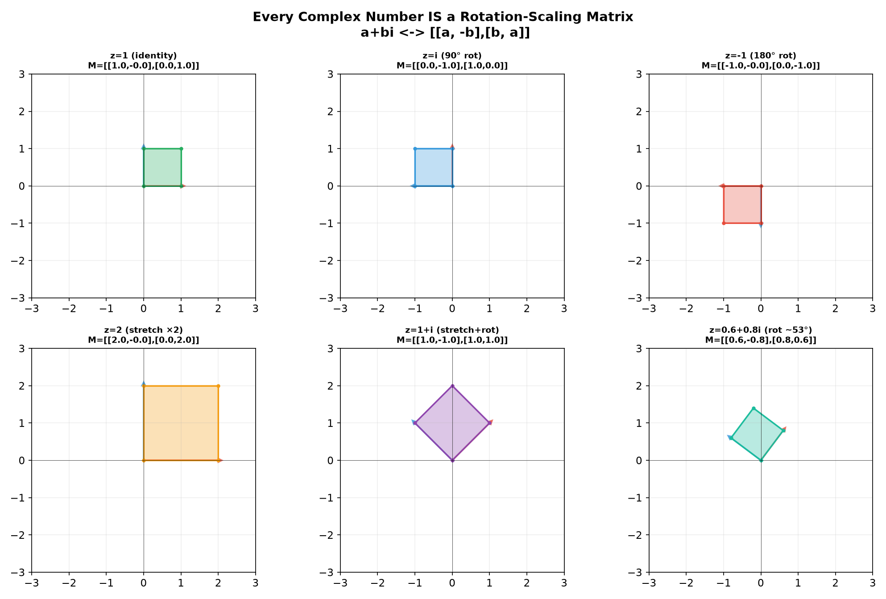

> **Key**: $a+bi \longleftrightarrow \begin{pmatrix} a & -b \\ b & a \end{pmatrix}$. Addition is matrix addition. Multiplication is matrix multiplication. The modulus $|z| = \sqrt{a^2+b^2}$ is the scaling factor. The argument $\arg(z) = \arctan(b/a)$ is the rotation angle.

---

## Part A: The Basics — Arithmetic Through the Matrix Lens

---

## Example 1: $i$ — The $90^\circ$ Rotation Matrix

$i = 0 + 1i$ corresponds to $\begin{pmatrix} 0 & -1 \\ 1 & 0 \end{pmatrix}$ — exactly the $90^\circ$ CCW rotation matrix from 12A2.

This is why $i^2 = -1$: rotating $90^\circ$ twice gives $180^\circ$, which is $-I = \begin{pmatrix} -1 & 0 \\ 0 & -1 \end{pmatrix}$, which corresponds to $-1$.

**The 4-cycle** — multiply by $i$ repeatedly:
$i^1 = i$ (rotate $90^\circ$), $i^2 = -1$ (rotate $180^\circ$), $i^3 = -i$ (rotate $270^\circ$), $i^4 = 1$ (rotate $360^\circ$), $i^5 = i$ ...

To find $i^{50}$: $50 \div 4 = 12$ remainder $2$. So $i^{50} = i^2 = -1$.
To find $i^{101}$: $101 \div 4 = 25$ remainder $1$. So $i^{101} = i^1 = i$.

Square roots of negative numbers: $\sqrt{-9} = 3i$, $\sqrt{-8} = 2\sqrt{2}i$, $\sqrt{-1} = i$.

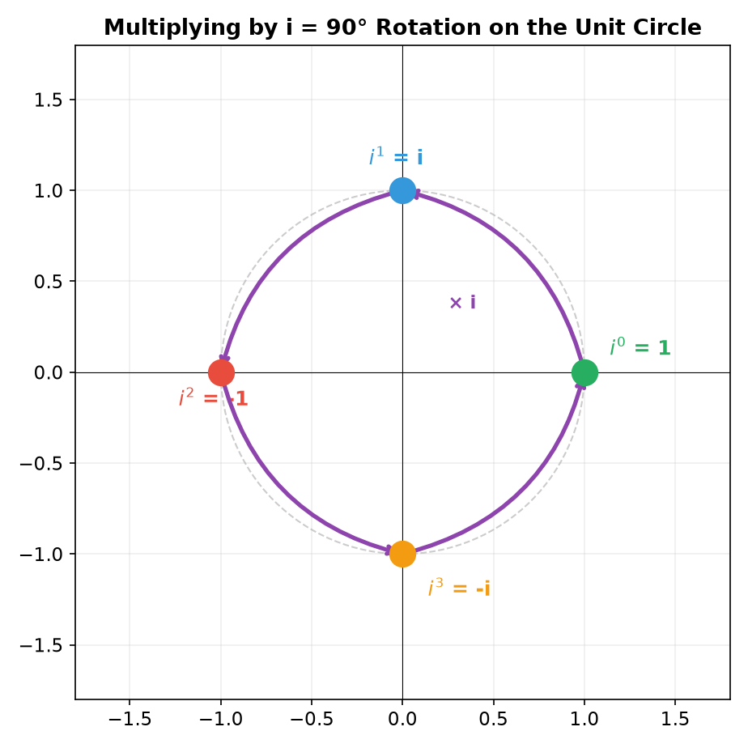

> **Matrix view**: $i^n$ is the rotation matrix $R_{90^\circ}$ raised to the $n$th power. The 4-cycle is just the fact that $R_{90^\circ}^4 = I$.

---

## Example 2: Adding and Multiplying — Same as Matrices

Let $z_1 = 2+3i$, $z_2 = 1-5i$.

**Addition** — exactly vector addition (component-wise, same as matrix addition):
$(2+1) + (3-5)i = 3 - 2i$.

**Multiplication** — exactly matrix multiplication (distribute, $i^2 \to -1$):
$(2+3i)(1-5i) = 2 - 10i + 3i - 15i^2 = 2 - 7i + 15 = 17 - 7i$.

Check via matrices: $\begin{pmatrix} 2 & -3 \\ 3 & 2 \end{pmatrix}\begin{pmatrix} 1 & 5 \\ -5 & 1 \end{pmatrix} = \begin{pmatrix} 2+15 & 10-3 \\ 3-10 & 15+2 \end{pmatrix} = \begin{pmatrix} 17 & 7 \\ -7 & 17 \end{pmatrix}$, which corresponds to $17-7i$ ✓.

**Division** — multiply top and bottom by the conjugate:
$\frac{2+3i}{1-5i} \cdot \frac{1+5i}{1+5i} = \frac{2+10i+3i+15i^2}{1+25} = \frac{2+13i-15}{26} = -\frac{1}{2} + \frac{1}{2}i$.

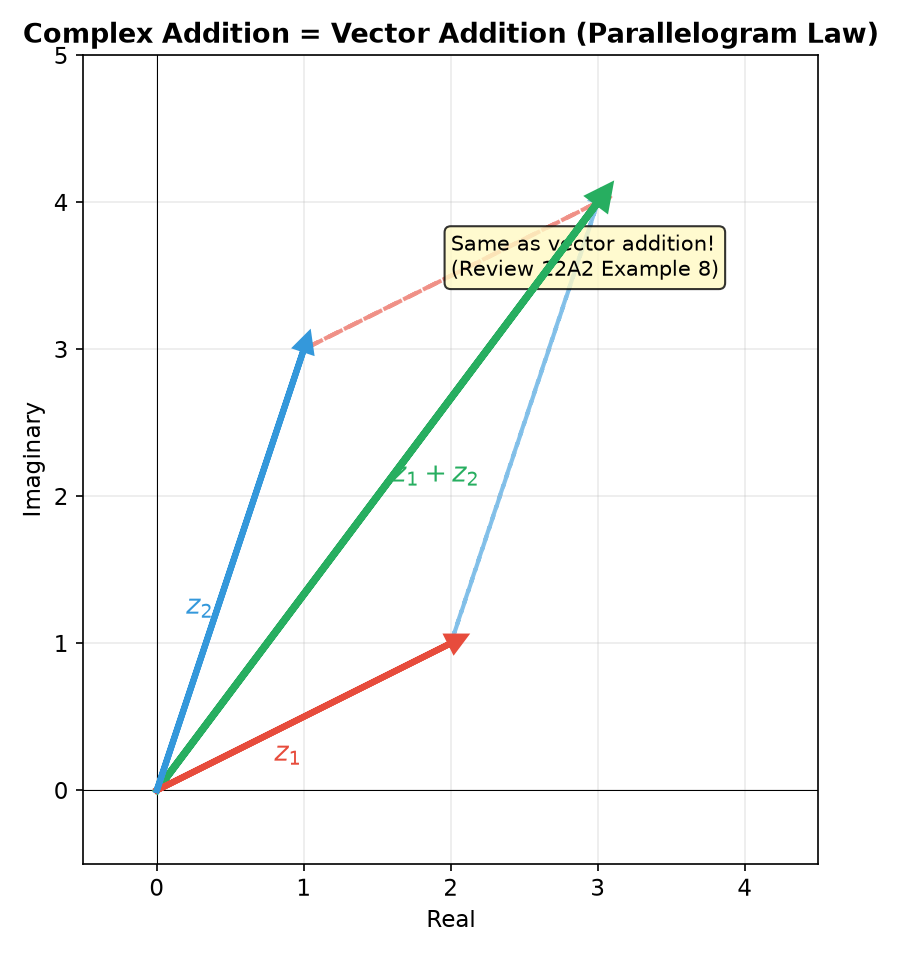

> **Matrix view**: Complex addition is matrix addition. Complex multiplication is matrix multiplication. There is nothing new — you already know these operations.

---

## Example 3: Conjugate and Modulus — Reflection and Determinant

For $z = a+bi$, the matrix is $M = \begin{pmatrix} a & -b \\ b & a \end{pmatrix}$.

- **Conjugate**: $\bar{z} = a-bi$ corresponds to $M^T = \begin{pmatrix} a & b \\ -b & a \end{pmatrix}$ — the transpose. Geometrically: reflection across the real axis.
- **Modulus**: $|z| = \sqrt{a^2+b^2}$. Notice: $\det(M) = a^2 + b^2 = |z|^2$.

Key identity: $z \cdot \bar{z} = a^2+b^2 = |z|^2$. In matrix form: $M \cdot M^T = \det(M) \cdot I$.

For $z = 3+4i$: $\bar{z} = 3-4i$, $|z| = \sqrt{9+16} = 5$. Check: $(3+4i)(3-4i) = 25 = 5^2$ ✓.

Also: $\overline{z_1 z_2} = \bar{z_1}\bar{z_2}$. In matrices: $(AB)^T = B^T A^T$. Same property.

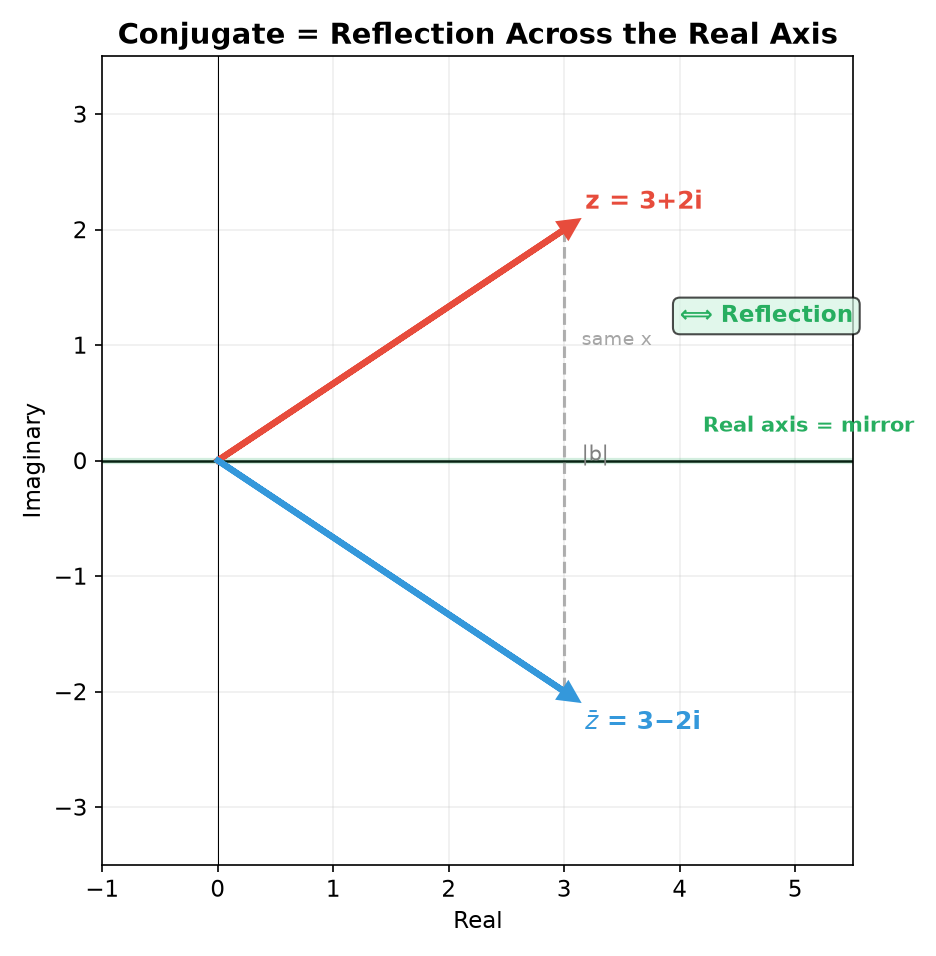

> **Matrix view**: The conjugate is the transpose. The modulus squared is the determinant. Everything connects.

---

## Part B: The Complex Plane — Geometry You Already Know

---

## Example 4: The Complex Plane and Polar Form

Plot $a+bi$ as the point $(a,b)$. This is exactly the same as plotting the vector $(a,b)$ from 12A2.

The distance from the origin is $r = |z| = \sqrt{a^2+b^2}$. The angle from the positive real axis is $\theta = \arg(z)$.

$a = r\cos\theta$, $b = r\sin\theta$.

**Polar form**: $z = r(\cos\theta + i\sin\theta) = re^{i\theta}$.

**Example**: $z = 1 + i\sqrt{3}$.
$r = \sqrt{1+3} = 2$. $\theta = \arctan(\sqrt{3}/1) = \pi/3$.
$z = 2e^{i\pi/3}$.

**Example**: $z = -1 + i$.
$r = \sqrt{2}$. $\theta = 3\pi/4$ (Quadrant II — check the signs!).
$z = \sqrt{2}e^{i\cdot 3\pi/4}$.

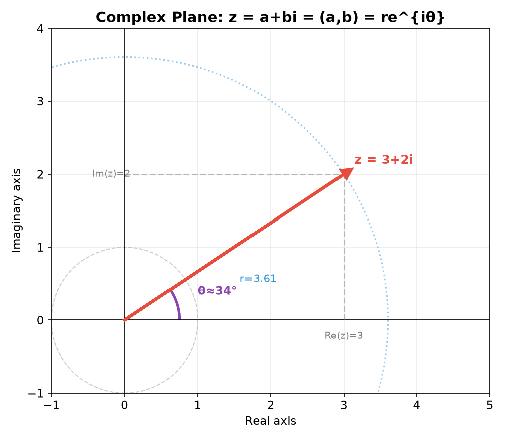

> **Matrix view**: $re^{i\theta}$ is exactly the rotation-scaling matrix with scaling factor $r$ and rotation angle $\theta$.

---

## Example 5: Complex Multiplication = Stretch + Rotate

Multiplying $z_1 = r_1 e^{i\theta_1}$ by $z_2 = r_2 e^{i\theta_2}$:

$$z_1 z_2 = (r_1 e^{i\theta_1})(r_2 e^{i\theta_2}) = (r_1 r_2) e^{i(\theta_1 + \theta_2)}$$

Moduli multiply: $r_1 \cdot r_2$. Arguments add: $\theta_1 + \theta_2$.

This is exactly matrix multiplication of two rotation-scaling matrices:
$R_{\theta_1}S_{r_1} \cdot R_{\theta_2}S_{r_2} = R_{\theta_1+\theta_2}S_{r_1 r_2}$.

**Example**: Multiply $2e^{i\pi/6}$ by $3e^{i\pi/3}$:
Result: $6e^{i\pi/2} = 6i$. Stretch by 6, rotate to $90^\circ$.

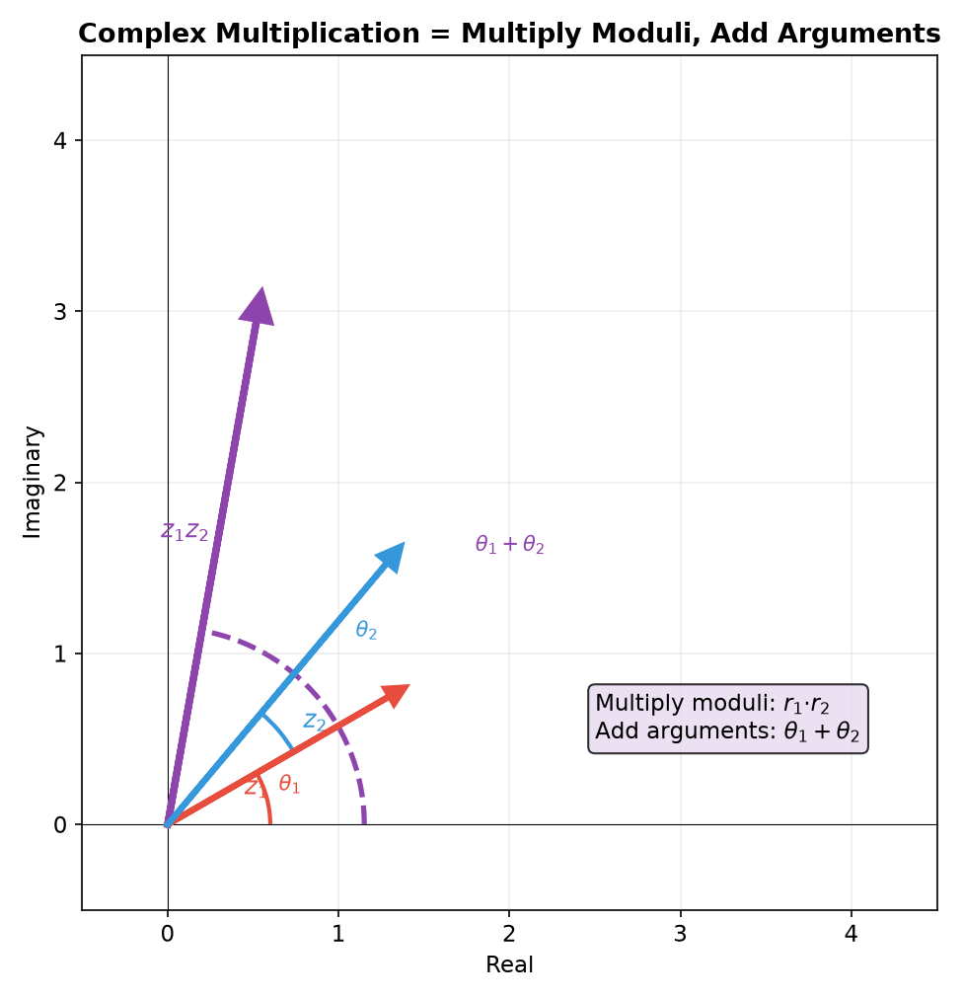

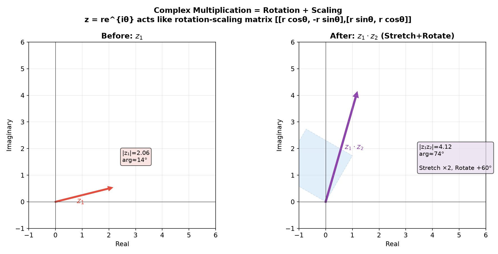

> **Matrix view**: This is why multiplying by $i$ (which is $1 \cdot e^{i\pi/2}$) rotates by $90^\circ$ without stretching — $i$ is a pure rotation matrix.

---

## Example 6: Euler's Formula and De Moivre — The Power Tools

**Euler's formula**: $e^{i\theta} = \cos\theta + i\sin\theta$.
Matrix form: $e^{i\theta} \longleftrightarrow R_\theta = \begin{pmatrix} \cos\theta & -\sin\theta \\ \sin\theta & \cos\theta \end{pmatrix}$.

This compresses polar form to a single exponential: $z = re^{i\theta}$.
And the beautiful identity: $e^{i\pi} + 1 = 0$.

**De Moivre's theorem**: $z^n = r^n e^{in\theta}$.
In matrix language: raising a rotation-scaling matrix to the $n$th power scales the factor by $r^n$ and multiplies the angle by $n$. This is exactly what we did in 12A2 Example 7 (Matrix Powers).

**Example**: Compute $(1+i)^6$.
$r = \sqrt{2}$, $\theta = \pi/4$.
$(1+i)^6 = (\sqrt{2})^6 \cdot e^{i\cdot 6\pi/4} = 8 \cdot e^{i\cdot 3\pi/2} = 8(0 - i) = -8i$.

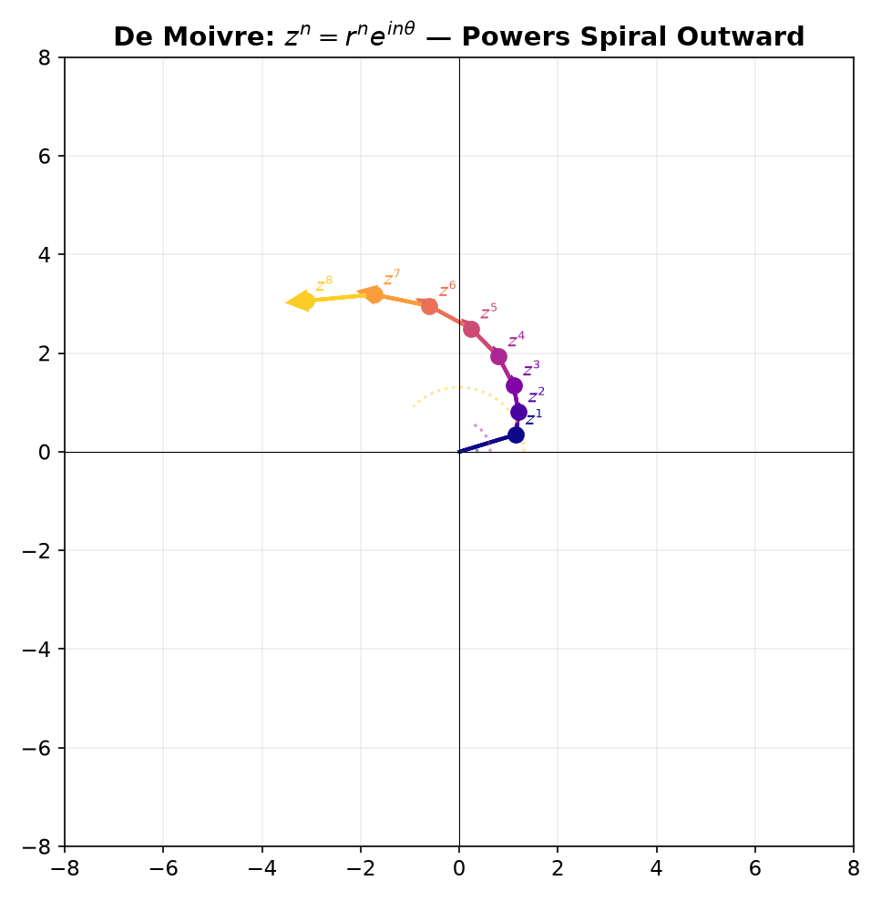

> **Matrix view**: De Moivre is just matrix power $M^n$. Since $M$ is a rotation-scaling matrix, $M^n$ scales by $r^n$ and rotates by $n\theta$. Nothing new.

---

## Part C: Roots, Polynomials, and the Big Picture

---

## Example 7: $n$th Roots of Unity — Regular Polygons

The equation $z^n = 1$ has exactly $n$ solutions:
$z_k = e^{i\cdot 2\pi k/n}$ for $k = 0, 1, \dots, n-1$.

These are $n$ points equally spaced on the unit circle — a **regular $n$-gon**. Their sum is always 0.

$n=4$: $1, i, -1, -i$ — a square.
$n=3$: $1, e^{i\cdot 2\pi/3}, e^{i\cdot 4\pi/3}$ — an equilateral triangle.

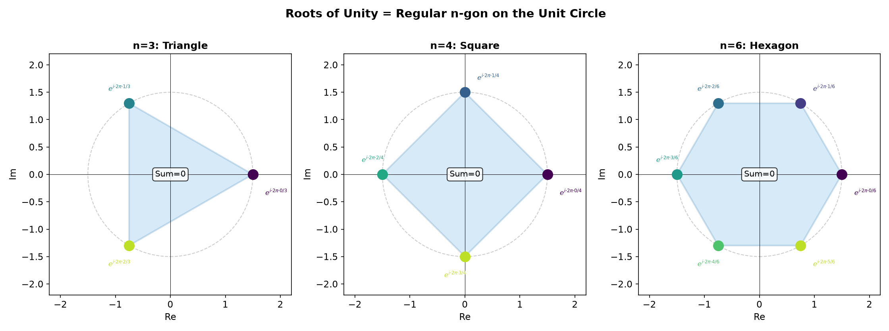

**Example**: Solve $z^3 = -8$.
$-8 = 8e^{i\pi}$. Three cube roots: $z_k = 2 \cdot e^{i(\pi + 2\pi k)/3}$ for $k = 0,1,2$.
$k=0$: $2e^{i\pi/3} = 1 + i\sqrt{3}$.
$k=1$: $2e^{i\pi} = -2$.
$k=2$: $2e^{i\cdot 5\pi/3} = 1 - i\sqrt{3}$.

Three points equally spaced by $120^\circ$ on a circle of radius 2.

---

## Example 8: Reciprocal — Inversion in the Unit Circle

$\frac{1}{z} = \frac{\bar{z}}{|z|^2} = \frac{1}{r}e^{-i\theta}$.

Geometrically: invert the modulus ($r \to 1/r$) and reflect across the real axis ($\theta \to -\theta$).

- If $|z| > 1$ (outside), then $|1/z| < 1$ (inside).
- If $|z| < 1$ (inside), then $|1/z| > 1$ (outside).

The unit circle is the fixed boundary.

In matrix language: $1/z$ corresponds to $M^{-1} = \frac{1}{\det(M)}M^T$. The inverse of a rotation-scaling matrix divides by the determinant and transposes (reflects).

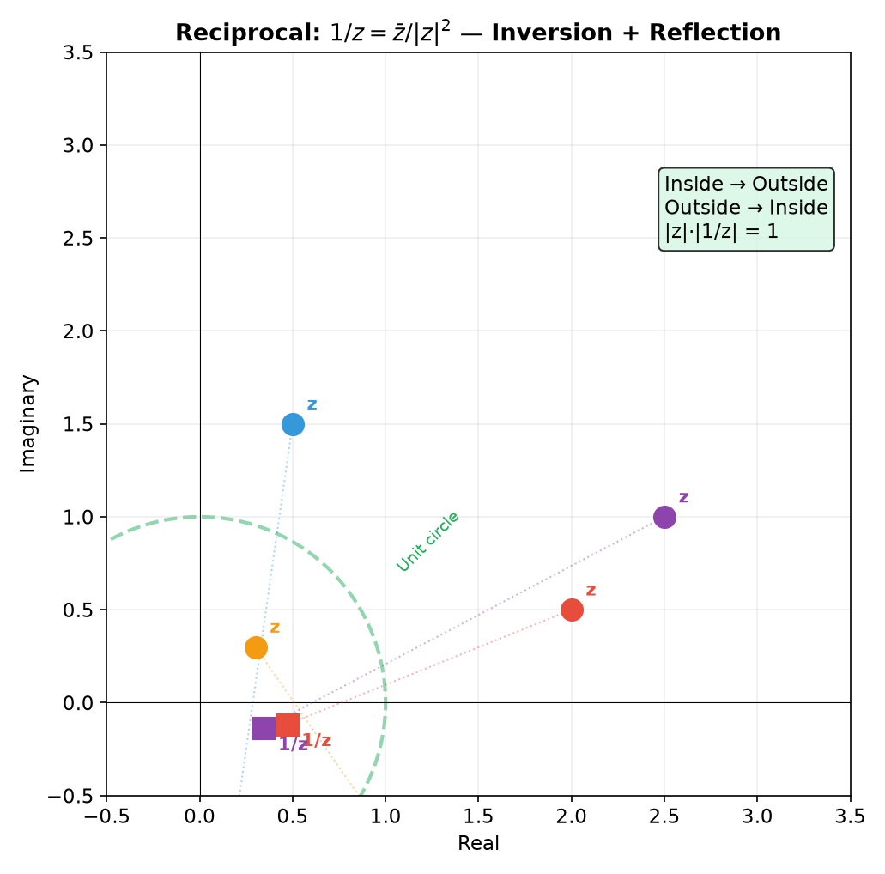

---

## Example 9: Fundamental Theorem of Algebra — Why We Need Complex Numbers

**Theorem**: Every polynomial of degree $n$ has exactly $n$ complex roots (counting multiplicity).

**Why this matters**: Over the real numbers, $x^2+1=0$ has no solution. Over the complex numbers, it has two: $\pm i$. The complex numbers **algebraically close** the real numbers — you never need to invent new number systems to solve polynomial equations.

**Complex roots come in conjugate pairs**: If $a+bi$ is a root of a polynomial with real coefficients, then $a-bi$ is also a root.

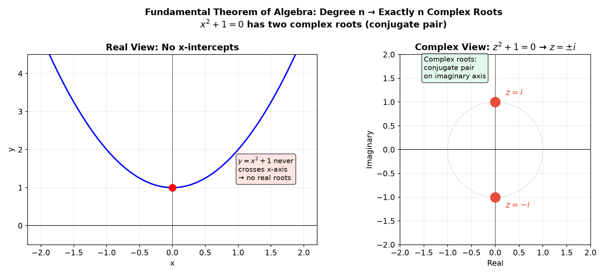

**Example**: $z^2 + 2z + 5 = 0$.
$z = \frac{-2 \pm \sqrt{4-20}}{2} = \frac{-2 \pm \sqrt{-16}}{2} = \frac{-2 \pm 4i}{2} = -1 \pm 2i$.
The roots are a conjugate pair.

> **Up to here**: Complex numbers are rotation-scaling matrices in compact notation. $i$ is the $90^\circ$ rotation. Polar form $re^{i\theta}$ = stretch by $r$, rotate by $\theta$. De Moivre = matrix powers. Roots of unity = regular polygons. Every polynomial has all its roots in $\mathbb{C}$.

---

## Visual Interlude: Five Geometric Views of Complex Numbers

**View 1 — The Complex Plane as $\mathbb{R}^2$.** $a+bi \leftrightarrow (a,b)$. Addition = vector addition. Conjugate = reflection across the real axis. Modulus = Euclidean distance.

**View 2 — Polar Form as Stretch + Rotate.** $re^{i\theta}$: $r$ is the scaling factor, $\theta$ is the rotation angle. Multiplication: multiply moduli, add arguments. Division: divide moduli, subtract arguments.

**View 3 — Matrix Isomorphism.** $a+bi \leftrightarrow \begin{pmatrix} a & -b \\ b & a \end{pmatrix}$. $|z|^2 = \det(M)$. $\bar{z} \leftrightarrow M^T$. $1/z \leftrightarrow M^{-1}$.

**View 4 — Roots as Regular Polygons.** $z^n = w$ has $n$ solutions, equally spaced on a circle of radius $|w|^{1/n}$. The sum of all $n$th roots of unity is 0.

**View 5 — Algebraic Completeness.** $\mathbb{C}$ is algebraically closed. Every polynomial factors completely over $\mathbb{C}$. This is why complex numbers exist — to guarantee that every polynomial equation has all its solutions.

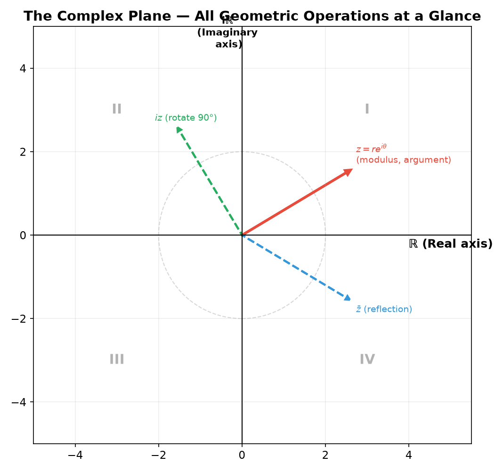

---

## Common Mistakes

### Mistake 1: $\sqrt{-4} = -2$

**Wrong path**: "The square root of $-4$ is $-2$." $(-2)^2 = 4$, not $-4$.

**Right path**: $\sqrt{-4} = \sqrt{4} \cdot \sqrt{-1} = 2i$.

### Mistake 2: Forgetting the quadrant when computing $\arg(z)$

**Wrong path**: "$z = -1-i$, so $\theta = \arctan(1) = 45^\circ$."

**Why wrong**: $\arctan(1) = 45^\circ$ but $(-1,-1)$ is in Quadrant III, where $\theta = 225^\circ$ (or $-135^\circ$).

**Right path**: Always draw the point. Check which quadrant. Add $\pi$ if in QII or QIII. Use $\arctan2(b,a)$.

### Mistake 3: Confusing $|z|^2$ with $z^2$

**Wrong path**: "$|3+4i|^2 = (3+4i)^2$." $|z|^2 = 25$, but $z^2 = -7+24i$.

**Right path**: $|z|^2 = z\bar{z} = \det(M)$ (always real and $\geq 0$). $z^2$ is generally complex.

### Mistake 4: Thinking $i$ is the only "imaginary" thing

**Wrong path**: "Complex numbers are made-up, $i$ is mysterious."

**Why wrong**: Complex numbers are exactly rotation-scaling matrices. $i$ is the $90^\circ$ rotation matrix.

**Right path**: $a+bi$ is compact notation for $\begin{pmatrix} a & -b \\ b & a \end{pmatrix}$. Everything is grounded in matrices you already understand.

---

## What We Just Did

```
(1) Core insight — a+bi IS the rotation-scaling matrix [[a,-b],[b,a]].
    i = 90° rotation. i² = −1 because two 90° rotations = 180° = −I.

(2) Arithmetic — addition = vector addition. Multiplication = matrix mult.
    Conjugate = transpose = reflection. |z|² = det(M). 1/z = M⁻¹.

(3) Polar form — z = re^{iθ}: r = |z| = √det(M), θ = rotation angle.
    Multiplication: multiply moduli, add angles (matrix composition).
    De Moivre: z^n = r^n e^{inθ} (matrix power — same as 12A2 Example 7).

(4) Roots — z^n = w has n solutions (regular n-gon).
    Fundamental Theorem: every degree-n polynomial has n complex roots.
```

---

## Practice 1

Divide $\frac{3-i}{2+i}$. Write in $a+bi$ form. Then write the corresponding $2 \times 2$ matrix for the result and verify its determinant equals $|z|^2$.

→ Reference: **Example 2, 3**

> Solutions: [Solutions](solutions/12A1-solutions.md#practice-1)

---

## Practice 2

Write $z = 1-i$ in polar form. Compute $z^8$ using De Moivre. Then explain why the answer must be a positive real number using the matrix view (what happens to the rotation angle after 8 steps?).

→ Reference: **Example 6**

> Solutions: [Solutions](solutions/12A1-solutions.md#practice-2)

---

## Practice 3

Find all three cube roots of $-8$. Give each in $a+bi$ form. Write the rotation-scaling matrix for each root and verify that cubing the matrix gives $-8I$.

→ Reference: **Example 7**

> Solutions: [Solutions](solutions/12A1-solutions.md#practice-3)

---

## Practice 4: Composition

Explain why multiplying a complex number by $i$ rotates it by $90^\circ$ CCW by writing $i$ as a matrix. Then compute $(3+4i) \cdot i^3$ and describe the geometric transformation in words. What matrix corresponds to $i^3$?

→ Reference: **Example 1, 5**

> Solutions: [Solutions](solutions/12A1-solutions.md#practice-4)

---

## Practice 5

Write $z = -1 + i\sqrt{3}$ in polar form. Compute $z^6$. Write the matrix for $z$ and for $z^6$. What is $\det(\text{matrix for }z)$ and $\det(\text{matrix for }z^6)$? How are they related?

→ Reference: **Example 4, 6**

> Solutions: [Solutions](solutions/12A1-solutions.md#practice-5)

---

## Practice 6

The three cube roots of $-8$ form a triangle in the complex plane. Find its area. Also find a $2 \times 2$ matrix that rotates the plane by $120^\circ$, and verify that applying it three times gives the identity. Connect this matrix to one of the cube roots.

→ Reference: **Example 7, 12A2 Example 13**

> Solutions: [Solutions](solutions/12A1-solutions.md#practice-6)

---

## Practice 7: Matrix Bridge

The complex number $z = 3+4i$ corresponds to matrix $M = \begin{pmatrix} 3 & -4 \\ 4 & 3 \end{pmatrix}$. Find $M^{-1}$ using the $2 \times 2$ inverse formula from 12A2. Then compute $1/z$ directly and verify the results match. What geometric operation does $M^{-1}$ represent?

→ Reference: **Example 3, 8**

> Solutions: [Solutions](solutions/12A1-solutions.md#practice-7)

---

## Practice 8: Real Battle

Prove that the product of all $n$th roots of unity (for $n \geq 2$) is $(-1)^{n-1}$. Test this for $n=3,4,5$. Also: the $n$th roots of unity form a regular $n$-gon inscribed in the unit circle. Find a formula for its area in terms of $n$.

→ Reference: **Example 7**

> Solutions: [Solutions](solutions/12A1-solutions.md#practice-8)

---

## Basic Algebra Drill — Complex Numbers (15 Problems)

> Pure calculation + geometric insight. Build fluency with $i$, polar form, and the matrix connection.

**D1.** Simplify $i^{27}$. Write as $1$, $-1$, $i$, or $-i$.

**D2.** Compute $(2-3i)(1+4i)$. Write in $a+bi$ form.

**D3.** Find the conjugate and modulus of $z = 5 - 12i$.

**D4.** Find $i^{4k+3}$ for any integer $k$.

**D5.** Simplify $\frac{1}{i}$. Write in $a+bi$ form. What matrix does this correspond to?

**D6.** Compute $(3+2i) + (5-7i) - (1+4i)$.

**D7.** Find the modulus of $z = -6 + 8i$.

**D8.** Write $e^{i\pi/2}$, $e^{i\pi}$, $e^{i\cdot 3\pi/2}$ in $a+bi$ form. What do you notice?

**D9.** Find $\bar{z}$ and $|z|$ for $z = -3i$.

**D10.** Simplify $i^{15} + i^{16} + i^{17} + i^{18}$. Explain why any four consecutive powers of $i$ sum to 0.

**D11. ◆ Geometry** — Plot $z=2+2i$ and its conjugate on the complex plane. What is the geometric relationship? What is $z \cdot \bar{z}$? What is $z + \bar{z}$?

**D12. ◆ Matrix Connection** — Write the matrix for $z = 1+i$. Compute $\det(M)$. What is $|z|$? How are they related?

**D13. ◆ Geometry** — Multiply $z_1 = 1+i$ by $z_2 = i$. What happens geometrically? Draw both $z_1$ and $z_1 \cdot z_2$ on the complex plane.

**D14. ◆ Matrix Connection** — The matrix for $i$ is $J = \begin{pmatrix} 0 & -1 \\ 1 & 0 \end{pmatrix}$. Compute $J^2$, $J^3$, $J^4$. What complex numbers do these correspond to?

**D15. ◆ Geometry** — Find $1/z$ for $z = 2i$. Where is $z$ relative to the unit circle? Where is $1/z$? What is the product $|z| \cdot |1/z|$?

> Solutions: [Solutions](solutions/12A1-solutions.md#basic-drill)

---

## Advanced Algebra Drill — Complex Numbers (15 Problems)

> Multi-step. Connect polar form, Euler, De Moivre, matrices, and geometry.

**A1.** Solve for $z$: $(1+i)z + 3 = 2i - z$. Write $z$ in $a+bi$ form. Write the corresponding matrix and compute its determinant.

**A2.** Compute $(1+i\sqrt{3})^9$ using De Moivre. Give in $a+bi$ form. What is the corresponding matrix, and what rotation angle does it represent?

**A3.** Find all four 4th roots of $-16$. Write in both $re^{i\theta}$ and $a+bi$ form. Write the matrix for one of the roots.

**A4.** The four 4th roots of 1 form a square. Compute its area. Compute the sum of all four roots.

**A5.** Write $z = \sqrt{3} - i$ in polar form. Compute $z^6$. Write the matrix for $z$ and confirm that its 6th power equals the matrix for $z^6$.

**A6.** Solve $z^2 + 2z + 5 = 0$ over $\mathbb{C}$. Verify that the roots are conjugates.

**A7.** Find all complex $z$ such that $z^3 = 8i$. Give in $a+bi$ form.

**A8.** If $z = 2e^{i\pi/6}$, find $z^4$ and $1/z$ in $a+bi$ form. Write the matrices and verify.

**A9.** Prove $|z_1 z_2| = |z_1| \cdot |z_2|$ using the matrix determinant: $\det(M_1 M_2) = \det(M_1)\det(M_2)$.

**A10.** The three cube roots of $8i$ form a triangle. Find its area.

> **◆ Geometry & Matrix Fusion (Problems A11–A15)**

**A11. ◆** The complex number $z = \frac{1}{2} + \frac{\sqrt{3}}{2}i$ satisfies $z^3 = -1$ (check this). What rotation angle does $z$ represent? Find a $2 \times 2$ matrix $R$ such that $R^3 = -I$. What is $\det(R)$?

**A12. ◆** Two complex numbers $z_1 = 3e^{i\pi/6}$ and $z_2 = 2e^{i\pi/3}$ are multiplied. Find $z_1 z_2$ in $a+bi$ form. Find the area of the triangle formed by $0$, $z_1$, and $z_1 z_2$ in the complex plane.

**A13. ◆** Consider the set $\{z : |z| = 1\}$ (the unit circle). Show that this set is closed under multiplication: if $|z_1|=|z_2|=1$, then $|z_1 z_2| = 1$. In matrix language: the set of pure rotation matrices is closed under multiplication — the product of two rotations is a rotation. Prove it.

**A14. ◆** The $n$th roots of unity are $1, \omega, \omega^2, \dots, \omega^{n-1}$ where $\omega = e^{2\pi i/n}$. Show that $1 + \omega + \omega^2 + \cdots + \omega^{n-1} = 0$ for $n \geq 2$. (Hint: geometric series formula.) Explain why this means the center of mass of the regular $n$-gon is at the origin.

**A15. ◆** The transformation $T(z) = iz$ rotates every point by $90^\circ$. Write $T$ as a $2 \times 2$ matrix acting on $\begin{pmatrix} x \\ y \end{pmatrix}$ where $z = x+iy$. Then consider $S(z) = \bar{z}$ (conjugation). Write $S$ as a $2 \times 2$ matrix. Compute $T \circ S$ and $S \circ T$ as matrices. Do they commute? What is the geometric meaning of each composition?

> Solutions: [Solutions](solutions/12A1-solutions.md#advanced-drill)

---

## Today's Procedure

```
Step 1: The matrix connection — a+bi = [[a,-b],[b,a]].
         i = 90° rotation matrix. i² = −1 = 180° rotation.
         Every complex operation is a matrix operation you already know.

Step 2: Polar form — z = re^{iθ}: r = |z|, θ = arg(z).
         Multiplication: multiply moduli, add angles.
         De Moivre: z^n = r^n e^{inθ} (matrix power).

Step 3: Roots — z^n = w has n solutions, evenly spaced on a circle.
         Fundamental Theorem of Algebra: degree n → n complex roots.
         Complex roots of real polynomials come in conjugate pairs.
```

---

## How to Read These Symbols

| Symbol | Reads as | Meaning |
|:---:|:---:|------|
| $i$ | "i" / "the imaginary unit" | $90^\circ$ rotation matrix $J$; $i^2 = -1$ |
| $z = a + bi$ | "z equals a plus b i" | shorthand for matrix $\begin{pmatrix} a & -b \\ b & a \end{pmatrix}$ |
| $\bar{z}$ | "z bar" / "conjugate" | $a-bi$, reflection across real axis, matrix transpose |
| $\|z\|$ | "modulus of z" | $\sqrt{a^2+b^2} = \sqrt{\det(M)}$, distance from origin |
| $\operatorname{Re}(z)$ | "real part of z" | the $a$ in $a+bi$ |
| $\operatorname{Im}(z)$ | "imaginary part of z" | the $b$ in $a+bi$ (a real number, NOT $bi$!) |
| $re^{i\theta}$ | "r e to the i theta" / "polar form" | stretch by $r$, rotate by $\theta$ |
| $\arg(z)$ | "argument of z" | angle $\theta$ from positive real axis |
| Euler's formula | "Euler's formula" | $e^{i\theta} = \cos\theta + i\sin\theta = R_\theta$ |
| De Moivre | "De Moivre's theorem" | $z^n = r^n e^{in\theta}$ — matrix power |
| $n$th roots of unity | "n-th roots of unity" | $e^{2\pi i k/n}$, $k=0,\dots,n-1$ — regular $n$-gon |

---

## Terminology

| What we called it | Mathematical term | Notation |
|:-----------------:|:-----------------:|:--------:|
| rotation-scaling matrix | complex number | $z = a+bi \leftrightarrow \begin{pmatrix} a & -b \\ b & a \end{pmatrix}$ |
| $90^\circ$ rotation | imaginary unit | $i$, $i^2=-1$ |
| transpose / reflection | complex conjugate | $\bar{z} = a-bi$ |
| sqrt-of-determinant | modulus | $\|z\| = \sqrt{a^2+b^2}$ |
| rotation angle | argument | $\theta = \arg(z)$ |
| stretch + rotate form | polar / exponential form | $z = re^{i\theta}$ |
| matrix power | De Moivre's theorem | $z^n = r^n e^{in\theta}$ |
| regular polygon vertices | roots of unity | $e^{2\pi i k/n}$ |

---

