# Session 12A2: Matrices and Vectors — The Algebra of Space

**Phase 2 — Classical Techniques | 80 min**

---

## Part A: Matrices — Rectangular Arrays That Transform Space

---

## Example 1: What a Matrix Is — A Grid of Numbers

A matrix is a rectangular array of numbers arranged in rows and columns.

$A = \begin{pmatrix} 2 & 3 \\ 1 & 4 \end{pmatrix}$ is a $2 \times 2$ matrix (2 rows, 2 columns).

The entry in row $i$, column $j$ is written as $a_{ij}$:
$a_{11}=2$, $a_{12}=3$, $a_{21}=1$, $a_{22}=4$.

Matrices can be any size: $3 \times 2$, $4 \times 4$, $1 \times 5$, etc.

---

## Example 2: Adding and Scaling Matrices — Entry by Entry

**Add two matrices of the same size**: add corresponding entries.

$\begin{pmatrix} 2 & 3 \\ 1 & 4 \end{pmatrix} + \begin{pmatrix} 5 & -1 \\ 0 & 2 \end{pmatrix} = \begin{pmatrix} 7 & 2 \\ 1 & 6 \end{pmatrix}$.

**Multiply a matrix by a scalar**: multiply every entry by that number.

$3 \cdot \begin{pmatrix} 2 & -1 \\ 0 & 4 \end{pmatrix} = \begin{pmatrix} 6 & -3 \\ 0 & 12 \end{pmatrix}$.

Both operations work entry-by-entry — no special rules needed.

---

## Example 3: Matrix Multiplication — Row Meets Column

To multiply $A \times B$, each entry $(i,j)$ of the result comes from pairing row $i$ of $A$ with column $j$ of $B$.

$A = \begin{pmatrix} 2 & 3 \\ 1 & 4 \end{pmatrix}$, $B = \begin{pmatrix} 5 & 1 \\ 0 & 2 \end{pmatrix}$.

$A \times B = \begin{pmatrix} 2\cdot5 + 3\cdot0 & 2\cdot1 + 3\cdot2 \\ 1\cdot5 + 4\cdot0 & 1\cdot1 + 4\cdot2 \end{pmatrix} = \begin{pmatrix} 10 & 8 \\ 5 & 9 \end{pmatrix}$.

**The size rule**: To multiply $A$ ($m \times n$) by $B$ ($n \times p$), the inner dimensions must match ($n = n$). The result is $m \times p$.

**Matrix multiplication is not commutative**: $A \times B \neq B \times A$ in general.
Check: $B \times A = \begin{pmatrix} 5 & 1 \\ 0 & 2 \end{pmatrix}\begin{pmatrix} 2 & 3 \\ 1 & 4 \end{pmatrix} = \begin{pmatrix} 11 & 19 \\ 2 & 8 \end{pmatrix} \neq A \times B$.

---

## Example 4: The Identity Matrix and the Inverse

The **identity matrix** $I$ acts like the number 1: multiplying by $I$ leaves a matrix unchanged.

$I_2 = \begin{pmatrix} 1 & 0 \\ 0 & 1 \end{pmatrix}$. Check: $A \times I = I \times A = A$.

The **inverse** of $A$, written $A^{-1}$, satisfies $A \times A^{-1} = A^{-1} \times A = I$.

For a $2 \times 2$ matrix $A = \begin{pmatrix} a & b \\ c & d \end{pmatrix}$:
$A^{-1} = \frac{1}{ad-bc} \begin{pmatrix} d & -b \\ -c & a \end{pmatrix}$, provided $ad-bc \neq 0$.

**Example**: $A = \begin{pmatrix} 2 & 3 \\ 1 & 4 \end{pmatrix}$.
$ad-bc = 2\cdot4 - 3\cdot1 = 8-3 = 5$.
$A^{-1} = \frac{1}{5}\begin{pmatrix} 4 & -3 \\ -1 & 2 \end{pmatrix} = \begin{pmatrix} 0.8 & -0.6 \\ -0.2 & 0.4 \end{pmatrix}$.

Check: $A \times A^{-1} = \begin{pmatrix} 2 & 3 \\ 1 & 4 \end{pmatrix}\begin{pmatrix} 0.8 & -0.6 \\ -0.2 & 0.4 \end{pmatrix} = \begin{pmatrix} 1 & 0 \\ 0 & 1 \end{pmatrix} = I$. It works.

The number $ad-bc$ is called the **determinant**, written $\det(A)$. If $\det(A) = 0$, the matrix has no inverse — it is **singular**.

---

## Example 5: Determinant — The Area Scaling Factor

For $A = \begin{pmatrix} a & b \\ c & d \end{pmatrix}$, $\det(A) = ad-bc$.

**Geometric meaning**: $|\det(A)|$ is the factor by which the matrix scales area.

$A = \begin{pmatrix} 3 & 0 \\ 0 & 2 \end{pmatrix}$ stretches $x$ by 3 and $y$ by 2.
$\det(A) = 6$. The unit square (area 1) becomes a $3 \times 2$ rectangle (area 6).

$A = \begin{pmatrix} 0 & 1 \\ -1 & 0 \end{pmatrix}$ rotates by $90^\circ$ clockwise.
$\det(A) = 0\cdot0 - 1\cdot(-1) = 1$. Rotation preserves area.

If $\det(A) = 0$, the transformation collapses the plane onto a line or a point — area becomes 0.

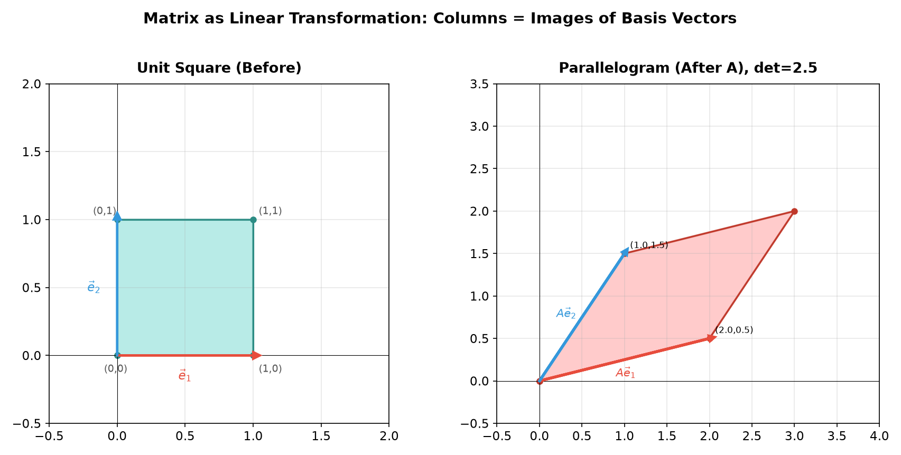

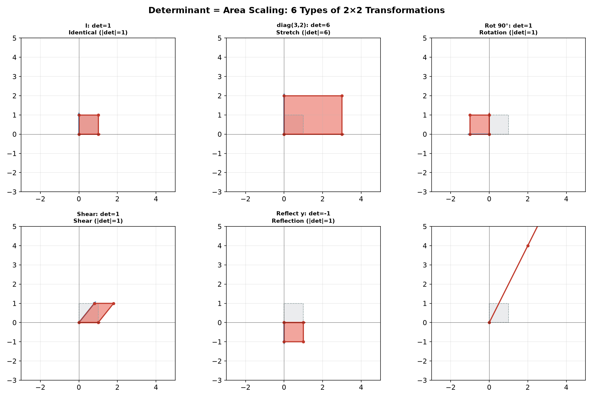

> **Visual guide**: The left image shows how the two columns of $A$ become the edges of a parallelogram. The right image compares six transformation types — stretch, rotation, shear, reflection, and collapse — each with its determinant.

---

## Example 6: Solving Linear Systems with Matrices

The system $\begin{cases} 2x + 3y = 5 \\ x + 4y = 6 \end{cases}$ can be written as $A\vec{x} = \vec{b}$:

$\begin{pmatrix} 2 & 3 \\ 1 & 4 \end{pmatrix}\begin{pmatrix} x \\ y \end{pmatrix} = \begin{pmatrix} 5 \\ 6 \end{pmatrix}$.

Solve by multiplying both sides by $A^{-1}$: $\vec{x} = A^{-1}\vec{b}$.

$A^{-1} = \frac{1}{5}\begin{pmatrix} 4 & -3 \\ -1 & 2 \end{pmatrix}$.
$\begin{pmatrix} x \\ y \end{pmatrix} = \frac{1}{5}\begin{pmatrix} 4 & -3 \\ -1 & 2 \end{pmatrix}\begin{pmatrix} 5 \\ 6 \end{pmatrix} = \frac{1}{5}\begin{pmatrix} 20-18 \\ -5+12 \end{pmatrix} = \frac{1}{5}\begin{pmatrix} 2 \\ 7 \end{pmatrix} = \begin{pmatrix} 0.4 \\ 1.4 \end{pmatrix}$.

Check: $2(0.4) + 3(1.4) = 0.8 + 4.2 = 5$ ✓. $0.4 + 4(1.4) = 0.4 + 5.6 = 6$ ✓.

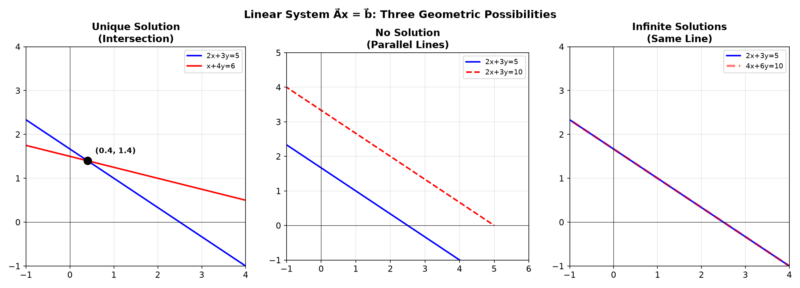

> **Visual guide**: A $2 \times 2$ linear system is two lines in the plane. The solution is their intersection point. The three cases — unique, none, infinite — correspond to $\det \neq 0$, parallel lines, and coincident lines.

---

## Example 7: Matrix Powers — Composing Transformations

Applying $A$ twice means computing $A^2 = A \times A$.

$A = \begin{pmatrix} 0 & -1 \\ 1 & 0 \end{pmatrix}$ (rotation by $90^\circ$).
$A^2 = \begin{pmatrix} -1 & 0 \\ 0 & -1 \end{pmatrix}$ (rotation by $180^\circ$ = $-I$).
$A^3 = \begin{pmatrix} 0 & 1 \\ -1 & 0 \end{pmatrix}$ (rotation by $270^\circ$).
$A^4 = \begin{pmatrix} 1 & 0 \\ 0 & 1 \end{pmatrix} = I$ (full rotation — back to start).

Matrices can represent geometric transformations — rotation, reflection, scaling, shearing — and matrix powers compose those transformations.

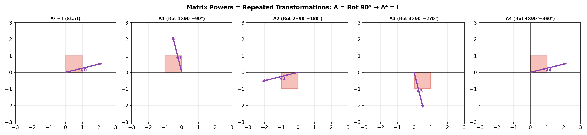

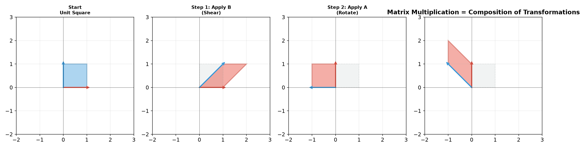

> **Visual guide**: The top image shows repeated application of a $90^\circ$ rotation matrix — after 4 steps, everything returns. The bottom image illustrates why $AB \neq BA$: applying shear then rotation gives a different result than rotation then shear.

> **Up to here**: Matrices are grids. Add and scale entry-by-entry. Multiply via row × column.
> The inverse undoes a matrix: $A^{-1}A = I$. Determinant = area scaling factor.
> Use $A^{-1}\vec{b}$ to solve linear systems. Matrix powers compose transformations.

---

## Part B: Vectors — Direction and Magnitude in Space

---

## Example 8: Vector Basics — Components and Magnitude

A vector is a quantity with both direction and length. In 2D: $\vec{a} = (a_1, a_2)$. In 3D: $\vec{a} = (a_1, a_2, a_3)$.

**Magnitude** (length): $|\vec{a}| = \sqrt{a_1^2 + a_2^2 + a_3^2}$.

$\vec{a} = (3, 4)$. $|\vec{a}| = \sqrt{9+16} = 5$.

**Unit vector** (length 1, same direction): $\hat{a} = \frac{\vec{a}}{|\vec{a}|} = (\frac{3}{5}, \frac{4}{5})$.

Add vectors component-wise: $\vec{a} + \vec{b} = (a_1+b_1, a_2+b_2)$.
Scale a vector: $k\vec{a} = (ka_1, ka_2)$.

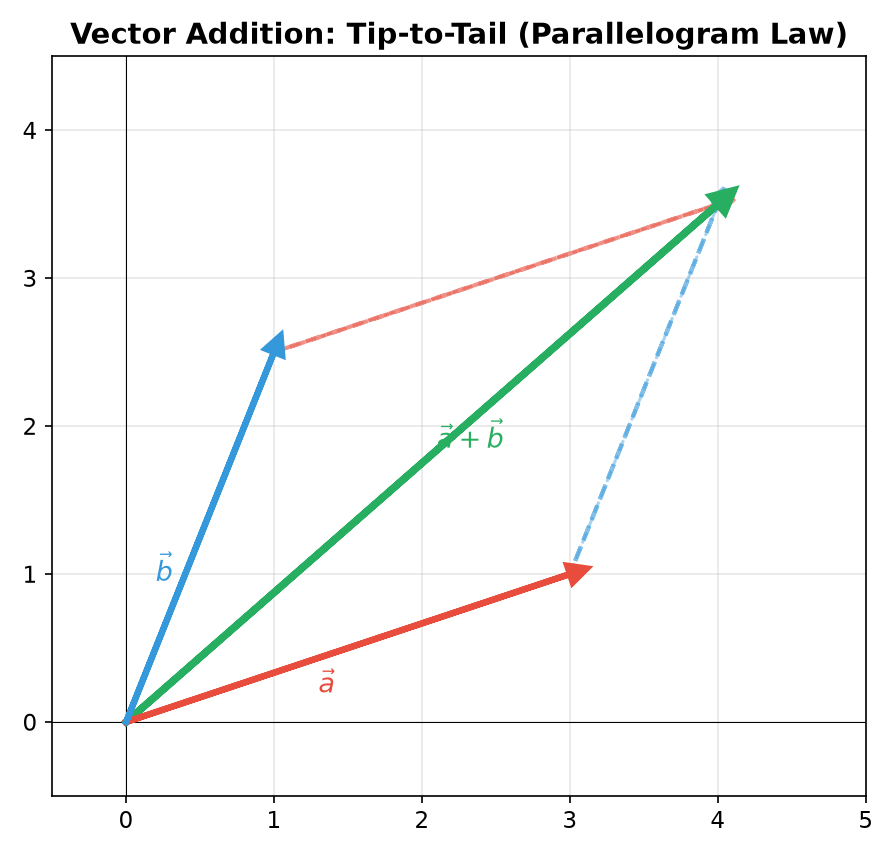

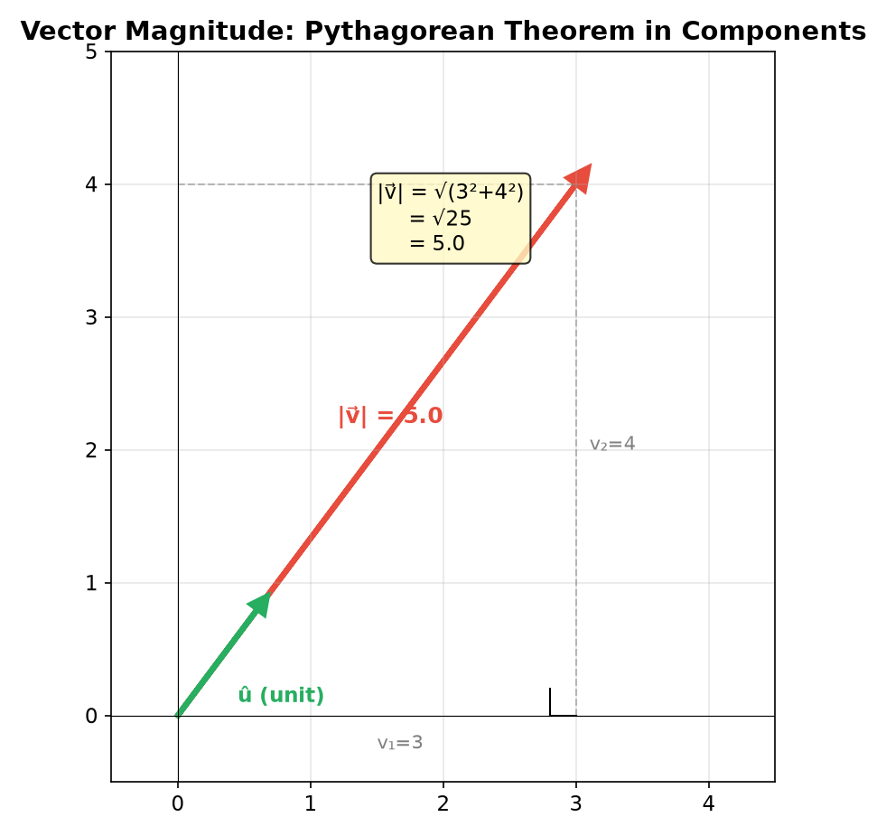

> **Visual guide**: The top image shows the parallelogram law for adding two vectors. The bottom image shows how the magnitude (length) of a vector comes directly from the Pythagorean theorem applied to its components.

---

## Example 9: Dot Product — Angle and Perpendicular Test

$\vec{a}\cdot\vec{b} = a_1b_1 + a_2b_2 + a_3b_3 = |\vec{a}||\vec{b}|\cos\theta$.

The dot product gives the cosine of the angle between two vectors.

$(3,4)\cdot(1,2) = 3\cdot1 + 4\cdot2 = 3 + 8 = 11$.
$\cos\theta = \frac{11}{5 \cdot \sqrt{5}} = \frac{11}{5\sqrt{5}}$. $\theta \approx 10.3^\circ$ — nearly parallel.

**Dot product = 0 → perpendicular.**
$(3,4)\cdot(-4,3) = -12 + 12 = 0$. The vectors are at right angles.

**Dot product sign**:
- Positive → angle $< 90^\circ$ (acute).
- Zero → exactly $90^\circ$ (perpendicular).
- Negative → angle $> 90^\circ$ (obtuse).

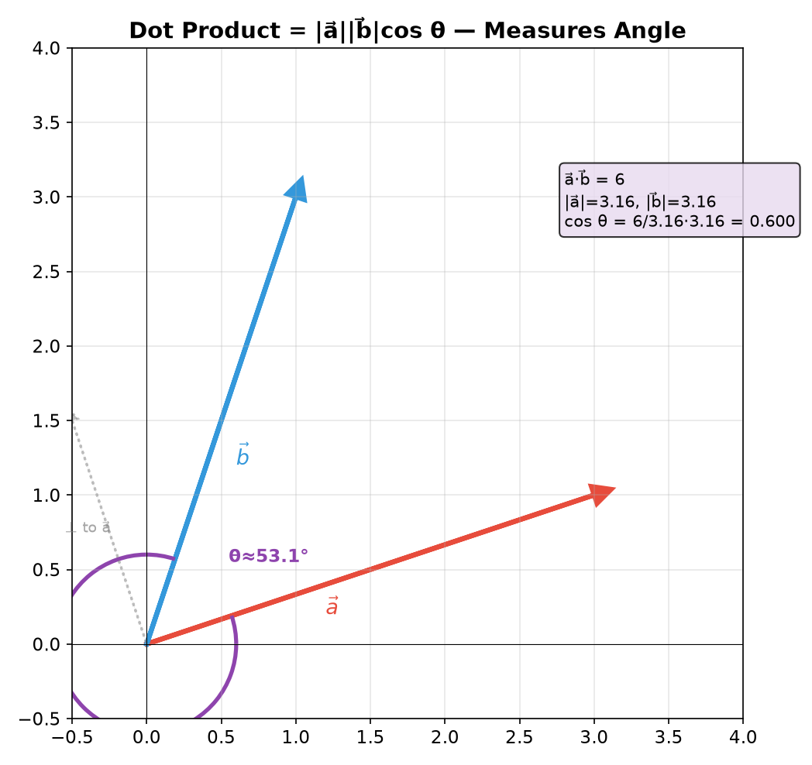

> **Visual guide**: The dot product $\vec{a}\cdot\vec{b} = |\vec{a}||\vec{b}|\cos\theta$ directly gives the cosine of the angle. When the dot product is zero, the vectors are perpendicular (the angle arc would show $90^\circ$).

---

## Example 10: Vector Projection — The Shadow of One Vector on Another

**Scalar projection** (the length of the shadow): $\text{comp}_{\vec{b}}\vec{a} = \frac{\vec{a}\cdot\vec{b}}{|\vec{b}|}$.

**Vector projection** (the shadow as a vector): $\text{proj}_{\vec{b}}\vec{a} = \frac{\vec{a}\cdot\vec{b}}{|\vec{b}|^2}\vec{b}$.

**Example**: $\vec{a} = (3,4)$, $\vec{b} = (1,0)$ (the $x$-axis).
Scalar projection = $\frac{3\cdot1 + 4\cdot0}{1} = 3$. The shadow of $(3,4)$ on the $x$-axis has length 3.
Vector projection = $3\cdot(1,0) = (3,0)$. The shadow as a vector is $(3,0)$.

The projection formula decomposes any vector into a part parallel to $\vec{b}$ and a part perpendicular to $\vec{b}$.

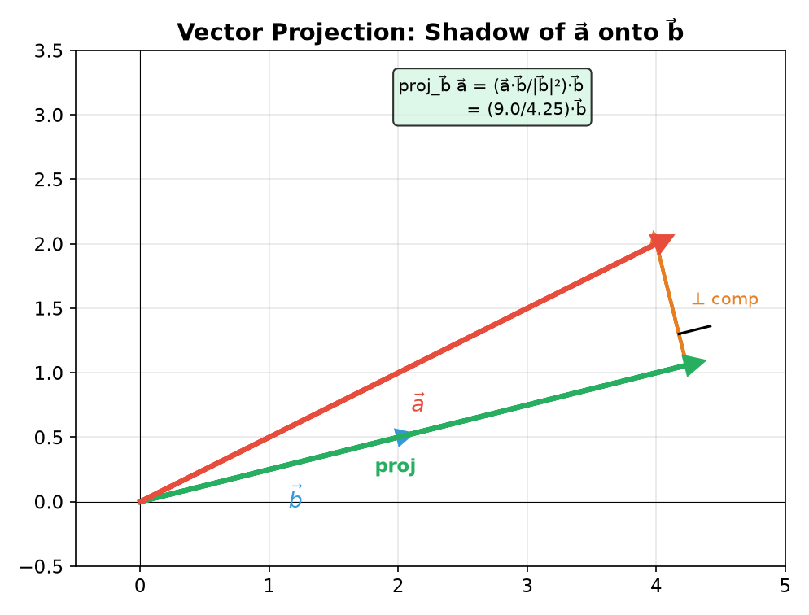

> **Visual guide**: The green arrow is $\text{proj}_{\vec{b}}\vec{a}$, the shadow of $\vec{a}$ falling onto $\vec{b}$. The orange dashed arrow is the perpendicular remainder — together they add back to $\vec{a}$.

---

## Example 11: Cross Product — 3D Only, Produces a Perpendicular Vector

The cross product $\vec{a} \times \vec{b}$ gives a vector perpendicular to both $\vec{a}$ and $\vec{b}$.

$\vec{a} \times \vec{b} = (a_2b_3 - a_3b_2,\; a_3b_1 - a_1b_3,\; a_1b_2 - a_2b_1)$.

**Example**: $(1,0,0) \times (0,1,0) = (0,0,1)$.
The $x$-axis crossed with the $y$-axis produces the $z$-axis — right-hand rule.

**Magnitude of cross product**: $|\vec{a} \times \vec{b}| = |\vec{a}||\vec{b}|\sin\theta$.
This equals the area of the parallelogram formed by $\vec{a}$ and $\vec{b}$.

**Cross product = 0 → parallel vectors** (since $\sin\theta = 0$).

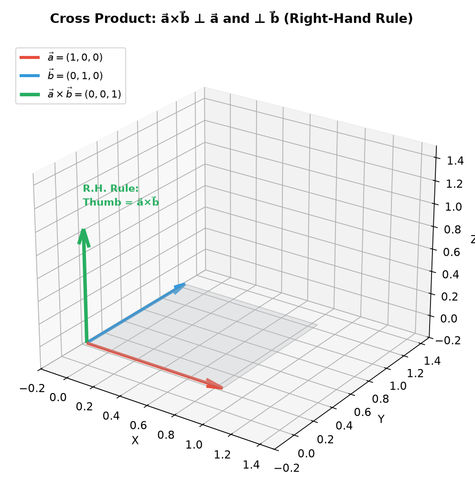

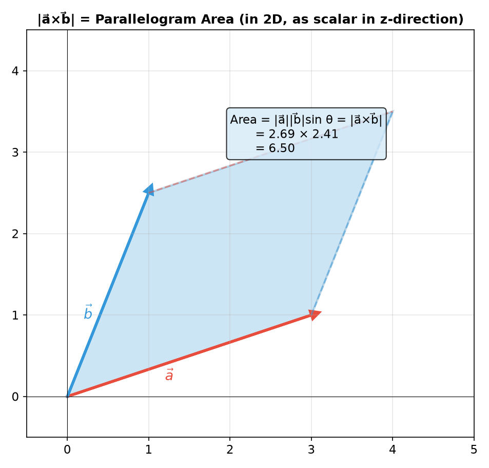

> **Visual guide**: The top 3D image shows how $\vec{a}\times\vec{b}$ points perpendicular to the plane containing $\vec{a}$ and $\vec{b}$. The bottom 2D image shows that the magnitude $|\vec{a}\times\vec{b}|$ equals the area of the parallelogram spanned by the two vectors.

---

## Example 12: Using Vectors for Geometry — Area and Distance

**Triangle area** (3D): $\frac{1}{2}|\vec{AB} \times \vec{AC}|$.

**Triangle area** (2D): $\frac{1}{2}|a_1b_2 - a_2b_1|$ where $(a_1,a_2)$ and $(b_1,b_2)$ are two side vectors.

$\vec{AB} = (3,1)$, $\vec{AC} = (1,4)$. Area = $\frac{1}{2}|3\cdot4 - 1\cdot1| = \frac{1}{2} \cdot 11 = \frac{11}{2}$.

**Distance from a point to a line** (3D): line through $P$ with direction $\vec{d}$, point $Q$.
$d = \frac{|\vec{d} \times (\vec{Q} - \vec{P})|}{|\vec{d}|}$.

The cross product appears whenever you need a perpendicular direction or an area.

> **Up to here**: Vectors have magnitude and direction. Dot product → angle. Cross product → perpendicular direction + area.
> Projection → shadow along a direction. Vectors solve geometry without coordinate geometry formulas.

---

## Part C: How Matrices and Vectors Work Together

---

## Example 13: Matrices as Transformations of Vectors

A matrix $A$ takes a vector $\vec{x}$ as input and produces a new vector $A\vec{x}$ as output. This is a **linear transformation** — it preserves addition and scalar multiplication.

The columns of $A$ tell you exactly where the standard basis vectors go:
- Column 1 = $A\vec{e}_1$ (image of the $x$-axis direction).
- Column 2 = $A\vec{e}_2$ (image of the $y$-axis direction).

**Example**: $A = \begin{pmatrix} 2 & 1 \\ 0.5 & 1.5 \end{pmatrix}$ maps $\vec{e}_1 = (1,0)$ to $(2, 0.5)$ and $\vec{e}_2 = (0,1)$ to $(1, 1.5)$. The unit square becomes the parallelogram spanned by these two column vectors.

**Rotation matrix**: $R_\theta = \begin{pmatrix} \cos\theta & -\sin\theta \\ \sin\theta & \cos\theta \end{pmatrix}$ rotates every vector by $\theta$ counterclockwise.

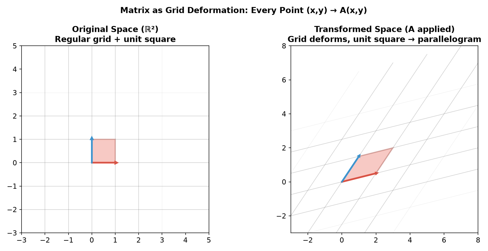

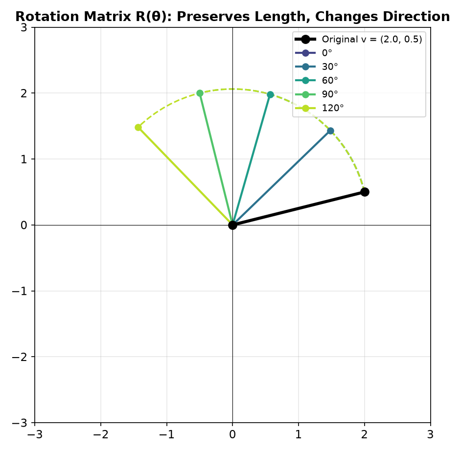

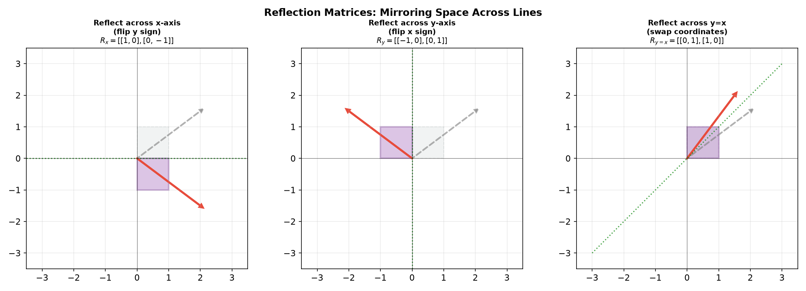

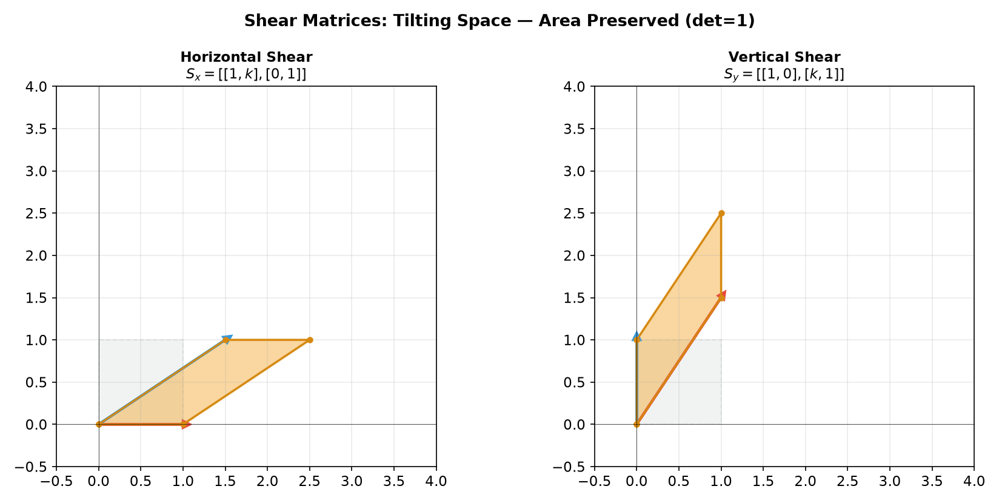

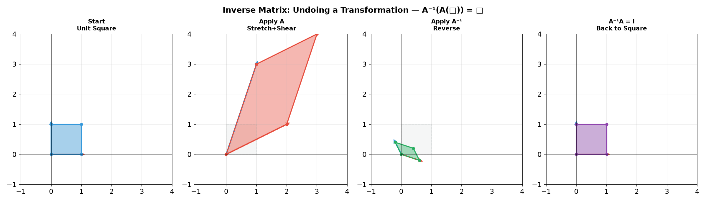

> **Visual guide**: These five images together show the complete geometric picture. The grid deformation shows how every point in space moves. Rotation, reflection, and shear are the fundamental building blocks — any linear transformation can be decomposed into these. The inverse image proves visually that $A^{-1}(A(\square)) = \square$.

---

## Visual Interlude: From 2D to 3D to $n$D

**Dimension 2 — Area.** In 2D, the determinant scales area. A $2 \times 2$ matrix turns the unit square into a parallelogram. Area = $|\det(A)|$.

**Dimension 3 — Volume.** In 3D, the determinant scales volume. A $3 \times 3$ matrix turns the unit cube into a parallelepiped.

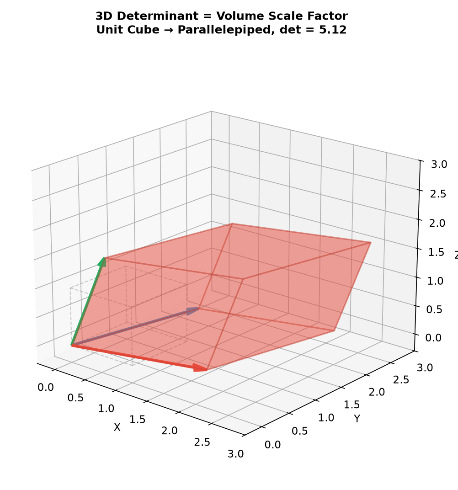

**Beyond 3D — Hyper-volume.** In 4D and higher, we lose direct visual intuition. But the determinant still scales "hyper-volume" in exactly the same way.

**How projection works — reducing dimension step by step:**

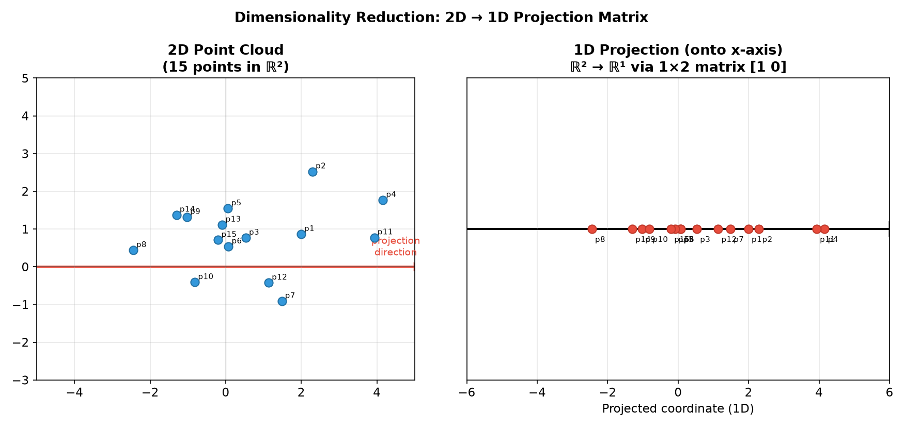

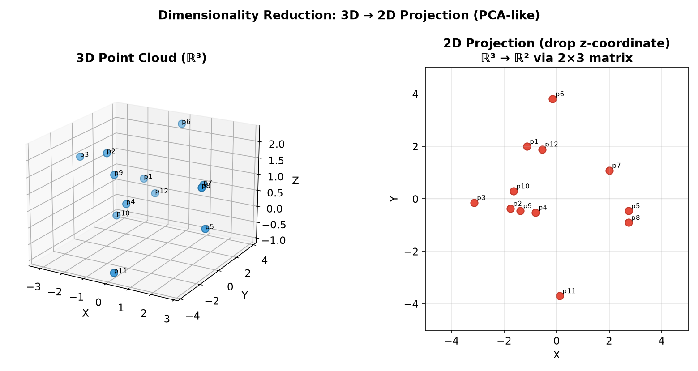

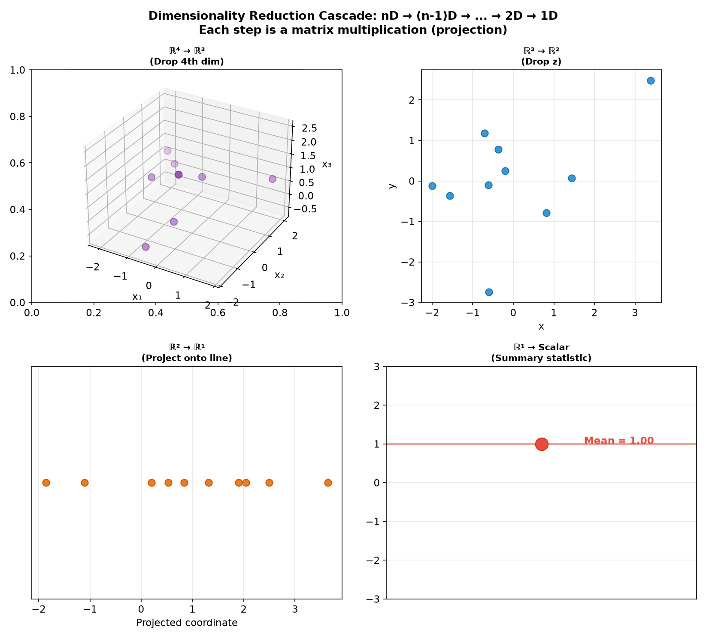

A 4D→2D projection (like PCA or t-SNE in machine learning) is just a $2 \times 4$ matrix that collapses 4 dimensions onto a flat screen while preserving as much structure as possible. The determinant in higher dimensions still measures the volume-scaling factor — we just cannot draw it directly.

**The unifying idea**: In every dimension, a matrix is a transformation of space. The determinant measures how much the transformation scales volume. Vectors are the objects being transformed. The dot product, cross product, and projection are tools for measuring relationships between vectors — angles, areas, shadows — in any dimension.

---

## Common Mistakes

### Mistake 1: Forgetting that $AB \neq BA$ for matrices

**Wrong path**: "Matrix multiplication works like regular multiplication — order does not matter."

**Why wrong**: $AB$ and $BA$ are usually different matrices. Matrix multiplication is not commutative.

**Right path**: Always check the order. $A$ times $B$ means apply $B$ first, then $A$ (when thinking about transformations).

---

### Mistake 2: Dot product negative → acute angle

**Wrong path**: "A negative dot product means the angle is less than $90^\circ$."

**Why wrong**: $\vec{a}\cdot\vec{b} = |\vec{a}||\vec{b}|\cos\theta$. If the dot product is negative, $\cos\theta$ is negative, so $\theta > 90^\circ$ (obtuse).

**Right path**: Dot product sign = $\cos\theta$ sign. Positive → acute. Zero → right angle. Negative → obtuse.

---

### Mistake 3: Cross product is commutative

**Wrong path**: "$\vec{a} \times \vec{b} = \vec{b} \times \vec{a}$."

**Why wrong**: $\vec{a} \times \vec{b} = -(\vec{b} \times \vec{a})$. The cross product is anti-commutative — swapping the order flips the sign.

**Right path**: $\vec{a} \times \vec{b}$ points one way (right-hand rule). $\vec{b} \times \vec{a}$ points the opposite way.

---

### Mistake 4: Trying to invert a singular matrix

**Wrong path**: "I'll find $A^{-1}$ using the formula... oh wait, dividing by zero?"

**Why wrong**: If $\det(A) = 0$, the matrix has no inverse. The transformation collapses space and cannot be undone.

**Right path**: Check $\det(A)$ first. If it is 0, the system either has no solution or infinitely many.

---

## What We Just Did

```
(1) Matrices — add entry-by-entry. Multiply: row i × column j.
    Identity I acts like 1. Inverse A^{-1} undoes A.
    Determinant = area/volume scaling factor.
    Solve A\vec{x} = \vec{b} via \vec{x} = A^{-1}\vec{b}.

(2) Vectors — magnitude = |\vec{a}|. Dot product → cos θ → angle.
    Cross product → perpendicular vector + parallelogram area.
    Projection → shadow of one vector onto another.
    Triangle area = ½|\vec{AB}×\vec{AC}|.

(3) Connection — matrix columns = images of basis vectors.
    A 2×2 matrix maps the unit square to a parallelogram (area = |det|).
    A 3×3 matrix maps the unit cube to a parallelepiped (volume = |det|).
    In nD, the determinant scales hyper-volume. Projection matrices reduce dimension.
```

---

## Practice 1

A $2 \times 2$ matrix $A$ has determinant 0. What does this tell you geometrically about the transformation $A$ represents? Give a concrete example of such a matrix and describe what it does to the unit square.

→ Reference: **Example 5**

> Solutions: [Solutions](solutions/12A2-solutions.md#practice-1)

---

## Practice 2

Solve the system using matrix inversion:
$\begin{cases} 3x - 2y = 7 \\ x + 4y = 5 \end{cases}$

→ Reference: **Example 6**

> Solutions: [Solutions](solutions/12A2-solutions.md#practice-2)

---

## Practice 3

$\vec{a} = (2, -1, 3)$, $\vec{b} = (1, 4, -2)$. Find the dot product and the cross product. Verify that the cross product is perpendicular to both $\vec{a}$ and $\vec{b}$.

→ Reference: **Example 9, 11**

> Solutions: [Solutions](solutions/12A2-solutions.md#practice-3)

---

## Practice 4

Find the area of the triangle with vertices $A(0,0,0)$, $B(3,1,0)$, $C(1,4,0)$ using the cross product.

→ Reference: **Example 12**

> Solutions: [Solutions](solutions/12A2-solutions.md#practice-4)

---

## Practice 5: Composition

Invent a $2 \times 2$ matrix that represents a reflection across the $x$-axis, and another that represents a $90^\circ$ counterclockwise rotation. Multiply them in both orders and describe the geometric meaning of each product.

→ Reference: **Example 7**

> Solutions: [Solutions](solutions/12A2-solutions.md#practice-5)

---

## Practice 6

Find the scalar and vector projections of $\vec{a} = (5, 12)$ onto $\vec{b} = (3, 4)$.

→ Reference: **Example 10**

> Solutions: [Solutions](solutions/12A2-solutions.md#practice-6)

---

## Practice 7

For $A = \begin{pmatrix} 2 & 1 \\ 5 & 3 \end{pmatrix}$, compute $A^{-1}$ and verify $A A^{-1} = I$.

→ Reference: **Example 4**

> Solutions: [Solutions](solutions/12A2-solutions.md#practice-7)

---

## Practice 8: Real Battle

A $3 \times 3$ matrix $M$ has column vectors $\vec{v}_1 = (2,0,0)$, $\vec{v}_2 = (0,3,0)$, $\vec{v}_3 = (0,0,5)$. Find $\det(M)$. What is the volume of the parallelepiped formed by these three vectors? If we apply $M$ to the unit cube, what shape results and what is its volume?

→ Reference: **Example 5, Visual Interlude**

> Solutions: [Solutions](solutions/12A2-solutions.md#practice-8)

---

## Basic Algebra Drill — Matrices and Vectors (15 Problems)

> Pure calculation + geometric fusion. Build fluency with fundamental operations.

**D1.** Multiply $\begin{pmatrix} 2 & 1 \\ 0 & 3 \end{pmatrix} \times \begin{pmatrix} 4 & -1 \\ 2 & 1 \end{pmatrix}$.

**D2.** Compute the determinant of $\begin{pmatrix} 3 & 5 \\ 2 & 4 \end{pmatrix}$.

**D3.** Find $|\vec{a}|$ for $\vec{a} = (6, -8)$.

**D4.** Compute $\vec{a}\cdot\vec{b}$ for $\vec{a} = (1, -2, 3)$, $\vec{b} = (4, 0, -1)$.

**D5.** Add the matrices: $\begin{pmatrix} 1 & 3 \\ 2 & -1 \end{pmatrix} + \begin{pmatrix} 4 & 0 \\ -2 & 5 \end{pmatrix}$.

**D6.** Scale the vector: $5 \cdot (-2, 3, 1)$. Write as a vector.

**D7.** Compute the cross product: $(2, 1, 0) \times (0, 3, 1)$.

**D8.** Find a unit vector in the direction of $\vec{v} = (3, -4)$.

**D9.** Compute $\det\begin{pmatrix} 1 & 0 & 0 \\ 0 & 2 & 0 \\ 0 & 0 & 3 \end{pmatrix}$.

**D10.** Find the dot product of $\vec{u} = (2, -1)$ and $\vec{v} = (-3, 4)$. Are they perpendicular?

**D11. ◆ Geometry Fusion** — The matrix $A = \begin{pmatrix} 2 & 0 \\ 0 & 0.5 \end{pmatrix}$ stretches the $x$-axis by 2 and shrinks the $y$-axis by 0.5. Draw (in your mind) what happens to the unit square. What is the area of the resulting shape? What is $\det(A)$?

**D12. ◆ Geometry Fusion** — The columns of a $2 \times 2$ matrix are $\vec{c}_1 = (4, 0)$ and $\vec{c}_2 = (1, 3)$. What shape do these two vectors span? Find its area. Then write the matrix $A$ and compute $\det(A)$ to confirm.

**D13. ◆ Geometry Fusion** — A vector $\vec{v} = (2, 5)$ is transformed by $A = \begin{pmatrix} 0 & -1 \\ 1 & 0 \end{pmatrix}$. Find $A\vec{v}$. What is the angle between $\vec{v}$ and $A\vec{v}$? (Hint: use the dot product.) What geometric operation does $A$ perform?

**D14. ◆ Geometry Fusion** — The matrix $B = \begin{pmatrix} 1 & 2 \\ 2 & 4 \end{pmatrix}$ has $\det(B) = 0$. What do the columns of $B$ look like geometrically? Explain why the transformation collapses the plane, and what the image (range) looks like.

**D15. ◆ Geometry Fusion** — Apply the shear matrix $S = \begin{pmatrix} 1 & 1.5 \\ 0 & 1 \end{pmatrix}$ to the vector $\vec{v} = (2, 1)$. Draw the original and transformed vector. Does the shear change the $y$-coordinate? Does it change the area of any shape? Explain why $\det(S) = 1$.

> Solutions: [Solutions](solutions/12A2-solutions.md#basic-drill)

---

## Advanced Algebra Drill — Matrices and Vectors (15 Problems)

> Multi-step. Connect matrices to transformations and vectors to geometry. Includes geometric fusion problems.

**A1.** Find $A^{-1}$ for $A = \begin{pmatrix} 4 & 3 \\ 3 & 2 \end{pmatrix}$. Then compute $A \times A^{-1}$ to verify.

**A2.** Find a vector perpendicular to both $\vec{a} = (1, 2, 3)$ and $\vec{b} = (4, 5, 6)$ using the cross product.

**A3.** Write the rotation matrix for $60^\circ$ counterclockwise. Apply it to the vector $(1, 0)$. What are the new coordinates?

**A4.** Solve the system: $2x + y - z = 3$, $x - y + 2z = 1$, $3x + 2y + z = 7$.

**A5.** Find the angle between $\vec{a} = (1, 1, 0)$ and $\vec{b} = (0, 1, 1)$.

**A6.** Find the scalar and vector projections of $\vec{a} = (5, 12)$ onto $\vec{b} = (3, 4)$.

**A7.** Compute $A^2$ for $A = \begin{pmatrix} 1 & 2 \\ 3 & 4 \end{pmatrix}$.

**A8.** Find the area of the triangle with vertices $(0,0,0)$, $(2,1,0)$, $(0,3,0)$ using the cross product.

**A9.** Find a $2 \times 2$ matrix $A$ such that $A^2 = I$ but $A \neq \pm I$. (Hint: think about reflections.)

**A10.** The columns of a $2 \times 2$ matrix are $(3,1)$ and $(1,3)$. Find the area of the parallelogram they span.

> **◆ Geometry Fusion (Problems A11–A15)** — These problems fuse matrix algebra with vector geometry. Visualize before calculating.

**A11. ◆** A matrix $M$ first shears ($S = \begin{pmatrix} 1 & 1 \\ 0 & 1 \end{pmatrix}$) then rotates by $90^\circ$ ($R = \begin{pmatrix} 0 & -1 \\ 1 & 0 \end{pmatrix}$). Write the combined matrix $RS$. Apply it to the unit square vertices $(0,0)$, $(1,0)$, $(1,1)$, $(0,1)$. Sketch the final shape. What is $\det(RS)$ and what does it mean geometrically?

**A12. ◆** The matrix $P = \begin{pmatrix} 3/5 & 4/5 \\ 4/5 & -3/5 \end{pmatrix}$ satisfies $P^2 = I$ and $P = P^T$. Apply $P$ to the vector $\vec{v} = (5, 0)$. Then compute the angle between $\vec{v}$ and $P\vec{v}$ using the dot product. What geometric transformation does $P$ represent? (Hint: check $\det(P)$.)

**A13. ◆** Find a $2 \times 2$ matrix $A$ that projects every vector onto the line $y = 2x$. (Hint: the projection of $(x,y)$ onto direction $(1,2)$.) Apply $A$ to $(3, 1)$ and verify that the result lies on $y = 2x$. What is $\det(A)$ and why does that make sense geometrically?

**A14. ◆** Two vectors $\vec{a} = (4, 1, 2)$ and $\vec{b} = (1, 3, -1)$ define a parallelogram in 3D. Find its area using $|\vec{a} \times \vec{b}|$. Then find a unit vector perpendicular to the parallelogram. If we form a $3 \times 3$ matrix $M$ whose first two columns are $\vec{a}$ and $\vec{b}$ and third column is $\vec{a} \times \vec{b}$, what is $\det(M)$? (Think geometrically before computing.)

**A15. ◆** The transformation $T(\vec{x}) = A\vec{x}$ with $A = \begin{pmatrix} 0.8 & -0.6 \\ 0.6 & 0.8 \end{pmatrix}$ is applied to a triangle with vertices $(0,0)$, $(2,0)$, $(0,1)$. Find the area of the original triangle, then the area of the transformed triangle. Explain why the areas are equal. Is $A$ a pure rotation? How can you tell from the columns?

> Solutions: [Solutions](solutions/12A2-solutions.md#advanced-drill)

---

## Today's Procedure

```
Step 1: Matrix operations — add entry-by-entry, scale entry-by-entry.
         Multiply: row i × column j. Check inner dimensions match.
         Inverse (2×2): swap a,d; negate b,c; divide by det.
         Determinant = area scaling in 2D, volume scaling in 3D.

Step 2: Vector operations — magnitude: sqrt of sum of squares.
         Dot product: multiply components, sum → cos θ → angle.
         Cross product (3D): formula gives perpendicular vector. |a×b| = area.
         Projection: (a·b/|b|²) b gives the shadow of a onto b.

Step 3: Connection — matrix × vector = new vector. Columns of a matrix
         are the images of the standard basis vectors. In any dimension,
         a matrix transforms space; the determinant tells you the volume scale.
```

---

## How to Read These Symbols

| Symbol | Reads as | Meaning |
|:---:|:---:|------|
| $\vec{v} = \langle v_1, v_2 \rangle$ | "vector v equals angle-bracket v1 comma v2" | vector in component form |
| $\|\vec{v}\|$ | "magnitude of v" / "norm of v" / "length" | $\sqrt{v_1^2+v_2^2}$ — length of the arrow |
| $\vec{v} \cdot \vec{w}$ | "v dot w" / "dot product" | $v_1w_1+v_2w_2$ — scalar result, related to cosine of angle |
| $\vec{v} \cdot \vec{w} = \|\vec{v}\|\|\vec{w}\|\cos\theta$ | "v dot w equals norm v times norm w times cosine theta" | geometric dot product formula |
| $A = [a_{ij}]$ | "A equals matrix with entries a i j" | matrix: i=row index, j=column index |
| $AB$ | "A times B" / "matrix product" | $(AB)_{ij} = \sum_k a_{ik}b_{kj}$ — row of A dot column of B |
| $A^{-1}$ | "A inverse" | matrix inverse: $AA^{-1}=A^{-1}A=I$ |
| $I$ | "I" / "the identity matrix" | ones on diagonal, zeros elsewhere — like multiplying by 1 |
| $\det(A)$ | "determinant of A" | $\det = ad-bc$ for 2×2 — zero means singular (no inverse) |
| $A^\mathsf{T}$ | "A transpose" | rows become columns, columns become rows |
| orthogonal | "orthogonal" | $\vec{v}\cdot\vec{w}=0$ — perpendicular vectors |
| $\vec{0}$ | "zero vector" | vector with all components zero |

---

## Terminology

Up to now we used plain words like "grid", "dot product", "shadow", "cross".
**You have already learned all the methods.** Now we attach the formal mathematical names.

| What we called it | Mathematical term | Notation |
|:-----------------:|:-----------------:|:--------:|
| matrix | matrix | $A = (a_{ij})$ |
| determinant | determinant | $\det(A) = ad-bc$ |
| identity matrix | identity matrix | $I$, $AI = IA = A$ |
| inverse matrix | matrix inverse | $A^{-1}$, $AA^{-1}=I$ |
| dot product | dot product / scalar product | $\vec{a}\cdot\vec{b}$ |
| cross product | cross product / vector product | $\vec{a} \times \vec{b}$ |
| projection | vector projection | $\text{proj}_{\vec{b}}\vec{a}$ |
| linear transformation | linear transformation | $\vec{x} \mapsto A\vec{x}$ |
| basis vector | standard basis vector | $\vec{e}_1 = (1,0)$, $\vec{e}_2 = (0,1)$ |
| parallelepiped | parallelepiped | 3D analog of parallelogram |
| hyper-volume | hyper-volume / $n$-dimensional volume | $|\det(A)|$ in any dimension |
