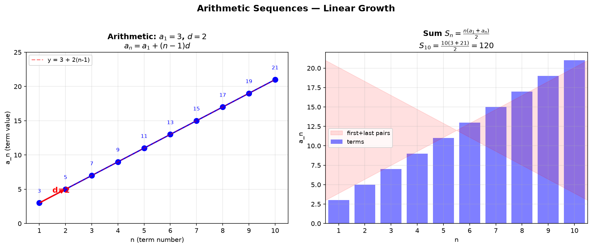
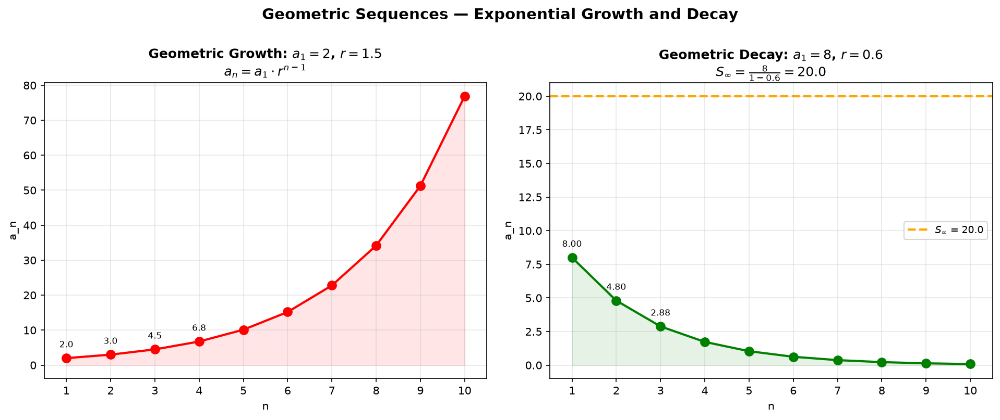
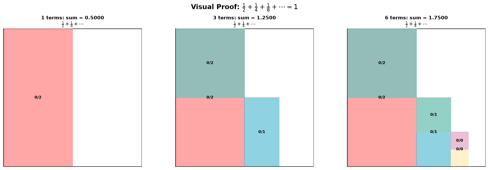
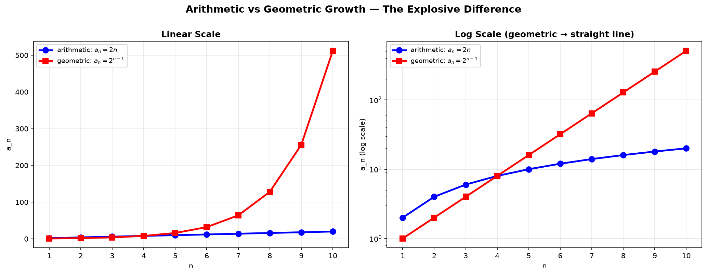
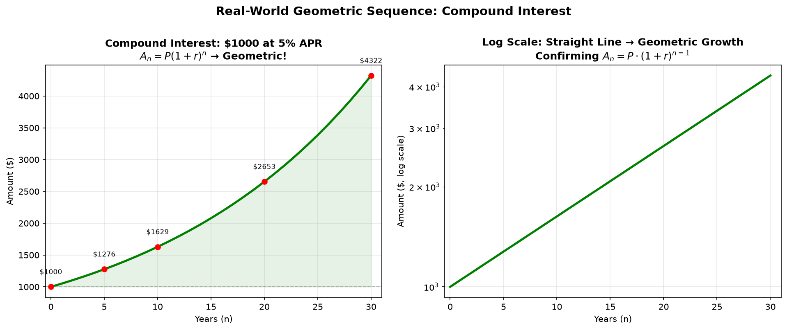
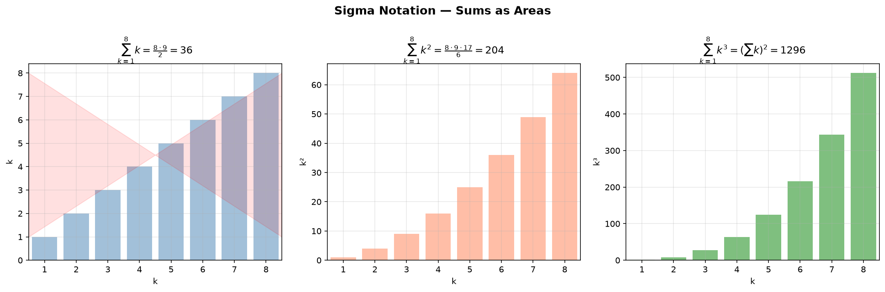
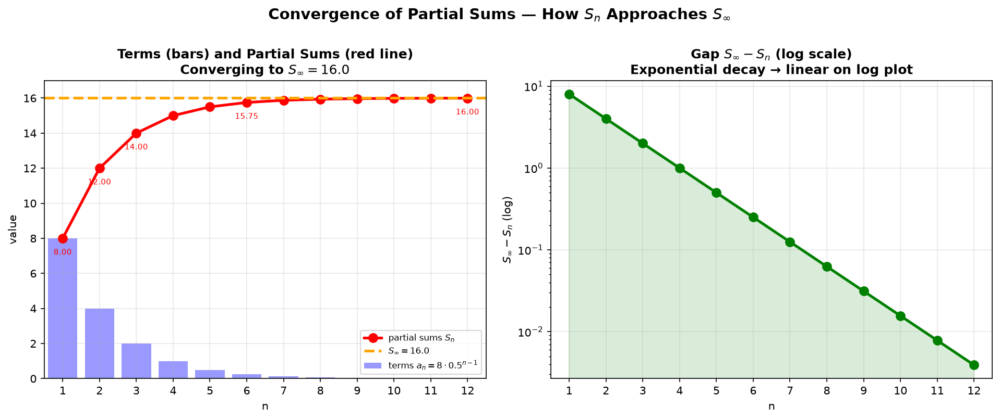

# Session 12B1: Sequences and Series — Foundations

**Phase 2 — Classical Techniques | 80 min**

*Prerequisites: 9A1 (function fundamentals), 9A2 (graph drawing toolkit)*

> Sequences are functions whose domain is the natural numbers. Series are sums of sequences. Mastering the two fundamental types — arithmetic and geometric — unlocks everything from compound interest to infinite sums.

---

## Part A: The Two Pillars — Arithmetic and Geometric Sequences

> Every sequence is a list of numbers. But the useful ones follow a pattern. Two patterns dominate: **add the same number** (arithmetic) and **multiply by the same number** (geometric).

---

## Example 1: Arithmetic Sequence — Linear Growth

Start at 3. Add 2 each time.
Write out the first few terms: $3, 5, 7, 9, 11, 13, \dots$

**Finding the $n$th term — three steps:**
(1) Identify the first term $a_1$. → $3$.
(2) Identify the common difference $d$ (the number added each step). → $2$.
(3) Count how many times $d$ was added to reach term $n$. → $n-1$ times.

$$a_n = a_1 + (n-1)d$$

10th term: $3 + 9 \times 2 = 3 + 18 = 21$.
100th term: $3 + 99 \times 2 = 201$.

**Sum of the first $n$ terms — two equivalent formulas:**
Method 1 — pair first and last: $S_n = \frac{n(a_1 + a_n)}{2}$.
Method 2 — use $a_1$ and $d$ directly: $S_n = \frac{n}{2}[2a_1 + (n-1)d]$.

Sum of first 10 terms:
$S_{10} = \frac{10(3+21)}{2} = \frac{10 \cdot 24}{2} = 120$.
Check by adding manually: $3+5+7+9+11+13+15+17+19+21 = 120$. Matches perfectly.

**Where does $S_n = n(a_1 + a_n)/2$ come from?** Write the sum forward and backward:
$S_n = a_1 + a_2 + \cdots + a_n$.
$S_n = a_n + a_{n-1} + \cdots + a_1$.
Add: $2S_n = (a_1 + a_n) + (a_2 + a_{n-1}) + \cdots + (a_n + a_1)$.
Each pair sums to $a_1 + a_n$, and there are $n$ pairs. Hence $2S_n = n(a_1 + a_n)$.



*Graph 12B1a: Left — An arithmetic sequence $a_n = 3 + 2(n-1)$ plotted as points. The slope of the dashed line equals the common difference $d=2$. Right — Bar chart showing the sum $S_{10} = 120$ as paired first-and-last terms.*

---

## Example 2: Geometric Sequence — Exponential Growth

Start at 2. Multiply by 3 each time.
Write out the first few terms: $2, 6, 18, 54, 162, \dots$

**Finding the $n$th term:**
(1) Identify the first term $a_1$. → $2$.
(2) Identify the common ratio $r$ (the multiplier). → $3$.
(3) Count how many times $r$ was multiplied: $n-1$ times.

$$a_n = a_1 \cdot r^{\,n-1}$$

5th term: $2 \times 3^4 = 2 \times 81 = 162$.

**Sum of the first $n$ terms:**
$$S_n = a_1\frac{1-r^n}{1-r} \quad (r \neq 1)$$

Sum of first 5 terms:
$S_5 = 2 \cdot \frac{1-3^5}{1-3} = 2 \cdot \frac{1-243}{-2} = 2 \cdot \frac{-242}{-2} = 242$.
Check: $2+6+18+54+162 = 242$. Perfect.

**Alternate form** (sometimes more convenient when $r > 1$):
$S_n = a_1\frac{r^n-1}{r-1}$. Same result, fewer negatives.

**Derivation of the sum formula:**
$S_n = a_1 + a_1r + a_1r^2 + \cdots + a_1r^{n-1}$.
Multiply by $r$: $rS_n = a_1r + a_1r^2 + \cdots + a_1r^n$.
Subtract: $S_n - rS_n = a_1 - a_1r^n$ → $S_n(1-r) = a_1(1-r^n)$.



*Graph 12B1b: Left — Geometric growth with $a_1=2$, $r=1.5$ (red). The curve bends upward because each step multiplies. Right — Geometric decay with $a_1=8$, $r=0.6$ (green). The dashed orange line shows the infinite sum $S_\infty = a_1/(1-r)$.*

---

## Example 3: Infinite Geometric Series — Adding Forever

**Condition**: $|r| < 1$ (the ratio's absolute value must be less than 1).
When this holds, the terms shrink to zero and the infinite sum converges:

$$S_\infty = \frac{a_1}{1-r}$$

**Where does this come from?** Take $S_n = a_1\frac{1-r^n}{1-r}$ and let $n \to \infty$.
Since $|r| < 1$, we have $r^n \to 0$. Thus $S_\infty = \frac{a_1}{1-r}$.

**Example 1**: $2 + 1 + \frac{1}{2} + \frac{1}{4} + \cdots$
$a_1 = 2$, $r = \frac{1}{2}$. $S_\infty = \frac{2}{1-\frac{1}{2}} = \frac{2}{\frac{1}{2}} = 4$.

**Example 2**: Prove $0.\overline{9} = 1$.
$0.999\ldots = \frac{9}{10} + \frac{9}{100} + \frac{9}{1000} + \cdots$
$a_1 = \frac{9}{10}$, $r = \frac{1}{10}$.
$S_\infty = \frac{9/10}{1 - 1/10} = \frac{9/10}{9/10} = 1$. Proven.

**Visual proof**: Imagine a unit square. Shade $\frac12$, then $\frac14$, then $\frac18$, and so on. The shaded area approaches the entire square — area $= 1$.



*Graph 12B1c: A unit square subdivided into $\frac12 + \frac14 + \frac18 + \cdots$. After 1 term, half the square is covered. After 3 terms, $\frac78$ is covered. After 6 terms, $\frac{63}{64}$ — nearly the whole square. The remaining unshaded area shrinks to zero.*

---

## Example 4: Recognizing Arithmetic vs. Geometric

Given the first few terms, decide which type it is:

**Sequence A**: $7, 11, 15, 19, \dots$
Differences: $11-7=4$, $15-11=4$, $19-15=4$. Constant difference → **arithmetic**, $d=4$.

**Sequence B**: $3, 6, 12, 24, \dots$
Ratios: $\frac{6}{3}=2$, $\frac{12}{6}=2$, $\frac{24}{12}=2$. Constant ratio → **geometric**, $r=2$.

**Sequence C**: $1, 4, 9, 16, \dots$
Differences: $3, 5, 7$ (not constant). Ratios: $4, 2.25, 1.78$ (not constant).
Neither arithmetic nor geometric — this is $n^2$, a quadratic sequence. **(See 12B2, Method of Differences)**

**Sequence D**: $5, 5, 5, 5, \dots$
Differences: $0, 0, 0$ (constant). Ratios: $1, 1, 1$ (constant).
This is **both** arithmetic ($d=0$) and geometric ($r=1$). A constant sequence.



*Graph 12B1d: Left — On a linear scale, arithmetic ($a_n=2n$, blue) grows as a straight line while geometric ($a_n=2^{n-1}$, red) explodes upward. Right — On a log scale, geometric becomes a straight line (exponential = linear on log plot), revealing the fundamental difference.*

---

## Example 5: The Bouncing Ball — Real-World Geometric Series

A ball drops from 10 m, rebounds to 60% of its previous height each time.

**Total vertical distance traveled (after infinite bounces):**

First drop: $10$ meters.
First rebound AND second drop: $2 \times (10 \cdot 0.6)$ meters.
Second rebound AND third drop: $2 \times (10 \cdot 0.6^2)$ meters.
And so on.

Total $= 10 + 2(10 \cdot 0.6) + 2(10 \cdot 0.6^2) + 2(10 \cdot 0.6^3) + \cdots$

$= 10 + 20(0.6 + 0.6^2 + 0.6^3 + \cdots)$

The infinite sum inside: $a_1 = 0.6$, $r = 0.6$.
$S_\infty = \frac{0.6}{1-0.6} = \frac{0.6}{0.4} = 1.5$.

Total $= 10 + 20 \cdot 1.5 = 10 + 30 = 40$ meters.

---

## Example 6: Compound Interest — Geometric Growth in Finance (🔗 10A)

Invest $P$ dollars at annual interest rate $r$, compounded annually.

After 1 year: $A_1 = P(1+r)$.
After 2 years: $A_2 = P(1+r)^2$.
After $n$ years: $A_n = P(1+r)^n$.

This is a **geometric sequence** with $a_1 = P(1+r)$ and $r_{\text{geo}} = 1+r$.

**Example**: $\$1000$ at $5\%$ APR for 30 years:
$A_{30} = 1000(1.05)^{30} \approx \$4{,}321.94$.

**The Rule of 72**: To find how long money doubles at rate $r$, compute $72/(r \times 100)$.
At $5\%$: $72/5 \approx 14.4$ years to double.



*Graph 12B1g: Left — $\$1000$ growing at $5\%$ APR over 30 years. The curve bends upward — the hallmark of geometric growth. Right — On a log scale, the same data forms a straight line, confirming it's geometric.*

---

> **Up to here**: Arithmetic sequences add $d$ (linear). Geometric sequences multiply by $r$ (exponential).
> Sum formulas: arithmetic $S_n = n(a_1+a_n)/2$, geometric $S_n = a_1(1-r^n)/(1-r)$.
> Infinite geometric sum: $S_\infty = a_1/(1-r)$ when $|r| < 1$. Visual proof with subdivided square.
> Real-world: bouncing ball, compound interest.

---

## Part B: Sigma Notation and Summation Formulas

> Sigma notation ($\Sigma$) is a compact language for sums. Learning to read and write it is essential — it's the notation used everywhere in higher mathematics.

---

## Example 7: Reading Sigma Notation

$\displaystyle\sum_{k=1}^{n} a_k$ means: "Plug $k=1,2,\dots,n$ into $a_k$ and add all the results."

$\displaystyle\sum_{k=1}^{5} k = 1+2+3+4+5 = 15$.
$\displaystyle\sum_{k=1}^{4} k^2 = 1+4+9+16 = 30$.
$\displaystyle\sum_{k=3}^{7} (2k-1) = 5+7+9+11+13 = 45$.

Sigma notation has three parts:
- **Below**: starting index ($k=1$).
- **Above**: ending index ($n$).
- **Body**: the expression to sum ($a_k$).

**Properties of sigma** (linearity):
- $\displaystyle\sum_{k=1}^{n} (a_k + b_k) = \sum a_k + \sum b_k$ (sums split).
- $\displaystyle\sum_{k=1}^{n} c \cdot a_k = c \sum a_k$ (constants factor out).
- $\displaystyle\sum_{k=1}^{n} c = n \cdot c$ (constant term repeated $n$ times).

**Common error**: $\displaystyle\sum (a_k b_k) \neq (\sum a_k)(\sum b_k)$. The sum of products is NOT the product of sums.

---

## Example 8: Three Essential Summation Formulas — Engrave Them

**(1) Sum of the first $n$ natural numbers:**
$$\sum_{k=1}^{n} k = \frac{n(n+1)}{2}$$
Sum from 1 to 100: $\frac{100 \cdot 101}{2} = 5050$.

**(2) Sum of the first $n$ squares:**
$$\sum_{k=1}^{n} k^2 = \frac{n(n+1)(2n+1)}{6}$$
Sum of squares to 10: $\frac{10 \cdot 11 \cdot 21}{6} = \frac{2310}{6} = 385$.

**(3) Sum of the first $n$ cubes:**
$$\sum_{k=1}^{n} k^3 = \left(\frac{n(n+1)}{2}\right)^2 = (\sum k)^2$$
Sum of cubes to 5: $(\frac{5 \cdot 6}{2})^2 = 15^2 = 225$.
Check: $1+8+27+64+125 = 225$.

**Bonus — sum of the first $n$ odd numbers:**
$$\sum_{k=1}^{n} (2k-1) = n^2$$
$1+3+5+7+9 = 25 = 5^2$. A beautiful geometric fact.

**Where does $\sum k^2 = n(n+1)(2n+1)/6$ come from?** (Sketch)
Consider $(k+1)^3 - k^3 = 3k^2 + 3k + 1$. Sum both sides from $k=1$ to $n$:
LHS telescopes to $(n+1)^3 - 1$. RHS = $3\sum k^2 + 3\sum k + n$.
Solve for $\sum k^2$ using $\sum k = n(n+1)/2$.



*Graph 12B1e: Sums visualized as bar areas. Left — $\sum_{k=1}^{8} k$ as stacked rectangles. Middle — $\sum_{k=1}^{8} k^2$ grows faster. Right — $\sum_{k=1}^{8} k^3$ grows even faster. The red pairing in the left panel shows how Gauss's pairing trick works.*

---

## Example 9: Using $S_n$ to Recover $a_n$

If you know the sum of the first $n$ terms ($S_n$), you can extract the $n$th term ($a_n$):

(1) The first term alone: $a_1 = S_1$.
(2) For $n \geq 2$: $a_n = S_n - S_{n-1}$. Subtract the previous sum from the current sum.

**Example**: $S_n = n^2$.
$a_1 = S_1 = 1$.
$a_2 = S_2 - S_1 = 4 - 1 = 3$.
$a_3 = S_3 - S_2 = 9 - 4 = 5$.
General: $a_n = n^2 - (n-1)^2 = 2n-1$.
The sequence is $1, 3, 5, 7, \dots$ — an arithmetic sequence with $d=2$.

**Example**: $S_n = 2^n - 1$.
$a_1 = S_1 = 1$.
$a_n = (2^n-1) - (2^{n-1}-1) = 2^n - 2^{n-1} = 2^{n-1}$.
The sequence is $1, 2, 4, 8, \dots$ — a geometric sequence with $r=2$.

---

## Example 10: Partial Sums Approaching the Infinite Sum

For a geometric series with $|r| < 1$, the partial sums $S_n$ approach $S_\infty$:

$S_n = a_1\frac{1-r^n}{1-r}$, and the gap is $S_\infty - S_n = a_1\frac{r^n}{1-r}$.

The gap shrinks **exponentially** — which means on a log scale, it's a straight line.

**Example**: $a_1 = 8$, $r = 0.5$.
$S_1 = 8$, $S_2 = 12$, $S_3 = 14$, $S_4 = 15$, $S_5 = 15.5$, $S_6 = 15.75$, ...
$S_\infty = 8/(1-0.5) = 16$.
Gap after 1 term: $8$. After 5 terms: $0.5$. After 10 terms: $0.0156$.



*Graph 12B1f: Left — Individual terms (blue bars) shrink to zero. The partial sums (red line with dots) approach $S_\infty = 16$ (orange dashed). Right — The gap $S_\infty - S_n$ on a log scale forms a straight line, confirming exponential decay of the error.*

---

> **Up to here**: Sigma notation compacts sums. Three key formulas: $\sum k$, $\sum k^2$, $\sum k^3$.
> Recover $a_n$ from $S_n$: $a_n = S_n - S_{n-1}$ (for $n\ge2$). Partial sums converge to infinite sum.
> Properties: linearity of sigma. Sum of products ≠ product of sums.

---

## Common Mistakes

### Mistake 1: Using the wrong denominator in the geometric sum formula

**Wrong path**: Writing $S_n = a_1\frac{r^n-1}{1-r}$.

**Why wrong**: The numerator $(r^n-1)$ is negative when $r<1$, and the denominator $(1-r)$ is positive — the signs don't match.

**Right path**: Use $S_n = a_1\frac{1-r^n}{1-r}$ universally. It works for any $r\neq1$. If $r>1$, both numerator and denominator are negative, yielding a positive result.

### Mistake 2: Applying the infinite sum formula when $|r| \geq 1$

**Wrong path**: "$1 + 2 + 4 + 8 + \cdots = \frac{1}{1-2} = -1$."

**Why wrong**: The infinite sum formula requires $|r| < 1$. When $|r| \geq 1$, the terms do not shrink — the sum diverges to infinity. The formula gives a nonsensical negative number.

**Right path**: Check $|r|$ first. If $|r| \geq 1$, the infinite sum does not exist (it diverges).

### Mistake 3: Treating $\sum (a_k b_k)$ as $(\sum a_k)(\sum b_k)$

**Wrong path**: "$\sum k^2 = (\sum k)(\sum k)$."

**Why wrong**: $\sum k^2 = \frac{n(n+1)(2n+1)}{6}$, but $(\sum k)^2 = \frac{n^2(n+1)^2}{4}$. These are very different. The sum of products is not the product of sums.

**Right path**: Use the specific formula for $\sum k^2$. Never split a sum across a product.

### Mistake 4: Forgetting that $a_n = S_n - S_{n-1}$ only works for $n\ge2$

**Wrong path**: Computing $a_2 = S_2 - S_1$ and thinking this works for $a_1$ too.

**Why wrong**: For $n=1$, $S_{0}$ is not defined. The formula $a_n = S_n - S_{n-1}$ breaks down.

**Right path**: Always handle $a_1 = S_1$ as a separate case.

---

## What We Just Did

```
(1) Arithmetic — add d each step. Term = a₁ + (n−1)d. Sum = n(a₁+a_n)/2.
    Geometric — multiply by r each step. Term = a₁·r^{n−1}. Sum = a₁(1−r^n)/(1−r).
    Infinite geometric sum: a₁/(1−r) — works only when |r| < 1.

(2) Real-world applications: bouncing ball (infinite series), compound interest (geometric growth).

(3) Sigma — compact notation for sums. Three essential formulas: Σk, Σk², Σk³.
    Recover a_n from S_n: a_1 = S_1, a_n = S_n − S_{n−1} (for n ≥ 2).
    Partial sums converge to S_∞ with exponentially shrinking gap.
```

---

## Practice 1

Find the 20th term and the sum of the first 20 terms of the arithmetic sequence: $5, 9, 13, 17, \dots$

→ Reference: **Example 1**

> Solutions: [Solutions](solutions/12B1-solutions.md#practice-1)

---

## Practice 2

Find the sum of the first 8 terms of the geometric sequence: $3, 6, 12, 24, \dots$

→ Reference: **Example 2**

> Solutions: [Solutions](solutions/12B1-solutions.md#practice-2)

---

## Practice 3

Evaluate the infinite sum: $5 + \frac{5}{3} + \frac{5}{9} + \frac{5}{27} + \cdots$

→ Reference: **Example 3**

> Solutions: [Solutions](solutions/12B1-solutions.md#practice-3)

---

## Practice 4

A sequence is both arithmetic and geometric. Prove that all its terms must be equal. Give a real-world situation where a constant sequence naturally arises.

→ Reference: **Example 1, 2**

> Solutions: [Solutions](solutions/12B1-solutions.md#practice-4)

---

## Practice 5

Compute $\sum_{k=1}^{n} (2k-1)$ using sigma formulas. Show the result equals $n^2$.

→ Reference: **Example 8**

> Solutions: [Solutions](solutions/12B1-solutions.md#practice-5)

---

## Practice 6: Bouncing Ball (🔗 10A)

A ball is dropped from a height of 20 m. It rebounds to 75% of its previous height each time. Find the total vertical distance traveled (including all bounces).

→ Reference: **Example 3, 5**

> Solutions: [Solutions](solutions/12B1-solutions.md#practice-6)

---

## Practice 7: Compound Interest (🔗 10A)

You invest $\$2000$ at $4.5\%$ annual interest, compounded annually.
(a) Find the value after 20 years.
(b) How long until the investment doubles? (Use the Rule of 72, then verify.)

→ Reference: **Example 6**

> Solutions: [Solutions](solutions/12B1-solutions.md#practice-7)

---

## Practice 8: Recovering $a_n$ from $S_n$

If $S_n = 3n^2 + 2n$, find $a_n$ and identify the sequence type.

→ Reference: **Example 9**

> Solutions: [Solutions](solutions/12B1-solutions.md#practice-8)

---

## Practice 9: Real Battle

A geometric series has first term 4 and sum to infinity 10. Find the common ratio and the sum of the first 5 terms.

→ Reference: **Example 2, 3**

> Solutions: [Solutions](solutions/12B1-solutions.md#practice-9)

---

## Practice 10: Visual Proof

Using the unit square subdivision (like Graph 12B1c), show that $\frac13 + \frac19 + \frac1{27} + \cdots = \frac12$. (Hint: divide a unit square into 3 equal columns.)

→ Reference: **Example 3**

> Solutions: [Solutions](solutions/12B1-solutions.md#practice-10)

---

## Basic Algebra Drill — Sequences and Series (12 Problems)

> Pure calculation. Master the fundamental formulas through repetition.

**D1.** Find the 15th term of the arithmetic sequence: $4, 10, 16, 22, \dots$

**D2.** Find the sum of the first 12 terms of the geometric sequence: $2, -4, 8, -16, \dots$

**D3.** Write $0.555\ldots$ (repeating) as a fraction using infinite geometric series.

**D4.** Evaluate $\sum_{k=1}^{50} k$ using the formula.

**D5.** Evaluate $\sum_{k=1}^{8} k^2$.

**D6.** For the sequence with $S_n = 3n^2 + n$, find $a_5$.

**D7.** Identify the type of sequence: $\frac{1}{3}, \frac{1}{7}, \frac{1}{11}, \frac{1}{15}, \dots$

**D8.** Compute $\sum_{k=1}^{6} (k^3 - k)$.

**D9.** Find the sum of the first 20 terms of the arithmetic sequence: $7, 12, 17, 22, \dots$

**D10.** Find the infinite sum: $8 + 4 + 2 + 1 + \frac{1}{2} + \cdots$

**D11.** (🔗 10A) $\$500$ is invested at $6\%$ annual interest compounded annually. Write the first 5 terms of the amount sequence.

**D12.** Compute $\sum_{k=1}^{12} (3k - 2)$.

> Solutions: [Solutions](solutions/12B1-solutions.md#basic-drill)

---

## Advanced Algebra Drill — Sequences and Series (12 Problems)

> Multi-step. Chain concepts across the full toolkit.

**A1.** The sum of an infinite geometric series is 12, and the second term is 3. Find the first term and the common ratio.

**A2.** An arithmetic sequence has $a_5 = 17$ and $a_{12} = 38$. Find $a_1$, $d$, and the sum of the first 15 terms.

**A3.** A geometric sequence has $a_3 = 12$ and $a_6 = 96$. Find $a_1$, $r$, and $S_{10}$.

**A4.** Find $\sum_{k=1}^{n} k(k+1)$ using the formulas for $\sum k^2$ and $\sum k$. Simplify to a closed form.

**A5.** (🔗 10A) A loan of $\$10{,}000$ is repaid in equal monthly installments. If the annual interest rate is $6\%$ compounded monthly, find the monthly payment. (Hint: the present value of a geometric series.)

**A6.** Show that $\sum_{k=1}^{n} (2k-1)^2 = \frac{n(2n-1)(2n+1)}{3}$.

**A7.** Two arithmetic sequences have the same common difference. The first has $a_1=3$, the second has $b_1=10$. Find $n$ such that $S_n^{(1)} = S_n^{(2)}$.

**A8.** A geometric series with $a_1 = 6$ and $r = \frac23$ is summed to infinity. Find the smallest $n$ such that $S_n$ is within $0.01$ of $S_\infty$.

**A9.** Prove that $\sum_{k=1}^{n} k^3 = (\sum_{k=1}^{n} k)^2$ using induction.

**A10.** (🔗 9B) A circle of radius 1 is inscribed in a square. The square is inscribed in a larger circle, and so on. Find the total area of all circles (infinite series).

**A11.** Write $0.\overline{142857}$ (the repeating decimal for $1/7$) as a geometric series and find its fraction form.

**A12.** (🔗 9A1) A sequence is defined by $a_n = \frac{n}{n+1}$. Is it arithmetic? Is it geometric? What is its limit as $n\to\infty$? (This connects to 12B2 on sequence limits.)

> Solutions: [Solutions](solutions/12B1-solutions.md#advanced-drill)

---

## Today's Procedure

```
Step 1: Identify the sequence type — constant difference → arithmetic.
         Constant ratio → geometric. Neither → look for differences of differences.
         For arithmetic: a_n = a₁ + (n−1)d, S_n = n(a₁+a_n)/2.
         For geometric: a_n = a₁·r^{n−1}, S_n = a₁(1−r^n)/(1−r).
         Infinite geometric: S∞ = a₁/(1−r), only when |r| < 1.

Step 2: Summation tools — Σk = n(n+1)/2, Σk² = n(n+1)(2n+1)/6, Σk³ = (Σk)².
         Recover a_n from S_n: a₁ = S₁, a_n = S_n − S_{n−1} (n≥2).

Step 3: Apply to real-world problems — bouncing ball (infinite series),
         compound interest (geometric growth), repeating decimals (geometric series).
```

---

## How to Read These Symbols

| Symbol | Reads as | Meaning |
|:---:|:---:|------|
| $a_n$ | "a sub n" / "a n" | n-th term of a sequence |
| $\{a_n\}_{n=1}^{\infty}$ | "the sequence a n from n equals 1 to infinity" | infinite sequence notation |
| $\sum_{n=1}^{\infty} a_n$ | "sum from n equals 1 to infinity of a n" | infinite series — sum of all terms |
| $S_n = \sum_{k=1}^{n} a_k$ | "S sub n equals sum from k equals 1 to n of a k" | n-th partial sum |
| $\lim_{n\to\infty} a_n = L$ | "limit as n goes to infinity of a n equals L" | sequence converges to L |
| $a_n = a_1 + (n-1)d$ | "a n equals a1 plus n minus 1 d" | arithmetic sequence |
| $a_n = a_1 r^{n-1}$ | "a n equals a1 times r to the n minus 1" | geometric sequence |
| $S_n = \frac{n(a_1+a_n)}{2}$ | "S n equals n times a1 plus a n over 2" | arithmetic series sum |
| $S_n = a_1\frac{1-r^n}{1-r}$ | "S n equals a1 times one minus r to the n over one minus r" | geometric series sum |
| $\sum_{n=0}^{\infty} ar^n = \frac{a}{1-r}$ | "sum of a r to the n equals a over one minus r" | infinite geometric series |

---

## Terminology

| What we called it | Mathematical term | Notation / Formula |
|:-----------------:|:-----------------:|:------------------:|
| common difference | common difference | $d$ |
| common ratio | common ratio | $r$ |
| arithmetic sequence | arithmetic progression (AP) | $a_n = a_1 + (n-1)d$ |
| geometric sequence | geometric progression (GP) | $a_n = a_1 r^{n-1}$ |
| arithmetic sum | arithmetic series | $S_n = \frac{n(a_1+a_n)}{2}$ |
| geometric sum | geometric series | $S_n = a_1\frac{1-r^n}{1-r}$ |
| infinite geometric sum | infinite geometric series | $S_\infty = \frac{a_1}{1-r}$, $|r|<1$ |
| sigma notation | summation notation | $\sum_{k=1}^{n} a_k$ |
| partial sum | partial sum | $S_n$ |
| convergence | convergence | $\lim_{n\to\infty} S_n = S$ |
