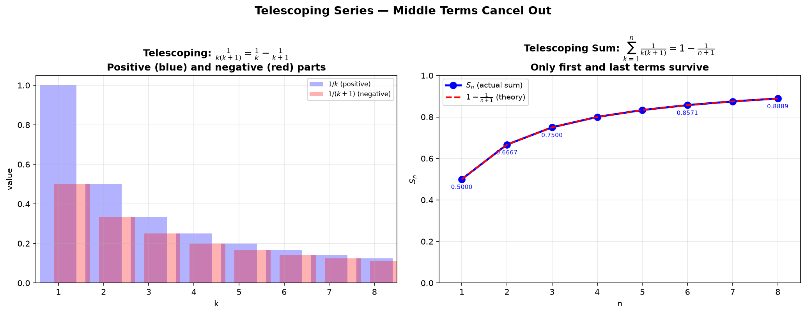
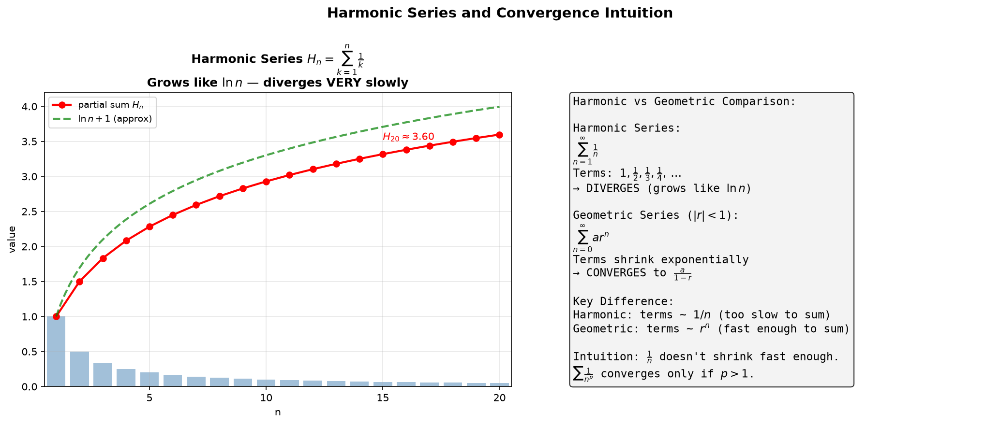
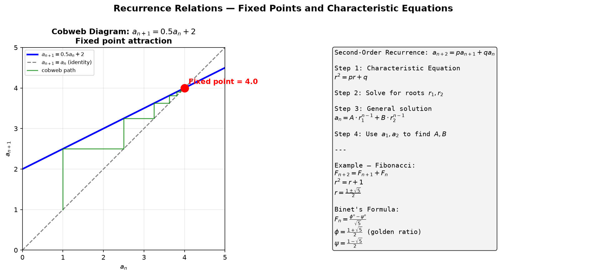
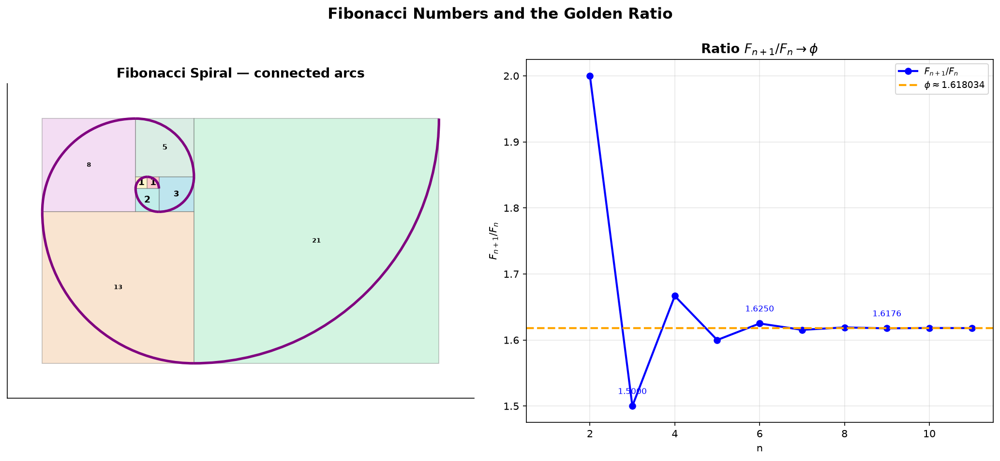
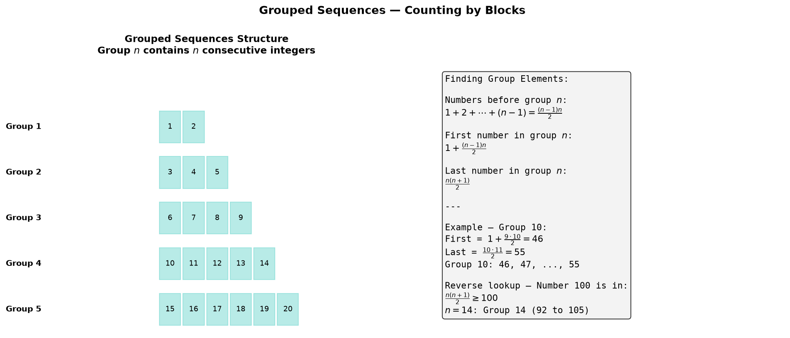
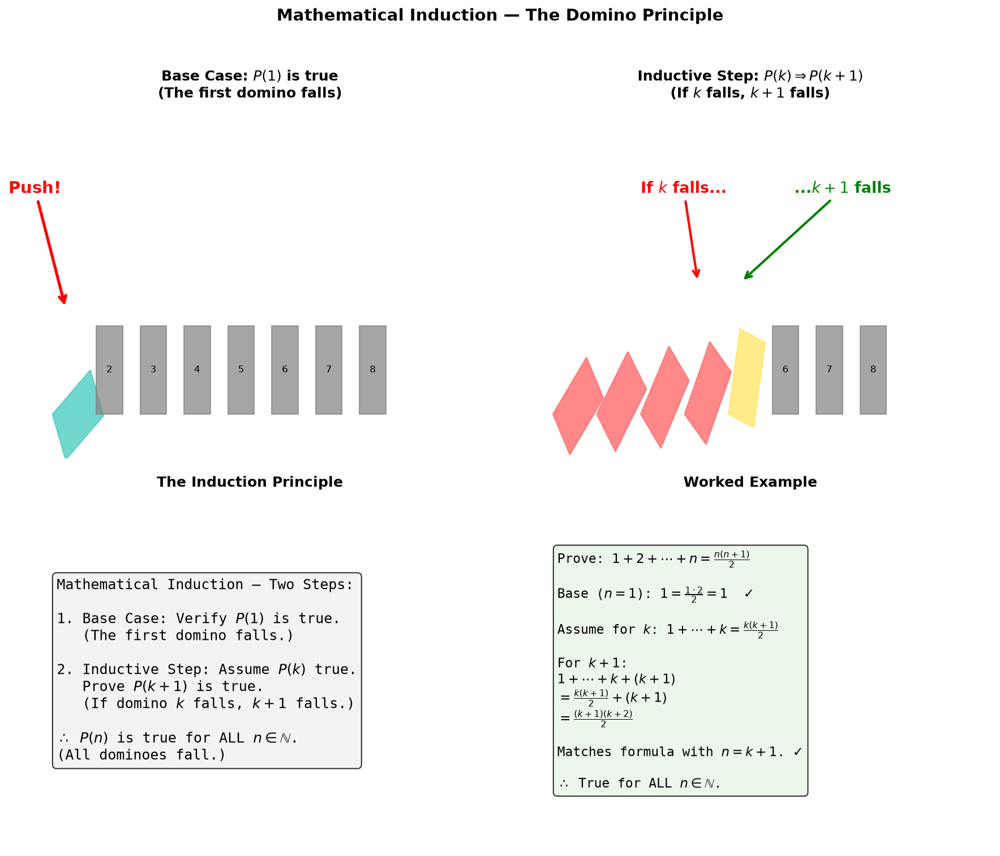
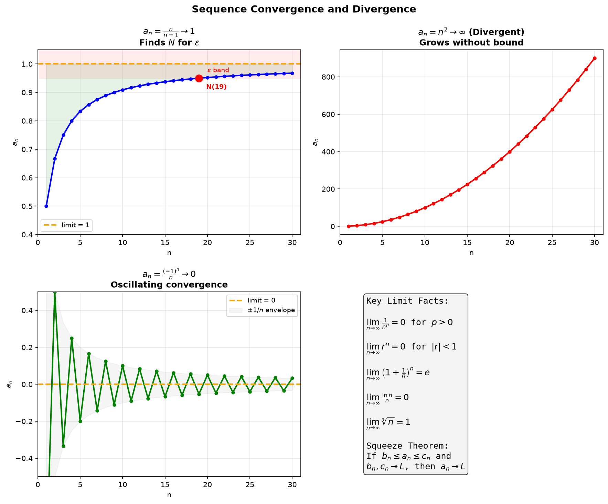

# Session 12B2: Sequences and Series — Advanced Techniques

**Phase 2 — Classical Techniques | 90 min**

*Prerequisites: 12B1 (sequences foundations — arithmetic, geometric, sigma notation)*

> The foundations are laid. Now we reach for the advanced toolkit: telescoping sums that cancel in the middle, recurrences that generate the Fibonacci sequence, the domino logic of induction, and the precise language of limits. These are the tools that make sequences and series truly powerful.

---

## Part A: Telescoping and Special Sequences

> Some sums appear complicated but simplify dramatically when you rewrite the terms in the right way. This is the art of **telescoping**.

---

## Example 1: Telescoping — The Middle Terms Cancel in Pairs

A telescoping sum has the form $\sum [f(k+1) - f(k)]$. When you write out all the terms, everything in the middle cancels, leaving only the endpoints.

**Classic example**: $\displaystyle\sum_{k=1}^{n} \frac{1}{k(k+1)}$.

(1) Decompose using partial fractions: $\frac{1}{k(k+1)} = \frac{1}{k} - \frac{1}{k+1}$.

(2) Write out the terms:
$k=1$: $\frac{1}{1} - \frac{1}{2}$
$k=2$: $\frac{1}{2} - \frac{1}{3}$
$k=3$: $\frac{1}{3} - \frac{1}{4}$
$\vdots$
$k=n$: $\frac{1}{n} - \frac{1}{n+1}$

(3) Add vertically: $-\frac{1}{2}+\frac{1}{2}$ cancels, $-\frac{1}{3}+\frac{1}{3}$ cancels, and so on.
Only $\frac{1}{1}$ and $-\frac{1}{n+1}$ survive.

$$\sum_{k=1}^{n} \frac{1}{k(k+1)} = 1 - \frac{1}{n+1} = \frac{n}{n+1}$$

**Another telescoping pattern**: $\displaystyle\sum_{k=1}^{n} (\sqrt{k+1} - \sqrt{k}) = \sqrt{n+1} - 1$.
Every intermediate square root cancels.

**Key insight**: Look for expressions that can be rewritten as $f(k+1)-f(k)$. The pattern is:
- **Rational functions** → partial fractions → difference of simpler fractions.
- **Radicals** → difference of square roots → rationalization.
- **Trigonometric** → sum-to-product identities → difference of trig functions.



*Graph 12B2a: Left — Each term $\frac{1}{k(k+1)}$ splits into $\frac1k - \frac1{k+1}$ (blue positive, red negative). Right — The partial sums $S_n$ (blue dots) exactly match $1 - \frac{1}{n+1}$ (red dashed). The green fill shows how the sum approaches 1 from below.*

---

## Example 2: Telescoping with Rationalization

$\displaystyle\sum_{k=1}^{n} \frac{1}{\sqrt{k} + \sqrt{k+1}}$.

(1) Rationalize: $\frac{1}{\sqrt{k} + \sqrt{k+1}} \cdot \frac{\sqrt{k+1} - \sqrt{k}}{\sqrt{k+1} - \sqrt{k}} = \sqrt{k+1} - \sqrt{k}$.

(2) This is exactly $f(k+1) - f(k)$ with $f(k) = \sqrt{k}$.

(3) The sum telescopes: $\sum_{k=1}^{n} (\sqrt{k+1} - \sqrt{k}) = \sqrt{n+1} - 1$.

For $n=99$: $\sum_{k=1}^{99} \frac{1}{\sqrt{k} + \sqrt{k+1}} = \sqrt{100} - 1 = 10 - 1 = 9$.

**General pattern**: Whenever you see a sum of fractions with radicals, try rationalizing the denominator. If the result looks like $f(k+1) - f(k)$, you have a telescoping sum.

---

## Example 3: Harmonic Sequence — Reciprocals Form an Arithmetic Sequence

A sequence is **harmonic** if taking the reciprocal of each term produces an arithmetic sequence.

**Example**: $\frac{1}{2}, \frac{1}{5}, \frac{1}{8}, \frac{1}{11}, \dots$
Look at the denominators: $2, 5, 8, 11,\dots$ — arithmetic with $a_1=2$, $d=3$.
Denominator of the $n$th term: $2 + (n-1)\cdot 3 = 3n-1$.
The $n$th term: $\frac{1}{3n-1}$.

**Harmonic mean**: Three numbers $a, b, c$ are in harmonic progression if $\frac{1}{a}, \frac{1}{b}, \frac{1}{c}$ are in arithmetic progression.

**The harmonic series** $\sum_{k=1}^{\infty} \frac{1}{k}$:
This is the sum of reciprocals of all natural numbers. Despite terms shrinking to zero, the harmonic series **diverges** (grows without bound). More precisely:

$$H_n = \sum_{k=1}^{n} \frac{1}{k} \approx \ln n + \gamma$$

where $\gamma \approx 0.5772$ is the **Euler-Mascheroni constant**. The sum grows like $\ln n$ — extremely slowly, but it never stops growing.



*Graph 12B2g: Left — The harmonic series partial sums $H_n$ (red line) grow slowly. The green dashed line shows $\ln n + \gamma$, a close approximation. Right — Comparison table: harmonic terms shrink as $1/n$ (too slow for convergence), while geometric terms shrink as $r^n$ (fast enough for convergence).*

---

> **Up to here**: Telescoping → decompose into $f(k+1)-f(k)$, watch the middle cancel.
> Harmonic → reciprocals form AP. The harmonic series diverges like $\ln n$.

---

## Part B: Recurrence Relations — Each Term Defined by Its Predecessors

> A recurrence defines each term using previous terms. They appear everywhere: population models, computer algorithms, financial calculations.

---

## Example 4: First-Order Recurrences — Three Types

A first-order recurrence relates $a_{n+1}$ to $a_n$.

**Type 1 — Simple multiplicative**: $a_{n+1} = 2a_n$, $a_1 = 1$.
Generate: $1, 2, 4, 8, 16, \dots$ — geometric, $a_n = 2^{n-1}$.
Solution: $a_n = a_1 \cdot r^{n-1}$ where $r$ is the multiplier.

**Type 2 — Additive with a function of $n$**: $a_{n+1} = a_n + 3n$, $a_1 = 2$.
The difference between consecutive terms is $3n$ (not constant — depends on $n$).
The $n$th term is the first term plus the sum of all previous differences:
$$a_n = a_1 + \sum_{k=1}^{n-1} 3k = 2 + 3\cdot\frac{(n-1)n}{2} = 2 + \frac{3n(n-1)}{2}$$
Check: $a_2 = 2+3=5$, $a_3 = 5+6=11$, $a_4 = 11+9=20$.

**Type 3 — First-order linear**: $a_{n+1} = 3a_n - 4$, $a_1 = 5$.

The **fixed point method**:
(1) Find the fixed point $x$ where $x = 3x - 4$ → $x = 2$.
(2) Subtract $x$ from the recurrence: $a_{n+1} - 2 = 3(a_n - 2)$.
(3) Let $b_n = a_n - 2$. Then $b_{n+1} = 3b_n$ — geometric with ratio 3.
(4) $b_1 = a_1 - 2 = 3$. $b_n = 3 \cdot 3^{n-1} = 3^n$.
(5) $a_n = b_n + 2 = 3^n + 2$.

Check: $a_1 = 5$ ✓. $a_2 = 11$ ✓. $a_3 = 29$ ✓.

**General formula**: For $a_{n+1} = pa_n + q$, the fixed point is $x = \frac{q}{1-p}$ (if $p \neq 1$). Then $a_n - x$ is geometric with ratio $p$.

---

## Example 5: Cobweb Diagrams — Visualizing Recurrence Convergence

A **cobweb diagram** shows the iteration of a recurrence graphically:
1. Plot $y = f(x)$ (where $f$ is the recurrence function) and $y = x$.
2. Start at $(a_1, a_1)$ on $y = x$.
3. Move vertically to the curve: $(a_1, f(a_1)) = (a_1, a_2)$.
4. Move horizontally to $y = x$: $(a_2, a_2)$.
5. Repeat: each iteration produces a "cobweb" path converging to or diverging from the fixed point.



*Graph 12B2c: Left — Cobweb diagram for $a_{n+1} = 0.5a_n + 2$ with $a_1 = 1$. The green path spirals toward the fixed point at $(4, 4)$. Each step: from $y=x$ (identity) to the curve (recurrence) and back. Right — Summary of the second-order method with characteristic equation, leading to Binet's formula for Fibonacci.*

---

## Example 6: Second-Order Linear Recurrence — Fibonacci and Beyond

$a_{n+2} = 5a_{n+1} - 6a_n$, $a_1 = 1$, $a_2 = 2$.

(1) Form the **characteristic equation**: $r^2 = 5r - 6$ → $r^2 - 5r + 6 = 0$.
(2) Solve: $(r-2)(r-3) = 0$ → $r = 2, 3$.
(3) The general solution has the form $a_n = A \cdot 2^n + B \cdot 3^n$.
(4) Plug in $n=1,2$ to find $A$ and $B$:
$2A + 3B = 1$, $4A + 9B = 2$.
Solving: $A = \frac{1}{2}$, $B = 0$.
(5) $a_n = \frac{1}{2} \cdot 2^n = 2^{n-1}$.

**The method works for any second-order linear recurrence**:
$a_{n+2} = pa_{n+1} + qa_n$ → $r^2 = pr + q$ → find roots $r_1, r_2$ → $a_n = A r_1^{n-1} + B r_2^{n-1}$.

**Special case — repeated root**: If $r_1 = r_2 = r$, then $a_n = (A + Bn)r^{n-1}$.

---

## Example 7: The Fibonacci Sequence and Binet's Formula

The Fibonacci sequence is the most famous recurrence in mathematics:

$$F_{n+2} = F_{n+1} + F_n, \quad F_1 = F_2 = 1$$

Characteristic equation: $r^2 = r + 1$ → $r = \frac{1 \pm \sqrt{5}}{2}$.

Let $\phi = \frac{1+\sqrt{5}}{2} \approx 1.618$ (the **golden ratio**) and $\psi = \frac{1-\sqrt{5}}{2} \approx -0.618$.

General solution: $F_n = A\phi^{n-1} + B\psi^{n-1}$.
Using $F_1 = 1$, $F_2 = 1$:
$A + B = 1$, $A\phi + B\psi = 1$.
Solving gives $A = \frac{1}{\sqrt{5}}\phi$, $B = -\frac{1}{\sqrt{5}}\psi$.

**Binet's formula**:
$$F_n = \frac{1}{\sqrt{5}}\left[\phi^n - \psi^n\right]$$

This produces **integers** from an expression full of $\sqrt{5}$ — a mathematical magic trick.

**The golden ratio appears everywhere**:
- $\displaystyle\lim_{n\to\infty} \frac{F_{n+1}}{F_n} = \phi$.
- $\phi$ is the most irrational number — the hardest to approximate with fractions.
- The ratio of consecutive Fibonacci numbers gives the best rational approximations to $\phi$.



*Graph 12B2b: Left — The Fibonacci spiral: squares with side lengths equal to Fibonacci numbers (1, 1, 2, 3, 5, 8, 13, 21...) arranged in a tiling pattern. The purple arcs connect opposite corners, forming a smooth spiral. Right — The ratio $F_{n+1}/F_n$ converges rapidly to the golden ratio $\phi \approx 1.618034$ (orange dashed line).*

---

> **Up to here**: Recurrences → multiplicative (geometric), additive (sum differences), linear (fixed point method).
> Second-order → characteristic equation $r^2 = pr + q$. Fibonacci → Binet's formula, golden ratio $\phi$.

---

## Part C: Method of Differences and Grouped Sequences

> When a sequence isn't arithmetic or geometric, look at its **differences**. If the differences form a known sequence, you can reconstruct the original.

---

## Example 8: Method of Differences — When the Differences Form a Known Sequence

Sequence: $1, 3, 7, 13, 21, \dots$

(1) Compute differences: $3-1=2$, $7-3=4$, $13-7=6$, $21-13=8$.
The differences are $2, 4, 6, 8, \dots$ — an arithmetic sequence: $b_k = 2k$.

(2) The $n$th term is the first term plus the sum of the first $n-1$ differences:
$$a_n = a_1 + \sum_{k=1}^{n-1} 2k = 1 + 2\cdot\frac{(n-1)n}{2} = 1 + n(n-1) = n^2 - n + 1$$

Check: $n=3 \to 9-3+1 = 7$ ✓. $n=5 \to 25-5+1 = 21$ ✓.

**The general method**: If the differences $b_k = a_{k+1} - a_k$ form a known sequence, then:
$$a_n = a_1 + \sum_{k=1}^{n-1} b_k$$

**Second differences**: If the first differences aren't constant but the second differences are, the sequence is quadratic ($a_n = An^2 + Bn + C$).

**Example**: $2, 6, 12, 20, 30, \dots$
First differences: $4, 6, 8, 10$ (not constant — arithmetic with $d=2$).
Second differences: $2, 2, 2$ (constant!).
This means $a_n = An^2 + Bn + C$. Using $n=1,2,3$:
$A+B+C=2$, $4A+2B+C=6$, $9A+3B+C=12$.
Solving: $A=1$, $B=1$, $C=0$. So $a_n = n^2 + n = n(n+1)$.

---

## Example 9: Grouped Sequences — Counting by Blocks

$(1), (2,3), (4,5,6), (7,8,9,10), \dots$

Rule: Group $n$ contains $n$ consecutive integers.

(1) How many numbers appear before group $n$?
$1 + 2 + \cdots + (n-1) = \frac{(n-1)n}{2}$ numbers.

(2) The first number in group $n$: $1 + \frac{(n-1)n}{2}$.
The last number in group $n$: $\frac{n(n+1)}{2}$.

Group 10: first = $1 + \frac{9\cdot 10}{2} = 46$, last = $\frac{10\cdot 11}{2} = 55$.
Group 10 contains: $46, 47, \dots, 55$ (10 numbers).

**Reverse lookup**: Which group contains the number 100?
Find $n$ such that $\frac{n(n+1)}{2} \geq 100$.
$13 \cdot 14 = 182 < 200$ (too small for $n=13$ since we need $n(n+1) \geq 200$).
$14 \cdot 15 = 210 \geq 200$. So $n=14$.
Group 14: first = $1 + \frac{13\cdot 14}{2} = 92$, last = $\frac{14\cdot 15}{2} = 105$.



*Graph 12B2f: Left — The first 5 groups shown as colored blocks. Group $n$ contains exactly $n$ numbers. Right — The formulas for finding the first and last number of any group, with worked examples.*

---

## Example 10: The Floor Function in Sums — Counting by Groups

$\displaystyle\sum_{k=1}^{10} \lfloor\sqrt{k}\rfloor$.

Group the values of $\lfloor\sqrt{k}\rfloor$:
$k=1,2,3$: $\lfloor\sqrt{k}\rfloor = 1$ (3 numbers).
$k=4,5,6,7,8$: $\lfloor\sqrt{k}\rfloor = 2$ (5 numbers).
$k=9,10$: $\lfloor\sqrt{k}\rfloor = 3$ (2 numbers).

Sum = $3 \times 1 + 5 \times 2 + 2 \times 3 = 3 + 10 + 6 = 19$.

**Counting digits with floor**: $\displaystyle\sum_{k=1}^{100} \lfloor\log_{10} k\rfloor$.
1-digit numbers ($k=1$ to $9$): $\lfloor\log_{10}k\rfloor = 0$ → 9 terms → $0$.
2-digit numbers ($k=10$ to $99$): $\lfloor\log_{10}k\rfloor = 1$ → 90 terms → $90$.
3-digit numbers ($k=100$): $\lfloor\log_{10}k\rfloor = 2$ → 1 term → $2$.
Sum = $0 + 90 + 2 = 92$.

---

> **Up to here**: Method of differences → sum the differences to recover $a_n$. Second differences → quadratic.
> Grouped sequences → group $n$ has $n$ elements. Floor function sums → group by integer part.

---

## Part D: Mathematical Induction — Proving for All $n$ at Once

> Induction works like a row of dominoes: knock down the first, and each falling domino knocks down the next. If both conditions hold, all dominoes fall.

---

## Example 11: The Induction Principle — Two Steps

**Two-step structure**:
(1) **Base case**: Show the statement holds for $n=1$.
(2) **Inductive step**: Assume it holds for $n=k$. Prove it holds for $n=k+1$.

If both are true, the statement holds for ALL natural numbers $n$.



*Graph 12B2d: Top-left — The base case: push the first domino ($n=1$). Top-right — The inductive step: if domino $k$ falls, then $k+1$ falls. Bottom-left — The logic flow diagram. Bottom-right — A worked example proving the sum of the first $n$ integers.*

---

## Example 12: Proving the Sum Formula by Induction

Prove $1+2+\cdots+n = \frac{n(n+1)}{2}$ for all $n \geq 1$.

**Base case** ($n=1$): Left = $1$. Right = $\frac{1\cdot 2}{2} = 1$. ✓

**Inductive step**: Assume $1+2+\cdots+k = \frac{k(k+1)}{2}$.
For $n=k+1$:
$1+2+\cdots+k+(k+1) = \frac{k(k+1)}{2} + (k+1)$
$= \frac{k(k+1) + 2(k+1)}{2} = \frac{(k+1)(k+2)}{2}$.
This matches the formula with $n=k+1$. ✓

Therefore the formula holds for all natural numbers $n$. ✓

---

## Example 13: Proving Divisibility by Induction

Prove $n^3 - n$ is always a multiple of $6$ for all $n \geq 1$.

**Base case** ($n=1$): $1-1=0 = 6 \times 0$. ✓

**Inductive step**: Assume $k^3 - k = 6m$ for some integer $m$.
For $n=k+1$:
$(k+1)^3 - (k+1) = k^3 + 3k^2 + 3k + 1 - k - 1 = (k^3-k) + 3k(k+1)$
$= 6m + 3k(k+1)$.

Now, $k(k+1)$ is the product of two consecutive integers — one of them is always even. So $k(k+1) = 2p$ for some integer $p$.
Thus $3k(k+1) = 3(2p) = 6p$, which is a multiple of $6$.

So $(k+1)^3 - (k+1) = 6m + 6p = 6(m+p)$. ✓

Therefore $n^3 - n$ is always a multiple of $6$.

---

## Example 14: Proving the Fibonacci Sum Identity

Prove $F_1 + F_2 + \cdots + F_n = F_{n+2} - 1$ (where $F_1 = F_2 = 1$).

**Base case** ($n=1$): $F_1 = 1$. Right: $F_3 - 1 = 2 - 1 = 1$. ✓

**Inductive step**: Assume $F_1 + \cdots + F_k = F_{k+2} - 1$.
For $n=k+1$:
$(F_1 + \cdots + F_k) + F_{k+1} = (F_{k+2} - 1) + F_{k+1}$
$= (F_{k+2} + F_{k+1}) - 1$
$= F_{k+3} - 1$.

This matches the formula with $n=k+1$. ✓

---

> **Up to here**: Induction = base case + inductive step ($k \to k+1$). Like dominoes.
> Used to prove sum formulas, divisibility, and Fibonacci identities.

---

## Part E: Limits of Sequences — What Happens as $n \to \infty$

> A sequence converges if its terms approach a fixed number $L$ as $n$ grows without bound. This concept is the foundation of calculus (limits, series, continuity).

---

## Example 15: Convergence and Divergence — Three Key Examples

**Example 1 — Convergent**: $a_n = \frac{n}{n+1}$.
Compute values: $n=1 \to 0.5$, $n=10 \to 0.909$, $n=100 \to 0.990$, $n=1000 \to 0.999$.
As $n$ grows, $a_n$ approaches 1. $\displaystyle\lim_{n\to\infty} \frac{n}{n+1} = 1$.

**Example 2 — Divergent**: $a_n = n^2$.
The terms grow without bound: $1, 4, 9, 16, 25, \dots$.
$\displaystyle\lim_{n\to\infty} n^2 = \infty$ (diverges).

**Example 3 — Oscillating convergent**: $a_n = \frac{(-1)^n}{n}$.
The terms alternate sign but shrink: $-\frac11, \frac12, -\frac13, \frac14, \dots$
The amplitude $1/n$ shrinks to zero. $\displaystyle\lim_{n\to\infty} \frac{(-1)^n}{n} = 0$.



*Graph 12B2e: Four panels showing different limit behaviors. Top-left — $a_n = n/(n+1)$ converges to 1, with an $\varepsilon$-band (red) showing the tolerance region. Top-right — $a_n = n^2$ diverges to infinity. Bottom-left — $a_n = (-1)^n/n$ oscillates but converges to 0 within a $\pm 1/n$ envelope. Bottom-right — Key limit facts.*

---

## Example 16: Computing Limits — The $\frac{\infty}{\infty}$ Trick

The most common limit technique: **divide numerator and denominator by the highest power of $n$**.

$a_n = \frac{3n^2 + 2n}{n^2 + 1}$. Divide numerator and denominator by $n^2$:
$a_n = \frac{3 + 2/n}{1 + 1/n^2}$. As $n \to \infty$, $2/n \to 0$ and $1/n^2 \to 0$.
So $\lim a_n = \frac{3+0}{1+0} = 3$.

**Another example**: $a_n = \frac{5n^3 - 2n + 1}{3n^3 + n^2 + 4}$.
Divide by $n^3$: $a_n = \frac{5 - 2/n^2 + 1/n^3}{3 + 1/n + 4/n^3} \to \frac{5}{3}$.

**Another technique — rationalizing**:
$\lim_{n\to\infty} (\sqrt{n^2 + 3n} - n)$
$= \lim_{n\to\infty} \frac{(n^2+3n) - n^2}{\sqrt{n^2+3n} + n} = \lim_{n\to\infty} \frac{3n}{\sqrt{n^2+3n} + n}$
$= \lim_{n\to\infty} \frac{3}{\sqrt{1+3/n} + 1} = \frac{3}{1+1} = \frac32$.

---

## Example 17: Key Limit Facts to Memorize

$$\begin{aligned}
&\lim_{n\to\infty} \frac{1}{n^p} = 0 \quad (p > 0) \\
&\lim_{n\to\infty} r^n = 0 \quad (|r| < 1) \\
&\lim_{n\to\infty} \left(1 + \frac{1}{n}\right)^n = e \approx 2.71828 \\
&\lim_{n\to\infty} \frac{\ln n}{n} = 0 \\
&\lim_{n\to\infty} \sqrt[n]{n} = 1 \\
&\lim_{n\to\infty} \frac{F_{n+1}}{F_n} = \phi = \frac{1+\sqrt{5}}{2}
\end{aligned}$$

**The Squeeze Theorem**: If $b_n \leq a_n \leq c_n$ and $\lim b_n = \lim c_n = L$, then $\lim a_n = L$.
This is especially useful for oscillating sequences.

**Example**: $a_n = \frac{\sin n}{n}$. Since $-1 \leq \sin n \leq 1$, we have $-\frac{1}{n} \leq a_n \leq \frac{1}{n}$.
Both $-\frac{1}{n} \to 0$ and $\frac{1}{n} \to 0$, so by the Squeeze Theorem, $\lim_{n\to\infty} \frac{\sin n}{n} = 0$.

---

> **Up to here**: Limits → divide by highest power of $n$. Squeeze theorem bounds the sequence.
> Key facts: $\frac{1}{n^p} \to 0$, $r^n \to 0$ ($|r|<1$), $(1+1/n)^n \to e$, $\sqrt[n]{n} \to 1$.

---

## Common Mistakes

### Mistake 1: Applying the infinite geometric sum formula when $|r| \geq 1$

**Wrong path**: "$1 + 2 + 4 + 8 + \cdots = \frac{1}{1-2} = -1$."

**Why wrong**: The formula requires $|r| < 1$. When $|r| \geq 1$, the sum diverges.

**Right path**: Check $|r|$ first. If $|r| \geq 1$, the infinite sum does not exist.

### Mistake 2: Forgetting the base case in induction

**Wrong path**: Proving only the inductive step ($k \to k+1$) without checking $n=1$.

**Why wrong**: The chain of implications has no starting point. Without the base case, the proof is incomplete.

**Right path**: Always verify the base case ($n=1$ or the smallest relevant $n$) before the inductive step.

### Mistake 3: Confusing $r^n \to 0$ with $n \to \infty$ for $|r| > 1$

**Wrong path**: "Since $r^n$ shrinks when $|r|<1$, it also shrinks when $|r|>1$."

**Why wrong**: When $|r| > 1$, $|r|^n \to \infty$ — it grows without bound.

**Right path**: $|r| < 1$ → geometric decay to zero. $|r| > 1$ → geometric growth to infinity.

### Mistake 4: Forgetting that induction requires BOTH steps

**Wrong path**: Proving the base case and the inductive step separately, but the inductive step relies on a false assumption.

**Why wrong**: Induction is a two-step process. Skipping either step invalidates the proof.

**Right path**: Verify the base case, THEN assume $P(k)$ and prove $P(k+1)$. Both steps are equally essential.

---

## What We Just Did

```
(1) Telescoping — decompose into f(k+1)−f(k), watch the middle cancel.
    Harmonic — reciprocals form AP. The harmonic series diverges like ln n.

(2) Recurrences — multiplicative → geometric. Additive + f(n) → sum differences.
    Linear pa_n+q → fixed point method. Second-order → characteristic equation.
    Fibonacci → Binet's formula, golden ratio φ = (1+√5)/2.

(3) Method of differences — sum differences to find a_n. Second differences → quadratic.
    Grouped sequences — group n has n numbers. Floor function sums → group by integer part.

(4) Induction — base case + (k → k+1). Like dominoes. Used for sums, divisibility, identities.

(5) Limits — divide by highest power of n. Squeeze theorem for oscillating sequences.
    Key facts: 1/n^p → 0, r^n → 0 (|r|<1), (1+1/n)^n → e, √[n]{n} → 1.
```

---

## Practice 1

Evaluate the telescoping sum: $\displaystyle\sum_{k=1}^{20} \frac{1}{k(k+1)}$.

→ Reference: **Example 1**

> Solutions: [Solutions](solutions/12B2-solutions.md#practice-1)

---

## Practice 2

Solve the recurrence: $a_{n+1} = 2a_n + 3$, $a_1 = 1$. Find a formula for $a_n$.

→ Reference: **Example 4**

> Solutions: [Solutions](solutions/12B2-solutions.md#practice-2)

---

## Practice 3

Solve the recurrence: $a_{n+2} = 4a_{n+1} - 4a_n$, $a_1 = 2$, $a_2 = 4$. (Repeated root!)

→ Reference: **Example 6**

> Solutions: [Solutions](solutions/12B2-solutions.md#practice-3)

---

## Practice 4

Find the 10th term of the sequence whose first differences are $3, 5, 7, 9, \dots$ and whose first term is $2$.

→ Reference: **Example 8**

> Solutions: [Solutions](solutions/12B2-solutions.md#practice-4)

---

## Practice 5

Find the first and last numbers in the 20th group of the grouped sequence $(1), (2,3), (4,5,6), \dots$

→ Reference: **Example 9**

> Solutions: [Solutions](solutions/12B2-solutions.md#practice-5)

---

## Practice 6

Prove by induction: $\displaystyle\sum_{k=1}^{n} k^3 = \left(\frac{n(n+1)}{2}\right)^2$.

→ Reference: **Example 11, 12**

> Solutions: [Solutions](solutions/12B2-solutions.md#practice-6)

---

## Practice 7

Find $\displaystyle\lim_{n\to\infty} \frac{5n^3 - 2n + 1}{3n^3 + n^2 + 4}$.

→ Reference: **Example 16**

> Solutions: [Solutions](solutions/12B2-solutions.md#practice-7)

---

## Practice 8: Telescoping with Radicals

Evaluate $\displaystyle\sum_{k=1}^{99} \frac{1}{\sqrt{k} + \sqrt{k+1}}$.

→ Reference: **Example 2**

> Solutions: [Solutions](solutions/12B2-solutions.md#practice-8)

---

## Practice 9: Fibonacci Limit (🔗 12B1)

The Fibonacci sequence satisfies $F_{n+2} = F_{n+1} + F_n$ with $F_1 = F_2 = 1$.
(a) Prove by induction that $F_1 + F_2 + \cdots + F_n = F_{n+2} - 1$.
(b) Find $\displaystyle\lim_{n\to\infty} \frac{F_{n+1}}{F_n}$ (the golden ratio).

→ Reference: **Example 7, 14, 17**

> Solutions: [Solutions](solutions/12B2-solutions.md#practice-9)

---

## Practice 10: Real Battle — Quadratics via Second Differences

A sequence has terms $0, 3, 8, 15, 24, \dots$. Find a formula for $a_n$ using the method of second differences.

→ Reference: **Example 8**

> Solutions: [Solutions](solutions/12B2-solutions.md#practice-10)

---

## Practice 11: Squeeze Theorem

Find $\displaystyle\lim_{n\to\infty} \frac{\cos n}{n}$ using the Squeeze Theorem.

→ Reference: **Example 17**

> Solutions: [Solutions](solutions/12B2-solutions.md#practice-11)

---

## Practice 12: Real Battle — Harmonic Series Intuition

Show that the harmonic series $\sum_{k=1}^{\infty} \frac{1}{k}$ diverges by grouping terms:
$\frac{1}{1} + \frac{1}{2} + \left(\frac{1}{3} + \frac{1}{4}\right) + \left(\frac{1}{5} + \cdots + \frac{1}{8}\right) + \cdots$
Compare each group to $\frac12$.

→ Reference: **Example 3**

> Solutions: [Solutions](solutions/12B2-solutions.md#practice-12)

---

## Basic Drills

> Pure calculation. Master the techniques through repetition.

**D1.** Compute $\sum_{k=1}^{30} \frac{1}{k(k+1)}$.

**D2.** Find the 8th term of the harmonic sequence: $\frac{1}{3}, \frac{1}{7}, \frac{1}{11}, \frac{1}{15}, \dots$

**D3.** Solve the recurrence $a_{n+1} = 4a_n$, $a_1 = 3$. Find $a_{10}$.

**D4.** Solve the recurrence $a_{n+1} = 2a_n + 5$, $a_1 = 1$. Find $a_5$.

**D5.** Find $a_n$ for the sequence with first differences $4, 7, 10, 13, \dots$ and $a_1 = 3$.

**D6.** Prove by induction that $1 + 3 + 5 + \cdots + (2n-1) = n^2$.

**D7.** Find $\lim_{n\to\infty} \frac{2n^2 + 3n}{n^2 + 5}$.

**D8.** Find $\lim_{n\to\infty} \left(\sqrt{n^2 + 4n} - n\right)$.

**D9.** Find the first number in group 12 of $(1), (2,3), (4,5,6), \dots$

**D10.** Compute $\sum_{k=1}^{20} \lfloor\sqrt{k}\rfloor$.

**D11.** (🔗 12B1) Which is larger: $1.01^{100}$ or $100$? (Hint: geometric vs arithmetic growth.)

**D12.** Find $\lim_{n\to\infty} \frac{3^n}{n!}$. (Hint: compare terms.)

> Solutions: [Solutions](solutions/12B2-solutions.md#basic-drill)

---

## Advanced Drills

> Multi-step. Chain concepts across the full toolkit.

**A1.** Solve the recurrence $a_{n+2} = 5a_{n+1} - 6a_n$, $a_1 = 1$, $a_2 = 2$. Find $a_{10}$.

**A2.** Compute $\sum_{k=1}^{n} \frac{1}{(2k-1)(2k+1)}$ using telescoping. Give a closed form.

**A3.** (🔗 12B1) A geometric series has first term 12 and sum to infinity 18. Find the common ratio and the sum of the first 6 terms.

**A4.** Find $\lim_{n\to\infty} \left(\frac{n}{n+1}\right)^n$. (Hint: relate to $(1 + 1/n)^n \to e$.)

**A5.** Prove by induction: $1\cdot2 + 2\cdot3 + 3\cdot4 + \cdots + n(n+1) = \frac{n(n+1)(n+2)}{3}$.

**A6.** For the grouped sequence $(1,2), (3,4,5), (6,7,8,9), \dots$, find the first and last numbers in the 15th group.

**A7.** A sequence has first term 1 and each term after the first is the sum of all previous terms. Find a formula for $a_n$ and prove it by induction.

**A8.** (🔗 9B) The Koch snowflake: start with an equilateral triangle of side 1. At each step, replace the middle third of each side with an equilateral triangle. Find the perimeter after $n$ steps as a geometric sequence. Does the perimeter converge?

**A9.** Find $\lim_{n\to\infty} \frac{n!}{n^n}$. (Hint: use the Squeeze Theorem with $n! \leq n^n$.)

**A10.** (🔗 9A1) Prove by induction that $\frac{d}{dx} x^n = n x^{n-1}$ for all positive integers $n$.

**A11.** The sequence $a_n$ satisfies $a_{n+1} = \frac{1}{2}\left(a_n + \frac{2}{a_n}\right)$ with $a_1 = 1$. This is Newton's method for $\sqrt{2}$. Compute $a_2, a_3, a_4$. What is $\lim_{n\to\infty} a_n$?

**A12.** (🔗 12B1) Show that $\sum_{k=1}^{n} (2k-1)^3 = n^2(2n^2 - 1)$.

> Solutions: [Solutions](solutions/12B2-solutions.md#advanced-drill)

---

## Today's Procedure

```
Step 1: Telescoping — rewrite terms as f(k+1)−f(k), cancel the middle.
         Harmonic — reciprocals form AP. ∑1/k diverges like ln n.

Step 2: Recurrence — first-order linear: find fixed point, shift to geometric.
         Second-order: characteristic equation r² = pr + q → find roots.
         Fibonacci → Binet's formula, golden ratio φ.

Step 3: Method of differences — a_n = a₁ + Σ(differences). Second diff → quadratic.
         Grouped sequences — group n has n numbers. Floor sums → group by integer.

Step 4: Induction — base case (n=1) + inductive step (k → k+1).
         Limits — divide by highest power. Squeeze theorem.
```

---

## How to Read These Symbols

| Symbol | Reads as | Meaning |
|:---:|:---:|------|
| telescoping | "telescoping" | series where intermediate terms cancel |
| $a_{n+1} = pa_n + q$ | "recurrence" | each term defined by previous |
| characteristic equation | "characteristic equation" | $r^2 = pr + q$ |
| $F_n$ | "F sub n" / "F n" | Fibonacci numbers ($F_1=F_2=1$) |
| $\phi$ | "phi" | golden ratio $\frac{1+\sqrt{5}}{2}$ |
| $\psi$ | "psi" | conjugate $\frac{1-\sqrt{5}}{2}$ |
| $P(k) \Rightarrow P(k+1)$ | "P(k) implies P(k+1)" | inductive step |
| $\lim_{n\to\infty} a_n = L$ | "limit as n → ∞ of a_n = L" | sequence converges to L |
| $\varepsilon$ | "epsilon" | small tolerance in limit definition |

---

## Terminology

| What we called it | Mathematical term | Notation / Formula |
|:-----------------:|:-----------------:|:------------------:|
| telescoping | telescoping series | $\sum [f(k+1)-f(k)]$ |
| harmonic sequence | harmonic progression | reciprocals form an AP |
| harmonic series | harmonic series | $\sum_{k=1}^{\infty} 1/k$ (diverges) |
| recurrence | recurrence relation | $a_{n+1} = f(a_n)$ |
| characteristic equation | characteristic equation | $r^2 = pr + q$ |
| mathematical induction | mathematical induction | base case + inductive step |
| limit of a sequence | limit | $\lim_{n\to\infty} a_n$ |
| Fibonacci sequence | Fibonacci sequence | $F_{n+2} = F_{n+1} + F_n$ |
| Binet's formula | Binet's formula | $F_n = \frac{\phi^n - \psi^n}{\sqrt{5}}$ |
| golden ratio | golden ratio | $\phi = \frac{1+\sqrt{5}}{2} \approx 1.618$ |
| Squeeze Theorem | Squeeze Theorem | $b_n \leq a_n \leq c_n \to L$ |
| Euler-Mascheroni constant | Euler-Mascheroni constant | $\gamma \approx 0.5772$ |
