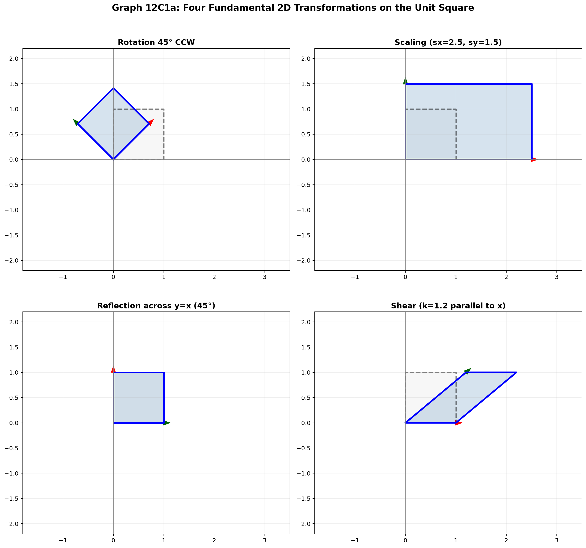
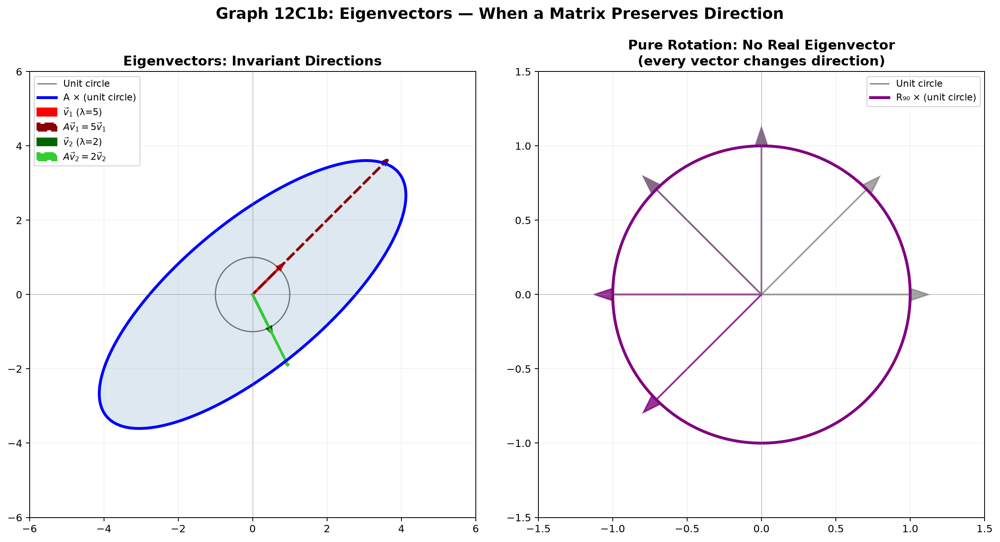
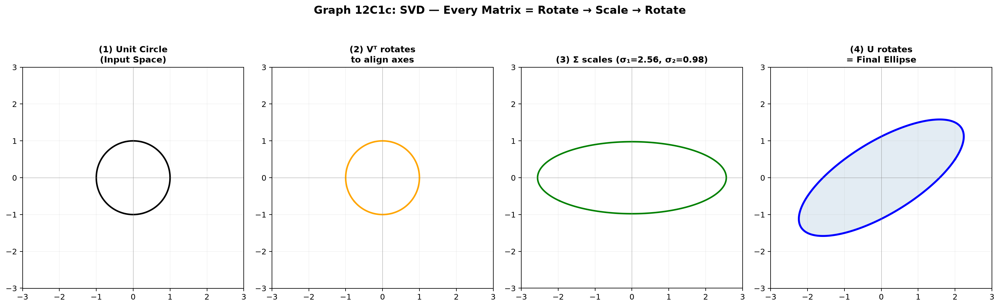

# Session 12C1: Geometric Transformations — Moving and Shaping Space

**Phase 2 — Geometric Techniques | 80 min**

*Prerequisites: 12A1 (complex numbers), 12A2 (matrices & vectors), 11A (trig foundations)*

---

## Part A: The Big Picture — Every Transformation Is a Matrix

Every geometric transformation in 2D and 3D — rotation, scaling, reflection, shearing, translation — can be written as a matrix acting on a vector. Understanding transformations means understanding what a matrix *does* to space.

---

## Example 1: The Four Fundamental 2D Transformations

**Rotation by $\theta$ counterclockwise:**
$R_\theta = \begin{pmatrix} \cos\theta & -\sin\theta \\ \sin\theta & \cos\theta \end{pmatrix}$.
Check: $R_{90^\circ}\begin{pmatrix}1\\0\end{pmatrix} = \begin{pmatrix}0\\1\end{pmatrix}$. The $x$-axis rotates to the $y$-axis.

**Scaling by factors $s_x, s_y$:**
$S = \begin{pmatrix} s_x & 0 \\ 0 & s_y \end{pmatrix}$.
$S = \begin{pmatrix}3&0\\0&2\end{pmatrix}$ stretches horizontally by 3 and vertically by 2.

**Reflection across a line making angle $\alpha$ with the $x$-axis:**
$F_\alpha = \begin{pmatrix} \cos 2\alpha & \sin 2\alpha \\ \sin 2\alpha & -\cos 2\alpha \end{pmatrix}$.
Reflection across $x$-axis ($\alpha=0$): $F_0 = \begin{pmatrix}1&0\\0&-1\end{pmatrix}$. Flips the $y$ sign.

**Shear parallel to the $x$-axis by factor $k$:**
$H_x = \begin{pmatrix} 1 & k \\ 0 & 1 \end{pmatrix}$.
$H_x\begin{pmatrix}x\\y\end{pmatrix} = \begin{pmatrix}x+ky\\y\end{pmatrix}$. The $x$-coordinate shifts by $k$ times the $y$-coordinate. Squares become parallelograms, but area stays the same — $\det(H_x) = 1$.



*Graph 12C1a: Rotation, scaling, reflection, and shear applied to the unit square. Notice how each matrix changes the square's shape while the columns of the matrix encode the images of basis vectors.*

---

## Example 2: Composing Transformations — Order Matters

Apply a rotation by $90^\circ$, then a reflection across the $x$-axis:
$F_0 \cdot R_{90} = \begin{pmatrix}1&0\\0&-1\end{pmatrix}\begin{pmatrix}0&-1\\1&0\end{pmatrix} = \begin{pmatrix}0&-1\\-1&0\end{pmatrix}$.
This is a reflection across the line $y = -x$.

Reverse the order — reflect first, then rotate:
$R_{90} \cdot F_0 = \begin{pmatrix}0&-1\\1&0\end{pmatrix}\begin{pmatrix}1&0\\0&-1\end{pmatrix} = \begin{pmatrix}0&1\\1&0\end{pmatrix}$.
This is a reflection across the line $y = x$. Different result!

**Rule**: Transformations are applied right-to-left. $BA\vec{x}$ means apply $A$ first, then $B$.

---

## Example 3: Homogeneous Coordinates — Translation as a Matrix

Rotation, scaling, reflection, and shear can all be written as $2 \times 2$ matrices. But translation — shifting by $(t_x, t_y)$ — is not linear: $(x,y) \mapsto (x+t_x, y+t_y)$ cannot be expressed as a $2 \times 2$ matrix multiplication. The trick: **add a third coordinate.**

In **homogeneous coordinates**, a 2D point $(x,y)$ becomes $(x, y, 1)$. A 3D point becomes $(x, y, z, 1)$.

Translation in 2D becomes a $3 \times 3$ matrix:
$T = \begin{pmatrix} 1 & 0 & t_x \\ 0 & 1 & t_y \\ 0 & 0 & 1 \end{pmatrix}$. Then $T\begin{pmatrix}x\\y\\1\end{pmatrix} = \begin{pmatrix}x+t_x\\y+t_y\\1\end{pmatrix}$.

Rotation in homogeneous coordinates:
$R = \begin{pmatrix} \cos\theta & -\sin\theta & 0 \\ \sin\theta & \cos\theta & 0 \\ 0 & 0 & 1 \end{pmatrix}$.

**The power of this**: You can now chain any sequence of rotations, scalings, and translations into a single $3 \times 3$ matrix.

Example: Rotate by $45^\circ$ around the point $(2, 3)$:
(1) Translate $(-2, -3)$ to move the point to the origin.
(2) Rotate by $45^\circ$.
(3) Translate back by $(2, 3)$.
The combined matrix: $T_{(2,3)} \cdot R_{45} \cdot T_{(-2,-3)}$.

---

## Example 4: 3D Rotations — Three Axes, Three Matrices

In 3D, rotation happens around an axis:

**Around $x$-axis by $\theta$**: $R_x = \begin{pmatrix} 1 & 0 & 0 \\ 0 & \cos\theta & -\sin\theta \\ 0 & \sin\theta & \cos\theta \end{pmatrix}$.
The $x$-coordinate stays fixed; $y$ and $z$ rotate in their plane.

**Around $y$-axis by $\theta$**: $R_y = \begin{pmatrix} \cos\theta & 0 & \sin\theta \\ 0 & 1 & 0 \\ -\sin\theta & 0 & \cos\theta \end{pmatrix}$.

**Around $z$-axis by $\theta$**: $R_z = \begin{pmatrix} \cos\theta & -\sin\theta & 0 \\ \sin\theta & \cos\theta & 0 \\ 0 & 0 & 1 \end{pmatrix}$.

Any 3D rotation can be built by composing these three (Euler angles). In homogeneous coordinates, 3D transformations use $4 \times 4$ matrices.

---

## Example 5: Eigenvectors — The Directions That Stay Fixed

For some matrices, there exist special directions where applying the matrix is the same as multiplying by a scalar.

**Definition**: If $A\vec{v} = \lambda\vec{v}$, then $\vec{v}$ is an **eigenvector** and $\lambda$ is its **eigenvalue**.

**Geometric meaning**: Along an eigenvector direction, the transformation simply stretches (or flips) by factor $\lambda$, without changing direction.

**Example**: $A = \begin{pmatrix} 3 & 0 \\ 0 & 2 \end{pmatrix}$.
Eigenvectors: $\vec{e}_1 = (1,0)$ with $\lambda=3$ (stretch by 3 along $x$).
$\vec{e}_2 = (0,1)$ with $\lambda=2$ (stretch by 2 along $y$).
Pure scaling — eigenvectors are the coordinate axes.

**Example**: $A = \begin{pmatrix} 0 & -1 \\ 1 & 0 \end{pmatrix}$ (rotation by $90^\circ$).
This matrix has **no real eigenvectors** — every vector changes direction. The eigenvalues are $\pm i$, which makes sense: a pure rotation does not preserve any real direction.

**Example**: $A = \begin{pmatrix} 1 & 0 \\ 0 & -1 \end{pmatrix}$ (reflection across $x$-axis).
Eigenvectors: $(1,0)$ with $\lambda=1$ (fixed). $(0,1)$ with $\lambda=-1$ (flipped). The $x$-axis is the mirror line — points on it stay put.



*Graph 12C1b: Left — A matrix with real eigenvectors stretches the unit circle into an ellipse along invariant directions. Right — A pure 90° rotation changes every direction; no real eigenvector exists.*

---

## Example 6: Singular Value Decomposition — The Geometry of Any Matrix

Every $m \times n$ matrix $A$ can be decomposed as $A = U \Sigma V^T$, where:
- $V^T$ rotates/reflects the input space.
- $\Sigma$ scales along coordinate axes (the **singular values**).
- $U$ rotates/reflects the output space.

**Geometric meaning in 2D**: Any linear transformation can be seen as:
(1) Rotate the input so the principal stretching directions align with the axes.
(2) Stretch independently along each axis (by the singular values $\sigma_1, \sigma_2$).
(3) Rotate the result to its final orientation.

The singular values $\sigma_1, \sigma_2$ are the semi-axes of the ellipse that the unit circle maps to. Their product $|\sigma_1 \sigma_2| = |\det(A)|$, the area scaling factor.



*Graph 12C1c: The SVD reveals every matrix as three steps — rotate (Vᵀ), scale (Σ), rotate (U). The unit circle becomes an ellipse whose semi-axes are the singular values.*

---

## Visual Interlude: The Four Views of a Matrix

**View 1 — Columns as images of basis vectors.** $A = (\vec{c}_1 \; \vec{c}_2)$. Applying $A$ sends $\vec{e}_1 \to \vec{c}_1$ and $\vec{e}_2 \to \vec{c}_2$.

**View 2 — Rows as equations.** Each row of $A$ is a linear equation. $A\vec{x} = \vec{b}$ means the $i$th row dotted with $\vec{x}$ equals $b_i$.

**View 3 — Eigen decomposition.** $A = PDP^{-1}$. Along eigenvector directions, $A$ simply scales.

**View 4 — SVD.** $A = U\Sigma V^T$. Rotation → scaling → rotation. The purest geometric decomposition.

> **Up to here**: Four fundamental 2D transformations (rotation, scaling, reflection, shear). Composition order matters.
> Homogeneous coordinates encode translation as matrix multiplication. 3D rotations have three axis-matrices.
> Eigenvectors = invariant directions. SVD = the geometric essence of any matrix.

---

## Common Mistakes

### Mistake 1: Forgetting that $AB \neq BA$

**Wrong path**: "I'll apply the rotation then the scaling — the order won't matter."

**Why wrong**: Matrix multiplication is not commutative. $R \cdot S \neq S \cdot R$ in general.

**Right path**: Always apply right-to-left. Draw the sequence and test with a simple vector.

### Mistake 2: Confusing rotation direction

**Wrong path**: Using $R_\theta = \begin{pmatrix} \cos\theta & \sin\theta \\ -\sin\theta & \cos\theta \end{pmatrix}$ (clockwise).

**Why wrong**: The standard rotation matrix rotates counterclockwise. The sign of $\sin\theta$ in the off-diagonal determines the direction.

**Right path**: $R_\theta = \begin{pmatrix} \cos\theta & -\sin\theta \\ \sin\theta & \cos\theta \end{pmatrix}$ for CCW rotation.

---

## What We Just Did

```
(1) Four fundamental 2D transformations written as 2x2 matrices.
    Composition: apply right-to-left. Order changes the result.

(2) Homogeneous coordinates add a dimension to encode translation.
    2D translation → 3x3 matrix. 3D translation → 4x4 matrix.
    Any sequence of transforms collapses into one matrix.

(3) Eigenvectors = special directions where A acts like scalar multiplication.
    SVD decomposes any matrix into rotate → scale → rotate.
```

---

## Practice 1

Write the $2 \times 2$ matrix that first scales $x$ by 2 and $y$ by 3, then rotates by $45^\circ$ CCW.

→ Reference: **Example 1, 2**

> Solutions: [Solutions](solutions/12C1-solutions.md#practice-1)

---

## Practice 2

Find the $3 \times 3$ homogeneous matrix that rotates a 2D point by $90^\circ$ around the point $(1, 2)$.

→ Reference: **Example 3**

> Solutions: [Solutions](solutions/12C1-solutions.md#practice-2)

---

## Practice 3

Find the eigenvalues and eigenvectors of $A = \begin{pmatrix} 4 & 1 \\ 2 & 3 \end{pmatrix}$.

→ Reference: **Example 5**

> Solutions: [Solutions](solutions/12C1-solutions.md#practice-3)

---

## Practice 4: Composition

Explain why a pure rotation in 2D has no real eigenvectors (unless $\theta = 0^\circ$ or $180^\circ$). What are the eigenvectors for a $180^\circ$ rotation?

→ Reference: **Example 5**

> Solutions: [Solutions](solutions/12C1-solutions.md#practice-4)

---

## Practice 5

A $2 \times 2$ matrix has singular values $\sigma_1 = 5$, $\sigma_2 = 2$. What is $|\det(A)|$? What shape does the unit circle become after applying $A$?

→ Reference: **Example 6**

> Solutions: [Solutions](solutions/12C1-solutions.md#practice-5)

---

## Practice 6: Real Battle

Build the $3 \times 3$ homogeneous matrix that performs a reflection across the line $y = 2x$, then translate by $(3, -1)$. Apply it to the point $(1, 1)$. Where does it go?

→ Reference: **Example 1, 2, 3**

> Solutions: [Solutions](solutions/12C1-solutions.md#practice-6)

---

## Basic Algebra Drill — Transformations (10 Problems)

> Pure matrix computation.

**D1.** Multiply: $\begin{pmatrix} \cos 30^\circ & -\sin 30^\circ \\ \sin 30^\circ & \cos 30^\circ \end{pmatrix}\begin{pmatrix} 2 \\ 0 \end{pmatrix}$. Give exact coordinates.

**D2.** Write the $2 \times 2$ matrix that scales $x$ by 4 and $y$ by $\frac{1}{2}$.

**D3.** Write the $3 \times 3$ homogeneous matrix that translates by $(5, -3)$.

**D4.** Compute $R_{60^\circ} \cdot R_{30^\circ}$ (rotation matrices). What single rotation does this equal?

**D5.** Find the determinant of the shear matrix $\begin{pmatrix} 1 & 3 \\ 0 & 1 \end{pmatrix}$. Why does the answer make geometric sense?

**D6.** Apply the reflection $F_{45^\circ}$ (across line at $45^\circ$) to the vector $(1, 0)$.

**D7.** Write the $2 \times 2$ matrix that first reflects across the $x$-axis, then rotates by $90^\circ$ CCW. What geometric transformation is the result?

**D8.** Write the $3 \times 3$ homogeneous matrix for scaling by factor 2 in both $x$ and $y$ about the point $(1, 1)$.

**D9.** Compute $F_0 \cdot F_{45^\circ}$ (reflect across $x$-axis, then across $y=x$). Identify the result as a rotation.

**D10.** A square has vertices $(\pm 1, \pm 1)$. Apply the matrix $\begin{pmatrix} 0 & 2 \\ -3 & 0 \end{pmatrix}$. What is the area of the resulting shape?

> Solutions: [Solutions](solutions/12C1-solutions.md#basic-drill)

---

## Advanced Algebra Drill — Transformations (10 Problems)

> Multi-step geometric reasoning.

**A1.** Find the eigenvalues of the reflection matrix $F_\alpha = \begin{pmatrix} \cos 2\alpha & \sin 2\alpha \\ \sin 2\alpha & -\cos 2\alpha \end{pmatrix}$. Interpret them geometrically.

**A2.** Write the $4 \times 4$ homogeneous matrix for a $90^\circ$ rotation around the $z$-axis in 3D, followed by translation by $(1, 2, 3)$.

**A3.** A matrix $A$ has columns $(3, 1)$ and $(1, 3)$. Find its singular values by computing the eigenvalues of $A^T A$.

**A4.** Prove that the composition of two reflections is a rotation. (Multiply $F_\alpha \cdot F_\beta$ and identify the result.)

**A5.** Find a $3 \times 3$ homogeneous matrix that shears the plane so that the $x$-axis stays fixed, but the $y$-axis tilts to point at $30^\circ$ from vertical.

**A6.** A square with vertices $(\pm1, \pm1)$ is transformed by $A = \begin{pmatrix} 2 & 1 \\ 0.5 & 1.5 \end{pmatrix}$. Find the area of the resulting parallelogram.

**A7.** Find the eigenvalues and eigenvectors of the rotation matrix $R_\theta$. Show that real eigenvectors exist only for $\theta = 0^\circ$ or $180^\circ$.

**A8.** A matrix $A$ has SVD $A = U\Sigma V^T$ with $\Sigma = \begin{pmatrix} 3 & 0 \\ 0 & 0 \end{pmatrix}$. What is the rank of $A$? Describe geometrically what $A$ does to the plane.

**A9.** Derive the $3 \times 3$ homogeneous matrix for reflection across an arbitrary line $y = mx + b$ in 2D. (Hint: translate $b$ to origin, reflect across $y=mx$, translate back.)

**A10.** A shear matrix $H_x(k)$ has determinant 1. What geometric property must any matrix with determinant 1 have? Verify that $H_x(k)$ preserves area by transforming a unit square.

> Solutions: [Solutions](solutions/12C1-solutions.md#advanced-drill)

---

## Today's Procedure

```
Step 1: Know the four 2D transformation matrices — rotation, scaling, reflection, shear.
         Compose right-to-left. Order changes the geometric result.

Step 2: Homogeneous coordinates — append a 1. Translation becomes a matrix multiply.
         2D uses 3x3; 3D uses 4x4. Chain transforms by multiplying their matrices.

Step 3: Eigenvectors = invariant directions under a linear transformation.
         SVD = rotate → scale → rotate. Every matrix is geometrically a stretched rotation.
```

---

## How to Read These Symbols

| Symbol | Reads as | Meaning |
|:---:|:---:|------|
| translation | "translation" / "shift" | move every point by the same vector — shape unchanged |
| rotation | "rotation" | spin around a point by angle θ — shape and size preserved |
| reflection | "reflection" / "mirror" | flip across a line — mirror image |
| dilation / scaling | "dilation" / "scaling" | stretch or shrink — size changes, shape preserved |
| $T(\vec{x}) = A\vec{x} + \vec{b}$ | "T of x equals A x plus b" | affine transformation: linear part + translation |
| $R_\theta$ | "R sub theta" / "rotation by theta" | $\begin{bmatrix}\cos\theta&-\sin\theta\\\sin\theta&\cos\theta\end{bmatrix}$ — rotation matrix |
| isometry | "isometry" / "rigid motion" | distance-preserving transformation — rotation, reflection, translation |
| congruent | "congruent" | same size and shape — can be mapped by isometries |
| similar | "similar" | same shape, possibly different size — isometry + dilation |
| $\det A$ | "determinant of A" | area scaling factor of linear transformation |
| eigenvalue / eigenvector | "eigenvalue" / "eigenvector" | $A\vec{v}=\lambda\vec{v}$ — direction unchanged by transformation |

---

## Terminology

| What we called it | Mathematical term | Notation |
|:-----------------:|:-----------------:|:--------:|
| rotation matrix | rotation matrix | $R_\theta$ |
| scaling matrix | scaling / dilation matrix | $S(s_x, s_y)$ |
| reflection matrix | reflection / Householder matrix | $F_\alpha$ |
| shear matrix | shear matrix | $H_x(k)$ |
| homogeneous coordinates | homogeneous coordinates | $(x, y, 1)$ |
| eigenvector | eigenvector | $A\vec{v} = \lambda\vec{v}$ |
| eigenvalue | eigenvalue | $\lambda$ |
| singular value | singular value | $\sigma_i$ from SVD |
| SVD | singular value decomposition | $A = U\Sigma V^T$ |
