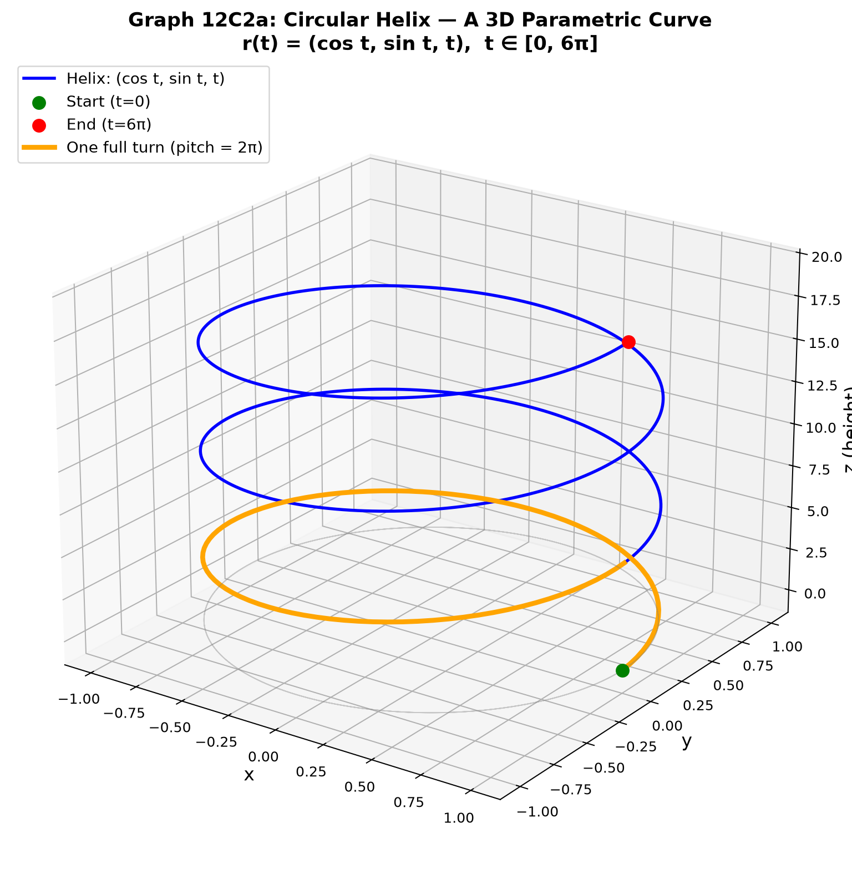
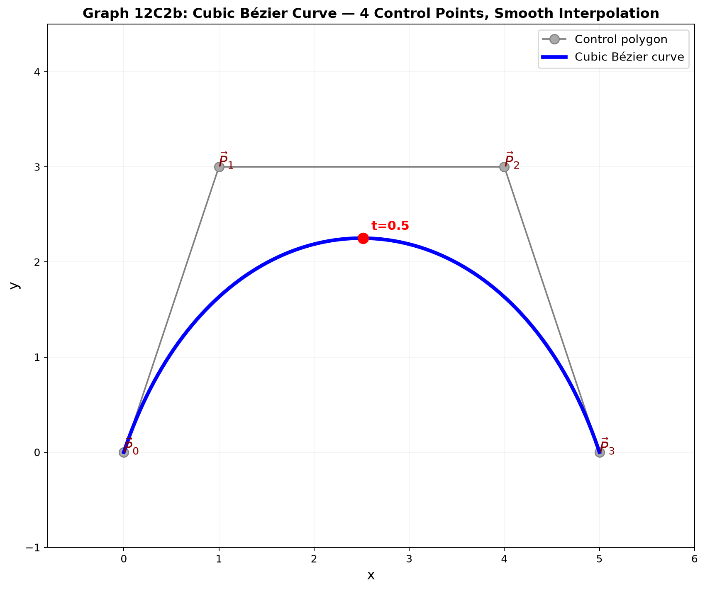
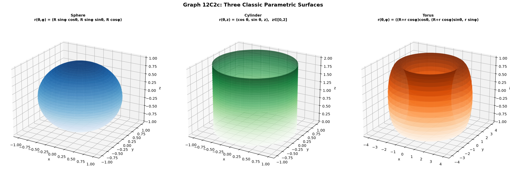

# Session 12C2: Parametric Curves and Surfaces — Drawing with Equations

**Phase 2 — Geometric Techniques | 70 min**

*Prerequisites: 12A1 (complex numbers), 12A2 (matrices & vectors), 11A (trig foundations), 12C1 (geometric transformations)*

---

## Part A: The Big Picture — Moving Points Draw Curves

A curve is a set of points. But to *draw* it, you tell a point where to go at each moment. That is a **parametric equation** — the position $\vec{r}(t)$ as a function of a parameter $t$ (think of $t$ as time).

---

## Example 1: The Line — Two Points, One Parameter

From point $\vec{p}_1$ to $\vec{p}_2$:
$\vec{r}(t) = \vec{p}_1 + t(\vec{p}_2 - \vec{p}_1), \quad t \in [0, 1]$.

At $t = 0$, you are at $\vec{p}_1$. At $t = 1$, at $\vec{p}_2$. At $t = 0.5$, at the midpoint.

In 2D with $\vec{p}_1 = (1, 2)$ and $\vec{p}_2 = (5, 8)$:
$\vec{r}(t) = (1 + 4t,\; 2 + 6t)$, for $t \in [0, 1]$.

This gives $x = 1 + 4t$, $y = 2 + 6t$. Eliminate $t$: $t = \frac{x-1}{4}$, so $y = 2 + 6 \cdot \frac{x-1}{4} = \frac{3}{2}x + \frac{1}{2}$. The familiar $y = mx + b$ form.

---

## Example 2: The Circle — Trigonometry as a Drawing Tool

The unit circle: $\vec{r}(t) = (\cos t,\; \sin t), \quad t \in [0, 2\pi]$.

As $t$ runs from $0$ to $2\pi$, the point traces the circle counterclockwise.

**General circle** (center $(h, k)$, radius $R$):
$\vec{r}(t) = (h + R\cos t,\; k + R\sin t), \quad t \in [0, 2\pi]$.

**Ellipse** (semi-axes $a, b$):
$\vec{r}(t) = (a\cos t,\; b\sin t), \quad t \in [0, 2\pi]$. Check: $\frac{x^2}{a^2} + \frac{y^2}{b^2} = \cos^2 t + \sin^2 t = 1$.

---

## Example 3: The Helix — A 3D Spring

$\vec{r}(t) = (\cos t,\; \sin t,\; t), \quad t \in [0, 6\pi]$.

The $x, y$ coordinates trace a circle, while $z$ climbs steadily. The result: a spiral staircase — a **circular helix**. Three full turns over $t \in [0, 6\pi]$.

**Pitch**: The vertical rise per full turn $= 2\pi$ (since $z$ changes by $2\pi$ when $t$ increases by $2\pi$).



*Graph 12C2a: The circular helix r(t) = (cos t, sin t, t). The orange segment highlights one full turn (pitch = 2π). The gray projection on the xy-plane is the unit circle.*

---

## Example 4: Bézier Curves — Connecting Points Smoothly

Computer graphics and design use **Bézier curves** to draw smooth shapes through control points.

**Linear Bézier** (2 points): $\vec{r}(t) = (1-t)\vec{P}_0 + t\vec{P}_1$.
This is exactly a straight line from $\vec{P}_0$ to $\vec{P}_1$.

**Quadratic Bézier** (3 points): $\vec{r}(t) = (1-t)^2\vec{P}_0 + 2(1-t)t\vec{P}_1 + t^2\vec{P}_2$.
It starts at $\vec{P}_0$ at $t=0$, ends at $\vec{P}_2$ at $t=1$, and is "pulled" toward $\vec{P}_1$ but doesn't pass through it.

**Cubic Bézier** (4 points):
$\vec{r}(t) = (1-t)^3\vec{P}_0 + 3(1-t)^2 t\vec{P}_1 + 3(1-t)t^2\vec{P}_2 + t^3\vec{P}_3$.
The workhorse of vector graphics — fonts, SVG, CAD all use cubic Béziers.

The coefficients are **Bernstein polynomials** — binomial coefficients times powers of $t$ and $1-t$.



*Graph 12C2b: A cubic Bézier curve with control points P₀ through P₃. The curve starts at P₀ (t=0) and ends at P₃ (t=1), pulled toward P₁ and P₂ without passing through them. Red dot marks t=0.5.*

---

## Example 5: Arc Length — How Long Is the Curve?

Velocity of a moving point: $\vec{r}{\,}'(t) = \frac{d\vec{r}}{dt}$. Its magnitude $|\vec{r}{\,}'(t)|$ is the **speed**.

Arc length = integral of speed over time:
$L = \int_{a}^{b} |\vec{r}{\,}'(t)| \, dt$.

**Circle**: $\vec{r}(t) = (R\cos t, R\sin t)$, speed $= \sqrt{(-R\sin t)^2 + (R\cos t)^2} = R$.
Arc length $= \int_0^{2\pi} R \, dt = 2\pi R$. The familiar formula emerges!

**Helix**: $\vec{r}(t) = (\cos t, \sin t, t)$, speed $= \sqrt{\sin^2 t + \cos^2 t + 1} = \sqrt{2}$.
Arc length for three turns $= \int_0^{6\pi} \sqrt{2} \, dt = 6\pi\sqrt{2}$.

---

## Example 6: Parametric Surfaces — 2 Parameters, 3 Dimensions

Just as a curve needs 1 parameter $t$, a surface needs 2 parameters $(u, v)$.

**Plane**: $\vec{r}(u, v) = \vec{p}_0 + u\vec{a} + v\vec{b}$. A flat sheet spanned by vectors $\vec{a}$ and $\vec{b}$.

**Sphere** (radius $R$): $\vec{r}(\theta, \phi) = (R\sin\phi\cos\theta,\; R\sin\phi\sin\theta,\; R\cos\phi)$.
$\theta \in [0, 2\pi]$ — the azimuthal angle (longitude).
$\phi \in [0, \pi]$ — the polar angle (colatitude, $0$ at north pole, $\pi$ at south pole).

**Cylinder**: $\vec{r}(\theta, z) = (R\cos\theta,\; R\sin\theta,\; z)$, $\theta \in [0, 2\pi]$, $z \in [0, H]$.
A circle of radius $R$ extruded vertically by height $H$.

**Torus** (doughnut): $\vec{r}(\theta, \phi) = ((R + r\cos\phi)\cos\theta,\; (R + r\cos\phi)\sin\theta,\; r\sin\phi)$.
$\theta, \phi \in [0, 2\pi]$. $R$ = major radius (center of tube), $r$ = minor radius (thickness of tube).



*Graph 12C2c: Sphere (ρ=constant), cylinder (r=constant), and torus — each needs exactly two parameters to describe every point on its surface.*

---

## Visual Interlude: Surface Normals

For a parametric surface $\vec{r}(u, v)$, the **tangent vectors** are $\vec{r}_u = \frac{\partial\vec{r}}{\partial u}$ and $\vec{r}_v = \frac{\partial\vec{r}}{\partial v}$.

The **normal vector** (perpendicular to the surface) is their cross product: $\vec{n} = \vec{r}_u \times \vec{r}_v$.

The magnitude $|\vec{n}|$ is the **area element** — the area of the tiny parallelogram spanned by $\vec{r}_u \, du$ and $\vec{r}_v \, dv$. Surface area = $\iint |\vec{r}_u \times \vec{r}_v| \, du \, dv$.

---

## Visual Interlude: Arc Length in Polar Coordinates

If a curve is given in polar form $r = f(\theta)$, parametrize as $\vec{r}(\theta) = (r\cos\theta,\; r\sin\theta) = (f(\theta)\cos\theta,\; f(\theta)\sin\theta)$.

Velocity: $\vec{r}{\,}' = (f'\cos\theta - f\sin\theta,\; f'\sin\theta + f\cos\theta)$.
Speed squared: $|\vec{r}{\,}'|^2 = (f')^2 + f^2$.
Arc length: $L = \int_{\theta_1}^{\theta_2} \sqrt{(f')^2 + f^2} \, d\theta$.

Example — **spiral** $r = \theta$ from $\theta = 0$ to $2\pi$:
$L = \int_0^{2\pi} \sqrt{1 + \theta^2} \, d\theta$. (This integral involves $\sinh^{-1}$, but the idea is clear.)

> **Up to here**: Parametric form gives a moving-point description of curves. Lines, circles, ellipses.
> 3D curves like helix. Bézier curves — the foundation of computer graphics.
> Arc length integrates speed. Parametric surfaces use two parameters. Normals come from cross products.

---

## Common Mistakes

### Mistake 1: Assuming speed is constant

**Wrong path**: "The helix has speed 1 since it's a circle with a climb."

**Why wrong**: The helix speed is $\sqrt{2}$, not 1. Speed = $\sqrt{(\frac{dx}{dt})^2 + (\frac{dy}{dt})^2 + (\frac{dz}{dt})^2}$. The $z$ component contributes.

**Right path**: Always compute speed by differentiating and taking magnitude. Don't guess.

### Mistake 2: Forgetting the $t$-domain

**Wrong path**: Giving $\vec{r}(t) = (R\cos t, R\sin t)$ without specifying $t \in [0, 2\pi]$.

**Why wrong**: Without a domain, this could trace the circle infinitely many times. The domain is part of the definition of the curve.

**Right path**: Always write $t \in [a, b]$ (or $\theta \in [0, 2\pi]$, etc.).

---

## What We Just Did

```
(1) Parametric form: position as a function of parameter t.
    Line, circle, ellipse via trig parametrization.

(2) 3D curves: helix as the classic space curve.
    Bézier curves: linear, quadratic, cubic — graphics primitives.

(3) Arc length: integrate speed. Circle yields 2πR naturally.
    Parametric surfaces: plane, sphere, cylinder, torus.
    Normals via cross product of tangent vectors.
```

---

## Practice 1

Parametrize the line segment from $(3, -1, 4)$ to $(7, 2, 10)$.

→ Reference: **Example 1**

> Solutions: [Solutions](solutions/12C2-solutions.md#practice-1)

---

## Practice 2

An ellipse has semi-major axis 5 along the $x$-direction and semi-minor axis 3 along the $y$-direction. Write its parametric equation and verify that $\frac{x^2}{25} + \frac{y^2}{9} = 1$.

→ Reference: **Example 2**

> Solutions: [Solutions](solutions/12C2-solutions.md#practice-2)

---

## Practice 3

Find the arc length of the helix $\vec{r}(t) = (2\cos t,\; 2\sin t,\; 3t)$ for $t \in [0, 4\pi]$.

→ Reference: **Example 3, 5**

> Solutions: [Solutions](solutions/12C2-solutions.md#practice-3)

---

## Practice 4

A cubic Bézier curve has control points $\vec{P}_0 = (0, 0)$, $\vec{P}_1 = (1, 3)$, $\vec{P}_2 = (4, 3)$, $\vec{P}_3 = (5, 0)$. Where is the curve at $t = 0.5$?

→ Reference: **Example 4**

> Solutions: [Solutions](solutions/12C2-solutions.md#practice-4)

---

## Practice 5

Find the normal vector to the sphere $\vec{r}(\theta, \phi) = (R\sin\phi\cos\theta,\; R\sin\phi\sin\theta,\; R\cos\phi)$ at the point where $\theta = \pi/4$, $\phi = \pi/3$. Verify it points radially outward.

→ Reference: **Example 6**, **Surface Normals** interlude

> Solutions: [Solutions](solutions/12C2-solutions.md#practice-5)

---

## Practice 6: Real Battle

A curve is given by $\vec{r}(t) = (t\cos t,\; t\sin t,\; t)$ for $t \in [0, 4\pi]$. This is a **conical spiral** — it spirals outward as it climbs. Find its arc length between $t = 0$ and $t = 4\pi$.

→ Reference: **Example 3, 5**

> Solutions: [Solutions](solutions/12C2-solutions.md#practice-6)

---

## Basic Algebra Drill — Parametric Curves (10 Problems)

> Pure computation.

**D1.** A line segment goes from $(1, 2)$ to $(4, 6)$. Write the parametric form $\vec{r}(t)$ for $t \in [0, 1]$.

**D2.** Parametrize a circle with center $(2, -3)$ and radius 4.

**D3.** Find the speed $|\vec{r}{\,}'(t)|$ for $\vec{r}(t) = (3t, 4t)$. What is the arc length from $t=0$ to $t=5$?

**D4.** Write the quadratic Bézier curve for $\vec{P}_0 = (0, 0)$, $\vec{P}_1 = (2, 4)$, $\vec{P}_2 = (6, 0)$.

**D5.** For the cylinder $\vec{r}(\theta, z) = (3\cos\theta,\; 3\sin\theta,\; z)$, compute the tangent vectors $\vec{r}_\theta$ and $\vec{r}_z$.

**D6.** A point moves as $\vec{r}(t) = (e^t\cos t,\; e^t\sin t)$ — a logarithmic spiral. Find the speed at $t = 0$.

**D7.** Parametrize an ellipse with center $(1, -2)$, semi-major axis 6 along $x$, and semi-minor axis 4 along $y$.

**D8.** Find the speed of the point moving on $\vec{r}(t) = (t^2,\; t^3)$ at $t = 2$.

**D9.** Write the linear Bézier (straight line) from $(3, 1, 8)$ to $(7, 5, 2)$.

**D10.** A curve is given by $\vec{r}(t) = (5\cos t,\; 5\sin t,\; 0)$. What shape is it? What is the speed?

> Solutions: [Solutions](solutions/12C2-solutions.md#basic-drill)

---

## Advanced Algebra Drill — Parametric Curves (10 Problems)

> Multi-step geometric reasoning.

**A1.** Find the arc length of the parabola $\vec{r}(t) = (t,\; t^2)$ from $t = 0$ to $t = 1$. (Leave the integral in closed form after substitution.)

**A2.** A curve is given in polar form $r = 1 + \cos\theta$ (cardioid). Write its parametric form $(x(\theta), y(\theta))$ and find the arc length from $\theta = 0$ to $\theta = 2\pi$.

**A3.** Compute the surface area of a torus with major radius $R = 4$ and minor radius $r = 1$. (Use the formula Area $= \iint |\vec{r}_\theta \times \vec{r}_\phi| \, d\theta \, d\phi$.)

**A4.** Find the point on the cubic Bézier curve from Practice 4 where the tangent vector is horizontal.

**A5.** A curve is defined implicitly by $x^2 + y^2 + z^2 = 1$ and $x + y + z = 0$ — the intersection of a sphere and a plane (a great circle). Parametrize this curve.

**A6.** Derive the formula for the surface area of a sphere of radius $R$ using the parametric form $\vec{r}(\theta, \phi)$ and the surface area integral.

**A7.** Find the arc length of one arch of the cycloid: $\vec{r}(t) = (t - \sin t,\; 1 - \cos t)$ for $t \in [0, 2\pi]$. (Hint: $1 - \cos t = 2\sin^2(t/2)$.)

**A8.** A parametric surface is given by $\vec{r}(u, v) = (u\cos v,\; u\sin v,\; u^2)$ for $u \in [0, 2]$, $v \in [0, 2\pi]$. This is a paraboloid. Compute $|\vec{r}_u \times \vec{r}_v|$.

**A9.** For the helix $\vec{r}(t) = (R\cos t,\; R\sin t,\; ct)$, compute the curvature $\kappa = \frac{|\vec{r}{\,}' \times \vec{r}{\,}''|}{|\vec{r}{\,}'|^3}$.

**A10.** Two lines are given parametrically: $\vec{r}_1(t) = (1, 2, 3) + t(1, 0, -1)$ and $\vec{r}_2(s) = (4, 1, 2) + s(2, 1, 1)$. Determine if they intersect, and if so, find the intersection point.

> Solutions: [Solutions](solutions/12C2-solutions.md#advanced-drill)

---

## Today's Procedure

```
Step 1: Parametric form — describe a curve as a moving point r(t).
         Domain [a,b] is essential. Line, circle, ellipse as basic examples.

Step 2: 3D curves (helix) and Bézier curves (graphics).
         Arc length = integrate speed = ∫ |r'(t)| dt.

Step 3: Parametric surfaces need two parameters (u, v).
         Tangent vectors r_u, r_v. Normal = r_u × r_v.
         Surface area = ∬ |r_u × r_v| du dv.
```

---

## How to Read These Symbols

| Symbol | Reads as | Meaning |
|:---:|:---:|------|
| $\vec{r}(t) = \langle x(t), y(t) \rangle$ | "r of t equals angle-bracket x of t comma y of t" | parametric curve — position at time t |
| $\vec{r}\,'(t)$ | "r prime of t" / "velocity vector" | derivative of position — tangent direction |
| $\|\vec{r}\,'(t)\|$ | "speed" / "magnitude of velocity" | how fast the point moves — scalar |
| $\vec{T}(t) = \vec{r}\,'/\|\vec{r}\,'\|$ | "T of t equals r prime over its magnitude" | unit tangent vector |
| $\vec{N}(t)$ | "N of t" / "unit normal" | perpendicular to tangent — points toward center of curvature |
| $\kappa(t)$ | "kappa of t" / "curvature" | how sharply the curve bends — 1/radius of curvature |
| $L = \int_a^b \|\vec{r}\,'(t)\|\,dt$ | "arc length equals integral of speed" | length of curve from t=a to t=b |
| $\vec{r}(u,v) = \langle x(u,v), y(u,v), z(u,v) \rangle$ | "r of u v" | parametric surface — two parameters sweep a surface |
| tangent plane | "tangent plane" | spanned by $\vec{r}_u$ and $\vec{r}_v$ — best flat approximation to surface |

---

## Terminology

| What we called it | Mathematical term | Notation |
|:-----------------:|:-----------------:|:--------:|
| moving point | parametric curve | $\vec{r}(t)$ |
| speed | magnitude of derivative | $\|\vec{r}{\,}'(t)\|$ |
| arc length | arc length | $L = \int_a^b \|\vec{r}{\,}'(t)\|\,dt$ |
| Bézier | Bézier curve | Bernstein basis |
| parametric surface | parametric surface | $\vec{r}(u,v)$ |
| tangent vectors | partial derivatives | $\vec{r}_u, \vec{r}_v$ |
| normal vector | normal vector | $\vec{n} = \vec{r}_u \times \vec{r}_v$ |
| area element | surface area element | $dS = \|\vec{r}_u \times \vec{r}_v\|\,du\,dv$ |
