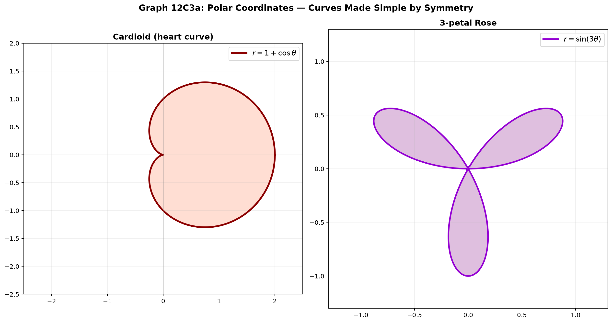
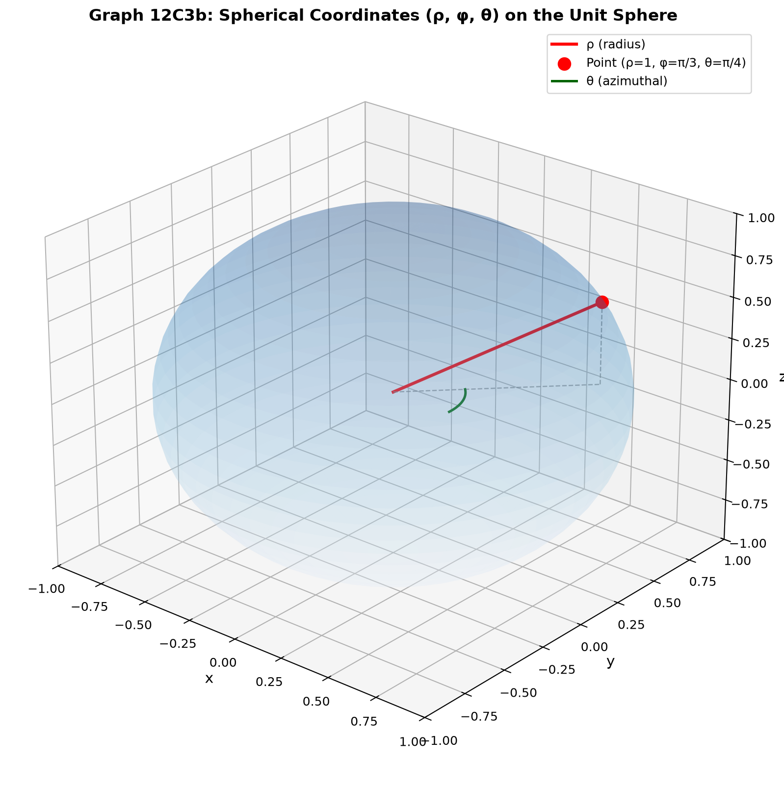
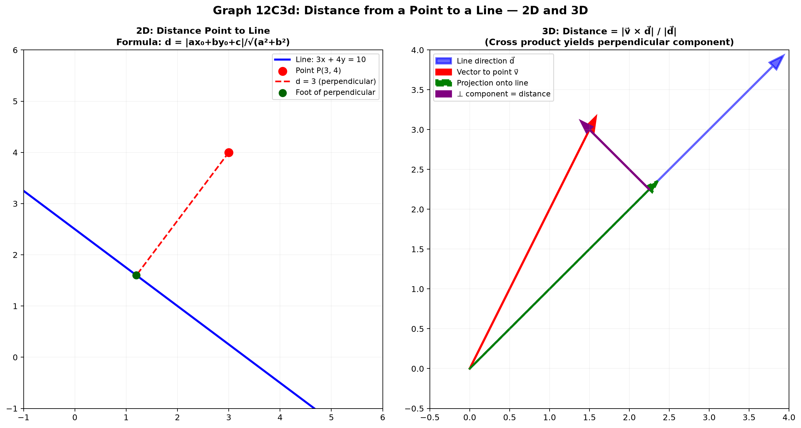
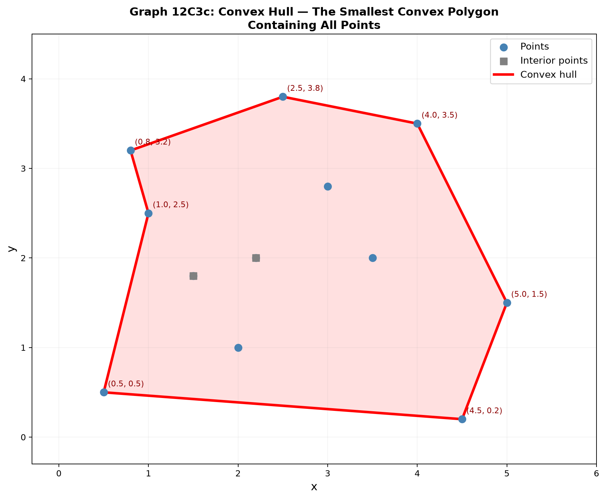

# Session 12C3: Coordinate Systems and Geometric Optimization

**Phase 2 — Geometric Techniques | 70 min**

*Prerequisites: 12A2 (matrices & vectors), 12C1 (geometric transformations), 12C2 (parametric curves & surfaces)*

---

## Part A: The Big Picture — The Right Coordinate System Solves the Problem

Many geometric problems become simple when viewed from the right perspective. Changing coordinate systems is not just a computational trick — it is a deep insight: **geometry is invariant; representations are flexible.**

---

## Example 1: Distance Between Two Points in 2D and 3D

The Euclidean distance formula comes directly from the Pythagorean theorem:

**2D**: $d = \sqrt{(x_2 - x_1)^2 + (y_2 - y_1)^2}$.
**3D**: $d = \sqrt{(x_2 - x_1)^2 + (y_2 - y_1)^2 + (z_2 - z_1)^2}$.

This generalizes to **n-dimensional Euclidean space**:
$d = \sqrt{\sum_{i=1}^{n} (x_i - y_i)^2}$.

The distance is the magnitude of the vector difference: $d = |\vec{p}_2 - \vec{p}_1|$.

---

## Example 2: Polar Coordinates — Rotational Symmetry Revealed

In Cartesian coordinates, a circle is $x^2 + y^2 = R^2$ — an implicit relationship between $x$ and $y$. But the curve is all about distance from the origin.

**Polar coordinates** $(r, \theta)$ separate the roles:
- $r$ = distance from origin ($r \ge 0$).
- $\theta$ = angle from positive $x$-axis.

A circle: $r = R$ (constant, independent of $\theta$).
The equation becomes trivial — because the coordinate system matches the symmetry of the shape.

**Conversion:**
$x = r\cos\theta$, $y = r\sin\theta$.
$r = \sqrt{x^2 + y^2}$, $\theta = \tan^{-1}(y/x)$ (adjust quadrant).

**Example**: The curve $r = \sin\theta$ in polar coordinates.
Convert: $r = \sin\theta \implies r^2 = r\sin\theta \implies x^2 + y^2 = y \implies x^2 + (y - \frac{1}{2})^2 = \frac{1}{4}$.
A circle of radius $\frac{1}{2}$ centered at $(0, \frac{1}{2})$. In Cartesian, this is a quadratic equation. In polar, it's just $r = \sin\theta$.



*Graph 12C3a: Left — The cardioid r = 1 + cos θ, a heart-shaped curve that is simply described in polar coordinates. Right — The 3-petal rose r = sin(3θ). Both are trivially expressed in polar form but would be high-degree polynomials in Cartesian.*

---

## Example 3: Cylindrical and Spherical Coordinates in 3D

**Cylindrical coordinates** $(r, \theta, z)$ combine polar in the $xy$-plane with the Cartesian $z$:
$x = r\cos\theta$, $y = r\sin\theta$, $z = z$.
Perfect for cylinders, cones, and any shape with rotational symmetry about the $z$-axis.

A cylinder: $r = R$ (a constant), $z$ free.
A cone: $z = r$ (or $z = kr$).

**Spherical coordinates** $(\rho, \phi, \theta)$:
- $\rho$ = distance from origin ($\rho \ge 0$).
- $\phi$ = polar angle from positive $z$-axis ($0 \le \phi \le \pi$).
- $\theta$ = azimuthal angle in $xy$-plane ($0 \le \theta < 2\pi$).

$x = \rho\sin\phi\cos\theta$, $y = \rho\sin\phi\sin\theta$, $z = \rho\cos\phi$.

A sphere: $\rho = R$ (a constant). Again, the equation becomes trivial.



*Graph 12C3b: A point on the unit sphere labeled by its spherical coordinates (ρ=1, φ=π/3, θ=π/4). The green arc shows the azimuthal angle θ in the xy-plane. The red radial line is ρ.*

---

## Example 4: Line–Plane Intersection

**Problem**: Find the intersection of the line $\vec{r}(t) = \vec{p}_0 + t\vec{d}$ with the plane $\vec{n} \cdot \vec{x} = D$ (where $\vec{n}$ is the plane's normal vector).

Plug in: $\vec{n} \cdot (\vec{p}_0 + t\vec{d}) = D$.
Solve: $t = \frac{D - \vec{n} \cdot \vec{p}_0}{\vec{n} \cdot \vec{d}}$.

If $\vec{n} \cdot \vec{d} = 0$, the line is parallel to the plane (either no intersection or the line lies in the plane).

**Numerical example**: Line through $(1, 2, 3)$ with direction $(1, -1, 2)$. Plane $2x + y - z = 4$.
$\vec{n} \cdot \vec{d} = 2(1) + 1(-1) + (-1)(2) = -1$.
$\vec{n} \cdot \vec{p}_0 = 2(1) + 1(2) + (-1)(3) = 1$.
$t = \frac{4 - 1}{-1} = -3$.
Intersection point: $(1, 2, 3) + (-3)(1, -1, 2) = (-2, 5, -3)$.

---

## Example 5: Distance from a Point to a Line

**2D**: Distance from point $(x_0, y_0)$ to line $ax + by + c = 0$:
$d = \frac{|ax_0 + by_0 + c|}{\sqrt{a^2 + b^2}}$.

**3D**: Distance from point $\vec{p}$ to line $\vec{r}(t) = \vec{q} + t\vec{d}$:
Vector from point to any point on line: $\vec{v} = \vec{p} - \vec{q}$.
Project $\vec{v}$ onto the line direction $\vec{d}$: $\text{proj}_{\vec{d}}\vec{v} = \frac{\vec{v} \cdot \vec{d}}{|\vec{d}|^2} \vec{d}$.
The perpendicular component: $\vec{v}_\perp = \vec{v} - \text{proj}_{\vec{d}}\vec{v}$.
Distance: $d = |\vec{v}_\perp| = \frac{|\vec{v} \times \vec{d}|}{|\vec{d}|}$.

**Insight**: The cross product formula is often simplest for computing in 3D.



*Graph 12C3d: Left — 2D distance from a point to a line via the perpendicular formula. Right — In 3D, the cross product |v⃗ × d⃗| / |d⃗| yields the perpendicular distance to a line.*

---

## Example 6: Convex Hull — The Outer Boundary of Points

Given a set of points in the plane, the **convex hull** is the smallest convex polygon containing all of them. Think of wrapping a rubber band around the points.

A point is **inside** the convex hull if it can be written as a convex combination of the hull vertices. A point is on the hull if it is one of the extreme points.

**Graham scan** (2D convex hull, $O(n\log n)$): Sort points by angle around the lowest point, then scan to keep only left turns.

The convex hull is used in collision detection, computational geometry, and machine learning (support vector machines find a convex boundary).



*Graph 12C3c: A set of points with their convex hull outlined in red. Interior points (squares) lie inside the polygon. The hull is the tightest convex shape wrapping all points.*

---

## Example 7: Barycentric Coordinates — Inside a Triangle

Any point $\vec{p}$ inside triangle $\triangle ABC$ can be uniquely expressed as:
$\vec{p} = \alpha\vec{A} + \beta\vec{B} + \gamma\vec{C}$,
where $\alpha, \beta, \gamma \ge 0$ and $\alpha + \beta + \gamma = 1$.

**Interpretation**: $(\alpha, \beta, \gamma)$ are proportional to the areas of the subtriangles opposite each vertex. They are the **barycentric coordinates**.

Applications: color interpolation in computer graphics (Gouraud shading), hit testing in ray tracing, finite element methods.

---

## Example 8: Geometric Optimization — Closest Point Problems

**Find the point on the plane $ax + by + cz = d$ closest to the origin.**

The shortest distance from the origin to the plane: $d_{\min} = \frac{|d|}{\sqrt{a^2 + b^2 + c^2}}$.
The closest point is along the normal direction: $\vec{p}_{\text{closest}} = \frac{d}{a^2 + b^2 + c^2}(a, b, c)$.

**Lagrange multipliers** method: Minimize $f(x,y,z) = x^2 + y^2 + z^2$ subject to $g(x,y,z) = ax + by + cz - d = 0$.
$\nabla f = \lambda \nabla g \implies (2x, 2y, 2z) = \lambda(a, b, c)$.
So $(x, y, z) \propto (a, b, c)$ — the closest point is along the normal. Substitute back to find the scaling.

> **Up to here**: Coordinate systems (Cartesian, polar, cylindrical, spherical) match problem symmetry.
> Distance formulas in 2D, 3D, n-D. Line–plane intersection. Point–line distance (cross product formula).
> Convex hull = outermost boundary. Barycentric coordinates = inside a triangle.
> Geometric optimization = closest point problems via Lagrange multipliers.

---

## Common Mistakes

### Mistake 1: Using Cartesian when polar is simpler

**Wrong path**: Trying to describe $r = \sin\theta$ in Cartesian as a circle by completing squares from $x^2 + y^2 - y = 0$.

**Why wrong**: You'll eventually get there, but the point is to recognize the symmetry. In polar form, $r = \sin\theta$ is already the simplest description.

**Right path**: Use the coordinate system that matches the problem's natural symmetry.

### Mistake 2: Forgetting the quadrant in polar conversion

**Wrong path**: $\tan^{-1}(y/x)$ gives the principal value $(-\pi/2, \pi/2)$, so $(-1, -1)$ gives $\theta = 45^\circ$ instead of $225^\circ$.

**Why wrong**: $\tan^{-1}$ doesn't distinguish quadrants II and III from I and IV.

**Right path**: Use `atan2(y, x)` or manually adjust: both $x$ and $y$ negative means Q3, add $\pi$.

---

## What We Just Did

```
(1) Euclidean distance in 2D, 3D, and n-D. The magnitude of vector difference.

(2) Polar coordinates for rotational symmetry. Cylindrical and spherical for 3D.
    Matching coordinate system to problem = dramatic simplification.

(3) Line–plane intersection via substitution.
    Point–line distance via cross product in 3D.

(4) Convex hull — smallest enclosing polygon.
    Barycentric coordinates — weighted-sum representation inside a triangle.

(5) Geometric optimization: closest point problems.
    Lagrange multipliers to enforce constraints.
```

---

## Practice 1

Convert the Cartesian equation $x^2 - y^2 = 1$ (a hyperbola) to polar coordinates.

→ Reference: **Example 2**

> Solutions: [Solutions](solutions/12C3-solutions.md#practice-1)

---

## Practice 2

Find the intersection of the line $\vec{r}(t) = (2, 1, 0) + t(1, -1, 1)$ with the plane $3x + y + 2z = 10$.

→ Reference: **Example 4**

> Solutions: [Solutions](solutions/12C3-solutions.md#practice-2)

---

## Practice 3

Find the distance from the point $(1, 2, 3)$ to the line through $(0, 0, 0)$ with direction $(1, 1, 1)$.

→ Reference: **Example 5**

> Solutions: [Solutions](solutions/12C3-solutions.md#practice-3)

---

## Practice 4

Find the point on the sphere $x^2 + y^2 + z^2 = 25$ that is closest to the point $(10, 0, 0)$.

→ Reference: **Example 8**

> Solutions: [Solutions](solutions/12C3-solutions.md#practice-4)

---

## Practice 5

A point inside triangle $ABC$ has barycentric coordinates $(0.5, 0.3, 0.2)$. If $A = (0, 0)$, $B = (4, 0)$, $C = (0, 3)$, find the Cartesian coordinates of the point.

→ Reference: **Example 7**

> Solutions: [Solutions](solutions/12C3-solutions.md#practice-5)

---

## Practice 6: Real Battle

You have four points in the plane: $(0, 0)$, $(3, 0)$, $(3, 2)$, $(1, 1)$. Determine which points are vertices of the convex hull. Also, is the point $(2, 0.5)$ inside or outside the convex hull? Use the barycentric / area method.

→ Reference: **Example 6, 7**

> Solutions: [Solutions](solutions/12C3-solutions.md#practice-6)

---

## Basic Algebra Drill — Coordinate Systems (10 Problems)

> Direct computation.

**D1.** Convert the polar point $(r=4, \theta=60^\circ)$ to Cartesian coordinates.

**D2.** Convert the Cartesian point $(-3, -3)$ to polar coordinates.

**D3.** Write the cylindrical coordinates $(r, \theta, z)$ of the point $(x, y, z) = (1, 1, 5)$.

**D4.** Write the spherical coordinates $(\rho, \phi, \theta)$ of the point $(x, y, z) = (0, 0, 7)$.

**D5.** Compute the distance between $(1, 2, 3)$ and $(4, 6, 15)$ in 3D.

**D6.** Find the distance from the point $(3, 4)$ to the line $3x + 4y = 10$ in 2D.

**D7.** Convert the Cartesian point $(2, -2, 1)$ to cylindrical coordinates.

**D8.** Convert the cylindrical point $(r=3, \theta=\pi/3, z=4)$ to Cartesian.

**D9.** Find the distance from the point $(1, -1, 2)$ to the plane $x + 2y + 2z = 6$.

**D10.** Write the Cartesian equation of the sphere $\rho = 5$ in spherical coordinates.

> Solutions: [Solutions](solutions/12C3-solutions.md#basic-drill)

---

## Advanced Algebra Drill — Coordinate Systems (10 Problems)

> Multi-step geometric reasoning.

**A1.** Find the equation of a torus in Cartesian coordinates by eliminating the parameters from $\vec{r}(\theta, \phi)$ (the standard parametric form from 12C2).

**A2.** Find the distance between two skew lines: $\vec{r}_1(t) = (0, 0, 0) + t(1, 0, 0)$ and $\vec{r}_2(s) = (0, 1, 1) + s(0, 0, 1)$.

**A3.** Find the center and radius of the circle that is the intersection of the sphere $x^2 + y^2 + z^2 = 25$ and the plane $x + y + z = 3$.

**A4.** Use Lagrange multipliers to find the point on the plane $2x + 3y + z = 6$ closest to the origin. Verify using the geometric formula.

**A5.** A triangle has vertices $A(0,0)$, $B(6,0)$, $C(0,4)$. Find the barycentric coordinates of its centroid.

**A6.** The polar curve $r = 2\cos\theta$ is a circle. Find its center and radius by converting to Cartesian. Also find the arc length of the full curve for $\theta \in [-\pi/2, \pi/2]$.

**A7.** Find the shortest distance from the point $(3, 0, 0)$ to the line of intersection of the planes $x + y + z = 1$ and $x - y + z = 0$.

**A8.** Determine if the point $(2, 2, 2)$ lies inside or outside the tetrahedron with vertices $(0,0,0)$, $(4,0,0)$, $(0,4,0)$, $(0,0,4)$ using barycentric coordinates in 3D.

**A9.** Find the maximum and minimum distances from the origin to the curve $x^2 + 4y^2 = 4$ (an ellipse) using Lagrange multipliers.

**A10.** Three points in the plane: $(0, 0)$, $(5, 0)$, $(2, 4)$. Find the point inside the triangle that minimizes the sum of squared distances to the three vertices. (Hint: this is the centroid.)

> Solutions: [Solutions](solutions/12C3-solutions.md#advanced-drill)

---

## Today's Procedure

```
Step 1: Choose the right coordinate system.
         Cartesian = rectangles. Polar = circles. Cylindrical = tubes. Spherical = balls.

Step 2: Compute intersections and distances.
         Line–plane: plug in and solve for t.
         Point–line (3D): cross product formula = fastest.

Step 3: Geometric reasoning.
         Convex hull = extreme points. Barycentric = weighted inside a simplex.
         Optimization: Lagrange multipliers reduce constrained problems to equations.
```

---

## How to Read These Symbols

| Symbol | Reads as | Meaning |
|:---:|:---:|------|
| $x = r\cos\theta$, $y = r\sin\theta$ | "x equals r cosine theta, y equals r sine theta" | polar → rectangular conversion |
| $r = \sqrt{x^2+y^2}$ | "r equals square root of x squared plus y squared" | distance from origin in polar |
| $\theta = \tan^{-1}(y/x)$ | "theta equals inverse tangent of y over x" | angle from positive x-axis |
| $x = \rho\sin\phi\cos\theta$ | "x equals rho sine phi cosine theta" | spherical → rectangular (x) |
| $y = \rho\sin\phi\sin\theta$ | "y equals rho sine phi sine theta" | spherical → rectangular (y) |
| $z = \rho\cos\phi$ | "z equals rho cosine phi" | spherical → rectangular (z) |
| $\rho$ | "rho" | distance from origin (spherical) — NOT same as polar r |
| $\phi$ | "phi" | angle from positive z-axis: 0 at north pole, π at south pole |
| $x = r\cos\theta$, $y = r\sin\theta$, $z = z$ | "x equals r cosine theta, y equals r sine theta, z equals z" | cylindrical coordinates — polar in xy + z |
| $dA = r\,dr\,d\theta$ | "d A equals r d r d theta" | polar area element — Jacobian = r |
| $dV = \rho^2\sin\phi\,d\rho\,d\phi\,d\theta$ | "d V equals rho squared sine phi d rho d phi d theta" | spherical volume element |

---

## Terminology

| What we called it | Mathematical term | Notation |
|:-----------------:|:-----------------:|:--------:|
| polar | polar coordinates | $(r, \theta)$ |
| cylindrical | cylindrical coordinates | $(r, \theta, z)$ |
| spherical | spherical coordinates | $(\rho, \phi, \theta)$ |
| convex hull | convex hull | $\text{Conv}(P)$ |
| barycentric | barycentric coordinates | $(\alpha, \beta, \gamma)$ |
| Lagrange | Lagrange multiplier | $\lambda$ |
| distance formula | Euclidean metric | $\|\vec{p} - \vec{q}\|$ |
| skew lines | skew lines | non-intersecting, non-parallel |
