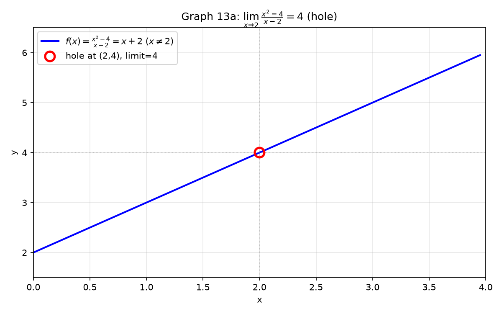
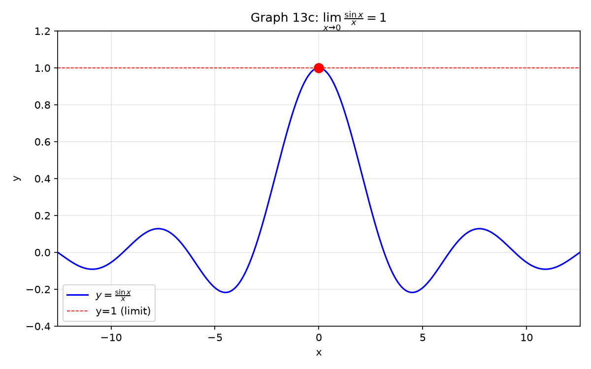
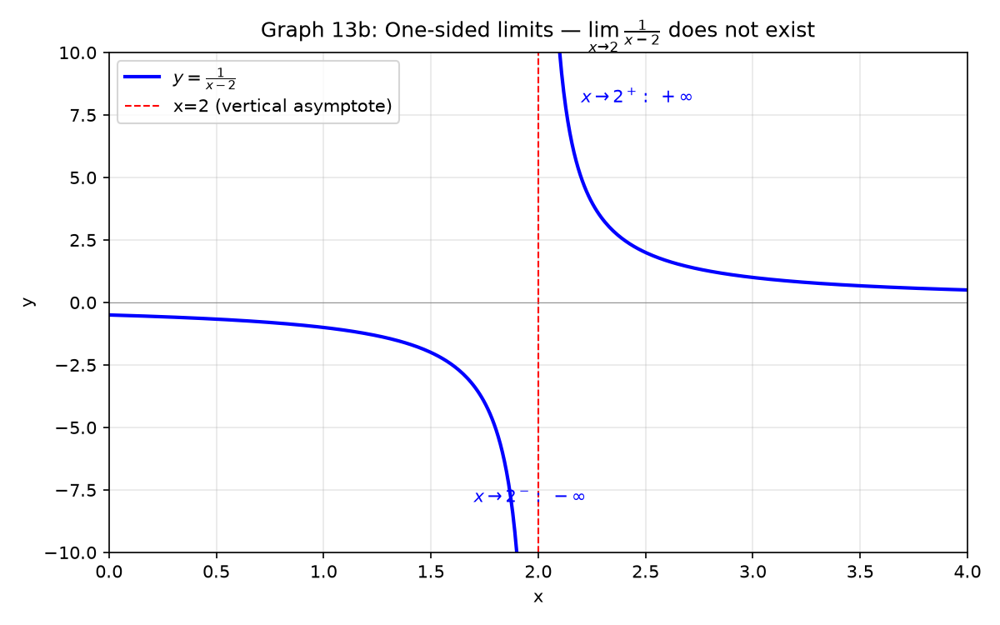

# Session 13A: Algebraic Limits — The $\frac{0}{0}$ Toolkit

**Phase 2 — Classical Techniques | 75 min**

*Prerequisites: 07 (polynomial factoring), 10A (exponents & logs), 11A (trig functions)*

---

## Part A: Direct Substitution — Just Plug It In

---

## Example 1: When Plugging In Just Works

The simplest idea in limits: **just plug the number in.** If the function is continuous at that point, the limit equals the function value.

$\lim_{x\to 1}(2x+3) = 2(1)+3 = 5$.
$\lim_{x\to 3}(x^2-4) = 9-4 = 5$.
$\lim_{x\to 0}e^x = e^0 = 1$.
$\lim_{x\to \pi/2}\sin x = 1$.
$\lim_{x\to 2}\ln x = \ln 2$.

**When direct substitution works**: The function is **continuous** at the point.
Polynomials, $e^x$, $\sin x$, $\cos x$, $\ln x$ ($x>0$), $\sqrt{x}$ ($x\geq0$) — as long as you stay inside the domain, just plug in.

---

## Part B: $\frac{0}{0}$ — Factor, Cancel, Evaluate

---

## Example 2: Tear and Cancel

Plugging in gives $\frac{0}{0}$. This is NOT the answer — it's a signal: "the race is undecided." Both numerator and denominator are heading to zero. **Who gets there faster?** To find out, factor and cancel the common zero-maker.

$\displaystyle \lim_{x\to 2}\frac{x^2-4}{x-2}$.

① $x=2$ → $\frac{0}{0}$.
② Factor numerator: $x^2-4 = (x-2)(x+2)$.
③ Cancel $(x-2)$: $\frac{\cancel{(x-2)}(x+2)}{\cancel{x-2}} = x+2$ (for $x \neq 2$).
④ Now plug $x=2$: $2+2 = 4$.

In one line: $\frac{x^2-4}{x-2} = x+2 \xrightarrow{x\to2} 4$.



*Graph 13A: $\frac{x^2-4}{x-2}$ has a hole at $(2,4)$. The limit asks "what height should the hole be filled to?" — the answer is 4.*

---

**$\displaystyle \lim_{x\to 1}\frac{x^3-1}{x-1}$**.

① $x=1$ → $\frac{0}{0}$.
② $x^3-1 = (x-1)(x^2+x+1)$. Cancel $(x-1)$ → $x^2+x+1$.
③ $x=1$: $1+1+1 = 3$.

**$\displaystyle \lim_{x\to -1}\frac{x^2+3x+2}{x+1}$**.

① $x=-1$ → $\frac{0}{0}$.
② Factor: $(x+1)(x+2)$. Cancel → $x+2$.
③ $x=-1$: $1$.

---

## Part C: $\frac{0}{0}$ with Radicals — Multiply by the Conjugate

---

## Example 3: Conjugate Clears the Root

When a square root causes $\frac{0}{0}$, factoring won't help. The weapon is the **conjugate**: multiply numerator and denominator by $\sqrt{A}+B$ to turn $\sqrt{A}-B$ into $A-B^2$ — the root vanishes.

$\displaystyle \lim_{x\to 0}\frac{\sqrt{x+4}-2}{x}$.

① $x=0$ → $\frac{0}{0}$.
② Multiply top and bottom by $\sqrt{x+4}+2$:
$\frac{(\sqrt{x+4}-2)(\sqrt{x+4}+2)}{x(\sqrt{x+4}+2)} = \frac{(x+4)-4}{x(\sqrt{x+4}+2)}$.
③ Numerator simplifies to $x$. Cancel with denominator $x$ → $\frac{1}{\sqrt{x+4}+2}$.
④ $x=0$: $\frac{1}{\sqrt{4}+2} = \frac{1}{4}$.

---

**$\displaystyle \lim_{x\to 1}\frac{\sqrt{x}-1}{x-1}$**.

① $\frac{0}{0}$. Factor denominator: $x-1 = (\sqrt{x}-1)(\sqrt{x}+1)$.
② Cancel $\sqrt{x}-1$: $\frac{1}{\sqrt{x}+1} \to \frac{1}{2}$.

**$\displaystyle \lim_{x\to 0}\frac{\sqrt{x+1}-1}{\sqrt{x+4}-2}$**.

① Conjugate both: $\frac{(\sqrt{x+1}-1)(\sqrt{x+1}+1)}{(\sqrt{x+4}-2)(\sqrt{x+4}+2)} \cdot \frac{\sqrt{x+4}+2}{\sqrt{x+1}+1}$.
② $= \frac{x}{x} \cdot \frac{\sqrt{x+4}+2}{\sqrt{x+1}+1} \to \frac{2+2}{1+1} = 2$.

---

## Part D: $\frac{0}{0}$ with Trig — The $\frac{\sin x}{x}\to 1$ Family

---

## Example 4: The Most Important Trig Limit

$\displaystyle \lim_{x\to 0}\frac{\sin x}{x} = 1$.

Geometric intuition: for tiny $x$ (in radians), $\sin x$ and $x$ are nearly identical. The ratio approaches 1.

**The critical rule**: $\frac{\sin\square}{\square} \to 1$ only when the $\square$ in the numerator and denominator are **exactly the same**.

$\displaystyle \lim_{x\to 0}\frac{\sin 3x}{x}$.

① The $\square$ don't match: $\sin 3x$ vs $x$.
② Force them to match: $\frac{\sin 3x}{x} = 3\cdot\frac{\sin 3x}{3x}$.
③ As $x\to0$, $3x\to0$ too. $\frac{\sin 3x}{3x} \to 1$. → $3\cdot1 = 3$.

---

$\displaystyle \lim_{x\to 0}\frac{\sin 5x}{\sin 2x}$.

① $\frac{\sin5x}{\sin2x} = \frac{\sin5x}{5x} \cdot \frac{2x}{\sin2x} \cdot \frac{5}{2}$.
② Each fraction $\to 1$. → $\frac{5}{2}$.

$\displaystyle \lim_{x\to 0}\frac{\tan x}{x} = \frac{\sin x}{x}\cdot\frac{1}{\cos x} \to 1\cdot 1 = 1$.

$\displaystyle \lim_{x\to 0}\frac{1-\cos x}{x^2}$.

① $1-\cos x = 2\sin^2\frac{x}{2}$.
② $\frac{2\sin^2\frac{x}{2}}{x^2} = 2\cdot\frac{\sin^2\frac{x}{2}}{(x/2)^2}\cdot\frac{1}{4} = \frac{1}{2}\cdot\left(\frac{\sin\frac{x}{2}}{x/2}\right)^2 \to \frac{1}{2}$.



*Graph 13C: The function sin(x)/x. The hole at (0,1) is the limit — as x→0, the ratio approaches 1.*

**Memorize these three**:
- $\displaystyle \lim_{x\to 0}\frac{\sin x}{x} = 1$
- $\displaystyle \lim_{x\to 0}\frac{\tan x}{x} = 1$
- $\displaystyle \lim_{x\to 0}\frac{1-\cos x}{x^2} = \frac{1}{2}$

---

## Part E: $\frac{0}{0}$ with $e^x$ and $\ln$ — Standard Limits

---

## Example 5: The Exponential Family

$\displaystyle \lim_{x\to 0}\frac{e^x-1}{x} = 1$.

This says: near $x=0$, $e^x$ behaves like $1+x$. The difference $e^x-1$ shrinks at the same rate as $x$.

$\displaystyle \lim_{x\to 0}\frac{e^{2x}-1}{x} = 2\cdot\frac{e^{2x}-1}{2x} \to 2\cdot 1 = 2$.

$\displaystyle \lim_{x\to 0}\frac{\ln(1+x)}{x}$.

① $\frac{\ln(1+x)}{x} = \ln\big((1+x)^{1/x}\big)$.
② As $x\to0$, $(1+x)^{1/x} \to e$. So $\ln e = 1$.

$\displaystyle \lim_{x\to 0}\frac{a^x-1}{x} = \ln a$ (for $a>0$).

**Memorize these**:
- $\displaystyle \lim_{x\to 0}\frac{e^x-1}{x} = 1$
- $\displaystyle \lim_{x\to 0}\frac{\ln(1+x)}{x} = 1$
- $\displaystyle \lim_{x\to 0}\frac{a^x-1}{x} = \ln a$

---

## Part F: $0\cdot\infty$ — Convert to a Quotient

---

## Example 6: Product of Zero and Infinity

$0\cdot\infty$ is another undecided race. Convert the product into a quotient to get $\frac{0}{0}$ or $\frac{\infty}{\infty}$, then use the weapons above.

$\displaystyle \lim_{x\to 0^+} x\ln x$.

① $x\to0^+$ → $0$, $\ln x \to -\infty$. $0\cdot(-\infty)$ form.
② Rewrite: $x\ln x = \frac{\ln x}{1/x}$. Now $\frac{-\infty}{\infty}$.
③ Substitute $t = 1/x$ ($t\to\infty$): $x\ln x = \frac{\ln(1/t)}{t} = -\frac{\ln t}{t} \to 0$.
→ **0**.

$\displaystyle \lim_{x\to\infty} x\sin\frac{1}{x}$.

① $\infty \cdot 0$ form. Rewrite: $x\sin\frac{1}{x} = \frac{\sin(1/x)}{1/x}$.
② Let $t = 1/x$ ($t\to0$): $\frac{\sin t}{t} \to 1$.
→ **1**.

---

## Part G: One-Sided Limits and Absolute Value

---

## Example 7: Left and Right Must Agree

$\displaystyle \lim_{x\to 2^+}\frac{1}{x-2}$ (from the right).

Denominator $x-2 \to 0^+$ (tiny positive). $\frac{1}{0^+} \to +\infty$.

$\displaystyle \lim_{x\to 2^-}\frac{1}{x-2}$ (from the left).

Denominator $x-2 \to 0^-$ (tiny negative). $\frac{1}{0^-} \to -\infty$.

Two-sided limit: **does not exist** (left $\neq$ right).

---

## Example 8: Absolute Value — Split into Cases

$\displaystyle \lim_{x\to 0}\frac{|x|}{x}$.

① $x\to0^+$: $|x| = x$ → $\frac{x}{x} = 1$.
② $x\to0^-$: $|x| = -x$ → $\frac{-x}{x} = -1$.
③ Left $\neq$ right → **limit does not exist**.

$\displaystyle \lim_{x\to 2}\frac{|x-2|}{x-2}$.

① $x\to2^+$: $|x-2| = x-2$ → ratio = $1$.
② $x\to2^-$: $|x-2| = -(x-2)$ → ratio = $-1$.
③ → **limit does not exist**.

---

## Example 9: Piecewise — Check Both Sides at the Boundary

$$
f(x) = \begin{cases}
x+2, & x < 1 \\
x^2, & x \geq 1
\end{cases}
$$

$\displaystyle \lim_{x\to 1^-}f(x) = 1+2 = 3$. $\displaystyle \lim_{x\to 1^+}f(x) = 1^2 = 1$.

$3 \neq 1$ → **limit does not exist** at $x=1$.



> **Up to here**: Direct substitution = first move. $\frac{0}{0}$: factor-cancel, conjugate, $\frac{\sin x}{x}\to1$, $\frac{e^x-1}{x}\to1$.
> $0\cdot\infty$: convert to quotient. One-sided: check left and right separately. Absolute value: split cases.

---

## Common Mistakes

### Mistake 1: "$\frac{0}{0}$ = 0"

**Wrong**. $\frac{0}{0}$ means "race undecided" — factor, cancel, or conjugate to find the real limit.

### Mistake 2: $\frac{\sin 5x}{x} \to 1$ without fixing

**Wrong**. The argument must match: $\frac{\sin 5x}{x} = 5\cdot\frac{\sin 5x}{5x} \to 5$.

### Mistake 3: $\sqrt{x^2} = x$ for $x \to -\infty$

**Wrong** when $x$ is negative. $\sqrt{x^2} = |x|$. For $x<0$, $|x| = -x$.

---

## What We Just Did

```
(1) Direct substitution: plug in. If it works, done.

(2) 0/0 → Five weapons:
    Factor-cancel (polynomials)
    Conjugate (radicals)
    sinx/x → 1, tanx/x → 1, (1-cosx)/x² → 1/2
    (e^x-1)/x → 1, ln(1+x)/x → 1
    Substitute t = x-a to move the limit to 0

(3) 0·∞ → rewrite as quotient → becomes 0/0 or ∞/∞

(4) One-sided limits: check left and right. Absolute value: split cases.
```

---

## Practice 1

$\displaystyle \lim_{x\to 2}\frac{x^3-8}{x-2}$. Use the difference of cubes formula.

→ Reference: **Example 2**

> Solutions: [Solutions](solutions/13A-solutions.md#practice-1)

---

## Practice 2

$\displaystyle \lim_{x\to 0}\frac{\sqrt{x+9}-3}{x}$. Use the conjugate.

→ Reference: **Example 3**

> Solutions: [Solutions](solutions/13A-solutions.md#practice-2)

---

## Practice 3

$\displaystyle \lim_{x\to 0}\frac{\sin 7x}{\tan 3x}$. Use $\frac{\sin\square}{\square}\to1$ and $\frac{\tan\square}{\square}\to1$.

→ Reference: **Example 4**

> Solutions: [Solutions](solutions/13A-solutions.md#practice-3)

---

## Practice 4: Composition

Design three different $\frac{0}{0}$ rational functions whose limits are all 5 (at different $x=a$ values). Each must factor and cancel cleanly.

→ Reference: **Example 2**

> Solutions: [Solutions](solutions/13A-solutions.md#practice-4)

---

## Practice 5

$\displaystyle \lim_{x\to 0}\frac{e^{3x}-1}{\ln(1+2x)}$. Use two standard limits.

→ Reference: **Example 5**

> Solutions: [Solutions](solutions/13A-solutions.md#practice-5)

---

## Practice 6: Real Battle

$f(x) = \begin{cases} \frac{\sin x}{x}, & x < 0 \\ e^x, & x \geq 0 \end{cases}$. Find left and right limits at $x=0$. Is $f$ continuous there?

→ Reference: **Example 9**

> Solutions: [Solutions](solutions/13A-solutions.md#practice-6)

---

## Basic Algebra Drill — Algebraic Limits (10 Problems)

> Pure computation. Identify the form and apply the right weapon.

**D1.** $\displaystyle \lim_{x\to 3}(2x^2-5x+1)$. Direct substitution.

**D2.** $\displaystyle \lim_{x\to -1}\frac{x^2-1}{x+1}$. Factor and cancel.

**D3.** $\displaystyle \lim_{x\to 4}\frac{\sqrt{x}-2}{x-4}$. Factor denominator.

**D4.** $\displaystyle \lim_{x\to 0}\frac{\sin 4x}{x}$. Match the argument.

**D5.** $\displaystyle \lim_{x\to 0}\frac{e^{5x}-1}{x}$. Standard exponential limit.

**D6.** $\displaystyle \lim_{x\to 0}\frac{\ln(1+3x)}{x}$. Standard log limit.

**D7.** $\displaystyle \lim_{x\to 1}\frac{x^2+x-2}{x-1}$. Factor numerator.

**D8.** $\displaystyle \lim_{x\to 0}\frac{\sqrt{x+1}-1}{x}$. Conjugate.

**D9.** $\displaystyle \lim_{x\to 0^+}\frac{|x|}{x}$. One-sided. Think about the sign.

**D10.** $\displaystyle \lim_{x\to 0}\frac{\tan 2x}{x}$. Use tan = sin/cos.

> Solutions: [Solutions](solutions/13A-solutions.md#basic-drill)

---

## Advanced Algebra Drill — Algebraic Limits (10 Problems)

> Multi-step. Requires choosing the right weapon from several options.

**A1.** $\displaystyle \lim_{x\to 2}\frac{x^4-16}{x-2}$. Factor as difference of squares twice.

**A2.** $\displaystyle \lim_{x\to 0}\frac{\sqrt{2x+4}-2}{x}$. Conjugate method.

**A3.** $\displaystyle \lim_{x\to 0}\frac{\sin 3x - \sin x}{x}$. Use the sum-to-product identity.

**A4.** $\displaystyle \lim_{x\to 0}\frac{2^x - 1}{3^x - 1}$. Write $a^x = e^{x\ln a}$ and use standard limits.

**A5.** $\displaystyle \lim_{x\to 0}\frac{1-\cos 2x}{x^2}$. Use the half-angle identity.

**A6.** $\displaystyle \lim_{x\to 0}\frac{\sqrt{1+x}-\sqrt{1-x}}{x}$. Conjugate the numerator.

**A7.** $\displaystyle \lim_{x\to 3}\frac{\frac{1}{x}-\frac{1}{3}}{x-3}$. Combine the fractions first.

**A8.** $\displaystyle \lim_{x\to 0}\frac{\sin x^2}{x}$. Note the argument of sine is $x^2$, not $x$.

**A9.** $\displaystyle \lim_{x\to 1}\frac{\sqrt[3]{x}-1}{x-1}$. Let $t = \sqrt[3]{x}$.

**A10.** $f(x) = \begin{cases} \frac{x^2-1}{x-1}, & x \neq 1 \\ k, & x=1 \end{cases}$. Find $k$ so $f$ is continuous at $x=1$.

> Solutions: [Solutions](solutions/13A-solutions.md#advanced-drill)

---

## Today's Procedure

```
Step 1: Always try direct substitution first. If you get a number, you're done.

Step 2: 0/0 → identify the structure:
    Polynomials → factor and cancel.
    Radicals → multiply by conjugate.
    Trig → force sin(□)/□ → 1. Check that □ matches exactly.
    e^x, ln → force (e^□-1)/□ → 1 or ln(1+□)/□ → 1.

Step 3: 0·∞ → rewrite as a quotient (f·g = f/(1/g)).
    One-sided limits → check left and right separately.
    Absolute value → split into two cases.
```

---

## How to Read These Symbols

| Symbol | Reads as | Meaning |
|:---:|:---:|------|
| $\lim_{x \to a} f(x)$ | "limit as x approaches a of f of x" | value f(x) gets arbitrarily close to as x nears a |
| $\frac{0}{0}$ | "zero over zero" / "indeterminate form" | cannot evaluate directly — factor, rationalize, or use known limits |
| $\frac{\infty}{\infty}$ | "infinity over infinity" | indeterminate — divide numerator and denominator by highest power |
| $\frac{\sin x}{x} \to 1$ | "sine x over x goes to 1 as x goes to 0" | fundamental trigonometric limit |
| $\frac{e^x-1}{x} \to 1$ | "e to the x minus 1 over x goes to 1" | fundamental exponential limit |
| conjugate | "conjugate" | $\sqrt{A}+\sqrt{B}$ is conjugate of $\sqrt{A}-\sqrt{B}$ — multiply to remove radicals |
| $\lim_{x \to a^-}$ | "limit as x approaches a from the left" / "left-hand limit" | approach a from smaller values |
| $\lim_{x \to a^+}$ | "limit as x approaches a from the right" / "right-hand limit" | approach a from larger values |
| DNE | "does not exist" | limit does not exist — left ≠ right, or infinite oscillation |
| $\infty$ | "infinity" | unbounded growth — NOT a number, notation meaning "grows without bound" |
| hole / removable discontinuity | "hole" / "removable discontinuity" | limit exists but function value is different or undefined |

---

## Terminology

| What we call it | Math term | Notation |
|:---------------:|:---------:|:--------:|
| plug it in | direct substitution | $\lim_{x\to a}f(x)=f(a)$ |
| 0/0 undecided | indeterminate form | $\frac{0}{0}$ |
| tear apart | factor | $x^2-a^2=(x-a)(x+a)$ |
| cancel the troublemaker | cancel common factor | $\frac{\cancel{(x-a)}g(x)}{\cancel{x-a}}$ |
| conjugate | conjugate | multiply $\sqrt{A}-B$ by $\sqrt{A}+B$ |
| standard trig limit | fundamental trig limit | $\frac{\sin x}{x}\to1$ |
| standard exp limit | fundamental exponential limit | $\frac{e^x-1}{x}\to1$ |
| one-sided | left-hand / right-hand limit | $\lim_{x\to a^-}$, $\lim_{x\to a^+}$ |
| hole | removable discontinuity | limit exists but $f(a)$ undefined |
