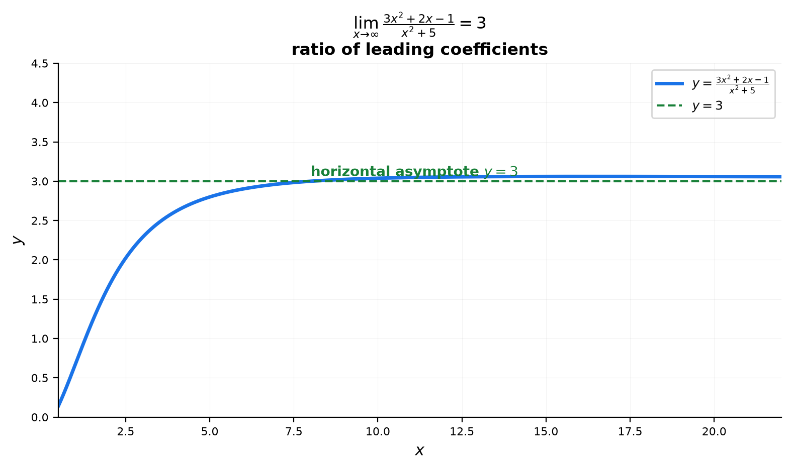
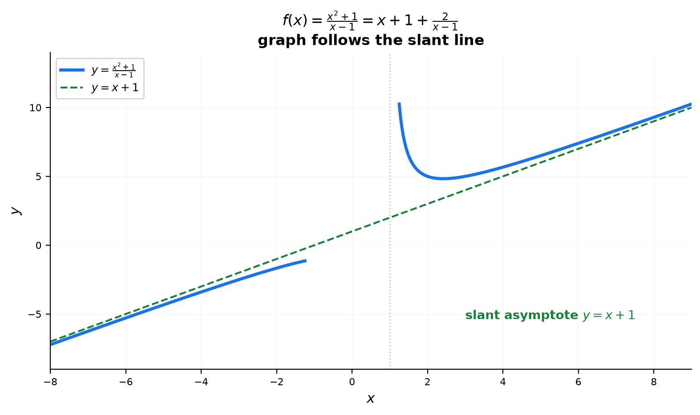
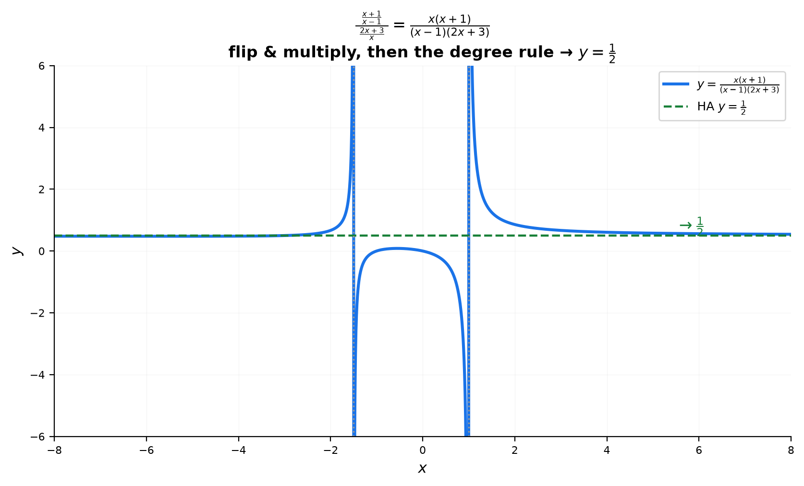

# Session 13B: Limits at Infinity — Growth, Dominance, and the Number $e$

**Phase 2 — Classical Techniques | 75 min**

*Prerequisites: 13A (algebraic limits), 10B (exponential growth rates), 12B (sequences intuition)*

---

## Part A: $\frac{\infty}{\infty}$ — Divide by the Highest Power

---

## Example 1: The Race of Polynomials

When $x\to\infty$, both numerator and denominator blow up. The winner of this race is the term with the **highest degree**. Divide everything by that term and watch the rest vanish.

$\displaystyle \lim_{x\to\infty}\frac{3x^2+2x-1}{x^2+5}$.

① $\frac{\infty}{\infty}$ form. Divide numerator and denominator by $x^2$ (the highest power):
$\displaystyle \frac{3 + \frac{2}{x} - \frac{1}{x^2}}{1 + \frac{5}{x^2}}$.
② As $x\to\infty$: $\frac{2}{x}\to0$, $\frac{1}{x^2}\to0$, $\frac{5}{x^2}\to0$.
③ → $\frac{3+0-0}{1+0} = 3$.

---

**The Rational Function Rule for $x\to\pm\infty$**:

| Degree comparison | Limit |
|:-----------------:|:-----:|
| numerator degree > denominator degree | $\pm\infty$ (sign from leading terms) |
| numerator degree = denominator degree | ratio of leading coefficients |
| numerator degree < denominator degree | $0$ |

$\displaystyle \lim_{x\to\infty}\frac{2x^3-x}{x^2+4}$: deg(num)=3 > deg(den)=2 → $\frac{2x^3}{x^2}=2x \to \infty$.

$\displaystyle \lim_{x\to\infty}\frac{x^2+1}{x^3-2}$: deg(num)=2 < deg(den)=3 → $\frac{x^2}{x^3}=\frac{1}{x} \to 0$.

---

## Part B: $x\to-\infty$ — Watch the Radicals

---

## Example 2: When $x$ Is Negative

$\displaystyle \lim_{x\to-\infty}\frac{3x^2+x}{2x^2-1}$.
Divide by $x^2$ → $\frac{3}{2}$. Same as $x\to\infty$ because $x^2$ dominates and is always positive.

$\displaystyle \lim_{x\to-\infty}\frac{2x^3+1}{x^2+1}$.
Deg(num)=3 > deg(den)=2. Leading terms: $\frac{2x^3}{x^2} = 2x$. As $x\to-\infty$, $2x \to -\infty$.

**Critical trap** — $\sqrt{x^2} = |x|$, not $x$:

$\displaystyle \lim_{x\to-\infty}\frac{\sqrt{4x^2+1}}{x}$.

① $\sqrt{4x^2+1} = \sqrt{x^2(4+1/x^2)} = |x|\sqrt{4+1/x^2}$.
② For $x\to-\infty$, $|x| = -x$.
③ So $\frac{\sqrt{4x^2+1}}{x} = \frac{-x\sqrt{4+1/x^2}}{x} = -\sqrt{4+1/x^2} \to -2$.



*Graph 13D: As x→∞ or x→-∞, the graph of a rational function approaches its horizontal asymptote y = (ratio of leading coefficients). The limit from both sides gives the same value.*

---

## Part C: Denominator → 0 — The $\pm\infty$ Sign Chase

---

## Example 3: Sign Analysis for Vertical Asymptotes

When the denominator → 0 but the numerator does NOT → 0, the limit is $\pm\infty$. The sign depends on which side you approach from.

$\displaystyle \lim_{x\to 2^+}\frac{1}{x-2}$: denominator → $0^+$ (tiny positive). $\frac{1}{0^+} \to +\infty$.
$\displaystyle \lim_{x\to 2^-}\frac{1}{x-2}$: denominator → $0^-$ (tiny negative). $\frac{1}{0^-} \to -\infty$.

Two-sided: the left and right disagree → **limit does not exist**.

---

## Example 4: Squared Denominator — Always $+\infty$

$\displaystyle \lim_{x\to 1}\frac{x+2}{(x-1)^2}$.

Denominator $(x-1)^2 \to 0^+$ from BOTH sides (a square is never negative). Numerator $\to 3$.
$\frac{3}{0^+} \to +\infty$. Both sides agree → **limit = $+\infty$**.

**Rule**: If the denominator is squared (or any even power) and the numerator is positive near the point, both one-sided limits are $+\infty$.

---

## Example 5: Sign Table for Messy Denominators

$\displaystyle \lim_{x\to -1}\frac{x}{(x+1)(x-2)}$.

① $x\to -1^+$: numerator $\to -1$. Denominator: $(0^+)(-3) = 0^-$. → $\frac{-1}{0^-} \to +\infty$.
② $x\to -1^-$: numerator $\to -1$. Denominator: $(0^-)(-3) = 0^+$. → $\frac{-1}{0^+} \to -\infty$.
③ Left $\neq$ right → **limit does not exist**.

---

## Part D: $\infty-\infty$ — Rationalize or Common Denominator

---

## Example 6: The $\infty-\infty$ Race

Both terms go to infinity. Which one is bigger? Merge them into one expression to find out.

$\displaystyle \lim_{x\to\infty}(\sqrt{x^2+x}-x)$.

① $\infty-\infty$ form. **Multiply by the conjugate**:
$\frac{(\sqrt{x^2+x}-x)(\sqrt{x^2+x}+x)}{\sqrt{x^2+x}+x} = \frac{(x^2+x)-x^2}{\sqrt{x^2+x}+x} = \frac{x}{\sqrt{x^2+x}+x}$.
② Divide numerator and denominator by $x$:
$\frac{1}{\sqrt{1+1/x}+1} \to \frac{1}{1+1} = \frac{1}{2}$.

---

$\displaystyle \lim_{x\to\infty}(\sqrt{x^2+3x}-\sqrt{x^2-2x})$.

① Conjugate: $\frac{(x^2+3x)-(x^2-2x)}{\sqrt{x^2+3x}+\sqrt{x^2-2x}} = \frac{5x}{\sqrt{x^2+3x}+\sqrt{x^2-2x}}$.
② Divide by $x$: $\frac{5}{\sqrt{1+3/x}+\sqrt{1-2/x}} \to \frac{5}{1+1} = \frac{5}{2}$.

---

## Part E: Growth Rate Hierarchy — Who Beats Whom

---

## Example 7: The Pecking Order at Infinity

From slowest to fastest as $x\to\infty$:

$$\ln x \;\ll\; x^{0.0001} \;\ll\; x \;\ll\; x^2 \;\ll\; x^{100} \;\ll\; 1.01^x \;\ll\; e^x \;\ll\; x!$$

**Every function to the right eventually overtakes every function to the left.**

$\displaystyle \lim_{x\to\infty}\frac{e^x}{x^{100}} = \infty$. Exponential beats any polynomial, no matter how large the exponent.

$\displaystyle \lim_{x\to\infty}\frac{\ln x}{x^{0.0001}} = 0$. Even the tiniest power of $x$ beats the logarithm.

$\displaystyle \lim_{x\to\infty}\frac{2^x}{x!} = 0$. Factorial beats any exponential base.

$\displaystyle \lim_{x\to\infty}\frac{x^{100}}{1.01^x} = 0$. Even $1.01^x$ — growing at just 1% per step — eventually overtakes $x^{100}$.

---

## Part F: The Number $e$ as a Limit

---

## Example 8: The Classic $e$ Limit and Its Variants

$\displaystyle \lim_{n\to\infty}\left(1+\frac{1}{n}\right)^n = e$.

**Variant 1 — Constant in numerator**: $\displaystyle \lim_{n\to\infty}\left(1+\frac{k}{n}\right)^n = e^k$.

Proof: $\left(1+\frac{k}{n}\right)^n = \left[\left(1+\frac{k}{n}\right)^{n/k}\right]^k \to e^k$.

**Variant 2 — $x\to0$ form**: $\displaystyle \lim_{x\to0}(1+x)^{1/x} = e$.

**Variant 3 — Rational tweak**:
$\displaystyle \lim_{n\to\infty}\left(\frac{n+1}{n}\right)^n = \lim_{n\to\infty}\left(1+\frac{1}{n}\right)^n = e$.

$\displaystyle \lim_{n\to\infty}\left(\frac{n+3}{n-1}\right)^n$:

① $\frac{n+3}{n-1} = 1 + \frac{4}{n-1}$.
② $\left(1+\frac{4}{n-1}\right)^{n} = \left(1+\frac{4}{n-1}\right)^{n-1} \cdot \left(1+\frac{4}{n-1}\right)$.
③ First factor $\to e^4$, second factor $\to 1$. → $e^4$.

---

## Example 9: Additional Standard Limits at a Glance

| Limit | Value | Meaning |
|:------|:-----:|:--------|
| $\displaystyle \lim_{n\to\infty}\frac{\ln n}{n}$ | $0$ | log $\ll$ linear |
| $\displaystyle \lim_{n\to\infty}n^{1/n}$ | $1$ | $n$th root → 1 |
| $\displaystyle \lim_{n\to\infty}\frac{a^n}{n!}$ | $0$ | factorial $\gg$ exponential |
| $\displaystyle \lim_{x\to0^+}x\ln x$ | $0$ | $0$ beats $\ln$ |
| $\displaystyle \lim_{x\to0}\frac{a^x-1}{x}$ | $\ln a$ | derivative of $a^x$ |
| $\displaystyle \lim_{x\to0}\frac{(1+x)^k-1}{x}$ | $k$ | derivative of $(1+x)^k$ |

> **Up to here**: $\frac{\infty}{\infty}$ = divide by highest power, compare degrees. $x\to-\infty$: $\sqrt{x^2}=|x|$.
> Denominator→0: sign analysis. $\infty-\infty$: rationalize or common denominator.
> Growth hierarchy: factorial ≫ exp ≫ polynomial ≫ log. $e$ as a limit: $(1+k/n)^n \to e^k$.

---

## Example 10: Slant Asymptotes — When the Degrees Differ by One

When deg(num) = deg(den) + 1, the rational function has **no horizontal asymptote** — instead it hugs a **slant (oblique) line** $y = mx+b$ found by polynomial division.

**$f(x) = \frac{x^2+1}{x-1}$ as $x\to\pm\infty$.**

① Polynomial division: $\frac{x^2+1}{x-1} = x + 1 + \frac{2}{x-1}$.
② As $x\to\infty$: $\frac{2}{x-1}\to 0$, so $f(x) - (x+1) \to 0$ — the graph approaches the line $y = x+1$.
③ Same for $x\to-\infty$. The slant asymptote is $y = x+1$.

**The limit form** (an $\infty-\infty$ gap, Example 6 style):

$\displaystyle \lim_{x\to\infty}\left[\frac{x^2+1}{x-1} - (x+1)\right] = \lim_{x\to\infty}\frac{2}{x-1} = 0$.



> **Insight**: A slant asymptote is the "$\infty-\infty$" limit applied to the gap $f(x) - (mx+b)$. Divide first, then measure how far the graph is from the line. Degrees differing by exactly 1 → the gap $\to 0$; differing by more → the gap blows up.

---

## Part G: Complex Fractions at Infinity — The Big-Fraction Rules

---

## Example 11: Nested Fractions as $x\to\infty$

The three tricks from 13A (combine & flip, multiply by LCD) work here too — but now they feed into the **degree rule** instead of factor-cancel.

**$\displaystyle \lim_{x\to\infty}\frac{\ \frac{x+1}{x-1}\ }{\ \frac{2x+3}{x}\ }$.**

① Both the numerator and the denominator are themselves fractions. **Flip the bottom and multiply** (Trick 1):
$\frac{x+1}{x-1}\cdot\frac{x}{2x+3}$.

② Now each factor is a plain rational function. Take limits separately with the degree rule:
$\frac{x+1}{x-1} \to \frac{1}{1} = 1$ and $\frac{x}{2x+3} \to \frac{1}{2}$.

③ Product: $1\cdot\frac{1}{2} = \frac{1}{2}$.



*Graph 13G: the big fraction $\frac{\frac{x+1}{x-1}}{\frac{2x+3}{x}} = \frac{x(x+1)}{(x-1)(2x+3)}$ flattens out to the horizontal asymptote $y=\frac{1}{2}$.*

---

**$\displaystyle \lim_{x\to\infty}\frac{\ \frac{3}{x}-\frac{2}{x^2}\ }{2-\frac{5}{x}}$.**

① Watch the inner fractions: the numerator $\frac{3}{x}-\frac{2}{x^2}\to0$, the denominator $2-\frac{5}{x}\to2$.
② → $\frac{0}{2} = 0$. No flipping needed — the little fractions just vanish.

---

**$\displaystyle \lim_{x\to\infty}\frac{\ \frac{2x+1}{x}\ }{\ \frac{x}{x+1}\ }$.**

① Flip and multiply: $\frac{2x+1}{x}\cdot\frac{x+1}{x}$.
② $\frac{2x+1}{x} = 2+\frac{1}{x}\to2$; $\frac{x+1}{x} = 1+\frac{1}{x}\to1$.
③ → $2\cdot1 = 2$.

---

**Real battle — a nested fraction meets the $e$ limit**:

$\displaystyle \lim_{x\to\infty}\left(\frac{x+\frac{1}{x}}{x}\right)^x$.

① Simplify the base FIRST: $\frac{x+1/x}{x} = 1 + \frac{1}{x^2}$.
② $\left(1+\frac{1}{x^2}\right)^x = \left[\left(1+\frac{1}{x^2}\right)^{x^2}\right]^{1/x}$.
③ The bracket $\to e$ (the standard $e$ limit with $n=x^2$), then raised to the power $\frac{1}{x}\to0$: $e^0 = 1$.
→ **1**.

> **Insight**: At infinity, a nested fraction is still a rational function in disguise. Flip-and-multiply turns it into a product of plain rational functions, and the degree rule finishes the job. If a power has a nested-fraction base, simplify the base FIRST — then hunt for the $e$ form $(1+k/n)^n\to e^k$.

---

## Common Mistakes

### Mistake 1: Forgetting $\sqrt{x^2} = |x|$ when $x\to-\infty$

**Wrong**: $\frac{\sqrt{x^2+1}}{x} = \sqrt{1+1/x^2} \to 1$ as $x\to-\infty$. **Right**: $|x| = -x$ for $x<0$, so it's $-\sqrt{1+1/x^2} \to -1$.

### Mistake 2: Saying $0\cdot\infty = 0$

**Wrong**. $0\cdot\infty$ is indeterminate. Convert to a quotient first.

### Mistake 3: Claiming $\frac{1}{0} = \infty$ without checking signs

**Wrong**. It could be $+\infty$, $-\infty$, or neither (if left and right differ).

### Mistake 4: Forgetting to flip the denominator in a big fraction

**Wrong**: $\frac{\ \frac{x+1}{x-1}\ }{\ \frac{2x+3}{x}\ } = \frac{x+1}{x-1}\cdot\frac{2x+3}{x}$ (kept the bottom as-is). **Right**: dividing by a fraction means multiplying by its **reciprocal**: $\frac{x+1}{x-1}\cdot\frac{x}{2x+3}\to\frac{1}{2}$. Flipping the wrong fraction changes the answer (here you would get $2$ instead of $\frac{1}{2}$).

---

## What We Just Did

```
(1) ∞/∞ rational: divide by highest power → degree comparison rule.

(2) x→-∞: √(x²) = |x| = -x (when x<0). Watch odd-degree signs.

(3) Denominator→0: sign analysis from left and right.
    Squared denominator → always +∞ (if numerator > 0).

(4) ∞-∞: conjugate (for √A-√B) or common denominator (for fractions).
    Growth hierarchy: factorial > exp > poly > log.

(5) e as a limit: (1+k/n)^n → e^k. (1+x)^{1/x} → e.
    Standard limits: lnn/n → 0, n^{1/n} → 1.

(6) Complex fractions: flip the bottom & multiply → degree rule on each factor.
    Inner fractions → 0 or → constant; simplify a power's base before hunting e.
```

---

## Decision Tree — Choosing the Weapon at Infinity

```
x → ∞ or x → −∞ (or denominator → 0 at a finite point):
├── (A) x → ±∞:
│   ├── Rational? → degree rule:
│   │   deg(num) > deg(den)     → ±∞ (sign of leading terms)
│   │   deg(num) = deg(den)     → ratio of leading coefficients
│   │   deg(num) = deg(den)+1   → SLANT asymptote (divide)
│   │   deg(num) < deg(den)     → 0
│   ├── Radicals? → factor out x; √(x²) = |x| = −x when x < 0
│   ├── ∞ − ∞? → conjugate (√A−√B) or common denominator
│   ├── 1^∞? → (1 + k/n)^n → e^k
│   └── Mixed growth (e^x, x^n, ln x, n!)? → hierarchy: n! ≫ e^x ≫ x^n ≫ ln x
└── (B) x → finite a, denominator → 0 (numerator ≠ 0):
    └── sign analysis: 0^+ → +∞, 0^− → −∞; left ≠ right → DNE
```

---

## Practice 1

$\displaystyle \lim_{x\to\infty}\frac{\sqrt{4x^2+3x}}{2x-1}$. Factor out $x$ from the radical; watch the $\sqrt{x^2}=|x|$ issue.

→ Reference: **Example 1, 2**

> Solutions: [Solutions](solutions/13B-solutions.md#practice-1)

---

## Practice 2

$\displaystyle \lim_{x\to\infty}\frac{2x^3-5x+1}{3x^3+4x^2}$. Divide by highest power.

→ Reference: **Example 1**

> Solutions: [Solutions](solutions/13B-solutions.md#practice-2)

---

## Practice 3

$\displaystyle \lim_{x\to\infty}(\sqrt{x^2+5x}-\sqrt{x^2-3x})$. $\infty-\infty$ → rationalize.

→ Reference: **Example 6**

> Solutions: [Solutions](solutions/13B-solutions.md#practice-3)

---

## Practice 4

$\displaystyle \lim_{x\to 0}\frac{1}{x^2}$. Is the two-sided limit $+\infty$? Explain.

→ Reference: **Example 4**

> Solutions: [Solutions](solutions/13B-solutions.md#practice-4)

---

## Practice 5

$\displaystyle \lim_{n\to\infty}\left(1+\frac{5}{n}\right)^{2n}$. Rewrite using the $e^k$ rule.

→ Reference: **Example 8**

> Solutions: [Solutions](solutions/13B-solutions.md#practice-5)

---

## Practice 6: Real Battle

$\displaystyle \lim_{x\to\infty}\frac{e^x + x^{100}}{2^x + x!}$. Use the growth hierarchy.

→ Reference: **Example 7**

> Solutions: [Solutions](solutions/13B-solutions.md#practice-6)

---

## Basic Drills

> Pure computation. Identify the form and evaluate.

**D1.** $\displaystyle \lim_{x\to\infty}\frac{5x^2-3}{2x^2+1}$. Divide by $x^2$.

**D2.** $\displaystyle \lim_{x\to\infty}\frac{x+1}{x^3-2}$. Compare degrees.

**D3.** $\displaystyle \lim_{x\to\infty}\frac{2x^3}{x^2+4}$. Leading term dominates.

**D4.** $\displaystyle \lim_{x\to-\infty}\frac{4x^2}{2x^2-5}$. Even powers — same as $+\infty$.

**D5.** $\displaystyle \lim_{x\to 0^+}\frac{1}{x^3}$. Sign of denominator?

**D6.** $\displaystyle \lim_{x\to 0}\frac{1}{x^4}$. Squared (even) denominator.

**D7.** $\displaystyle \lim_{x\to\infty}(\sqrt{x^2+2x}-x)$. Conjugate.

**D8.** $\displaystyle \lim_{n\to\infty}\left(1+\frac{2}{n}\right)^n$. Standard $e$ limit.

**D9.** $\displaystyle \lim_{x\to\infty}\frac{\ln x}{x^{0.5}}$. Growth hierarchy.

**D10.** $\displaystyle \lim_{n\to\infty}n^{1/n}$. Standard limit.

**D11.** $\displaystyle \lim_{x\to\infty}\frac{\ \frac{2x+1}{x}\ }{\ \frac{x}{x+1}\ }$. Flip the bottom, then use the degree rule on each factor. (→ Example 11)

> Solutions: [Solutions](solutions/13B-solutions.md#basic-drill)

---

## Advanced Drills

> Multi-step reasoning required.

**A1.** $\displaystyle \lim_{x\to-\infty}\frac{\sqrt{9x^2+2}}{3x+1}$. Handle $\sqrt{x^2}=|x|$ carefully.

**A2.** $\displaystyle \lim_{x\to\infty}\frac{\sqrt{x^2+1}+\sqrt{x^2-1}}{x}$. Factor $x$ from both radicals.

**A3.** $\displaystyle \lim_{x\to 2}\frac{x^2-3x+2}{x^2-4}$. $\frac{0}{0}$ form — factor and cancel, then evaluate.

**A4.** $\displaystyle \lim_{x\to\infty}\left(\frac{x+2}{x-1}\right)^{3x}$. Write as $(1+\frac{3}{x-1})^{3x}$ → $e$ form.

**A5.** $\displaystyle \lim_{x\to 0^+}\frac{\ln(\sin x)}{\ln x}$. Both → $-\infty$. Use L'Hôpital-like intuition: which dominates?

**A6.** $\displaystyle \lim_{x\to\infty}\frac{3^x + 2^x}{5^x - 4^x}$. Factor out the dominant term.

**A7.** $\displaystyle \lim_{x\to\infty}(\sqrt[3]{x^3+x^2}-x)$. Rationalize using $a^3-b^3$ identity.

**A8.** $\displaystyle \lim_{x\to 1}\frac{\sqrt{x+3}-2}{\sqrt{x}-1}$. Conjugate both numerator and denominator.

**A9.** $\displaystyle \lim_{n\to\infty}\left(\frac{n^2+1}{n^2}\right)^{n^2}$. Rewrite as $(1+\frac{1}{n^2})^{n^2}$.

**A10.** $\displaystyle \lim_{x\to 0}\frac{1-\cos x}{x\sin x}$. Use $\frac{1-\cos x}{x^2}\to\frac{1}{2}$ and $\frac{\sin x}{x}\to1$.

**A11.** $\displaystyle \lim_{x\to\infty}\frac{\ \frac{1}{x+1}-\frac{1}{x}\ }{\ \frac{1}{x^2}\ }$. Combine the difference of reciprocals first, then divide. (→ Example 11)

> Solutions: [Solutions](solutions/13B-solutions.md#advanced-drill)

---

## Today's Procedure

```
Step 1: ∞/∞ → divide by highest power. Compare degrees.
         If equal: ratio of leading coefficients.
         If numerator higher: ±∞ (check sign).
         If denominator higher: 0.

Step 2: x→-∞ → √(x²) = |x| = -x. Watch odd-degree signs.

Step 3: Denominator→0 (numerator ≠ 0) → sign analysis.
         Even-power denominator → always same sign on both sides.

Step 4: Standard limits: (1+k/n)^n → e^k. n^{1/n} → 1. lnn/n → 0.
         Growth hierarchy: factorial ≫ exp ≫ poly ≫ log.
         Slant asymptote: deg(num)=deg(den)+1 → divide, graph follows y=mx+b.
```

---

## How to Read These Symbols

| Symbol | Reads as | Meaning |
|:---:|:---:|------|
| $\lim_{x \to \infty} f(x) = L$ | "limit as x goes to infinity of f of x equals L" | horizontal asymptote at y = L |
| $\lim_{x \to -\infty} f(x) = L$ | "limit as x goes to negative infinity" | end behavior as x → -∞ |
| $\deg(P) < \deg(Q)$ | "degree of P less than degree of Q" | rational function → 0 as x → ±∞ |
| $\deg(P) = \deg(Q)$ | "degrees equal" | limit = ratio of leading coefficients |
| $\deg(P) > \deg(Q)$ | "degree of P greater than degree of Q" | limit = ±∞ — check leading coefficient signs |
| leading coefficient | "leading coefficient" | coefficient of highest-degree term — dominates at infinity |
| $\frac{\ln x}{x} \to 0$ | "ln x over x goes to zero as x goes to infinity" | logarithm grows slower than any positive power |
| $\frac{x}{e^x} \to 0$ | "x over e to the x goes to zero" | exponential dominates any polynomial |
| slant asymptote | "slant asymptote" / "oblique asymptote" | deg(num) = deg(den)+1 — polynomial long division gives line |
| end behavior model | "end behavior model" | leading term dominates — ignore lower-order terms at infinity |

---

## Terminology

| What we call it | Math term | Notation |
|:---------------:|:---------:|:--------:|
| divide by highest power | dominant term method | divide by $x^{\deg}$ |
| degree comparison | degree test for rational functions | deg(num) vs deg(den) |
| sign chase | sign analysis | $0^+$, $0^-$ |
| squared denominator | even-power denominator | $(x-a)^{2k}$ |
| rationalize | rationalization | multiply by conjugate |
| growth hierarchy | asymptotic growth rates | factorial $\gg$ exp $\gg$ poly $\gg$ log |
| $e$ as a limit | Euler's limit definition | $(1+1/n)^n \to e$ |
| indeterminate | indeterminate form | $\frac{\infty}{\infty}$, $\infty-\infty$ |
| slant asymptote | oblique asymptote | $y=mx+b$ via polynomial division |
