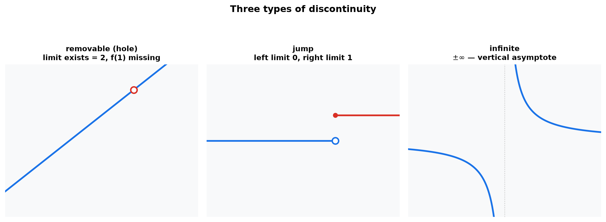
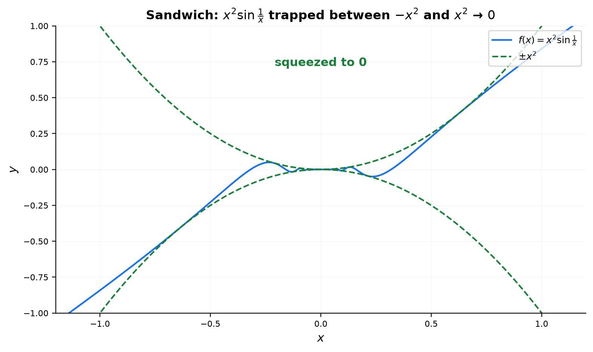
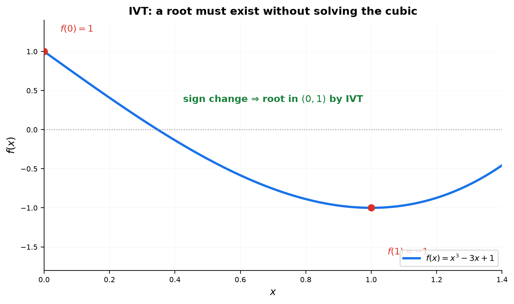
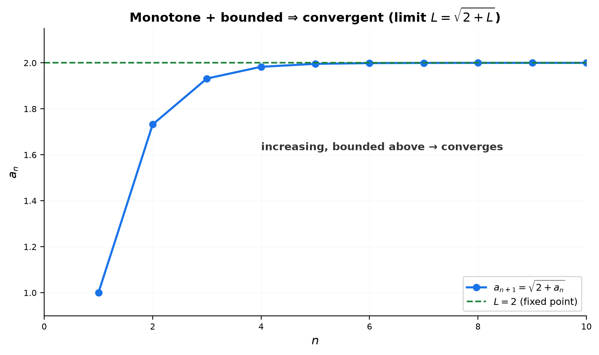

# Session 13C: Continuity, Theorems, and Sequences

**Phase 2 — Classical Techniques | 75 min**

*Prerequisites: 13A (algebraic limits), 13B (limits at infinity), 12B (sequences & series), 08 (inequalities)*

---

## Part A: Continuity — Three Conditions to Check

---

## Example 1: The Definition of Continuity

A function $f$ is **continuous at $x=a$** if all three hold:

1. $f(a)$ is defined (the point exists).
2. $\displaystyle \lim_{x\to a}f(x)$ exists (left limit = right limit).
3. $\displaystyle \lim_{x\to a}f(x) = f(a)$ (the limit equals the function value).

**Intuition**: You can draw the graph without lifting your pencil.

---

## Example 2: Three Types of Discontinuity

**Removable (hole)**: $f(x) = \frac{x^2-1}{x-1}$.

At $x=1$: $f(1)$ is undefined. But $\lim_{x\to1}f(x) = 2$. The hole can be "filled in." The graph has a tiny empty circle at $(1,2)$ — everything else is the line $y=x+1$.

**Jump discontinuity**: $f(x) = \lfloor x\rfloor$.

At $x=1$: $\lim_{x\to1^-}f(x) = 0$, $\lim_{x\to1^+}f(x) = 1$. Left and right disagree — the graph leaps upward.

**Infinite discontinuity**: $f(x) = \frac{1}{x}$.

At $x=0$: $\lim_{x\to0^-} = -\infty$, $\lim_{x\to0^+} = +\infty$. The graph shoots off in opposite directions. Vertical asymptote.



---

## Example 3: Making a Piecewise Function Continuous

$$
f(x) = \begin{cases}
x^2 + a, & x < 2 \\
3x - 1, & x \geq 2
\end{cases}
$$

Find $a$ so $f$ is continuous at $x=2$.

① $\displaystyle \lim_{x\to2^-}f(x) = 4 + a$.
② $\displaystyle \lim_{x\to2^+}f(x) = 6-1 = 5$, and $f(2) = 5$.
③ For continuity: $4+a = 5$ → $a = 1$.

---

## Part B: The Sandwich Theorem — Squeeze from Both Sides

---

## Example 4: Trapping an Oscillating Function

Some functions oscillate so wildly that direct limit calculation is impossible. But if you can **trap the function between two simpler ones** that converge to the same value, the trapped function must converge to that value too.

$\displaystyle \lim_{x\to 0}x^2\sin\frac{1}{x}$.

① $\sin\frac{1}{x}$ oscillates madly between $-1$ and $1$.
② But $-1 \leq \sin\frac{1}{x} \leq 1$. Multiply by $x^2 \geq 0$:
   $-x^2 \leq x^2\sin\frac{1}{x} \leq x^2$.
③ $\lim_{x\to0}(-x^2) = 0$ and $\lim_{x\to0}x^2 = 0$.
④ The function is squeezed to **0**.



---

$\displaystyle \lim_{x\to\infty}\frac{\sin x}{x}$.

① $-1 \leq \sin x \leq 1$ → $-\frac{1}{x} \leq \frac{\sin x}{x} \leq \frac{1}{x}$.
② Both bounds → $0$ as $x\to\infty$.
③ → **0**.

---

## Part C: The Intermediate Value Theorem — Roots Must Exist

---

## Example 5: Proving a Root Exists Without Solving

**IVT**: If $f$ is continuous on $[a,b]$ and $N$ lies between $f(a)$ and $f(b)$, then there exists $c \in [a,b]$ such that $f(c) = N$.

Most common use: prove $f(x)=0$ has a root.

**Show $x^3 - 3x + 1 = 0$ has a root in $[0,1]$.**

① $f(0) = 1$ (positive). $f(1) = -1$ (negative).
② $f$ is continuous everywhere (polynomial).
③ By IVT, there exists $c \in (0,1)$ with $f(c)=0$.
④ We proved a root exists — without solving the cubic.

---

**Show $e^x = 4-x$ has a solution.**

① Define $f(x) = e^x - (4-x) = e^x + x - 4$.
② $f(1) = e + 1 - 4 \approx -0.28$ (negative). $f(2) = e^2 + 2 - 4 \approx 5.39$ (positive).
③ Continuous → root in $(1,2)$. ✅



---

## Part D: Limits of Sequences — Convergence

---

## Example 6: From Function Limits to Sequence Limits

A sequence $a_n$ is just a function whose domain is the positive integers. All the limit rules from 13A and 13B apply: if $f(x) \to L$ as $x\to\infty$, then $f(n) \to L$ as $n\to\infty$.

$\displaystyle \lim_{n\to\infty}\frac{n}{n+1} = 1$ (divide by $n$: $\frac{1}{1+1/n} \to 1$).

$\displaystyle \lim_{n\to\infty}\frac{\sin n}{n} = 0$ (sandwich: $-\frac{1}{n} \leq \frac{\sin n}{n} \leq \frac{1}{n}$).

$\displaystyle \lim_{n\to\infty}\left(1+\frac{1}{n}\right)^n = e$.

---

## Example 7: Monotone Bounded → Convergent

A sequence that never decreases and stays below some ceiling **must converge** (even if we don't know the limit exactly).

**$a_1 = 1$, $a_{n+1} = \sqrt{2+a_n}$.** Show it converges and find the limit.

① First few terms: $a_1=1$, $a_2=\sqrt{3}\approx1.732$, $a_3=\sqrt{2+\sqrt{3}}\approx1.932$, $a_4\approx1.983$.
② The sequence is increasing and bounded above by 2. → Converges.
   *Why bounded*: if $a_n < 2$, then $a_{n+1} = \sqrt{2+a_n} < \sqrt{4} = 2$.
   *Why increasing*: $a_{n+1} \geq a_n$ iff $2+a_n \geq a_n^2$ iff $(a_n-2)(a_n+1) \leq 0$ — true since $1 \leq a_n \leq 2$.
③ If limit $L$ exists: $L = \sqrt{2+L}$ → $L^2 = 2+L$ → $L^2-L-2=0$ → $L=2$ (positive root).
→ **Limit = 2.**



---

## Example 8: Recursive Sequences — The Fixed-Point Method

For $a_{n+1} = f(a_n)$ with continuous $f$, if the sequence converges to $L$, then $L = f(L)$.

**$a_1 = 0.5$, $a_{n+1} = \cos(a_n)$.** (Iterating cosine — this converges to the Dottie number.)

The limit satisfies $L = \cos L$ (no closed form, but $L \approx 0.7391$).

---

## Part E: The Ultimate Limit Decision Tree

```
You encounter a limit:
│
├── ① Try direct substitution
│   └── Number → DONE
│       Undefined form → go to ②
│
├── ② Identify the indeterminate form:
│   ├── 0/0 → factor-cancel / conjugate / sinx/x / (e^x-1)/x / ln(1+x)/x
│   ├── ∞/∞ → divide by highest power / growth hierarchy
│   ├── ∞-∞ → rationalize or common denominator
│   ├── 0·∞ → rewrite as quotient → becomes 0/0 or ∞/∞
│   └── Denominator→0 (numerator≠0) → sign analysis → ±∞ or DNE
│
├── ③ Special cases:
│   ├── Piecewise → check left limit and right limit separately
│   ├── Absolute value → split into two cases
│   ├── Oscillating (sin(1/x)) → sandwich theorem
│   └── Sequence → same rules as functions at infinity
│
└── ④ Still stuck?
    └── Graph it. Numerical table. L'Hôpital (Phase 3 preview).
```

---

## Example 9: Decision Tree — Classify Before Solving

| Problem | Form | Weapon | Answer |
|:--------|:----:|:-------|:------:|
| $\lim_{x\to3}\frac{x^2-9}{x-3}$ | $\frac{0}{0}$ | Factor-cancel | $6$ |
| $\lim_{x\to0}\frac{\sin7x}{x}$ | $\frac{0}{0}$ | $\frac{\sin\square}{\square}\to1$ | $7$ |
| $\lim_{x\to\infty}\frac{5x^3}{2x^3}$ | $\frac{\infty}{\infty}$ | Degree comparison | $\frac{5}{2}$ |
| $\lim_{x\to\infty}(\sqrt{x^2+x}-x)$ | $\infty-\infty$ | Conjugate | $\frac{1}{2}$ |
| $\lim_{x\to0}\frac{1}{x^2}$ | Denom→0 | Squared denom | $+\infty$ |
| $\lim_{x\to0}\frac{\vert x\vert}{x}$ | Abs value | Left/right | DNE |
| $\lim_{n\to\infty}(1+\frac{3}{n})^n$ | $1^\infty$ | $e^k$ rule | $e^3$ |
| $\lim_{x\to0^+}x\ln x$ | $0\cdot\infty$ | Convert to quotient | $0$ |

> **Up to here**: Continuity = 3 conditions. Discontinuity types: hole, jump, infinite.
> Sandwich = trap between two functions. IVT = continuous functions hit every intermediate value.
> Sequences: monotone+bounded → convergent. Recursive: solve $L=f(L)$.

---

## Common Mistakes

### Mistake 1: Confusing limit existence with function value

**Wrong**: "The limit is 2, so $f(2)=2$." **Right**: The limit at $x=a$ and the function value $f(a)$ are independent concepts. Continuity is what connects them.

### Mistake 2: Applying IVT to discontinuous functions

**Wrong**: "$f(x)=1/x$ changes sign on $[-1,1]$, so it has a root." **Right**: $f$ must be continuous on the closed interval. $1/x$ is not continuous on $[-1,1]$.

### Mistake 3: Assuming "increasing + bounded above" guarantees convergence to the bound

**Wrong**: The limit could be less than the bound. **Right**: Monotone bounded guarantees convergence to *some* $L \leq$ the bound, not necessarily the bound itself.

---

## What We Just Did

```
(1) Continuity = f(a) defined + limit exists + limit equals f(a).
    Three discontinuity types: hole (removable), jump, infinite.

(2) Sandwich theorem: trap an untouchable function between two nice ones.
    IVT: continuous f on [a,b] hits every value between f(a) and f(b).

(3) Sequences: limits work the same as functions at infinity.
    Monotone + bounded → convergent.
    Recursive a_{n+1}=f(a_n): limit L satisfies L=f(L).

(4) Decision tree: classify the form → pick the weapon → execute.
```

---

## Practice 1

Is $f(x) = \frac{x^2-4}{x-2}$ continuous at $x=2$? If not, classify the discontinuity and state the limit.

→ Reference: **Example 2**

> Solutions: [Solutions](solutions/13C-solutions.md#practice-1)

---

## Practice 2

Find $k$ so that $f(x) = \begin{cases} 2x+k, & x<1 \\ x^2, & x\geq1 \end{cases}$ is continuous everywhere.

→ Reference: **Example 3**

> Solutions: [Solutions](solutions/13C-solutions.md#practice-2)

---

## Practice 3

Use the Sandwich Theorem: $\displaystyle \lim_{x\to 0}x^3\cos\frac{1}{x^2}$.

→ Reference: **Example 4**

> Solutions: [Solutions](solutions/13C-solutions.md#practice-3)

---

## Practice 4

Use IVT to prove $x^5 - 2x^3 + x - 1 = 0$ has a root in $[0,2]$.

→ Reference: **Example 5**

> Solutions: [Solutions](solutions/13C-solutions.md#practice-4)

---

## Practice 5

A sequence is defined by $a_1=3$, $a_{n+1} = \frac{a_n + 4}{2}$. Show it converges and find the limit.

→ Reference: **Example 7**

> Solutions: [Solutions](solutions/13C-solutions.md#practice-5)

---

## Practice 6: Real Battle

$f(x) = \begin{cases} \frac{\sin x}{x}, & x<0 \\ 1, & x=0 \\ \frac{e^x-1}{x}, & x>0 \end{cases}$. Determine if $f$ is continuous at $x=0$. Use standard limits.

→ Reference: **Example 1, 13A Example 4,5**

> Solutions: [Solutions](solutions/13C-solutions.md#practice-6)

---

## Basic Drills

> Computation and classification.

**D1.** Identify the type of discontinuity of $f(x)=\frac{1}{x-3}$ at $x=3$.

**D2.** Identify the type of discontinuity of $f(x)=\frac{x^2-1}{x-1}$ at $x=1$.

**D3.** Identify the type of discontinuity of $f(x)=\lfloor x\rfloor$ at $x=2$.

**D4.** Find $a$ so $f(x)=\begin{cases}x^2-a,&x<0\\2x,&x\geq0\end{cases}$ is continuous at $x=0$.

**D5.** Determine if IVT guarantees a root of $f(x)=x^3-x-2$ on $[1,2]$. Evaluate $f(1)$ and $f(2)$.

**D6.** Use Sandwich: $\displaystyle \lim_{x\to\infty}\frac{\cos x}{x^2}$.

**D7.** Does $\displaystyle \lim_{n\to\infty}\frac{(-1)^n}{n}$ exist? If so, what is it?

**D8.** Find $\displaystyle \lim_{n\to\infty}\frac{2^n}{3^n}$. Rewrite as $(2/3)^n$.

**D9.** Is $f(x)=|x|$ continuous at $x=0$? Check the three conditions.

**D10.** If $a_{n+1} = \frac{1}{2}a_n$ with $a_1=8$, find $\lim_{n\to\infty}a_n$.

> Solutions: [Solutions](solutions/13C-solutions.md#basic-drill)

---

## Advanced Drills

> Multi-step reasoning and proof techniques.

**A1.** Prove that $f(x)=x^3+x-1$ has exactly one real root. Use IVT for existence and monotonicity for uniqueness.

**A2.** $f(x)=\frac{x^2-3x+2}{x^2+x-6}$. Find all discontinuities and classify each. Factor both numerator and denominator.

**A3.** Find all $a,b$ such that $f(x)=\begin{cases}ax+b,&x<1\\x^2,&1\leq x\leq2\\\frac{1}{x-2},&x>2\end{cases}$ is continuous at both $x=1$ and $x=2$. (Will need different constants for each boundary.)

**A4.** Use Sandwich: $\displaystyle \lim_{x\to0}x\sin\frac{1}{x}$. (This is the classic example.)

**A5.** A sequence satisfies $a_1=1$, $a_{n+1}=\frac{1}{2}(a_n+\frac{2}{a_n})$. This is Newton's method for $\sqrt{2}$. Show the limit $L$ satisfies $L=\frac{1}{2}(L+\frac{2}{L})$ and find $L$.

**A6.** Prove $\displaystyle \lim_{x\to0}x^2\sin\frac{1}{x}=0$ using $\epsilon$-$\delta$ intuition. Given $\epsilon>0$, choose $\delta=\sqrt{\epsilon}$ and show $|x|<\delta \implies |x^2\sin(1/x)|<\epsilon$.

**A7.** $f$ is continuous on $[0,1]$ with $f(0)=1$ and $f(1)=0$. Prove there exists $c\in(0,1)$ such that $f(c)=c$. (Hint: consider $g(x)=f(x)-x$ and apply IVT.)

**A8.** Does the sequence $a_n = \sin n$ converge? Explain using the fact that $\sin$ oscillates.

**A9.** Find $\displaystyle \lim_{n\to\infty}\left(\sqrt{n^2+n}-n\right)$. This is an $\infty-\infty$ sequence limit.

**A10.** A function satisfies $|f(x)-f(y)| \leq |x-y|^2$ for all $x,y$. Prove $f$ is constant. (Hint: show the derivative is 0 everywhere by using the limit definition.)

> Solutions: [Solutions](solutions/13C-solutions.md#advanced-drill)

---

## Today's Procedure

```
Step 1: Continuity check — is f(a) defined? Does the limit exist? Are they equal?
         If not, classify: removable (hole), jump, or infinite.

Step 2: IVT — if f is continuous and changes sign, a root exists.
         Sandwich — bound an ugly function between two nice ones.

Step 3: Sequences — treat n→∞ like x→∞.
         Recursive: if limit L exists, L = f(L). Solve.
         Monotone + bounded = guaranteed convergence.
```

---

## How to Read These Symbols

| Symbol | Reads as | Meaning |
|:---:|:---:|------|
| continuous at $x=a$ | "continuous at x equals a" | limit = f(a) — no break, jump, or hole |
| $\lim_{x\to a} f(x) = f(a)$ | "limit as x goes to a of f of x equals f of a" | continuity definition — three conditions in one |
| IVT | "I V T" / "Intermediate Value Theorem" | continuous function on [a,b] hits every value between f(a) and f(b) |
| EVT | "E V T" / "Extreme Value Theorem" | continuous function on closed [a,b] attains absolute max and min (Session 21) |
| $[a,b]$ | "closed interval a b" | includes endpoints — required for EVT |
| $(a,b)$ | "open interval a b" | excludes endpoints — EVT does NOT apply here |
| jump discontinuity | "jump discontinuity" | left and right limits exist but are different |
| removable discontinuity | "removable discontinuity" | limit exists — could be "fixed" by redefining f(a) |
| infinite discontinuity | "infinite discontinuity" / "vertical asymptote" | function → ±∞ at the point |
| oscillating discontinuity | "oscillating discontinuity" | sin(1/x) near 0 — no limit, infinite oscillation |
| $C^0$, $C^1$, $C^2$ | "C zero, C one, C two" | C^0=continuous, C^1=continuously differentiable, C^2=second derivative continuous |

---

## Terminology

| What we call it | Math term | Notation |
|:---------------:|:---------:|:--------:|
| continuous | continuous function | $\lim_{x\to a}f(x)=f(a)$ |
| hole | removable discontinuity | limit exists, $f(a)$ missing or wrong |
| jump | jump discontinuity | left limit $\neq$ right limit |
| infinite discontinuity | infinite discontinuity | limit is $\pm\infty$ |
| sandwich/squeeze | squeeze theorem | $g(x)\leq f(x)\leq h(x)$ |
| IVT | Intermediate Value Theorem | continuous $f$ hits all values between |
| monotone | monotonic sequence | always increasing or always decreasing |
| bounded | bounded sequence | $m \leq a_n \leq M$ for all $n$ |
| recursive | recursively defined sequence | $a_{n+1}=f(a_n)$ |
| fixed point | fixed point equation | $L=f(L)$ |
