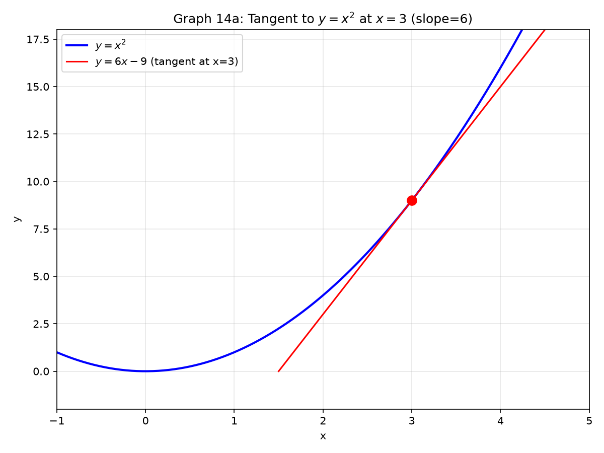
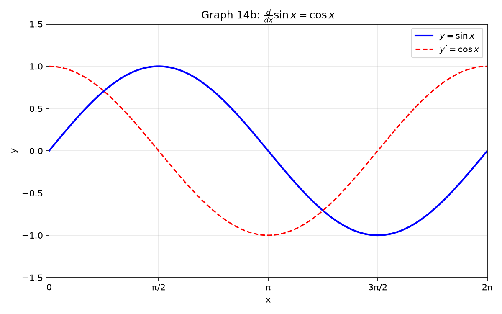

# Session 14A: Derivative Fundamentals — The Basic Toolbox

**Phase 2 — Classical Techniques | 70 min**

*A derivative is instantaneous slope — how fast $y$ changes when $x$ twitches. You find it with a limit, but you compute it with rules. Memorize eight forms. Apply them in three steps: split, pull constants, match the dictionary.*

**Prerequisites**: 13A (algebraic limits), 10A (exponents & logs), 11A (trig foundations)

---

## Part A: What Is a Derivative — The Limit Definition

---

## Example 1: The Limit Definition — Three Steps

$f'(x) = \displaystyle \lim_{h\to 0}\frac{f(x+h)-f(x)}{h}$.

**Procedure for computing $f'(a)$ from the definition**:

| Step | Action |
|:---:|:---|
| 1 | Write the difference quotient: $\frac{f(a+h)-f(a)}{h}$ |
| 2 | Simplify algebraically — expand, cancel, factor out $h$ from numerator |
| 3 | Take the limit as $h \to 0$ — plug $h=0$ into the simplified expression |

$f(x)=x^2$ at $x=3$:
1. $\frac{(3+h)^2 - 3^2}{h} = \frac{9+6h+h^2-9}{h} = \frac{6h+h^2}{h}$.
2. Factor out $h$: $\frac{h(6+h)}{h} = 6+h$ (for $h \neq 0$).
3. $\lim_{h\to 0}(6+h) = 6$. So $f'(3)=6$.

$f'(a)$ = slope of the tangent line at $x=a$.



---

## Part B: The Derivative Dictionary — Eight Forms to Memorize

> **How to use this section**: When you see any of these forms, apply the rule immediately. No thinking — just pattern-match.

---

## Example 2: The Power Rule — $\frac{d}{dx}x^n = nx^{n-1}$

**Procedure**: Bring the exponent down as a coefficient. Subtract 1 from the exponent.

| $f(x)$ | $f'(x)$ | Pattern |
|:---|:---|:---|
| $x^5$ | $5x^4$ | Exponent $5 \to$ coefficient, new exponent $4$ |
| $x^{100}$ | $100x^{99}$ | Same rule — no exceptions for large powers |
| $\sqrt{x} = x^{1/2}$ | $\frac{1}{2}x^{-1/2} = \frac{1}{2\sqrt{x}}$ | Fractional exponents work identically |
| $\frac{1}{x^3} = x^{-3}$ | $-3x^{-4} = -\frac{3}{x^4}$ | Negative exponents work identically |
| $x$ | $1\cdot x^0 = 1$ | $x^1 \to 1\cdot x^0 = 1$ |
| $7$ (constant) | $0$ | $7 = 7x^0$, derivative = $0\cdot 7x^{-1} = 0$ |

**The constant rule**: $\frac{d}{dx}c = 0$. A flat line has zero slope everywhere.

**The constant multiple rule**: $\frac{d}{dx}(c\cdot f(x)) = c\cdot f'(x)$. The constant rides along.

---

## Example 3: The Complete Derivative Dictionary

| $f(x)$ | $f'(x)$ | Memory hook |
|:---|:---|:---|
| $x^n$ | $nx^{n-1}$ | Exponent down, subtract 1 |
| $e^x$ | $e^x$ | The only function that is its own derivative |
| $a^x$ | $a^x\ln a$ | Multiply by $\ln$ of the base |
| $\ln x$ | $\frac{1}{x}$ | Reciprocal of $x$ (for $x>0$) |
| $\log_a x$ | $\frac{1}{x\ln a}$ | $\frac{1}{x}$ divided by $\ln$ of base |
| $\sin x$ | $\cos x$ | $\sin \to \cos$ (no sign change) |
| $\cos x$ | $-\sin x$ | $\cos \to -\sin$ (sign FLIPS) |
| $\tan x$ | $\sec^2 x$ | Also equals $1/\cos^2 x$ |

**Three-step procedure for any derivative**:
1. **Split** at every $+$ or $-$: $(f \pm g)' = f' \pm g'$.
2. **Pull** constants outside: $(cf)' = c \cdot f'$.
3. **Match** each piece to the dictionary above.

---

## Example 4: Applying the Three-Step Procedure

$\frac{d}{dx}(3x^4 - 2x^2 + 5x - 7)$.

| Step | Action | Result |
|:---:|:---|:---|
| 1 | Split | $3x^4$ derivative + $(-2x^2)$ derivative + $(5x)$ derivative + $(-7)$ derivative |
| 2 | Pull constants | $3\cdot\frac{d}{dx}x^4 - 2\cdot\frac{d}{dx}x^2 + 5\cdot\frac{d}{dx}x - 7\cdot\frac{d}{dx}1$ |
| 3 | Dictionary | $3(4x^3) - 2(2x) + 5(1) - 7(0) = 12x^3 - 4x + 5$ |

$\frac{d}{dx}(2\sin x + e^x - \ln x)$:
1. Split into three terms.
2. No constants to pull (coefficients stay).
3. Dictionary: $2\cos x + e^x - \frac{1}{x}$.

---

## Example 5: Exponentials and Logarithms — All Variants

| Form | Derivative | Note |
|:---|:---|:---|
| $e^x$ | $e^x$ | Unchanged. The identity function of differentiation. |
| $e^{kx}$ | $ke^{kx}$ | Preview of chain rule (14B). For now, treat as a pattern. |
| $a^x$ | $a^x\ln a$ | $\ln a$ is just a constant multiplier. |
| $\ln x$ | $1/x$ | Domain: $x>0$. |
| $\ln(kx)$ | $1/x$ | $\ln(kx) = \ln k + \ln x$, derivative of constant is 0. |

$\frac{d}{dx}2^x = 2^x\ln 2$. $\frac{d}{dx}\log_3 x = \frac{1}{x\ln 3}$.

---

## Example 6: Trigonometric Derivatives — The Cyclic Pattern

| $f(x)$ | $f'(x)$ | $f''(x)$ | $f'''(x)$ | $f^{(4)}(x)$ |
|:---|:---|:---|:---|:---|
| $\sin x$ | $\cos x$ | $-\sin x$ | $-\cos x$ | $\sin x$ (back!) |
| $\cos x$ | $-\sin x$ | $-\cos x$ | $\sin x$ | $\cos x$ (back!) |

**The cycle**: $\sin \to \cos \to -\sin \to -\cos \to \sin$. Four derivatives return you to the start.



---

## Part C: The Tangent Line — From Derivative to Geometry

---

## Example 7: Writing the Tangent Line Equation — Three Steps

**Procedure**: Given $f(x)$ and a point $x=a$:

| Step | Action |
|:---:|:---|
| 1 | Compute $y_0 = f(a)$ — the point of tangency is $(a, f(a))$ |
| 2 | Compute $m = f'(a)$ — the slope at that point |
| 3 | Write $y - y_0 = m(x - a)$ — point-slope form |

$f(x)=x^2+\ln x$ at $x=1$:
1. $y_0 = f(1) = 1^2 + \ln 1 = 1 + 0 = 1$. Point: $(1,1)$.
2. $f'(x) = 2x + \frac{1}{x}$. $m = f'(1) = 2 + 1 = 3$.
3. $y - 1 = 3(x - 1)$ → $y = 3x - 2$.

---

## Example 8: Finding Horizontal Tangents

**Procedure**: Set $f'(x)=0$ and solve for $x$.

$f(x)=x^3-3x^2-9x+5$. $f'(x)=3x^2-6x-9 = 3(x^2-2x-3) = 3(x-3)(x+1)$.
$f'(x)=0$ at $x=3$ and $x=-1$. These are the $x$-coordinates where the tangent is horizontal.

> **Up to here**: Derivative = limit of difference quotient. Dictionary of 8 forms. Three-step procedure: split → pull constants → match dictionary. Tangent line: find point, find slope, write equation.

---

## Common Mistakes

### Mistake 1: Using the power rule on exponentials

**Wrong**: $\frac{d}{dx}e^x = xe^{x-1}$. **Right**: $\frac{d}{dx}e^x = e^x$. The power rule is ONLY for $x^n$ (variable base, constant exponent). $e^x$ has constant base, variable exponent — completely different.

### Mistake 2: Forgetting the negative sign for $\cos x$

**Wrong**: $\frac{d}{dx}\cos x = \sin x$. **Right**: $\frac{d}{dx}\cos x = -\sin x$. Differentiate twice and you'll see why — $\sin \to \cos \to -\sin \to -\cos \to \sin$.

### Mistake 3: $\frac{d}{dx}\ln x = x\ln x$ or $\ln x$

**Wrong**: Confusing derivative with antiderivative. **Right**: $\frac{d}{dx}\ln x = \frac{1}{x}$. The derivative of $\ln x$ is simple; the integral of $\ln x$ is $x\ln x - x + C$ (Session 16B).

### Mistake 4: Forgetting to set $f'(x)=0$ for horizontal tangents

**Wrong**: "The minimum of $x^2$ is at $x=0$ because I can see it on the graph." **Right**: Set $f'(x)=2x=0 \to x=0$. The derivative locates extrema precisely, without guessing from a graph.

---

## What We Just Did

```
(1) Limit definition: f'(a) = lim_{h→0} [f(a+h)−f(a)]/h.
    Expand, cancel h, plug h=0.

(2) Derivative dictionary (8 forms): xⁿ→nxⁿ⁻¹, eˣ→eˣ, ln x→1/x,
    sin x→cos x, cos x→−sin x, tan x→sec²x.

(3) Three-step procedure for any derivative:
    Split at +/− → Pull constants out → Match each piece to the dictionary.

(4) Tangent line: point (a,f(a)), slope f'(a), equation y−f(a)=f'(a)(x−a).
```

---

## Practice 1

Use the limit definition to find $f'(2)$ for $f(x)=x^2+3x$.

→ Reference: **Example 1**

> Solutions: [Solutions](solutions/14A-solutions.md#practice-1)

---

## Practice 2

Differentiate $f(x)=4x^5 - 3x^3 + 2x - 1 + \frac{1}{x}$. Use the 3-step procedure: split, pull constants, match dictionary.

→ Reference: **Example 2, 4**

> Solutions: [Solutions](solutions/14A-solutions.md#practice-2)

---

## Practice 3

Differentiate $g(x)=3e^x - 2\ln x + 5\sin x - \cos x$.

→ Reference: **Example 3, 4, 6**

> Solutions: [Solutions](solutions/14A-solutions.md#practice-3)

---

## Practice 4

Differentiate $h(x)=2^x + \log_3 x + \tan x$.

→ Reference: **Example 5, 6**

> Solutions: [Solutions](solutions/14A-solutions.md#practice-4)

---

## Practice 5

Find all $x$ where the tangent line to $f(x)=x^3-3x^2-9x+5$ is horizontal.

→ Reference: **Example 8**

> Solutions: [Solutions](solutions/14A-solutions.md#practice-5)

---

## Practice 6: Real Battle

Find the tangent line to $f(x)=x^2+\ln x$ at $x=1$. Write your answer in $y=mx+b$ form.

→ Reference: **Example 7**

> Solutions: [Solutions](solutions/14A-solutions.md#practice-6)

---

## Basic Drills

> Run the 3-step procedure: split, pull constants, match dictionary.

**D1.** $\frac{d}{dx}(7x^4)$. Power rule: exponent down, subtract 1.

**D2.** $\frac{d}{dx}(-3x^{10})$. Negative coefficient rides along.

**D3.** $\frac{d}{dx}(\sqrt[3]{x})$. Write as $x^{1/3}$ first.

**D4.** $\frac{d}{dx}(5e^x)$. Constant multiple: 5 stays, $e^x \to e^x$.

**D5.** $\frac{d}{dx}(4\ln x)$. Constant multiple: 4 stays, $\ln x \to 1/x$.

**D6.** $\frac{d}{dx}(3\sin x - 2\cos x)$. Split, constant multiple, dictionary.

**D7.** $\frac{d}{dx}(\tan x + \sec x)$. Dictionary: $\tan x \to \sec^2 x$, $\sec x \to \sec x\tan x$.

**D8.** $\frac{d}{dx}(2^x + \log_5 x)$. General forms: $a^x \to a^x\ln a$, $\log_a x \to 1/(x\ln a)$.

**D9.** $\frac{d}{dx}\left(\frac{1}{x^4}\right)$. Rewrite as $x^{-4}$, apply power rule.

**D10.** Find $f'(0)$ for $f(x)=x^3-2x^2+5x-1$. Differentiate, then plug $x=0$.

> Solutions: [Solutions](solutions/14A-solutions.md#basic-drill)

---

## Advanced Drills

> Prove, connect, and extend the basic rules.

**A1.** Use the limit definition to prove $\frac{d}{dx}x^2 = 2x$. Show all three steps.

**A2.** Find $a$ and $b$ so $f(x)=ax^2+bx$ has $f'(1)=5$ and $f'(2)=9$. Set up equations, solve.

**A3.** Differentiate $f(x)=\frac{x^3}{\sqrt{x}}$. Simplify to $x^{5/2}$ first, then apply power rule.

**A4.** Find the point on $y=x^2$ where the tangent line has slope 6. Set $2x=6$.

**A5.** Use the limit definition to find $f'(x)$ for $f(x)=\frac{1}{x}$. (Common denominator trick.)

**A6.** Find all $x$ where $f(x)=x^3-6x^2+9x$ has horizontal tangent lines. Factor $f'(x)$.

**A7.** Prove $\frac{d}{dx}\tan x = \sec^2 x$ using $\tan x = \frac{\sin x}{\cos x}$ and the quotient rule.

**A8.** Differentiate $f(x)=\ln(x^2)$ two ways: (a) $\ln(x^2)=2\ln x \to 2/x$. (b) Chain rule. Compare.

**A9.** A function satisfies $f'(x)=f(x)$ for all $x$ and $f(0)=3$. What is $f(x)$? (Which function equals its own derivative?)

**A10.** Find the tangent line to $y=e^x$ that passes through the origin $(0,0)$. The line has slope $e^a$, passes through $(a,e^a)$ and $(0,0)$. Solve for $a$.

> Solutions: [Solutions](solutions/14A-solutions.md#advanced-drill)

---

## Today's Procedure

| When you see... | Do this... |
|:---|:---|
| $x^n$ (any $n \neq 0$) | Power rule: $nx^{n-1}$ |
| $e^x$ | Unchanged: $e^x$ |
| $a^x$ | Multiply by $\ln a$: $a^x\ln a$ |
| $\ln x$ | Reciprocal: $1/x$ |
| $\sin x$, $\cos x$, $\tan x$ | Dictionary: $\cos x$, $-\sin x$, $\sec^2 x$ |
| Sum/difference of functions | Split at $+/-$, differentiate each |
| Constant times a function | Pull the constant out |
| Need slope at $x=a$ | Compute $f'(a)$ |
| Need tangent line at $x=a$ | Point $(a,f(a))$, slope $f'(a)$, equation $y-f(a)=f'(a)(x-a)$ |
| Need horizontal tangents | Set $f'(x)=0$, solve for $x$ |

---

## How to Read These Symbols

| Symbol | Reads as | Meaning |
|:---:|:---:|------|
| $f'(x)$ | "f prime of x" | derivative of f — instantaneous rate of change, slope of tangent |
| $\frac{dy}{dx}$ | "d y d x" / "derivative of y with respect to x" | Leibniz notation for derivative |
| $\frac{d}{dx}$ | "d d x" / "derivative operator" | take the derivative with respect to x |
| $f'(a) = \lim_{h\to0}\frac{f(a+h)-f(a)}{h}$ | "f prime of a equals limit as h goes to zero of f of a plus h minus f of a over h" | limit definition of the derivative |
| $\frac{d}{dx}x^n = nx^{n-1}$ | "derivative of x to the n equals n x to the n minus 1" | power rule |
| $\frac{d}{dx}e^x = e^x$ | "derivative of e to the x equals e to the x" | e^x is its own derivative |
| $\frac{d}{dx}\sin x = \cos x$ | "derivative of sine x equals cosine x" | sine derivative |
| $\frac{d}{dx}\cos x = -\sin x$ | "derivative of cosine x equals negative sine x" | cosine derivative — note the minus sign |
| $(f+g)' = f' + g'$ | "f plus g prime equals f prime plus g prime" | sum rule — derivative of sum = sum of derivatives |
| $(fg)' = f'g + fg'$ | "f g prime equals f prime g plus f g prime" | product rule — NOT f'g'! |
| $(f/g)' = \frac{f'g - fg'}{g^2}$ | "f over g prime equals f prime g minus f g prime over g squared" | quotient rule |
| tangent line: $y - f(a) = f'(a)(x-a)$ | "tangent line at a" | line that just touches the curve at exactly one point |

---

## Terminology

| What we call it | Math term | Notation |
|:---:|:---:|:---:|
| instantaneous slope | derivative | $f'(x)$, $\frac{dy}{dx}$ |
| limit of difference quotient | derivative definition | $\lim_{h\to0}\frac{f(x+h)-f(x)}{h}$ |
| exponent down, subtract 1 | power rule | $\frac{d}{dx}x^n = nx^{n-1}$ |
| its own derivative | exponential invariance | $\frac{d}{dx}e^x = e^x$ |
| touch at one point | tangent line | $y-f(a)=f'(a)(x-a)$ |
| slope equals zero | horizontal tangent | $f'(x)=0$ |
