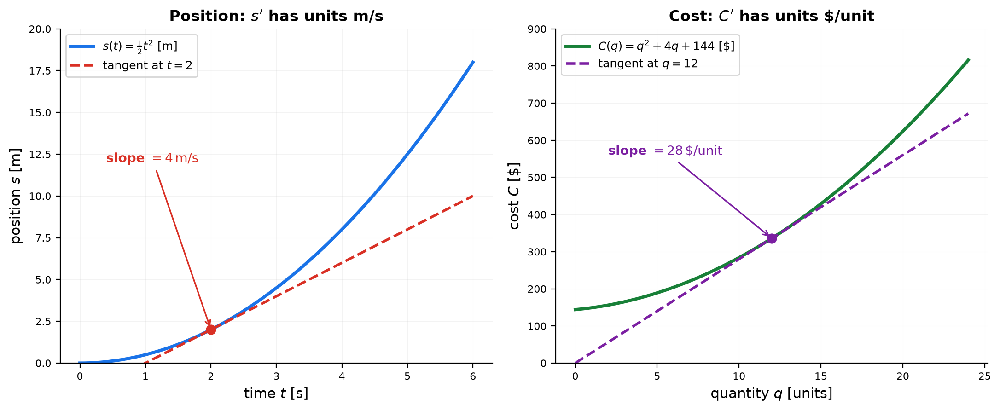
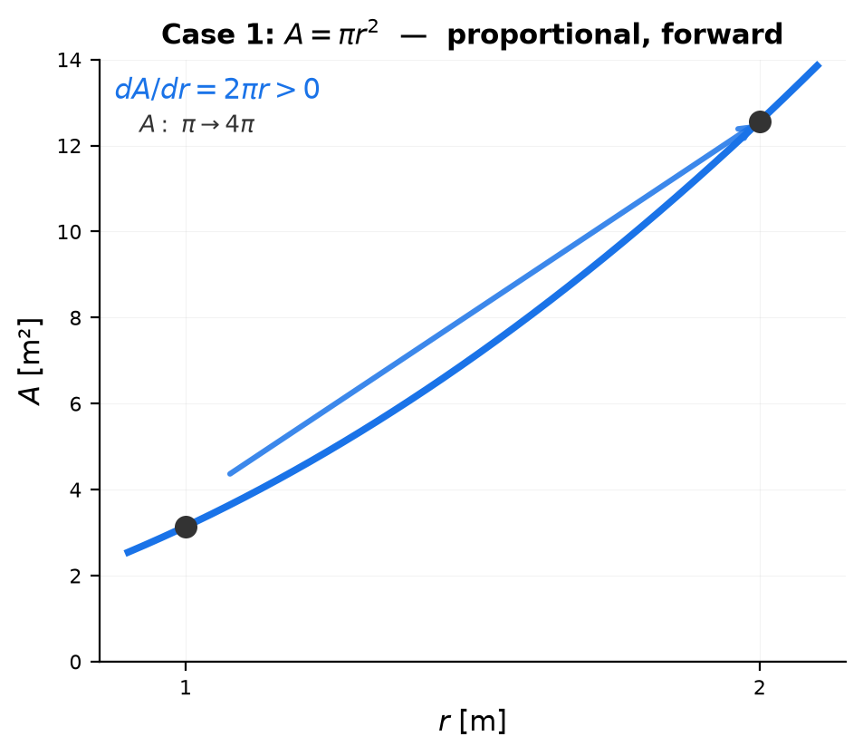
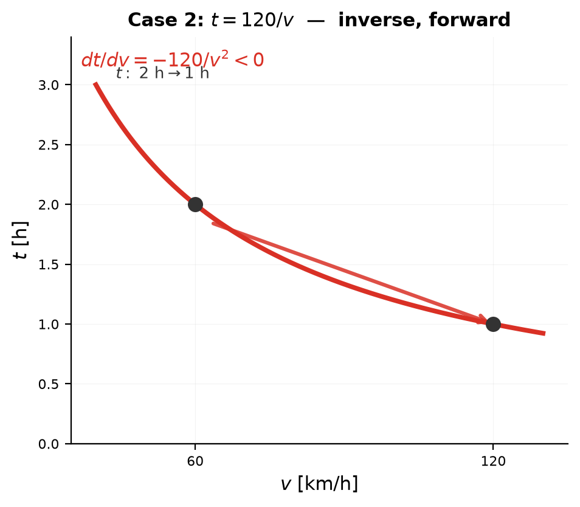
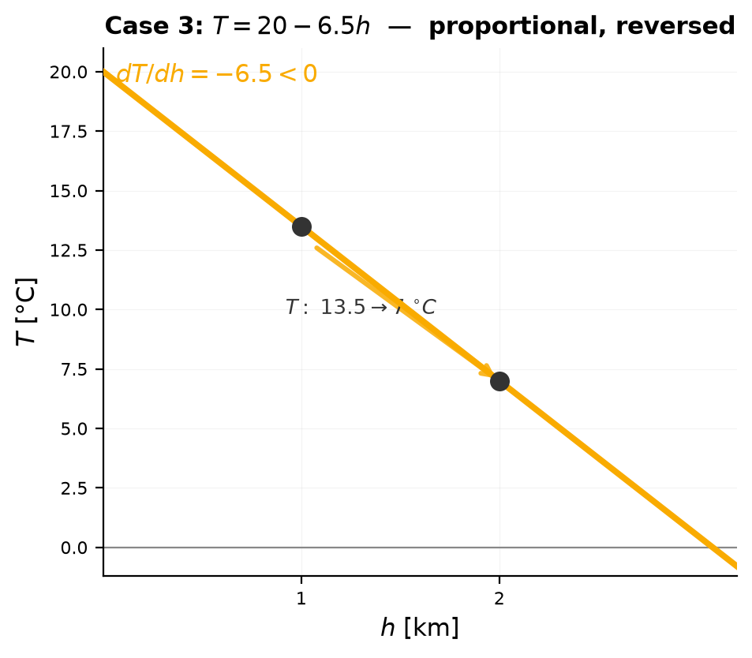
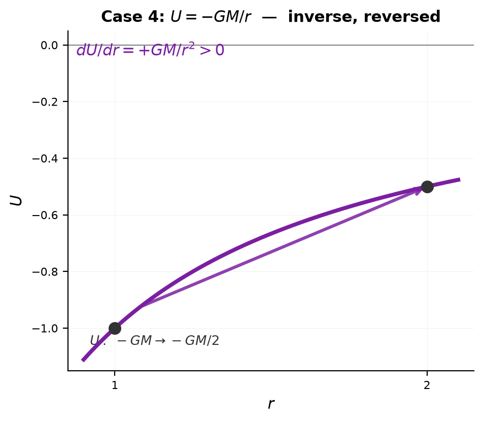
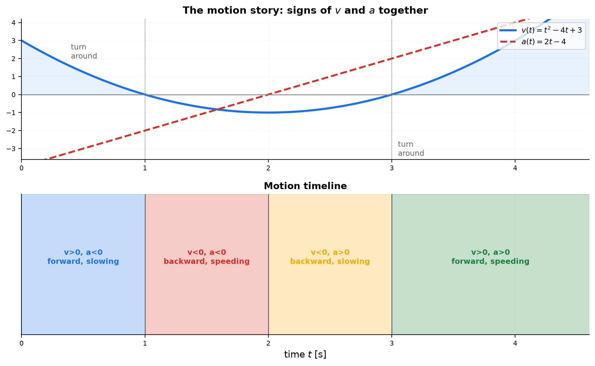

# Session 14D: Derivative Interpretation I — The Relation Lens

**Phase 2 — Classical Techniques | 50 min**

*The calculus in this session is trivial — that is the point. The exercise is reading: a derivative is first a fraction $\frac{dy}{dx}$ carrying y-units per x-unit, and "y is related to x" is a sentence missing its number $\frac{dy}{dx}$. You will learn the unit lens (write the units — they name the meaning), the relationship lens (how much is y related to x, with units y/x), the shape lens (a power relation is settled by two questions), and the motion signs of $v$ and $a$ together. Science, engineering, and economics all speak this language; by the end you will hear it fluently.*

**Prerequisites**: 14A (basic derivatives), 14B (product/chain rules), 14C (higher derivatives)

*Prerequisite for: [14D1 — Derivative Interpretation](14D1-derivative-interpretation.md), [14D1A — Implicit Relations](14D1A-derivative-interpretation.md), [14D1B — Product & Quotient Rules](14D1B-product-quotient-interpretation.md), [14D2 — Advanced Derivative Interpretation](14D2-advanced-derivative-interpretation.md)*

> 💡 **Stuck?** Every problem has a collapsible **Hint** below it — click it only when you need a nudge.

---

## Example 1: The Units of a Derivative — Name the Meaning First

A derivative is a fraction: $dy/dx$ carries **y-units per x-unit**. Writing the units forces the meaning out.

| Quantity (y) | Units | Derivative | Units | One-sentence meaning |
|:---:|:---:|:---:|:---:|:---|
| position $s(t)$ | m | $s'(t)$ | m/s | "each second adds about $s'$ meters" |
| cost $C(q)$ | \$ | $C'(q)$ | \$/unit | "each extra unit costs about $C'$ dollars" |
| population $P(t)$ | people | $P'(t)$ | people/yr | "each year adds about $P'$ people" |
| temperature $T(h)$ vs altitude | °C | $dT/dh$ | °C/km | "each km higher is $dT/dh$ degrees colder" |
| balloon volume $V(t)$ | m³ | $dV/dt$ | m³/s | "each second pumps in $dV/dt$ cubic meters" |

**The unit check**: units that look wrong mean the formula is wrong. If a "speed" comes out in m·s instead of m/s, the computation failed before the answer was read.

**Worked**: $s(t) = \frac12 t^2$ meters. $s'(t) = t$, so at $t=2$: $s'(2) = 2$ m/s. Read it as a sentence: "at $t=2$, each extra second adds about 2 meters of position." The number 2 alone means nothing — 2 m/s is the whole story.



*Graph 14D-1: Left — position vs time, tangent slope 4 m/s. Right — cost vs quantity, tangent slope 28 \$/unit. The same geometric object (a tangent) says completely different sentences depending on its units.*

---

### The Relationship Lens — "How Much Is y Related to x?" Has a Unit

Everyday language says "temperature is related to altitude," "demand is related to price," "income is related to education." The word *related* hides a question — **how much?** — and calculus answers it with one symbol. If $y$ is a function of $x$, then

$$\frac{dy}{dx}\ \text{ has units }\ \left[\frac{y}{x}\right]$$

The derivative **is** the degree of relatedness, and its units name the relation:

| "x and y are related…" | Function | Degree of relation | Units | The sentence, with its number |
|:---|:---:|:---:|:---:|:---|
| temperature ↔ altitude | $T(h)$ | $\frac{dT}{dh} = -6.5$ | °C/km | "each km of altitude buys 6.5 °C of cold" |
| demand ↔ price | $q(p)$ | $\frac{dq}{dp} = -10$ | units/\$ | "each dollar of price costs 10 units of demand" |
| distance ↔ fuel | $d(f)$ | $\frac{dd}{df}$ | km/L | "each liter of fuel buys so many km" |
| mass ↔ volume | $m(V)$ | $\frac{dm}{dV}$ | kg/m³ | "each cubic meter weighs so many kg" (density!) |

**The relation is the function; the degree is the derivative.** "$y$ is related to $x$" is the *global* statement that a function $y(x)$ exists. $\frac{dy}{dx}$ is the *local* statement — how strong the relation is *right here*, at this value of $x$.

**Sign and size are the direction and strength of the relation.** Positive derivative: the two quantities move together; negative: in opposite directions. Large $|\frac{dy}{dx}|$: strongly related at this point; small: weakly. Because it is local, one pair can be strongly related here and weakly there — a single "correlation number" cannot say that; a derivative can.

**Zero derivative is not "no relation."** $y = x^3$ is related to $x$ everywhere, yet at $x=0$ the local degree is exactly 0 — momentarily flat (the same lesson as 14D1's A9). "Related" is a global fact; $\frac{dy}{dx}$ measures its strength at a point.

**The relation is symmetric; the rate is not.** "x and y are related" points both ways, but $\frac{dy}{dx}$ (units y/x) and $\frac{dx}{dy}$ (units x/y) are different questions — and locally they are **reciprocals**. Choosing the numerator is choosing *whose response per unit of whose driver* — the "with respect to WHAT" question, applied to relationships. Mileage (km/L) and fuel consumption (L/km) are the same relation, read in two directions.

**Comparing relations across domains needs the percentage form.** Raw $\frac{dy}{dx}$ carries units, so the "income–education relation" and the "temperature–altitude relation" cannot be compared number-to-number. Strip the units and the relation becomes **elasticity** (14D1 Example 6): $E = \frac{x}{y}\frac{dy}{dx}$ is dimensionless — it reads "1% of x buys $E$% of y". The unit lens says *how much*; elasticity says *how strongly, scale-free*.

**The mindset, in one sentence**: *"y is related to x" is a sentence missing its number — $\frac{dy}{dx}$ in units of y per x is that number. Write the units, and the vagueness disappears.*

### The Shape Lens — Proportional / Inverse × Attribute: Two Questions Decide Everything

> **The procedure**: When $y$ is a power of $x$, do not compute first — read the shape. The entire interpretation of $\frac{dy}{dx}$ is settled by **two questions, always in this order**. (The price of decisiveness: the shortcut is exact for clean power shapes on positive $x$. Constants and sums need one extra step — the same two questions still organize the answer.)

**The two knobs.** With respect to the driver $x$, a power-shaped relation

$$y = \underbrace{k}_{\text{attribute knob}}\ \underbrace{x^{\,n}}_{\text{direction knob}}$$

has exactly two knobs, and they are **independent** — the letters $x$ and $y$ are placeholders: below, real models wear their own names ($r$, $A$, $v$, $t$, $h$, $T$, $U$).

**Q1 — Direction (proportional vs inverse): the sign of the exponent $n$.**
- $n > 0$ (e.g. $x^5$): **proportional** — $x$ and the *size* $\|y\|$ move the same way. $x$ up → $\|y\|$ up; $x$ down → $\|y\|$ down.
- $n < 0$ (e.g. $x^{-5} = \frac{1}{x^5}$): **inverse** — opposite ways. $x$ up → $\|y\|$ down; $x$ down → $\|y\|$ up.

**Q2 — Attribute (forward vs reversed): the sign of the coefficient $k$.**
- $k > 0$: **forward** — $y$ keeps its natural meaning (positive: wealth, height, gain).
- $k < 0$: **reversed** — $y$ is the *opposite* quantity (negative: debt, depth, loss).

**The one-line verdict: count the minus signs.** For $x > 0$, $\frac{dy}{dx} = k\,n\,x^{\,n-1}$, whose sign is the sign of $k \cdot n$ — so count the minus signs (one possible on $k$, one on $n$):

- **Even count (0 or 2)** → $y$ moves *with* $x$: $x$ up → $y$ up.
- **Odd count (1)** → $y$ moves *against* $x$: $x$ up → $y$ down.

**The 2×2 table** — the whole lens in one box:

| Shape | $n$ (direction) | $k$ (attribute) | $x$ up → size $\|y\|$ | $x$ up → number $y$ | The sentence |
|:---:|:---:|:---:|:---:|:---:|:---|
| $x^5$ | proportional | forward | up | **up** | "bigger $x$, bigger $y$ — normal meaning" |
| $\frac{1}{x^5}$ | inverse | forward | down | **down** | "bigger $x$, smaller $y$ — normal meaning" |
| $-x^5$ | proportional | reversed | up | **down** | "bigger $x$, bigger *size* — but $y$ is the opposite quantity (the debt grows)" |
| $-\frac{1}{x^5}$ | inverse | reversed | down | **up** | "two flips cancel — direction restored, but $y$ is still the opposite quantity" |

**Plug-in check ($x$: $1 \to 2$)** — the table must agree with arithmetic:

| Shape | $y(1)$ | $y(2)$ | Verdict |
|:---:|:---:|:---:|:---|
| $x^5$ | $1$ | $32$ | up — direction confirmed |
| $\frac{1}{x^5}$ | $1$ | $\frac{1}{32}$ | down — direction confirmed |
| $-x^5$ | $-1$ | $-32$ | down — size up, attribute reversed |
| $-\frac{1}{x^5}$ | $-1$ | $-\frac{1}{32}$ | up — two flips cancel, attribute still reversed |

**The trap the fourth row removes.** $-\frac{1}{x^5}$ looks like $\frac{1}{x^5}$ "with an extra minus," so it is tempting to read "$x$ up → $y$ down, and also opposite attribute." Wrong — the extra minus does not stack onto the direction; it *flips it back*. A minus is a flip, two flips cancel, and $\operatorname{sign}\!\left(\frac{dy}{dx}\right)$ already contains both flips — that is why the derivative is a one-number summary of the whole table.

**Why each case is forced — one derivation per case.** The power rule locks the verdict: for any power, $\frac{dy}{dx} = k\,n\,x^{\,n-1}$, and for $x > 0$ the factor $x^{\,n-1}$ is positive, so the sign of the derivative is exactly the sign of $k \cdot n$ — a product of two signs, with no other way out. There are four cases, all of them, and each one below is a real model wearing its own letters: shape → derivative → sign → response table → graph.

**Case 1 — $A = \pi r^2$: proportional, forward attribute.** (Circle area vs radius.)

| Step | Computation | Why it is forced |
|:---|:---|:---|
| Direction knob | $n = +2$ | exponent positive → proportional: $r$ and $\|A\|$ move together |
| Attribute knob | $k = +\pi$ | coefficient positive → forward: $A$ is a "normal" (positive) quantity |
| Derivative, power rule | $\frac{dA}{dr} = 2\pi r$ | multiply by $n=2$, then drop the exponent by one |
| Sign of the derivative | $>0$ for every $r>0$ | $2\pi>0$ and $r>0$ — both factors positive, so the product is positive; no minus can appear |
| Conclusion | $A$ rises with $r$ everywhere | a positive derivative forces $A$ to increase as $r$ increases |

| Move | Size $\|A\|$ | Number $A$ | Sentence |
|:---|:---:|:---:|:---|
| $r$: $1 \to 2$ | $\pi \to 4\pi$ | $\pi \to 4\pi$ | "bigger radius, bigger area — normal meaning" |
| $r$: $2 \to 1$ | $4\pi \to \pi$ | $4\pi \to \pi$ | "smaller radius, smaller area — normal meaning" |

*Why it cannot be otherwise:* the derivative is a product, $2\pi r$, and on $r>0$ both factors are positive, so the derivative is positive at every point — a function whose derivative is positive everywhere can only rise. The value is forced positive too: the area of a real circle is positive, so the attribute stays forward.



*Graph 14D-8a: $A=\pi r^2$ from $\pi$ to $4\pi$ as $r$ runs $1$ to $2$. The derivative $2\pi r$ contains no minus anywhere, so the arrow can only point up.*

**Case 2 — $t = \frac{120}{v} = 120v^{-1}$: inverse, forward attribute.** (Trip time vs speed.)

| Step | Computation | Why it is forced |
|:---|:---|:---|
| Direction knob | $n = -1$ | exponent negative → inverse: $v$ and $\|t\|$ move opposite |
| Attribute knob | $k = +120$ | coefficient positive → forward: $t$ stays positive |
| Derivative, power rule | $\frac{dt}{dv} = -120v^{-2} = -\frac{120}{v^2}$ | the rule multiplies by the exponent $-1$; the minus is born here |
| Sign of the derivative | $<0$ for every $v>0$ | $-120<0$ and $v^{-2}=\frac{1}{v^2}>0$ — exactly one minus, from the exponent |
| Conclusion | $t$ falls as $v$ rises everywhere | a negative derivative forces $t$ to decrease as $v$ increases |

| Move | Size $\|t\|$ | Number $t$ | Sentence |
|:---|:---:|:---:|:---|
| $v$: $60 \to 120$ km/h | $2 \to 1$ h | $2 \to 1$ h | "faster driving, shorter trip — normal meaning" |
| $v$: $120 \to 60$ km/h | $1 \to 2$ h | $1 \to 2$ h | "slower driving, longer trip — normal meaning" |

*Why it cannot be otherwise:* the minus is manufactured inside the derivative calculation itself — the power rule multiplies by the exponent $-1$ — and $\frac{1}{v^2}$ is positive, so the derivative is negative everywhere; $t$ can only fall. The value stays positive because elapsed time is positive, so the attribute stays forward.



*Graph 14D-8b: $t=\frac{120}{v}$ falls from $2$ h to $1$ h as $v$ runs $60$ to $120$ km/h. The minus lives in the derivative ($-\frac{120}{v^2}$), not in the value — time stays positive while it shrinks.*

**Case 3 — $T = 20 - 6.5h$: proportional, reversed attribute.** (Air temperature vs altitude.)

| Step | Computation | Why it is forced |
|:---|:---|:---|
| Direction knob | $n = +1$ | proportional: the size $\|T-20\| = 6.5h$ grows with $h$ |
| Attribute knob | $k = -6.5$ | reversed: the slope's minus makes $T$ the "descending" quantity |
| Derivative, power rule | $\frac{dT}{dh} = -6.5$ | the coefficient's minus passes through the rule untouched |
| Sign of the derivative | $<0$ for every $h$ | $-6.5<0$ — exactly one minus, from the coefficient |
| Conclusion | the *number* $T$ falls as $h$ rises | the size grows proportionally, but the minus in the slope flips the direction the number moves |

| Move | Size $\|T-20\|$ | Number $T$ | Sentence |
|:---|:---:|:---:|:---|
| $h$: $1 \to 2$ km | $6.5 \to 13$ °C | $13.5 \to 7$ °C | "higher up, colder air — the temperature reads down" |
| $h$: $2 \to 1$ km | $13 \to 6.5$ | $7 \to 13.5$ | "lower down, warmer air" |

*Why it cannot be otherwise:* two independent facts. Fact 1 (direction knob): the size $\|T-20\| = 6.5h$ grows with $h$, exactly as a proportional size should. Fact 2 (attribute knob): the slope is negative, so $T = 20 - 6.5h$ sinks as the size grows. The derivative $-6.5$ records precisely this — its minus is the attribute's minus, carried through the power rule unchanged. The attribute itself flips where the constant sets the boundary: freezing at $h = \frac{20}{6.5} \approx 3.08$ km.



*Graph 14D-8c: $T=20-6.5h$ falls from $13.5$ to $7$ °C as $h$ runs $1$ to $2$ km. The size $\|T-20\|$ does grow ($6.5 \to 13$), but the slope's minus makes the number itself sink; it crosses the attribute boundary (freezing) at 3.08 km.*

**Case 4 — $U = -\frac{GM}{r}$: inverse, reversed attribute.** (Gravitational potential energy vs distance.)

| Step | Computation | Why it is forced |
|:---|:---|:---|
| Direction knob | $n = -1$ | inverse: the size $\|U\| = \frac{GM}{r}$ shrinks as $r$ grows |
| Attribute knob | $k = -GM$ | reversed: $U$ is negative (a bound system) |
| Derivative, power rule | $\frac{dU}{dr} = +\frac{GM}{r^2}$ | $(-GM)\cdot(-1) = +GM$ — the two minuses meet and multiply to a plus |
| Sign of the derivative | $>0$ for every $r>0$ | both minuses are consumed by the product; nothing negative remains |
| Conclusion | the *number* $U$ rises as $r$ rises (toward $0$) | inverse alone would say "fall"; the reversed attribute flips it back |

| Move | Size $\|U\|$ | Number $U$ | Sentence |
|:---|:---:|:---:|:---|
| $r$: $1 \to 2$ | $GM \to \frac{GM}{2}$ | $-GM \to -\frac{GM}{2}$ | "farther out, smaller size — two flips cancel: U rises toward 0, still a bound energy" |
| $r$: $2 \to 1$ | $\frac{GM}{2} \to GM$ | $-\frac{GM}{2} \to -GM$ | "falling inward: U sinks deeper into the negative" |

*Why it cannot be otherwise:* the two minuses live in different knobs but must meet in the derivative — the power rule multiplies them, $(-GM)\cdot(-1)=+GM$, and negative times negative is positive. The derivative must be positive, so the number $U$ must rise. The attribute is not restored: the minus in the *value* was multiplied into the derivative but not erased — $U$ is still negative everywhere.



*Graph 14D-8d: $U=-\frac{GM}{r}$ (plotted with $GM=1$) rises from $-1$ to $-\frac12$ as $r$ doubles — the only case where the value climbs while the size shrinks. The derivative $+\frac{GM}{r^2}$ carries the two minuses already multiplied out.*

**The same four shapes in the wild:**

| Shape | Real relation | Reading |
|:---|:---|:---|
| proportional · forward | $C = 3w$, $A = \pi r^2$, $d = 4.9t^2$ | "more apples → more cost"; "bigger circle → more area"; "longer fall → more distance" |
| inverse · forward | $t = \frac{120}{v}$, $P = \frac{V^2}{R}$, $PV = C$ | "faster → shorter trip"; "more resistance → less power"; "squeeze → pressure rises" |
| proportional · reversed | $T = 20 - 6.5h$, $q = 200 - 5p$, $F = 50 - 0.08d$ | "higher → colder"; "pricier → less demand"; "farther → less fuel left" |
| inverse · reversed | $U = -\frac{GM}{r}$ | "farther out → $U$ rises toward 0 — still a negative (bound) energy" |

**The honest limit, in one sentence.** The shortcut is exact for clean powers on $x>0$; when a constant is added (as in $T = 20 - 6.5h$), read the direction from the slope and let the constant set the boundary where the attribute flips (freezing at $h \approx 3.08$ km); for shapes that are not powers at all, compute $\frac{dy}{dx}$ and read its sign directly — the two questions still organize whatever you find.

#### The Guarantee — Why This Reading Cannot Fail

The two-question verdict is not a mnemonic — it is **three theorems, quoted in order**. Mnemonics can fail; theorems cannot, within their hypotheses.

**Theorem 1 — the power rule is exact.** For every real power, $\frac{d}{dx}\left(k\,x^n\right) = k\,n\,x^{\,n-1}$ holds at every $x>0$ — an *equality*, not an approximation. (Integer powers: provable directly from the limit definition of the derivative and the binomial theorem; real powers: from $x^n = e^{\,n\ln x}$ and the chain rule.) The derivative written in each case is therefore the true slope everywhere — there is no error term hiding in it.

**Theorem 2 — the sign of the derivative decides the direction.** If a differentiable function has $f' > 0$ at *every* point of an interval, then $f$ is strictly increasing on that interval — the increasing/decreasing theorem, proven from the Mean Value Theorem. This is the bridge that turns a pointwise fact ("the slope is positive here") into a global fact ("$y$ must rise as $x$ rises"). Without this theorem, a positive slope at one point would prove nothing about the next point.

**Theorem 3 — the sign is computable, with zero exceptions.** For $x>0$, the factor $x^{\,n-1}$ is positive — plain arithmetic. Therefore $\operatorname{sign}\!\left(\frac{dy}{dx}\right) = \operatorname{sign}(k)\cdot\operatorname{sign}(n)$ at *every* point of the positive domain at once. There is no hidden case, no point where the derivative could change sign; Theorem 2 then applies to the whole domain in one step.

**The chain of trust, in one line.** Power rule (exact slope) → sign computation (exact sign, no exceptions) → increasing/decreasing theorem (sign becomes direction). Each arrow is a proven implication — that is why "bigger $x$, bigger $y$" is not a pattern you observed but a consequence you can cite. Every row of the 2×2 table is a one-line quotation of this chain, with $k$ and $n$ plugged in.

**Where the guarantee ends, honestly.** The chain holds exactly for clean power shapes on $x>0$. A constant term does not break the direction (Theorem 2 sees only the derivative), but it moves the boundary where the attribute flips (freezing at $h \approx 3.08$ km). A non-power shape can change sign, and then you apply Theorem 2 interval by interval — the theorem still decides, you just have to find the intervals first. And the percentage form (elasticity) is exact too, because it divides by a nonzero $y$.

**The mindset, in one sentence**: *Reading a power-shaped relation is a two-question drill — direction from the exponent, attribute from the coefficient — and minus signs are just flips: count them. Odd means opposite, even means same.*

#### Shape Practice — Read the Shape, Then Verify (SP1–SP6)

> Same two questions, now across domains. For each: (a) read direction and attribute from the shape — no calculus yet; (b) write the "$x$ up → $y$" sentence; (c) compute $\frac{dy}{dx}$ and check its sign against the table.

**SP1.** A rock dropped from rest falls $d(t) = 4.9\,t^2$ meters. (a) Shape-read $d$ vs $t$. (b) One sentence. (c) Compute $\frac{dd}{dt}$ at $t=2$ and check the sign.

<details>
<summary>Hint</summary>

$n=2>0$ (proportional), $k=4.9>0$ (forward). $\frac{dd}{dt} = 9.8t$ — positive.

</details>

**SP2.** A 120 km trip at speed $v$ takes $t(v) = \frac{120}{v}$ hours. (a) Shape-read. (b) One sentence. (c) Compute $\frac{dt}{dv}$ and check the sign.

<details>
<summary>Hint</summary>

$t = 120\,v^{-1}$: $n=-1$ (inverse), $k=120>0$ (forward). $\frac{dt}{dv} = -\frac{120}{v^2} < 0$.

</details>

**SP3.** Air temperature falls with altitude: $T(h) = 20 - 6.5h$ (°C, $h$ in km). (a) Which part is the direction knob, which is the attribute knob? (b) One sentence. (c) Compute $\frac{dT}{dh}$ and check the sign. (d) At what altitude does the attribute itself flip — where does water freeze?

<details>
<summary>Hint</summary>

Linear = power with $n=1$ plus a constant: slope $-6.5$ is the attribute knob (reversed). The constant sets the flip boundary: $20 - 6.5h = 0$.

</details>

**SP4.** Gravitational potential energy is $U(r) = -\frac{GM}{r}$ (negative: bound). (a) There are two minus signs — name what each one flips. (b) One sentence for $r$ up. (c) Compute $\frac{dU}{dr}$ and check the sign.

<details>
<summary>Hint</summary>

$U = -GM\,r^{-1}$: $n=-1$ flips direction, $k=-GM$ flips attribute — two flips cancel. $\frac{dU}{dr} = +\frac{GM}{r^2} > 0$.

</details>

**SP5.** At fixed temperature, gas pressure obeys $P = \frac{C}{V}$ (Boyle's law). (a) Shape-read. (b) One sentence for compressing the gas. (c) Compute $\frac{dP}{dV}$ and check the sign. (d) Both $P$ and $V$ are positive — where does the "opposite" live?

<details>
<summary>Hint</summary>

$n=-1$ (inverse), $k=C>0$ (forward). $\frac{dP}{dV} = -\frac{C}{V^2} < 0$ — the minus is in the motion, not in the attribute.

</details>

**SP6.** Demand: $q(p) = 200 - 5p$ (units sold at price $p$). (a) Shape-read. (b) One sentence. (c) Compute $\frac{dq}{dp}$ and check the sign. (d) At what price does the attribute flip — where would demand hit zero?

<details>
<summary>Hint</summary>

Slope $-5$ → proportional · reversed. $q = 0$ at $p = \frac{200}{5} = 40$ — the linear model's boundary.

</details>

→ Solutions: [Solutions](solutions/14D-solutions.md#shape-practice)

### Relationship Practice: Building the Relation from Words

> The lens in action: verbal statement → function $y(x)$ → derivative $\frac{dy}{dx}$ → units → one-sentence reading. **Setting up the function is the whole skill** — everything after that is routine.

**RP1.** A taxi charges a \$4 flat fee plus \$2 per km. (a) Set up the fare function $F(d)$ and compute $\frac{dF}{dd}$ with units. (b) Read the relation in one sentence. (c) $\frac{dF}{dd}$ is constant — what does a constant degree of relation say about this fare?

<details>
<summary>Hint</summary>

$F(d) = 4 + 2d$. Constant slope = the relation is uniform: every km buys the same \$2, everywhere.

</details>

**RP2.** A square metal plate has side $s$ cm and area $A$. (a) Set up $A(s)$ and compute $\frac{dA}{ds}$ at $s=5$ with units. (b) Read the relation in one sentence. (c) Compute $\frac{dA}{ds}$ at $s=20$ — why does the same relation get *stronger* as the plate grows?

<details>
<summary>Hint</summary>

$A = s^2$, so $\frac{dA}{ds} = 2s$. The degree of relation is local: a bigger plate has more boundary to grow from.

</details>

**RP3.** A car consumes 8 L of fuel per 100 km. (a) Set up fuel $f$ as a function of distance $d$ and compute $\frac{df}{dd}$ with units. (b) Set up the *reverse* relation — distance as a function of fuel — and compute $\frac{dd}{df}$. (c) Verify the two degrees are reciprocals and read the relation in both directions.

<details>
<summary>Hint</summary>

$f = 0.08d$ (L/km); $d = 12.5f$ (km/L). Reciprocals: $0.08 \times 12.5 = 1$.

</details>

**RP4.** A sealed gas container obeys $P = 0.4T$ (kPa vs kelvin), and its heater raises temperature as $T = 300 + 2t$ (K vs seconds). (a) Set up each relation and write each derivative with units — there are two degrees of relation here. (b) Use the chain rule to get $\frac{dP}{dt}$ and show the units multiply: $\frac{\mathrm{kPa}}{\mathrm{K}}\cdot\frac{\mathrm{K}}{\mathrm{s}} = \frac{\mathrm{kPa}}{\mathrm{s}}$. (c) One sentence: how strongly is pressure related to time?

<details>
<summary>Hint</summary>

$\frac{dP}{dT} = 0.4$ kPa/K and $\frac{dT}{dt} = 2$ K/s. Composed relation: $\frac{dP}{dt} = 0.4 \times 2 = 0.8$ kPa/s — degrees of relation multiply when relations chain.

</details>

---

#### Basic RP — Straight Setups (RPB1–RPB5)

> One relation, one shape. Set up the function, differentiate, read the sentence.

**RPB1.** A tank starts with 50 L of water and a pump adds 12 L/min. (a) Set up the volume function $V(t)$. (b) Compute $\frac{dV}{dt}$ with units and read the relation in one sentence. (c) Why is the degree of relation constant here?

<details>
<summary>Hint</summary>

$V(t) = 50 + 12t$. A constant rate means the relation is uniform — every minute buys the same 12 L.

</details>

**RPB2.** An equilateral triangle has side $s$ cm and area $A$. (a) Set up $A(s) = \frac{\sqrt3}{4}s^2$. (b) Compute $\frac{dA}{ds}$ at $s=4$ with units and read the sentence. (c) Compute it at $s=10$ — why is the relation stronger there?

<details>
<summary>Hint</summary>

$\frac{dA}{ds} = \frac{\sqrt3}{2}s$. The degree grows with $s$ — the relation is local.

</details>

**RPB3.** A trip is 120 km long, driven at a constant speed $v$ km/h. (a) Set up the time function $t(v)$. (b) Compute $\frac{dt}{dv}$ at $v=60$ with units and read the sentence (convert to minutes). (c) What does the minus sign say about the direction of the relation, and why is the degree smaller at $v=90$?

<details>
<summary>Hint</summary>

$t(v) = \frac{120}{v}$, so $\frac{dt}{dv} = -\frac{120}{v^2}$. At $v=60$: $-\frac{1}{30}$ h per km/h = 2 minutes shaved per extra km/h.

</details>

**RPB4.** Apples sell for \$3 per kg. (a) Set up cost $C(w)$ and compute $\frac{dC}{dw}$ with units. (b) Set up the reverse relation $w(C)$ and compute $\frac{dw}{dC}$. (c) Verify the two degrees are reciprocals and read both sentences.

<details>
<summary>Hint</summary>

$C = 3w$ and $w = \frac13 C$. $3 \times \frac13 = 1$.

</details>

**RPB5.** A rock dropped from rest falls $d(t) = 4.9t^2$ meters in $t$ seconds. (a) Compute $\frac{dd}{dt}$ at $t=2$ with units — this degree of relation has a name: what is it? (b) Compute it at $t=5$. (c) One sentence: how does the relation between distance and time change as the rock falls?

<details>
<summary>Hint</summary>

$\frac{dd}{dt} = 9.8t$ — velocity. At $t=2$: 19.6 m/s; at $t=5$: 49 m/s. The relation strengthens as it falls.

</details>

#### Advanced RP — Chained & Inverted Setups (RPA1–RPA5)

> Now the relation is a chain, an inverse, or a search for where the degree vanishes. Setting up the function is the whole battle.

**RPA1.** A box with a square base of side $x$ cm and fixed height 10 cm is built from material costing \$0.02 per cm². (a) Set up the surface area $S(x)$. (b) Compute $\frac{dS}{dx}$ at $x=5$. (c) Set up the cost $C(x)$ and compute $\frac{dC}{dx}$ at $x=5$ — show the units chain: $(\frac{\$}{\mathrm{cm^2}})(\frac{\mathrm{cm^2}}{\mathrm{cm}}) = \frac{\$}{\mathrm{cm}}$. (d) One sentence for the final degree.

<details>
<summary>Hint</summary>

$S(x) = 2x^2 + 40x$, $\frac{dS}{dx} = 4x + 40 = 60$ at $x=5$. $C = 0.02S$, so $\frac{dC}{dx} = 0.02(4x+40) = 1.2$ at $x=5$.

</details>

**RPA2.** Demand is $q(p) = 200 - 5p$ and revenue is $R = p\cdot q$. (a) Set up $R(p)$ and compute $\frac{dR}{dp}$ at $p=10$ with units. (b) Read the sentence. (c) Find the price where the degree of relation is exactly zero, and say what that means (see 14D1 A9).

<details>
<summary>Hint</summary>

$R = 200p - 5p^2$, $\frac{dR}{dp} = 200 - 10p$. Zero at $p=20$ — revenue stops responding to price: the peak.

</details>

**RPA3.** A heater's power is $P = \frac{V^2}{R}$ with fixed voltage $V = 120$ V. (a) Set up $P(R)$ and compute $\frac{dP}{dR}$ at $R = 60\,\Omega$ with units. (b) Read the sentence — why is the degree negative? (c) Compute the elasticity $E = \frac{R}{P}\frac{dP}{dR}$ and read the *dimensionless* degree of relation (compare with 14D1 Example 6).

<details>
<summary>Hint</summary>

$\frac{dP}{dR} = -\frac{V^2}{R^2} = -\frac{14400}{3600} = -4$ W/Ω. $P = 240$ W, so $E = \frac{60}{240}(-4) = -1$ — exactly unit elastic, because $P \propto R^{-1}$.

</details>

**RPA4.** A farmer fences a rectangular pen against a river (the river side needs no fence) using 200 m of fence. (a) With width $x$ as the side perpendicular to the river, set up the area $A(x)$. (b) Compute $\frac{dA}{dx}$ at $x=20$ with units and read the sentence. (c) Find where the degree of relation is zero and say what the pen looks like there (see 14D1 A9).

<details>
<summary>Hint</summary>

$A(x) = x(200 - 2x) = 200x - 2x^2$, so $\frac{dA}{dx} = 200 - 4x$: $120$ m²/m at $x=20$; zero at $x=50$, where $A = 5000$ m² — the maximum.

</details>

**RPA5.** A faucet drips 2 drops per second, each drop 0.05 mL. (a) Set up the wasted volume $V(t)$ in mL and compute $\frac{dV}{dt}$ with units. (b) Chain the unit conversions — seconds → hours → days → years, mL → L — to find the yearly waste in liters. (c) One sentence: what does this say about relations that chain?

<details>
<summary>Hint</summary>

$\frac{dV}{dt} = 2 \times 0.05 = 0.1$ mL/s. $0.1 \times 3600 \times 24 \times 365 = 3{,}153{,}600$ mL ≈ 3,154 L/yr — degrees of relation multiply through every unit conversion.

</details>

→ Solutions: [Solutions](solutions/14D-solutions.md#relationship-practice)

---

## Example 2: The Motion Story — Signs of $v$ and $a$ Together

$s(t) = t^3 - 6t^2 + 9t$ (meters, seconds, from 14C). $v(t) = s'(t) = 3(t-1)(t-3)$, $a(t) = s''(t) = 6t - 12$.

**Reading the sign of $v$**: $v>0$ = moving forward, $v<0$ = moving backward, $v=0$ = turning around (at $t=1$ and $t=3$).

**Reading the sign of $a$**: $a$ and $v$ have the **same sign** = speeding up. Opposite signs = slowing down. Negative $a$ is *not* automatically "decelerating" — it depends on the direction.

| Interval | $v$ | $a$ | Story |
|:---:|:---:|:---:|:---|
| $0 < t < 1$ | $+$ | $-$ | forward, slowing |
| $1 < t < 2$ | $-$ | $-$ | backward, speeding up |
| $2 < t < 3$ | $-$ | $+$ | backward, slowing |
| $t > 3$ | $+$ | $+$ | forward, speeding up |

The two turning points ($t=1, 3$) and the one acceleration switch ($t=2$) chop time into exactly four stories.



*Graph 14D-2: Top — $v(t)$ and $a(t)$ with zero crossings marked. Bottom — the motion timeline built purely from signs.*

**Lens reading**: velocity is position's degree of relation to time, acceleration is velocity's — the timeline reads the two relations' signs against each other: same sign means the relation is strengthening.

---

## What We Just Did

```
(1) Units: a derivative is y-units per x-unit. Write them first — they name the meaning.
(2) Relations: "y is related to x" is a sentence missing its number — dy/dx,
    in units of y per x, is that number. Sign = direction, size = strength, local at a point.
(3) Shapes: a power relation y = k·x^n is settled by two questions — exponent sign
    = direction (proportional/inverse), coefficient sign = attribute (forward/reversed);
    count the minus signs (odd = opposite, even = same).
(4) Motion: sign of v = direction; v and a same sign = speeding up.
```

---

## Today's Procedure

| When you see... | Do this... |
|:---|:---|
| A derivative with real-world quantities | Write units first (y-units per x-unit), then sign, then size |
| "How related is y to x?" | The relation is a function $y(x)$; its degree is $dy/dx$ with units [y/x] — sign = direction, size = strength |
| A power-shaped relation $y = k\,x^n$ | Read the shape: $n$'s sign = direction (proportional/inverse), $k$'s sign = attribute (forward/reversed); count minus signs — odd = opposite, even = same |
| A motion problem | Factor $v$ for turning points; compare signs of $v$ and $a$ for speeding/slowing |

---

## How to Read These Symbols

| Symbol | Reads as | Meaning |
|:---:|:---:|------|
| $f'(x)$, $\frac{dy}{dx}$ | "f prime of x" / "d y d x" | instantaneous rate — y-units per x-unit |
| $dy/dx$ | "d y d x" | the degree of relation between two domains — y-units per x-unit |
| $y = k\,x^n$ | "power-shaped relation" | two knobs — $n$: direction (proportional/inverse), $k$: attribute (forward/reversed) |
| m/s, \$/unit, °C/km | "meters per second…" | the units that name the meaning of the derivative |
| $v$, $a$ | "velocity" / "acceleration" | $s'$ and $s''$ — sign of $v$ = direction; $v$ and $a$ same sign = speeding up |

---

## Terminology

| What we call it | Math term | Notation |
|:---:|:---:|:---:|
| degree of relation between x and y | derivative of y with respect to x | $\frac{dy}{dx}$, units y/x |
| proportional / inverse relation | positive / negative exponent | $a^n$ vs $a^{-n}$ |
| forward / reversed attribute | positive / negative coefficient | $+k$ vs $-k$ |
| moving forward / backward | sign of velocity | $v>0$ / $v<0$ |
