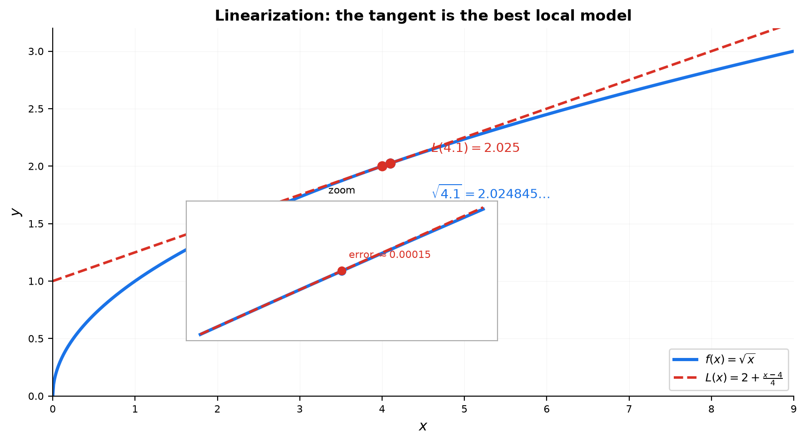
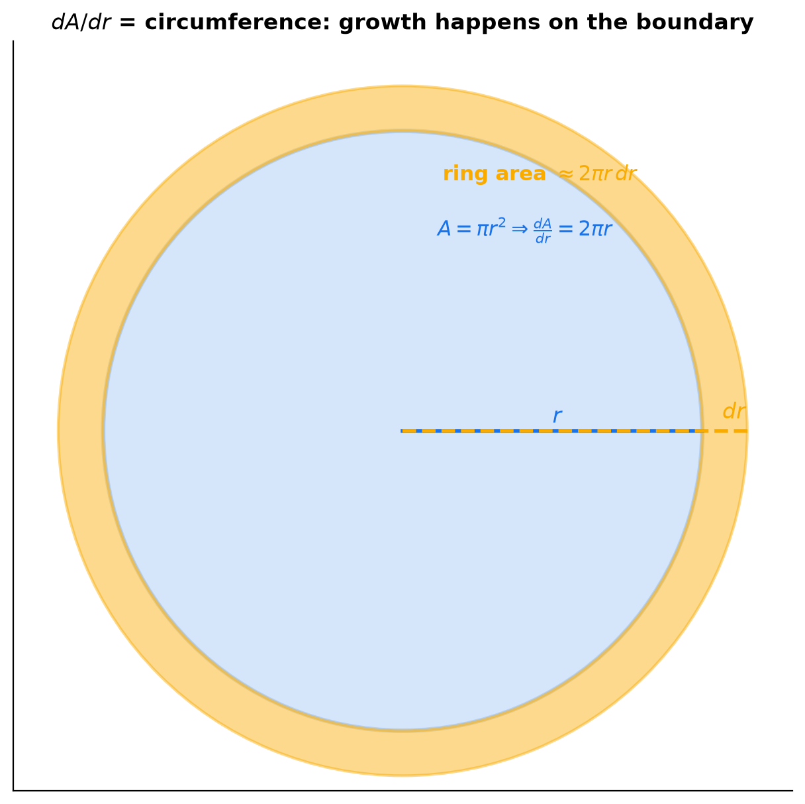
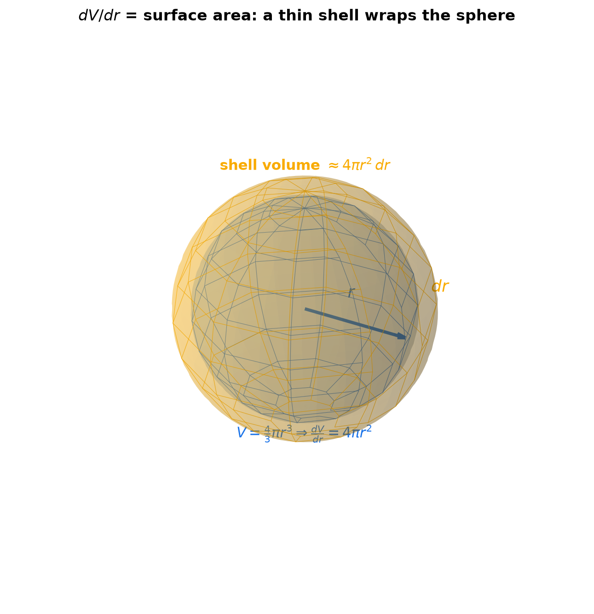
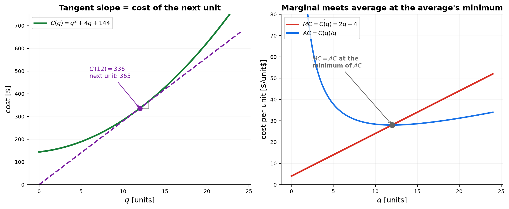
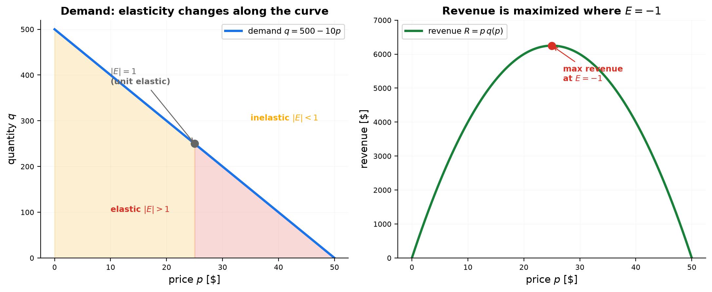

# Session 14D1: Derivative Interpretation — Reading Reality Through Rates

**Phase 2 — Classical Techniques | 60 min**

*14D trained you to read a single derivative: its units, its sign, its size, and the shape of a power relation. This session reads what a derivative **builds**: the tangent as the best local model, the boundary of a growing shape, the next unit's cost, two laws inside one function, and the percentage strength of a demand relation. The derivatives here are still easy — the exercise is reading what they create.*

**Prerequisites**: 14D (units & relations), 14A (basic derivatives), 14B (product/chain rules), 14C (higher derivatives), 15A (curve analysis)

*Prerequisite for: [14D2 — Advanced Derivative Interpretation](14D2-advanced-derivative-interpretation.md), [14D1A — Implicit Relations](14D1A-derivative-interpretation.md), [14D1B — Product & Quotient Rules](14D1B-product-quotient-interpretation.md)*

> 💡 **Stuck?** Every problem has a collapsible **Hint** below it — click it only when you need a nudge.

---

## Part A: The Geometric Lens — The Tangent Is the Best Local Model

> **The procedure**: Near a point, the function IS (almost) its tangent line. Replace the function with the line, compute, and bound how wrong you are.

---

## Example 1: Linearization — Engineering's Favorite Approximation

The tangent line at $x=a$: $L(x) = f(a) + f'(a)(x-a)$. It is the **best linear model** of $f$ near $a$.

Estimate $\sqrt{4.1}$ using $f(x)=\sqrt{x}$ at $a=4$:
1. $f(4)=2$, $f'(x) = \frac{1}{2\sqrt{x}}$, so $f'(4) = \frac14$.
2. $L(x) = 2 + \frac14(x-4)$.
3. $L(4.1) = 2 + \frac{0.1}{4} = 2.025$. True value: $2.024845\ldots$

**How wrong?** The error is controlled by $f''$: $|f(4.1)-L(4.1)| \le \frac{M}{2}(0.1)^2$ where $M$ is the largest $|f''|$ on $[4,\,4.1]$. Here $f'' = -\frac{1}{4x^{3/2}}$, max magnitude at $x=4$: $M=\frac{1}{32}$. Bound: $\frac{1}{64}\cdot 0.01 \approx 0.000156$ — and the true error is $0.000154$. ✓

**The insight**: the error is **quadratic** in the step. Ten times smaller step → a hundred times smaller error. Engineers linearize because the price of the approximation is known and tiny when $f''$ is small.



*Graph 14D1-1: The tangent at $x=4$ and the zoom showing the gap at $x=4.1$ — error ≈ 0.00015, exactly the size the $f''$ bound predicts.*

**Lens reading**: the tangent line is $f$'s local degree of relation to $x$, and the error is the relation's curvature ($f''$) — engineers trust the relation because its local strength is known and its curvature is priced.

---

## Example 2: Reading the Derivative's Graph — The Story of $f'$

Given the graph of $f'(x) = 2x-4$ (a line), read the story of $f$ without knowing $f$:

- $f'(x) < 0$ on $(-\infty, 2)$: $f$ falls. $f'(x) > 0$ on $(2,\infty)$: $f$ rises. $f'(2)=0$: flat.
- So $f$ has a **minimum** at $x=2$.
- $f'$ itself is rising everywhere (its slope is $2>0$) → $f'' = 2 > 0$ → $f$ is concave up everywhere.

Two layers, two readings: the **height** of the $f'$ graph tells where $f$ rises/falls; the **slope** of the $f'$ graph tells where $f$ bends. A derivative graph is read twice — once as a sign chart, once as a slope.

> **How to think**: "Where is $f'$ positive?" is a question about $f$'s direction. "Where is $f'$ rising?" is a question about $f$'s curvature. Always know which of the two questions you are answering.

**Lens reading**: $f'$'s sign is the direction of $f$'s relation to $x$; $f'$'s slope is how fast that relation itself changes ($f''$) — a derivative graph is two relations stacked.

---

## Part B: The Derivation Lens — Differentiating a Formula Creates Meaning

> **The procedure**: Take a formula you trust from science, engineering, or economics. Differentiate it. The derivative is never just a computation — it is a new law with its own name and its own picture.

---

## Example 3: Growing Round Objects — The Derivative of Area Is the Boundary

Circle: $A = \pi r^2$. Differentiate: $\frac{dA}{dr} = 2\pi r$ — the **circumference**.

Sphere: $V = \frac{4}{3}\pi r^3$. Differentiate: $\frac{dV}{dr} = 4\pi r^2$ — the **surface area**.

**Why this is not a coincidence**: grow the circle from radius $r$ to $r+dr$. The added area is a thin ring of circumference $2\pi r$ and width $dr$: $\Delta A \approx 2\pi r\,dr$. Divide by $dr$: exactly $\frac{dA}{dr} = 2\pi r$. Growth happens **on the boundary**, and the derivative measures that boundary.

Cube sanity check: a cube of side $s$ has $V=s^3$, so $\frac{dV}{ds} = 3s^2$ — *not* $6s^2$. Why? Growing the side by $ds$ thickens only 3 of the 6 faces. If instead the cube grows by its **half-side** $u = s/2$, then $V = 8u^3$ and $\frac{dV}{du} = 24u^2 = 6s^2$ — the full surface area. The derivative with respect to *which* growth dimension you use sets the meaning. (This is a preview of A2.)



*Graph 14D1-2: The ring of width $dr$ has area ≈ $2\pi r\,dr$ — differentiating area gives the circumference.*



*Graph 14D1-3 (3D): A spherical shell of thickness $dr$ has volume ≈ $4\pi r^2\,dr$ — differentiating volume gives the surface area.*

**Lens reading**: differentiating area or volume reads its relation to a growth dimension — and the degree is always the boundary through which growth enters. Which boundary answers depends on which driver you choose (side vs half-side).

---

## Example 4: Marginal Cost — The Cost of the Next Unit

$C(q) = q^2 + 4q + 144$ (dollars, $q$ = units produced).

- $C'(q) = 2q + 4$ is **marginal cost**: the rate at which cost grows with each extra unit.
- At $q=12$: $C'(12) = 28$ \$/unit. Sentence: "at 12 units, the next unit costs about \$28."
- Check against the real next unit: $C(12)=336$, $C(13)=365$, actual increase \$29. The \$1 gap is the second-order effect ($\frac12 C'' \approx \frac12\cdot2 = 1$) — the marginal cost is a local slope, the actual jump is the slope plus curvature.

**Marginal meets average**: average cost $AC = \frac{C(q)}{q} = q + 4 + \frac{144}{q}$.

Set $MC = AC$: $2q+4 = q+4+\frac{144}{q}$ → $q^2 = 144$ → $q=12$. At $q=12$ both equal 28.

**The law**: marginal cost crosses average cost exactly at the average's minimum. Check: $AC'(q) = 1 - \frac{144}{q^2} = 0$ at $q=12$. ✓ (The tangent's slope at the crossing equals the average height — that can only happen where the average stops falling.)



*Graph 14D1-4: Left — the cost curve with its tangent at $q=12$; the tangent's slope is the cost of the next unit. Right — $MC$ and $AC$ cross at the minimum of $AC$.*

**Lens reading**: marginal cost is cost's degree of relation to quantity; average cost is the relation's lifetime average. They meet where the average's own relation to $q$ pauses — the minimum.

---

## Example 5: Physics — One Function, Two Meanings

Kinetic energy $K = \frac12 mv^2$ (joules).

**Differentiate with respect to $v$** (mass fixed): $\frac{dK}{dv} = mv$ — **momentum** ($p = mv$).

**Differentiate with respect to $t$** (chain rule): $\frac{dK}{dt} = mv\,\frac{dv}{dt} = mva$ — and $F=ma$, so $\frac{dK}{dt} = Fv$ — **power** (watts).

The same function $K$ gives two laws because there are two different "with respect to"s:
- "How does energy change as speed changes?" → momentum.
- "How fast is energy arriving?" → power.

**Units check**: $[dK/dv] = \mathrm{J}/(\mathrm{m/s}) = \mathrm{kg\,m/s}$ — momentum ✓. $[dK/dt] = \mathrm{J/s} = \mathrm{W}$ — power ✓. The units pick out the right physical law.

**Why power = force × velocity is natural**: pushing twice as hard ($2F$) delivers energy twice as fast, and pushing at twice the speed ($2v$) does too. Each factor scales the rate of energy delivery.

**Lens reading**: one function, two relations — $K$'s degree to speed is momentum, $K$'s degree to time is power. "With respect to what" chooses which driver the relation answers to.

---

## Example 6: Elasticity — When a Price Hike Still Raises Revenue

Demand: $q(p) = 500 - 10p$ (units sold at price $p$).

**Elasticity**: $E = \frac{p}{q}\cdot\frac{dq}{dp}$ — the % change in quantity per 1% change in price (see Terminology). Here $\frac{dq}{dp} = -10$, so $E = \frac{-10p}{500-10p}$.

| $p$ | $q$ | $E$ | Meaning |
|:---:|:---:|:---:|:---|
| 20 | 300 | $-\frac23$ | inelastic: 1% price up → only 0.67% demand down |
| 30 | 200 | $-\frac32$ | elastic: 1% price up → 1.5% demand down |
| 25 | 250 | $-1$ | unit elastic — the turning point |

**Revenue** $R = p\,q(p) = 500p - 10p^2$, so $R' = 500 - 20p = 0$ at $p=25$ — maximum revenue \$6250. Elasticity $E=-1$ is exactly where $R'=0$: to the left (inelastic) raising price raises revenue; to the right (elastic) raising price loses more demand than it gains.



*Graph 14D1-5: Left — demand with elastic and inelastic regions. Right — revenue peaks exactly where $E=-1$.*

**Lens reading**: elasticity is the percentage degree of relation between demand and price — a scale-free strength. Revenue's relation to price pauses exactly where the two percentage relations balance: $E=-1$.

> **Up to here**: the tangent is the best local model; differentiating area/volume gives the boundary; marginal cost is the next unit's price and crosses average cost at its minimum; $dK/dv$ is momentum while $dK/dt$ is power; elasticity $-1$ is the revenue peak. (The unit lens, relationship lens, shape lens, and motion signs live in [14D](14D-relation-lens.md); products and quotients get their two-channel treatment in [14D1B](14D1B-product-quotient-interpretation.md).)

---

## The Interpretation Checklist

> When a derivative appears anywhere, run this checklist. It is the whole session in one box.

```
1. UNITS      → write y-units per x-unit. Wrong units = wrong formula. (14D)
2. SIGN       → positive = growing, negative = shrinking. At 0, look for turning.
3. SIZE       → the "each" sentence: "each extra x adds about f'(x) of y".
4. GEOMETRY   → slope of the tangent; the best local (linear) model.
5. RESPECT TO → "with respect to WHAT?" — dK/dv vs dK/dt are different laws.
6. NEXT LEVEL → f'' refines the story: curvature, acceleration, error size.
```

---

## Common Mistakes

### Mistake 1: Dropping the units

**Wrong**: "$C'(12) = 28$." **Right**: "$C'(12) = 28$ \$/unit." A number without units is not a derivative — it is half a sentence.

### Mistake 2: Confusing marginal with average

**Wrong**: "each of the 12 units costs \$28." **Right**: the 12th unit (the next unit) costs about \$28; the *average* cost at $q=12$ is $\frac{336}{12} = \$28$ only because $q=12$ happens to be the crossing point. In general $MC \neq AC$.

### Mistake 3: Treating the linearization as exact

**Wrong**: "$\sqrt{4.1} = 2.025$." **Right**: $2.025$ is an approximation with error $\approx 0.00015$, controlled by $f''$. The tangent is a model, not the truth — it is good exactly where $f''$ is small.

### Mistake 4: "Negative acceleration = decelerating"

**Wrong**: "at $t=1.5$, $a<0$, so the object is slowing down." **Right**: at $t=1.5$, $v<0$ *and* $a<0$ — the object moves backward and is speeding up (in the backward direction). Slowing down happens when $v$ and $a$ have opposite signs.

### Mistake 5: Comparing elasticity without its sign

**Wrong**: "$E = -1.5$ and $E=-0.25$, so the first is smaller — inelastic." **Right**: compare magnitudes: $|E| = 1.5 > 1$ is elastic. The sign is negative for normal goods (price up → demand down) and is not a size.

---

## What We Just Did

```
(1) Geometry: the tangent is the best local model; error ~ (M/2)(x−a)², M = max |f''|.
(2) Boundaries: dA/dr = 2πr (circumference), dV/dr = 4πr² (surface area) —
    growth happens on the boundary; choose the growth dimension carefully.
(3) Economics: MC = C', AC = C/q; MC crosses AC at AC's minimum.
    Elasticity E=(p/q)(dq/dp); revenue is maximized where E = −1.
(4) Physics: dK/dv = mv (momentum), dK/dt = Fv (power) — the "with respect to" sets the law.

(Units, relations, shapes, and motion signs — the unit lens of this series — live in 14D.)
```

---

## Practice 1 (14D)

Fill in the units and write a one-sentence meaning for each derivative:

| Derivative | Units | One-sentence meaning |
|:---:|:---:|:---|
| $V'(t)$, $V$ in liters, $t$ in min | ? | ? |
| $P'(t)$, $P$ in people, $t$ in years | ? | ? |
| $T'(x)$, $T$ in °C, $x$ in meters (ocean depth) | ? | ? |
| $W'(q)$, $W$ in kg, $q$ in items | ? | ? |

<details>
<summary>💡 Hint</summary>

Derivative units = y-units ÷ x-units. The sentence starts "each extra …" and names the physical meaning of that rate.

</details>

→ Solutions: [Solutions](solutions/14D1-solutions.md#practice-1)

---

## Practice 2 (14D)

A particle has $v(t) = t^2 - 6t + 8$ (m/s). Find the turning points and the acceleration, then write the complete motion timeline (moving forward/backward, speeding up/slowing down) on $[0,6]$.

<details>
<summary>💡 Hint</summary>

Factor $v(t) = (t-2)(t-4)$ for the turning points. $a(t) = 2t-6$ switches sign at $t=3$ — four zones, four stories.

</details>

→ Solutions: [Solutions](solutions/14D1-solutions.md#practice-2)

---

## Practice 3

Linearize $f(x)=\sqrt{x}$ at $a=9$ to estimate $\sqrt{9.3}$, and bound the error using $f''$.

<details>
<summary>💡 Hint</summary>

$L(x) = f(9) + f'(9)(x-9)$ with $f'(9)=\frac16$. The error bound is $\frac{M}{2}(0.3)^2$ where $M$ is the largest $|f''|$ on $[9,\,9.3]$ — and $f''$ is largest at the smaller endpoint.

</details>

→ Solutions: [Solutions](solutions/14D1-solutions.md#practice-3)

---

## Practice 4

For $C(q) = q^2 + 4q + 144$: (a) compute $C'(20)$ and say what it means; (b) estimate $C(21)$ from $C(20)$ and compare with the exact value; (c) find the $q$ where marginal cost equals average cost.

<details>
<summary>💡 Hint</summary>

(a) $C'(q)=2q+4$. (b) $C(21) \approx C(20) + C'(20)$ — then compute $C(21)$ exactly and name the gap's source. (c) solve $2q+4 = q+4+\frac{144}{q}$.

</details>

→ Solutions: [Solutions](solutions/14D1-solutions.md#practice-4)

---

## Practice 5: Real Battle — The Inflating Balloon (🔗 15B)

A spherical balloon has $V = \frac{4}{3}\pi r^3$. (a) Compute $\frac{dV}{dr}$ at $r=5$ cm and say what it means geometrically. (b) Air enters at $\frac{dV}{dt} = 8$ cm³/s. How fast is the radius growing when $r=5$ cm? (c) In one sentence each: what does $\frac{dV}{dr}$ measure, and what does $\frac{dV}{dt}$ measure — why are both legitimate answers to "how fast is the balloon growing"?

<details>
<summary>💡 Hint</summary>

(a) $\frac{dV}{dr} = 4\pi r^2$ — surface area. (b) chain rule: $\frac{dV}{dt} = \frac{dV}{dr}\cdot\frac{dr}{dt}$. (c) one is growth per unit of radius, the other growth per unit of time.

</details>

→ Solutions: [Solutions](solutions/14D1-solutions.md#practice-5)

---

## Practice 6: Real Battle — Pricing with Elasticity

Demand is $q(p) = 400 - 8p$. (a) Compute the elasticity $E$ at $p=30$ and at $p=10$. (b) If the price rises 1% from each of those points, does revenue rise or fall? (c) Find the price that maximizes revenue.

<details>
<summary>💡 Hint</summary>

$E = \frac{p}{q}\cdot(-8)$. Revenue rises when $|E|<1$ (inelastic). At the revenue peak, $R' = q + p\,q' = 0$ — which is exactly $E=-1$.

</details>

→ Solutions: [Solutions](solutions/14D1-solutions.md#practice-6)

---

## Basic Drills

**D1.** Write the units of each derivative: (a) $s'(t)$, $s$ in miles, $t$ in hours; (b) $C'(q)$, $C$ in \$, $q$ in items; (c) $N'(t)$, $N$ in bacteria, $t$ in minutes; (d) $F'(x)$, $F$ in newtons, $x$ in meters.

<details>
<summary>💡 Hint</summary>

y-units ÷ x-units: mi/hr, \$/item, bacteria/min, N/m.

</details>

**D2.** $v(t) = 3t^2 - 12t + 9$ (m/s). When is the particle moving backward?

<details>
<summary>💡 Hint</summary>

Factor $3(t-1)(t-3)$ and test the sign between the roots.

</details>

**D3.** Linearize $f(x)=e^x$ at $a=0$ and use it to estimate $e^{0.05}$. Bound the error.

<details>
<summary>💡 Hint</summary>

$L(x) = 1+x$. On $[0,\,0.05]$, $f''=e^x$ is largest at the right endpoint.

</details>

**D4.** A function has $f'(x) = 2x-4$. Where does $f$ increase? Where does it decrease? Where is its minimum?

**D5.** For a circle, compute $\frac{dA}{dr}$ at $r=3$ and say what the number means.

**D6.** $C(q) = 0.1q^2 + q + 50$ (dollars). Compute $C'(10)$, use it to estimate $C(11)$, then compute the exact $C(11)-C(10)$.

<details>
<summary>💡 Hint</summary>

$C'(10) = 3$ \$/unit, so $C(11) \approx C(10)+3$. The exact difference adds the $\frac12 C''$ term.

</details>

**D7.** $K = \frac12 mv^2$ with $m=2$ kg, $v=4$ m/s. Compute $\frac{dK}{dv}$ and name the physical quantity.

<details>
<summary>💡 Hint</summary>

$\frac{dK}{dv} = mv = 8$ — units $\mathrm{J}/(\mathrm{m/s}) = \mathrm{kg\,m/s}$: momentum.

</details>

**D8.** For a sphere, compute $\frac{dV}{dr}$ at $r=2$ and say what the number is (it has a name).

**D9.** Average cost $AC(q) = 10 + q + \frac{25}{q}$. Find the $q$ that minimizes $AC$, and verify that $MC = AC$ there.

<details>
<summary>💡 Hint</summary>

$AC'(q) = 1 - \frac{25}{q^2} = 0$ → $q=5$. The corresponding cost is $C = q\cdot AC$, so $MC = C'$.

</details>

**D10.** Demand $q(p) = 100 - 2p$. Compute the elasticity at $p=20$ and say whether a price increase would raise revenue.

<details>
<summary>💡 Hint</summary>

$q=60$, $\frac{dq}{dp}=-2$, so $E = \frac{20}{60}(-2) = -\frac23$. Compare $|E|$ with 1.

</details>

**D11.** For each pair of related quantities, write the degree-of-relation derivative, its units, and a one-sentence reading: (a) distance driven $d$ (km) vs fuel burned $f$ (L); (b) mass $m$ (kg) vs volume $V$ (m³); (c) cost $C$ (\$) vs quantity $q$ (items).

<details>
<summary>💡 Hint</summary>

Differentiate the response with respect to the driver: $\frac{dd}{df}$, $\frac{dm}{dV}$, $\frac{dC}{dq}$. The units ARE the sentence — km/L, kg/m³, \$/item.

</details>

> Solutions: [Solutions](solutions/14D1-solutions.md#basic-drill)

---

## Advanced Drills

> Each problem has a computation part AND an interpretation part. Don't skip the explanation parts.

**A1.** Derive $\frac{dA}{dr} = 2\pi r$ directly from $A=\pi r^2$, then explain with the ring picture why the added area is $\approx 2\pi r\,dr$, not $\pi r^2$'s worth.

<details>
<summary>💡 Hint</summary>

The new area is $\pi(r+dr)^2 - \pi r^2 = 2\pi r\,dr + \pi(dr)^2$. The last term is a corner square: negligible because it is $(dr)^2$, not $dr$.

</details>

**A2.** (a) For a sphere, expand $V(r+dr)-V(r)$ and show the leading term is $4\pi r^2 dr$. (b) A cube of side $s$ has $\frac{dV}{ds} = 3s^2$, not $6s^2$. Show that with the half-side $u = \frac{s}{2}$ you get the full surface area, and explain which "growth dimension" each derivative uses.

<details>
<summary>💡 Hint</summary>

$V = 8u^3$ → $\frac{dV}{du} = 24u^2 = 6(2u)^2 = 6s^2$. Growing the side thickens 3 faces; growing the half-side thickens all 6.

</details>

**A3.** For $K = \frac12 mv^2$: (a) show $\frac{dK}{dt} = Fv$ using the chain rule and $F=ma$; (b) write the units of $\frac{dK}{dv}$ and $\frac{dK}{dt}$; (c) explain in words why "power = force × velocity" means pushing twice as hard, or twice as fast, doubles the energy arrival rate.

<details>
<summary>💡 Hint</summary>

$\frac{dK}{dt} = \frac{dK}{dv}\cdot\frac{dv}{dt} = mv\cdot a = Fv$. Units: $\mathrm{kg\,m/s}$ vs $\mathrm{J/s}$.

</details>

**A4.** The small-angle approximation says $\sin x \approx x$ near 0. (a) Use the tangent at 0 to get the approximation and estimate $\sin(0.2)$. (b) Bound the error by $|x|^3/6$ — where does the cubic come from? (c) Why is the approximation excellent for $x=0.2$ but hopeless for $x=2$?

<details>
<summary>💡 Hint</summary>

The error is controlled by $f'''$: $|R| \le \frac{M}{6}|x|^3$ with $M = \max|\cos c| \le 1$. At $x=2$ the cubic bound is $\frac83$ — useless, and indeed $\sin 2$ is nowhere near 2.

</details>

**A5.** For $C(q) = q^3 - 9q^2 + 30q + 25$: solve $MC = AC$ exactly, verify you found the minimum of $AC$, and interpret the meeting point in words.

<details>
<summary>💡 Hint</summary>

$MC=3q^2-18q+30$, $AC=q^2-9q+30+\frac{25}{q}$. Setting them equal gives $2q^3-9q^2-25=0$, which factors as $(q-5)(2q^2+q+5)$ — only $q=5$ is real.

</details>

**A6.** Let $R(p) = p\cdot q(p)$. (a) Prove $R'(p) = q\,(1+E)$ where $E = \frac{p}{q}\frac{dq}{dp}$. (b) For $q = 500-10p$, find the revenue-maximizing price. (c) Explain why revenue is maximized exactly where $E = -1$.

<details>
<summary>💡 Hint</summary>

Product rule: $R' = q + p\,q' = q(1 + \frac{p\,q'}{q}) = q(1+E)$. Setting $R'=0$ forces $E=-1$ (as long as $q>0$).

</details>

**A7.** Atmospheric temperature drops with altitude: $T(h) = 20 - 6.5h$ (°C, $h$ in km). (a) Compute $\frac{dT}{dh}$ and convert it to °C per 100 m. (b) Say the meaning in one sentence. (c) At what altitude does water freeze?

<details>
<summary>💡 Hint</summary>

$-6.5$ °C/km $= -0.65$ °C per 100 m. Solve $20 - 6.5h = 0$.

</details>

**A8.** Newton's second law in full form is $F = \frac{dp}{dt}$ with $p = mv$. (a) For constant mass, recover $F = ma$. (b) For a rocket whose mass $m(t)$ changes, apply the product rule and interpret each term: which one is "accelerate the current mass", which one is "eject mass backward"?

<details>
<summary>💡 Hint</summary>

$\frac{dp}{dt} = m\frac{dv}{dt} + v\frac{dm}{dt}$ — two channels: accelerate the mass that is here, and momentum carried by the mass flow. (The full rocket story — thrust $= -u\frac{dm}{dt}$ and the frame question — lives in [14D1B](14D1B-product-quotient-interpretation.md#advanced-drill) A1.)

</details>

**A9.** $f(x) = x^3$ has $f'(0)=0$, yet $f$ is increasing at 0 (and everywhere). Reconcile this with the slogan "$f'>0$ means increasing": which direction of the slogan is exact, and which is only a warning?

<details>
<summary>💡 Hint</summary>

$f'>0$ ⇒ increasing is exact. Increasing ⇒ $f'>0$ is false — at a point like $x=0$ the slope can vanish while the function still rises everywhere around it. "$f'=0$" is a *candidate* for an extremum, not a guarantee.

</details>

**A10.** A cylinder has $V = \pi r^2 h$ with $h$ fixed. Compute both $\frac{dV}{dr}$ and $\frac{dV}{dh}$ for $r=3$, $h=10$, and name the geometric object each derivative describes.

<details>
<summary>💡 Hint</summary>

$\frac{dV}{dr} = 2\pi r h$ — the lateral surface (a wrapped band). $\frac{dV}{dh} = \pi r^2$ — the base disk. Two growth directions, two boundaries.

</details>

**A11.** Demand is $q(p) = 100 - 2p$ (units sold at price $p$). (a) Compute $\frac{dq}{dp}$ and $\frac{dp}{dq}$ at $p=20$ — the same relation, read in two directions — and verify they are reciprocals. (b) Write one sentence for each direction: "how much does demand respond to price?" and "how much must price respond to demand?" (c) Compute the elasticity at $p=20$ and explain why this *dimensionless* degree of relation could be compared to a temperature–altitude relation, while $\frac{dq}{dp} = -2$ units/\$ cannot.

<details>
<summary>💡 Hint</summary>

$\frac{dq}{dp} = -2$ units/\$; $\frac{dp}{dq} = -\frac12$ \$/unit. $E = \frac{p}{q}\frac{dq}{dp}$ with $q = 60$ at $p=20$.

</details>

> Solutions: [Solutions](solutions/14D1-solutions.md#advanced-drill)

---

## Deep Insight

> One problem, pushed to the edge of this session's method. Compute it — then explain *why* the method breaks or holds. The "why" is the whole point.

**DI1.** Which functions are equal to their own tangent-line model at *every* point? Find all functions $f$ such that $L_a(x) = f(a) + f'(a)(x-a)$ equals $f(x)$ for every $x$ **and** every $a$. Prove your characterization, and explain what it says about the error bound in Example 1 — where exactly does the linearization error live?

<details>
<summary>💡 Hint</summary>

The condition is $f(x)-f(a) = f'(a)(x-a)$ for all $a,x$. What is the secant slope $\frac{f(x)-f(a)}{x-a}$ then? And Example 1's bound uses $M = \max|f''|$.

</details>

→ Solutions: [Solutions](solutions/14D1-solutions.md#deep-insight)

---

## Today's Procedure

| When you see... | Do this... |
|:---|:---|
| "Estimate $f(a+h)$ without a calculator" | Linearize: $L(a+h)=f(a)+f'(a)h$; bound the error with $\frac{M}{2}h^2$ |
| Area/volume of a round object | Differentiate with respect to the growth dimension → boundary (circumference, surface) |
| Marginal vs average cost | $MC=C'$, $AC=C/q$; they cross at the minimum of $AC$ |
| "Should we raise the price?" | Elasticity $E=\frac{p}{q}\frac{dq}{dp}$; raise if $\|E\|<1$, peak revenue at $E=-1$ |
| One formula, several derivatives | Ask "with respect to WHAT" — each variable gives a different law |

---

## How to Read These Symbols

| Symbol | Reads as | Meaning |
|:---:|:---:|------|
| $f'(x)$, $\frac{dy}{dx}$ | "f prime of x" / "d y d x" | instantaneous rate — y-units per x-unit |
| $\frac{dV}{dr}$ vs $\frac{dV}{dt}$ | "d V d r" / "d V d t" | same function, different variable — different law (boundary vs flow) |
| $MC$ | "marginal cost" | $C'(q)$ — cost of the next unit |
| $AC$ | "average cost" | $\frac{C(q)}{q}$ — cost per unit over all units made |
| $L(x)$ | "linearization" | tangent-line model $f(a)+f'(a)(x-a)$ |
| $E$ | "elasticity" | $\frac{p}{q}\frac{dq}{dp}$ — % demand change per 1% price change |
| $p = mv$ | "momentum" | mass × velocity — the velocity-derivative of kinetic energy |

---

## Terminology

| What we call it | Math term | Notation |
|:---:|:---:|:---:|
| cost of the next unit | marginal cost | $C'(q)$ |
| cost spread over all units | average cost | $\frac{C(q)}{q}$ |
| tangent used as an estimate | linearization / linear approximation | $L(x)=f(a)+f'(a)(x-a)$ |
| error bound for the tangent model | second-order (Taylor) bound | $\frac{M}{2}(x-a)^2$ |
| % demand response per % price change | elasticity of demand | $E=\frac{p}{q}\frac{dq}{dp}$ |
| $\|E\|>1$, $\|E\|<1$, $\|E\|=1$ | elastic / inelastic / unit elastic | revenue falls / rises / peaks with price |
| circumference as $dA/dr$ | boundary of a region | $\frac{dA}{dr}=2\pi r$ |
| surface area as $dV/dr$ | boundary of a solid | $\frac{dV}{dr}=4\pi r^2$ |
| energy's response to velocity | momentum | $p=\frac{dK}{dv}=mv$ |
| energy's arrival rate | power | $P=\frac{dK}{dt}=Fv$ |
