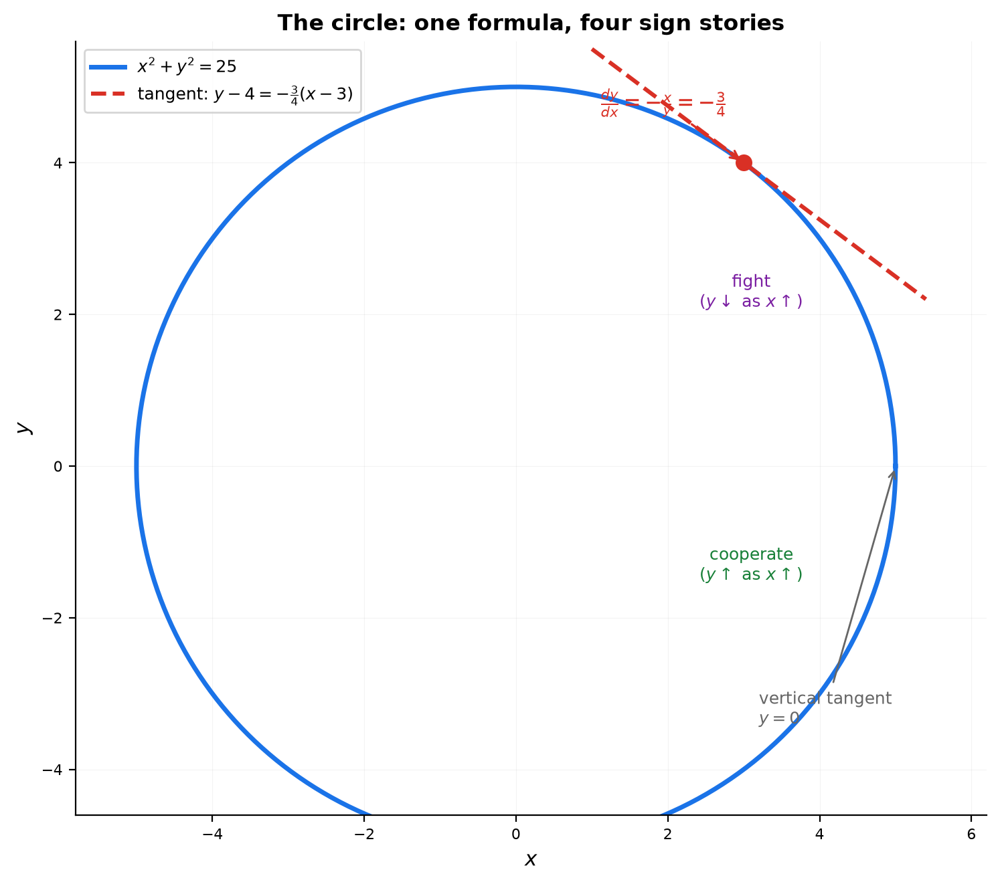
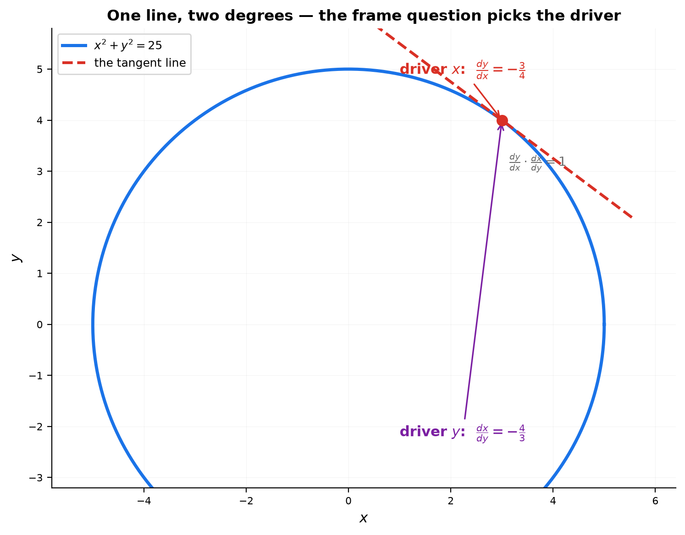
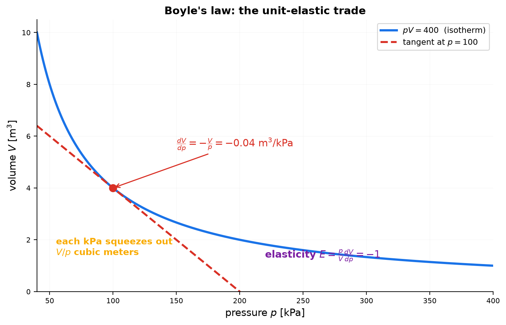
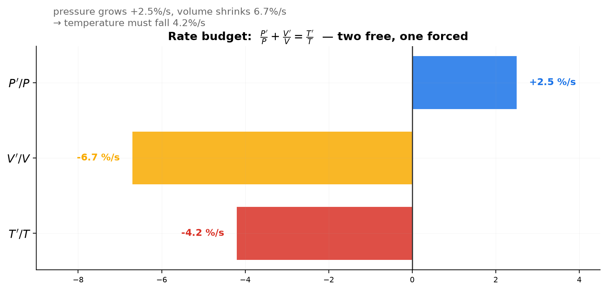
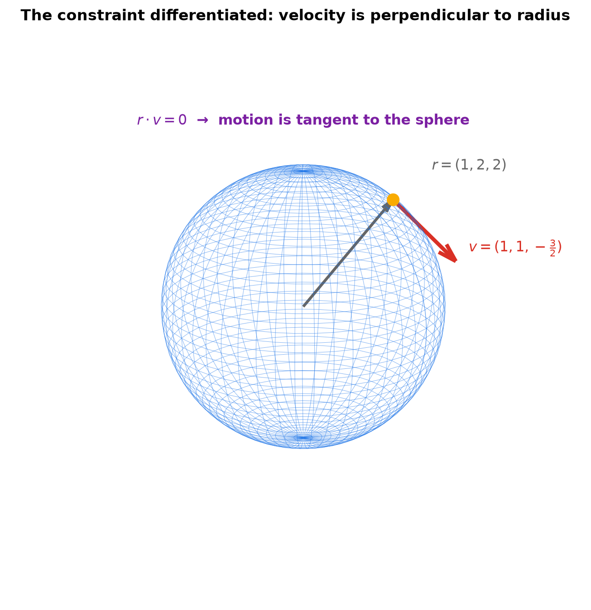
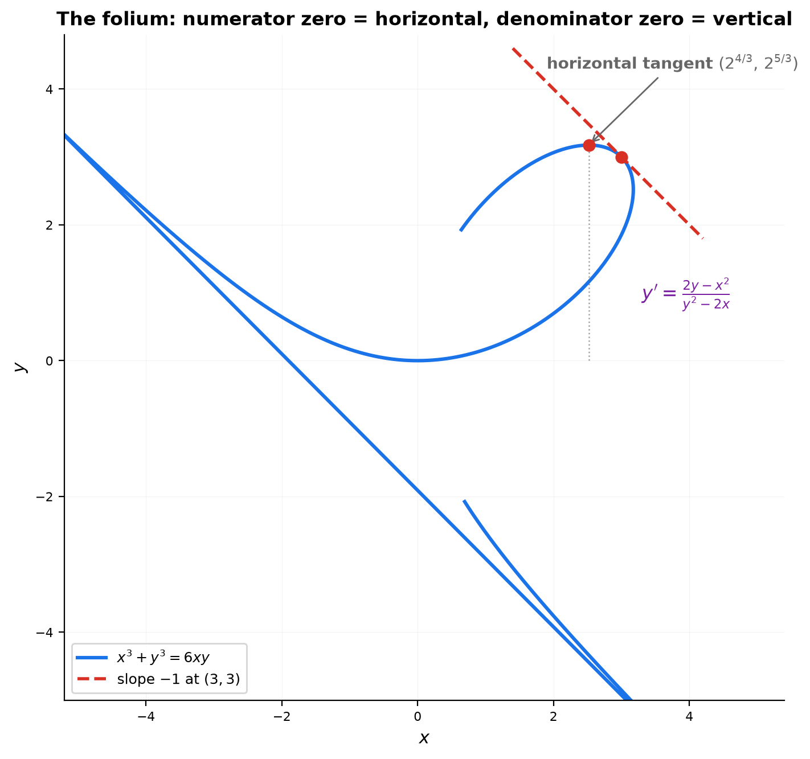
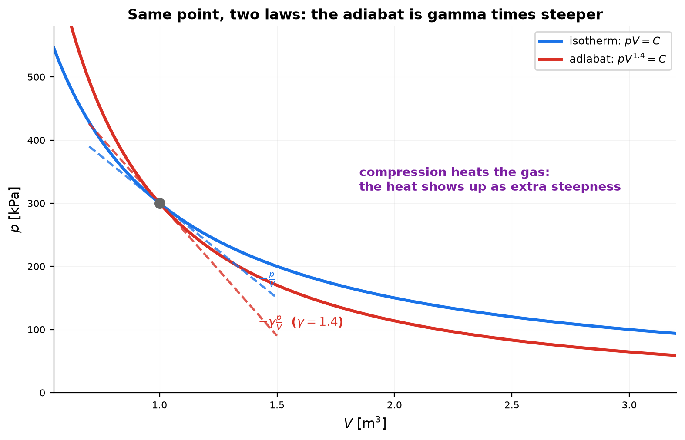

# Session 14D1A: Implicit Relations — Reading Trade-offs in Entangled Variables

**Phase 2 — Classical Techniques | Supplement to 14D1 | 40 min**

*In 14D every quantity was a clean function of one variable. Reality is messier: $x$, $y$, $z$ are tangled together in one equation, and no variable is "the" independent one. This supplement trains you to read those tangles — every implicit derivative is a trade-off ("how much $y$ per unit of $x$"), with units, signs, and a geometric story, and every equation also constrains the **rates** of change together.*

**Prerequisites**: 14D (units & relations), 14D1 (reading rates), 14C (implicit differentiation), 14B (chain rule)

> 💡 **Stuck?** Every problem has a collapsible **Hint** below it — click it only when you need a nudge.

---

## Part A: Two Entangled Variables — The Derivative As a Trade

> **The procedure**: Differentiate the whole equation (both sides, every variable). Solve for the derivative. The answer is a *trade ratio* — its units, sign, and blow-ups are the whole story.

---

## Example 1: The Circle — Slope As a Trade (🔗 14C)

$x^2 + y^2 = 25$ (a 5-meter circle). Differentiate both sides: $2x + 2y\,\frac{dy}{dx} = 0$, so

$$\frac{dy}{dx} = -\frac{x}{y}.$$

- **Units**: dimensionless — m/m cancels. A slope is a pure trade ratio, not a rate.
- **At $(3,4)$**: $\frac{dy}{dx} = -\frac34$. Sentence: "moving one meter right trades away three quarters of a meter of height."
- **Sign story**: the sign flips with the quadrant — on the upper-right arc, $x$ and $y$ fight (moving right costs height); on the lower-right arc they cooperate (moving right buys height). One formula, four stories, decided by where you stand.
- **Extremes**: vertical tangent where $y = 0$ (the trade ratio explodes — height can no longer pay), horizontal where $x = 0$.
- **Why "implicit"**: one $x$ allows two $y$'s — the curve is not a function of $x$. Yet $\frac{dy}{dx}$ exists point by point; it just needs *both* coordinates to be read. Entangled ≠ unreadable.



*Graph 14D1A-1: The circle's trade ratio $-\frac{x}{y}$ — tangent at (3,4), cooperating vs fighting quadrants, and the vertical-tangent tip where the ratio blows up.*

---

### The Relationship Lens — Two Variables, One Relation: The Frame Question (🔗 14D)

Two entangled variables feel harder than one, but the relation lens cuts the confusion with one move: **an equation is ONE relation, and reading it is choosing a driver.** 14D said *"y is related to x" is a sentence missing its number — $\frac{dy}{dx}$ in units of y per x is that number.* For an entangled equation $F(x,y)=0$ the same sentence works: the equation fixes the global relation; the implicit derivative is its local degree.

**The three questions, in order** — 14D's drill, applied to the tangle:

| Question | For $x^2+y^2=25$ at $(3,4)$ |
|:---|:---|
| 1. Who is the **driver**, who is the response? (the frame question) | respect $x$: degree $\frac{dy}{dx}$; respect $y$: degree $\frac{dx}{dy}$ |
| 2. What is the **degree**, with units? | $\frac{dy}{dx} = -\frac{x}{y} = -\frac34$ (m/m — dimensionless) |
| 3. What is the **direction**, and where does it flip or break? | negative: reversed relation; degree 0 at $(0,\pm5)$ (flat), blows up at $(\pm5,0)$ — switch drivers there |

**One line, two numbers — that is all the "two variables" fear amounts to.** The tangent at $(3,4)$ is a single geometric object, but it carries two degrees, one per driver:

$$\frac{dy}{dx} = -\frac34 \qquad\text{and}\qquad \frac{dx}{dy} = -\frac43, \qquad \frac{dy}{dx}\cdot\frac{dx}{dy} = 1.$$

"How much $y$ per unit of $x$" and "how much $x$ per unit of $y$" are the *same relation read in reverse* — reciprocals, exactly as in 14D. When one degree blows up, the other is 0: the relation did not break, it just needs the other driver. (This is also why the circle has "no slope" at $(\pm5,0)$ — the slope exists, it just lives in the $x$-respecting reading.)

**The percentage form exposes uniform relatedness.** For the multiplicative law $pV = C$ the raw degree $\frac{dV}{dp} = -\frac{V}{p}$ depends on where you stand — but the dimensionless degree $E = \frac{p}{V}\frac{dV}{dp} = -1$ is the same at **every** point: pressure and volume are *uniformly* related, exactly unit elastic (Example 2). Raw degree says *how much, here*; the percentage form says *how strongly, everywhere*. And for three entangled variables, the percentage degrees of relation must add to zero (Example 3's budget) — a relation can be read from any direction, but the ledger must balance.



*Graph 14D1A-0: The tangent at (3,4) is one line but two degrees — respect $x$ and it reads $-\frac34$, respect $y$ and it reads $-\frac43$. The frame question, not the equation, picks the number.*

**The mindset, in one sentence**: *two variables are one relation read twice — choose the driver (the frame question), read the degree $\frac{dy}{dx}$ (units y per x), watch the sign, and switch drivers where the degree vanishes or blows up.*

---

## Example 2: Boyle's Law — The Unit-Elastic Trade (🔗 10A, 14D1 Ex6)

Gas at fixed temperature: $pV = C$ (Boyle's law). Differentiate with respect to $p$: $p\,\frac{dV}{dp} + V = 0$, so

$$\frac{dV}{dp} = -\frac{V}{p}.$$

- **Units**: m³/kPa. Sentence: "each extra kPa squeezes out $\frac{V}{p}$ cubic meters."
- **Numbers**: at $p=100$ kPa, $V=4$ m³: $\frac{dV}{dp} = -0.04$ m³/kPa — each kPa costs 0.04 m³.
- **The elasticity connection** (14D1 Example 6): $E = \frac{p}{V}\frac{dV}{dp} = -1$ — gas is exactly **unit elastic**: 1% pressure up ⟹ 1% volume down. The hyperbola $pV=C$ is the unique curve with constant elasticity $-1$ (see A8) — physics and economics share one shape.
- **The rates are entangled too**: $pV = C$ implies $p\,\frac{dV}{dt} + V\,\frac{dp}{dt} = 0$. At $p=100$, $V=4$, if pressure rises at 2 kPa/s, volume falls at $\frac{dV}{dt} = -\frac{4}{100}\cdot 2 = -0.08$ m³/s. One equation, two rates, one free variable — the equation is a budget that the rates must respect.



*Graph 14D1A-2: The hyperbola $pV=400$ with tangent at $p=100$ — slope $-\frac{V}{p} = -0.04$ m³/kPa, the unit-elastic trade.*

**Lens reading**: Boyle's law relates pressure to volume at degree $-\frac{V}{p}$ — backwards everywhere, and the percentage degree $E=-1$ shows the relation is uniformly strong: exactly unit elastic at every state.

---

## Part B: Three Entangled Variables — The Rate Budget

> **The procedure**: Take logarithms of a multiplicative law. The result is a *budget of percentage rates*: the sum of the terms is fixed, and each derivative is one entry in the ledger.

---

## Example 3: The Ideal Gas — A Budget of Percentages (🔗 10A)

$PV = nRT$ with everything varying. Take logarithms (10A's trick): $\ln P + \ln V = \ln n + \ln R + \ln T$. Differentiate with respect to $t$:

$$\frac{P'}{P} + \frac{V'}{V} = \frac{T'}{T}.$$

- **Read it**: % pressure change + % volume change = % temperature change. If pressure grows 5% and volume shrinks 2%, temperature must grow 3% — the equation *forces* the third rate. Two rates are free; the third is the price of consistency.
- **Every term is dimensionless** (a rate divided by a quantity) — the percentage budget is why units work so cleanly here (14D2's dimension space in action).
- **Numbers**: $P = 200$ kPa rising at 5 kPa/s, $V = 3$ m³ shrinking at 0.2 m³/s: $\frac{T'}{T} = \frac{5}{200} - \frac{0.2}{3} = 0.025 - 0.0667 = -0.0417$ — temperature falls 4.2% per second. One line of arithmetic, three variables reconciled.



*Graph 14D1A-3: The rate budget $\frac{P'}{P}+\frac{V'}{V}=\frac{T'}{T}$ — pressure +2.5%/s and volume −6.7%/s force temperature to fall 4.2%/s.*

**Lens reading**: the ideal-gas law entangles three relations in one ledger — the percentage degrees of relation must sum to zero. Two rates are free; the third relation is forced to balance the ledger.

---

## Example 4: The Sphere — A Geometric Constraint on Motion (🔗 9C)

$x^2 + y^2 + z^2 = R^2$ (a point constrained to a sphere). Differentiate along any path $(x(t), y(t), z(t))$:

$$2x\,\frac{dx}{dt} + 2y\,\frac{dy}{dt} + 2z\,\frac{dz}{dt} = 0, \qquad\text{i.e.}\qquad (x,y,z)\cdot(x',y',z') = 0.$$

- **Read it**: the velocity is **perpendicular to the position vector** — motion on a sphere is always tangent to the sphere. The implicit equation, differentiated, *is* the geometric fact "radius ⊥ tangent" (9C's sphere meeting 14D2's dot-product).
- **Numbers**: on the sphere of radius 3 at $(1,2,2)$: $1\cdot x' + 2\cdot y' + 2\cdot z' = 0$. If $x' = 1$ and $y' = 1$, then $z' = -\frac32$ — the third speed is *not* free; the constraint sells it to you at a fixed price.
- **The pattern**: one equation kills one degree of freedom. $n$ equations on $n+m$ variables leave $m$ speeds free — constraints are machines that convert freedom into obligation.



*Graph 14D1A-4 (3D): The constraint $x^2+y^2+z^2=9$ differentiated — the velocity at (1,2,2) is perpendicular to the radius, always tangent to the sphere.*

**Lens reading**: the sphere's equation is a relation among three coordinates whose rate-budget is the dot product with the radius — the constraint relates the three speeds, leaving two free and one bought.

---

## Part C: Entanglement With Bite — Loops and Stiffness

> **The procedure**: Some implicit curves loop, self-intersect, or bend at state-dependent stiffness. The derivative still answers — read it, then read its zeroes and infinities.

---

## Example 5: The Folium — A Curve That Crosses Itself (🔗 14C)

$x^3 + y^3 = 6xy$ passes through $(3,3)$. Differentiate: $3x^2 + 3y^2 y' = 6y + 6xy'$, so

$$y' = \frac{2y - x^2}{y^2 - 2x}.$$

- At $(3,3)$: $y' = \frac{6-9}{9-6} = -1$ — a diagonal tangent, neither horizontal nor vertical. The point $(3,3)$ sits on the leaf's outer tip.
- **Horizontal tangent**: set the numerator $2y - x^2 = 0$ ($y = x^2/2$). Solving together with the curve gives $x = 2^{4/3} \approx 2.52$, $y = 2^{5/3} \approx 3.17$ — the leaf's top edge. Check: $x^3 + y^3 = 16 + 32 = 48 = 6xy$ ✓.
- **The reading**: the derivative's numerator and denominator are *separate equations* — numerator zero = horizontal, denominator zero = vertical. For entangled curves these two equations are independent, and each has its own geometry to read.



*Graph 14D1A-5: The folium with tangent slope −1 at (3,3) and the horizontal tangent at $(2^{4/3},\ 2^{5/3})$ — numerator and denominator each control one geometry.*

**Lens reading**: the folium's relation of $y$ to $x$ has a numerator-zero (horizontal pause) and a denominator-zero (vertical blow-up) as two separate events — the relation's strength has its own geometry.

---

## Example 6: Adiabatic vs Isothermal — Stiffness of a Law (🔗 14D1 Ex6)

Isothermal (fixed temperature): $pV = C$ → $\frac{dp}{dV} = -\frac{p}{V}$.

Adiabatic (no heat exchange): $pV^{\gamma} = C$, $\gamma > 1$ → $\frac{dp}{dV} = -\gamma\frac{p}{V}$.

- **Read the ratio**: at the same $p, V$, the adiabatic curve is $\gamma$ times steeper. The trade is worse: squeezing the same volume buys $\gamma$ times more pressure.
- **Why**: compression does work, which heats the gas, which raises pressure *further*. The isotherm silently leaks the heat away; the adiabat keeps it — and the price shows up as the slope. $\gamma$ is a material property (≈1.4 for air) that lives in the derivative.
- **Elasticity again**: $E = \frac{V}{p}\frac{dp}{dV} = -\gamma$ — a gas in an adiabatic process is *more* elastic than unit. The same shape-family as Example 2, stiffened by $\gamma$.



*Graph 14D1A-6: Through the same point, the adiabat is $\gamma$ times steeper than the isotherm — compression heating, priced into the slope.*

**Lens reading**: the adiabat's relation of pressure to volume is $\gamma$ times stronger than the isotherm's — the extra strength is the heating the process itself creates. Elasticity reads that stiffness scale-free: $-\gamma$ vs $-1$.

> **Up to here**: an implicit equation differentiates into a trade-off — the circle's slope $-\frac{x}{y}$, Boyle's $-\frac{V}{p}$ (unit elasticity), the ideal gas's percentage budget $\frac{P'}{P}+\frac{V'}{V}=\frac{T'}{T}$, the sphere's perpendicularity $(x,y,z)\cdot v = 0$, the folium's independent horizontal/vertical conditions, and adiabatic stiffness $-\gamma\frac{p}{V}$; and the relationship lens — an entangled equation's degree of relation is $\frac{dy}{dx}$ in units of y per x, local and reciprocal, with its uniformity exposed by the percentage form.

---

## The Implicit Reading Checklist

> When an entangled equation appears, run this. It is the whole supplement in one box.

```
1. FRAME       → name both variables, then choose the driver (the frame question) —
                 the degree dy/dx has units y per x, and dx/dy reads the same relation backwards.
2. DIFFERENTIATE → both sides, every variable (product rule for products, chain
                 rule for powers, log-diff for multiplicative laws).
3. SOLVE       → isolate the trade-off dy/dx (or a rate budget).
4. READ        → units (y-units per x-unit), sign (cooperating or fighting?),
                 magnitude ("each extra x trades ..."), zero/∞ (horizontal/vertical).
5. CONSTRAIN   → the same equation also ties the RATES: p'V + pV' = 0, etc.
```

---

## Common Mistakes

### Mistake 1: Forgetting that both sides contribute

**Wrong**: differentiating $x^2+y^2=25$ to $2x = 0$. **Right**: both sides change together: $2x + 2y\,y' = 0$. An implicit equation is a joint account — every variable's rate appears.

### Mistake 2: Reporting the answer without units or sign story

**Wrong**: "$\frac{dV}{dp} = -0.04$." **Right**: "$-0.04$ m³/kPa — each extra kPa squeezes out 0.04 m³." The units say *what* is traded; the sign says *who loses*.

### Mistake 3: Ignoring the vertical-tangent warning

**Wrong**: "the circle has slope $-\frac{x}{y}$ everywhere." **Right**: at $y=0$ the trade ratio blows up — the tangent is vertical. A derivative that explodes is information, not an error.

### Mistake 4: Treating the folium's zero conditions as one equation

**Wrong**: solving $y'=0$ and $y'=\infty$ from the same denominator. **Right**: numerator zero ⟹ horizontal, denominator zero ⟹ vertical — two separate equations on the same curve.

### Mistake 5: Forgetting that the equation constrains the rates too

**Wrong**: changing $p$ and $V$ independently while claiming $pV=C$. **Right**: $p\frac{dV}{dt} + V\frac{dp}{dt} = 0$ — the rates must balance the budget. One equation always removes one freedom, for the values *and* for the rates.

---

## What We Just Did

```
(0) The frame question: one equation, one relation — respect x or respect y;
    dy/dx and dx/dy are reciprocals; where one blows up, switch drivers.
(1) Circle x²+y²=25: dy/dx = −x/y — a dimensionless trade; sign flips by quadrant;
    vertical tangent where y=0.
(2) Boyle pV=C: dV/dp = −V/p (m³/kPa); elasticity E = −1 exactly; rates obey pV'+Vp'=0.
(3) Ideal gas: log-diff → P'/P + V'/V = T'/T — a budget of percentage rates;
    two rates free, the third forced.
(4) Sphere x²+y²+z²=R²: (x,y,z)·(x',y',z')=0 — velocity ⊥ radius; constraint = obligation.
(5) Folium x³+y³=6xy: y'=(2y−x²)/(y²−2x); numerator 0 ⇒ horizontal (x=2^{4/3}, y=2^{5/3}),
    denominator 0 ⇒ vertical.
(6) Adiabatic pV^γ=C: dp/dV = −γp/V — γ times steeper than the isotherm (compression heats).
```

---

## Basic Drills

**D1.**

<details>
<summary><b>D1.A</b></summary>

$x^2/9 + y^2/4 = 1$. Differentiate implicitly and find $\frac{dy}{dx}$ at $(0,2)$.

<details>
<summary><b>D1.B</b></summary>

What kind of tangent does the point have, and where does it sit on the ellipse?

</details>
</details>

<details>
<summary>💡 Hint</summary>

$\frac{dy}{dx} = -\frac{4x}{9y} = 0$ at $(0,2)$ — a horizontal tangent (the top of the ellipse).

</details>

**D2.**

<details>
<summary><b>D2.A</b></summary>

$pV = 600$ kPa·m³. Find $\frac{dV}{dp}$ at $p = 150$ kPa.

<details>
<summary><b>D2.B</b></summary>

State the units and read the trade in one sentence.

</details>
</details>

<details>
<summary>💡 Hint</summary>

$V = 4$ m³ → $-\frac{4}{150} = -0.0267$ m³/kPa.

</details>

**D3.**

<details>
<summary><b>D3.A</b></summary>

$xy = 12$. Differentiate implicitly and find $\frac{dy}{dx}$ at $(3,4)$.

<details>
<summary><b>D3.B</b></summary>

Read the trade: what does the number say about $x$ and $y$?

</details>
</details>

<details>
<summary>💡 Hint</summary>

$y + x y' = 0$ → $y' = -\frac{y}{x} = -\frac43$: each unit of $x$ trades away $\frac43$ of $y$.

</details>

**D4.**

<details>
<summary><b>D4.A</b></summary>

$x^2 + y^2 = 25$. Where is the tangent vertical?

<details>
<summary><b>D4.B</b></summary>

Where is it horizontal?

</details>
</details>

<details>
<summary>💡 Hint</summary>

Vertical: $y=0$, $x=\pm5$. Horizontal: $x=0$, $y=\pm5$.

</details>

**D5.**

<details>
<summary><b>D5.A</b></summary>

From $pV = C$, compute $\frac{dV}{dp}$.

<details>
<summary><b>D5.B</b></summary>

Show the elasticity $E = \frac{p}{V}\frac{dV}{dp} = -1$ — the same at every state.

</details>
</details>

<details>
<summary>💡 Hint</summary>

$\frac{dV}{dp} = -\frac{V}{p}$, so $E = \frac{p}{V}\cdot\left(-\frac{V}{p}\right) = -1$.

</details>

**D6.**

<details>
<summary><b>D6.A</b></summary>

On the sphere $x^2+y^2+z^2 = 9$ at $(1,2,2)$, differentiate along a path with $x' = 1$, $y' = 1$.

<details>
<summary><b>D6.B</b></summary>

Solve for $z'$ and read what the constraint forced.

</details>
</details>

<details>
<summary>💡 Hint</summary>

$2(1)(1) + 2(2)(1) + 2(2)z' = 0$ → $z' = -\frac32$.

</details>

**D7.**

<details>
<summary><b>D7.A</b></summary>

At the same point, compute the adiabatic and isothermal slopes $\frac{dp}{dV}$.

<details>
<summary><b>D7.B</b></summary>

What is their ratio, and what does it mean?

</details>
</details>

<details>
<summary>💡 Hint</summary>

$-\gamma\frac{p}{V}$ vs $-\frac{p}{V}$: ratio $\gamma$ (e.g. 1.4 for air).

</details>

**D8.**

<details>
<summary><b>D8.A</b></summary>

A plane satisfies $x + y + z = 10$ (units: meters). Differentiate the constraint along a path.

<details>
<summary><b>D8.B</b></summary>

If $x' = 2$ m/s and $y' = -1$ m/s, find $z'$.

</details>
</details>

<details>
<summary>💡 Hint</summary>

$x' + y' + z' = 0$ → $z' = -1$ m/s. A plane is the simplest entangled constraint.

</details>

**D9.**

<details>
<summary><b>D9.A</b></summary>

For $x^2 + y^2 = 25$, what happens to $\frac{dy}{dx}$ as the point approaches $(5,0)$?

<details>
<summary><b>D9.B</b></summary>

Interpret — and give the frame-question fix for the blow-up.

</details>
</details>

<details>
<summary>💡 Hint</summary>

$-\frac{x}{y} \to -\infty$: the trade ratio blows up — a vertical tangent, where $x$ can no longer buy any $y$.

</details>

**D10.**

<details>
<summary><b>D10.A</b></summary>

$PV = nRT$ with $T$ fixed. Write the rate budget.

<details>
<summary><b>D10.B</b></summary>

If $P' = 3$ kPa/s at $P = 100$ kPa, $V = 4$ m³, find $V'$.

</details>
</details>

<details>
<summary>💡 Hint</summary>

$V' = -\frac{V}{P}P' = -\frac{4}{100}\cdot 3 = -0.12$ m³/s.

</details>

> Solutions: [Solutions](solutions/14D1A-solutions.md#basic-drill)

---

## Advanced Drills

> Each problem has a computation part AND an interpretation part. Don't skip the explanation parts.

**A1.**

<details>
<summary><b>A1.A</b></summary>

From $pV = C$, derive both $\frac{dV}{dp} = -\frac{V}{p}$ and the elasticity $E = -1$.

<details>
<summary><b>A1.B</b></summary>

Explain why a hyperbola is the *only* shape with constant elasticity — solve the differential equation $\frac{dV}{dp} = -\frac{V}{p}$.

</details>
</details>

<details>
<summary>💡 Hint</summary>

Separate: $\frac{dV}{V} = -\frac{dp}{p}$ → $\ln V = -\ln p + \text{const}$ → $pV = \text{const}$. The elasticity condition *defines* the hyperbola.

</details>

**A2.**

<details>
<summary><b>A2.A</b></summary>

Ideal gas $PV = nRT$: derive the percentage budget by log-differentiation.

<details>
<summary><b>A2.B</b></summary>

Work the numbers $P' = 5$ kPa/s, $V' = -0.2$ m³/s, $P = 200$ kPa, $V = 3$ m³.

<details>
<summary><b>A2.C</b></summary>

Interpret each term's contribution: which rate dominates?

</details>
</details>
</details>

<details>
<summary>💡 Hint</summary>

$\frac{P'}{P} + \frac{V'}{V} = \frac{T'}{T}$; $0.025 - 0.0667 = -0.0417$: the volume shrinkage (−6.7%/s) dominates the pressure growth (+2.5%/s), so $T$ falls.

</details>

**A3.**

<details>
<summary><b>A3.A</b></summary>

Folium $x^3 + y^3 = 6xy$: set $\frac{dy}{dx} = 0$ and solve exactly.

<details>
<summary><b>A3.B</b></summary>

Show the horizontal tangent occurs at $x = 2^{4/3}$, $y = 2^{5/3}$.

<details>
<summary><b>A3.C</b></summary>

Verify the point lies on the curve.

</details>
</details>
</details>

<details>
<summary>💡 Hint</summary>

$2y - x^2 = 0$ → $y = \frac{x^2}{2}$; substitute: $x^3 + \frac{x^6}{8} = 3x^3$ → $x^3 = 16$ → $x = 2^{4/3}$, $y = 2^{5/3}$. Check: $16 + 32 = 48 = 6\cdot 8$.

</details>

**A4.**

<details>
<summary><b>A4.A</b></summary>

Derive $\frac{dp}{dV} = -\gamma\frac{p}{V}$ from $pV^{\gamma} = C$.

<details>
<summary><b>A4.B</b></summary>

Explain step by step why compression heats the gas and stiffens the curve.

</details>
</details>

<details>
<summary>💡 Hint</summary>

$\frac{d}{dV}(pV^{\gamma}) = p'V^{\gamma} + \gamma pV^{\gamma-1} = 0$ → $p' = -\gamma\frac{p}{V}$. Work done on the gas becomes internal energy (no heat exchange), raising temperature and pressure — the rise appears as extra steepness.

</details>

**A5.**

<details>
<summary><b>A5.A</b></summary>

For the ellipsoid $\frac{x^2}{a^2} + \frac{y^2}{b^2} + \frac{z^2}{c^2} = 1$, differentiate along a path and show the velocity must satisfy $\left(\frac{x}{a^2}, \frac{y}{b^2}, \frac{z}{c^2}\right)\cdot (x', y', z') = 0$.

<details>
<summary><b>A5.B</b></summary>

What does the weighted normal mean geometrically?

</details>
</details>

<details>
<summary>💡 Hint</summary>

Each term contributes $2\frac{x}{a^2}x'$ etc. The weighted vector is the surface's normal direction (scaled) — motion on the surface is perpendicular to it (14D2's gradient in disguise).

</details>

**A6.**

<details>
<summary><b>A6.A</b></summary>

$pV = C$ at $p=100$ kPa, $V=4$ m³. Compute the static trade $\frac{dV}{dp}$.

<details>
<summary><b>A6.B</b></summary>

Compute the dynamic response $\frac{dV}{dt}$ (for $\frac{dp}{dt} = 2$ kPa/s).

<details>
<summary><b>A6.C</b></summary>

Both are "how volume responds to pressure" — explain the difference in what they measure.

</details>
</details>
</details>

<details>
<summary>💡 Hint</summary>

$-0.04$ m³/kPa is the static trade (per unit of pressure, whenever); $-0.08$ m³/s is the dynamic response to *this* pressure's speed (per second). One is the exchange rate, the other is the cash flow.

</details>

**A7.**

<details>
<summary><b>A7.A</b></summary>

Near the folium's horizontal tangent, the curve is locally a graph $y = f(x)$ even though globally it is not. State the test that decides this.

<details>
<summary><b>A7.B</b></summary>

Explain why the derivative's finiteness is exactly that local test (the intuition behind the implicit function theorem).

</details>
</details>

<details>
<summary>💡 Hint</summary>

Where $y'$ is finite, $y$ changes predictably with $x$ — locally the equation can be solved for $y$. The theorem's condition (denominator ≠ 0) is precisely "the trade ratio is finite."

</details>

**A8.**

<details>
<summary><b>A8.A</b></summary>

Show that the only curves with *constant* elasticity $E = \frac{p}{q}\frac{dq}{dp} = -k$ are the power laws $q p^{k} = C$ (separate variables and integrate).

<details>
<summary><b>A8.B</b></summary>

What does this unify — how do Boyle's law and demand curves fit one family?

</details>
</details>

<details>
<summary>💡 Hint</summary>

$\frac{dq}{q} = -k\frac{dp}{p}$ → $\ln q = -k\ln p + c$ → $q p^k = C$. Boyle is $k=1$; demand curves with $k\neq1$ are the same family.

</details>

**A9.**

<details>
<summary><b>A9.A</b></summary>

A point moves on $x^2 + y^2 = 25$ with $x = 5\cos\theta(t)$, $y = 5\sin\theta(t)$. Compute $\frac{dy}{dx}$ by parametric differentiation (9B) and confirm it equals $-\frac{x}{y}$ from the implicit method.

<details>
<summary><b>A9.B</b></summary>

Which method reveals the *time* story better?

</details>
</details>

<details>
<summary>💡 Hint</summary>

$\frac{dy}{dx} = \frac{dy/dt}{dx/dt} = \frac{5\cos\theta}{-5\sin\theta} = -\frac{x}{y}$ ✓. Parametric keeps time visible (the speeds $x', y'$); implicit keeps the geometric trade visible. Two lenses, one curve.

</details>

**A10.**

<details>
<summary><b>A10.A</b></summary>

For $PV = nRT$, holding $P$ fixed, compute $\frac{dV}{dT}$ and its units.

<details>
<summary><b>A10.B</b></summary>

Holding $V$ fixed, compute $\frac{dP}{dT}$ and its units.

<details>
<summary><b>A10.C</b></summary>

Explain what each derivative measures physically.

</details>
</details>
</details>

<details>
<summary>💡 Hint</summary>

(a) $\frac{dV}{dT} = \frac{nR}{P}$ — m³/K: thermal expansion at constant pressure. (b) $\frac{dP}{dT} = \frac{nR}{V}$ — kPa/K: pressure rise on heating in a sealed container. Same law, two different holds — the "holding" decides the meaning (14D1's lesson).

</details>

> Solutions: [Solutions](solutions/14D1A-solutions.md#advanced-drill)

---

## Deep Insight

> One problem, pushed to the edge of this session's method. Compute it — then explain *why* the method breaks or holds. The "why" is the whole point.

**DI1.**

<details>
<summary><b>DI1.A</b></summary>

At the origin the folium $x^3+y^3=6xy$ crosses itself. Show that **both** $\frac{dy}{dx}$ and $\frac{dx}{dy}$ fail at $(0,0)$ — the formulas are $0/0$.

<details>
<summary><b>DI1.B</b></summary>

Using the parametrization $x=\frac{6t}{1+t^3}$, $y=\frac{6t^2}{1+t^3}$, show the curve has **two** branches through the origin, one tangent to each axis.

<details>
<summary><b>DI1.C</b></summary>

Explain why the "locally a graph" reading (A7) has exactly this one loophole — and which condition on $(F_x, F_y)$ detects it.

</details>
</details>
</details>

<details>
<summary>💡 Hint</summary>

(a) Both numerator and denominator of $y'=\frac{2y-x^2}{y^2-2x}$ vanish at the origin. (b) Send $t\to0$ and $t\to\infty$; for the second branch, write $y^2$ in terms of $x$.

</details>

→ Solutions: [Solutions](solutions/14D1A-solutions.md#deep-insight)

---

## Today's Procedure

| When you see... | Do this... |
|:---|:---|
| An equation tying two variables | Differentiate both sides; solve for $\frac{dy}{dx}$ — a trade with units, sign, zeroes |
| A multiplicative law ($pV$, $PV=nRT$) | Log-differentiate → a budget of percentage rates |
| A geometric constraint ($x^2+y^2+z^2=R^2$) | Differentiate along the path → dot-product perpendicularity |
| Numerator/denominator zeroes of an implicit derivative | Two separate equations: horizontal vs vertical tangents |
| Two versions of a law ($pV$ vs $pV^{\gamma}$) | Compare slopes at the same point — the extra factor is the stiffness |

---

## How to Read These Symbols

| Symbol | Reads as | Meaning |
|:---:|:---:|------|
| $\frac{dy}{dx} = -\frac{x}{y}$ | "d y d x equals minus x over y" | the circle's trade ratio — pure number (m/m) |
| $\frac{dx}{dy}$ | "d x d y" | the same relation read backwards — the reciprocal degree |
| $\frac{dV}{dp}$ | "d V d p" | volume's response to pressure — m³/kPa |
| $\frac{P'}{P}$ | "P prime over P" | percentage rate of pressure — dimensionless |
| $(x,y,z)\cdot(x',y',z')$ | "position dot velocity" | zero ⟹ motion is tangent to the sphere |
| $\gamma$ | "gamma" | adiabatic index — the stiffness factor of a gas law |
| $E = \frac{p}{q}\frac{dq}{dp}$ | "elasticity" | % quantity change per 1% price/pressure change |

---

## Terminology

| What we call it | Math term | Notation |
|:---:|:---:|:---:|
| derivative of an entangled equation | implicit differentiation | $F(x,y)=0 \Rightarrow F_x + F_y y' = 0$ |
| how much $y$ one unit of $x$ costs | trade-off / exchange ratio | $\frac{dy}{dx}$ |
| equation binding the rates | constraint on rates | $pV' + Vp' = 0$ |
| sum of percentage rates | logarithmic derivative | $\frac{P'}{P}+\frac{V'}{V}=\frac{T'}{T}$ |
| curve steeper than unit-elastic | adiabatic law | $pV^{\gamma}=C$, $\frac{dp}{dV}=-\gamma\frac{p}{V}$ |
| where the derivative explodes | vertical tangent | $y=0$ on the circle |
| locally a graph despite the tangle | implicit function theorem (intuition) | denominator $\neq 0$ |
