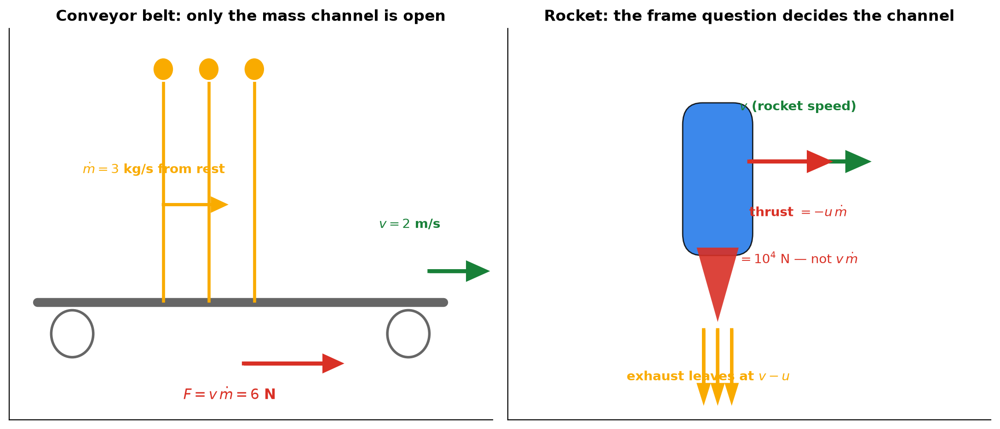
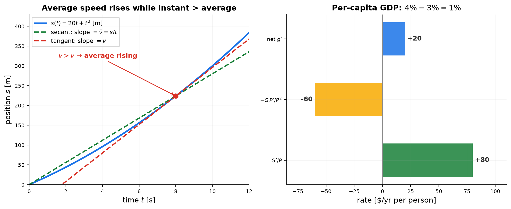

# Session 14D1B: Product & Quotient Rules — Two Channels, One Budget

**Phase 2 — Classical Techniques | Supplement to 14D1 | 40 min**

*14D taught you to read one derivative at a time. This supplement trains you to read the two hardest shapes a derivative can take — a product and a quotient. Both obey the same machine: differentiating splits the total change into **two channels**, one per factor. The only difference is the sign — a product's second channel adds (new mass, new area), a quotient's second channel subtracts (dilution). By the end, $F = m\frac{dv}{dt} + v\frac{dm}{dt}$ and $AC' = \frac{MC - AC}{q}$ will read like sentences, not formulas.*

**Prerequisites**: 14D (units & relations), 14D1 (reading rates), 14B (product rule), 14D1A (percentage budget, for the log form)

> 💡 **Stuck?** Every problem has a collapsible **Hint** below it — click it only when you need a nudge.

---

## Example 1: The Product Rule — Two Channels of Change, One Budget

When a formula is a product, $y = u\,v$, its derivative is a **budget**: the total rate of change splits into one channel per factor, each channel freezing the other factor at its current value:

$$\frac{d}{dt}(u\,v) = u\,\frac{dv}{dt} + v\,\frac{du}{dt}$$

Momentum $p = mv$ is the perfect test case. The mindset has three steps:

**Step 1 — Units first.** Differentiating $F = \frac{dp}{dt}$ gives $m\frac{dv}{dt} + v\frac{dm}{dt}$. Each term must be a force:
- $m\frac{dv}{dt}$: $\mathrm{kg}\cdot\frac{\mathrm{m/s}}{\mathrm{s}} = \mathrm{N}$ ✓
- $v\frac{dm}{dt}$: $\frac{\mathrm{m}}{\mathrm{s}}\cdot\frac{\mathrm{kg}}{\mathrm{s}} = \mathrm{N}$ ✓

The product rule didn't just produce a formula — it split one total into **two channels that must share the same units**. If a term's units don't match, the formula is wrong before you read it.

**Step 2 — Freeze and vary.** Each channel answers "if only this factor moved":
- $m\frac{dv}{dt}$ — freeze the mass, vary the speed: "accelerating the mass that is already here." Constant mass → $F=ma$ (A1a).
- $v\frac{dm}{dt}$ — freeze the speed, vary the mass: "mass arriving at speed $v$" or "mass leaving and carrying momentum away at speed $v$."

**Step 3 — The frame question.** Step 2's second channel silently assumes the mass enters or leaves *at the object's own velocity $v$*. Reality may differ — and the difference is where the physics lives. The corrected law, counting the exchanged mass at its actual velocity $v_{flow}$, is

$$F_{\mathrm{ext}} = m\frac{dv}{dt} + \frac{dm}{dt}\,\underbrace{(v - v_{flow})}_{u_{\mathrm{rel}}}$$

That is: **$F = m\frac{dv}{dt} + v\frac{dm}{dt}$ is only the special case where the exchanged mass has velocity zero** ($v_{flow}=0$ — e.g. sand poured from a stationary hopper). The calculus hands you the *form* of the budget; the velocity of the exchanged mass is a physics question, not a calculus one.

**Worked — conveyor belt.** A belt moves at $v=2$ m/s while sand from a fixed hopper lands on it at $\dot m = 3$ kg/s. Belt speed constant → channel 1 is zero. Sand arrives at $v_{flow}=0$, so $u_{rel}=v$:

$$F = v\,\dot m = (2\ \mathrm{m/s})(3\ \mathrm{kg/s}) = 6\ \mathrm{N}$$

Each second, 3 kg must be sped from rest to 2 m/s — momentum delivered at $3 \times 2 = 6$ kg·m/s² = 6 N of push. Here the mass channel alone carries the whole budget.

**Worked — rocket.** A rocket ejects mass *backward at speed $u$ relative to itself*, so the exhaust leaves at $v_{flow} = v-u$, and $u_{rel} = u$. With $\frac{dm}{dt}<0$:

$$F_{\mathrm{ext}} = m\frac{dv}{dt} - u\frac{dm}{dt}$$

The term $-u\frac{dm}{dt} > 0$ is the **thrust**: it depends on the *exhaust speed relative to the rocket*, not on how fast the rocket flies. Burning 5 kg/s at $u=2000$ m/s gives thrust $10{,}000$ N, whether the rocket stands still or flies at 3000 m/s.

**The trap, made visible.** At $v=3000$ m/s the naive channel reads $v\frac{dm}{dt} = 3000\cdot(-5) = -15{,}000$ N — the wrong answer. The naive split counts the leaving mass at the rocket's own velocity; the exhaust actually leaves at $v-u = 1000$ m/s. The frame question — *"at what velocity does the mass actually enter or leave?"* — turns a wrong reading into the right one. (Contrast: water dripping straight down from a moving truck leaves with the truck's horizontal velocity — $u_{rel}=0$ — so no thrust and no drag, just $F_{ext}=m\frac{dv}{dt}$. Same mass flow, three different stories, all decided by $v_{flow}$.)

**Reading it all through the relationship lens**: momentum is related to two drivers at once. Its degree of relation to speed is the mass itself ($m$); its degree of relation to mass is the velocity the exchanged mass actually carries ($v_{flow}$). The belt's force is a pure mass-channel relation — sand arriving from rest, degree $v$; the rocket's thrust is the same relation read with the true degree $u$; the leaky truck's is zero. The frame question is nothing but the lens question, asked of the second relation: *how strongly is $p$ related to $m$ — at what velocity does the mass really join or leave?*

**The mindset, in one sentence**: *a product's derivative is a budget with one channel per factor — freeze each factor in turn, then ask at what velocity the moving part actually moves; that answer decides what each channel buys.* The same machine elsewhere: revenue $R' = q + p\,q'$ (14D1 Ex6) splits into a volume channel and a price channel (A3); a rectangle's $\frac{dA}{dt} = x\,\frac{dy}{dt} + y\,\frac{dx}{dt}$ splits into a width channel and a height channel (A2); and 14D1A's log-rule budget splits the *same* changes into percentage channels (14D1A Ex3).



*Graph 14D1B-1: Left — sand lands on the belt: only the mass channel is open, $F = v\dot m = 6$ N. Right — the rocket: the exhaust leaves at $v-u$, not $v$; the thrust $-u\,\dot m$ is the difference between the naive channel and the true one.*

---

## Example 2: The Quotient Rule — A Ratio Is a Per-Unit Sentence

A quotient $y = \frac{u}{v}$ is always a **per-unit** sentence: cost *per* item, distance *per* second, output *per* worker. Its derivative is the same two-channel budget as Example 1 — except the second channel comes in with a minus sign, because it is **dilution**:

$$\frac{d}{dt}\left(\frac{u}{v}\right) = \underbrace{\frac{u'}{v}}_{\text{numerator channel}} \;-\; \underbrace{\frac{u\,v'}{v^2}}_{\text{dilution channel}}$$

**Step 1 — Units.** $AC = C/q$ differentiates to $(\text{\$/item})/\text{item}$ — the rate at which the per-item cost changes per extra item. Quotient derivatives are *rates of per-unit rates*.

**Step 2 — Freeze and vary.**
- $+\frac{u'}{v}$ — numerator changing, denominator frozen: "more stuff spread over the *same* number of units."
- $-\frac{u\,v'}{v^2}$ — denominator changing, numerator frozen: "the *same* stuff spread over *more* units." The minus sign is not a nuisance — it is the dilution story.

**Worked — the quotient rule manufactures the $MC$/$AC$ law.** $AC = C/q$. Differentiate:

$$AC' = \frac{C'\,q - C}{q^2} = \frac{C' - C/q}{q} = \frac{MC - AC}{q}$$

One line of calculus *derives* 14D1 Ex4's economic law instead of memorizing it: the average rises exactly when the next unit costs more than the average ($MC>AC$), falls exactly when it costs less, and sits still exactly where they meet. "Marginal pulls the average" is the quotient rule, read aloud.

**Worked — average speed of a trip.** $\bar v = s/t$:

$$\bar v' = \frac{v\,t - s}{t^2} = \frac{v - \bar v}{t}$$

Same structure, same sentence: your average pace climbs while your instantaneous pace is above it, and falls while it is below. Three costumes, one quotient — cost, distance, GDP — because per-unit quantities all speak the same grammar.

**Step 3 — The frame question for ratios: a ratio hears *differences of rates*.** Per-capita GDP: $G(t) = 2000\,e^{0.04t}$ (millions of \$), $P(t) = e^{0.03t}$ (millions of people). At $t=0$:

- numerator channel: $G'/P = 80/1 = 80$ \$/yr — the economy grows 4%/yr;
- dilution channel: $-G\,P'/P^2 = -2000(0.03) = -60$ \$/yr — the population spreads the same pie 3%/yr thinner;
- net: $g' = 20$ \$/yr = 1% of $g = 2000$ \$/person — exactly $4\% - 3\%$.

Both channels are big; the answer is their *difference*. That is the general law: taking logarithms,

$$\frac{d}{dt}\ln\!\left(\frac{u}{v}\right) = \frac{u'}{u} - \frac{v'}{v}$$

— *a ratio's percentage growth equals the numerator's percentage growth minus the denominator's* (14D1A's rate budget, at quotient level). GDP up 4%, population up 3% ⟹ per-capita up 1%; voltage down 1%, resistance up 2% ⟹ current down 3% (A8).

**Reading it all through the relationship lens**: a quotient is a quantity related to two drivers, one forward and one backward. $AC$ is related to cost forwards (degree $1/q$) and to quantity backwards (degree $-C/q^2$) — their sum is the single number $(MC-AC)/q$. $\bar v$ is related to time at degree $(v-\bar v)/t$. Per-capita GDP is related to the economy at degree $1/P$ and to the population at degree $-G/P^2$ — and in percentage form the relation collapses to a difference: the ratio's percentage degree equals the numerator's minus the denominator's. Every quotient's derivative is that ledger of two relations, read aloud.

**The mindset, in one sentence**: *a quotient's derivative compares two channels — what the numerator adds per unit, minus what the denominator spreads thinner — so the ratio rises only when the top outruns the bottom.*



*Graph 14D1B-2: Left — the secant's slope is the average speed and the tangent's is the instantaneous speed; the average climbs while the tangent sits above the secant. Right — per-capita GDP at $t=0$: two large channels, a small net — a ratio hears the difference of the two growth rates.*

---

### The Relationship Lens for Products and Quotients — How Much Is $uv$ Related to Each Factor? (🔗 14D)

14D's lens reads "y is related to x" as $\frac{dy}{dx}$ in units of y per x. A product $y = u\,v$ is related to **two** drivers at once — so its degree of relation splits into two channels, one per factor, each freezing the other:

$$\frac{d(uv)}{dt} = \underbrace{u}_{\text{degree to }v}\frac{dv}{dt} + \underbrace{v}_{\text{degree to }u}\frac{du}{dt}$$

Each channel is a *frozen-factor degree of relation*: $u$ is how strongly $uv$ responds to $v$ (with $u$ held), $v$ is how strongly it responds to $u$ (with $v$ held). The total rate is the sum of "degree × that factor's own rate."

**Worked — momentum, through the lens.** $p = mv$: the degree of relation of $p$ to $v$ is $m$ (mass), and of $p$ to $m$ is $v$ (velocity). So $F = m\frac{dv}{dt} + v\frac{dm}{dt}$ reads: *the force is the sum of momentum's two relations — to speed and to mass — each weighted by that driver's own change.* And the frame question is a question about the second degree of relation: the strength of the $p\leftrightarrow m$ relation is not $v$ in general — it is the velocity the exchanged mass actually carries, $v_{flow}$. Asking "at what velocity does the mass enter or leave?" is asking *what the true degree of that relation is.*

**Worked — quotient, through the lens.** $AC = C/q$ has two degrees of relation: to its numerator $C$ (degree $\frac{1}{q}$ — more cost lifts the average) and to its denominator $q$ (degree $-\frac{C}{q^2}$ — more units dilute it). The quotient rule assembles them:

$$AC' = \underbrace{\frac{1}{q}}_{\text{degree to }C}C' \;-\; \underbrace{\frac{C}{q^2}}_{\text{degree to }q}$$

The dilution channel *is* the negative degree of relation of a per-unit quantity to its denominator — a per-unit sentence is related to its divisor *backwards*. (Reduced: $AC' = \frac{MC-AC}{q}$ — the average responds to $q$ at a degree equal to the gap between the next unit and the average, spread over $q$.)

**Percentage form — comparing the two degrees.** Taking logarithms, $\ln(uv)' = \frac{u'}{u} + \frac{v'}{v}$: the percentage degrees of relation **add** for a product and **subtract** for a quotient. The lens's elasticity $E = \frac{A}{B}\frac{dB}{dA}$ is exactly this percentage degree — so the Two-Channel Checklist's PERCENT step is the relationship lens's answer to "how strongly is the whole related to each factor, scale-free?"

**The mindset, in one sentence**: *a product's derivative budgets its two degrees of relation — freeze one factor, read the other; a quotient's adds a positive degree (numerator) and a negative one (dilution) — so always ask: how related is the whole to each part, with the other part held still?*

> **Up to here**: a product's derivative is a budget with one channel per factor — freeze each in turn, then ask at what velocity the mass enters or leaves; a quotient's derivative compares two channels — the numerator's gain per unit minus the denominator's dilution — so a ratio rises only when the top outruns the bottom; and the relationship lens — a product is related to each factor through a frozen-factor degree (the channels), a quotient through a positive and a negative one.

---

## The Two-Channel Checklist

> When a product or quotient appears, run this checklist. It is the whole supplement in one box.

```
1. UNITS   → every channel must carry the same units as the total. Wrong units = wrong split.
2. FREEZE  → each channel moves ONE factor; the other is frozen at its current value.
3. FRAME   → product: at what velocity does the mass actually enter/leave?
             quotient: who is the "per unit", and who is being diluted?
4. PERCENT → ln(uv)' = u'/u + v'/v adds percentages; ln(u/v)' = u'/u − v'/v subtracts them.
```

---

## Advanced Drills

> Each problem has a computation part AND an interpretation part. Don't skip the explanation parts.

**A1.** Newton's second law for a **closed** system of particles is $F = \frac{dp}{dt}$ with $p = mv$. (a) For constant mass, recover $F = ma$. (b) Differentiate $p = mv$ by the product rule and split the result into two channels: which one "accelerates the mass that is already here", and which one "brings in / carries off momentum with the mass flow"? Check the units of both channels. (c) A conveyor belt moves at $v=2$ m/s while sand lands on it at $3$ kg/s. Compute the force that keeps the belt's speed constant — which channel is doing all the work, and why? (d) A rocket burns fuel at $5$ kg/s with exhaust speed $u=2000$ m/s relative to the rocket. Compute the thrust, and explain why the naive channel $v\frac{dm}{dt}$ gives the wrong answer the moment the rocket is moving. (e) State the one question you must ask before reading any $\frac{dm}{dt}$ term, and use it to explain why a truck leaking water at its own speed needs no extra force.

<details>
<summary>💡 Hint</summary>

The product rule gives the *form* of the budget, not the velocity of the exchanged mass. General closed-system law: $F_{ext} = m\frac{dv}{dt} + \frac{dm}{dt}(v - v_{flow})$, where $v_{flow}$ is the actual velocity of the entering/leaving mass. Sand: $v_{flow}=0$. Rocket: $v_{flow} = v-u$. Leaky truck: $v_{flow} = v$.

</details>

**A2.** A rectangle has sides $x(t) = 3 + 0.2t$ and $y(t) = 2 - 0.1t$ (cm, $t$ in s). (a) Write $\frac{dA}{dt}$ as two channels and say in one sentence each which factor each channel freezes. (b) Evaluate both channels at $t=0$ and $t=10$ and describe the competition: at $t=0$ the area grows, at $t=10$ it shrinks — which channel wins each time?

<details>
<summary>💡 Hint</summary>

$A = xy$, so $\frac{dA}{dt} = x\frac{dy}{dt} + y\frac{dx}{dt}$: width frozen while height shrinks, height frozen while width grows. Each channel is one side's growth rate times the current length of the other side.

</details>

**A3.** Revenue is $R = p\cdot q$ (14D1 Ex6). (a) Write $R' = q + p\,q'$ as two channels and name the factor each one freezes. (b) For $q = 500 - 10p$ at $p = 20$, compute both channels and say which is winning. (c) At $p = 25$ the two channels are equal in size and opposite in sign. What does a balanced budget say about revenue there?

<details>
<summary>💡 Hint</summary>

The volume channel $q$ freezes the price ("selling one more unit at the current price"); the price channel $p\,q'$ freezes the volume ("changing the price on the units we already sell"). Balance means $R' = 0$ — the peak.

</details>

**A4.** A rocket in deep space (no external forces) starts from rest with mass $1000$ kg, burning fuel at $4$ kg/s with exhaust speed $u = 2500$ m/s relative to the rocket. (a) Compute the thrust. (b) Using the closed-system law $F_{ext} = m\frac{dv}{dt} - u\frac{dm}{dt}$, find the acceleration at launch and when the mass has fallen to $600$ kg. (c) The thrust is constant the whole time — why does the acceleration grow? (d) A student writes $F = m\frac{dv}{dt} + v\frac{dm}{dt}$, sets $v = 0$ at launch, and concludes the thrust is zero. Locate the exact error and correct it with the frame question.

<details>
<summary>💡 Hint</summary>

Thrust $= u|\frac{dm}{dt}| = 2500 \times 4$. Acceleration $= \frac{\text{thrust}}{m}$ — the force is constant but the mass it must accelerate is melting away. (d): at launch the exhaust leaves at $v_{flow} = -2500$ m/s, not at $v = 0$ — the $v\frac{dm}{dt}$ channel uses the wrong velocity.

</details>

**A5.** For $C(q) = q^2 + 4q + 144$: (a) differentiate $AC = C/q$ by the quotient rule and reduce the answer to $\frac{MC - AC}{q}$; (b) evaluate both channels of $AC'$ at $q=6$ and at $q=20$, and say in words whether the next unit drags the average down or pulls it up; (c) find where the average stops moving, and name the $q$ (it should look familiar).

<details>
<summary>💡 Hint</summary>

Channels: $+\frac{C'}{q}$ (next unit's cost, spread over all units) and $-\frac{C}{q^2}$ (the existing bill, diluted by one more unit). At $q=6$: $MC = 16 < AC = 34$. At $q=20$: $MC = 44 > AC = 31.2$.

</details>

**A6.** A car's position is $s(t) = 20t + t^2$ (m). (a) Write the average speed $\bar v = s/t$ and derive $\bar v' = \frac{v - \bar v}{t}$ by the quotient rule. (b) At $t=8$: compute $v$, $\bar v$, both channels of $\bar v'$, and read the sentence. (c) State the units of each channel. (d) $\bar v' = 0$ means what, and for this motion when (if ever) does it happen?

<details>
<summary>💡 Hint</summary>

$v = 20 + 2t$. The channels are $v/t$ and $-s/t^2$. Setting $\bar v' = 0$ gives $v = \bar v$ — instantaneous equals average.

</details>

**A7.** Per-capita GDP: $G(t) = 2000\,e^{0.04t}$ (millions of \$), $P(t) = e^{0.03t}$ (millions of people). (a) Find $g = G/P$ in \$/person. (b) At $t=0$, compute the numerator channel and the dilution channel of $g'$, and the net. (c) Verify the percentage law $\frac{g'}{g} = \frac{G'}{G} - \frac{P'}{P}$. (d) What growth rates would make per-capita GDP flat? Falling? — and why does the *size* of the economy never matter for the answer?

<details>
<summary>💡 Hint</summary>

Channels: $G'/P$ and $-G\,P'/P^2$. The ratio's motion depends only on the difference of the two percentage rates.

</details>

**A8.** A light bulb obeys $I = V/R$. At some instant $V = 230$ V, $R = 460\,\Omega$, $\frac{dV}{dt} = -2.3$ V/s (voltage sag), $\frac{dR}{dt} = +9.2$ Ω/s (filament heating). (a) Compute $I$ and both quotient-rule channels of $\frac{dI}{dt}$. (b) Convert each quantity to percentages and verify the percentage law. (c) One sentence: why does the current fall even though the voltage sags by only 1%?

<details>
<summary>💡 Hint</summary>

Channels: $V'/R$ and $-V\,R'/R^2$. Percentages: $V'/V = -1\%$/s and $R'/R = +2\%$/s — the heating channel doubles the damage.

</details>

> Solutions: [Solutions](solutions/14D1B-solutions.md#advanced-drill)

---

## Common Mistakes

### Mistake 1: Reading $v\frac{dm}{dt}$ as the rocket's thrust

**Wrong**: "the rocket throws mass away, so its thrust is $v\,\frac{dm}{dt}$." **Right**: the exhaust leaves at ground speed $v-u$, not $v$, so its momentum channel is $\frac{dm}{dt}(v-v_{flow})$, and the thrust is $-u\frac{dm}{dt}$ — independent of the rocket's speed $v$. The calculus gives the *form* of the budget; the velocity of the exchanged mass is a physics question. Ask $v_{flow}$ before reading any $\frac{dm}{dt}$ term.

### Mistake 2: Dropping the minus sign of the dilution channel

**Wrong**: "the economy grew 4%, so per-capita GDP grew 4%." **Right**: the denominator channel *subtracts* — the ratio grows at $4\% - 3\% = 1\%$. A growing numerator never guarantees a growing ratio: the denominator's growth spreads the same amount thinner. Read both channels before drawing conclusions.

---

## What We Just Did

```
(1) Products: d(uv)/dt = u dv/dt + v du/dt is a budget — one channel per factor.
    F = m dv/dt + v dm/dt holds only when the exchanged mass has velocity zero;
    otherwise use (v − v_flow) — the rocket's thrust is −u dm/dt, independent of v.
(2) Quotients: (u/v)' = u'/v − u v'/v² — a per-unit sentence: numerator channel
    minus dilution channel. AC' = (MC−AC)/q, v̄' = (v−v̄)/t, and ln(u/v)' = u'/u − v'/v.
```

---

## Today's Procedure

| When you see... | Do this... |
|:---|:---|
| A product changing in time ($p=mv$, $A=xy$, $R=pq$) | Split into one channel per factor (freeze the other); check both channels' units; ask at what velocity the mass enters/leaves |
| A quotient changing in time ($AC=C/q$, $\bar v=s/t$, per-capita) | Two channels: numerator's gain per unit, minus dilution $-u\,v'/v^2$; the ratio hears differences of rates: $\ln(u/v)' = u'/u - v'/v$ |

---

## How to Read These Symbols

| Symbol | Reads as | Meaning |
|:---:|:---:|------|
| $u_{rel}$, $v_{flow}$ | "relative speed / flow velocity" | the velocity at which mass enters or leaves — it decides what the $\frac{dm}{dt}$ channel buys |
| $\ln(u/v)'$ | "percentage difference" | a ratio's % growth = numerator's % − denominator's % |

---
