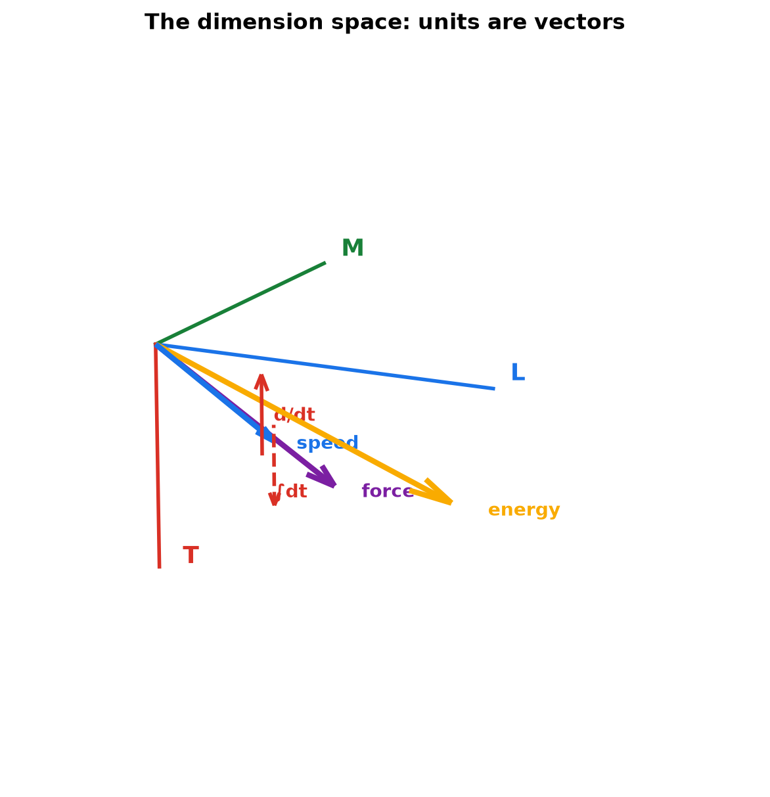
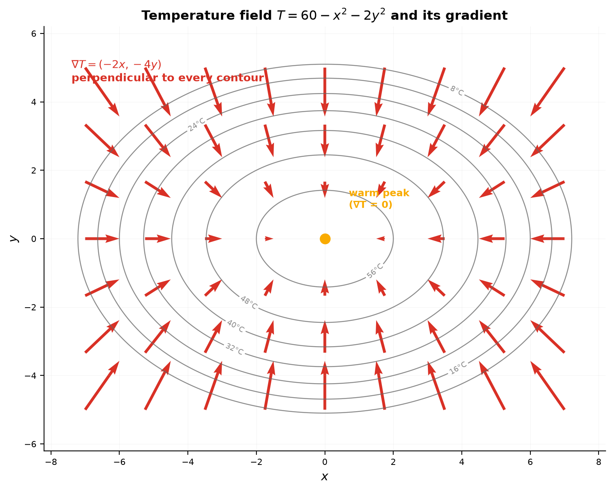
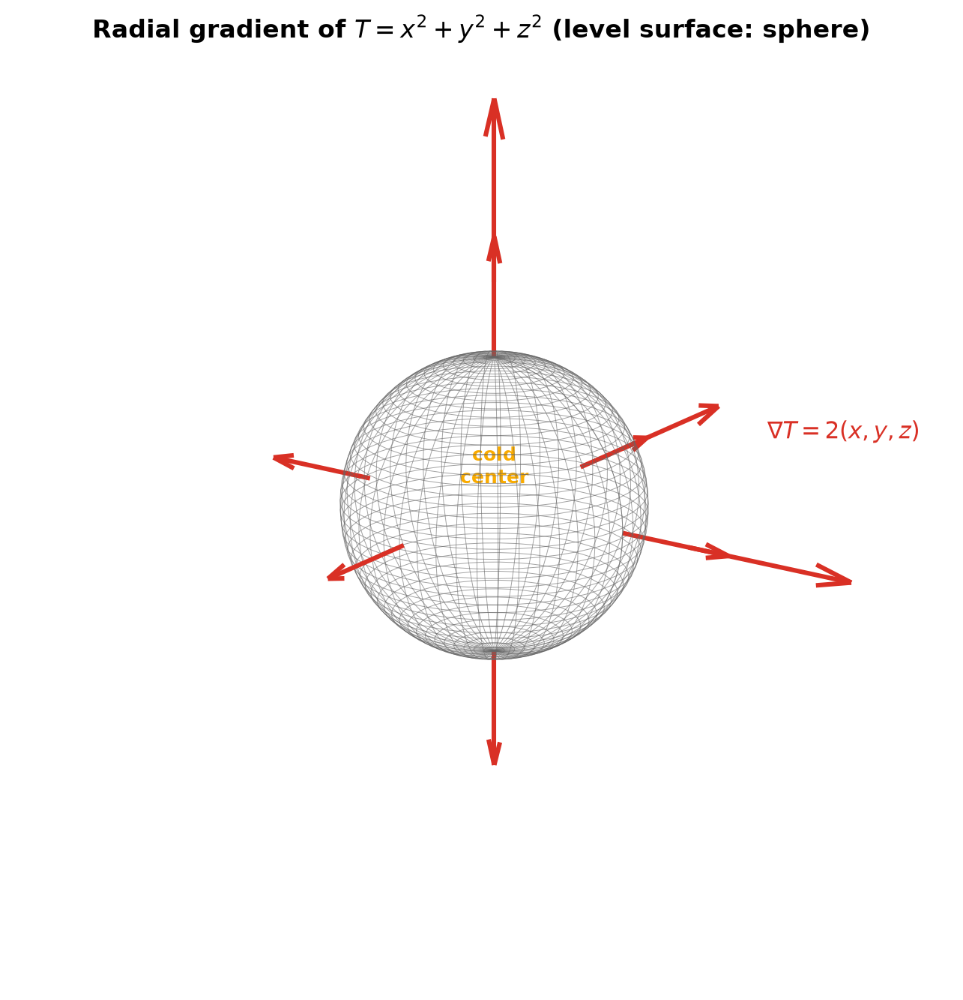
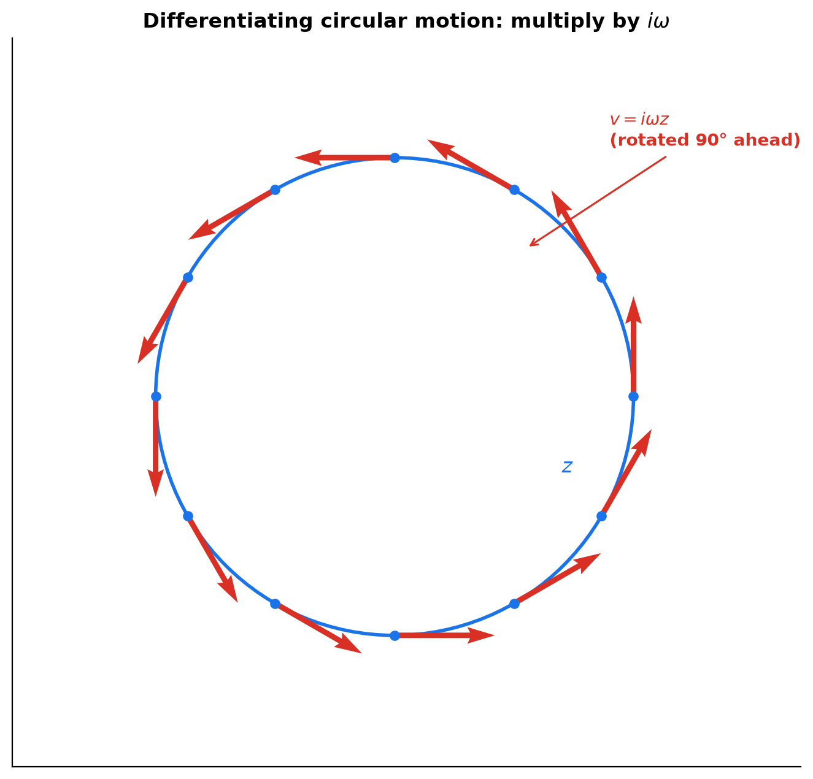
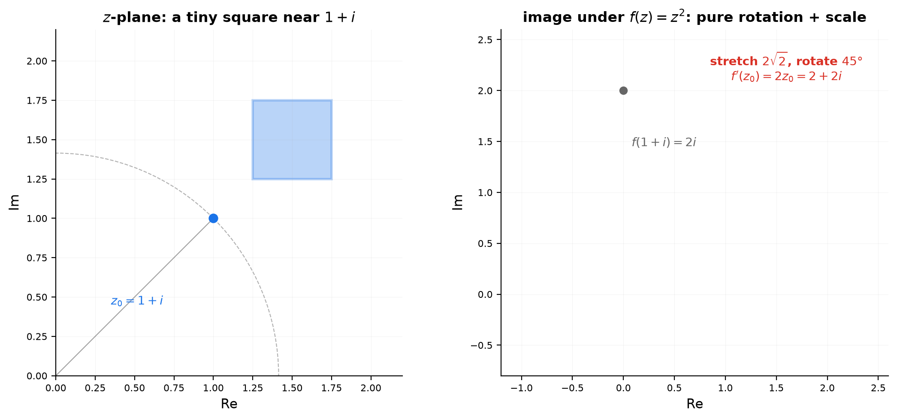
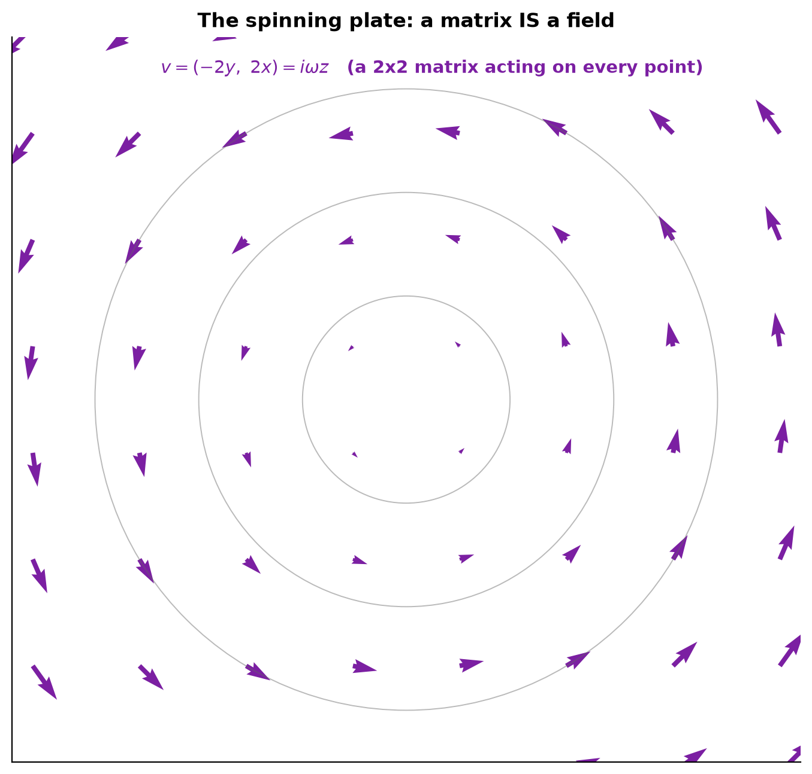

# Session 14D2: Advanced Derivative Interpretation — Fields and Abstract Units

**Phase 2 — Classical Techniques | 90 min**

*14D1 taught you to read a single rate. This session zooms out: a derivative is no longer one number at one point — it is a **field**: an object living at every point, with direction, size, and units of its own. You will abstract units into a vector space, read temperature fields through their gradients, watch complex numbers turn differentiation into rotation, and see matrix fields as stretching machines. The payoff: the four topics you already know — 2D geometry, 3D surfaces, complex numbers, matrices — become one picture.*

**Prerequisites**: 14D1 (reading rates), 9B (2D geometry & parametric curves), 9C (3D surfaces & level curves), 12A1 (complex numbers), 12A2 (matrices & vectors)

> 💡 **Stuck?** Every problem has a collapsible **Hint** below it — click it only when you need a nudge.

---

## Part A: Abstract Units — The Dimension Space

> **The procedure**: Treat each physical dimension (length, mass, time, …) as a basis vector. Write every quantity's units as a vector in that space. All unit checking becomes vector arithmetic — and differentiation becomes a linear operator on the space.

---

## Example 1: Units Are Vectors in the Dimension Space

Fix the basis $\{\mathrm{L}, \mathrm{M}, \mathrm{T}\}$ (length, mass, time). A unit is a column of exponents:

| Quantity | Unit | Dimension vector |
|:---:|:---:|:---:|
| speed | m/s | $1\mathrm{L} - 1\mathrm{T}$ |
| acceleration | m/s² | $1\mathrm{L} - 2\mathrm{T}$ |
| force | kg·m/s² | $1\mathrm{M} + 1\mathrm{L} - 2\mathrm{T}$ |
| energy | kg·m²/s² | $1\mathrm{M} + 2\mathrm{L} - 2\mathrm{T}$ |
| density | kg/m³ | $1\mathrm{M} - 3\mathrm{L}$ |

**The rules are pure vector arithmetic**:
- Multiply two quantities = **add** their dimension vectors ($m\cdot s$: $\mathrm{L}+\mathrm{T}$).
- Raise to a power = **scale** the vector ($\mathrm{m}^3$: $3\mathrm{L}$).
- Divide = subtract.
- Add two quantities = allowed **only if the vectors are equal** (you can add meters to meters, never meters to seconds).

**The deep observation**: differentiating with respect to $t$ **subtracts $\mathrm{T}$** from the dimension vector. Integrating with respect to $t$ **adds $\mathrm{T}$**. The derivative and the integral are linear operators on the dimension space — and they are exact inverses, moving every vector one step along the time axis. Units already knew calculus; the dimension space is where they practice it.

**Worked check**: is $\frac12 gt^2$ a length? $[g] = \mathrm{L}-2\mathrm{T}$, $[t^2] = 2\mathrm{T}$. Sum: $\mathrm{L}$. ✓ The check is one vector addition.



*Graph 14D2-1: Speed, force, and energy as vectors in the {L, M, T} dimension space. Differentiation (d/dt) and integration (∫dt) are arrows that move every vector one step along the time axis.*

---

## Example 2: Dimensionless Arguments — Where Units Must Die

$\sin x$, $e^x$, $\ln x$ only accept **dimensionless** $x$. Why: their definitions add different powers —

$$e^x = 1 + x + \frac{x^2}{2} + \frac{x^3}{6} + \cdots$$

If $x$ were 2 meters, the series would add a pure number, a length, an area, a volume. That sum has no meaning — every term has a different dimension vector. Transcendental functions *require* the argument to have dimension vector $0$.

**Consequences you already use**:
- $e^{rt}$ needs $[r] = -\mathrm{T}$ (a rate). "r = 5%" really means 5% *per year*.
- $\sin(\omega t)$ needs $[\omega] = -\mathrm{T}$ (an angular frequency).
- Radians are **dimensionless**: rad = (arc length)/(radius) = $\mathrm{L}-\mathrm{L} = 0$. That is why angles flow through trig functions freely — and why $e^{i\theta}$ (12A1) is meaningful.

**The error-catcher**: "the answer is $e^{3t}$ meters" is not merely wrong — it is meaningless, like adding $\$5$ to 5 apples. Units are the first thing a field calculation must satisfy; every rung of this session carries them.

---

## Part B: Scalar Fields and the Gradient — The Derivative of a Field

> **The procedure**: A scalar field assigns a number (with units) to every point. Its derivative is a **vector field** — the gradient — pointing up the steepest slope. Read a field the way 9C taught you to read contour maps: arrows and contour lines tell the same story.

---

## Example 3: Temperature on a Plate — Slices and Partial Rates (🔗 9C)

A metal plate at position $(x,y)$ has temperature $T(x,y) = 60 - x^2 - 2y^2$ (°C). (In 9C's language, this is an elliptic paraboloid; its level curves are ellipses.)

**Slice along $x$** (hold $y$ fixed): $\frac{\partial T}{\partial x} = -2x$. Sentence: "walking one meter in the $+x$ direction at this point changes the temperature by about $-2x$ °C." It is 14D1's rate, but *one direction at a time*.

**Slice along $y$**: $\frac{\partial T}{\partial y} = -4y$. The $y$-rate is twice as steep — the ellipse is taller than wide (9C's sign-pattern insight, read as a rate).

At $(3,1)$: $\frac{\partial T}{\partial x} = -6$ °C/m, $\frac{\partial T}{\partial y} = -4$ °C/m.



*Graph 14D2-2: Level curves (ellipses, 9C style) of $T=60-x^2-2y^2$ with gradient arrows. Arrows cross contours at right angles; short arrows near the warm center, long arrows on the steep outer slopes.*

---

## Example 4: The Gradient — All Directions at Once

Stack the two partial rates into one vector:

$$\nabla T = \left(\frac{\partial T}{\partial x},\ \frac{\partial T}{\partial y}\right) = (-2x,\ -4y) \quad [^\circ\mathrm{C/m}].$$

At $(3,1)$: $\nabla T = (-6,-4)$, magnitude $\sqrt{52} \approx 7.2$ °C/m.

**The three laws of the gradient** (each one is 9C's contour-reading, made precise):

1. **Direction**: $\nabla T$ points in the direction of **steepest ascent** — perpendicular to the level curve through the point.
2. **Magnitude**: $|\nabla T|$ is the steepness. Tight contours (9C) = long arrows.
3. **Zero**: $\nabla T = 0$ exactly at peaks and pits (at $(0,0)$: the warmest point, 60 °C).

**Why perpendicular?** Walk along a level curve: temperature is constant, so its rate of change is $0$. But the rate along any direction $v$ is the dot product $\nabla T \cdot v$ (12A2). On the level curve, $\nabla T \cdot v = 0$ — the gradient is perpendicular to the curve. The dot product, not coincidence, ties the arrow field to the contour map.

**Heat flows downhill**: conduction follows $-\nabla T$ — away from the warm center, across contours. A vector field was born from a scalar field by differentiating.

---

## Example 5: 3D — The Gradient of a Room (🔗 9C)

$T(x,y,z) = x^2 + y^2 + z^2$ (°C in a room; level surfaces are spheres, 9C's quadric).

$$\nabla T = (2x, 2y, 2z) = 2(x,y,z).$$

**Read the field**: at every point, the arrow points **straight away from the origin** (along the position vector), with length $2r$ — twice the distance to the heat source at the center. The field is a porcupine: all arrows radiate outward, growing linearly. At $r=0$ the gradient vanishes — the coldest point.

**The general principle of this session**: *differentiating a scalar field produces a vector field.* Numbers in → arrows out. Every example in 14D1 was the one-variable special case of this; the gradient is the honest, full-dimensional derivative.



*Graph 14D2-3 (3D): The gradient field of $T=x^2+y^2+z^2$ — arrows radiate from the heat source, growing with distance. Level surfaces (spheres) sit perpendicular to the arrows.*

---

## Part C: The Complex Field — Differentiation As Rotation (🔗 12A1)

> **The procedure**: Recall from 12A1: multiplying by a complex number = rotate by its argument + scale by its modulus. Differentiating turns out to be multiplication by a complex number — so in the complex field, *differentiation is a rotation+scale, point by point.*

---

## Example 6: Circular Motion — The Derivative Is a Quarter-Turn Ahead

$z(t) = e^{i\omega t}$ traces a circle (12A1's polar form). Differentiate:

$$\frac{dz}{dt} = i\omega\, e^{i\omega t} = i\omega z(t).$$

Read it as a sentence: **the velocity is the position rotated 90° ahead** (multiply by $i$, the 90° rotation from 12A1) **and scaled by $\omega$**. Speed $= \omega r$; direction is tangent to the circle — exactly what wheels do. Units: $\omega$ has dimension $-\mathrm{T}$ (Example 2), so the result is speed.

**The field picture**: at every point of the rim, draw the velocity arrow $i\omega z$. You get a field of arrows tangent to circles — the *velocity field of a rotating body*. Differentiating the position field $z \mapsto z$ along the flow produced it.

Differentiate again: $\frac{d^2z}{dt^2} = i\omega\cdot i\omega z = -\omega^2 z$ — the acceleration points **inward**, magnitude $\omega^2 r$ (centripetal). Each differentiation adds another quarter-turn.



*Graph 14D2-4: The velocity field $v = i\omega z$ of a rotating rim. Every arrow is the position vector rotated a quarter-turn ahead — the geometry of complex multiplication.*

---

## Example 7: The Complex Derivative As a Local Lens

For $f(z) = z^2$ near a point $z_0$: $f(z_0 + h) - f(z_0) = 2z_0 h + h^2$. For tiny $h$, the $h^2$ dies, and the change is simply

$$\Delta f \approx 2z_0 \cdot h.$$

The derivative $f'(z_0) = 2z_0$ is itself a complex number: it **stretches by $|2z_0|$** and **rotates by $\arg(2z_0)$** — exactly 12A1's multiplication geometry.

At $z_0 = 1+i$: $f'(z_0) = 2+2i$, modulus $2\sqrt2 \approx 2.83$, argument $45°$. Sentence: "near $1+i$, the map $z^2$ behaves like a magnifying glass that enlarges small shapes $2.83\times$ and turns them $45°$." Each point has its own lens — $f'$ is a **field of lenses**.

**The criterion**: a function is complex-differentiable only if its effect is locally pure rotation+scale — *no shear*. The conjugate map $f(z) = \bar z$ fails: near any point it flips the plane (a reflection), and no lens can turn everything the same way (see A5). This one condition — "locally a lens" — silently powers everything analytic in mathematics.



*Graph 14D2-5: A tiny square near $1+i$ under $f(z)=z^2$. The square is stretched $2.83\times$ and rotated $45°$ — no shear. The derivative $2z_0$ is the lens.*

---

## Part D: Vector Fields As Linear Operators (🔗 12A2)

> **The procedure**: A linear map $x \mapsto Ax$ is the simplest field: at every point, the same stretching machine. Read its eigen-directions (pure stretch lines), its determinant (area scaling), and its trace (total stretching — the preview of 16C2's divergence).

---

## Example 8: The Rotation Field Is the Matrix $i$ (🔗 12A2 + 12A1)

A rigid plate spins with angular velocity $\omega$. The velocity of the point $r=(x,y)$ is $\omega \times r$ (12A2's cross product, flattened to 2D):

$$v = (-\omega y,\ \omega x) = \begin{pmatrix}0 & -\omega \\ \omega & 0\end{pmatrix}\begin{pmatrix}x \\ y\end{pmatrix}.$$

But $\begin{pmatrix}0 & -1 \\ 1 & 0\end{pmatrix}$ is **exactly the matrix of $i$** from 12A1 (the 90° rotation). The spinning plate's velocity field is literally multiplication by $i\omega$:

$$v = i\omega z.$$

Two sessions you studied separately — 12A1's complex arithmetic and 12A2's matrices — describe the **same field**. The complex field $\mathbb{C}$ is the 2D rotation-plus-scale field. This is the "abstract units" payoff: a new number system was invented (12A1: "why we need complex numbers") precisely because it encodes a field.

At $\omega=2$, the point $(3,3)$ moves with velocity $(-6,6)$ — speed $\sqrt{72} \approx 8.49$.



*Graph 14D2-6: The velocity field of a spinning plate — $v = \omega \times r$, the same arrows as multiplication by $i\omega$. A 2×2 matrix IS a vector field.*

---

## Example 9: Reading a Linear Field — Trace, Determinant, Eigen-directions

Take $A = \begin{pmatrix}2 & 0 \\ 0 & 3\end{pmatrix}$: the field $x \mapsto Ax$ stretches the $x$-axis $2\times$ and the $y$-axis $3\times$.

- **Eigen-directions** = the axes: along each, motion is a **pure stretch** with no turn (12C1's eigenvectors, previewed here). Reading a field starts by finding these "clean lanes."
- **Determinant** (12A2) $= 2\cdot 3 = 6$: a small region's **area grows $6\times$ per unit time** — the field is "spreading."
- **Trace** $= 2 + 3 = 5$: the **sum of the two stretch rates**. A tiny square grows its sides by $2+3=5$ (to first order) — the trace is the field's **divergence**: how much the field squirts outward per point. (16C2 makes this an integral theorem.)

**Add shear**: $A = \begin{pmatrix}2 & 1 \\ 0 & 3\end{pmatrix}$. Trace $=5$, determinant $=6$ — **unchanged**. Shear stretches and turns but does not spread or rescale area: a parallelogram built by shear has the same area and the same edge-growth as the rectangle. Trace and determinant are *fingerprints* of the field that survive shear — the first step of reading any linear field.

---

## Example 10: The Field Ladder — This Session's Whole Arc

```
scalar field   --gradient-->   vector field   --divergence-->   scalar field
T(x,y) °C           ∇T °C/m        arrows        div (1/m)      source density
```

- 14D2 built the **first arrow**: differentiating a scalar field gives a vector field (temperature → heat flow; position → velocity).
- The **second arrow** (differentiating a vector field into a scalar "spreading" field) is 16C2's subject — and the integral of that spreading equals the total outflow (Gauss's law).
- Every rung carries units: $[\nabla T] = [T]/\mathrm{L}$, $[\mathrm{div}] = 1/\mathrm{L}$. The dimension space (Part A) is the ledger that keeps all rungs honest.

> **Up to here**: units are vectors in a dimension space, and d/dt subtracts the time axis; transcendental functions need dimensionless arguments; a scalar field's derivative is the gradient — steepest ascent, perpendicular to contours, in units of field per meter; in ℂ the derivative is a rotation+scale lens; a matrix is a field, read by trace, determinant, and eigen-directions.

---

## The Field Reading Checklist

> When a field appears, run this. It is the whole session in one box.

```
1. TYPE        → scalar field (number per point) or vector field (arrow per point)?
2. UNITS       → dimension vector of the field; gradient is field-units per meter.
3. CONTOURS    → level curves/surfaces (9C). Arrows cross them at right angles.
4. ZERO SET    → where the gradient vanishes: peaks, pits (and saddles).
5. LENS        → at one point, is the effect a rotation+scale? (complex) or
                 pure stretch on eigen-lanes? (matrix)
6. LADDER      → what does one more differentiation produce?
                 scalar → gradient → divergence.
```

---

## Common Mistakes

### Mistake 1: Treating units as decoration

**Wrong**: writing $e^{3t}$ meters and calling it a solution. **Right**: $e^{3t}$ can only be dimensionless — the exponential must have a dimensionless argument, and the "3" must carry units $s^{-1}$. Dimension-vector checks catch errors before any number is computed.

### Mistake 2: Confusing the partial rate with the gradient

**Wrong**: "$\frac{\partial T}{\partial x} = -6$, so the steepest direction is along $x$." **Right**: the steepest direction is the *vector* $(-6,-4)$; the $x$-rate is only its $x$-slice. Steepest ascent is along the arrow, not along an axis.

### Mistake 3: Gradient parallel to contours

**Wrong**: drawing $\nabla T$ along the level curve. **Right**: the gradient is **perpendicular** to the level curve — walking along a contour changes nothing, so the maximal-change direction must cross it.

### Mistake 4: Thinking complex multiplication changes length only

**Wrong**: reading $i\omega z$ as just a scale $\omega$. **Right**: $i$ rotates 90°; the velocity of circular motion is perpendicular to position. Forgetting the rotation produces motion that is not circular.

### Mistake 5: Believing every local map has a complex lens

**Wrong**: "$\bar z$ is differentiable with derivative something." **Right**: reflections cannot be represented by a single rotation+scale — the limit along the real axis ($1$) differs from the limit along the imaginary axis ($-1$). No lens, no derivative.

---

## What We Just Did

```
(1) Abstract units: dimension vectors in basis {L, M, T}. Multiply = add vectors.
    d/dt subtracts T from the vector; ∫dt adds it. e^x, sin x need dimensionless x.

(2) Scalar field → gradient vector field:
    ∇T = (∂T/∂x, ∂T/∂y). Steepest ascent; ⊥ contours; |∇T| = steepness; 0 at peaks.

(3) Complex derivative = rotation+scale lens: dz/dt of e^{iωt} is iωz (quarter-turn ahead).
    f'(z₀) stretches by |f'(z₀)| and rotates by arg f'(z₀). z̄ has no lens.

(4) Matrix as field: v = ω×r = iωz (rotation field). Trace = divergence = total
    stretching; determinant = area scaling; eigen-directions = pure-stretch lanes.

(5) The ladder: scalar field →(gradient)→ vector field →(divergence)→ scalar field.
```

---

## Practice 1

Write the dimension vectors (basis $\{\mathrm{L},\mathrm{M},\mathrm{T}\}$) of: speed, force, energy, and power. Then check dimensionally: (a) $E = \frac12 mv^2$, (b) $P = Fv$, (c) $\frac12 gt^2$.

<details>
<summary>💡 Hint</summary>

Speed $=\mathrm{L}-\mathrm{T}$; force $=\mathrm{M}+\mathrm{L}-2\mathrm{T}$; energy $=\mathrm{M}+2\mathrm{L}-2\mathrm{T}$; power $=\mathrm{M}+2\mathrm{L}-3\mathrm{T}$ (energy per time). Each check is a vector sum.

</details>

→ Solutions: [Solutions](solutions/14D2-solutions.md#practice-1)

---

## Practice 2

For the plate $T(x,y) = 60 - x^2 - 2y^2$: (a) compute the two partial rates at $(3,1)$; (b) write the gradient there and its magnitude; (c) say in one sentence what the gradient tells a person standing at $(3,1)$.

<details>
<summary>💡 Hint</summary>

$\frac{\partial T}{\partial x} = -2x$, $\frac{\partial T}{\partial y} = -4y$. The sentence has a direction, a steepness, and units °C/m.

</details>

→ Solutions: [Solutions](solutions/14D2-solutions.md#practice-2)

---

## Practice 3

$z(t) = e^{i3t}$ (meters). Find the velocity and acceleration. What is the speed, where does the velocity point relative to the position, and where does the acceleration point?

<details>
<summary>💡 Hint</summary>

Differentiate twice; each derivative multiplies by $i3$. $i$ = quarter-turn ahead; $i^2 = -1$ = half-turn (inward).

</details>

→ Solutions: [Solutions](solutions/14D2-solutions.md#practice-3)

---

## Practice 4

For $f(z) = z^2$ at $z_0 = 1+i$: state the local stretch factor and rotation angle. Describe what happens to a tiny square placed at $1+i$.

<details>
<summary>💡 Hint</summary>

$f'(z_0) = 2z_0 = 2+2i$. Read its modulus and argument (12A1).

</details>

→ Solutions: [Solutions](solutions/14D2-solutions.md#practice-4)

---

## Practice 5: Real Battle — Reading the Spinning Plate

The velocity field of a spinning plate is $v(x,y) = (-2y,\ 2x)$ (m/s). (a) Compute the velocity at $(3,3)$ and its speed. (b) Identify $\omega$. (c) Is there a scalar field whose gradient is this field? Explain in one sentence.

<details>
<summary>💡 Hint</summary>

(b) $\omega = 2$. (c) A gradient field is perpendicular to *its own* contours — but this field's arrows are tangent to circles. If a potential existed, walking around a circle would return to the same value — but the field always pushes you forward.

</details>

→ Solutions: [Solutions](solutions/14D2-solutions.md#practice-5)

---

## Practice 6: Real Battle — Fingerprints of a Linear Field

$A = \begin{pmatrix}2 & 1 \\ 0 & 3\end{pmatrix}$ acts as the field $x \mapsto Ax$. Compute the trace and determinant, and explain what each measures. Which directions are pure-stretch lanes?

<details>
<summary>💡 Hint</summary>

Trace $=5$ = total edge-growth (divergence); determinant $=6$ = area scaling. Eigen-lanes: $x$-axis (stretch 2) and the vector $(1,1)$ (stretch 3, since $A(1,1)=(3,3)$).

</details>

→ Solutions: [Solutions](solutions/14D2-solutions.md#practice-6)

---

## Basic Drills

**D1.** Write the dimension vectors of: velocity, acceleration, force, energy.

<details>
<summary>💡 Hint</summary>

$\mathrm{L}-\mathrm{T}$, $\mathrm{L}-2\mathrm{T}$, $\mathrm{M}+\mathrm{L}-2\mathrm{T}$, $\mathrm{M}+2\mathrm{L}-2\mathrm{T}$.

</details>

**D2.** Check dimensionally that $\frac12 mv^2$ and $mgh$ are both energies.

<details>
<summary>💡 Hint</summary>

$[v^2] = 2\mathrm{L}-2\mathrm{T}$, add $\mathrm{M}$: matches $mgh$'s $\mathrm{M}+2\mathrm{L}-2\mathrm{T}$.

</details>

**D3.** Which are meaningless: $e^{3t}$ (t in s), $e^{x}$ (x in m), $\sin(2t)$ (t in s), $\sin(2x)$ (x in m)?

<details>
<summary>💡 Hint</summary>

Meaningful: $e^{3t}$ (the 3 carries $s^{-1}$), $\sin(2t)$. Meaningless: $e^{x}$, $\sin(2x)$ — meters can't enter a transcendental function.

</details>

**D4.** $T(x,y) = x^2 + y^2$. Compute $\frac{\partial T}{\partial x}$ and $\frac{\partial T}{\partial y}$.

<details>
<summary>💡 Hint</summary>

Treat $y$ as a constant while slicing along $x$: $2x$; and vice versa: $2y$.

</details>

**D5.** $T(x,y) = 3x - 4y + 10$ (°C). Find $\nabla T$, its direction, and its magnitude.

<details>
<summary>💡 Hint</summary>

A constant field: $(3,-4)$ everywhere, magnitude $\sqrt{9+16} = 5$ °C/m.

</details>

**D6.** $z(t) = e^{i2t}$. Find the velocity, the speed, and the angle between position and velocity.

<details>
<summary>💡 Hint</summary>

$v = 2i\,e^{i2t}$: speed 2, velocity is $90°$ ahead of position.

</details>

**D7.** The field $F(x,y) = (-3y, 3x)$ at $(2,0)$. Compute the arrow and its length.

<details>
<summary>💡 Hint</summary>

$(0,6)$, length 6 — tangent to the circle through the point, like a spinning plate with $\omega=3$.

</details>

**D8.** $A = \begin{pmatrix}3 & 0 \\ 0 & 2\end{pmatrix}$. Compute trace and determinant and say what each measures.

<details>
<summary>💡 Hint</summary>

Trace $=5$ (total stretch rate), determinant $=6$ (area scaling).

</details>

**D9.** For $T = 60 - x^2 - 2y^2$, where does the gradient vanish? What kind of point is it?

<details>
<summary>💡 Hint</summary>

$\nabla T = 0$ at $(0,0)$ — the warmest point (a peak); heat flows outward from it.

</details>

**D10.** What are the units of $\nabla T$ when $T$ is pressure in Pa over a map in meters?

<details>
<summary>💡 Hint</summary>

Pa/m — pressure per meter. The gradient always has field-units per length.

</details>

> Solutions: [Solutions](solutions/14D2-solutions.md#basic-drill)

---

## Advanced Drills

> Each problem has a computation part AND an interpretation part. Don't skip the explanation parts.

**A1.** Derive the pendulum law by units alone: the period $\tau$ depends only on length $L$ and gravity $g$. Assume $\tau \propto L^a g^b$, solve for $a,b$, and explain why units alone nearly give the whole formula ($\tau = 2\pi\sqrt{L/g}$ — the $2\pi$ is all units cannot see).

<details>
<summary>💡 Hint</summary>

$\mathrm{T} = a\mathrm{L} + b(\mathrm{L}-2\mathrm{T})$: L-coefficient $a+b=0$, T-coefficient $-2b=1$. Solve.

</details>

**A2.** Prove that the gradient is perpendicular to level curves: take a point moving along a level curve with velocity $r'(t)$, differentiate $T(r(t)) = c$ using the chain rule, and read off $\nabla T \cdot r'(t)$.

<details>
<summary>💡 Hint</summary>

$\frac{d}{dt}T(r(t)) = \nabla T \cdot r'(t) = \frac{d}{dt}c = 0$ — the dot product with every tangent direction is zero.

</details>

**A3.** For $T(x,y,z) = x^2 + y^2 + z^2$: (a) write $\nabla T$; (b) describe the arrows at radius $r$; (c) what are the level surfaces, and how do they sit relative to the arrows?

<details>
<summary>💡 Hint</summary>

$2(x,y,z)$: radial, length $2r$. Level surfaces are spheres (9C), crossed perpendicularly by the arrows.

</details>

**A4.** For $f(z) = z^3$ near $z_0 = 1+i$: compute $f'(z_0)$, the stretch factor, and the rotation angle.

<details>
<summary>💡 Hint</summary>

$f'(z_0) = 3z_0^2 = 3(1+i)^2 = 6i$: stretch 6, rotate $90°$.

</details>

**A5.** Show $f(z) = \bar z$ is not complex-differentiable: compute $\frac{f(z_0+h)-f(z_0)}{h}$ along the real direction and along the imaginary direction, and compare.

<details>
<summary>💡 Hint</summary>

$h$ real: quotient $= 1$. $h = it$: quotient $= \frac{-it}{it} = -1$. One lens cannot both keep and flip orientation.

</details>

**A6.** For $F(x,y) = (-\omega y, \omega x)$, compute $\frac{\partial F_2}{\partial x} - \frac{\partial F_1}{\partial y}$ — the spin density. Then compute it for $F=(x,y)$. Which one describes rotation, which describes spreading?

<details>
<summary>💡 Hint</summary>

Spin of $(-\omega y, \omega x)$: $\omega + \omega = 2\omega$ (pure rotation). Spin of $(x,y)$: $0$ (pure spreading). This number is the curl — 16C2 pairs it with divergence.

</details>

**A7.** $A = \begin{pmatrix}2 & 1 \\ 0 & 3\end{pmatrix}$. Compute trace and determinant, find the pure-stretch directions and their stretch factors, and explain why the trace is unchanged by the shear (the off-diagonal 1).

<details>
<summary>💡 Hint</summary>

Trace $=5$, det $=6$. Lanes: $(1,0)$ stretch 2; $(1,1)$ stretch 3 (check $A(1,1)=(3,3)$). Shear redirects flow without changing edge-growth or area.

</details>

**A8.** Newton's cooling: $T(t) = T_0 e^{-t/\tau}$. What units must $\tau$ carry? Why is it called the time constant — what fraction of the gap closes in one $\tau$? Why must the exponent be dimensionless?

<details>
<summary>💡 Hint</summary>

$[t/\tau] = 0$ forces $[\tau] = \mathrm{T}$. After one $\tau$: $e^{-1} \approx 0.368$ — about 63% of the gap closes. The exponent must be dimensionless so the series $1 + x + x^2/2 + \cdots$ adds like terms.

</details>

**A9.** The saddle $z = x^2 - y^2$ (9C). (a) Write $\nabla z$. (b) Read the arrow field: where do arrows point along the $x$-axis? along the $y$-axis? (c) What is special about the origin?

<details>
<summary>💡 Hint</summary>

$\nabla z = (2x, -2y)$: along $x$ arrows point outward, along $y$ inward — a field flowing down two valleys and up two ridges. At the origin the gradient vanishes, but it is neither peak nor pit: a saddle.

</details>

**A10.** Circular motion ladder: for $z = e^{i\omega t}$, show $v = i\omega z$ and $a = -\omega^2 z$. Each differentiation multiplies by $i\omega$: explain what one more quarter-turn does, and why the acceleration is centripetal.

<details>
<summary>💡 Hint</summary>

$i\omega$ rotates 90° and scales. Two rotations $= 180°$: acceleration points opposite position — straight inward, magnitude $\omega^2 r$.

</details>

> Solutions: [Solutions](solutions/14D2-solutions.md#advanced-drill)

---

## Deep Insight

> One problem, pushed to the edge of this session's method. Compute it — then explain *why* the method breaks or holds. The "why" is the whole point.

**DI1.** Close the field ladder. For a scalar field $T(x,y)$, define $\Delta T = \operatorname{div}(\nabla T)$ — the divergence of the gradient. (a) Compute $\Delta T$ for $T=x^2+y^2$, $T=x^2-y^2$, $T=x^3-3xy^2$, and $T=x^2$. (b) The saddle $T=x^2-y^2$ has $\Delta T = 0$: read the arrow field $\nabla T=(2x,-2y)$ and explain in words why the arrows squeeze in one direction exactly as much as they stretch in the other. (c) What does $\Delta T=0$ mean for the average of $T$ on a tiny circle around the point?

<details>
<summary>💡 Hint</summary>

$\Delta T = \frac{\partial^2 T}{\partial x^2}+\frac{\partial^2 T}{\partial y^2}$. For (b): the $x$-arrow growth contributes $+2$ to the divergence, the $y$-arrow shrink contributes $-2$.

</details>

→ Solutions: [Solutions](solutions/14D2-solutions.md#deep-insight)

---

## Today's Procedure

| When you see... | Do this... |
|:---|:---|
| A formula with physical quantities | Write dimension vectors in $\{\mathrm{L},\mathrm{M},\mathrm{T}\}$ and add them up |
| $e^{(\cdot)}$ or $\sin(\cdot)$ with a dimensional argument | Stop — the argument must be dimensionless; find the missing rate/period unit |
| A scalar field $T(x,y)$ | Slice for partial rates, stack into $\nabla T$: uphill, ⊥ contours, field-units/m |
| Circular motion $e^{i\omega t}$ | Differentiate = multiply by $i\omega$: quarter-turn ahead; twice = inward |
| A local map near $z_0$ | Compute $f'(z_0)$: stretch $\lvert f'\rvert$, rotate $\arg f'$ — is there a lens? |
| A linear field $x \mapsto Ax$ | Trace = spreading, determinant = area scaling, eigen-lanes = pure stretches |

---

## How to Read These Symbols

| Symbol | Reads as | Meaning |
|:---:|:---:|------|
| $\mathrm{L},\mathrm{M},\mathrm{T}$ | "length, mass, time" | basis of the dimension space |
| $[Q]$ | "the dimensions of Q" | the dimension vector of quantity Q |
| $\frac{\partial T}{\partial x}$ | "partial T partial x" | rate of change of $T$ along the $x$-direction alone |
| $\nabla T$ | "grad T" / "the gradient" | vector field of steepest ascent: $(\partial T/\partial x,\ \partial T/\partial y)$ |
| $\nabla T \cdot v$ | "grad T dot v" | rate of change of $T$ in direction $v$ |
| $\arg(z)$, $\lvert z\rvert$ | "argument, modulus" | rotation angle and scale factor of multiplication by $z$ |
| $\mathrm{tr}(A)$, $\det(A)$ | "trace, determinant" | total stretch rate and area scaling of the field $x \mapsto Ax$ |

---

## Terminology

| What we call it | Math term | Notation |
|:---:|:---:|:---:|
| units as vectors | dimensional analysis | $[Q] \in \mathrm{span}\{\mathrm{L},\mathrm{M},\mathrm{T}\}$ |
| argument without units | dimensionless quantity | $[x] = 0$ |
| rate along one axis | partial derivative | $\frac{\partial T}{\partial x}$ |
| arrow of steepest ascent | gradient | $\nabla T$ |
| equal-height curves/surfaces | level curves / level surfaces | $T(x,y) = c$ |
| locally a rotation+scale | complex differentiability | $f'(z_0)$ exists |
| pure-stretch directions | eigenvectors / eigen-directions | $Av = \lambda v$ |
| total edge-growth of a field | divergence (16C2) | $\mathrm{tr}(A)$ for linear fields |
| local rotation density | curl (16C2) | $\frac{\partial F_2}{\partial x} - \frac{\partial F_1}{\partial y}$ |
