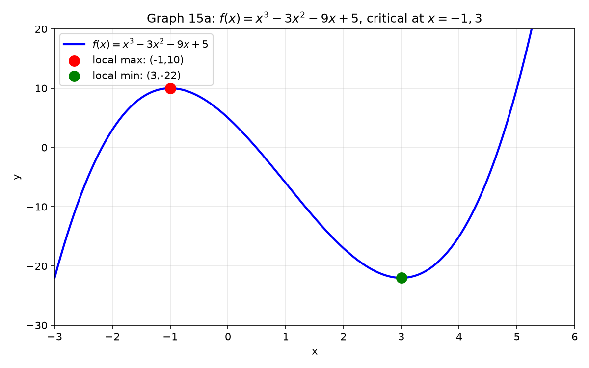
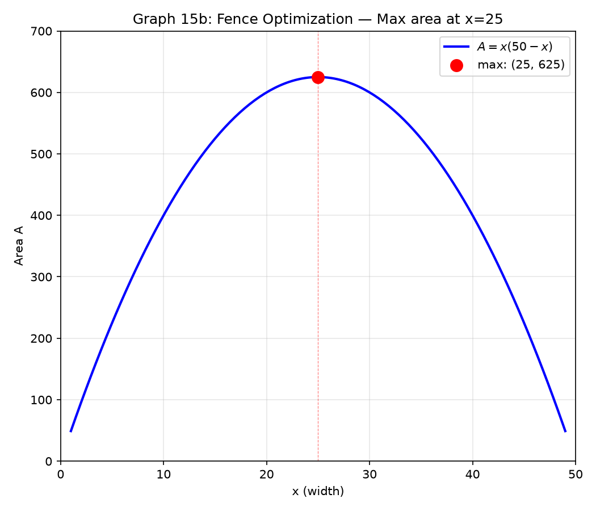

# 세션 15: 미분 응용 — 그래프를 그리고 최적을 찾는다

**Phase 2 — 고전 테크닉 | 105분**

---

## Part A: 접선과 법선

---

## 예시 1: 한 점에서 접선 방정식

$f(x)=x^2$의 $x=3$에서 접선.

① 접점: $(3, f(3)) = (3, 9)$.
② 기울기: $f'(x)=2x$ → $f'(3)=6$.
③ 접선 공식: $y - f(a) = f'(a)(x-a)$.
→ $y - 9 = 6(x-3)$ → **$y = 6x - 9$.**

$f(x)=\ln x$의 $x=1$에서 접선.
① 접점 $(1,0)$. 기울기 $f'(1)=\frac{1}{1}=1$.
→ $y-0 = 1\cdot(x-1)$ → **$y = x-1$.**

---

## 예시 2: 법선 — 접선에 수직인 선

법선 기울기 = $-\frac{1}{f'(a)}$ (접선 기울기의 역수에 −부호).

$f(x)=x^2$의 $x=1$에서 법선.
① 접점 $(1,1)$. 접선 기울기 $f'(1)=2$.
② 법선 기울기: $-\frac{1}{2}$.
→ $y-1 = -\frac{1}{2}(x-1)$ → **$y = -\frac{1}{2}x + \frac{3}{2}$.**

---

## 예시 3: 곡선 밖의 점에서 접선

$f(x)=x^2$에 점 $(0,-1)$에서 그은 접선.

① 접점을 $(t, t^2)$이라 하자. 접선 기울기는 $f'(t)=2t$.
② 접선 방정식: $y - t^2 = 2t(x-t)$.
③ 이 직선이 $(0,-1)$을 지나야: $-1 - t^2 = 2t(0-t) = -2t^2$.
④ $t^2 = 1$ → $t = \pm1$.
⑤ $t=1$: 접선 $y-1=2(x-1)$ → $y=2x-1$.
   $t=-1$: 접선 $y-1=-2(x+1)$ → $y=-2x-1$.
→ **두 접선 존재**.

---

## 예시 3-B: 삼각·지수·로그의 접선

**삼각 접선**: $f(x)=\sin x$, $x=\frac{\pi}{3}$에서.
① 접점 $(\frac{\pi}{3}, \frac{\sqrt{3}}{2})$. 기울기 $f'(\frac{\pi}{3})=\cos\frac{\pi}{3}=\frac{1}{2}$.
② 접선: $y-\frac{\sqrt{3}}{2}=\frac{1}{2}(x-\frac{\pi}{3})$.

**지수 접선**: $f(x)=e^x$, $x=0$에서.
① 접점 $(0,1)$. 기울기 $f'(0)=1$.
② 접선: $y-1=1\cdot(x-0)$ → $y=x+1$. ← $e^x$의 $x=0$ 접선은 항상 $y=x+1$.

**로그 접선**: $f(x)=\ln x$, $x=e$에서.
① 접점 $(e,1)$. 기울기 $f'(e)=\frac{1}{e}$.
② 접선: $y-1=\frac{1}{e}(x-e)$ → $y=\frac{x}{e}$.

**두 곡선의 공통 접선**: $y=e^x$와 $y=\ln x$에 동시에 접하는 직선은?
$y=x+1$ (공통 접선은 존재하지 않음 — 두 곡선은 $y=x$ 대칭).
실제로 $e^x$의 $(0,1)$ 접선은 $y=x+1$, $\ln x$의 $(1,0)$ 접선은 $y=x-1$. 둘은 다르다.

---

## Part B: 평균값 정리(MVT)

---

## 예시 4: MVT — 평균 기울기와 같은 순간이 있다

평균값 정리는 직관적으로 아주 당연한 이야기다. 서울에서 부산까지 5시간 걸렸다면, 그 사이 **적어도 한 순간은 평균 속도와 정확히 같은 속도로 달린 순간이 있다**는 뜻이다. 수학적으로는 곡선 위의 두 점을 잇는 직선과 평행한 접선이 반드시 존재한다는 의미다.

$f(x)=x^2$의 $[1, 4]$에서.

① 평균 기울기: $\frac{f(4)-f(1)}{4-1} = \frac{16-1}{3} = 5$.
② MVT: $f'(c)=5$인 $c\in(1,4)$가 존재.
③ $f'(x)=2x$. $2c=5$ → $c=\frac{5}{2}=2.5$. (1과 4 사이에 있다 ✓)

$f(x)=x^3-x$의 $[0, 2]$에서.
① 평균 기울기: $\frac{(8-2)-0}{2-0} = \frac{6}{2}=3$.
② $f'(x)=3x^2-1=3$ → $3x^2=4$ → $x=\frac{2}{\sqrt{3}}\approx1.155$. ✓

---

## Part C: 증감표와 극값

---

## 예시 5: $f'$ 부호로 증가·감소 판정

$f(x)=x^3-3x^2-9x+5$.

① $f'(x)=3x^2-6x-9 = 3(x^2-2x-3) = 3(x-3)(x+1)$.
② $f'=0$ → $x=-1, 3$. 이 점들이 구간을 셋으로 나눈다.
③ 부호표를 손으로 그려본다:

| 구간 | $x<-1$ | $-1<x<3$ | $x>3$ |
|:---:|:---:|:---:|:---:|
| $f'$ 부호 | + | − | + |
| $f$ | 증가↗ | 감소↘ | 증가↗ |



---

## 예시 6: 극값 — 꼭대기와 바닥

$f'(x)$가 $+ \to -$로 바뀌면 **극대**(꼭대기).
$f'(x)$가 $- \to +$로 바뀌면 **극소**(바닥).

위 $f(x)=x^3-3x^2-9x+5$에서:
$x=-1$: $f'$가 $+\to-$ → **극대**. $f(-1)=-1-3+9+5=10$.
$x=3$: $f'$가 $-\to+$ → **극소**. $f(3)=27-27-27+5=-22$.

---

## 예시 7: $f'=0$인데 극값이 아닌 경우 — 변곡점

$f(x)=x^3$.
$f'(x)=3x^2$. $f'(0)=0$.
하지만 $x=0$ 좌우 모두 $f'>0$. 부호 변화 없음 → **극값 아님**.
$x=0$은 변곡점(아래에서 위로 볼록이 바뀌는 점).

---

## 예시 8: 이계도함수로 극값 판정 — 더 빠르게

$f''(a)>0$ → $x=a$에서 극소 (아래로 볼록 — 움푹).
$f''(a)<0$ → $x=a$에서 극대 (위로 볼록 — 볼록).
$f''(a)=0$ → 판정 불가. 1계도함수 부호변화로 확인.

$f(x)=x^3-3x$. $f'(x)=3x^2-3=0$ → $x=\pm1$.
$f''(x)=6x$.
$x=1$: $f''(1)=6>0$ → 극소. $f(1)=-2$.
$x=-1$: $f''(-1)=-6<0$ → 극대. $f(-1)=2$.

---

## Part D: 오목과 변곡점

---

## 예시 9: $f''$ 부호로 오목 판정

$f''(x)>0$ → 아래로 볼록(오목, concave up) — 움푹 팬 그릇.
$f''(x)<0$ → 위로 볼록(convex, concave down) — 뒤집은 그릇.
$f''(x)=0$이고 부호 바뀌면 → **변곡점**.

$f(x)=x^3-3x^2$.
① $f'(x)=3x^2-6x$. $f''(x)=6x-6 = 6(x-1)$.
② $f''=0$ → $x=1$.
③ $x<1$: $f''<0$ → 위로 볼록. $x>1$: $f''>0$ → 아래로 볼록.
④ 부호 바뀜 → $x=1$은 **변곡점**. $f(1)=1-3=-2$.

---

## Part E: 그래프 개형 — 7단계 완성

---

## 예시 10: 7단계로 그래프 그리기

$f(x)=\frac{x^2}{x-1}$.

**1단계 — 정의역**: $x\neq1$.

**2단계 — 대칭**: $f(-x)\neq\pm f(x)$ → 대칭 없음.

**3단계 — 절편**: $x=0$ → $f(0)=0$. $f(x)=0$ → $x=0$. 원점만.

**4단계 — 점근선**: 수직 $x=1$.
$x\to\infty$일 때 나눗셈: $f(x)=x+1+\frac{1}{x-1}$. 사선 점근선 $y=x+1$.

**5단계 — $f'$과 증감**:
$f'(x)=\frac{2x(x-1)-x^2}{(x-1)^2}=\frac{x^2-2x}{(x-1)^2}=\frac{x(x-2)}{(x-1)^2}$.
$f'=0$ → $x=0,2$.

| 구간 | $(-\infty,0)$ | $(0,1)$ | $(1,2)$ | $(2,\infty)$ |
|:---:|:---:|:---:|:---:|:---:|
| $f'$ | + | − | − | + |
| $f$ | ↗ | ↘ | ↘ | ↗ |

$x=0$: 극대. $f(0)=0$. $x=2$: 극소. $f(2)=4$.

**6단계 — $f''$과 오목**:
$f''(x)=\frac{2}{(x-1)^3}$.
$x<1$: $f''<0$ (위로 볼록). $x>1$: $f''>0$ (아래로 볼록).
변곡점 없음 ($x=1$은 점근선).

**7단계 — 그리기**:
원점 출발, 0에서 극대. $x=1$로 다가가며 $-\infty$. $x=1$ 오른쪽에서 $+\infty$로 시작, 2에서 극소 4, 이후 $y=x+1$에 붙어 증가.

---

## Part F: 최적화 — 가장 좋은 값을 찾는다

---

## 예시 11: 최적화 4단계

최적화는 "무엇을 가장 크게(또는 작게) 만들까?"라는 질문에 답하는 기술이다. 미분의 꽃이라고 할 수 있다. 핵심 전략은 **변수를 하나로 줄이는 것**이다. 보통 제약조건이 하나 주어지는데, 이걸 이용해 변수 하나를 다른 변수로 표현하고, 목적함수에 대입하면 변수가 하나 남는다. 그다음은 미분해서 0 되는 점을 찾고, 이계도함수로 극대/극소를 확인하면 끝.

**문제**: 담장 100m로 직사각형 울타리 최대 넓이.

① **목적함수**: 넓이 $A = xy$.
② **제약**: 둘레 $2x+2y=100$ → $y=50-x$.
③ **대입+미분**: $A(x)=x(50-x)=50x-x^2$. $A'(x)=50-2x=0$ → $x=25$.
④ **검증**: $A''(x)=-2<0$ → 극대. $y=50-25=25$. 최대 넓이 $25\times25=625\text{m}^2$.



---

## 예시 12: 상자 부피 최대화

30cm×30cm 종이의 네 귀퉁이에서 $x$×$x$ 정사각형을 잘라 상자를 만든다.

① 밑면: $(30-2x)\times(30-2x)$. 높이: $x$.
② 부피: $V(x)=x(30-2x)^2 = 4x(15-x)^2$.
③ $V'(x)=4[(15-x)^2 + x\cdot2(15-x)(-1)] = 4(15-x)[(15-x)-2x] = 4(15-x)(15-3x)$.
④ $V'=0$ → $x=15$ (상자 안 됨) 또는 $x=5$.
⑤ $x=5$일 때 $V=5\cdot20^2=2000\text{cm}^3$. $V''(5)<0$ → 최대.

---

## 예시 13: 거리 최소화

점 $(2,0)$에서 곡선 $y=\sqrt{x}$까지 최소 거리.

① 거리 제곱: $D^2 = (x-2)^2 + (\sqrt{x}-0)^2 = (x-2)^2 + x$.
② $D^2$를 최소화해도 $D$를 최소화하는 것과 같다.
③ $\frac{d}{dx}D^2 = 2(x-2) + 1 = 2x-3 = 0$ → $x=\frac{3}{2}$.
④ $y=\sqrt{\frac{3}{2}}$. 최소 거리 = $\sqrt{(\frac{3}{2}-2)^2 + \frac{3}{2}} = \sqrt{\frac{1}{4}+\frac{3}{2}} = \sqrt{\frac{7}{4}} = \frac{\sqrt{7}}{2}$.

---

## 예시 13-B: 삼각 최적화 — 각도가 변수

**문제**: 폭 3m인 복도에서 폭 2m인 복도로 직각으로 꺾을 때, 통과 가능한 가장 긴 막대 길이.

① 막대가 양 벽에 닿는 순간, 각 $\theta$에 대해 막대 길이 $L = \frac{3}{\sin\theta} + \frac{2}{\cos\theta}$.
② $L'(\theta) = -\frac{3\cos\theta}{\sin^2\theta} + \frac{2\sin\theta}{\cos^2\theta} = 0$.
③ $\frac{2\sin\theta}{\cos^2\theta} = \frac{3\cos\theta}{\sin^2\theta}$ → $2\sin^3\theta = 3\cos^3\theta$.
④ $\tan^3\theta = \frac{3}{2}$ → $\tan\theta = \sqrt[3]{1.5}$.
⑤ $\theta \approx 48.2^\circ$. $L \approx 7.02$m.

**문제**: 반지름 $R$인 원에 내접하는 직사각형 중 최대 넓이.
① 가로=$2R\cos\theta$, 세로=$2R\sin\theta$.
② 넓이 $A=4R^2\sin\theta\cos\theta = 2R^2\sin2\theta$.
③ $\sin2\theta$ 최대 = 1 ($\theta=45^\circ$). → 최대 넓이 $2R^2$, 정사각형.

---

## 예시 13-C: 지수·로그 최적화

**문제**: $f(x)=xe^{-x}$의 최댓값.
① $f'(x)=e^{-x} - xe^{-x} = e^{-x}(1-x)$.
② $f'=0$ → $x=1$.
③ $x<1$: $f'>0$ ↗, $x>1$: $f'<0$ ↘ → $x=1$에서 극대.
④ 최댓값 $f(1)=\frac{1}{e}$.

**문제**: $y=x\ln x$ ($x>0$)의 최솟값.
① $y'=\ln x + 1$. $y'=0$ → $\ln x=-1$ → $x=\frac{1}{e}$.
② $y''=\frac{1}{x}>0$ → 극소. 최솟값 $y(\frac{1}{e})=-\frac{1}{e}$.

---

## Part G: 관련비율 — 시간에 따라 변하는 양

---

## 예시 14: 관련비율 3단계

관련비율은 **시간에 따라 변하는 두 양의 관계**를 다룬다. 풍선에 바람을 넣으면 반지름이 변하고, 반지름이 변하면 부피도 변한다. 둘이 따로 움직이는 게 아니라 **하나의 관계식으로 묶여 함께 춤춘다**. 이 관계식을 시간 $t$로 미분하면, 두 변화율 사이의 연결고리가 드러난다.

**문제**: 반지름 5cm인 풍선에 공기를 넣어 반지름이 2cm/s로 증가할 때, 부피 증가율은?

① **관계식**: $V = \frac{4}{3}\pi r^3$.
② **$t$로 미분**: $\frac{dV}{dt} = 4\pi r^2 \frac{dr}{dt}$.
③ **값 대입**: $r=5$, $\frac{dr}{dt}=2$.
$\frac{dV}{dt} = 4\pi\cdot25\cdot2 = 200\pi \text{ cm}^3/\text{s}$.

---

## 예시 15: 사다리 문제

5m 사다리가 벽에 기대어 있다. 아래가 1m/s로 미끄러질 때, 위 끝의 속도는? (바닥에서 3m 떨어졌을 때)

① 피타고라스: $x^2 + y^2 = 25$. ($x$=바닥 거리, $y$=높이)
② $t$로 미분: $2x\frac{dx}{dt} + 2y\frac{dy}{dt} = 0$ → $\frac{dy}{dt} = -\frac{x}{y}\frac{dx}{dt}$.
③ $x=3$, $y=4$, $\frac{dx}{dt}=1$.
$\frac{dy}{dt} = -\frac{3}{4}\cdot1 = -0.75\text{ m/s}$. (음수=아래로)

---

## 예시 16: 원뿔 물탱크

높이 10m, 위 반지름 4m인 원뿔 탱크에 물이 2m³/min로 들어간다. 수위 5m일 때 수위 상승 속도는?

① 닮음비: $\frac{r}{h}=\frac{4}{10}$ → $r=\frac{2}{5}h$.
② 부피: $V=\frac{1}{3}\pi r^2 h = \frac{1}{3}\pi(\frac{2}{5}h)^2 h = \frac{4\pi}{75}h^3$.
③ $\frac{dV}{dt} = \frac{4\pi}{25}h^2\frac{dh}{dt}$.
④ $h=5$, $\frac{dV}{dt}=2$ → $2 = \frac{4\pi}{25}\cdot25\cdot\frac{dh}{dt}$ → $2=4\pi\frac{dh}{dt}$.
→ $\frac{dh}{dt}=\frac{1}{2\pi}\approx0.159\text{ m/min}$.

---

## 예시 17: 지수·로그 관련비율

**인구 증가**: 인구 $P(t)=1000e^{0.05t}$. $t=10$일 때 증가율.
① $\frac{dP}{dt}=1000\cdot0.05e^{0.05t}=50e^{0.05t}$.
② $t=10$: $\frac{dP}{dt}=50e^{0.5}\approx50\cdot1.649=82.45$ 명/년.

**방사성 붕괴**: $N(t)=N_0 e^{-kt}$. $N_0=100$, $k=0.1$. $N=50$일 때 붕괴 속도.
① $\frac{dN}{dt}=-kN_0 e^{-kt}=-0.1\cdot N(t)$.
② $N=50$ → $\frac{dN}{dt}=-0.1\cdot50=-5$ 단위/시간.

**로그 관련**: 온도 $T(t)=20+80e^{-0.2t}$. $T=50$일 때 냉각 속도.
① $T-20=80e^{-0.2t}$. $T=50$ → $30=80e^{-0.2t}$ → $e^{-0.2t}=\frac{3}{8}$.
② $\frac{dT}{dt}=80(-0.2)e^{-0.2t}=-16e^{-0.2t}$.
③ $\frac{dT}{dt}=-16\cdot\frac{3}{8}=-6$ 도/분.

---

## 예시 18: 삼각 관련비율

**레이더 추적**: 비행기가 고도 5km로 수평 비행. 레이더까지 직선거리 13km, 속도 800km/h일 때 레이더 각도의 변화율.
① $\tan\theta = \frac{5}{x}$. ($x$=수평거리)
② $\sec^2\theta\frac{d\theta}{dt} = -\frac{5}{x^2}\frac{dx}{dt}$.
③ $x=\sqrt{13^2-5^2}=12$. $\frac{dx}{dt}=-800$ (가까워짐). $\sec\theta=\frac{13}{12}$.
④ $(\frac{13}{12})^2\frac{d\theta}{dt} = -\frac{5}{144}(-800)$.
⑤ $\frac{d\theta}{dt} = \frac{144}{169}\cdot\frac{4000}{144} = \frac{4000}{169} \approx 23.67$ rad/h $= \frac{4000}{169}\cdot\frac{180}{\pi} \approx 1356$ 도/h.

> **여기까지**: 접선($y-f=f'(x-a)$), MVT, 증감표, 극값(1계+2계), 오목+변곡점,
> 7단계 그래프, 최적화(삼각·지수·로그·거리), 관련비율(기하·삼각·지수·로그).

---

## 자주 하는 실수

### 실수 1: $f'=0$이면 무조건 극값

**틀린 길**: "$f'(0)=0$이니까 $f(0)$은 극값."

**왜 틀렸나**: $f(x)=x^3$은 $f'(0)=0$이지만 극값 아님. 부호 변화 있어야.

**옳은 길**: $f'=0$이고 좌우 부호 바뀌어야 극값.

---

### 실수 2: 최적화에서 2계 미분 검증 생략

**틀린 길**: "$A'(x)=0$ 해가 바로 최대." (최소일 수도)

**왜 틀렸나**: $f'=0$은 극대·극소·변곡점 모두 가능.

**옳은 길**: $f''$ 부호나 좌우 부호변화로 극대인지 확인.

---

### 실수 3: 관련비율에서 단위·부호 누락

**틀린 길**: "$\frac{dy}{dt}=\frac{x}{y}$로 나온다." (부호 확인 안 함)

**왜 틀렸나**: 사다리 꼭대기는 내려가니 $\frac{dy}{dt}<0$.

**옳은 길**: 음수면 감소, 양수면 증가. 실제 상황과 맞는지 확인.

---

## 방금 우리가 한 일

```
① 접선: y-f(a)=f'(a)(x-a). 법선: 기울기=-1/f'(a).
   삼각·지수·로그·곡선밖 접선 모두 같은 공식.
② MVT: 평균기울기와 같은 순간기울기가 구간 안에 존재.
③ 증감표: f' 부호 → 증가(+)/감소(-).
④ 극값: f'=0+부호변화. f''으로 빠른 판정.
⑤ 오목: f'' 부호. 변곡점: f''=0+부호변화.
⑥ 7단계 그래프: 정의역→대칭→절편→점근선→증감→극값→오목.
⑦ 최적화: 목적함수→제약소거→f'=0→검증.
   삼각(내접도형)·지수(xe^{-x})·로그(xlnx) 최적화.
⑧ 관련비율: 관계식→d/dt→값 대입.
   지수(인구·붕괴)·로그(냉각)·삼각(레이더).
```

---

## 연습 1

$f(x)=x^3-3x$의 $x=2$에서 접선과 법선 방정식.

→ 따라하기: **예시 1, 2**

> 풀이: [풀이집](solutions/15-solutions.md#연습-1)

---

## 연습 2

$f(x)=x^3-6x^2+9x+1$의 증감표, 극값, 변곡점, 그래프 개형.

→ 따라하기: **예시 5, 6, 9, 10**

> 풀이: [풀이집](solutions/15-solutions.md#연습-2)

---

## 연습 3

$f(x)=\frac{x}{x^2+1}$의 점근선, 증감, 극값, 변곡점을 모두 구하고 개형을 그려라.

→ 따라하기: **예시 10**

> 풀이: [풀이집](solutions/15-solutions.md#연습-3)

---

## 연습 4: 구성형

$f'(x)=0$이지만 극값이 아닌 예를 하나 만들고, 왜 극값이 아닌지 설명하라.
반대로 $f'(x)=0$이고 극값인 예도 하나 만들어 비교하라.

→ 따라하기: **예시 7**

> 풀이: [풀이집](solutions/15-solutions.md#연습-4)

---

## 연습 5

원기둥 통조림캔 부피 1000cm³일 때, 재료(겉넓이)를 최소화하는 반지름과 높이.

→ 따라하기: **예시 11**

> 풀이: [풀이집](solutions/15-solutions.md#연습-5)

---

## 연습 6

반지름 6cm인 원형 종이에서 부채꼴을 잘라 원뿔을 만들 때, 최대 부피를 위한 중심각은?

→ 따라하기: **예시 12**

> 풀이: [풀이집](solutions/15-solutions.md#연습-6)

---

## 연습 7

길이 3m인 막대기의 양 끝이 $x$축, $y$축을 따라 움직인다. $x$축 끝이 $(2,0)$을 1m/s로 지날 때, $y$축 끝의 속도는? (관련비율)

→ 따라하기: **예시 15**

> 풀이: [풀이집](solutions/15-solutions.md#연습-7)

---

## 연습 8: 실전

$f(x)=\frac{x^2-2x+2}{x-1}$의 그래프 개형을 7단계로 완성하고, $y=mx$가 이 그래프에 접할 때 $m$의 값을 구하라.

→ 따라하기: **예시 10, 3**

> 풀이: [풀이집](solutions/15-solutions.md#연습-8)

---

## 연습 9

$f(x)=e^x\cos x$의 $x=0$에서 접선 방정식.

→ 따라하기: **예시 3-B**

> 풀이: [풀이집](solutions/15-solutions.md#연습-9)

---

## 연습 10

$f(x)=3x^4-4x^3-12x^2+5$의 모든 극값을 구하고 극대·극소를 판정하라.

→ 따라하기: **예시 5, 6**

> 풀이: [풀이집](solutions/15-solutions.md#연습-10)

---

## 연습 11

원기둥 부피 $1000\text{cm}^3$, 겉넓이 최소가 되는 반지름 $r$과 높이 $h$를 구하라.

→ 따라하기: **예시 11**

> 풀이: [풀이집](solutions/15-solutions.md#연습-11)

---

## 연습 12: 실전2

$f(x)=x+\frac{1}{x}$의 그래프 개형을 7단계로 완성하고, $x>0$에서의 최솟값을 구하라.

→ 따라하기: **예시 10, 11**

> 풀이: [풀이집](solutions/15-solutions.md#연습-12)

---

## 오늘 배운 절차

```
1단계: 접선(기울기=f'), 법선(=-1/f'). MVT로 평균=순간 확인.
2단계: f'=0 → 증감표 → 극값 판정(f''보조).
       f''으로 오목·변곡점.
3단계: 7단계 그래프: 정의역·대칭·절편·점근선·증감·극값·오목.
4단계: 최적화 — 다항·삼각·지수·로그 다양한 함수.
       관련비율 — 기하·삼각·지수·로그. 부호 확인 필수.
```

---

## 용어 정리

| 우리가 써온 말 | 수학 용어 | 기호/설명 |
|:------------:|:--------:|:---:|
| 접선 | tangent line | $y-f(a)=f'(a)(x-a)$ |
| 수직인 선 | 법선 | normal line |
| 평균값 정리 | MVT | $f'(c)=\frac{f(b)-f(a)}{b-a}$ |
| 증가·감소표 | 증감표 | sign chart of $f'$ |
| 꼭대기 | 극대 | local maximum |
| 바닥 | 극소 | local minimum |
| 움푹/볼록 | 오목(아래로)/위로 볼록 | concavity, $f''$ 부호 |
| 휘는 점 | 변곡점 | inflection point, $f''=0$+부호변화 |
| 가장 좋은 값 | 최적화 | optimization |
| 시간 따라 변함 | 관련비율 | related rates, $d/dt$ |
