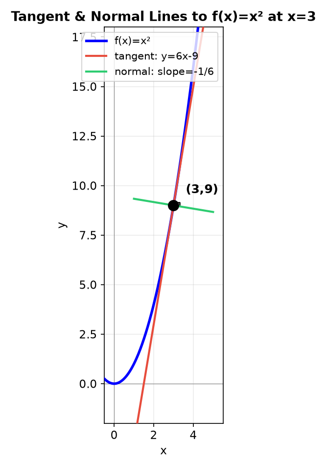
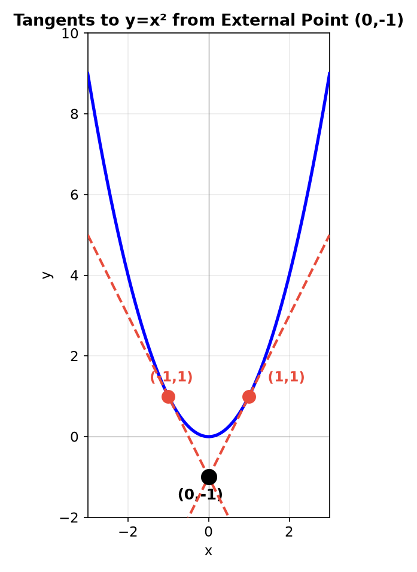
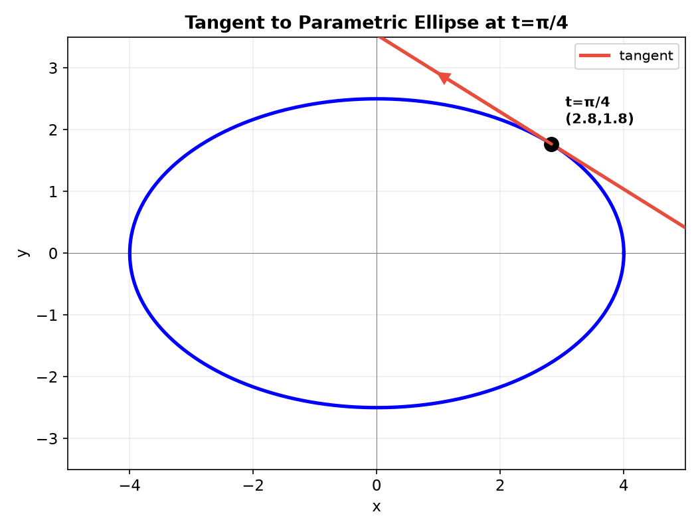
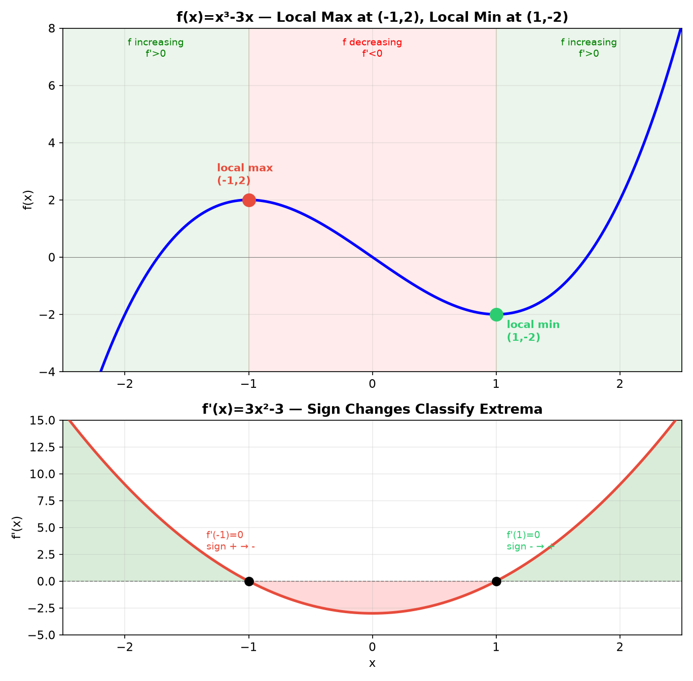
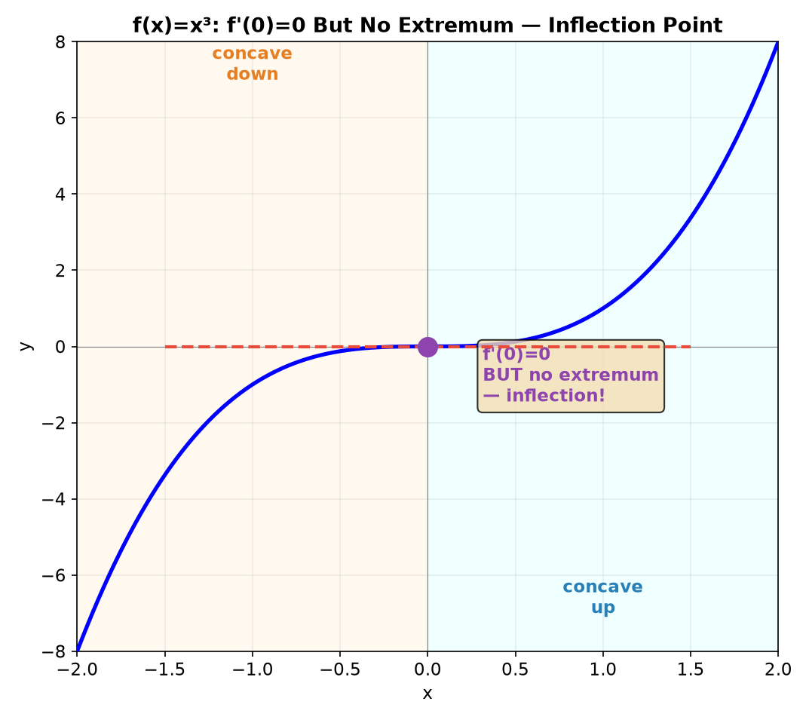
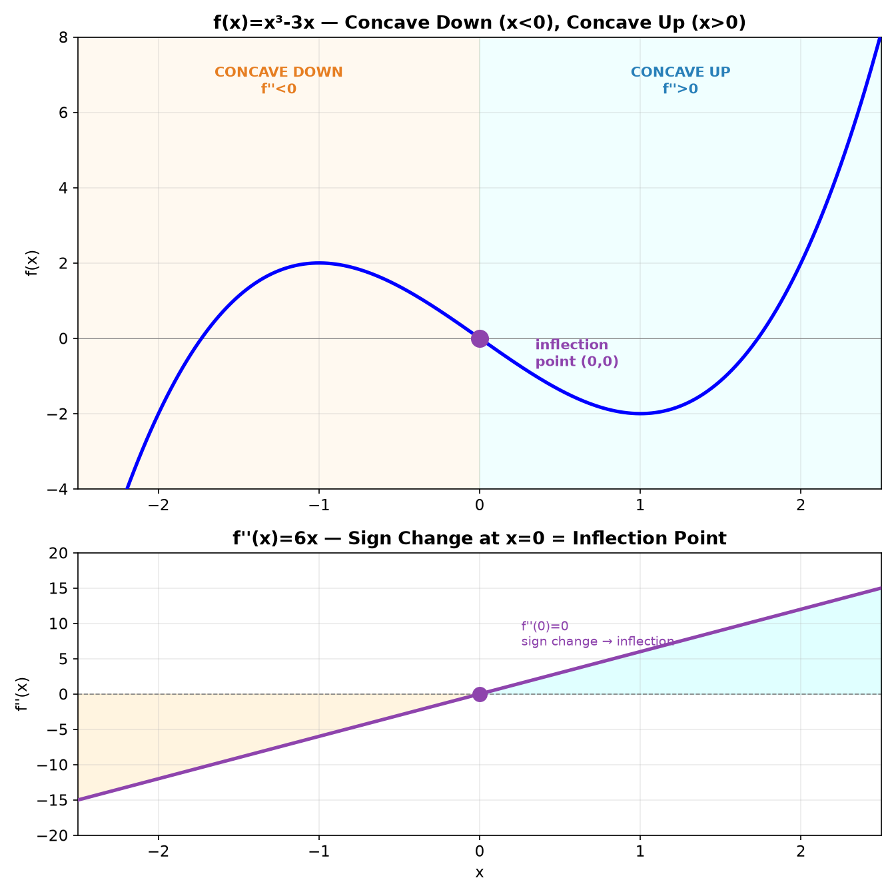
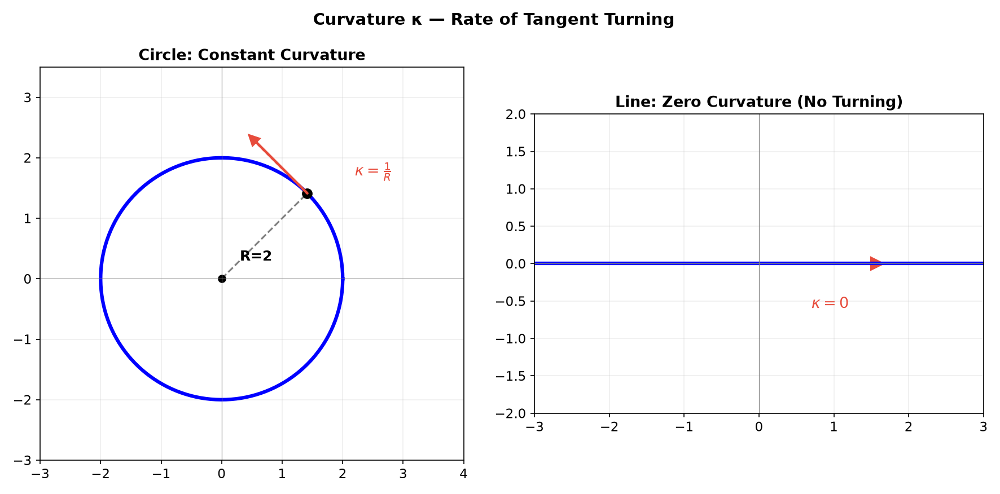
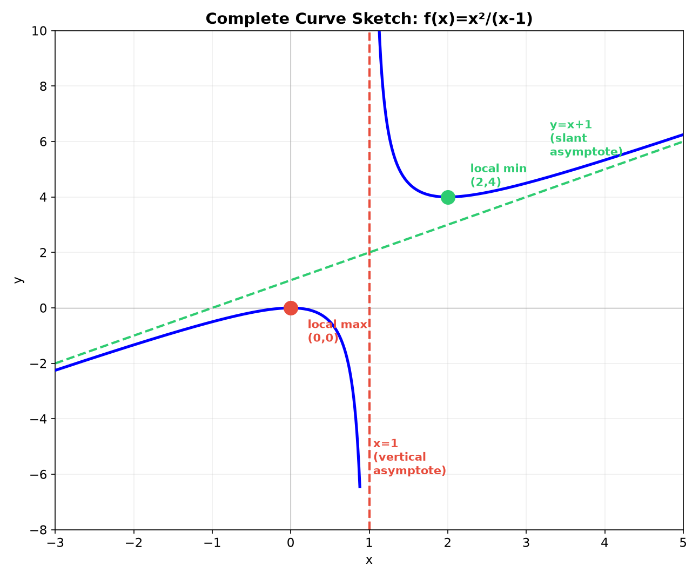
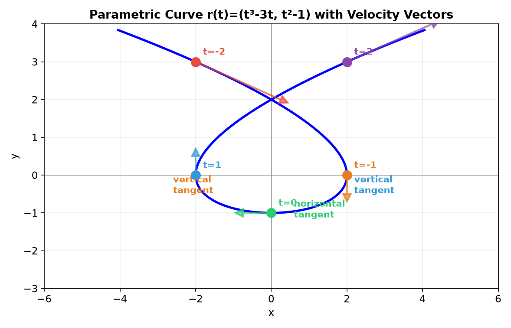

# Session 15A: Curve Analysis — Tangent Lines, Extrema, and Shape Through Geometry

**Phase 2 — Classical Techniques | 80 min**

*Prerequisites: 14A/B (derivatives), 12A2 (matrices & vectors), 12C1 (geometric transformations), 12C2 (parametric curves), 9B (2D geometry)*

> Derivatives tell us slope, curvature, and critical points. But add vectors, matrices, and parametric thinking — and curve analysis becomes a unified geometric language. Tangent lines are linear approximations (matrices). Normals are perpendicular directions (dot product = 0). Curvature is the rate of turning (vector derivatives). Every curve is a moving point whose behavior is governed by its velocity and acceleration.

---

## Part A: Tangent and Normal Lines — Linear Geometry

---

## Example 1: Tangent Line — The Best Linear Approximation

Tangent to $f$ at $x=a$: $y - f(a) = f'(a)(x-a)$.

$f(x) = x^2$ at $x=3$: $f(3)=9$, $f'(3)=6$. Tangent: $y = 6x - 9$.



> **Why "linear approximation"?** The tangent line $L(x) = f(a) + f'(a)(x-a)$ is the best straight-line fit to the curve at $x=a$. Among all lines through $(a, f(a))$, it minimizes the error as $x \to a$. This same idea — approximate a curved thing by a flat thing — is the foundation of all calculus.

---

## Example 2: Normal Line — Perpendicular via Dot Product (🔗 9B, 12A2)

Slope of normal = $-\frac{1}{f'(a)}$ (negative reciprocal).

**Why?** The dot product of direction vectors must be 0 for perpendicularity. Tangent direction: $(1, f'(a))$. Normal direction: $(1, -1/f'(a))$ or $(-f'(a), 1)$.
$(1, f'(a)) \cdot (-f'(a), 1) = -f'(a) + f'(a) = 0$. ✓

For $f(x)=x^2$ at $x=3$: normal slope $=-1/6$, line: $y-9 = -\frac{1}{6}(x-3)$.

> **From 9B**: The perpendicular slope condition $m_1 m_2 = -1$ is exactly the dot product condition $\vec{d}_1 \cdot \vec{d}_2 = 0$ for direction vectors $(1, m_1)$ and $(1, m_2)$.

---

## Example 3: Tangent from an External Point — Solving Geometrically

Find tangents to $y=x^2$ passing through $(0,-1)$.

Let tangency point be $(a, a^2)$. Slope $= 2a$. Tangent line: $y - a^2 = 2a(x - a)$.
Passes through $(0,-1)$: $-1 - a^2 = 2a(0 - a) = -2a^2 \to a^2 = 1 \to a = \pm 1$.
Tangents: $y = 2x - 1$ and $y = -2x - 1$.



> **Geometric meaning**: From a point below a parabola, two tangent lines touch the curve — one on each branch. The tangency points are symmetric about the $y$-axis because the parabola is symmetric.

---

## Example 4: Tangent Line to a Parametric Curve (🔗 12C2)

For $\vec{r}(t) = (x(t), y(t))$, the tangent vector is $\vec{r}{\,}'(t) = (x'(t), y'(t))$.
Slope of tangent = $\frac{y'(t)}{x'(t)}$ (when $x'(t) \neq 0$).

**Ellipse**: $x = a\cos t$, $y = b\sin t$. At $t = \pi/4$:
$\vec{r}{\,}'(\pi/4) = (-a\sin\frac{\pi}{4},\; b\cos\frac{\pi}{4}) = (-\frac{a}{\sqrt{2}},\; \frac{b}{\sqrt{2}})$.
Slope = $\frac{b/\sqrt{2}}{-a/\sqrt{2}} = -\frac{b}{a}$.

Tangent line at $t=\pi/4$: passes through $(a/\sqrt{2}, b/\sqrt{2})$ with slope $-b/a$.
$y - \frac{b}{\sqrt{2}} = -\frac{b}{a}\left(x - \frac{a}{\sqrt{2}}\right) \to \frac{x}{a} + \frac{y}{b} = \sqrt{2}$.

> The tangent to an ellipse has the same intercept form pattern as the ellipse itself — a beautiful geometric harmony.



---

## Part B: Mean Value Theorem — Average Slope Is Attained

---

## Example 5: MVT — There Exists $c$ Where $f'(c)$ Equals the Secant Slope

$f$ continuous on $[a,b]$, differentiable on $(a,b)$ → $\exists c \in (a,b): f'(c) = \frac{f(b)-f(a)}{b-a}$.

$f(x) = x^3$ on $[0,2]$: average slope = $\frac{8-0}{2-0} = 4$. $f'(x) = 3x^2 = 4 \to x = \frac{2}{\sqrt{3}} \approx 1.155$. ✓

> **Geometric meaning**: There is at least one point where the tangent is parallel to the secant. For a car trip averaging 60 mph, you must have been going exactly 60 mph at some moment — you can't average 60 without ever hitting 60.

![MVT: secant and tangent parallel for f(x)=x³ on [0,2]](graphs/0728/15A/03-mvt.png)

---

## Example 6: MVT and Rolle's Theorem — Roots and Critical Points

**Rolle's Theorem** (special case): If $f(a) = f(b)$, then $\exists c \in (a,b)$ with $f'(c) = 0$.

$f(x) = x^3 - 3x$ on $[-\sqrt{3}, \sqrt{3}]$: $f(-\sqrt{3}) = f(\sqrt{3}) = 0$.
$f'(x) = 3x^2 - 3 = 0 \to x = \pm 1$. Both in $(-\sqrt{3}, \sqrt{3})$. Two points where slope = 0 between equal-height endpoints.

> **Between any two roots of $f$, there is a root of $f'$.** This is the geometric bridge between a function and its derivative.

---

## Part C: Increasing, Decreasing, and Extrema — The Derivative's Sign

---

## Example 7: First Derivative Sign Test

$f'(x) > 0$ → increasing. $f'(x) < 0$ → decreasing.

$f(x) = x^3 - 3x$: $f'(x) = 3x^2 - 3 = 3(x-1)(x+1)$.
Sign chart: $(-\infty,-1)$: $f'>0$ (↗). $(-1,1)$: $f'<0$ (↘). $(1,\infty)$: $f'>0$ (↗).

---

## Example 8: Critical Points and Classification

Critical points where $f'=0$ or $f'$ undefined. Classify by sign change:

- $x=-1$: $f'$ goes $+ \to -$ → **local max** at $(-1, 2)$.
- $x=1$: $f'$ goes $- \to +$ → **local min** at $(1, -2)$.



---

## Example 9: Second Derivative Test

$f'(a) = 0$: $f''(a) > 0$ → local min (concave up bowl). $f''(a) < 0$ → local max (concave down cap). $f''(a) = 0$ → inconclusive.

$f(x) = x^3 - 3x$: $f''(x) = 6x$. $f''(-1) = -6 < 0$ → max ✓. $f''(1) = 6 > 0$ → min ✓.

---

## Example 10: $f'=0$ but No Extremum — Inflection with Horizontal Tangent

$f(x) = x^3$: $f'(0) = 0$, but $f'$ doesn't change sign — always positive. No extremum. Instead, $(0,0)$ is an **inflection point** — curvature changes from concave down to concave up, and the tangent is horizontal.

> **Contrast**: $f(x) = x^4$ at $x=0$: $f'(0)=0$, $f''(0)=0$, but $f'$ goes negative → positive → **local min**. The 2nd derivative test fails; the 1st derivative test still works. Always check sign change of $f'$ when $f''$ is zero.



---

## Part D: Concavity and Inflection — The Second Derivative's Geometry

---

## Example 11: Second Derivative Sign and Curvature

$f''>0$: concave up ∪ (slope increasing — curve bends upward).
$f''<0$: concave down ∩ (slope decreasing — curve bends downward).
$f''=0$ or undefined + sign change → **inflection point**.

$f(x) = x^3 - 3x$: $f''(x) = 6x$.
$x<0$: $f''<0$ (concave down ∩). $x>0$: $f''>0$ (concave up ∪). Inflection at $(0,0)$.



---

## Example 12: Curvature — How Fast the Curve Bends

Curvature $\kappa$ measures how sharply a curve turns at a point. For a graph $y=f(x)$, it generalizes the second derivative:

$$\kappa = \frac{|f''(x)|}{(1+[f'(x)]^2)^{3/2}}.$$

For a parametric curve $(x(t), y(t))$, the equivalent formula is $\kappa = \frac{|x'y'' - y'x''|}{((x')^2+(y')^2)^{3/2}}$.

**Circle of radius $R$**: $\vec{r}(t) = (R\cos t, R\sin t)$.
$\vec{r}{\,}' = (-R\sin t, R\cos t)$, $|\vec{r}{\,}'| = R$.
$\vec{r}{\,}'' = (-R\cos t, -R\sin t)$.
$|x'y'' - y'x''| = |(-R\sin t)(-R\sin t) - (R\cos t)(-R\cos t)| = |R^2\sin^2 t + R^2\cos^2 t| = R^2$.
$\kappa = \frac{R^2}{R^3} = \frac{1}{R}$. ✓

> A circle has constant curvature $1/R$. A line has $\kappa = 0$ (no turning). When the slope is small ($f' \approx 0$), $\kappa \approx |f''|$ — the second derivative directly approximates curvature. When the curve is steep, the denominator $(1+(f')^2)^{3/2}$ corrects for the slant: a steep curve covers more $x$-distance per unit of arc length, so the same change in slope produces less actual bending.



---

## Part E: The 7-Step Curve Sketch — Full Analysis

---

## Example 13: Complete Analysis of $f(x) = \frac{x^2}{x-1}$

① **Domain**: $x \neq 1$.
② **Intercepts**: $(0,0)$.
③ **Asymptotes**: Vertical $x=1$ (denominator zero at non-canceled factor). Slant: divide → $x^2 \div (x-1) = x+1 + \frac{1}{x-1}$, asymptote $y = x+1$.
④ **$f'$**: $f'(x) = \frac{2x(x-1) - x^2}{(x-1)^2} = \frac{x(x-2)}{(x-1)^2}$. Critical at $x=0,2$.
- $x=0$: $f'$ goes $+ \to -$ → local max $(0,0)$.
- $x=2$: $f'$ goes $- \to +$ → local min $(2,4)$.
⑤ **$f''$**: $f''(x) = \frac{2}{(x-1)^3}$. Never 0.
- $x<1$: $f''<0$ → concave down.
- $x>1$: $f''>0$ → concave up.
⑥ **Behavior near asymptotes**: As $x \to 1^-$, $f \to -\infty$. As $x \to 1^+$, $f \to +\infty$.
⑦ **Sketch**: Left branch (concave down, peak at origin, dives to $-\infty$ at $x=1$). Right branch (minimum at $(2,4)$, concave up, approaches slant asymptote).



---

## Example 14: Parametric Curve Analysis — Velocity and Acceleration Vectors (🔗 12C2, 12A2)

Analyze $\vec{r}(t) = (t^3 - 3t,\; t^2 - 1)$ for $t \in [-2, 2]$.

**Velocity**: $\vec{v}(t) = \vec{r}{\,}'(t) = (3t^2 - 3,\; 2t) = (3(t-1)(t+1),\; 2t)$.
**Speed**: $|\vec{v}(t)| = \sqrt{9(t^2-1)^2 + 4t^2}$.
**Acceleration**: $\vec{a}(t) = \vec{r}{\,}''(t) = (6t,\; 2)$.

**Is velocity ever zero?** For $\vec{v}(t) = \vec{0}$, BOTH components must be zero simultaneously:
- $x'(t) = 3t^2-3 = 0 \implies t = \pm 1$.
- $y'(t) = 2t = 0 \implies t = 0$.
No single $t$ satisfies both — the components never vanish together. So $\vec{v}(t) \neq \vec{0}$ for all $t$: the curve never stops, has no cusps, and the tangent direction is always well-defined.

**Horizontal tangent**: $y'(t) = 0 \to 2t=0 \to t=0$. Point: $\vec{r}(0) = (0, -1)$. Slope = $0/(-3) = 0$. ✓
**Vertical tangent**: $x'(t) = 0 \to 3(t^2-1)=0 \to t=\pm 1$. Points: $\vec{r}(1) = (-2, 0)$, $\vec{r}(-1) = (2, 0)$.

**Curvature at $t=0$**: $x'=-3, x''=0, y'=0, y''=2$.
$\kappa = \frac{|(-3)(2) - (0)(0)|}{((-3)^2+0^2)^{3/2}} = \frac{6}{27} = \frac{2}{9}$.

> **Geometric synthesis**: Velocity = direction + speed. Acceleration = change in velocity. Together they describe the curve's shape at every instant — the same way $f'$ and $f''$ do for graphs.



---

## What We Just Did

```
(1) Tangent line = linear approximation. Normal = perpendicular via dot product.
(2) MVT: secant slope = tangent slope somewhere. Rolle: equal endpoints → f'=0 between.
(3) f' sign → increase/decrease. f'=0 + sign change → extremum.
(4) f'' sign → concavity. f''=0 + sign change → inflection.
(5) Curvature κ = |r'×r''|/|r'|³ — the geometric invariant.
(6) Parametric analysis: velocity, acceleration, tangent directions, curvature.
(7) 7-step curve sketch: domain, intercepts, asymptotes, f', f'', behavior, sketch.
```

---

## Practice 1

Find the tangent and normal lines to $f(x) = x^3$ at $x=1$. Verify the normal slope via the dot product condition.

→ Solutions: [Solutions](solutions/15A-solutions.md#practice-1)

---

## Practice 2

Find all local extrema of $f(x) = x^4 - 4x^3$ using both the first and second derivative tests. Note any point where the second derivative test is inconclusive.

→ Solutions: [Solutions](solutions/15A-solutions.md#practice-2)

---

## Practice 3 (🔗 12C2)

For the ellipse $\vec{r}(t) = (3\cos t,\; 2\sin t)$, find the tangent line at $t=\pi/3$ and the points where the tangent is horizontal or vertical.

→ Solutions: [Solutions](solutions/15A-solutions.md#practice-3)

---

## Practice 4 (🔗 9B)

Find equations of both tangent lines to $y = x^3$ that pass through $(0,0)$. (Hint: the tangency point is NOT at $x=0$.)

→ Solutions: [Solutions](solutions/15A-solutions.md#practice-4)

---

## Practice 5 (🔗 12C1)

Apply the MVT to $f(x) = e^x$ on $[0, 1]$. Find $c$ and interpret geometrically: what point on the curve has tangent parallel to the secant?

→ Solutions: [Solutions](solutions/15A-solutions.md#practice-5)

---

## Practice 6: Real Battle

$f(x) = \frac{x^2-1}{x^2+1}$. Find domain, intercepts, asymptotes, $f'$, $f''$, all extrema and inflection points. Sketch.

→ Solutions: [Solutions](solutions/15A-solutions.md#practice-6)

---

## Practice 7: Real Battle (🔗 12C2, 12A2)

For $\vec{r}(t) = (t^2,\; t^3 - 3t)$: find velocity, acceleration, speed at $t=1$, horizontal/vertical tangent points, and curvature at $t=0$.

→ Solutions: [Solutions](solutions/15A-solutions.md#practice-7)

---

## Practice 8: Real Battle — Complete Sketch

$f(x) = \frac{x^3}{x^2-1}$. Domain, intercepts, asymptotes, $f'$, $f''$, sketch. (This has a vertical asymptote AND a slant asymptote.)

→ Solutions: [Solutions](solutions/15A-solutions.md#practice-8)

---

## Basic Drills

**D1.** Find the tangent line to $f(x) = x^2 + 2x$ at $x=1$.

**D2.** Find all critical points of $f(x) = x^3 - 6x^2 + 9x$.

**D3.** Classify the critical points from D2 as max/min/neither.

**D4.** Find intervals where $f(x) = x^3 - 3x$ is increasing.

**D5.** Find all inflection points of $f(x) = x^4 - 6x^2$.

**D6.** Determine concavity of $f(x) = \ln x$ on $(0,\infty)$.

**D7.** Apply MVT to $f(x) = \sqrt{x}$ on $[1,9]$. Find $c$.

**D8.** Find the normal line to $f(x) = e^x$ at $x=0$.

**D9.** Find horizontal asymptotes of $f(x) = \frac{x^2}{x^2+4}$.

**D10.** Find all vertical asymptotes of $f(x) = \frac{x}{x^2-9}$.

**D11.** (🔗 9B) For $f(x) = |x^2-4|$, find all points where $f$ is not differentiable. Explain geometrically.

**D12.** (🔗 12C1) Find the tangent line to $f(x) = \sin x$ at $x = \pi/4$. Write the line in point-slope form and verify with a unit-circle geometric check.

**D13.** (🔗 12C2) For $\vec{r}(t) = (t, t^2)$, find $\vec{v}(t)$, $|\vec{v}(t)|$, and the curvature at $t=1$.

**D14.** The tangent line to $f$ at $a$ is the 1st-order Taylor polynomial. For $f(x)=\sqrt{x}$ at $a=4$, find $L(x)$. Use it to approximate $\sqrt{4.1}$ and compare with the true value.

**D15.** $f(x) = x^3 + ax + b$. Find $a, b$ so that $f$ has a local max at $(-1, 2)$ and a local min at $(1, -2)$. (This is a cubic with specified extrema.)

> Solutions: [Solutions](solutions/15A-solutions.md#basic-drill)

---

## Advanced Drills

**A1.** Prove that $f(x) = x^3 + ax + b$ has exactly one inflection point. Find it and show it's always at the origin after horizontal translation.

**A2.** $f(x) = \frac{x}{x^2+1}$. Find all extrema, asymptotes, inflection points. Sketch. (This function has the classic "damped oscillation" shape.)

**A3.** Prove $\frac{x}{1+x} < \ln(1+x) < x$ for $x>0$ by analyzing $F(x) = \ln(1+x) - \frac{x}{1+x}$ and $G(x) = x - \ln(1+x)$.

**A4.** Find the point on $y = \sqrt{x}$ closest to $(2, 0)$.

**A5.** (🔗 12C2) For the cycloid $\vec{r}(t) = (t - \sin t,\; 1 - \cos t)$: find all $t$ where the tangent is horizontal. Interpret geometrically — these are the tops of the arches.

**A6.** A line with slope $m$ through $(0,1)$ is tangent to $y = x^2$. Find all possible $m$.

**A7.** $f(x) = x^4 - 8x^2 + 3$. Find all intervals of increase/decrease, concavity, and all extrema. Sketch.

**A8.** Sketch $f(x) = x e^{-x}$ using $f, f', f''$. Find the global maximum.

**A9.** Show $f(x) = x^3 - 3x + 1$ has exactly three real roots. Use extrema and the Intermediate Value Theorem.

**A10.** Find the tangent to $f(x) = \ln x$ that passes through the origin. (This is the "tangent from external point" problem.)

**A11.** For the logarithmic spiral $\vec{r}(t) = (e^t\cos t,\; e^t\sin t)$: find the angle between the position vector and the velocity vector. Show it's constant — a defining property of this curve.

**A12.** A cubic $f(x) = ax^3 + bx^2 + cx + d$ has an inflection point at $x=0$. Show this forces $b=0$. Then find $a,c,d$ so the function has a local max at $(-1, 2)$ and passes through $(2, 0)$.

> Solutions: [Solutions](solutions/15A-solutions.md#advanced-drill)

---

## How to Read These Symbols

| Symbol | Reads as | Meaning |
|:---:|:---:|------|
| critical point | "critical point" | $f'=0$ or $f'$ undefined — extremum candidate |
| $f'(x)>0$ / $f'(x)<0$ | "f prime positive / negative" | function increasing / decreasing |
| $f''(x)>0$ / $f''(x)<0$ | "f double prime positive / negative" | concave up ∪ / concave down ∩ |
| MVT | "Mean Value Theorem" | $f'(c) = (f(b)-f(a))/(b-a)$ for some $c$ |
| $\kappa$ | "kappa" | curvature — rate of turning of tangent |
| $\vec{r}{\,}'(t)$ | "r prime of t" | velocity vector (direction + speed) |
| $\vec{r}{\,}''(t)$ | "r double prime of t" | acceleration vector |
| inflection point | "inflection point" | curvature changes sign ($f''$ sign change) |

---

## Today's Procedure

```
Step 1: Tangent: point + slope f'(a) → y−f(a)=f'(a)(x−a).
Step 2: Normal: slope = −1/f'(a), verify via dot product perpendicularity.
Step 3: f' sign → increasing/decreasing and extrema. f'' sign → concavity.
Step 4: Parametric: v = r', a = r''. Curvature κ = |r'×r''|/|r'|³.
Step 5: 7-step sketch: domain, intercepts, asymptotes, f', f'', behavior, sketch.
```
