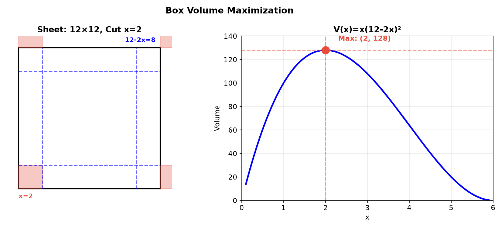
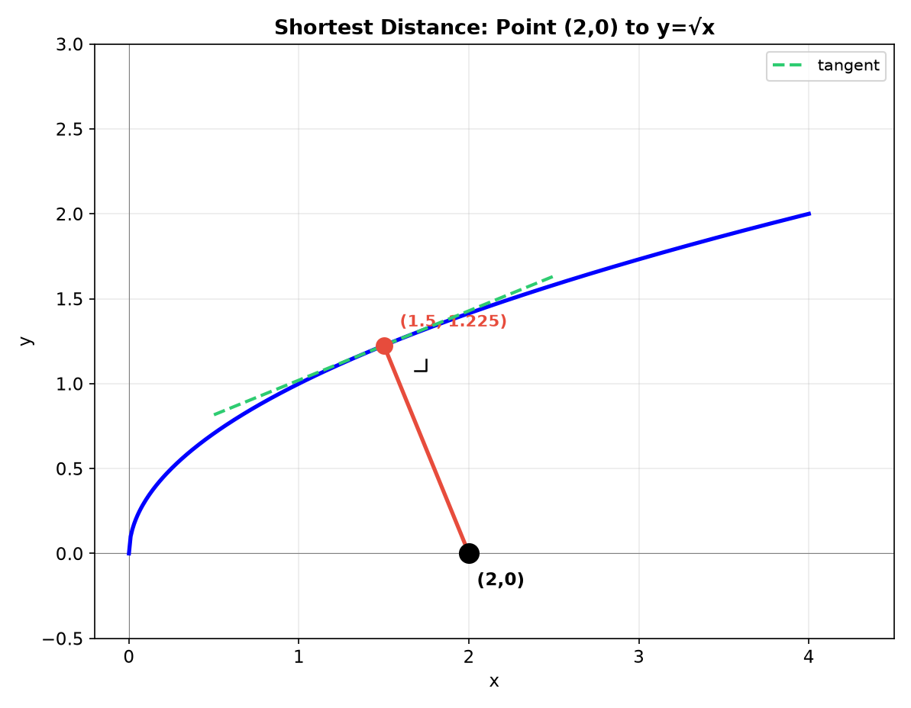
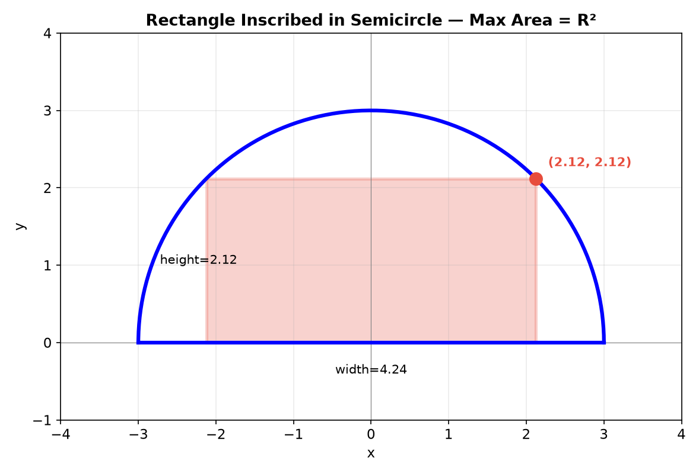
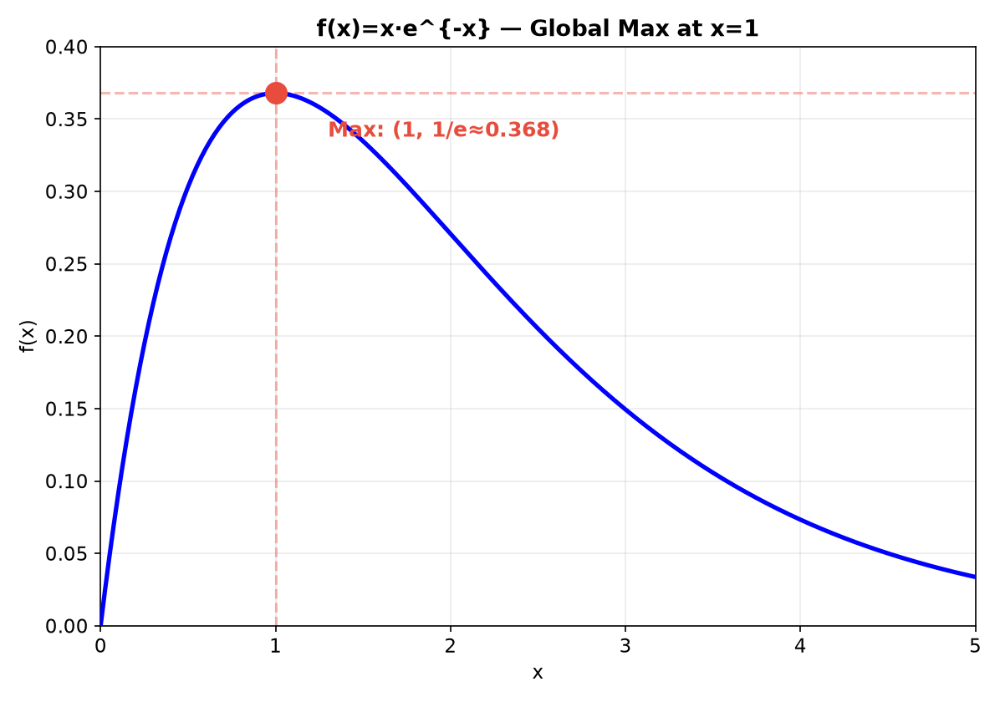
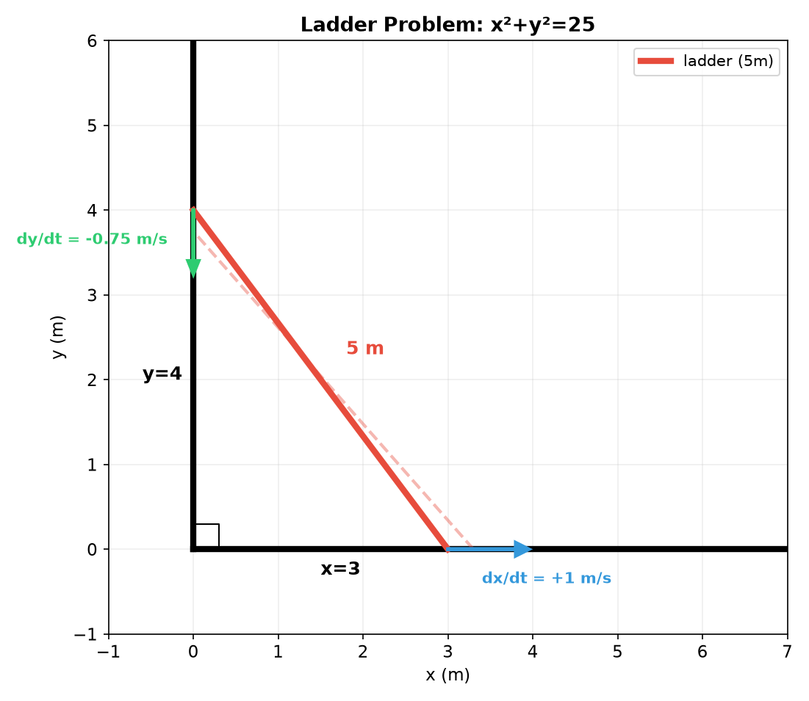
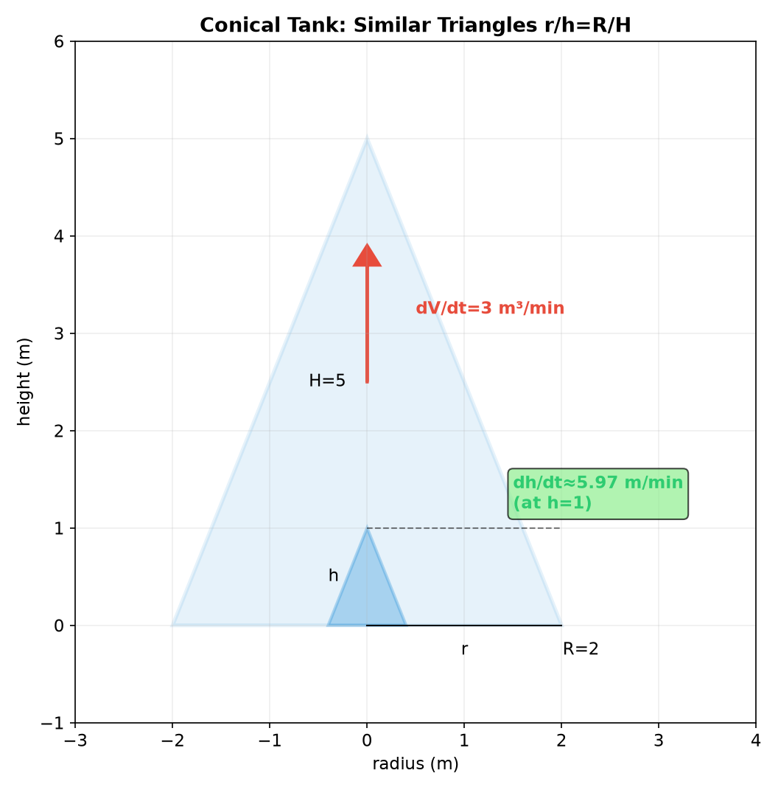
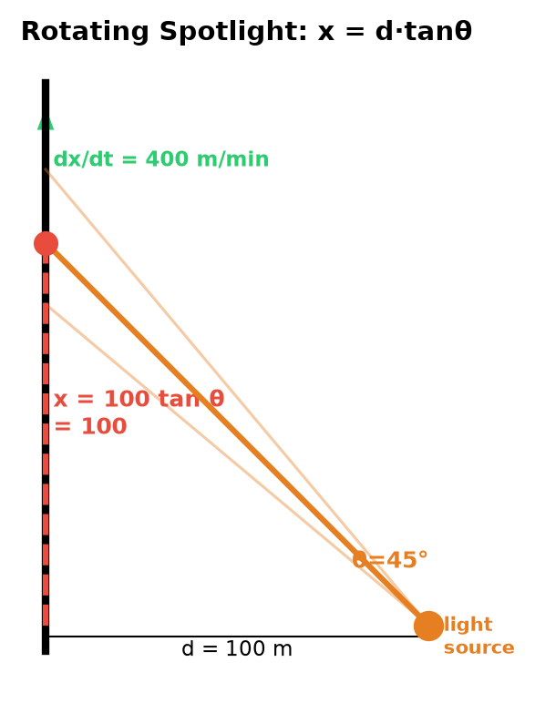
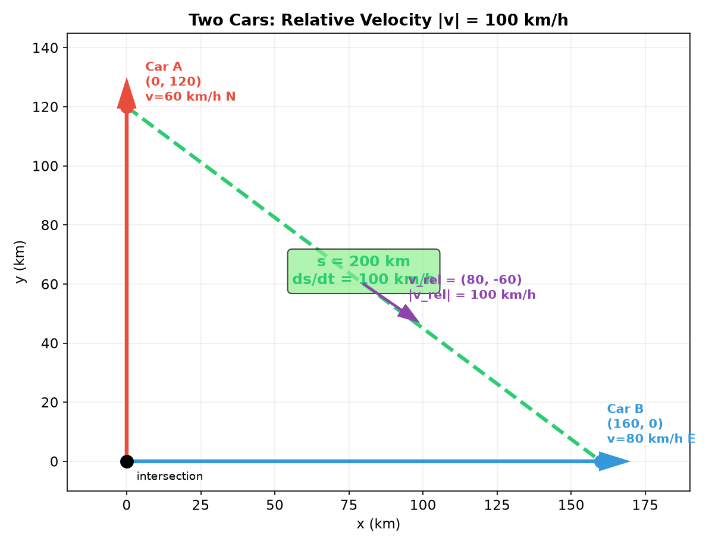
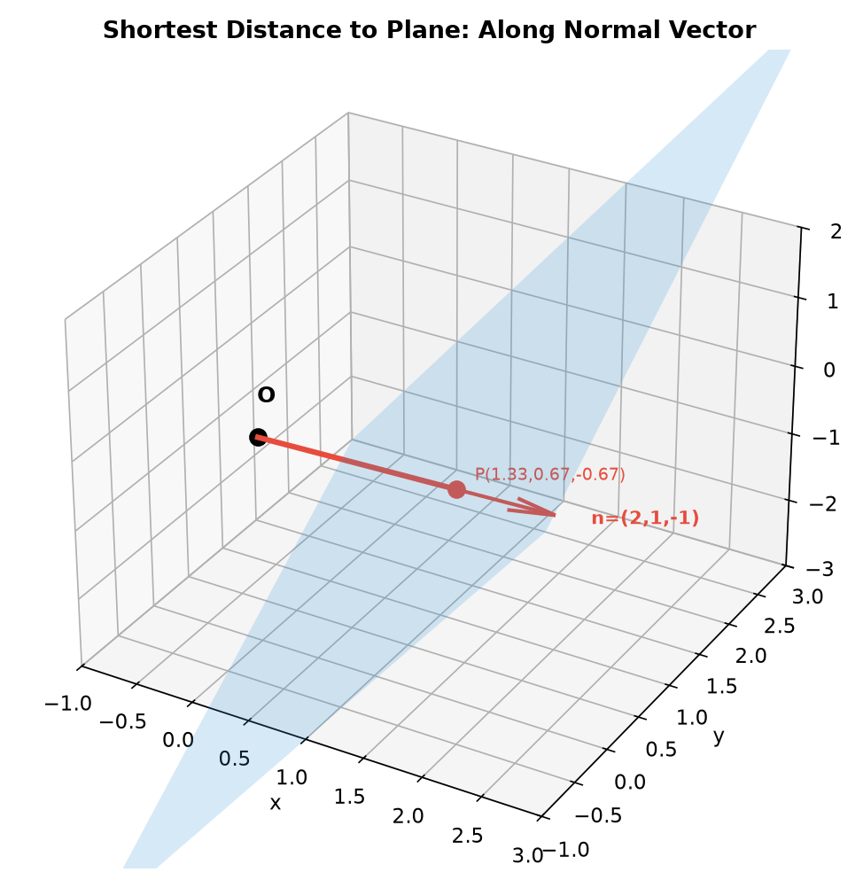
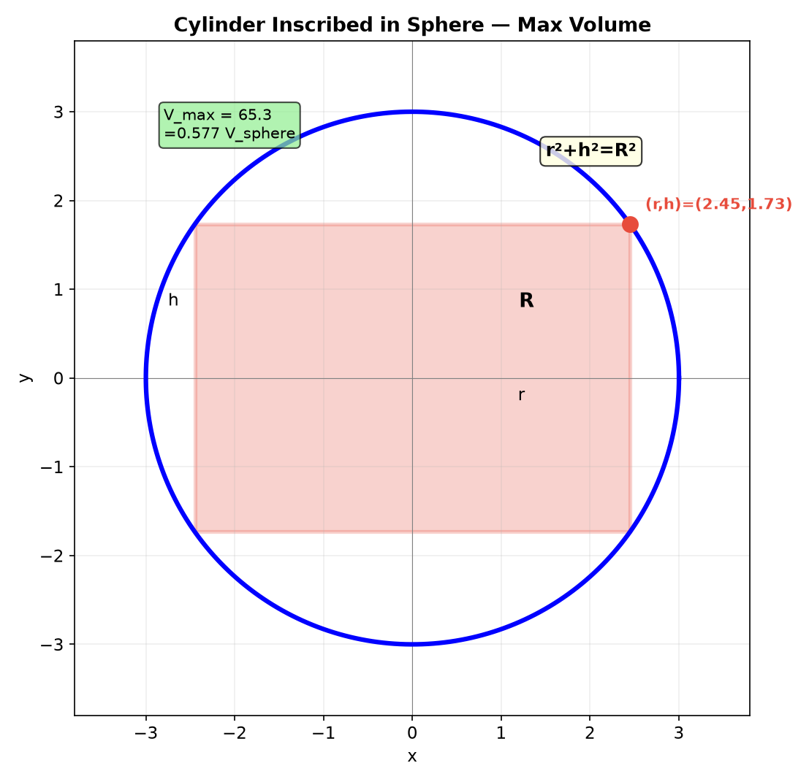

# Session 15B: Optimization and Related Rates — Geometry in Motion

**Phase 2 — Classical Techniques | 75 min**

*Prerequisites: 15A (curve analysis), 14A/B (derivatives), 12A2 (matrices & vectors), 12C1 (geometric transformations), 12C3 (coordinate systems), 9B/9C (2D/3D geometry)*

> Optimization finds the best — the shortest distance, the largest volume, the cheapest cost. Related rates track how quantities change together in time. Both are geometry problems at heart: the constraint is a shape (a line, a sphere, a cone), and calculus provides the tool to find extrema and rates. Vectors, matrices, and coordinate systems make the geometry transparent.

> 💡 **Stuck?** Every problem has a collapsible **Hint** below it — click it only when you need a nudge.

---

## Part A: Optimization — Finding Extrema Under Geometric Constraints

---

## Example 1: The 4-Step Optimization Method

1. **Draw and label** — sketch, assign variables, identify constraints.
2. **Express the objective** as a function of ONE variable (use constraints to eliminate others).
3. **Differentiate** — find critical points ($f'=0$, endpoints).
4. **Verify** — 2nd derivative test or sign chart to confirm max/min.

---

## Example 2: Box Volume Maximization

From a $12 \times 12$ sheet, cut squares of side $x$ from corners. Fold to make an open box.

① $V(x) = x(12-2x)^2 = 4x(6-x)^2$, domain $0 < x < 6$.
② $V'(x) = 4[(6-x)^2 + x \cdot 2(6-x)(-1)] = 4(6-x)[(6-x) - 2x] = 4(6-x)(6-3x)$.
③ $V'=0$ at $x=2$ or $x=6$. $x=6$ is boundary. $x=2$: $V(2) = 2 \cdot 8^2 = 128$.
④ $V''(2) < 0$ → maximum. **Max volume = 128 cubic units.**



---

## Example 3: Distance Minimization — Point to Curve (🔗 9B, 12C3)

Find the point on $y = \sqrt{x}$ closest to $(2, 0)$.

**Method 1 — Minimize squared distance** (avoids square roots):
$D(x) = (x-2)^2 + (\sqrt{x} - 0)^2 = x^2 - 4x + 4 + x = x^2 - 3x + 4$.
$D'(x) = 2x - 3 = 0 \to x = 1.5$. $D''(x) = 2 > 0$ → minimum.
Closest point: $(1.5, \sqrt{1.5})$.

**Method 2 — Normal line through the point (🔗 9B)**:
At tangency, the line from the point to the curve is perpendicular to the tangent. Slope of curve at $(a, \sqrt{a})$: $f'(a) = 1/(2\sqrt{a})$.
Normal slope = $-2\sqrt{a}$. Line through $(2,0)$ with this slope:
$\frac{\sqrt{a} - 0}{a - 2} = -2\sqrt{a} \to \sqrt{a} = -2\sqrt{a}(a-2) \to 1 = -2(a-2) \to a = 1.5$. ✓

> **Geometric insight**: The shortest distance from a point to a curve is along the normal line. This is the 2D analog of "shortest distance to a plane is perpendicular."



---

## Example 4: Optimization with a Parametric Curve (🔗 12C2)

Find the point on the ellipse $\frac{x^2}{4} + \frac{y^2}{9} = 1$ closest to $(1, 0)$.

Parametrize: $x = 2\cos t$, $y = 3\sin t$. Minimize squared distance:
$D(t) = (2\cos t - 1)^2 + (3\sin t)^2 = 4\cos^2 t - 4\cos t + 1 + 9\sin^2 t$.

Use $\sin^2 t = 1 - \cos^2 t$:
$D(t) = 4\cos^2 t - 4\cos t + 1 + 9(1-\cos^2 t) = -5\cos^2 t - 4\cos t + 10$.

Let $u = \cos t$, $u \in [-1, 1]$: $D(u) = -5u^2 - 4u + 10$.
$D'(u) = -10u - 4 = 0 \to u = -0.4$. $D''(u) = -10 < 0$ → MAXIMUM in $u$? Wait…

$D(u) = -5u^2 - 4u + 10$ is a **downward** parabola — its critical point is a maximum! For a minimum on $[-1, 1]$, check endpoints:
$D(-1) = -5 + 4 + 10 = 9$, $D(1) = -5 - 4 + 10 = 1$. Minimum at $u=1 \to t=0$.

Point: $(2\cos 0, 3\sin 0) = (2, 0)$. Distance $= \sqrt{1} = 1$.

> **Lesson**: Always check the domain AND the type of extremum. A downward parabola on a closed interval attains its minimum at an endpoint, not the critical point.

---

## Example 5: Geometric Optimization — Rectangle Inscribed in a Semicircle (🔗 9B)

A rectangle is inscribed in a semicircle of radius $R$ (base on the diameter). Maximize its area.

Place the semicircle as $y = \sqrt{R^2 - x^2}$ for $x \in [-R, R]$. A rectangle with upper-right corner at $(x, \sqrt{R^2-x^2})$ has width $2x$ and height $\sqrt{R^2-x^2}$.

$A(x) = 2x\sqrt{R^2 - x^2}$, domain $0 < x < R$.

It's easier to maximize $A^2$ (eliminates the square root):
$[A(x)]^2 = 4x^2(R^2 - x^2) = 4R^2 x^2 - 4x^4$.

Let $f(x) = 4R^2 x^2 - 4x^4$. $f'(x) = 8R^2 x - 16x^3 = 8x(R^2 - 2x^2) = 0$.
$x = 0$ (min) or $x = R/\sqrt{2}$ (max).

At $x = R/\sqrt{2}$: height $= \sqrt{R^2 - R^2/2} = R/\sqrt{2}$. Width $= 2R/\sqrt{2} = R\sqrt{2}$.
$A_{\max} = R\sqrt{2} \cdot R/\sqrt{2} = R^2$.

Notice: at the maximum, width = $2 \times$ height — the optimal rectangle is **wider than it is tall**.

> **Key**: When the objective involves a square root, maximizing the square is often simpler — same critical points, easier derivative. Notice the optimal rectangle has width exactly twice its height — a ratio that emerges from the balance between growing width and shrinking height as $x$ increases.



---

## Example 6: Exponential/Log Optimization (🔗 12B1)

Maximize $f(x) = x e^{-x}$ on $[0, \infty)$.

$f'(x) = e^{-x} - x e^{-x} = e^{-x}(1-x) = 0 \to x = 1$.
$f''(x) = -e^{-x} - [e^{-x} - x e^{-x}] = -2e^{-x} + x e^{-x} = e^{-x}(x-2)$.
$f''(1) = e^{-1}(-1) < 0$ → maximum. $f(1) = 1/e \approx 0.368$.

> This function appears in Poisson processes, radioactive decay rates, and the optimal stopping problem. Its maximum at $x=1$ is a universal constant $1/e$.



---

## Part B: Related Rates — Time as the Hidden Variable

---

## Example 7: The 3-Step Related Rates Method

1. **Write the constraint equation** linking the variables (Pythagorean, similar triangles, volume formula, trig).
2. **Differentiate both sides with respect to $t$** (implicit differentiation — every variable becomes $d(\cdot)/dt$).
3. **Plug in known values** and solve for the unknown rate.

---

## Example 8: The Ladder Problem — Pythagorean Constraint (🔗 9B)

A 5 m ladder leans against a wall. Bottom slides away at 1 m/s. How fast does the top fall when the bottom is 3 m from the wall?

① $x^2 + y^2 = 25$ ($x$ = bottom distance, $y$ = top height).
② $2x\frac{dx}{dt} + 2y\frac{dy}{dt} = 0 \to \frac{dy}{dt} = -\frac{x}{y}\frac{dx}{dt}$.
③ At $x=3$, $y = \sqrt{25-9} = 4$, $\frac{dx}{dt} = 1$: $\frac{dy}{dt} = -\frac{3}{4}$ m/s (falling at 0.75 m/s).

> **Geometric insight**: $\frac{dy}{dt}$ depends on the ratio $x/y = \tan\theta$. As the ladder falls, $\theta$ decreases, $x/y$ increases, and the top accelerates downward. At $x \to 5$, $y \to 0$, $\frac{dy}{dt} \to -\infty$ — the top's speed blows up.



---

## Example 9: Conical Tank — Similar Triangles (🔗 9C, 12C3)

Water pours into a conical tank (radius 2 m, height 5 m) at 3 m³/min. How fast does water rise when depth is 1 m?

① Similar triangles: $\frac{r}{h} = \frac{2}{5} \to r = 0.4h$.
$V = \frac{1}{3}\pi r^2 h = \frac{1}{3}\pi (0.4h)^2 h = \frac{0.16}{3}\pi h^3$.

② $\frac{dV}{dt} = 0.16\pi h^2 \frac{dh}{dt} = 3$.
③ At $h=1$: $\frac{dh}{dt} = \frac{3}{0.16\pi} \approx 5.97$ m/min.

> **Why so fast at shallow depth?** At $h=1$, the surface radius is only $r=0.4$ m. A small cross-sectional area means the level rises quickly. As the tank fills ($h$ increases), the rate $\frac{dh}{dt} \propto 1/h^2$ — the rise slows dramatically.



---

## Example 10: Trigonometric Related Rates — Rotating Beam (🔗 12C1, 11A)

A spotlight 100 m from a straight wall rotates at 2 rad/min. How fast does the light spot move when the beam angle is $45^\circ$?

① $x = 100\tan\theta$ (distance along the wall from the perpendicular point).
② $\frac{dx}{dt} = 100\sec^2\theta \cdot \frac{d\theta}{dt}$.
③ At $\theta = 45^\circ$: $\sec^2 45^\circ = 2$, $\frac{d\theta}{dt} = 2$. $\frac{dx}{dt} = 100 \cdot 2 \cdot 2 = 400$ m/min.

> **The speed blows up as $\theta \to 90^\circ$**: $\sec\theta \to \infty$, so the light spot would move infinitely fast — which is physically impossible (light speed limits it). This is why searchlights can't scan the entire horizon at constant angular speed.



---

## Example 11: Related Rates with Vectors — Two Moving Objects (🔗 12A2)

Car A goes north at 60 km/h, car B goes east at 80 km/h. Both start from the intersection at the same time. How fast is the distance between them increasing after 2 hours?

Let $x$ = B's east distance, $y$ = A's north distance. Distance $s = \sqrt{x^2 + y^2}$.

① $s^2 = x^2 + y^2$.
② $2s\frac{ds}{dt} = 2x\frac{dx}{dt} + 2y\frac{dy}{dt} \to \frac{ds}{dt} = \frac{x\frac{dx}{dt} + y\frac{dy}{dt}}{s}$.
③ At $t=2$: $x = 160$, $y = 120$, $s = \sqrt{160^2+120^2} = 200$.
$\frac{ds}{dt} = \frac{160 \cdot 80 + 120 \cdot 60}{200} = \frac{12800 + 7200}{200} = \frac{20000}{200} = 100$ km/h.

> **Vector interpretation**: $\vec{r}(t) = (80t, 60t)$ is the relative position vector. $\vec{v}(t) = (80, 60)$. Speed of separation = $|\vec{v}| = \sqrt{80^2+60^2} = 100$ km/h — constant! The distance grows at exactly the magnitude of the relative velocity vector because both start together.



---

## Example 12: Optimization in 3D — Point to Plane Distance (🔗 9C)

Find the point on the plane $2x + y - z = 4$ closest to the origin.

The normal vector to the plane is $\vec{n} = (2, 1, -1)$ — it points straight out of the plane. The shortest path from the origin to the plane runs along this normal direction.

So the closest point lies on the line $\vec{r}(t) = t(2, 1, -1) = (2t, t, -t)$ through the origin parallel to $\vec{n}$.

Find where this line hits the plane: $2(2t) + t - (-t) = 4 \to 4t + t + t = 4 \to 6t = 4 \to t = \frac{2}{3}$.

Closest point: $(\frac{4}{3}, \frac{2}{3}, -\frac{2}{3})$. Shortest distance = $|\vec{n}| \cdot t = \sqrt{6} \cdot \frac{2}{3} = \frac{2\sqrt{6}}{3}$.

> **Geometric insight**: The shortest distance from a point to a plane is always along the normal direction — just as the shortest distance to a line is perpendicular, and the shortest distance to a curve is along its normal. This is a recurring pattern: perpendicular = shortest path.



---

## Example 13: Volume Optimization — Inscribed Solids (🔗 17A, 9C)

A cylinder is inscribed in a sphere of radius $R$. Maximize its volume.

Let cylinder radius = $r$, half-height = $h$. From the sphere's cross-section: $r^2 + h^2 = R^2$.

$V = \pi r^2 (2h) = 2\pi r^2 h = 2\pi (R^2 - h^2)h = 2\pi(R^2 h - h^3)$.

$\frac{dV}{dh} = 2\pi(R^2 - 3h^2) = 0 \to h = \frac{R}{\sqrt{3}}$.
$r^2 = R^2 - \frac{R^2}{3} = \frac{2R^2}{3} \to r = R\sqrt{\frac{2}{3}}$.

$V_{\max} = 2\pi \cdot \frac{2R^2}{3} \cdot \frac{R}{\sqrt{3}} = \frac{4\pi R^3}{3\sqrt{3}}$.

Ratio to sphere volume: $\frac{V_{\max}}{V_{\text{sphere}}} = \frac{4\pi R^3/(3\sqrt{3})}{4\pi R^3/3} = \frac{1}{\sqrt{3}} \approx 0.577$. The max cylinder fills about 57.7% of the sphere.



---

## Common Mistakes

### Mistake 1: Plugging in values BEFORE differentiating (related rates)

**Wrong**: Substituting $x=3, y=4$ into $x^2+y^2=25$ first, then differentiating — you destroy the relationship. **Right**: Differentiate first ($2x\frac{dx}{dt}+2y\frac{dy}{dt}=0$), THEN plug in the known values.

### Mistake 2: Forgetting endpoints on a closed interval

**Wrong**: "For $f(x)=-x^2+4x$ on $[0,5]$, the critical point $x=2$ is a maximum, so I'm done." **Right**: The absolute minimum of a continuous function on a closed interval can sit at an **endpoint**. Evaluate $f(0)$, $f(2)$, $f(5)$ and compare.

### Mistake 3: Optimizing without reducing to ONE variable

**Wrong**: Maximizing $A = xy$ and differentiating with respect to $x$ and $y$ as if independent. **Right**: Use the constraint to eliminate a variable first (e.g. $y = 20 - x$), so the objective becomes a function of a single variable.

### Mistake 4: Not verifying max vs. min

**Wrong**: "I found where $f'=0$, done." **Right**: Use the 2nd derivative test or a sign chart — a critical point can be a max, a min, or neither.

### Mistake 5: Forgetting chain-rule terms in a constraint

**Wrong**: Differentiating $V = \pi r^2 h$ as $\frac{dV}{dt} = \pi r^2 \frac{dh}{dt}$ (treating $r$ as constant). **Right**: If both $r$ and $h$ change with time, $\frac{dV}{dt} = \pi r^2\frac{dh}{dt} + 2\pi r h\frac{dr}{dt}$ — every variable that depends on $t$ gets a $\frac{d}{dt}$.

### Mistake 6: Making distance minimization messier than needed

**Wrong**: Minimizing $D = \sqrt{(x-2)^2 + (\sqrt{x})^2}$ directly, complete with square-root chain rule. **Right**: Minimize $D^2$ instead — same critical points, far easier algebra, and you never confuse the sign of the distance.

---

## What We Just Did

```
(1) 4-step optimization: express as f(one var), set f'=0, verify max/min.
(2) Distance minimization: normal/perpendicular line method (geometric shortcut).
(3) Parametric optimization: substitute parametric form, reduce to one variable.
(4) Related rates: constraint equation → d/dt → plug in knowns.
(5) Classic patterns: ladder (Pythagorean), tank (similar triangles), beam (trig).
(6) Vector rates: relative velocity magnitude = separation speed.
(7) 3D optimization: point-to-plane via normal vector — geometry beats algebra.
```

---

## Practice 1

Find two positive numbers whose product is 100 and sum is minimized.

<details>
<summary>💡 Hint</summary>

With $y = \frac{100}{x}$, minimize $S(x) = x + \frac{100}{x}$.

</details>

→ Solutions: [Solutions](solutions/15B-solutions.md#practice-1)

---

## Practice 2

A cylindrical can (with top) must hold 1 liter (1000 cm³). Minimize the surface area. Find the optimal radius and height, and the ratio $h/r$.

<details>
<summary>💡 Hint</summary>

Use $h = \frac{1000}{\pi r^2}$ to write $S(r) = 2\pi r^2 + \frac{2000}{r}$. At the optimum the height is twice the radius.

</details>

→ Solutions: [Solutions](solutions/15B-solutions.md#practice-2)

---

## Practice 3

A spherical balloon inflates at 100 cm³/s. How fast does the radius grow when $r=5$ cm?

<details>
<summary>💡 Hint</summary>

$V = \frac{4}{3}\pi r^3$ so $\frac{dV}{dt} = 4\pi r^2 \frac{dr}{dt}$.

</details>

→ Solutions: [Solutions](solutions/15B-solutions.md#practice-3)

---

## Practice 4: Real Battle (🔗 12A2)

Car A drives north through an intersection at 60 km/h. Car B drives east through the SAME intersection at 80 km/h, but leaves 1 hour LATER. How fast is the distance between them increasing 2 hours after car A passes the intersection?

<details>
<summary>💡 Hint</summary>

At the measuring moment, A has driven 2 h but B has driven only 1 h. Set $s^2 = x^2 + y^2$ with the correct values, then differentiate.

</details>

→ Solutions: [Solutions](solutions/15B-solutions.md#practice-4)

---

## Practice 5: Distance Minimization (🔗 9B, 12C1)

Find the point on the line $y = 2x + 1$ closest to the origin. Solve two different ways and verify they agree.

<details>
<summary>💡 Hint</summary>

Minimize $D^2 = x^2 + (2x+1)^2$. For the second way, the perpendicular from the origin to the line has slope $-\frac12$.

</details>

→ Solutions: [Solutions](solutions/15B-solutions.md#practice-5)

---

## Practice 6: Related Rates — Volume (🔗 17A)

A spherical snowball melts at a rate proportional to its surface area: $\frac{dV}{dt} = -kS$, where $S = 4\pi r^2$. Show that $\frac{dr}{dt}$ is constant. If radius decreases from 10 cm to 9 cm in 30 minutes, when will it be completely melted?

<details>
<summary>💡 Hint</summary>

Write $\frac{dV}{dt} = 4\pi r^2\frac{dr}{dt}$ and set it equal to $-k(4\pi r^2)$. The $4\pi r^2$ cancels.

</details>

→ Solutions: [Solutions](solutions/15B-solutions.md#practice-6)

---

## Practice 7: Exponential Optimization (🔗 12B1)

Population grows 3%/yr: $P(t) = 1000 e^{0.03t}$. Per-capita consumption falls 5%/yr: $C(t) = 50 e^{-0.05t}$ (improving efficiency). Total consumption $R(t) = P(t) \cdot C(t)$.

(a) Compute $R(t)$. Show it is always decreasing and find its maximum value (and where it occurs).
(b) Generalize: if per-capita consumption falls at rate $r$ (i.e. $C(t) = 50 e^{-rt}$), for which $r$ does $R(t)$ (i) grow forever, (ii) stay constant, (iii) eventually decline? Interpret your answer.

<details>
<summary>💡 Hint</summary>

$R(t) = P(t)C(t) = 50000\, e^{(0.03-r)t}$. The sign of the exponent $0.03 - r$ decides (i)–(iii).

</details>

→ Solutions: [Solutions](solutions/15B-solutions.md#practice-7)

---

## Practice 8: Real Battle (🔗 9C, 12C3)

Find the point on the plane $x + 2y + 3z = 6$ closest to the origin, and the shortest distance. Solve two different ways and verify they agree.

<details>
<summary>💡 Hint</summary>

The shortest path from the origin to the plane runs along the normal direction $(1,2,3)$. For the second way, remember the point-to-plane distance formula $d = \frac{|ax_0+by_0+cz_0-d'|}{\sqrt{a^2+b^2+c^2}}$.

</details>

→ Solutions: [Solutions](solutions/15B-solutions.md#practice-8)

---

## Basic Drills

**D1.** Find the maximum of $f(x) = -x^2 + 6x - 5$.

**D2.** Minimize $f(x) = x^2 + \frac{16}{x}$ for $x>0$.

**D3.** A rectangle has perimeter 40. Maximize its area. What shape gives the maximum?

**D4.** $V = \frac{4}{3}\pi r^3$. If $\frac{dr}{dt} = 2$, find $\frac{dV}{dt}$ when $r=3$.

**D5.** $x^2 + y^2 = 100$. If $\frac{dx}{dt} = 3$, find $\frac{dy}{dt}$ when $x=6, y=8$.

**D6.** Find the point on $y = x^2$ closest to $(0, 1)$.

**D7.** A 10 m ladder: bottom slides at 2 m/s. Find $\frac{dy}{dt}$ when bottom is 6 m from the wall.

**D8.** Maximize $f(x) = x(10-x)$ on $[0, 10]$.

**D9.** Water fills a cylindrical tank (radius 3 m) at 5 m³/min. Find $\frac{dh}{dt}$.

**D10.** $y = \sqrt{x}$. If $\frac{dx}{dt} = 4$, find $\frac{dy}{dt}$ when $x=9$.

**D11.** (🔗 12B1, 15A) Maximize $f(x) = x e^{-x}$ on $[0, \infty)$. Find the $x$ and the maximum value.

**D12.** (🔗 9B) A rectangle is inscribed in a circle of radius 5. Maximize its area.

<details>
<summary>💡 Hint</summary>

The rectangle's diagonal is a diameter of the circle, so $a^2 + b^2 = 100$.

</details>

**D13.** (🔗 12C1, 12C3) Find the point on the curve $y = \cosh x$ closest to the origin.

<details>
<summary>💡 Hint</summary>

Minimize $x^2 + \cosh^2 x$. Its derivative is $2x + \sinh(2x)$, negative for $x<0$ and positive for $x>0$.

</details>

**D14.** (🔗 9C) A box with a square base and open top must have volume 32 m³. Minimize surface area.

**D15.** The position of a particle is given by $(x(t), y(t)) = (t^2, t^3)$. Find the rate of change of its distance from the origin at $t=2$.

<details>
<summary>💡 Hint</summary>

Let $s = \sqrt{x^2 + y^2}$. Differentiate $s^2 = x^2 + y^2$ instead.

</details>

**D16.** (🔗 12C1, 11A) A searchlight 50 m from a straight wall rotates at 3 rad/min. How fast does the light spot move along the wall when the beam makes a $30^\circ$ angle with the perpendicular?

<details>
<summary>💡 Hint</summary>

$x = 50\tan\theta$, so $\frac{dx}{dt} = 50\sec^2\theta \cdot \frac{d\theta}{dt}$.

</details>

**D17.** Find the absolute maximum AND minimum of $f(x) = -x^2 + 4x$ on the closed interval $[0, 5]$.

<details>
<summary>💡 Hint</summary>

On a closed interval, always compare the critical point with BOTH endpoints: check $x = 0$, $2$, and $5$.

</details>

> Solutions: [Solutions](solutions/15B-solutions.md#basic-drill)

---

## Advanced Drills

**A1.** A wire of length $L$ is cut into two pieces: one forms a circle, the other a square. How should you cut to (a) minimize total area, (b) maximize total area?

<details>
<summary>💡 Hint</summary>

Let the circle use length $x$. Total area $A(x) = \frac{x^2}{4\pi} + \frac{(L-x)^2}{16}$. The critical point is a minimum — so the maximum hides at an endpoint of $[0, L]$.

</details>

**A2.** A Norman window is a rectangle topped by a semicircle (the semicircle's diameter equals the rectangle's width). If the perimeter is fixed at $P$, find the width and height that maximize the window's area.

<details>
<summary>💡 Hint</summary>

With width $2x$ and height $y$, the perimeter is $2y + 2x + \pi x = P$. Express $A = 2xy + \frac12\pi x^2$ in terms of $x$ only.

</details>

**A3.** A trough is 10 m long with isosceles triangular ends (1 m wide at top, 0.5 m deep). Water pours in at 0.2 m³/min. How fast does water rise when depth is 0.3 m?

<details>
<summary>💡 Hint</summary>

By similar triangles the surface width at depth $h$ is $w = 2h$. Then $V = \frac12 wh \cdot 10 = 10h^2$.

</details>

**A4.** (🔗 9C) Cylindrical tank: base costs \$3/m², sides \$2/m². Volume must be $100\pi$ m³. Minimize cost. What is the optimal $h/r$ ratio?

<details>
<summary>💡 Hint</summary>

Cost $C = 3\pi r^2 + 4\pi rh$; use $h = \frac{100}{r^2}$ from $V = \pi r^2h = 100\pi$.

</details>

**A5.** Two ships: A sails east at 20 km/h from a port. B sails north at 15 km/h toward the same port from a point 100 km south. When are they closest? What is the minimum distance?

<details>
<summary>💡 Hint</summary>

A is at $(20t, 0)$; B is at $(0, 100-15t)$. Minimize $D^2(t) = (20t)^2 + (100-15t)^2$.

</details>

**A6.** Find the maximum of $f(x) = x^{1/x}$ for $x > 0$.

<details>
<summary>💡 Hint</summary>

Take $\ln$: $\ln f = \frac{\ln x}{x}$, then differentiate both sides.

</details>

**A7.** A man 2 m tall walks away from a 6 m lamppost at 1.5 m/s. How fast does (a) the tip of his shadow move, (b) his shadow lengthen?

<details>
<summary>💡 Hint</summary>

Let $x$ = the man's distance and $s$ = the shadow tip's distance. Similar triangles: $\frac{s}{6} = \frac{s-x}{2}$.

</details>

**A8.** Find the point on the ellipse $x^2/4 + y^2/9 = 1$ farthest from $(1, 0)$.

<details>
<summary>💡 Hint</summary>

Parametrize $x = 2\cos t$, $y = 3\sin t$ and study $D^2(t) = (2\cos t - 1)^2 + (3\sin t)^2$.

</details>

**A9.** Oil spills in a circle. Radius grows at 0.5 km/h. When $r=10$ km, how fast is the area growing? Also: if thickness is constant, how fast is volume growing if the thickness is 1 mm?

<details>
<summary>💡 Hint</summary>

$A = \pi r^2$; volume = area $\times$ thickness. Differentiate each with respect to $t$.

</details>

**A10.** (🔗 9C, 17A) A cone is inscribed in a sphere of radius $R$. Maximize the cone's volume.

<details>
<summary>💡 Hint</summary>

If the cone's height is $H$, its base circle sits a distance $R - H$ from the sphere's center, so $r^2 = 2RH - H^2$.

</details>

**A11.** (🔗 17A) A hemispherical tank (radius 2 m): water pours in at 1 m³/min. Find $\frac{dh}{dt}$ when $h=1$ m.

<details>
<summary>💡 Hint</summary>

Use $V(h) = \pi h^2(R - h/3)$: compute $\frac{dV}{dh}$ at $h=1$, then $\frac{dh}{dt} = \frac{dV/dt}{dV/dh}$.

</details>

**A12.** (🔗 12B1) Profit $P(x) = 1000\ln(x+1) - 5x$. Find optimal production level $x$. Interpret: why does profit eventually decrease despite $\ln(x+1)$ growing forever?

<details>
<summary>💡 Hint</summary>

Set $P'(x) = \frac{1000}{x+1} - 5 = 0$. The marginal benefit $\frac{1000}{x+1}$ shrinks as $x$ grows while marginal cost stays $5$.

</details>

> Solutions: [Solutions](solutions/15B-solutions.md#advanced-drill)

---

## How to Read These Symbols

| Symbol | Reads as | Meaning |
|:---:|:---:|------|
| optimization | "optimization" | find max/min of a quantity |
| constraint | "constraint" | relationship linking variables — used to reduce to one variable |
| $\frac{d}{dt}$ | "d d t" / "time derivative" | differentiate with respect to time |
| $\frac{dV}{dt}, \frac{dh}{dt}$ | "rate of change of volume / height" | related rates — how fast quantities change |
| Pythagorean relation | "$x^2+y^2=z^2$" | distance/ladder problems |
| similar triangles | "similar triangles" | ratio-preserving — relates variables geometrically |
| normal vector | "normal vector" | $\vec{n} \perp$ plane — shortest distance direction |
| $\vec{r}(t)$, $\vec{v}(t)$ | "position / velocity vector" | vector description of motion |

---

## Today's Procedure

```
Step 1: Optimization: express objective as f(one variable) using constraints.
         Differentiate, set f'=0. Check endpoints. Verify max/min.
Step 2: Related rates: write constraint equation → d/dt → plug in known values.
Step 3: Geometric shortcuts: normal line for distance to curve/plane.
         Similar triangles for conical/related shapes.
Step 4: Draw and label EVERYTHING. The geometry is the hard part.
```
