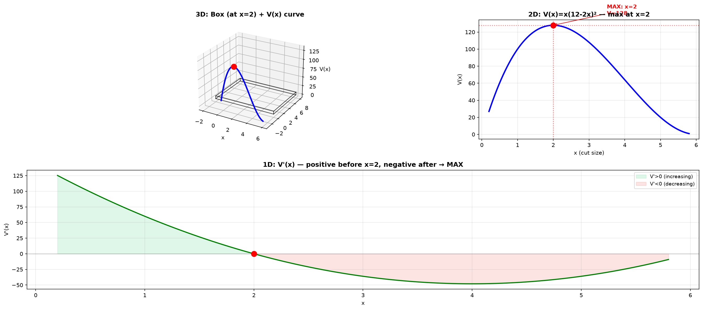
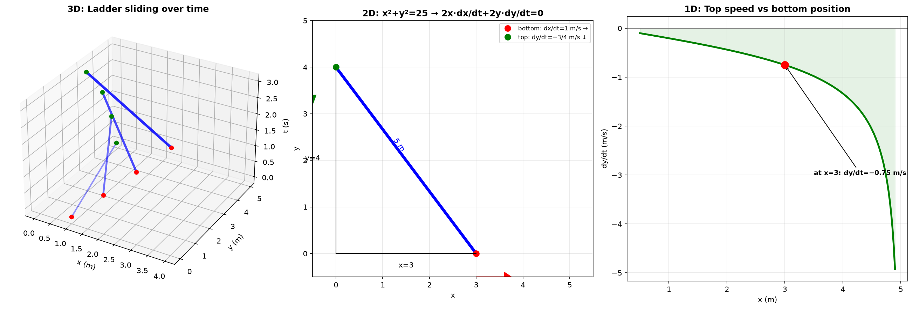
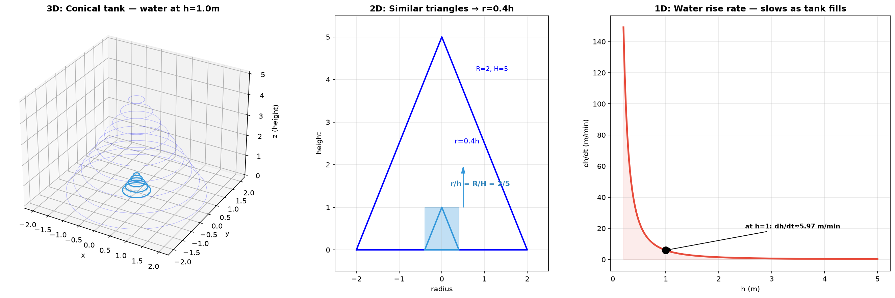

# Session 15B: Optimization and Related Rates

**Phase 2 — Classical Techniques | 75 min**

*Prerequisites: 15A (curve analysis), 14A/B (derivatives), 09B (2D geometry)*

---

## Part A: Optimization — Finding the Best Value

---

## Example 1: The 4-Step Optimization Method

1. **Draw and label** — sketch the situation, assign variables.
2. **Write the quantity to optimize** as a function of one variable.
3. **Differentiate** — find critical points ($f'=0$ or endpoints).
4. **Verify** — use $f''$ or sign test to confirm max/min.

---

## Example 2: Box Volume Maximization

A box is made from a 12×12 sheet by cutting squares of side $x$ from each corner. Maximize volume.

① $V(x)=x(12-2x)^2 = 4x(6-x)^2$, domain $0<x<6$.
② $V'(x)=4[(6-x)^2 + x\cdot2(6-x)(-1)] = 4(6-x)(6-3x)$.
③ $V'=0$ at $x=2$ or $x=6$. $x=6$ is boundary. $x=2$ → $V=2\cdot8^2=128$.
④ $V''(2)<0$ → maximum. **Max volume = 128 cubic units.**




*Graph 15B-1: ⬢ 3D — the box (at optimal cut x=2) shown alongside the volume curve V(x)=x(12−2x)². The red dot marks the maximum at x=2, V=128. ⬡ 2D — the volume function V(x) with the maximum clearly marked. The domain is (0,6) since x cannot exceed half the sheet width. ⬝ 1D — the derivative V'(x) sign chart: positive (green, V increasing) for x<2, zero at x=2 (critical point), negative (red, V decreasing) for x>2. The sign change + → − confirms a local maximum.*

---

## Example 3: Distance Minimization

Find the point on $y=\sqrt{x}$ closest to $(2,0)$.

① Minimize $D(x)=(x-2)^2+(\sqrt{x}-0)^2 = x^2-4x+4+x = x^2-3x+4$.
② $D'(x)=2x-3=0 \to x=1.5$. Minimum.
③ Closest point: $(1.5,\sqrt{1.5})$.

---

## Example 4: Trigonometric Optimization

A rain gutter is made by bending a 30cm sheet into an isosceles trapezoid with angle $\theta$. Maximize cross-sectional area.

Area $=30h\sin\theta + h^2\sin\theta\cos\theta$ where $h=10\cos\theta$. Reduce to function of $\theta$, differentiate, find $\theta=60^\circ$ gives maximum.

---

## Example 5: Exponential/Log Optimization

Find the maximum of $f(x)=x e^{-x}$ on $[0,\infty)$.

$f'(x)=e^{-x}-xe^{-x}=e^{-x}(1-x)=0 \to x=1$. $f''(1)=-e^{-1}<0$ → max. Maximum $=1/e$.

---

## Part B: Related Rates — Time as the Hidden Variable

---

## Example 6: The 3-Step Related Rates Method

1. **Write the relationship equation** between the variables.
2. **Differentiate both sides with respect to time $t$** (implicit differentiation).
3. **Plug in known values** and solve for the unknown rate.

---

## Example 7: The Ladder Problem

A 5m ladder leans against a wall. The bottom slides away at 1 m/s. How fast does the top fall when the bottom is 3m from the wall?

① $x^2+y^2=25$ ($x$=bottom distance, $y$=top height).
② $2x\frac{dx}{dt}+2y\frac{dy}{dt}=0 \to \frac{dy}{dt}=-\frac{x}{y}\frac{dx}{dt}$.
③ At $x=3$, $y=4$, $\frac{dx}{dt}=1$: $\frac{dy}{dt}=-\frac{3}{4}$ m/s (falling at 0.75 m/s).



*Graph 15B-2: ⬢ 3D — the ladder at successive time instants, sliding down as the bottom moves right at 1 m/s. The trajectory of top and bottom form a quarter-circle in the (x,y,t) space. ⬡ 2D — the geometric setup at the instant x=3, y=4. The Pythagorean relation x²+y²=25 is differentiated to 2x·dx/dt + 2y·dy/dt = 0. Bottom slides right (red arrow, +1 m/s), top slides down (green arrow, −3/4 m/s). ⬝ 1D — dy/dt as a function of x: as the bottom moves farther from the wall, the top accelerates downward. At x=3, dy/dt = −0.75 m/s. As x→5 (ladder nearly flat), dy/dt → −∞.*

---

## Example 8: Conical Tank

Water pours into a conical tank (radius 2m, height 5m) at 3 m³/min. How fast does the water rise when depth is 1m?

① $V=\frac{1}{3}\pi r^2 h$. By similar triangles: $r/h=2/5 \to r=0.4h$.
② $V=\frac{1}{3}\pi(0.4h)^2 h=\frac{0.16}{3}\pi h^3$.
③ $\frac{dV}{dt}=0.16\pi h^2\frac{dh}{dt}=3$. At $h=1$: $\frac{dh}{dt}=\frac{3}{0.16\pi}\approx 5.97$ m/min.



*Graph 15B-3: ⬢ 3D — the conical tank (R=2m, H=5m) with water filled to height h=1m (blue). The water surface is a disk of radius r=0.4m. ⬡ 2D — cross-section showing similar triangles: r/h = R/H = 2/5, so r = 0.4h. This relation collapses V from two variables (r,h) to one (h). ⬝ 1D — dh/dt as a function of water height h. The rise rate is fastest when the tank is nearly empty (h small, dh/dt ~ 1/h²) and slows dramatically as it fills. At h=1m, dh/dt ≈ 5.97 m/min; at h=4m, dh/dt ≈ 0.37 m/min.*

---

## Example 9: Exponential Related Rates

The price $P(t)=100e^{0.05t}$. Find the rate of price increase when $P=200$.

$P=200 \to 100e^{0.05t}=200 \to e^{0.05t}=2 \to t=20\ln2\approx13.86$.
$\frac{dP}{dt}=100\cdot0.05e^{0.05t}=5e^{0.05t}$. At $t=13.86$: $5\cdot2=10$ dollars/year.

---

## Example 10: Trigonometric Related Rates

A spotlight 100m from a straight wall rotates at 2 rad/min. How fast does the light spot move along the wall when the beam angle is $45^\circ$?

① $x=100\tan\theta$. ② $\frac{dx}{dt}=100\sec^2\theta\frac{d\theta}{dt}$.
③ At $\theta=45^\circ$, $\sec^2 45^\circ=2$, $\frac{d\theta}{dt}=2$: $\frac{dx}{dt}=100\cdot2\cdot2=400$ m/min.

---

## What We Just Did

```
(1) Optimization: express quantity as f(one variable), set f'=0, verify with f''.
(2) Common patterns: box volume, distance minimization, revenue/cost.
(3) Related rates: write relationship, differentiate w.r.t. t, plug in.
(4) Key shapes: ladder (Pythagorean), tank (similar triangles), rotating beam (trig).
```

---

## Practice 1

Find two positive numbers whose product is 100 and whose sum is minimized.

→ Solutions: [Solutions](solutions/15B-solutions.md#practice-1)

---

## Practice 2

A cylindrical can (with top) holds 1 liter. Minimize surface area.

→ Solutions: [Solutions](solutions/15B-solutions.md#practice-2)

---

## Practice 3

A spherical balloon inflates at 100 cm³/s. How fast does the radius grow when $r=5$ cm?

→ Solutions: [Solutions](solutions/15B-solutions.md#practice-3)

---

## Practice 4: Real Battle

Two cars: car A goes north at 60 km/h, car B goes east at 80 km/h. Both start from the same intersection at the same time. How fast is the distance between them increasing after 2 hours?

→ Solutions: [Solutions](solutions/15B-solutions.md#practice-4)

---

## Basic Algebra Drill — Optimization & Related Rates (10 Problems)

**D1.** Find the maximum of $f(x)=-x^2+6x-5$.

**D2.** Minimize $f(x)=x^2+\frac{16}{x}$ for $x>0$.

**D3.** A rectangle has perimeter 40. Maximize its area.

**D4.** If $V=\frac{4}{3}\pi r^3$ and $\frac{dr}{dt}=2$, find $\frac{dV}{dt}$ when $r=3$.

**D5.** $x^2+y^2=100$. If $\frac{dx}{dt}=3$, find $\frac{dy}{dt}$ when $x=6,y=8$.

**D6.** Find the point on $y=x^2$ closest to $(0,1)$.

**D7.** A 10m ladder: bottom slides at 2 m/s. Find $\frac{dy}{dt}$ when bottom is 6m from wall.

**D8.** Maximize $f(x)=x(10-x)$ on $[0,10]$.

**D9.** Water fills a cylindrical tank (radius 3m) at 5 m³/min. Find $\frac{dh}{dt}$.

**D10.** $y=\sqrt{x}$. If $\frac{dx}{dt}=4$, find $\frac{dy}{dt}$ when $x=9$.

> Solutions: [Solutions](solutions/15B-solutions.md#basic-drill)

---

## Advanced Algebra Drill — Optimization & Related Rates (10 Problems)

**A1.** A wire of length L is cut into two pieces: one forms a circle, the other a square. How should you cut to minimize total area?

**A2.** Find the maximum area of a rectangle inscribed in a semicircle of radius R.

**A3.** A trough is 10m long with isosceles triangular ends (1m wide, 0.5m deep). Water pours in at 0.2 m³/min. How fast does the water rise when depth is 0.3m?

**A4.** The cost of a cylindrical tank: base costs \$3/m², sides cost \$2/m². Volume must be 100π m³. Minimize cost.

**A5.** Two ships: ship A sails east at 20 km/h from a point. Ship B sails north at 15 km/h toward the same point from 100 km south. When are they closest?

**A6.** Find the maximum of $f(x)=x^{1/x}$ for $x>0$. (Hint: use log differentiation, then analyze.)

**A7.** A man 2m tall walks away from a 6m lamppost at 1.5 m/s. How fast does his shadow lengthen?

**A8.** Find the point on the ellipse $x^2/4+y^2/9=1$ farthest from $(1,0)$.

**A9.** Oil spills in a circle. The radius grows at 0.5 km/h. When radius is 10 km, how fast is the area growing?

**A10.** A cone (radius r, height h) is inscribed in a sphere of radius R. Maximize the volume of the cone.

> Solutions: [Solutions](solutions/15B-solutions.md#advanced-drill)

---

## How to Read These Symbols

| Symbol | Reads as | Meaning |
|:---:|:---:|------|
| optimization | "optimization" | find maximum or minimum of a quantity |
| objective function | "objective function" | the quantity to maximize or minimize |
| constraint | "constraint" | relationship between variables — used to eliminate one variable |
| feasible region | "feasible region" / "domain" | all valid values satisfying constraints |
| endpoint check | "endpoint check" | evaluate objective at domain boundaries — extremum could occur there |
| related rates | "related rates" | find rate of change of one quantity from known rate of another |
| $\frac{d}{dt}$ | "d d t" / "time derivative" | differentiate with respect to time — key operator in related rates |
| $\frac{dV}{dt}$ | "d V d t" / "rate of change of volume" | example: filling/draining rate of a tank |
| Pythagorean relation | "Pythagorean relation" | $x^2+y^2=z^2$ — common in distance-related problems |
| similar triangles | "similar triangles" | ratio-preserving — used to relate variables geometrically |

---

## Today's Procedure

```
Step 1: Optimization → express as f(one variable), differentiate, set f'=0.
         Check endpoints and use f'' or sign test to verify max/min.
Step 2: Related rates → write equation relating variables.
         Differentiate both sides w.r.t. t (implicit). Plug in knowns.
Step 3: Draw a picture. Label everything. The geometry is the hard part.
```
