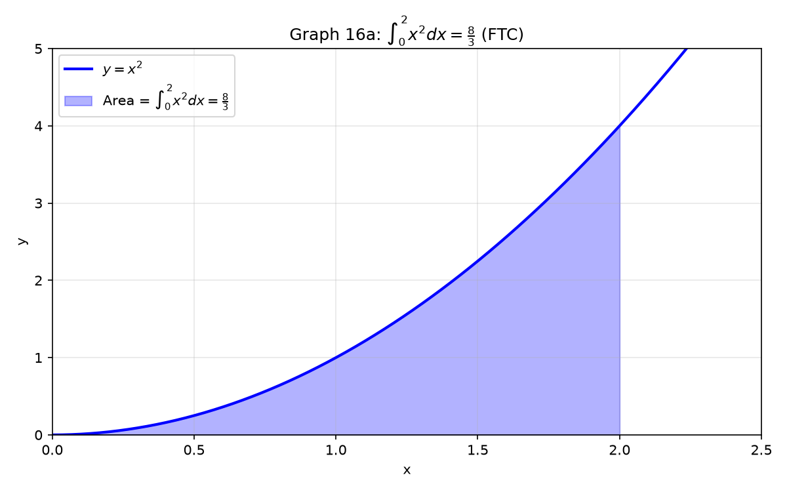

# 세션 16: 적분법 — 면적을 자유자재로

**Phase 2 — 고전 테크닉 | 105분**

---

## Part A: 적분이란 — 미분의 거꾸로

---

## 예시 1: 부정적분 — "무엇을 미분하면?"

$\int 2x\,dx = x^2 + C$. ($x^2$을 미분하면 $2x$, 상수 $C$는 사라짐)

$\int \cos x\,dx = \sin x + C$. ($\sin x$ 미분 → $\cos x$)

$\int e^x\,dx = e^x + C$. (자기 자신)

$\int \frac{1}{x}\,dx = \ln|x| + C$.

**기본 공식 — 미분의 역순**:

| $f(x)$ | $\int f(x)dx$ |
|:---|:---|
| $x^n$ ($n\neq-1$) | $\frac{x^{n+1}}{n+1}+C$ |
| $\frac{1}{x}$ | $\ln\|x\|+C$ |
| $e^x$ | $e^x+C$ |
| $a^x$ | $\frac{a^x}{\ln a}+C$ |
| $\sin x$ | $-\cos x+C$ |
| $\cos x$ | $\sin x+C$ |
| $\sec^2 x$ | $\tan x+C$ |
| $\csc^2 x$ | $-\cot x+C$ |
| $\sec x\tan x$ | $\sec x+C$ |
| $\csc x\cot x$ | $-\csc x+C$ |
| $\frac{1}{\sqrt{1-x^2}}$ | $\arcsin x+C$ |
| $\frac{1}{1+x^2}$ | $\arctan x+C$ |

---

## 예시 2: 정적분 — FTC (미적분학 기본정리)

$\int_a^b f(x)dx = F(b)-F(a)$. ($F$는 $f$의 부정적분)

$\int_0^2 3x^2\,dx$.
① 부정적분: $F(x)=x^3$.
② $F(2)-F(0)=8-0=8$.



$\int_0^\pi \sin x\,dx = [-\cos x]_0^\pi = (-\cos\pi)-(-\cos0) = 1-(-1) = 2$.

$\int_1^e \frac{1}{x}\,dx = [\ln|x|]_1^e = \ln e - \ln 1 = 1-0 = 1$.

---

## 예시 3: 합·차·상수배 — 찢어서 적분

$\int(4x^3-2x+\frac{1}{x})dx = x^4-x^2+\ln|x|+C$.

$\int(3e^x+2\sin x)dx = 3e^x-2\cos x+C$.

$\int_0^1(2x^2+3e^x)dx = [\frac{2}{3}x^3+3e^x]_0^1 = (\frac{2}{3}+3e)-3 = 3e-\frac{7}{3}$.

> **여기까지**: 적분=미분의 역. 기본공식표 암기. FTC: $F(b)-F(a)$.
> 합·차·상수배는 찢어서 각각.

---

## Part B: 치환적분 — $u$로 바꿔치기

---

## 예시 4: 기본 치환 — $u=g(x)$

$\int 2x(x^2+1)^5\,dx$.

① $u=x^2+1$로 놓는다. $du=2x\,dx$.
② 적분이 $\int u^5\,du$로 변신.
③ $=\frac{u^6}{6}+C = \frac{(x^2+1)^6}{6}+C$.

손으로 검산: 미분해보면 $6\cdot\frac{(x^2+1)^5}{6}\cdot2x = 2x(x^2+1)^5$. 맞다.

**치환의 핵심**: $du = g'(x)dx$가 원래 적분 안에 **정확히** 있어야.

---

## 예시 5: 삼각 치환

$\int \sin^3 x\cos x\,dx$.
① $u=\sin x$, $du=\cos x\,dx$.
② $\int u^3\,du = \frac{u^4}{4}+C = \frac{\sin^4 x}{4}+C$.

$\int \tan x\,dx$.
① $\tan x = \frac{\sin x}{\cos x}$. $u=\cos x$, $du=-\sin x\,dx$.
② $\int \frac{-du}{u} = -\ln|u|+C = -\ln|\cos x|+C = \ln|\sec x|+C$.

---

## 예시 6: 지수·로그 치환

$\int \frac{e^x}{1+e^x}\,dx$.
① $u=1+e^x$, $du=e^x\,dx$.
② $\int \frac{du}{u} = \ln|u|+C = \ln(1+e^x)+C$.

$\int \frac{(\ln x)^2}{x}\,dx$.
① $u=\ln x$, $du=\frac{1}{x}\,dx$.
② $\int u^2\,du = \frac{u^3}{3}+C = \frac{(\ln x)^3}{3}+C$.

$\int e^{\sin x}\cos x\,dx$.
① $u=\sin x$, $du=\cos x\,dx$.
② $\int e^u\,du = e^{\sin x}+C$.

---

## 예시 7: 정적분 치환 — 경계도 바꾼다

$\int_0^1 x\sqrt{1-x^2}\,dx$.
① $u=1-x^2$, $du=-2x\,dx$ → $x\,dx = -\frac{1}{2}du$.
② 경계: $x=0\to u=1$, $x=1\to u=0$.
③ $\int_1^0 \sqrt{u}\cdot(-\frac{1}{2})du = \frac{1}{2}\int_0^1 u^{1/2}du$.
④ $=\frac{1}{2}[\frac{2}{3}u^{3/2}]_0^1 = \frac{1}{3}$.

$\int_0^{\pi/2} \sin^2 x\cos x\,dx$.
① $u=\sin x$, $du=\cos x\,dx$. $x=0\to u=0$, $x=\frac{\pi}{2}\to u=1$.
② $\int_0^1 u^2\,du = [\frac{u^3}{3}]_0^1 = \frac{1}{3}$.

---

## 예시 8: 역삼각 치환

$\int \frac{1}{\sqrt{4-x^2}}\,dx$.
① $=\int \frac{1}{2\sqrt{1-(x/2)^2}}\,dx$. $u=x/2$, $dx=2du$.
② $=\int \frac{1}{\sqrt{1-u^2}}\,du = \arcsin u + C = \arcsin\frac{x}{2}+C$.

$\int \frac{1}{4+x^2}\,dx = \frac{1}{2}\arctan\frac{x}{2}+C$.

> **여기까지**: 치환=적분을 $u$세상으로. $du$가 정확히 있어야.
> 경계도 같이 바꾸면 정적분이 편하다. 삼각·지수·로그·역삼각 모두 치환 가능.

---

## Part C: 부분적분 — 곱을 찢는다

---

## 예시 9: 기본 부분적분 — $\int u\,dv = uv - \int v\,du$

부분적분은 곱의 미분 공식을 거꾸로 뒤집은 것이다. $(uv)' = u'v + uv'$를 적분꼴로 바꾸면 $\int u\,dv = uv - \int v\,du$가 된다. **하나는 미분해서 단순해지는 것, 하나는 적분해도 복잡해지지 않는 것** — 이렇게 짝을 지어야 한다. 무엇을 $u$로 잡을지 고르는 게 핵심이다.

$\int x e^x\,dx$.
① $u=x$ (미분하면 단순해짐), $dv=e^x\,dx$.
② $du=dx$, $v=e^x$.
③ $\int x e^x\,dx = x e^x - \int e^x\,dx = xe^x - e^x + C = e^x(x-1)+C$.

**LIATE 우선순위** ($u$ 선택): **L**og, **I**nverse trig, **A**lgebraic, **T**rig, **E**xponential.
로그·역삼각을 $u$로, 지수·삼각을 $dv$로.

---

## 예시 10: 로그 — $u=\ln x$

$\int \ln x\,dx$.
① $u=\ln x$, $dv=dx$. $du=\frac{1}{x}dx$, $v=x$.
② $=x\ln x - \int x\cdot\frac{1}{x}dx = x\ln x - \int 1\,dx$.
③ $=x\ln x - x + C = x(\ln x-1)+C$.

$\int x\ln x\,dx$.
① $u=\ln x$, $dv=x\,dx$. $du=\frac{1}{x}dx$, $v=\frac{x^2}{2}$.
② $=\frac{x^2}{2}\ln x - \int \frac{x^2}{2}\cdot\frac{1}{x}dx = \frac{x^2}{2}\ln x - \frac{1}{2}\int x\,dx$.
③ $=\frac{x^2}{2}\ln x - \frac{x^2}{4}+C = \frac{x^2}{4}(2\ln x-1)+C$.

---

## 예시 11: 역삼각 — $u=\arcsin x$, $u=\arctan x$

$\int \arcsin x\,dx$.
① $u=\arcsin x$, $dv=dx$. $du=\frac{1}{\sqrt{1-x^2}}dx$, $v=x$.
② $=x\arcsin x - \int \frac{x}{\sqrt{1-x^2}}dx$.
③ 두 번째 적분: $t=1-x^2$, $dt=-2xdx$ → $\int \frac{-dt/2}{\sqrt{t}} = -\sqrt{t} = -\sqrt{1-x^2}$.
④ $=x\arcsin x + \sqrt{1-x^2} + C$.

$\int \arctan x\,dx = x\arctan x - \frac{1}{2}\ln(1+x^2)+C$.

---

## 예시 12: 삼각×지수 — 두 번 부분적분

$\int e^x\sin x\,dx$.
① $u=\sin x$, $dv=e^x\,dx$. $du=\cos x\,dx$, $v=e^x$.
② $I = e^x\sin x - \int e^x\cos x\,dx$.
③ 두 번째: $u=\cos x$, $dv=e^x\,dx$. $du=-\sin x\,dx$, $v=e^x$.
④ $\int e^x\cos x\,dx = e^x\cos x + \int e^x\sin x\,dx = e^x\cos x + I$.
⑤ $I = e^x\sin x - (e^x\cos x + I)$ → $I = e^x\sin x - e^x\cos x - I$.
⑥ $2I = e^x(\sin x - \cos x)$ → $I = \frac{e^x}{2}(\sin x - \cos x) + C$.

---

## 예시 13: $\int x^n e^x$, $\int x^n\sin x$ — 점화식

$\int x^2 e^x\,dx$.
① $u=x^2$, $dv=e^x\,dx$. $=x^2e^x - \int 2x e^x\,dx$.
② $\int x e^x\,dx = e^x(x-1)+C$ (예시9).
③ $=x^2e^x - 2e^x(x-1) + C = e^x(x^2-2x+2)+C$.

> **여기까지**: 부분적분 $\int u\,dv=uv-\int v\,du$. LIATE: Log→InvTrig→Algebraic→Trig→Exp.
> $\ln$/$\arcsin$/$\arctan$은 $u$로. $e^x\sin x$는 두 번.

---

## Part D: 삼각적분 — 거듭제곱 처리

---

## 예시 14: $\sin^n x$, $\cos^n x$ — 반각 공식

$\sin^2 x$나 $\cos^2 x$처럼 거듭제곱이 짝수일 때는 직접 적분하기 어렵다. 이때 **반각 공식**으로 차수를 낮춘다. $\sin^2 x = \frac{1-\cos 2x}{2}$, $\cos^2 x = \frac{1+\cos 2x}{2}$ — 이 공식은 $\cos$의 덧셈정리에서 바로 나온다. 차수를 낮추고 나면 일차식이라 적분이 쉬워진다.

$\int \sin^2 x\,dx$.
① $\sin^2 x = \frac{1-\cos2x}{2}$.
② $\int \frac{1}{2}dx - \frac{1}{2}\int \cos2x\,dx = \frac{x}{2} - \frac{\sin2x}{4} + C$.

$\int \cos^4 x\,dx$.
① $\cos^4 x = (\cos^2 x)^2 = (\frac{1+\cos2x}{2})^2 = \frac{1}{4}(1+2\cos2x+\cos^2 2x)$.
② $\cos^2 2x = \frac{1+\cos4x}{2}$.
③ $=\frac{1}{4}[x+\sin2x+\frac{x}{2}+\frac{\sin4x}{8}] + C = \frac{3x}{8}+\frac{\sin2x}{4}+\frac{\sin4x}{32}+C$.

---

## 예시 15: $\tan^n x\sec^m x$ — 분리 전략

$\int \tan^3 x\sec^2 x\,dx$.
① $u=\tan x$, $du=\sec^2 x\,dx$.
② $\int u^3\,du = \frac{\tan^4 x}{4}+C$.

$\int \tan^2 x\,dx$.
① $\tan^2 x = \sec^2 x - 1$.
② $\int(\sec^2 x-1)dx = \tan x - x + C$.

$\int \sec x\,dx$ (유명한 적분).
① 분자분모에 $\sec x+\tan x$ 곱함.
② $\int \frac{\sec^2 x+\sec x\tan x}{\sec x+\tan x}dx$. $u=\sec x+\tan x$.
③ $=\ln|\sec x+\tan x|+C$.

---

## Part E: 삼각치환 — 루트를 없앤다

---

## 예시 16: $\sqrt{a^2-x^2}$ → $x=a\sin\theta$

루트 안에 제곱이 들어 있으면 적분이 막힌다. 이때 삼각치환이라는 강력한 무기를 쓴다. 아이디어는 간단하다: $\sin^2\theta + \cos^2\theta = 1$이라는 항등식을 이용해 루트를 벗겨내는 것이다.

**패턴 1**: $\sqrt{a^2-x^2}$ 꼴 → $x = a\sin\theta$로 치환.
이렇게 하면 $\sqrt{a^2 - a^2\sin^2\theta} = a\sqrt{1-\sin^2\theta} = a\cos\theta$. 루트가 사라진다!

$\int \sqrt{4-x^2}\,dx$.
① $x=2\sin\theta$, $dx=2\cos\theta\,d\theta$.
② $\sqrt{4-x^2}=\sqrt{4-4\sin^2\theta}=2\cos\theta$.
③ $\int 2\cos\theta\cdot2\cos\theta\,d\theta = 4\int \cos^2\theta\,d\theta$.
④ $=4(\frac{\theta}{2}+\frac{\sin2\theta}{4})+C = 2\theta+\sin2\theta+C$.
⑤ 되돌리기: $\theta=\arcsin\frac{x}{2}$, $\sin2\theta=2\sin\theta\cos\theta=\frac{x\sqrt{4-x^2}}{2}$.
⑥ $=2\arcsin\frac{x}{2}+\frac{x\sqrt{4-x^2}}{2}+C$.

---

## 예시 17: $\sqrt{a^2+x^2}$ → $x=a\tan\theta$, $\sqrt{x^2-a^2}$ → $x=a\sec\theta$

나머지 두 패턴도 원리는 같다 — 항등식으로 루트를 제거한다.

**패턴 2**: $\sqrt{a^2+x^2}$ 꼴 → $x = a\tan\theta$.
$1+\tan^2\theta = \sec^2\theta$이므로 $\sqrt{a^2 + a^2\tan^2\theta} = a\sec\theta$. 루트가 또 사라진다.

**패턴 3**: $\sqrt{x^2-a^2}$ 꼴 → $x = a\sec\theta$.
$\sec^2\theta - 1 = \tan^2\theta$이므로 $\sqrt{a^2\sec^2\theta - a^2} = a\tan\theta$.

세 패턴 모두 **루트를 삼각함수로 바꿔 없앤다**는 같은 전략이다. 적분이 끝나면 반드시 $\theta$를 다시 $x$로 되돌려야 한다. 이때 직각삼각형을 그려서 $\sin\theta$, $\cos\theta$, $\tan\theta$ 등을 $x$로 표현하면 편하다.

$\int \frac{1}{\sqrt{1+x^2}}\,dx$.
① $x=\tan\theta$, $dx=\sec^2\theta\,d\theta$. $\sqrt{1+x^2}=\sec\theta$.
② $\int \frac{\sec^2\theta}{\sec\theta}d\theta = \int \sec\theta\,d\theta = \ln|\sec\theta+\tan\theta|+C$.
③ $=\ln|\sqrt{1+x^2}+x|+C$.

$\int \frac{1}{x\sqrt{x^2-9}}\,dx$ ($x>3$).
① $x=3\sec\theta$, $dx=3\sec\theta\tan\theta\,d\theta$.
② $\sqrt{x^2-9}=3\tan\theta$.
③ $\int \frac{3\sec\theta\tan\theta}{3\sec\theta\cdot3\tan\theta}d\theta = \int \frac{1}{3}d\theta = \frac{\theta}{3}+C$.
④ $=\frac{1}{3}\operatorname{arcsec}\frac{x}{3}+C = \frac{1}{3}\arccos\frac{3}{x}+C$.

---

## Part F: 부분분수 — 유리함수 적분

---

## 예시 18: 서로 다른 일차인수

$\int \frac{5x-1}{x^2-x-2}\,dx$.
① 분모: $(x-2)(x+1)$. $\frac{5x-1}{(x-2)(x+1)}=\frac{3}{x-2}+\frac{2}{x+1}$.
② $\int(\frac{3}{x-2}+\frac{2}{x+1})dx = 3\ln|x-2|+2\ln|x+1|+C$.

---

## 예시 19: 반복인수·이차인수

$\int \frac{2x+1}{(x-1)^2}\,dx = \int(\frac{2}{x-1}+\frac{3}{(x-1)^2})dx = 2\ln|x-1|-\frac{3}{x-1}+C$.

$\int \frac{x}{x^2+4}\,dx$.
① $u=x^2+4$, $du=2x\,dx$. $=\frac{1}{2}\int\frac{du}{u}=\frac{1}{2}\ln(x^2+4)+C$.

$\int \frac{1}{x^2+4x+13}\,dx$.
① 완전제곱: $(x+2)^2+9$.
② $=\frac{1}{3}\arctan\frac{x+2}{3}+C$.

> **여기까지**: 삼각적분 — 반각공식·$\tan^n\sec^m$분리. 삼각치환 — 3패턴.
> 부분분수 — 분모찢고·$A,B,C$·치환·$\arctan$.

---

## 자주 하는 실수

### 실수 1: 치환적분에서 $dx$를 $du$로 안 바꾼다

**틀린 길**: $\int(x^2+1)^5\,dx$에서 $u=x^2+1$이라 하고 그냥 $\frac{u^6}{6}$.

**왜 틀렸나**: $dx$를 $du$로 변환해야. $du=2x\,dx$인데 $dx$만 있으면 안 됨.

**옳은 길**: $dx$를 $\frac{du}{2x}$로 바꾸거나, $x\,dx$가 있어야 치환 가능.

---

### 실수 2: 정적분 치환에서 경계를 안 바꾼다

**틀린 길**: $u$로 바꾸고 $x=0$, $x=1$을 그대로 $u$의 경계로 쓴다.

**왜 틀렸나**: $x=0$일 때 $u$값과 $x=1$일 때 $u$값을 계산해 경계를 변환해야.

**옳은 길**: $u=g(x)$이면 새 경계 = $g(0)$, $g(1)$.

---

### 실수 3: $\int\frac{1}{x}dx = \ln x + C$ ($x<0$일 때도)

**틀린 길**: $\int_{-2}^{-1}\frac{1}{x}dx = [\ln x]_{-2}^{-1}$.

**왜 틀렸나**: $x$가 음수면 $\ln x$ 정의 안 됨. $\int\frac{1}{x}dx = \ln|x|+C$.

**옳은 길**: $\int_{-2}^{-1}\frac{1}{x}dx = [\ln|x|]_{-2}^{-1} = 0-\ln2 = -\ln2$.

---

## 방금 우리가 한 일

```
① 기본공식: ∫xⁿ(≠-1), ∫eˣ, ∫sin/cos, ∫1/x, ∫1/(1+x²), ∫1/√(1-x²).
② 치환: u=g(x), du=g'dx. 경계도 같이 바꾸기.
③ 부분적분: ∫udv=uv-∫vdu. LIATE: Log→InvTrig→Alg→Trig→Exp.
④ 삼각적분: sin²/cos²→반각. tanⁿsecᵐ→분리. ∫sec=ln|sec+tan|.
⑤ 삼각치환: √(a²-x²)→asinθ, √(a²+x²)→atanθ, √(x²-a²)→asecθ.
⑥ 부분분수: 분모찢고→A,B,C→ln+arctan.
```

---

## 연습 1

$\int(3x^2+2e^x-\frac{1}{x})dx$. 기본 적분.

→ 따라하기: **예시 1, 3**

> 풀이: [풀이집](solutions/16-solutions.md#연습-1)

---

## 연습 2

$\int x\sqrt{x^2+4}\,dx$. 치환 $u=x^2+4$.

→ 따라하기: **예시 4**

> 풀이: [풀이집](solutions/16-solutions.md#연습-2)

---

## 연습 3

$\int x\cos x\,dx$. 부분적분.

→ 따라하기: **예시 9**

> 풀이: [풀이집](solutions/16-solutions.md#연습-3)

---

## 연습 4

$\int \ln(x^2)\,dx$. 로그 부분적분.

→ 따라하기: **예시 10**

> 풀이: [풀이집](solutions/16-solutions.md#연습-4)

---

## 연습 5

$\int_0^{\pi/2} \sin^3 x\,dx$. $\sin^3=\sin(1-\cos^2)$, $u=\cos x$.

→ 따라하기: **예시 14, 4**

> 풀이: [풀이집](solutions/16-solutions.md#연습-5)

---

## 연습 6

$\int \frac{1}{x^2\sqrt{x^2-4}}\,dx$ ($x>2$). $x=2\sec\theta$.

→ 따라하기: **예시 17**

> 풀이: [풀이집](solutions/16-solutions.md#연습-6)

---

## 연습 7: 구성형

$\int \frac{1}{x^2-1}\,dx$를 부분분수로 풀고, 같은 결과를 $x=\sec\theta$ 치환으로도 구해보라.
두 결과가 같음을 확인하라.

→ 따라하기: **예시 18, 17**

> 풀이: [풀이집](solutions/16-solutions.md#연습-7)

---

## 연습 8: 실전

$\int e^{2x}\sin 3x\,dx$. 두 번 부분적분.

→ 따라하기: **예시 12**

> 풀이: [풀이집](solutions/16-solutions.md#연습-8)

---

## 연습 9

$\int x\sqrt{x^2+4}\,dx$. 치환 $u=x^2+4$.

→ 따라하기: **예시 4**

> 풀이: [풀이집](solutions/16-solutions.md#연습-9)

---

## 연습 10

$\int x\ln x\,dx$. 부분적분.

→ 따라하기: **예시 10**

> 풀이: [풀이집](solutions/16-solutions.md#연습-10)

---

## 연습 11

$\int_0^{\pi/2}\sin^2 x\cos x\,dx$. 치환 $u=\sin x$.

→ 따라하기: **예시 5**

> 풀이: [풀이집](solutions/16-solutions.md#연습-11)

---

## 연습 12: 실전2

$\int\frac{1}{x^2-4}\,dx$. 부분분수.

→ 따라하기: **예시 18**

> 풀이: [풀이집](solutions/16-solutions.md#연습-12)

---

## 오늘 배운 절차

```
1단계: 기본공식으로 바로 적분. 안 되면 2단계.
2단계: 치환(u=g(x)) → 삼각치환(√제거) → 부분적분(LIATE).
3단계: 유리함수 → 부분분수. 삼각거듭제곱 → 반각공식·분리.
```

---

## 용어 정리

| 우리가 써온 말 | 수학 용어 | 기호/설명 |
|:------------:|:--------:|:---:|
| 면적 쌓기 | 적분 | $\int f(x)dx$ |
| 미분 거꾸로 | 부정적분 | antiderivative |
| FTC | 미적분학 기본정리 | $\int_a^b f = F(b)-F(a)$ |
| 바꿔치기 | 치환적분 | $u$-substitution |
| 곱 찢기 | 부분적분 | integration by parts |
| 반각공식 | half-angle | $\sin^2x=\frac{1-\cos2x}{2}$ |
| 삼각치환 | trig substitution | $\sqrt{a^2-x^2}\to a\sin\theta$ |
| 분수 찢기 | 부분분수 | partial fractions |
